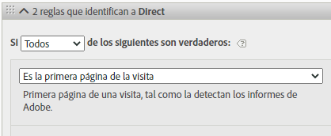
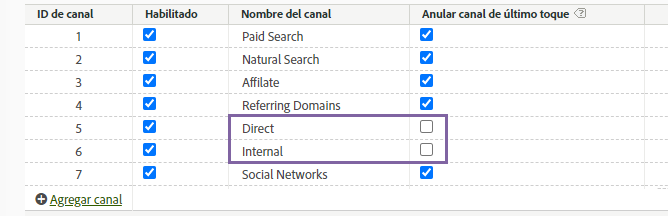

# Uso de dimensiones de canal de marketing en Adobe Experience Platform

Si su organización utiliza el [conector de origen de Analytics](https://experienceleague.adobe.com/docs/experience-platform/sources/connectors/adobe-applications/analytics.html?lang=es) para llevar los datos del grupo de informes a CJA, puede configurar una conexión en CJA para informar sobre las dimensiones del canal de marketing.

## Requisitos previos

* Los datos del grupo de informes ya deben estar importados en Adobe Experience Platform mediante el [conector de origen de Analytics](https://experienceleague.adobe.com/docs/experience-platform/sources/connectors/adobe-applications/analytics.html?lang=es). No se admiten otras fuentes de datos, ya que los canales de marketing dependen de las reglas de procesamiento de un grupo de informes de Analytics.
* Las reglas de procesamiento de canal de marketing ya deben estar configuradas. Consulte [Reglas de procesamiento para canales de marketing](https://experienceleague.adobe.com/docs/analytics/admin/admin-tools/manage-report-suites/edit-report-suite/marketing-channels/c-rules.html?lang=es) en la guía tradicional de componentes de Analytics.

## Elementos de esquema de canal de marketing

Una vez que haya establecido el conector de origen de Analytics en un grupo de informes deseado, se creará un esquema XDM. Este esquema contiene todas las dimensiones y métricas de Analytics como datos sin procesar. Estos datos sin procesar no contienen atribución ni persistencia. En su lugar, cada evento se ejecuta mediante reglas de procesamiento de canal de marketing y registra la primera regla que coincide. Especifique la atribución y la persistencia al crear una vista de datos en CJA.

1. [Cree una conexión](/help/connections/create-connection.md) que incluya un conjunto de datos basado en el conector de origen de Analytics.
2. [Cree una vista de datos](/help/data-views/create-dataview.md) que incluya las siguientes dimensiones:
   * **`channel.typeAtSource`**: equivalente a la dimensión [Canal de marketing](https://experienceleague.adobe.com/docs/analytics/components/dimensions/marketing-channel.html?lang=es).
   * **`channel._id`**: equivalente a los [Detalles de canal de marketing](https://experienceleague.adobe.com/docs/analytics/components/dimensions/marketing-detail.html?lang=es)
3. Proporcione a cada dimensión el modelo de atribución y la persistencia deseados. Si desea dimensiones de primer toque y de último toque, arrastre cada dimensión de canal de marketing al área de componentes varias veces. Proporcione a cada dimensión el modelo de atribución y la persistencia deseados. Adobe también recomienda asignar a cada dimensión un nombre para mostrar para facilitar su uso el Espacio de trabajo.
4. Cree la vista de datos.

Sus dimensiones de canal de marketing ya están disponibles para su uso en Analysis Workspace.

>[!NOTE]
>
> El conector de origen de Analytics requiere que ambos `channel.typeAtSource` (canal de marketing) y `channel._id` (Detalle del canal de marketing) se rellenen; de lo contrario, ninguno de los dos se transferirá a ExperienceEvent en XDM. Si el Detalle del canal de marketing está vacío en el grupo de informes de origen, el resultado es un `channel._id` en blanco y el conector de origen de Analytics también dejará en blanco `channel.typeAtSource`. Esto puede provocar diferencias en la creación de informes entre Adobe Analytics y Customer Journey Analytics.

## Diferencias de procesamiento y arquitectura

>[!IMPORTANT]
>
>Existen varias diferencias fundamentales entre los datos del grupo de informes y los datos de Platform. Adobe recomienda encarecidamente ajustar las reglas de procesamiento de canales de marketing del grupo de informes para facilitar una recopilación de datos adecuada en Platform.

>[!NOTE]
>
>Para maximizar la eficacia de los canales de marketing para Attribution IQ y Customer Journey Analytics, hemos publicado algunas [prácticas recomendadas revisadas](https://experienceleague.adobe.com/docs/analytics/components/marketing-channels/mchannel-best-practices.html?lang=es).

La configuración del canal de marketing funciona de forma diferente entre los datos de Platform y los datos del grupo de informes. Tenga en cuenta las siguientes diferencias al configurar canales de marketing para CJA:

* **Es la primera página de la visita**: este criterio de regla es común en varias definiciones predeterminadas de canales de marketing. Cualquier regla de procesamiento que contenga este criterio se ignora en Platform (se seguirán aplicando otros criterios de la misma regla). Las sesiones se determinan en el momento de la consulta de datos en lugar de en el momento de la recopilación de datos, lo que impide que Platform use estos criterios específicos de regla. Adobe recomienda volver a evaluar cualquier regla de procesamiento de canal de marketing que contenga el criterio “Es la primera página de la visita”, optando por enfoques alternativos que logren sus objetivos.

   

* **Anular canal de último contacto**: esta configuración del Administrador de canal de marketing normalmente impide que determinados canales obtengan crédito de canal de último contacto. Platform ignora esta configuración, lo que permite que canales generales como Directo o Interno atribuyan métricas de formas potencialmente no deseadas. Adobe recomienda eliminar canales en los que tenga la opción Anular canal de último contacto desactivada.
   * Puede eliminar el canal de marketing Directo en el Administrador de canal de marketing y, a continuación, basarse en el elemento de dimensión Sin valor de CJA para ese canal. También puede cambiar el nombre de este elemento de dimensión a Directo o excluir por completo el elemento de dimensión al configurar una vista de datos.
   * De forma alternativa, puede crear una clasificación de canal de marketing, que clasifica cada valor en sí mismo excepto para los canales que desee excluir en CJA. A continuación, puede utilizar esta dimensión de clasificación al crear una vista de datos en lugar de `channel.typeAtSource`.

   

* **Caducidad de canal de marketing**: esta configuración del período de participación determina el período de inactividad antes de que un visitante pueda obtener un nuevo canal de primer contacto en los datos del grupo de informes. Platform utiliza su propia configuración de atribución, por lo que esta configuración se ignora por completo en CJA.

   

## Comparación de datos entre CJA y Analytics tradicional

Debido a que la arquitectura de Adobe Experience Platform es diferente a un grupo de informes tradicional de Analytics, no se garantiza que los resultados coincidan. Sin embargo, puede utilizar las siguientes sugerencias para facilitar esta comparación:

* Compruebe que las diferencias arquitectónicas enumeradas anteriormente no afectan a la comparación. Esto incluye eliminar canales que no anulan el canal de último contacto, así como eliminar los criterios de regla que son el primer resultado de una visita (sesión).
* Asegúrese de que su conexión utiliza el mismo grupo de informes que Analytics tradicional. Si la conexión de CJA contiene varios grupos de informes con sus propias reglas de procesamiento de canal de marketing, no hay una manera fácil de compararla con Analytics tradicional. Desea crear una conexión independiente para cada grupo de informes con el fin de comparar los datos.
* Asegúrese de comparar los mismos intervalos de fechas y de que la configuración de la zona horaria de su vista de datos sea la misma que la del grupo de informes.
* Utilice un modelo de atribución personalizado cuando visualice los datos del grupo de informes. Por ejemplo, utilice la dimensión [Canal de marketing](https://experienceleague.adobe.com/docs/analytics/components/dimensions/marketing-channel.html?lang=es) con métricas que utilicen un modelo de atribución no predeterminado. Adobe aconseja no comparar las dimensiones predeterminadas [Canal de primer contacto](https://experienceleague.adobe.com/docs/analytics/components/dimensions/first-touch-channel.html?lang=es) o [Canal de último contacto](https://experienceleague.adobe.com/docs/analytics/components/dimensions/last-touch-channel.html?lang=es), porque dependen de la atribución recopilada en el grupo de informes. CJA no se basa en los datos de atribución de un grupo de informes; en su lugar, se calcula cuando se ejecuta un informe de CJA.
* Algunas métricas no tienen una comparación razonable debido a las diferencias de arquitectura entre los datos del grupo de informes y los datos de Platform. Algunos ejemplos son visitas/sesiones, visitantes/personas y ocurrencias/eventos.
