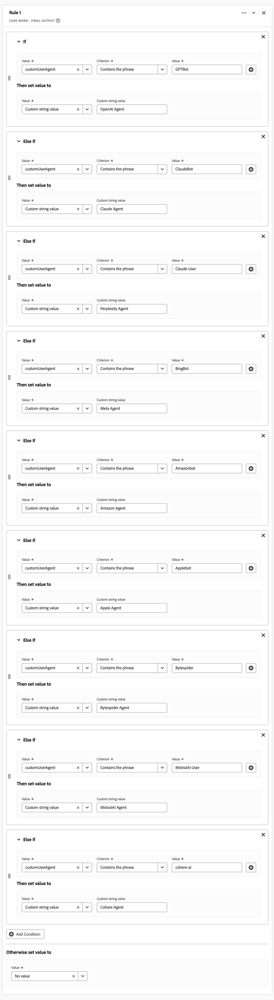
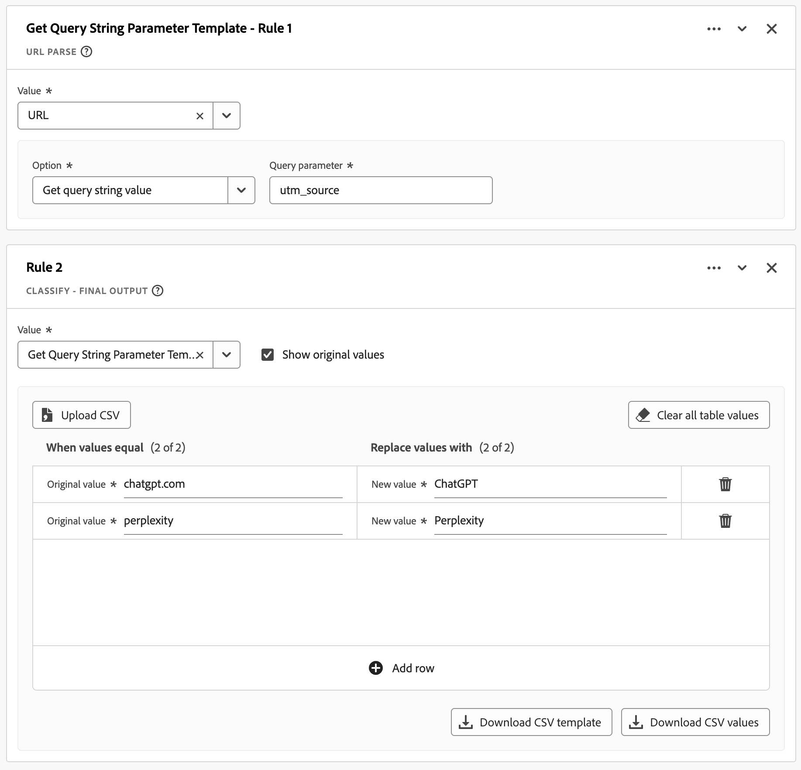
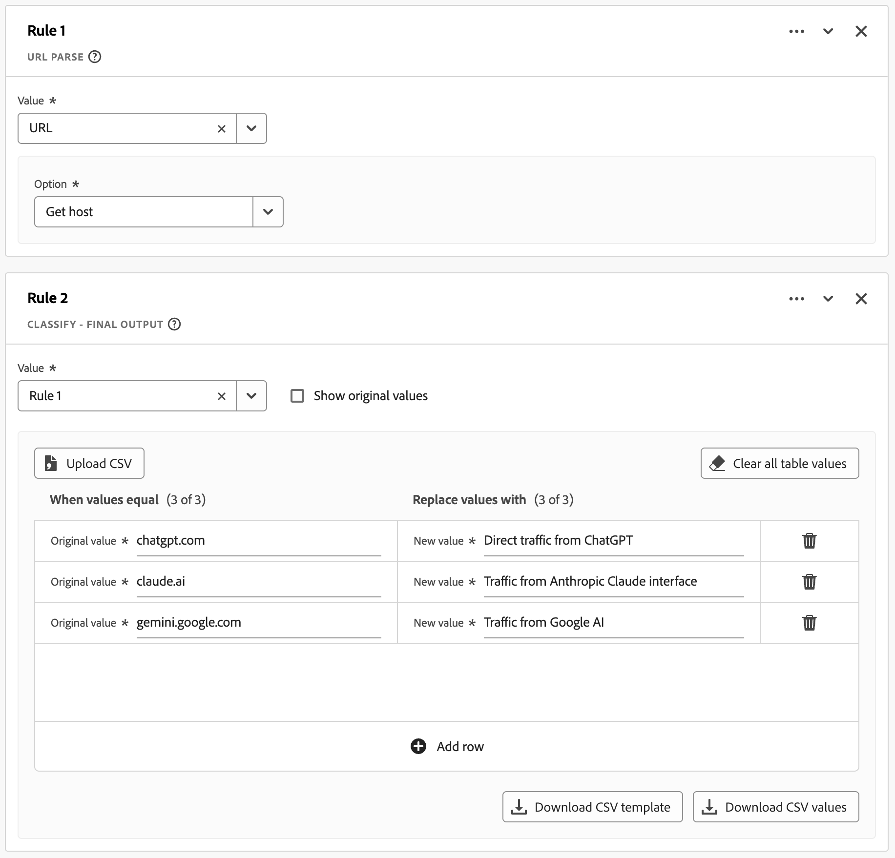
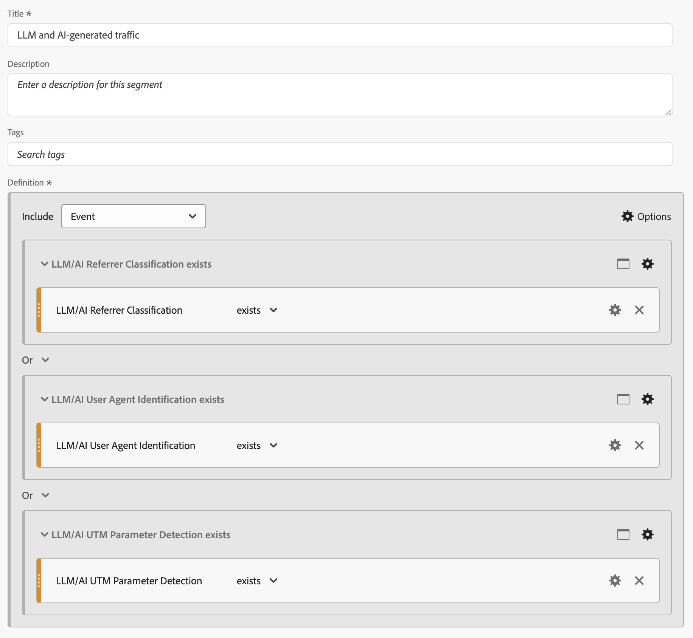
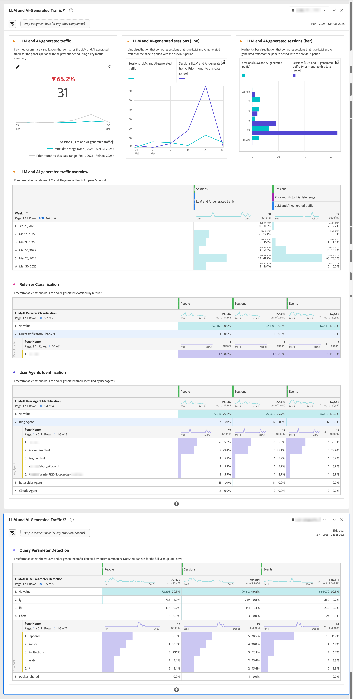

# Informe sobre el tráfico generado por LLM y AI

Este artículo de caso de uso explora cómo utilizar la capacidad Campos derivados de Customer Journey Analytics como base para informar sobre el tráfico generado por LLM (Modelo de lenguaje grande) y por IA.

>[!NOTE]
>
>La eficacia de los [métodos de detección](#detection-methods), las [firmas de detección](#detection-signatures) y las [estrategias de implementación](#implementation) depende de su método de recopilación de datos específico, la cobertura del conjunto de datos de Experience Platform y la implementación de Customer Journey Analytics. Los resultados pueden variar en función del entorno técnico, las políticas de gobernanza de datos y el enfoque de implementación. Al utilizar Experience Edge, deberá elegir entre registrar la cadena del agente de usuario sin procesar o recopilar información del dispositivo.
>

## Métodos de detección

Para detectar el tráfico generado por LLM y por IA, distinga entre:

* **Rastreadores LLM**: recopile datos para la formación y la recuperación de la generación aumentada (RAG).
* **agentes de IA**: funcionan como interfaces que realizan tareas en nombre de humanos. Los agentes de IA prefieren interactuar mediante API, que evita los métodos de seguimiento de análisis web. Sin embargo, aún puede analizar una parte significativa del tráfico generado por IA a través de sitios web.

Tres métodos de detección básicos comunes para identificar y supervisar el tráfico generado por LLM y por IA son:

* **Identificación de agente de usuario**: Cuando se realiza una solicitud al servidor, el encabezado HTTP User-Agent se extrae y se analiza comparándolo con patrones de agente y rastreador de IA conocidos. Este método del lado del servidor requiere acceso a los encabezados HTTP y es más eficaz cuando se implementa en la capa de recopilación de datos.
* **Clasificación de referente**: el encabezado Referente HTTP contiene la dirección URL de la página web anterior que se vinculó a la solicitud actual. Este encabezado revela cuándo los usuarios hacen clic en su sitio desde interfaces web como ChatGPT o Perplexity.
* **Detección de parámetros de consulta**: los servicios de IA pueden anexar parámetros de URL (especialmente parámetros de UTM) a los vínculos. Estos parámetros persisten en la dirección URL y se pueden detectar mediante implementaciones de análisis estándar, lo que convierte a estos parámetros de URL en indicadores valiosos incluso en escenarios de seguimiento del lado del cliente.

La siguiente tabla ilustra cómo se pueden utilizar los métodos de detección en diferentes escenarios de interacción de LLM e IA.

| Escenario | Identificación del agente de usuario | Clasificación de referente | Detección de parámetros de consulta |
|---|---|---|---|
| **Formación de un modelo** | El agente (`GPTBot`, `ClaudeBot` y más) se puede identificar cuando se implementa el registro en el lado del servidor. | No es posible realizar ninguna clasificación. Los rastreadores de IA no generan referentes durante la formación. | La detección es imposible. Los rastreadores de IA no añaden parámetros durante el aprendizaje. |
| **Exploración del agente** | El agente (`ChatGPT-User`, `claude-web`) se puede identificar cuando el registro del lado del servidor captura los encabezados. | La clasificación es posible si el agente navega desde una interfaz de IA con preservación de referente. | La detección a veces es posible si el servicio de IA agrega parámetros de seguimiento. |
| **Recuperación de generación aumentada (RAG) para responder a la consulta** | El agente (`OAI-SearchBot`, `PerplexityBot`) se puede identificar con el registro del lado del servidor. | No suele ser posible realizar clasificaciones, ya que las operaciones de RAG suelen omitir los mecanismos del referente. | La detección rara vez es posible a menos que la implemente específicamente el proveedor de IA. |
| **Clics del usuario hasta** | No se puede identificar el agente. El agente de IA aparece como un agente de usuario normal. | La clasificación es posible cuando los usuarios hacen clic en los vínculos de las interfaces de IA ([chat.com](https://chatgpt.com), [claude.ai](https://claude.ai) y más). | La detección es posible cuando los servicios de IA añaden parámetros de UTM a los vínculos de salida. |
| **Condiciones de visibilidad del tráfico** | Requerir integración de registro del lado del servidor con Customer Journey Analytics o etiquetado del lado del servidor para la identificación del agente. | La clasificación depende de las políticas de referente de la plataforma de IA y de la transmisión correcta del encabezado HTTP. | La detección requiere la preservación de parámetros mediante redirecciones y la recopilación de parámetros de URL adecuada. |

### Retos

Los agentes de LLM e IA muestran comportamientos complejos y en evolución al interactuar con propiedades digitales. Estas tecnologías funcionan de forma incoherente en todas las plataformas y versiones. Esta incoherencia crea desafíos únicos para los profesionales de los datos. Los patrones de comportamiento varían significativamente y dependen de la plataforma de IA específica, la versión y el modo de interacción utilizado. Esta diversidad operativa complica los esfuerzos por rastrear y categorizar el tráfico generado por LLM y la IA dentro de marcos de análisis estándar. La naturaleza compleja de estas interacciones, combinada con su rápida evolución, requiere métodos de detección y clasificación con matices para mantener la integridad de los datos:

* **Recopilación parcial de datos**: Algunos agentes de IA más recientes ejecutan JavaScript limitado, lo que da como resultado datos de análisis incompletos para implementaciones del lado del cliente. Como resultado, algunas interacciones se rastrean, mientras que otras interacciones se omiten.
* **Datos de sesión incoherentes**: los agentes de IA pueden ejecutar JavaScript de forma diferente en las sesiones o tipos de página. Esta diferencia de ejecución crea recorridos de usuario fragmentados en Customer Journey Analytics para implementaciones del lado del cliente.
* **Desafíos de detección**: con el seguimiento parcial, la detección no es fiable, ya que ciertos puntos de contacto pueden ser invisibles para Analytics.

## Firmas de detección

A partir de agosto de 2025, se pueden identificar las siguientes señales específicas para cada uno de los métodos de detección.

### Identificación del agente de usuario

<table>
<thead>
<tr>
<th>Rastreador</th>
<th>Cadena del agente de usuario</th>
<th>Objetivo/Comportamiento</th>
</tr>
</thead>
<tbody>
<tr>
<td><strong>GPTBot</strong></td>
<td><code>Mozilla/5.0 AppleWebKit/537.36 (KHTML, like Gecko); compatible; GPTBot/1.1; +<a href="https://openai.com/gptbot" target="_blank" rel="noopener nofollow noreferrer">https://openai.com/gptbot</a></code></td>
<td><a href="https://platform.openai.com/docs/bots/" target="_blank" rel="noopener nofollow noreferrer">Crawler web principal de OpenAI para entrenar modelos de ChatGPT y de idioma</a></td>
</tr>
<tr>
<td><strong>ChatGPT-User</strong></td>
<td><code>Mozilla/5.0 AppleWebKit/537.36 (KHTML, like Gecko); compatible; ChatGPT-User/1.0; +<a href="https://openai.com/bot" target="_blank" rel="noopener nofollow noreferrer">https://openai.com/bot</a></code></td>
<td><a href="https://platform.openai.com/docs/bots/" target="_blank" rel="noopener nofollow noreferrer">Se utiliza cuando ChatGPT explora sitios web en nombre de los usuarios (heredado)</a></td>
</tr>
<tr>
<td><strong>ChatGPT-User v2</strong></td>
<td><code>Mozilla/5.0 AppleWebKit/537.36 (KHTML, like Gecko); compatible; ChatGPT-User/2.0; +<a href="https://openai.com/bot" target="_blank" rel="noopener nofollow noreferrer">https://openai.com/bot</a></code></td>
<td><a href="https://platform.openai.com/docs/bots/" target="_blank" rel="noopener nofollow noreferrer">Versión actualizada de ChatGPT para búsqueda bajo demanda y búsquedas en respuesta</a></td>
</tr>
<tr>
<td><strong>OAI-SearchBot</strong></td>
<td><code>Mozilla/5.0 AppleWebKit/537.36 (KHTML, like Gecko); compatible; OAI-SearchBot/1.0; +<a href="https://openai.com/searchbot" target="_blank" rel="noopener nofollow noreferrer">https://openai.com/searchbot</a></code></td>
<td><a href="https://platform.openai.com/docs/bots/" target="_blank" rel="noopener nofollow noreferrer">Crawler de ChatGPT centrado en la búsqueda para descubrir contenido</a></td>
</tr>
<tr>
<td><strong>ClaudeBot</strong></td>
<td><code>Mozilla/5.0 AppleWebKit/537.36 (KHTML, like Gecko); compatible; ClaudeBot/1.0; +claudebot@anthropic.com</code></td>
<td><a href="https://support.claude.com/en/articles/8896518-does-anthropic-crawl-data-from-the-web-and-how-can-site-owners-block-the-crawler" target="_blank" rel="noopener nofollow noreferrer">Crawler de Anthropic para entrenar y actualizar el asistente de Claude AI</a></td>
</tr>
<tr>
<td><strong>Claude-User</strong></td>
<td><code>Mozilla/5.0 AppleWebKit/537.36 (KHTML, like Gecko; compatible; Claude-User/1.0; +Claude-User@anthropic.com)</code></td>
<td><a href="https://support.claude.com/en/articles/8896518-does-anthropic-crawl-data-from-the-web-and-how-can-site-owners-block-the-crawler" target="_blank" rel="noopener nofollow noreferrer">Apoya a los usuarios de Claude AI cuando las personas le hacen preguntas a Claude, puede acceder a sitios web usando un...</a></td>
</tr>
<tr>
<td><strong>Claude-SearchBot</strong></td>
<td><code>Mozilla/5.0 AppleWebKit/537.36 (KHTML, like Gecko; compatible; Claude-SearchBot/1.0; +Claude-SearchBot@anthropic.com)</code></td>
<td><a href="https://support.claude.com/en/articles/8896518-does-anthropic-crawl-data-from-the-web-and-how-can-site-owners-block-the-crawler" target="_blank" rel="noopener nofollow noreferrer">Navega por la web para mejorar la calidad de los resultados de búsqueda de los usuarios de Claude AI mediante el análisis de...</a></td>
</tr>
<tr>
<td><strong>PerplexityBot</strong></td>
<td><code>Mozilla/5.0 AppleWebKit/537.36 (KHTML, like Gecko; compatible; PerplexityBot/1.0; +<a href="https://www.perplexity.ai/perplexitybot" target="_blank" rel="noopener nofollow noreferrer">https://perplexity.ai/perplexitybot</a>)</code></td>
<td><a href="https://docs.perplexity.ai/guides/bots" target="_blank" rel="noopener nofollow noreferrer">El rastreador de Perplexity.ai para la indexación de datos web en tiempo real</a></td>
</tr>
<tr>
<td><strong>Perplejidad-Usuario</strong></td>
<td><code>Mozilla/5.0 AppleWebKit/537.36 (KHTML, like Gecko; compatible; Perplexity-User/1.0; +<a href="https://www.perplexity.ai/useragent" target="_blank" rel="noopener nofollow noreferrer">https://www.perplexity.ai/useragent</a>)</code></td>
<td><a href="https://docs.perplexity.ai/guides/bots" target="_blank" rel="noopener nofollow noreferrer">Carga páginas cuando los usuarios hacen clic en Citas de perplejidad (evita robots.txt)</a></td>
</tr>
<tr>
<td><strong>Google-Extended</strong></td>
<td><code>Mozilla/5.0 (compatible; Google-Extended/1.0; +<a href="https://support.google.com/webmasters/answer/182072" target="_blank" rel="noopener nofollow noreferrer">http://www.google.com/bot.html</a>)</code></td>
<td><a href="https://blog.google/technology/ai/an-update-on-web-publisher-controls/" target="_blank" rel="noopener nofollow noreferrer">Crawler de Google centrado en IA para Gemini separado del Googlebot estándar</a></td>
</tr>
<tr>
<td><strong>BingBot</strong></td>
<td><code>Mozilla/5.0 (compatible; BingBot/1.0; +<a href="http://www.bing.com/bot.html" target="_blank" rel="noopener nofollow noreferrer">http://www.bing.com/bot.html</a>)</code></td>
<td>Crawler de Microsoft que alimenta Bing Search y Bing Chat (Copilot)</td>
</tr>
<tr>
<td><strong>DuckAssistBot</strong></td>
<td><code>Mozilla/5.0 (compatible; DuckAssistBot/1.0; +<a href="https://duckduckgo.com/bot.html" target="_blank" rel="noopener nofollow noreferrer">http://www.duckduckgo.com/bot.html</a>)</code></td>
<td><a href="https://duckduckgo.com/duckduckgo-help-pages/results/duckassistbot" target="_blank" rel="noopener nofollow noreferrer">Rasca el contenido para DuckAssist, la función de respuesta de IA privada de DuckDuckGo</a></td>
</tr>
<tr>
<td><strong>YouBot</strong></td>
<td><code>Mozilla/5.0 (compatible; YouBot (+<a href="http://www.you.com" target="_blank" rel="noopener nofollow noreferrer">http://www.you.com</a>))</code></td>
<td>Rastreador detrás del asistente de búsqueda y explorador de IA de You.com</td>
</tr>
<tr>
<td><strong>meta-externalagent</strong></td>
<td><code>Mozilla/5.0 (compatible; meta-externalagent/1.1 (+<a href="https://developers.facebook.com/docs/sharing/webmasters/web-crawlers" target="_blank" rel="noopener nofollow noreferrer">https://developers.facebook.com/docs/sharing/webmasters/crawler</a>))</code></td>
<td><a href="https://developers.facebook.com/docs/sharing/webmasters/web-crawlers#identify-2" target="_blank" rel="noopener nofollow noreferrer">Bot de Meta para recopilar datos para entrenar o ajustar LLM</a></td>
</tr>
<tr>
<td><strong>Amazonbot</strong></td>
<td><code>Mozilla/5.0 (Macintosh; Intel Mac OS X 10_10_1) AppleWebKit/600.2.5 (KHTML, like Gecko) Version/8.0.2 Safari/600.2.5 (Amazonbot/0.1; +<a href="https://developer.amazon.com/amazonbot" target="_blank" rel="noopener nofollow noreferrer">https://developer.amazon.com/support/amazonbot</a>)</code></td>
<td><a href="https://developer.amazon.com/amazonbot" target="_blank" rel="noopener nofollow noreferrer">Crawler de Amazon para aplicaciones de búsqueda e IA</a></td>
</tr>
<tr>
<td><strong>Applebot</strong></td>
<td><code>Mozilla/5.0 (Macintosh; Intel Mac OS X 10_15_5) AppleWebKit/605.1.15 (KHTML, like Gecko) Version/13.1.1 Safari/605.1.15 (Applebot/0.1; +<a href="https://support.apple.com/kb/HT6619" target="_blank" rel="noopener nofollow noreferrer">http://www.apple.com/go/applebot</a>)</code></td>
<td><a href="https://support.apple.com/en-us/119829" target="_blank" rel="noopener nofollow noreferrer">Crawler de Apple para Spotlight, Siri y Safari</a></td>
</tr>
<tr>
<td><strong>Applebot-Extended</strong></td>
<td><code>Mozilla/5.0 (compatible; Applebot-Extended/1.0; +<a href="https://www.apple.com/bot.html" target="_blank" rel="noopener nofollow noreferrer">http://www.apple.com/bot.html</a>)</code></td>
<td><a href="https://support.apple.com/en-us/119829" target="_blank" rel="noopener nofollow noreferrer">Crawler centrado en IA de Apple para futuros modelos de IA (inclusión)</a></td>
</tr>
<tr>
<td><strong>Bytespider</strong></td>
<td><code>Mozilla/5.0 (compatible; Bytespider/1.0; +<a href="https://www.bytedance.com/bot.html" target="_blank" rel="noopener nofollow noreferrer">http://www.bytedance.com/bot.html</a>)</code></td>
<td>Recopilador de datos de IA de ByteDance para TikTok y otros servicios</td>
</tr>
<tr>
<td><strong>MistralAI-User</strong></td>
<td><code>Mozilla/5.0 (compatible; MistralAI-User/1.0; +<a href="https://mistral.ai/bot" target="_blank" rel="noopener nofollow noreferrer">https://mistral.ai/bot</a>)</code></td>
<td><a href="https://docs.mistral.ai/robots/" target="_blank" rel="noopener nofollow noreferrer">El buscador de citas en tiempo real de Mistral para el asistente de "Le Chat"</a></td>
</tr>
<tr>
<td><strong>cohere-ai</strong></td>
<td><code>Mozilla/5.0 (compatible; cohere-ai/1.0; +<a href="http://www.cohere.ai/bot.html" target="_blank" rel="noopener nofollow noreferrer">http://www.cohere.ai/bot.html</a>)</code></td>
<td>Recopila datos de texto para los modelos de idioma de Cohere</td>
</tr>
</tbody>
</table>

### Clasificación de referente

<table>
<thead>
<tr>
<th><strong>Fuente</strong></th>
<th><strong>Remitente del reenvío</strong></th>
<th><strong>Tipo de tráfico</strong></th>
</tr>
</thead>
<tbody>
<tr>
<td>ChatGPT</td>
<td>chatgpt.com</td>
<td>Tráfico directo desde la interfaz ChatGPT</td>
</tr>
<tr>
<td>Claude</td>
<td>claude.ai</td>
<td>Tráfico desde la interfaz de Claude de Anthropic</td>
</tr>
<tr>
<td>Google Gemini</td>
<td>gemini.google.com</td>
<td>Tráfico del asistente de IA de Google</td>
</tr>
<tr>
<td>Microsoft Copilot</td>
<td>copilot.microsoft.com</td>
<td>Tráfico del asistente de IA de Microsoft</td>
</tr>
<tr>
<td>Microsoft Copilot</td>
<td>m365.cloud.microsoft</td>
<td>Tráfico del asistente de IA de Microsoft (servicios en la nube de Microsoft 365)</td>
</tr>
<tr >
<td>Perplejidad AI</td>
<td>perplejidad.ai</td>
<td>Tráfico de la búsqueda de IA con citas</td>
</tr>
<tr>
<td>META AI</td>
<td>meta.ai</td>
<td>Tráfico del asistente de IA de Meta</td>
</tr>
</tbody>
</table>

### Detección de parámetros de consulta

<table>
<thead>
<tr>
<th><strong>Servicio LLM</strong></th>
<th>URL de ejemplo</th>
<th><strong>Parámetro de consulta</strong></th>
<th><strong>Valor de ejemplo</strong></th>
</tr>
</thead>
<tbody>
<tr>
<td>ChatGPT</td>
<td ><a href="https://www.yoursite.com/product?utm_source=chatgpt.com" target="_blank" rel="noopener nofollow noreferrer">https://www.yoursite.com/product?utm_source=chatgpt.com</a></td>
<td>utm_source</td>
<td>chatgpt.com</td>
</tr>
<tr>
<td>Perplejidad</td>
<td><a href="https://www.yoursite.com/article?utm_source=perplexity" target="_blank" rel="noopener nofollow noreferrer">https://www.yoursite.com/article?utm_source=perplexity</a></td>
<td>utm_source</td>
<td>confusión</td>
</tr>
</tbody>
</table>

## Implementación

Puede generar informes sobre el tráfico generado por LLM y por IA en una configuración típica de Customer Journey Analytics ([conexión](/help/connections/overview.md), [vistas de datos](/help/data-views/data-views.md) y [proyectos del espacio de trabajo](/help/analysis-workspace/home.md)) mediante la configuración específica de [campos derivados](#derived-fields), [segmentos](#segments) y [proyectos del espacio de trabajo](#workspace-project).

### Campos derivados

Para configurar métodos de detección y señales de detección, utilice campos derivados como base. Por ejemplo, defina campos derivados para [identificación del agente de usuario](#user-agent-identification), [detección de parámetros de consulta](#query-parameter-detection) y [clasificación de referente](#referrer-classification).

#### Identificación de agente de usuario LLM/AI

Utilice las funciones de campo derivadas [Case When](/help/data-views/derived-fields/derived-fields.md#case-when) para definir un campo derivado que identifique a los agentes de usuario de LLM/AI.

{zoomable="yes"}

#### Detección de parámetros de consulta LLM/AI

Use las funciones de campo derivado de [URL Parse](/help/data-views/derived-fields/derived-fields.md#url-parse) y [Classify](/help/data-views/derived-fields/derived-fields.md#classify) para definir un campo derivado que detecte parámetros de consulta.

{zoomable="yes"}

#### Clasificación de referente de LLM/AI

Utilice las funciones de campo derivadas [URL Parse](/help/data-views/derived-fields/derived-fields.md#url-parse) y [Classify](/help/data-views/derived-fields/derived-fields.md#classify) para definir un campo derivado que clasifique a los referentes.

{zoomable="yes"}

### Segmentos

Configure segmentos dedicados que le ayuden a identificar eventos, sesiones o personas relacionadas con el tráfico generado por LLM y IA. Por ejemplo, utilice los campos derivados que creó anteriormente para definir un segmento que identifique el tráfico generado por LLM y por IA.

{zoomable="yes"}

### proyecto de Workspace

Utilice los campos y segmentos derivados para informar y analizar el tráfico generado por LLM y por IA. Por ejemplo, consulte el proyecto anotado a continuación.

{zoomable="yes"}

>[!MORELIKETHIS]
>
>Este artículo de caso de uso se basa en el artículo de blog [Seguimiento y análisis del tráfico generado por LLM y IA en Adobe Customer Journey Analytics](https://experienceleaguecommunities.adobe.com/t5/adobe-analytics-blogs/tracking-and-analyzing-llm-and-ai-generated-traffic-in-adobe/ba-p/771967).
>
>
