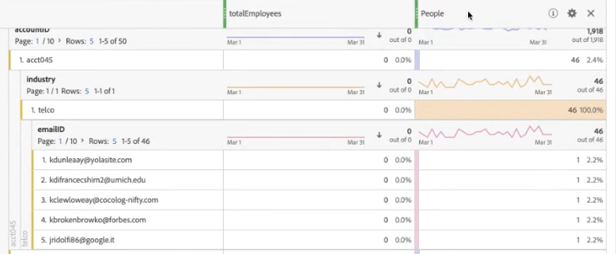

# (B2B) Añadir datos de nivel de cuenta como un conjunto de datos de búsqueda

Este caso de uso de B2B muestra cómo especificar los datos a nivel de cuenta en lugar de a nivel de persona para la análisis. La análisis de nivel de cuenta puede responder preguntas como

* ¿Qué nombre de compañía coincide con esta cuenta?
* ¿Cuántos empleados están asociados con esta cuenta o compañía?
* ¿Qué funciones se representan en esta cuenta?
* ¿Cómo funciona esta cuenta en su conjunto con respecto a una campaña de marketing específica, en comparación con otra cuenta?
* ¿Hay funciones determinadas (como el administrador de TI) en una cuenta que se comportan de forma diferente a la misma función en una cuenta diferente?

Todo esto se logra mediante la introducción de la información de nivel de cuenta como [búsqueda](/help/getting-started/cja-glossary.md) conjunto de datos (similar a las clasificaciones en Adobe Analytics tradicional).

Primero debe crear un esquema de búsqueda en Adobe Experience Platform y luego crear un conjunto de datos de tabla de búsqueda mediante la ingesta de datos de nivel de cuenta basados en .csv. A continuación, se crea una conexión CJA que combina distintos conjuntos de datos, incluido el de búsqueda que se ha creado. A continuación, cree una vista de datos y, finalmente, podrá utilizar todos estos datos en Workspace.

>[!NOTE]
>
>Las tablas de búsqueda pueden tener un tamaño de hasta 1 GB.

## 1. Crear esquema de búsqueda (Experience Platform)

Creación de su propio esquema para el [búsqueda](/help/getting-started/cja-glossary.md) garantiza que el conjunto de datos utilizado estará disponible en CJA con la configuración correcta (tipo de registro). La práctica recomendada es: [crear una clase de esquema personalizada](https://docs.adobe.com/content/help/en/experience-platform/xdm/tutorials/create-schema-ui.html#create-new-class) llamado &quot;Búsqueda&quot;, vacío de cualquier elemento, que se puede reutilizar para todas las tablas de búsqueda.

## 2. Crear conjunto de datos de búsqueda (Experience Platform)

Una vez creado el esquema, debe crear un conjunto de datos de búsqueda a partir de ese esquema, en Experience Platform. Este conjunto de datos de búsqueda contiene información de marketing de nivel de cuenta, como: Nombre de la compañía, número total de empleados, nombre de dominio, sector al que pertenecen, ingresos anuales, ya sean clientes actuales del Experience Platform o no, en qué fase de ventas se encuentran, en qué equipo de la cuenta se utiliza CJA, etc.

1. En Adobe Experience Platform, vaya a **[!UICONTROL gestión de datos > Conjuntos de datos]**.
1. Haga clic en **[!UICONTROL + Crear conjunto de datos]**.
1. Haga clic en **[!UICONTROL Crear conjunto de datos a partir de esquema]**.
1. Seleccione la clase de Esquema de búsqueda que ha creado.
1. Haga clic en **[!UICONTROL Siguiente]**.
1. Asigne un nombre al conjunto de datos (en nuestro ejemplo, Información B2B) y proporcione una descripción.
1. Haga clic en **[!UICONTROL Finalizar]**.

## 3. Combinar conjuntos de datos en una conexión (Customer Journey Analytics)

Para este ejemplo, combinamos 3 conjuntos de datos en una conexión CJA:

| Nombre del conjunto de datos | Descripción | Clase de Esquema AEP | Detalles del conjunto de datos |
|---|---|---|---|
| Impresión B2B | Contiene datos de flujo de navegación a nivel de evento a nivel de cuenta. Por ejemplo, contiene el ID de correo electrónico y el ID de cuenta correspondiente, así como el nombre de mercadotecnia, para ejecutar publicidades de mercadotecnia. También incluye las impresiones de esas publicidades, por usuario. | Basado en la clase de esquema XDM ExperienceEvent | El `emailID` se usa como identidad principal y se asigna un `Customer ID` área de nombres. Como resultado, se mostrará como el valor predeterminado **[!UICONTROL ID de persona]** en Customer Journey Analytics.  |
| Perfil B2B | Este conjunto de datos de perfil proporciona más información sobre los usuarios de una cuenta, como su puesto de trabajo, a qué cuenta pertenecen, su perfil de LinkedIn, etc. | Basado en la clase de esquema de Perfil individual XDM | No es necesario seleccionar `emailID` como ID principal en este esquema. Asegúrese de habilitar **[!UICONTROL Perfil]**; si no lo hace, CJA no podrá conectar el `emailID` en Perfil B2B con el `emailID` en los datos de impresión B2B. (Esta capacidad se denomina &quot;costura basada en campos&quot;).  |
| Información B2B | Consulte &quot;Creación de un conjunto de datos de búsqueda&quot; más arriba. | B2BAccount (clase de esquema de búsqueda personalizada) | La relación entre `accountID` y el conjunto de datos de Impresiones B2B se ha creado automáticamente conectando el conjunto de datos de información B2B con el conjunto de datos de Impresión B2B en CJA, como se describe en los pasos a continuación.  |

Así se combinan los conjuntos de datos:

1. En Customer Journey Analytics, seleccione la opción **[!UICONTROL Conexiones]** para abrir el Navegador.
1. Seleccione los conjuntos de datos (en nuestro ejemplo, los tres anteriores) que desee combinar.
1. (No estoy seguro de que este es el lugar al que pertenece el paso...) Para el conjunto de datos de B2B Info, seleccione la variable `accountID` que se utilizará en la tabla de búsqueda. A continuación, seleccione su clave coincidente (dimensión correspondiente), también `accountID` en el conjunto de datos de evento.
1. Haga clic en **[!UICONTROL Siguiente]**.
1. Asigne un nombre a la conexión y describa su configuración según [estas instrucciones](/help/connections/create-connection.md).
1. Haga clic en **[!UICONTROL Guardar]**.

Ahora se ingerirán los datos. El embarque de los datos y el establecimiento de la búsqueda tardan entre 2 y 4 horas, según el tamaño de la tabla de búsqueda.

## Crear una vista de datos a partir de esta conexión

Siga las instrucciones de [creación de vistas de datos](/help/data-views/create-dataview.md).

* Añada todos los componentes (dimensiones y métricas) que necesite de los conjuntos de datos.

## Analizar los datos en Workspace

Ahora puede crear proyectos de Workspace basados en los datos de los 3 conjuntos de datos.

Por ejemplo, puede encontrar respuestas a las respuestas planteadas en la introducción:

* Desglose emailID por accountID para averiguar a qué compañía pertenece un ID de correo electrónico.
* ¿Cuántos empleados se asignan a un ID de cuenta específico?
* ¿A qué sector pertenece un ID de cuenta?

