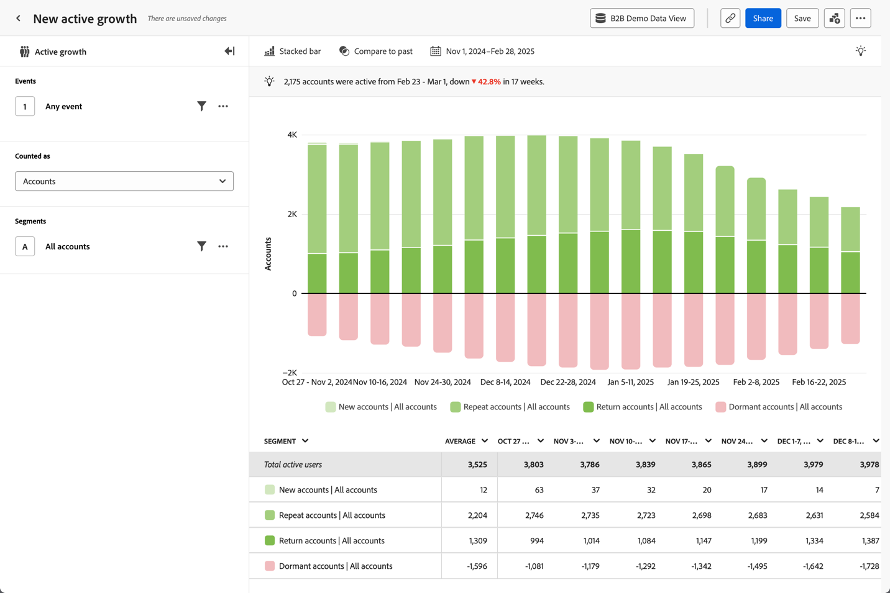
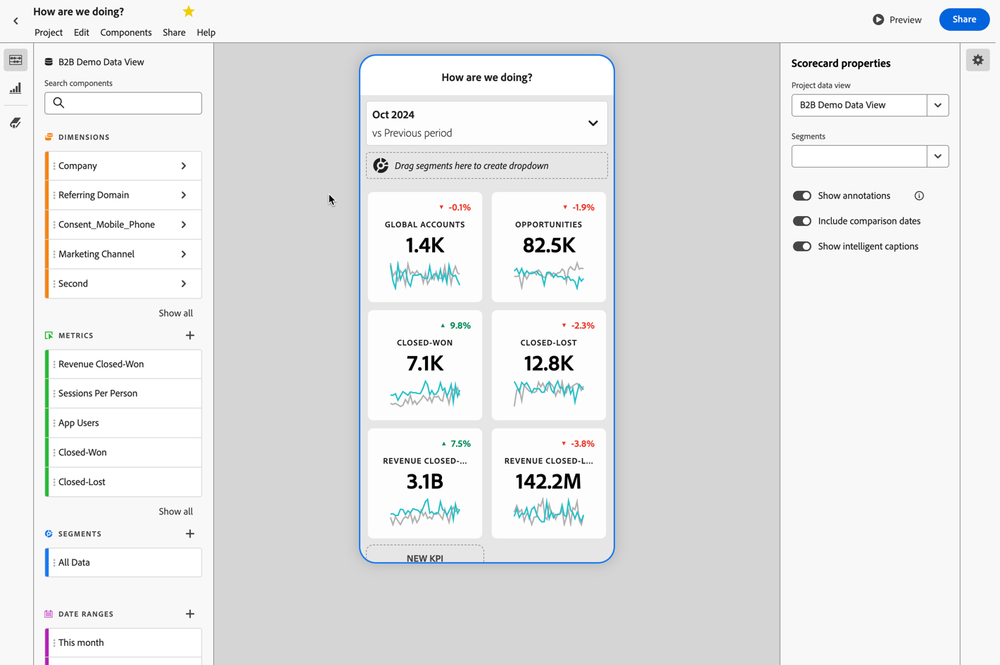

# Generar valor de producto

{{draft-b2b}}

Desea proporcionar perspectivas de valor de producto B2B a los gestores de producto, CMO o CEOs. Por ejemplo, a través de un análisis de pérdida impulsado por datos o predicaciones. Y hacer que estas perspectivas sean digeribles a través de paneles móviles.

Customer Journey Analytics B2B edition puede ayudarle a ofrecer perspectivas de valor del producto. Consulte las secciones siguientes para ver ejemplos.

## Reducir la pérdida

Desea identificar cuentas con bajo uso de productos, baja participación de marca y otros factores clave que indican un alto potencial de pérdida. Esta identificación temprana le permite desarrollar estrategias de activación de cuentas.

El análisis guiado de [Crecimiento activo](/help/guided-analysis/types/active-growth.md) puede ayudarle a determinar cómo:

* Derive perspectivas sobre el crecimiento y la adquisición de cuentas, oportunidades y usuarios durante un periodo específico.
* Detectar cuentas inactivas sin participación reciente. Para que pueda determinar una estrategia de renovación o ampliación de ventas.
* Asociarse con el éxito de sus clientes o con su organización de ventas para volver a activar las cuentas inactivas. Puede investigar el bajo uso y planificar las mejoras del producto para abordar la pérdida y superar la adopción lenta o estancada.

### Ejemplo

Desea ver el crecimiento activo neto en las cuentas nuevas, repetidas, de retorno e inactivas.

1. [Crear y configurar un análisis guiado de crecimiento activo](/help/guided-analysis/types/active-growth.md).
1. Seleccione **[!UICONTROL Cuentas]** como **[!UICONTROL Contadas como]**.
1. Seleccione la **[!UICONTROL configuración de gráfico]** preferida. Por ejemplo:  **[!UICONTROL Barra apilada]**.
1. Seleccione el  **[!UICONTROL Intervalo]** y el **[!UICONTROL Intervalo de fechas]** que prefiera.

## Democratizar perspectivas

Desea democratizar las perspectivas clave para los CMO y los CEO, de modo que puedan, por ejemplo, inspeccionar de un vistazo los datos de la cuenta y el uso del producto desde su dispositivo móvil.

Un [informe de valoración móvil](/help/mobile-app/home.md) puede ayudar a proporcionar estas perspectivas.

### Ejemplo

Desea crear un cuadro de resultados móvil que combine detalles sobre cuentas, oportunidades, oportunidades ganadas y perdidas cerradas y los ingresos asociados con esas oportunidades.

1. [Crear un cuadro de resultados móvil](/help/mobile-app/create-scorecard.md).
1. Defina el periodo sobre el que desea realizar el informe. Por ejemplo, **[!UICONTROL octubre de 2024 frente a período anterior]**.
1. Arrastre y suelte las métricas relevantes en el lienzo de la aplicación. Por ejemplo: **[!UICONTROL Cuentas globales]**, **[!UICONTROL Oportunidades]**, **[!UICONTROL Cerradas-Ganadas]**, **[!UICONTROL Cerradas-Perdidas]**, **[!UICONTROL Ingresos cerrados-Ganadas]** y **[!UICONTROL Ingresos-Cerrados-Perdidos]**.

   

1. Use **[!UICONTROL Vista previa]** para obtener una vista previa del tablero. El tablero ya está disponible en la aplicación de tablero de Adobe Analytics, disponible en [App Store](https://apps.apple.com/us/app/adobe-analytics-dashboards/id1509062264) o [Google Play](https://play.google.com/store/apps/details?id=com.adobe.analyticsdashboards).

   
