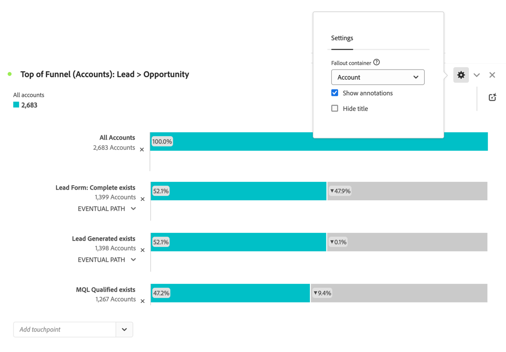
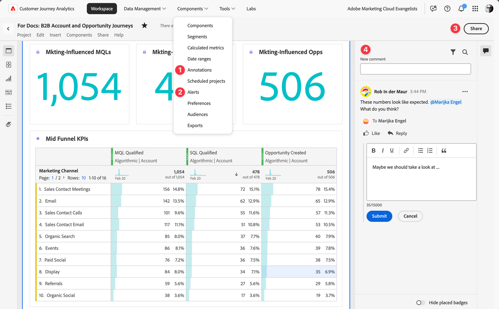

# Ampliación de cuentas clave

{{draft-b2b}}

El crecimiento y la conservación de las cuentas clave es una prioridad para las empresas B2B. Un requisito previo para garantizar que las ofertas progresan es comunicarse con las partes interesadas clave en sus cuentas de Target en el momento adecuado.

Cuando considere cómo aumentar las cuentas clave mediante nuevos movimientos de adquisición o retención o ampliación de venta, Customer Journey Analytics B2B edition le ayudará (al equipo de ventas y a los analistas empresariales) con perspectivas más detalladas sobre la progresión de la fase de ventas y la colaboración entre equipos. Consulte las secciones siguientes para ver ejemplos.

## Progresión de la fase de ventas

Desea generar y distribuir informes de conversión de posibles clientes específicos y comprender cómo progresan las cuentas a través del canal de ventas.

La visualización [Visitas en el orden previsto](/help/analysis-workspace/visualizations/fallout/fallout-flow.md) le permite visualizar las tasas de conversión y de abandono entre los pasos predefinidos en un recorrido secuencial.

### Ejemplo

Desea ver las visitas en el orden previsto de la parte superior del canal de ventas (de cliente potencial a oportunidad) para cuentas.

1. [Crear y configurar una visualización de abandonos](/help/analysis-workspace/visualizations/fallout/configuring-fallout.md).
1. Seleccione  para seleccionar **[!UICONTROL Account]** como el **[!UICONTROL contenedor de visitas en el orden previsto]**.
1. El primer punto de contacto debe leer **[!UICONTROL Todas las cuentas]**.
1. Agregar un nuevo punto de contacto: **[!UICONTROL Formulario de posible cliente: completo existe]**.
1. Agregar un nuevo punto de contacto: **[!UICONTROL Existe el posible cliente generado]**.
1. Agregar un nuevo punto de contacto: **[!UICONTROL Existe un MQL calificado]**.

   

## Colaboración

Desea mejorar la comunicación entre el equipo de ventas, marketing y productos. Las opciones disponibles para garantizar que todas las partes interesadas tengan una historia de datos unificada son alertas, anotaciones, comentarios en el proyecto y uso compartido de informes y visualizaciones.

Puede utilizar estas funciones de Customer Journey Analytics B2B edition:

1. [Anotaciones](/help/components/annotations/overview.md)
1. [Alertas inteligentes](/help/components/c-intelligent-alerts/intelligent-alerts.md)
1. [Compartir con usuarios de Workspace o con cualquier persona](/help/analysis-workspace/curate-share/share-projects.md)
1. [Comentarios](/help/analysis-workspace/build-workspace-project/comment-projects.md)
