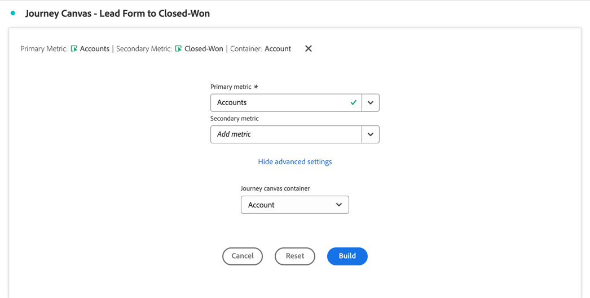
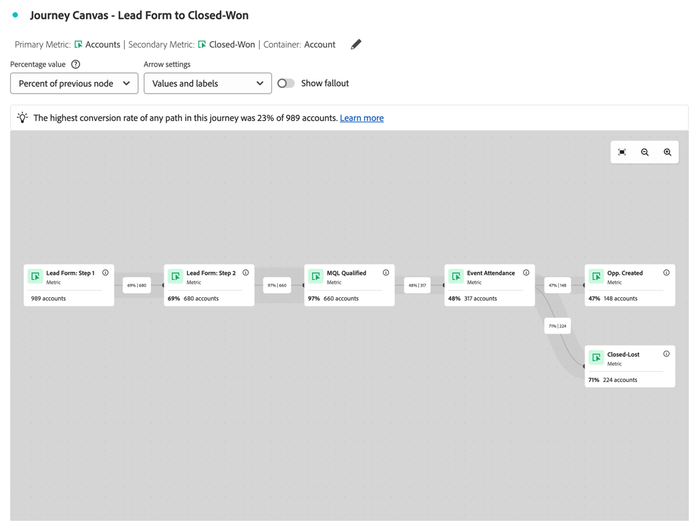
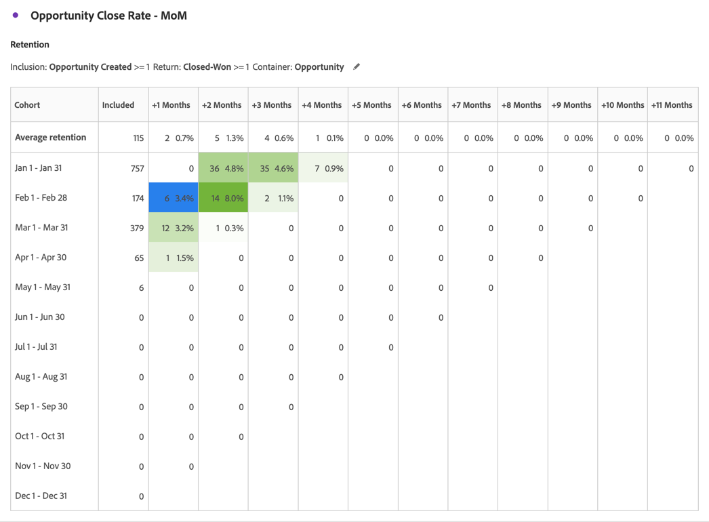
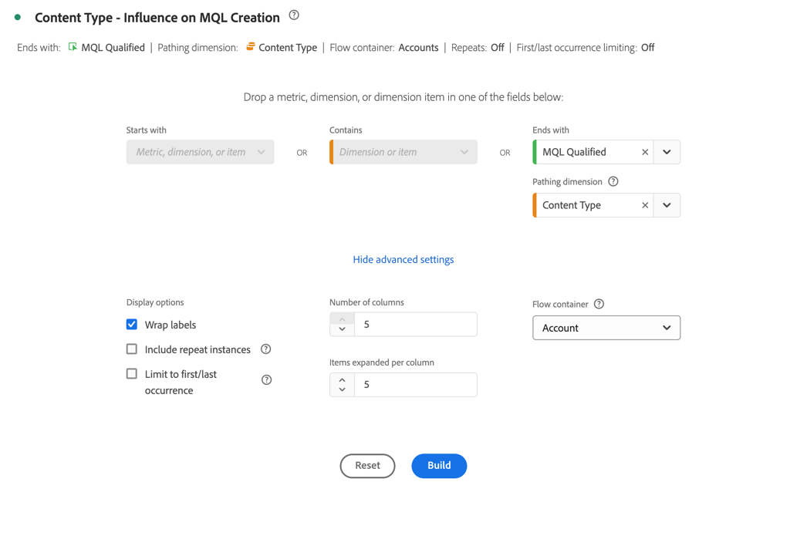
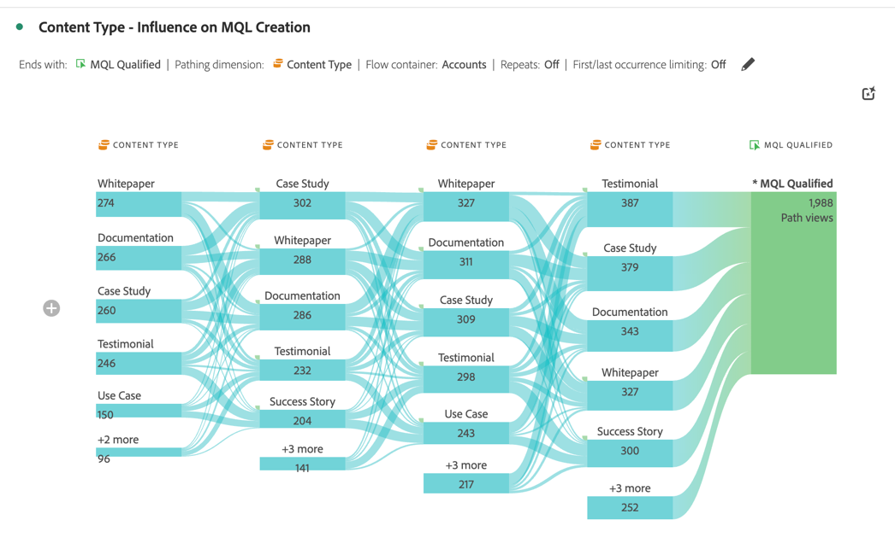

# Optimización del marketing de cuentas

{{draft-b2b}}

El marketing efectivo basado en cuentas requiere una comprensión profunda del recorrido de compra a nivel de cuenta. Por lo tanto, puede determinar las actividades de marketing más impactantes para cerrar el trato.

Para tener esta comprensión, desea analizar y explorar:

* Impacto de marketing:

   * En todas las campañas, canales y contenido.
   * Al comprar grupos dentro de cuentas,

* Progresión de canalización de ventas.
* Oportunidades de ampliación de venta y venta cruzada.
* Estado de la cuenta del cliente.

Customer Journey Analytics B2B edition puede ayudarle en la optimización del marketing de cuentas. Consulte las secciones siguientes para ver ejemplos.

## Participación de marketing basada en cuentas

Desea identificar qué experiencias, tanto en línea como sin conexión, son las más impactantes a la hora de impulsar oportunidades cerradas.

Utilice la visualización [lienzo de Recorrido](/help/analysis-workspace/visualizations/journey-canvas/journey-canvas.md) para asignar cada interacción entre cuentas, oportunidades, grupos de compras, campañas y canales con el fin de obtener información sobre lo que funciona en el marketing de su cuenta y sobre dónde puede mejorar.

Una visualización de lienzo de recorrido le ayuda a lo siguiente:

* Ver la historia completa. Por ejemplo, puede mostrar una ruta detallada de una cuenta de alto valor *specific* o un grupo de compra que incluya todas las interacciones en línea y sin conexión conocidas.
* Contextualice los momentos clave que conducen a hitos críticos o los siguen (por ejemplo: un déclencheur de posible cliente calificado de marketing o la creación de oportunidades).
* Admite al personal de ventas a través del historial de interacciones de la visualización en cuentas específicas. Esta visualización permite mantener conversaciones relevantes.

### Ejemplo

Desea visualizar el recorrido de un formulario de posible cliente a un won cerrado.

1. [Crear y configurar una visualización de lienzo de Recorrido](/help/analysis-workspace/visualizations/journey-canvas/configure-journey-canvas.md).
1. Configurar **[!UICONTROL Cuenta]** como **[!UICONTROL métrica principal]**.
1. Asegúrese de seleccionar **[!UICONTROL Cuenta]** como **[!UICONTROL contenedor de lienzo de Recorrido]**.

   

1. Seleccione **[!UICONTROL Generar]**.
1. Arrastre y suelte los nodos en el lienzo y conéctelos para ilustrar el recorrido de la cuenta. Por ejemplo: de **[!UICONTROL Formulario de cliente potencial: Paso 1]** formulario a **[!UICONTROL Opp. Se creó]**.

   

## Segmentación de cohortes

Quieres identificar un grupo clave de compradores para activar estos grupos de compradores en otros canales, como medios de pago, correo electrónico o medios sociales.

Utilice la visualización [Tabla de cohortes](/help/analysis-workspace/visualizations/cohort-table/cohort-analysis.md) para agrupar entidades B2B (cuentas, oportunidades, grupos de compra) en función de un punto de partida compartido (como una fecha de posible cliente de calificación de mercado (MQL)). Y realice un seguimiento del progreso de cada una de estas entidades a lo largo del tiempo en etapas o hitos posteriores.

Una visualización de tabla de cohorte le ayuda a lo siguiente:

* Analice la rapidez con la que las cohortes de cuentas u oportunidades alcanzan hitos clave (por ejemplo, de un posible cliente cualificado para marketing a uno cualificado para ventas) a lo largo de semanas o meses.
* Identifique si determinadas cohortes (por segmento, origen de campaña, tipo de grupo de compra) se mueven más rápido a través del ciclo de ventas que otras cohortes.
* Se evalúa si las iniciativas estratégicas (por ejemplo: campañas de marketing) se correlacionan con plazos de progresión más cortos para cohortes subsiguientes.

### Ejemplo

Desea ver cohortes mensuales de oportunidades cerradas.

1. [Crear y configurar una visualización de tabla de cohorte](/help/analysis-workspace/visualizations/cohort-table/t-cohort.md).
1. Usar **[!UICONTROL oportunidad creada]** como métrica de **[!UICONTROL criterios de inclusión]**. Seleccione **[!UICONTROL >=]** como operador e introduzca el valor `1`.
1. Use **[!UICONTROL Cerrado-Ganado]** como métrica de **[!UICONTROL Criterios de retorno]**. Seleccione **[!UICONTROL >=]** como operador e introduzca el valor `1`.
1. Seleccione **[!UICONTROL Oportunidad]** como contenedor.

   

1. Seleccione **[!UICONTROL Generar]**. Consulte a continuación un ejemplo de tabla de cohorte.

   

## Eventos en persona

Desea informar sobre la cuenta de dedicada y la actividad de visualización en varios eventos presenciales. Por lo tanto, puede analizar y optimizar el impacto de la asistencia a eventos en persona.

Una visualización de [flujo](/help/analysis-workspace/visualizations/c-flow/flow.md) le permite visualizar las rutas que los usuarios, pero ahora también las cuentas o los grupos compradores, siguen entre interacciones o etapas a lo largo del tiempo.

Una visualización de flujo le ayuda a lo siguiente:

* Identifique las secuencias más frecuentes de puntos de contacto atravesados por entidades B2B (por ejemplo: desde *Visita al sitio* hasta *Descarga de documento técnico* hasta *Solicitud de demostración*).
* Visualice cómo las cuentas o los grupos de compra navegan de forma no lineal (por ejemplo: retroceden, omiten etapas o toman rutas inesperadas).
* Céntrese en el flujo antes o después de una interacción crítica (por ejemplo: una solicitud de demostración) para comprender a qué factores contribuyen o qué acciones siguen después de la interacción.

### Ejemplo

Desea visualizar la influencia en la generación de MQL (posibles clientes cualificados para marketing).

1. [Crear y configurar una visualización de flujo](/help/analysis-workspace/visualizations/c-flow/create-flow.md).
1. Seleccione **[!UICONTROL MQL calificado]** para **[!UICONTROL Finalizar con]**.
1. Seleccione **[!UICONTROL Tipo de contenido]** para **[!UICONTROL Dimensión de las rutas]**.
1. Seleccione **[!UICONTROL Mostrar configuración avanzada]**.
1. Escriba `5` para **[!UICONTROL Número de columnas]**.
1. Seleccione **[!UICONTROL Cuenta]** para el **[!UICONTROL contenedor de flujo]**.

   

1. Seleccione **[!UICONTROL Generar]**.

   
