# Configuración para casos de uso de B2B edition

Este artículo describe una configuración típica de Customer Journey Analytics B2B edition para admitir los siguientes casos de uso:

* [Optimización del marketing de cuentas](optimize-account-marketing.md)
* [Ampliación de cuentas clave](grow-key-accounts.md)
* [Generar valor de producto](build-product-value.md)

>[!NOTE]
>
>Los datos de demostración y las capturas de pantalla que se utilizan en estos casos de uso son solo para fines ilustrativos y no reflejan datos del mundo real.

## Referencia de diseño de solución

Antes de configurar Customer Journey Analytics B2B edition, asegúrese de que dispone de una referencia de diseño de solución adecuada que documente cada uno de los campos que recopile.

Una referencia de diseño de solución de ejemplo podría tener el siguiente aspecto:

+++ Dimensiones de evento

| Nombre de Dimension |
|---|
| ID de cuenta |
| Nombre de la cuenta |
| ID de grupo de compras |
| Centro de llamadas |
| ID de representante del centro de llamadas |
| ID de llamada |
| Código de seguimiento de campaña |
| ID de contenido |
| Tipo de contenido |
| Fuente de datos |
| Tipo de dispositivo |
| Detalles del evento |
| Nombre del evento |
| Canal |
| Canal de interacción |
| ID de posible cliente |
| Canal de marketing |
| ID de evento de marketing |
| Tipo de evento de marketing |
| ID de oportunidad |
| Página |
| Detalles de página |
| Dominio de referencia |
| Identificador de representante de ventas |
| Nombre de fase de ventas |
| Número de fase de ventas |
| Sección del sitio |
| SKU |
| ID de cuenta subsidiaria |
| ID de encuesta |
| Puntuación de satisfacción de encuesta |
| Tipo de encuesta |
| ID de usuario |

+++

+++ Métricas de evento

| Nombre de la métrica | Tipo de evento |
|---|---|
| Creación de cuenta: completada | Contador |
| Creación de cuentas: inicio | Contador |
| Coste de llamada | Moneda |
| Duración de la llamada | Contador |
| Puntuación de satisfacción de llamada | Numéricos |
| Encuestas de llamadas completadas | Contador |
| Llamadas | Contador |
| Cerrado-Perdido | Contador |
| Cerrado-Ganado | Contador |
| Vistas de contenido | Contador |
| Visualización de pulsaciones de moneda de tamaño de acuerdo | Contador |
| Mostrar impresiones | Contador |
| Correo electrónico rechazado | Contador |
| Correo electrónico clicado | Contador |
| Correo electrónico enviado | Contador |
| Correo electrónico abierto | Contador |
| Correo electrónico enviado | Contador |
| Asistencia a evento | Contador |
| Registro de eventos: completado | Contador |
| Registro de eventos: paso 1 | Contador |
| Registro de eventos: paso 2 | Contador |
| Registro de eventos: paso 3 | Contador |
| Llamada de entrada numérica de puntuación de satisfacción global | Contador |
| Formulario de cliente potencial: completado | Contador |
| Formulario de cliente potencial: Paso 1 | Contador |
| Formulario de cliente potencial: Paso 2 | Contador |
| Posible cliente generado | Contador |
| Calificación del posible cliente | Contador |
| Reuniones | Contador |
| MQL descalificado | Contador |
| Calificado para MQL | Contador |
| Evaluación de necesidades | Contador |
| Negociación | Contador |
| Tratamiento de objeciones | Contador |
| Oportunidades | Contador |
| Creación de oportunidad | Contador |
| Pedidos | Contador |
| Llamada saliente | Contador |
| Seguimiento posterior a la venta | Contador |
| Presentación de propuestas | Contador |
| Ingresos cerrados-perdidos | Moneda |
| Ingresos ganados a puerta cerrada | Moneda |
| Llamadas de contacto de ventas | Contador |
| Fase de ventas iniciada | Contador |
| Pulsaciones por SMS | Contador |
| SMS enviado | Contador |
| Pulsaciones sociales | Contador |
| Impresiones sociales | Contador |
| Presentación de soluciones | Contador |
| SQL descalificado | Contador |
| SQL cualificado | Contador |
| Unidades (no exponer) | Contador |
| Puntuación de satisfacción de encuesta VoC | Numéricos |
| Encuestas de VoC completadas | Contador |

+++

+++ Registros de persona

| Nombre del campo de vista de datos | Tipo de campo |
|---|---|
| Edad | Métrica |
| Grupo de edad | Dimensión |
| Nivel de afinidad de categoría 1 | Dimensión |
| Puntuación de afinidad de categoría 1 | Métrica |
| Nivel de afinidad de categoría 2 | Dimensión |
| Puntuación de afinidad de categoría 2 | Métrica |
| Nivel de afinidad de categoría 3 | Dimensión |
| Puntuación de afinidad de categoría 3 | Métrica |
| Nivel de afinidad de categoría 4 | Dimensión |
| Puntuación de afinidad de categoría 4 | Métrica |
| Nivel de afinidad de categoría 5 | Dimensión |
| Puntuación de afinidad de categoría 5 | Métrica |
| Advertising de consentimiento | Dimensión |
| Consentimiento de todas las comunicaciones | Dimensión |
| Correo directo de consentimiento | Dimensión |
| Correo electrónico de consentimiento | Dimensión |
| Teléfono móvil de consentimiento | Dimensión |
| Personalization de consentimiento | Dimensión |
| Compartir datos de consentimiento | Dimensión |
| SMS de consentimiento | Dimensión |
| Correo electrónico | Dimensión |
| Nombre | Dimensión |
| Género | Dimensión |
| Ciudad individual | Dimensión |
| Nivel de CLTV individual | Dimensión |
| Puntuación de CLTV individual | Métrica |
| País individual | Dimensión |
| Teléfono individual | Dimensión |
| Código postal individual | Dimensión |
| Tendencia individual a comprar nivel | Dimensión |
| Puntuación de propensión individual a comprar | Métrica |
| Tendencia individual al nivel de pérdida | Dimensión |
| Puntuación de tendencia a pérdida individual | Métrica |
| Tendencia individual a actualizar el nivel | Dimensión |
| Tendencia individual a actualizar la puntuación | Métrica |
| Estado individual | Dimensión |
| Dirección física individual | Dimensión |
| Puesto de trabajo | Dimensión |
| Apellidos | Dimensión |
| Puntuación de Net Promoter | Métrica |
| Estado de Net Promoter | Dimensión |
| Tipo de rol | Dimensión |

+++

+++ Registros de cuenta

| Nombre del campo de vista de datos | Tipo de campo |
|---|---|
| Ingresos anuales | Métrica |
| Ciudad de empresa | Dimensión |
| Empresa CLTV Level | Dimensión |
| Puntuación de CLTV de la empresa | Métrica |
| País de empresa | Dimensión |
| Nombre de la empresa | Dimensión |
| Teléfono de empresa | Dimensión |
| Código postal de la empresa | Dimensión |
| Tendencia de la compañía a comprar nivel | Dimensión |
| Tendencia de la empresa a comprar puntuación | Métrica |
| Tendencia de la compañía a niveles de pérdida | Dimensión |
| Puntuación de tendencia a pérdida de la empresa | Métrica |
| Tendencia de la compañía a actualizar nivel | Dimensión |
| Tendencia de la empresa a actualizar la puntuación | Métrica |
| Tamaño de empresa | Dimensión |
| Estado de empresa | Dimensión |
| Dirección de la empresa | Dimensión |
| de la industria | Dimensión |
| Número de empleados | Métrica |
| Audiencia de partners: compradores de hardware | Dimensión |
| Audiencia de partners: rápido crecimiento | Dimensión |
| Audiencia de socios: servicios necesarios | Dimensión |
| Audiencia de partners: compradores de software | Dimensión |
| Intervalo de ingresos | Dimensión |
| Sitio web | Dimensión |

+++

+++ Registros de SKU

| Nombre del campo de vista de datos | Tipo de campo |
|---|---|
| Categoría de productos de hardware | Dimensión |
| Nombre de producto de hardware | Dimensión |
| Categoría de servicio | Dimensión |
| Nombre del servicio | Dimensión |
| Categoría de productos de software | Dimensión |
| Nombre de producto de software | Dimensión |

+++

## Esquemas y conjuntos de datos

Los datos que admiten la referencia de diseño de la solución se estructuran con los siguientes esquemas y conjuntos de datos.

### Datos de evento

Las dimensiones y métricas de evento se admiten a través de un esquema basado en series temporales (eventos) y uno o más conjuntos de datos que contienen datos de evento.

<!--For example: the Account ID field is mapped to **[!UICONTROL Account ID]**. See below for a preview of the data typically available in such a dataset.

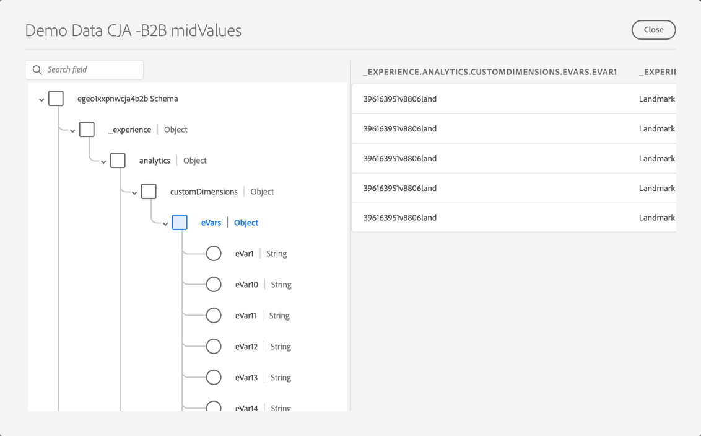-->

### Datos de persona

Los registros de persona son compatibles mediante un esquema basado en registros (perfiles) y uno o más conjuntos de datos que contienen datos de persona. Consulte a continuación un ejemplo de datos de persona (basados en la referencia de diseño de la solución de ejemplo) disponibles normalmente en un conjunto de datos de este tipo.

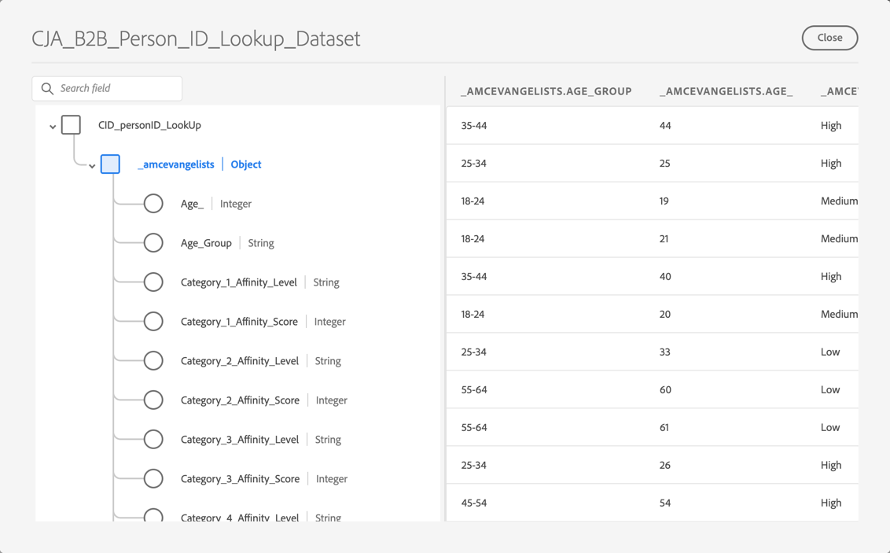

### Datos de cuenta

Los registros de cuenta se admiten a través de un esquema basado en registros (búsqueda) y uno o más conjuntos de datos que contienen datos de cuenta. Consulte a continuación un ejemplo de datos de cuenta (basados en la referencia de diseño de la solución de ejemplo) disponibles normalmente en un conjunto de datos de este tipo.

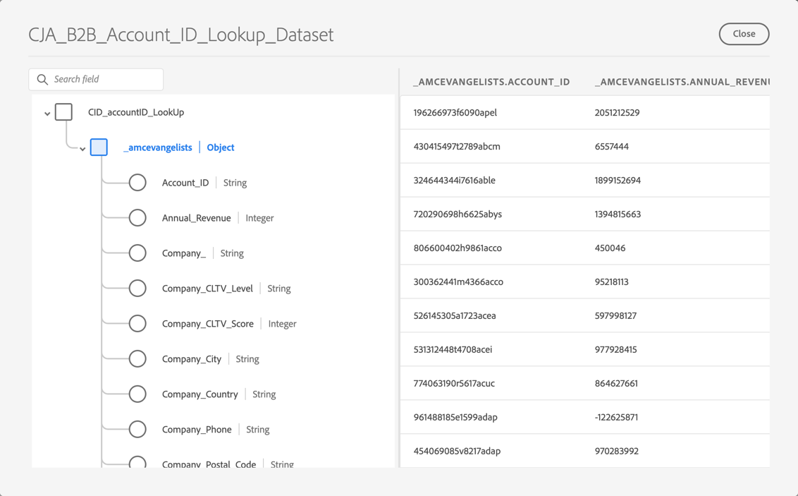

### Datos de SKU

Los registros SKU son compatibles mediante un esquema basado en registros (búsqueda) y uno o más conjuntos de datos que contienen datos SKU. Consulte a continuación un ejemplo de los datos de SKU (basados en la referencia de diseño de la solución de ejemplo) disponibles normalmente en un conjunto de datos de este tipo.

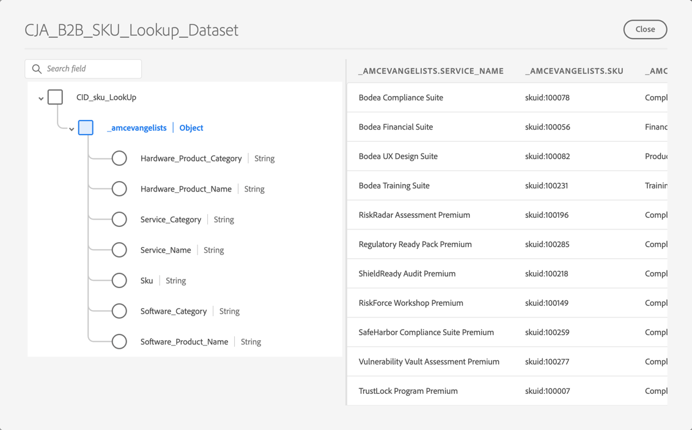

## Conexión

Defina una conexión basada en cuentas en Customer Journey Analytics para introducir y unir registros de los conjuntos de datos de evento, cuenta, persona y SKU.

1. [Crear una nueva conexión](/help/connections/create-connection.md) en Customer Journey Analytics.
1. Introduzca un nombre descriptivo y una descripción para la conexión.
1. Seleccione  **[!UICONTROL Cuenta]** como **[!UICONTROL ID principal]**.
1. Seleccionar todos los **[!UICONTROL contenedores opcionales]**.
1. Seleccione la zona protegida preferida y estime la cantidad promedio de eventos diarios.

   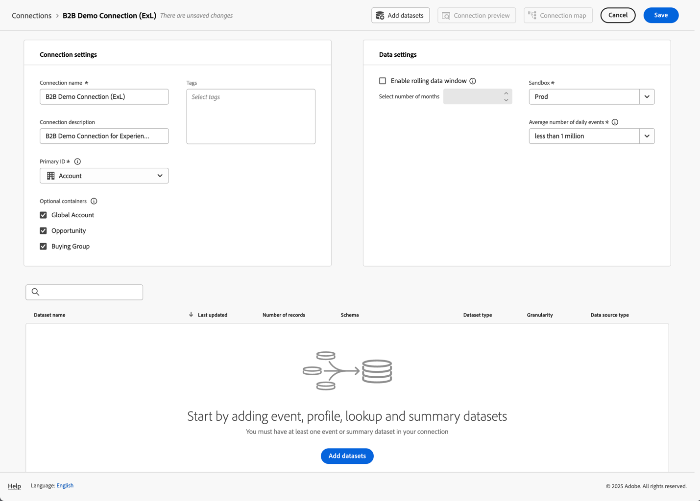

1. Seleccione **[!UICONTROL Agregar conjuntos de datos]** y agregue los conjuntos de datos B2B que contienen los datos de eventos, cuentas, personas y SKU.

   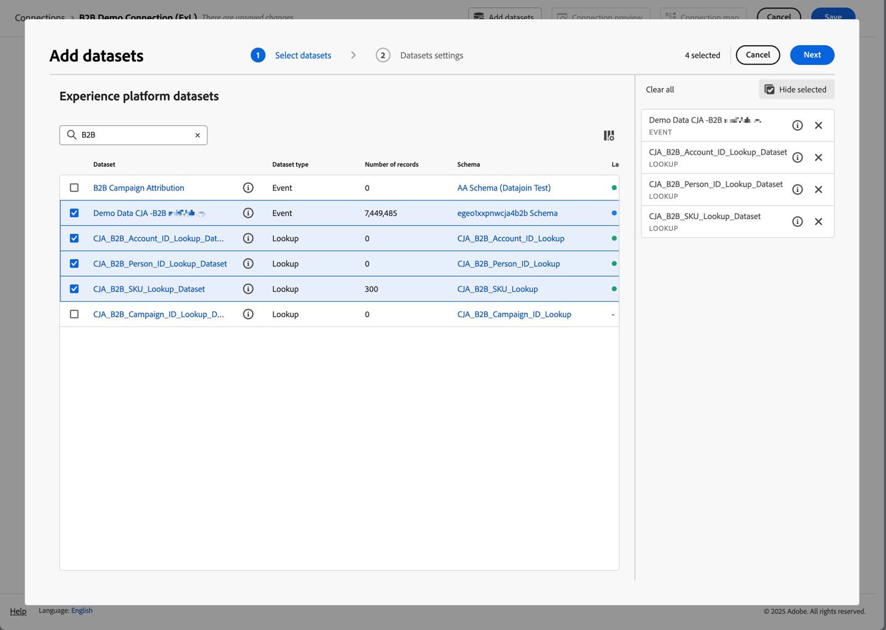

1. Seleccione **[!UICONTROL Siguiente]** para establecer la configuración de cada uno de los conjuntos de datos seleccionados.
1. Para el conjunto de datos de evento, asegúrese de seleccionar los campos apropiados que correspondan a las identidades de **[!UICONTROL ID de cuenta]**, **[!UICONTROL ID de cuenta global]**, **[!UICONTROL ID de oportunidad]**, **[!UICONTROL ID de grupo de compra]** e **[!UICONTROL ID de persona]**.

   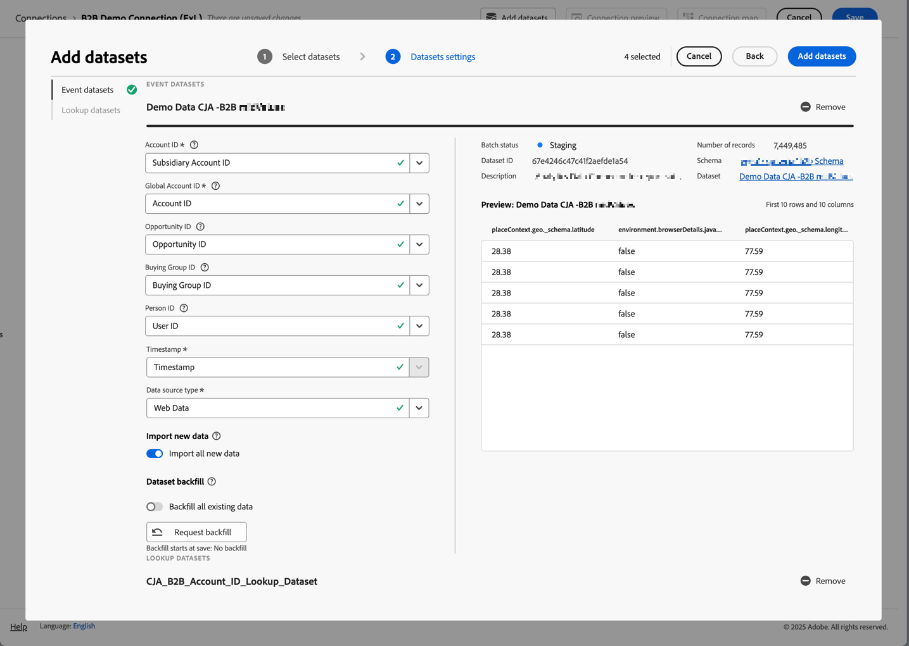

1. Desplácese hacia abajo para configurar el conjunto de datos de registros de cuenta. Asegúrese de seleccionar el identificador correcto (**[!UICONTROL Account_ID]**) para que coincida con la cuenta a través del contenedor de **[!UICONTROL Cuenta global]**. Seleccione el identificador correcto (**[!UICONTROL Account_ID]**) como **[!UICONTROL campo Cuenta global]**.

   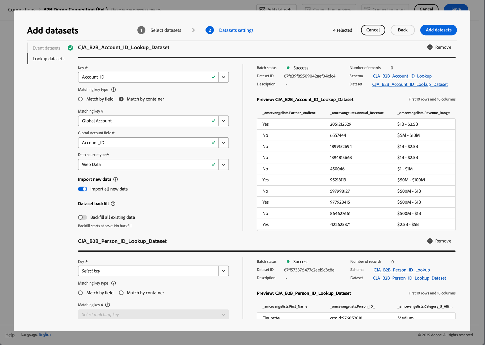

1. Desplácese hacia abajo para configurar el conjunto de datos de registros de personas. Asegúrese de seleccionar la clave correcta (**[!UICONTROL Person_ID]**) para que coincida con la persona por el contenedor **[!UICONTROL Person]**. Seleccione la identidad adecuada (**[!UICONTROL Profile_Account_ID_Individual]**) para que coincida con el campo **[!UICONTROL Cuenta global]**.

   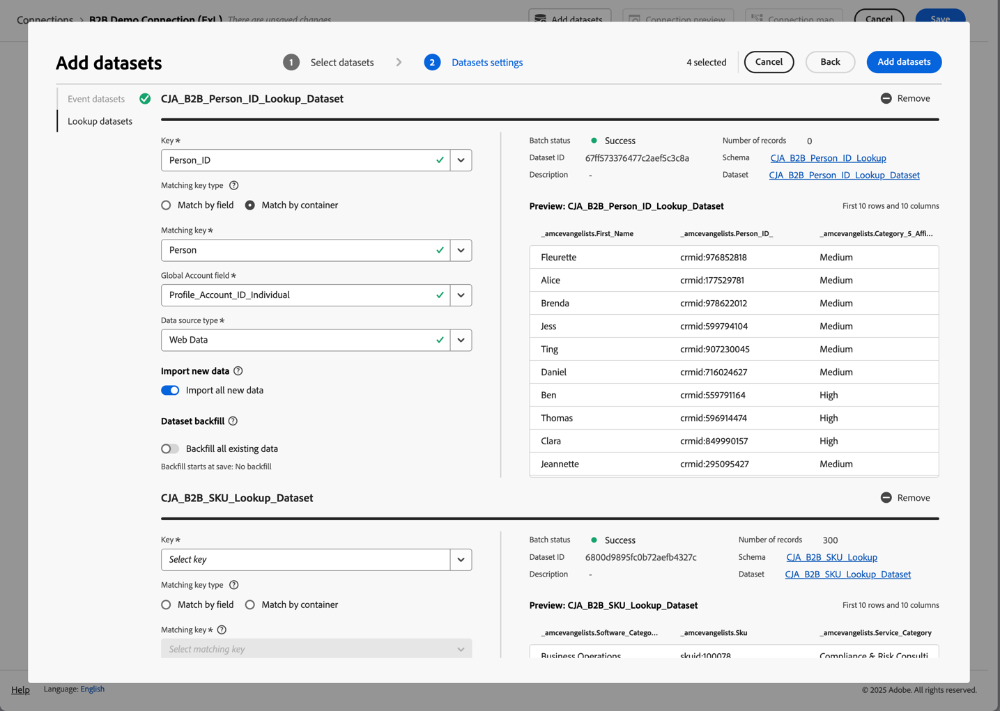

1. Desplácese hacia abajo para configurar el conjunto de datos de registros SKU. Asegúrese de seleccionar la clave correcta (**[!UICONTROL Sku]**). Seleccione **[!UICONTROL Coincidir por campo]** porque no hay ningún contenedor configurado o disponible para estos datos. Seleccione el campo SKU en el conjunto de datos de evento (**[!UICONTROL SKU (conjuntos de datos de evento)]**) como clave coincidente.

   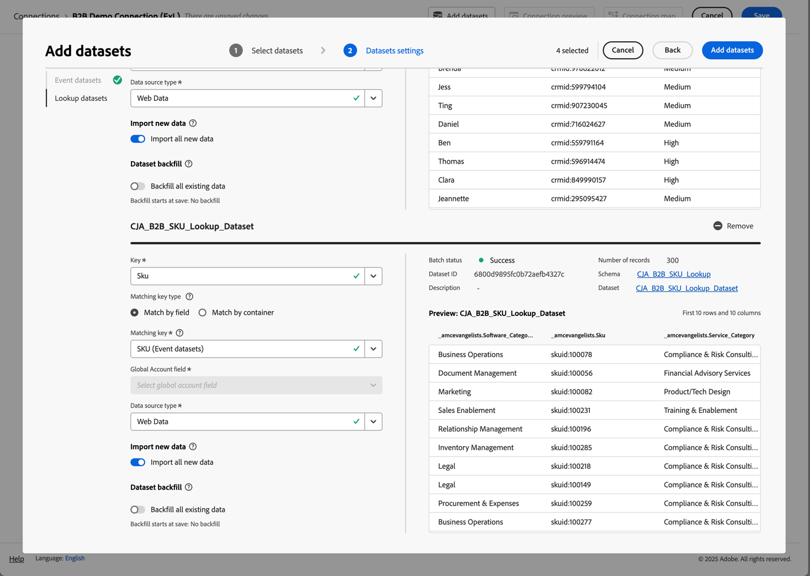

1. Seleccione **[!UICONTROL Agregar conjuntos de datos]** para guardar los conjuntos de datos y su configuración.

1. Seleccione **[!UICONTROL Guardar]** para guardar la conexión.

## Vista de datos

Después de ingerir los datos en Customer Journey Analytics, debe crear una vista de datos que incluya todos los componentes que ha definido en la referencia de diseño de la solución.

### Configuración

1. [Crear nueva vista de datos](/help/data-views/data-views.md) en Customer Journey Analytics.
1. Seleccione la conexión que creó anteriormente (por ejemplo: **[!UICONTROL Conexión de demostración B2B (ExL)]**).
1. Proporcione un nombre para la vista de datos. Por ejemplo: `B2B Demo Data view (ExL)` y opcionalmente una descripción.
1. Si lo desea, cambie el nombre de los contenedores. También puede adherirse a los nombres de contenedor predeterminados.

   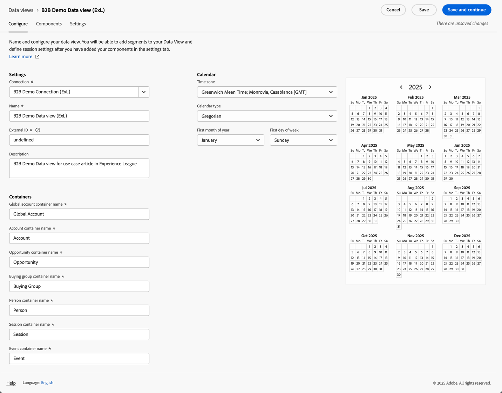
1. Seleccione **[!UICONTROL Guardar y continuar]**.

### Componentes

De manera predeterminada, todos los [componentes estándar](/help/data-views/component-reference.md) ya se incluyen en la vista de datos. Estos componentes estándar incluyen las métricas específicas B2B para cuentas, grupos de compra, cuentas globales y oportunidades.

1. Agregue todas las dimensiones de evento que haya definido en la [referencia de diseño de solución](#solution-design-reference) a los componentes de dimensión de la vista de datos. Por ejemplo, el campo **[!UICONTROL Nombre del evento]**, que representa la dimensión **[!UICONTROL Nombre del evento]**. Asegúrese de configurar el componente de dimensión mediante la [configuración del componente](/help/data-views/component-settings/overview.md) disponible.

   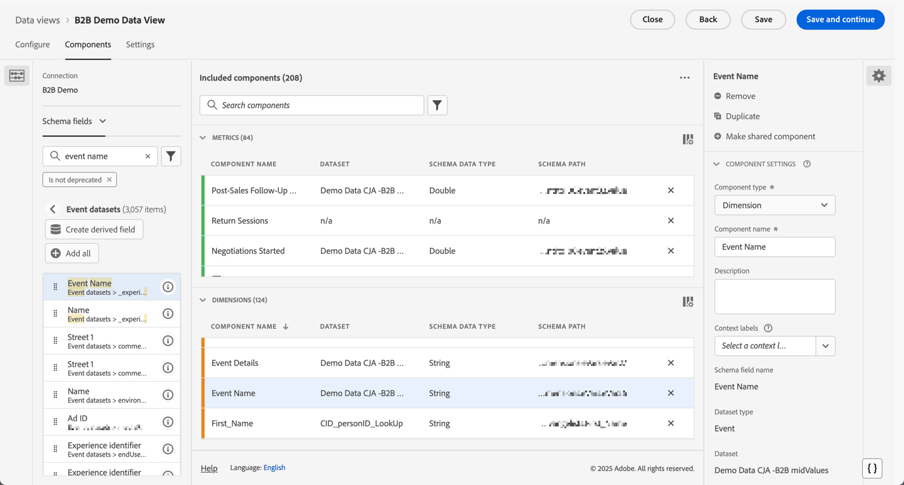

1. Agregue todas las métricas de evento que haya definido en la [referencia de diseño de solución](#solution-design-reference) a los componentes de métricas de la vista de datos. Por ejemplo, el campo **[!UICONTROL SQL Qualified]**, que representa la métrica **[!UICONTROL SQL Qualified]**. Asegúrese de configurar el componente de dimensión mediante la [configuración del componente](/help/data-views/component-settings/overview.md) disponible.

   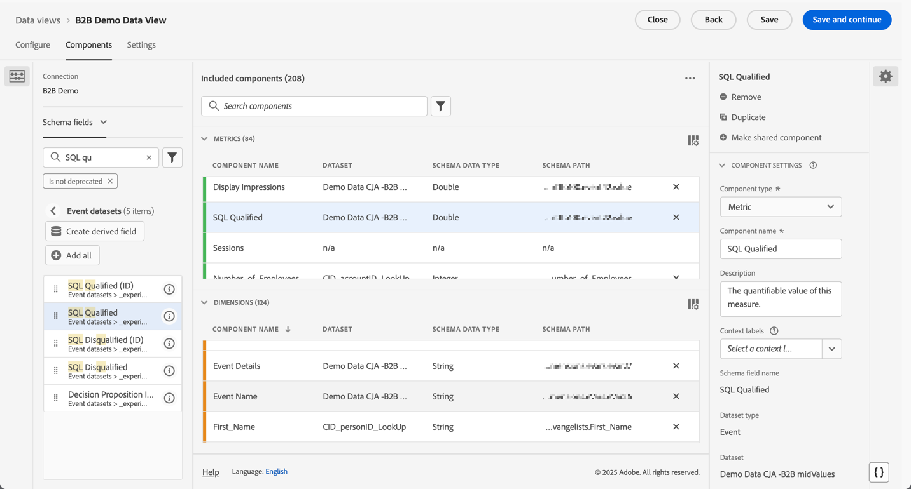

1. Agregue todas las dimensiones de cuenta que haya definido en la [referencia de diseño de solución](#solution-design-reference) a los componentes de dimensión de la vista de datos. Por ejemplo, el campo **[!UICONTROL Sector]**, que representa la dimensión **[!UICONTROL Sector]**. Asegúrese de configurar el componente de dimensión mediante la [configuración del componente](/help/data-views/component-settings/overview.md) disponible.

   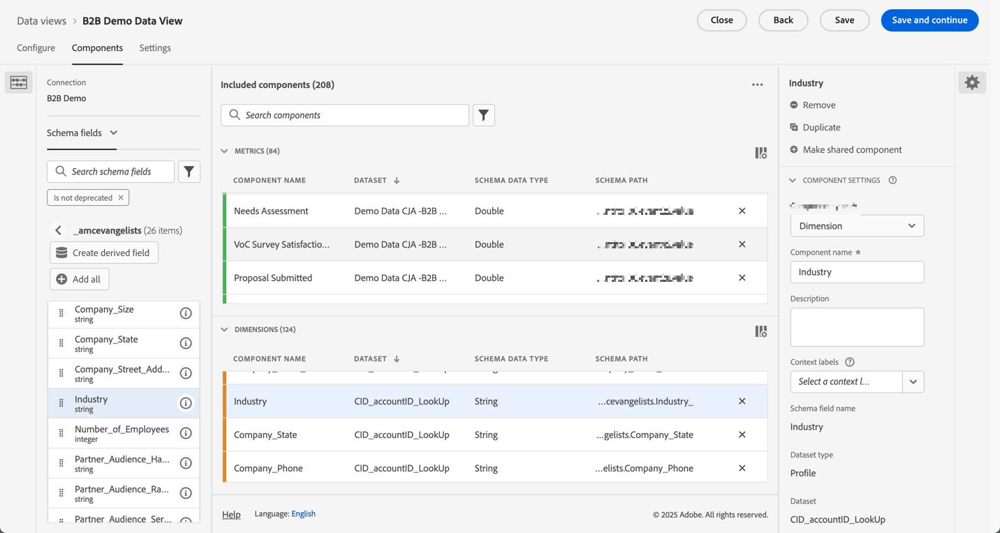

1. Agregue todas las métricas de cuenta que haya definido en la [referencia de diseño de solución](#solution-design-reference) a los componentes de métricas de la vista de datos. Por ejemplo, el campo **[!UICONTROL Número_de_empleados]**, que representa la métrica **[!UICONTROL Número_de_empleados]**. Asegúrese de configurar el componente de dimensión mediante la [configuración del componente](/help/data-views/component-settings/overview.md) disponible.

   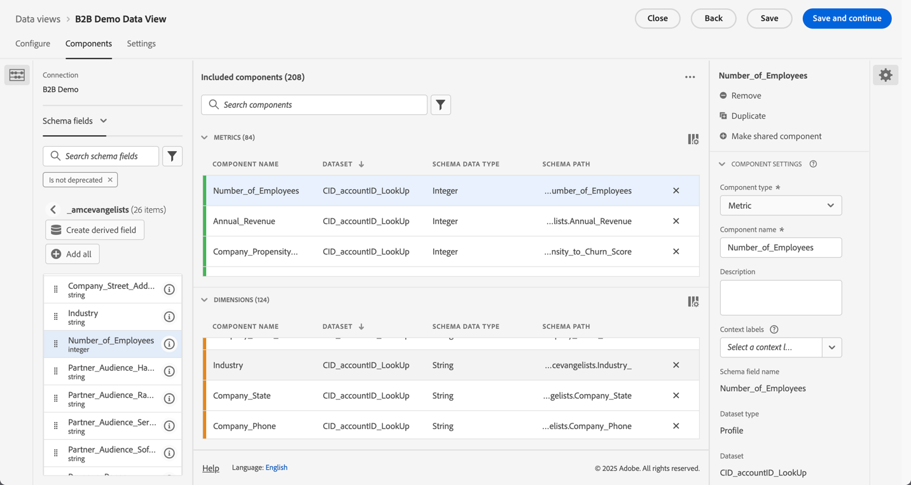

1. Agregue todas las dimensiones personales que haya definido en la [referencia de diseño de solución](#solution-design-reference) a los componentes de dimensión de la vista de datos. Por ejemplo, el campo **[!UICONTROL Category_1_Affinity_Level]**, que representa la dimensión **[!UICONTROL Category_1_Affinity_Level]**. Asegúrese de configurar el componente de dimensión mediante la [configuración del componente](/help/data-views/component-settings/overview.md) disponible.

   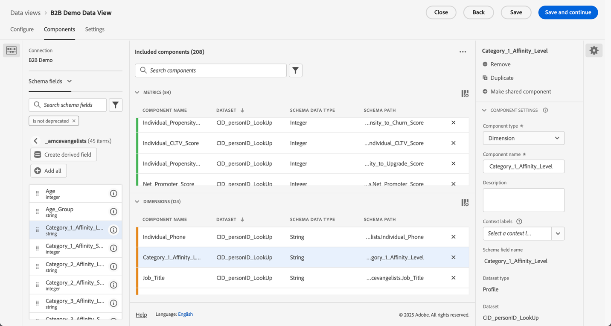

1. Agregue todas las métricas de personas que haya definido en la [referencia de diseño de solución](#solution-design-reference) a los componentes de métricas de la vista de datos. Por ejemplo, el campo **[!UICONTROL Category_1_Affinity_Score]**, que representa la métrica **[!UICONTROL Category_1_Affinity_Score]**. Asegúrese de configurar el componente de dimensión mediante la [configuración del componente](/help/data-views/component-settings/overview.md) disponible.

   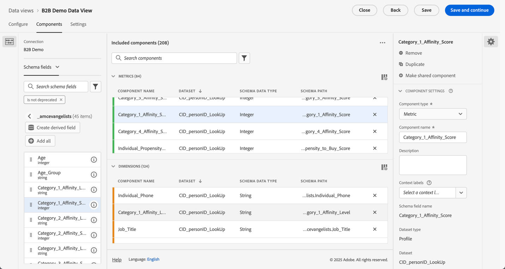

1. Agregue todas las dimensiones SKU que haya definido en la [referencia de diseño de solución](#solution-design-reference) a los componentes de dimensión de la vista de datos. Por ejemplo, el campo **[!UICONTROL Service Category]**, que representa la dimensión **[!UICONTROL Service Category]**. Asegúrese de configurar el componente de dimensión mediante la [configuración del componente](/help/data-views/component-settings/overview.md) disponible.

   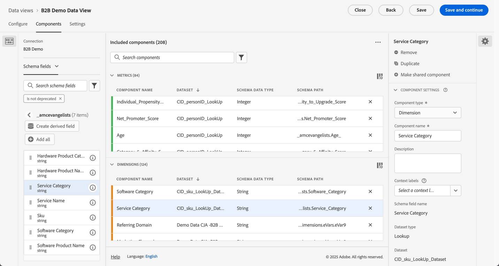

1. Seleccione **[!UICONTROL Guardar y continuar]**.

### Configuración

1. Opcionalmente, puede definir [configuración](/help/data-views/create-dataview.md#settings-1) específica para la vista de datos:

   * Añadir segmentos a la vista de datos.
   * Utilice una métrica (calculada) para definir la configuración de la sesión.

1. Seleccione **[!UICONTROL Guardar y continuar]**.

## Segmentos 

Puede preparar uno o más segmentos basados en contenedores específicos B2B que puede utilizar en su proyecto de Workspace.

Por ejemplo:

* Cuentas con segmento de registro de evento.

  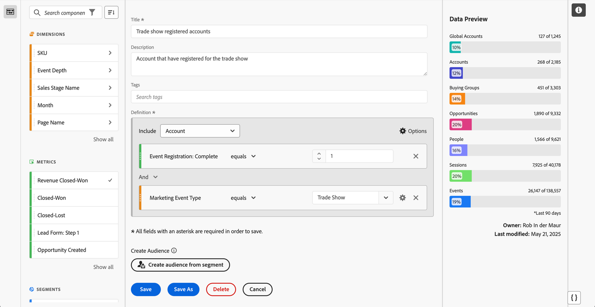

* Cuentas de EE. UU. con grupos compradores y segmento de oportunidades de la fase 5.

  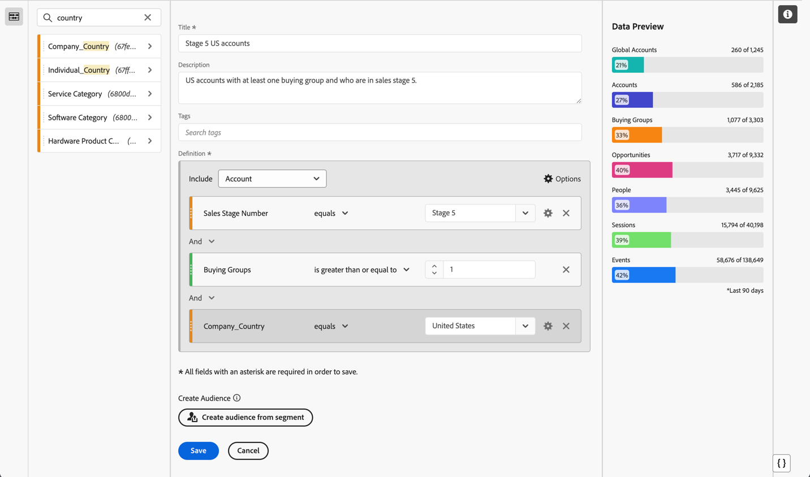

## Otro

Si lo desea, puede definir otros componentes para sus casos de uso, como [métricas calculadas](/help/components/calc-metrics/calc-metr-overview.md), [intervalos de fechas](/help/components/date-ranges/overview.md) o [alertas](/help/components/c-intelligent-alerts/intelligent-alerts.md).
