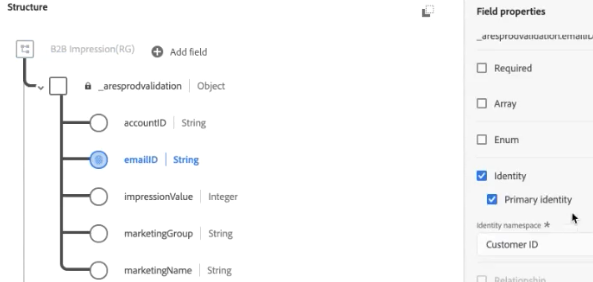
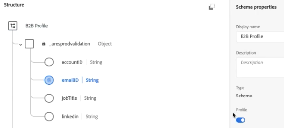
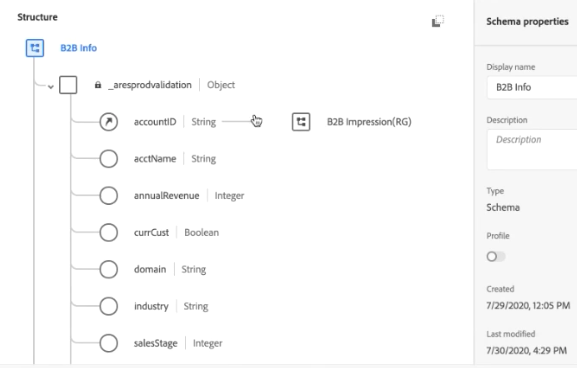
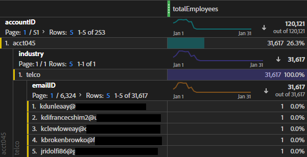

# (B2B) Adición de datos de nivel de cuenta como un conjunto de datos de consulta

Este caso de uso de B2B se muestra cómo especificar los datos en cuanto a cuenta, en lugar de en cuanto a persona, para su análisis. El análisis a nivel de cuenta puede responder preguntas como

* ¿Qué nombre de compañía coincide con esta cuenta?
* ¿Cuántos empleados están asociados con esta cuenta o compañía?
* ¿Qué funciones se representan en esta cuenta?
* ¿Cómo funciona esta cuenta en su conjunto con respecto a una campaña de marketing específica, en comparación con otra cuenta?
* ¿Hay funciones determinadas (como el administrador de TI) en una cuenta que se comportan de forma diferente a la misma función en una cuenta diferente?

Todo esto se logra mediante la introducción de la información de nivel de cuenta como un conjunto de datos [lookup](/help/getting-started/cja-glossary.md).

Primero debe crear un esquema de consulta en Adobe Experience Platform y luego crear un conjunto de datos de tabla de consulta mediante la ingesta de datos de nivel de cuenta basados en .csv. A continuación, se crea una conexión en Customer Journey Analytics (Customer Journey Analytics) que combina distintos conjuntos de datos, incluido el de búsqueda que se ha creado. A continuación, cree una vista de datos y, finalmente, podrá utilizar todos estos datos en Workspace.

>[!NOTE]
>
>Las tablas de consulta pueden tener un tamaño de hasta 1 GB.

## 1. Crear esquema de consulta (Experience Platform)

Creación de su propio esquema para [búsqueda](/help/getting-started/cja-glossary.md) garantiza que el conjunto de datos utilizado estará disponible en Customer Journey Analytics con la configuración correcta (tipo de registro). La práctica recomendada es [crear una clase de esquema personalizada](https://experienceleague.adobe.com/docs/experience-platform/xdm/tutorials/create-schema-ui.html?lang=es#create-new-class) llamada “Consulta”, vacía, que se puede reutilizar para todas las tablas de consulta.

## 2. Crear conjunto de datos de consulta (Experience Platform)

Una vez creado el esquema, debe crear un conjunto de datos de consulta a partir de ese esquema en Experience Platform. Este conjunto de datos de consulta contiene información de marketing de nivel de cuenta, como: nombre de la empresa, número total de empleados, nombre de dominio, sector al que pertenecen, ingresos anuales, ya sean clientes actuales del Experience Platform o no, en qué fase de ventas se encuentran, en qué equipo de la cuenta se utiliza el Customer Journey Analytics, etc.

1. En Adobe Experience Platform, vaya a **[!UICONTROL Administración de datos > Conjuntos de datos]**.
1. Haga clic en **[!UICONTROL + Crear conjunto de datos]**.
1. Haga clic en **[!UICONTROL Crear conjunto de datos a partir de esquema]**.
1. Seleccione la clase de Esquema de consulta que ha creado.
1. Haga clic en **[!UICONTROL Siguiente]**.
1. Asigne un nombre al conjunto de datos (B2B Info en nuestro ejemplo) y proporcione una descripción.
1. Haga clic en **[!UICONTROL Finalizar]**.

## 3. Ingresar datos en Experience Platform

Las instrucciones sobre cómo [asignar un archivo CSV a un esquema XDM](https://experienceleague.adobe.com/docs/experience-platform/ingestion/tutorials/map-a-csv-file.html?lang=es) deberían ayudarle si está usando un archivo CSV.

[Otros métodos](https://experienceleague.adobe.com/docs/experience-platform/ingestion/home.html?lang=es) también están disponibles.

La incorporación de los datos y el establecimiento de la consulta suelen llevar entre 2 y 4 horas, según el tamaño de la tabla de consulta.

## 4. Combinar conjuntos de datos en una conexión (Customer Journey Analytics)

Para este ejemplo, combinamos 3 conjuntos de datos en una conexión de Customer Journey Analytics:

| Nombre del conjunto de datos | Descripción | Clase de esquema Adobe Experience Platform | Detalles del conjunto de datos |
| --- | --- | --- | --- |
| Impresión B2B | Contiene datos de flujo de navegación a nivel de evento de la cuenta. Por ejemplo, contiene el ID de correo electrónico y el ID de cuenta correspondiente, así como el nombre de marketing para realizar campañas publicitarias. También incluye las impresiones de esas campañas publicitarias, por usuario. | Basado en la clase de esquema XDM ExperienceEvent | El `emailID` se usa como identidad principal y se asigna un área de nombres de `Customer ID`. Como resultado, se mostrará como el valor predeterminado **[!UICONTROL Person ID]** en Customer Journey Analytics.  |
| Perfil B2B | Este conjunto de datos de perfil proporciona más información sobre los usuarios de una cuenta, como su puesto de trabajo, a qué cuenta pertenecen, su perfil de LinkedIn, etc. | Basado en la clase de esquema de Perfil individual XDM | No es necesario seleccionar `emailID` como ID principal en este esquema. Asegúrese de habilitar **[!UICONTROL Perfil]**; si no lo hace, Customer Journey Analytics no podrá conectar el `emailID` en el perfil B2B con el `emailID` en los datos de impresión B2B.  |
| Información B2B | Consulte &quot;Creación de un conjunto de datos de consulta&quot; más arriba. | B2BAccount (clase de esquema de consulta personalizada) | La relación entre `accountID` y el conjunto de datos de Impresiones B2B se ha creado automáticamente conectando el conjunto de datos de información B2B con el conjunto de datos de Impresión B2B en Customer Journey Analytics, como se describe en los pasos que aparecen a continuación.  |

Así se combinan los conjuntos de datos:

1. En Customer Journey Analytics, seleccione la opción **[!UICONTROL Conexiones]** para abrir el Navegador.
1. Seleccione los conjuntos de datos (en nuestro ejemplo, los tres anteriores) que desee combinar.
1. Para el conjunto de datos de B2B Info, seleccione la variable `accountID` que se utilizará en la tabla de búsqueda. A continuación, seleccione su clave coincidente (dimensión correspondiente), el `accountID` en el conjunto de datos de evento.
1. Haga clic en **[!UICONTROL Siguiente]**.
1. Asigne un nombre a la conexión y describa su configuración según [estas instrucciones](/help/connections/create-connection.md).
1. Haga clic en **[!UICONTROL Guardar]**.

## 5. Crear una vista de datos a partir de esta conexión

Siga las instrucciones de [creación de vistas de datos](/help/data-views/create-dataview.md).

* Añada todos los componentes (dimensiones y métricas) que necesite de los conjuntos de datos.

## 6. Analizar los datos en Workspace

Ahora puede crear proyectos de Workspace basados en los datos de los 3 conjuntos de datos.

Por ejemplo, puede encontrar respuestas a las consultas planteadas en la introducción:

* Desglose emailID por accountID para averiguar a qué compañía pertenece un ID de correo electrónico.
* ¿Cuántos empleados se asignan a un ID de cuenta específico?
* ¿A qué sector pertenece un ID de cuenta?

