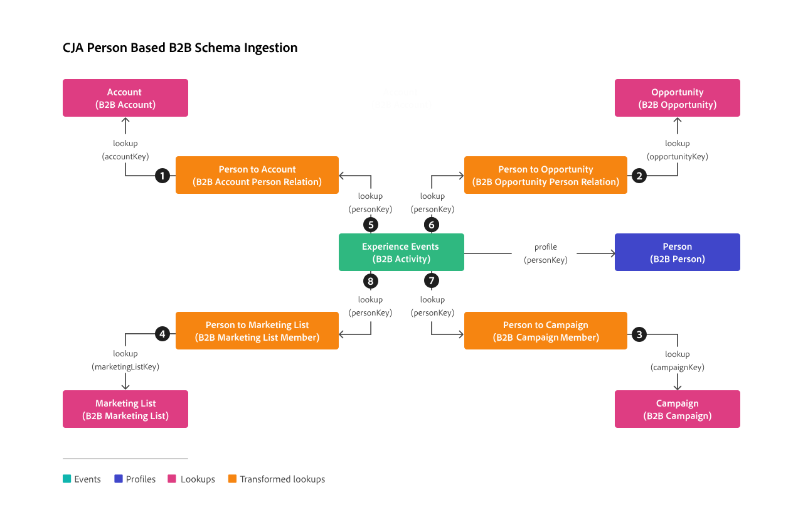

# Ejemplo de proyecto B2B basado en personas

Este artículo ilustra un caso de uso en el que desea informar correctamente en Customer Journey Analytics sobre los datos de persona en el contexto de una configuración B2B típica basada en personas. Dicha configuración se ve facilitada por [Real-Time CDP B2B edition](https://experienceleague.adobe.com/en/docs/experience-platform/rtcdp/intro/rtcdpb2b-intro/b2b-overview).  En este caso de uso se explica cómo configurar y crear informes sobre datos B2B basados en el nivel de perfil (persona) en Customer Journey Analytics.

[!BADGE B2B edition]{type=Informative url="https://experienceleague.adobe.com/en/docs/analytics-platform/using/cja-overview/cja-b2b/cja-b2b-edition" newtab=true tooltip="Customer Journey Analytics B2B edition"} Se ha publicado una sección separada para casos de uso de informes basados en cuentas con la versión de [Customer Journey Analytics B2B edition](/help/getting-started/cja-b2b-edition.md).

## Conexión

Defina su conexión para incluir todos los conjuntos de datos B2B relevantes de Experience Platform. Conjuntos de datos que puede considerar para agregar a su conexión:

| Conjunto de datos | Esquema | Tipo de esquema | Clase base | Descripción |
|---|---|---|---|---|
| Conjunto de datos de actividad B2B | Esquema de actividad B2B | Evento | ExperienceEvent de XDM | Un ExperienceEvent es un registro de hechos de lo que ha ocurrido, incluido el momento y la identidad de la persona involucrada. Los ExperienceEvents pueden ser explícitos (acciones humanas directamente observables) o implícitos (planteados sin una acción humana directa) y se registran sin agregación ni interpretación. Los eventos de experiencia son esenciales para el análisis en el dominio del tiempo, ya que permiten la observación y el análisis de los cambios que se producen en un intervalo de tiempo determinado y la comparación entre varios períodos de tiempo para rastrear las tendencias. |
| Conjunto de datos de persona B2B | Esquema de persona B2B | Perfil | Perfil individual de XDM | Un perfil individual de XDM forma una representación singular de los atributos e intereses de las personas identificadas y parcialmente identificadas. Los perfiles menos identificados pueden contener solo señales de comportamiento anónimas, como las cookies del explorador, mientras que los perfiles altamente identificados pueden contener información personal detallada como el nombre, la fecha de nacimiento, la ubicación y la dirección de correo electrónico. A medida que un perfil crece, se convierte en un repositorio sólido de información personal, información de identificación, detalles de contacto y preferencias de comunicación para un individuo. |
| Conjunto de datos de cuenta B2B | Esquema de cuenta B2B | Consulta | Cuenta empresarial de XDM | Una cuenta empresarial de XDM es una clase de modelo de datos de experiencia (XDM) estándar que captura las propiedades mínimas requeridas de una cuenta comercial. Esta clase XDM solo se puede incluir en el perfil para clientes con B2B o B2P Edition. |
| Conjunto de datos de oportunidad B2B | Esquema de oportunidad B2B | Consulta | Oportunidad empresarial de XDM | La oportunidad empresarial XDM es una clase de modelo de datos de experiencia (XDM) estándar que captura las propiedades mínimas requeridas de una oportunidad comercial. Esta clase XDM solo se puede incluir en el perfil para clientes con B2B o B2P Edition. |
| Conjunto de datos de campaña B2B | Esquema de campaña B2B | Consulta | Campaña empresarial de XDM | XDM Business Campaign es una clase de modelo de datos de experiencia (XDM) estándar que captura las propiedades mínimas requeridas de una campaña empresarial. Esta clase XDM solo se puede incluir en el perfil para clientes con B2B o B2P Edition. |
| Conjunto de datos de lista de marketing B2B | Esquema de lista de marketing B2B | Consulta | Lista de marketing empresarial de XDM | La lista de marketing empresarial de XDM es una clase de modelo de datos de experiencia (XDM) estándar que captura las propiedades mínimas requeridas de una lista de marketing. Las listas de marketing le permiten priorizar los clientes potenciales que tienen más probabilidades de comprar su producto. Esta clase XDM solo se puede incluir en el perfil para clientes con B2B o B2P Edition. |
| Conjunto de datos de relación de persona de la cuenta B2B | Esquema de relación de persona de la cuenta B2B | Consulta | Relación de persona de cuenta empresarial de XDM | La relación de persona de la cuenta empresarial de XDM es una clase de modelo de datos de experiencia (XDM) estándar que captura las propiedades mínimas requeridas de una persona asociada a una cuenta comercial. |
| Conjunto de datos de relación de persona de oportunidad B2B | Esquema de relación de persona de oportunidad B2B | Consulta | Relación de persona de oportunidad empresarial de XDM | La relación personal de oportunidades comerciales de XDM es una clase de modelo de datos de experiencia (XDM) estándar que captura las propiedades mínimas requeridas de una persona asociada a una oportunidad comercial. |
| Conjunto de datos de miembros de lista de marketing B2B | Esquema de miembro de lista de marketing B2B | Consulta | Miembros de lista de marketing XDM | Los miembros de la lista de marketing empresarial de XDM es una clase de modelo de datos de experiencia (XDM) estándar que describen miembros, personas o contactos asociados a una lista de marketing. |
| Conjunto de datos de miembros de campañas B2B | Esquema de miembro de campaña B2B | Consulta | Miembros de campaña empresarial de XDM | Los miembros de XDM Business Campaign son una clase de modelo de datos de experiencia (XDM) estándar que describen un contacto o posible cliente asociado a una campaña empresarial. |

<!--
| B2B Account Dataset | B2B Account Schema | Lookup | XDM Business Account | XDM Business Account is a standard Experience Data Model (XDM) class that captures the minimum required properties of a business account.  |
| B2B Opportunity Dataset | B2B Opportunity Schema | Lookup | XDM Business Opportunity | XDM Business Opportunity is a standard Experience Data Model (XDM) class that captures the minimum required properties of a business opportunity.  |
| B2B Campaign Dataset | B2B Campaign Schema | Lookup | XDM Business Campaign | XDM Business Campaign is a standard Experience Data Model (XDM) class that captures the minimum required properties of a business campaign.  |
| B2B Marketing List Dataset | B2B Marketing List Schema | Lookup | XDM Marketing List | XDM Business Marketing List is a standard Experience Data Model (XDM) class that captures the minimum required properties of a marketing list. Marketing lists allow you to prioritize on prospect clients who are most likely to buy your product.  |
-->

La relación entre los esquemas de búsqueda B2B, el esquema de perfil y el esquema de evento se define en la configuración B2B en Experience Platform. Consulte Esquemas en [Real-Time Customer Data Platform B2B edition](https://experienceleague.adobe.com/en/docs/experience-platform/rtcdp/schemas/b2b) y [Defina una relación de varios a uno entre dos esquemas en Real-Time Customer Data Platform B2B edition](https://experienceleague.adobe.com/en/docs/experience-platform/xdm/tutorials/relationship-b2b).

Para garantizar una configuración adecuada de una conexión que admita búsquedas basadas en personas de sus datos B2B, utilice la siguiente ilustración para obtener una descripción general y siga estos pasos:

1. Agregue conjuntos de datos de la tabla anterior a su conexión.
1. Para cada conjunto de datos de búsqueda que agregue a su conexión, debe definir explícitamente la relación con un conjunto de datos de evento mediante **[!UICONTROL Key]** y **[!UICONTROL Matching key]** en el cuadro de diálogo **[!UICONTROL Editar conjunto de datos]**.
1. Para cada conjunto de datos de búsqueda que desee transformar para búsquedas B2B basadas en personas, habilite **[!UICONTROL Transformar conjunto de datos]** para asegurarse de que los datos se transformen para búsquedas basadas en personas. Consulte [Transformar conjuntos de datos para búsquedas B2B](/help/connections/transform-datasets-b2b-lookups.md) para obtener información adicional.

   

   La tabla siguiente proporciona un ejemplo de información general de los valores de [!UICONTROL ID de persona], [!UICONTROL clave] y [!UICONTROL clave coincidente] para cada uno de los conjuntos de datos.

   | Conjunto de datos | ID de la persona | Clave | Clave de coincidencia  (en el conjunto de datos de evento) |
   |---|---|---|---| 
   | Conjunto de datos de actividad B2B | SourceKey  **personKey.sourceKey** | | |
   | Conjunto de datos de persona B2B | SourceKey  **b2b.personKey.sourceKey** | | |
   | Conjunto de datos de cuenta B2B | | SourceKey  **accountKey.sourceKey**❶ | SourceKey (Conjunto de datos de persona B2B) **b2b.accountKey.sourceKey**❶ |
   | Conjunto de datos de oportunidad B2B | | Clave de Source  **oportunidadKey.sourceKey**❷ | SourceKey (Conjunto de datos de relación de oportunidad B2B) **OpportunityKey.sourceKey**❷ |
   | Conjunto de datos de campaña B2B | | SourceKey  **campaignKey.sourceKey**❸ | SourceKey (Conjunto de datos de miembros de campañas B2B) **campaignKey.sourceKey**❸  |
   | Conjunto de datos de lista de marketing B2B | | SourceKey  **marketingListKey.sourceKey**❹ | SourceKey (Conjunto de datos de miembro de lista de marketing B2B) **marketingListKey.sourceKey**❹ |
   | Conjunto de datos de relación de persona de la cuenta B2B | | SourceKey  **personKey.sourceKey**❺ | Clave de Source (Conjuntos de datos de evento) **personKey.sourceKey**❺ |
   | Conjunto de datos de relación de persona de oportunidad B2B | | SourceKey  **personKey.sourceKey** y❻ | Clave de Source (Conjuntos de datos de evento) **personKey.sourceKey**❻ |
   | Conjunto de datos de miembros de campañas B2B | | SourceKey  **personKey.sourceKey**❼ | Clave de Source (Conjuntos de datos de evento) **personKey.sourceKey**❼ |
   | Conjunto de datos de miembros de lista de marketing B2B | | SourceKey  **personKey.sourceKey**❽ | Clave de Source (Conjuntos de datos de evento) **personKey.sourceKey**❽ |

{style="table-layout:auto"}

Consulte [Agregar y configurar conjuntos de datos](../../connections/create-connection.md) para obtener más información sobre cómo establecer la configuración de un conjunto de datos.

## Vista de datos

Para tener acceso a dimensiones y métricas B2B relevantes al crear su proyecto de Workspace, debe definir la vista de datos en consecuencia.

Por ejemplo, puede añadir los siguientes componentes a la vista de datos para asegurarse de que puede crear informes de nivel personal sobre sus datos B2B. Los nombres de componentes a veces se modifican para una mayor claridad de sus nombres de esquema originales.

+++métricas

| Nombre del componente | Conjunto de datos | Tipo de datos | Ruta de esquema |
|---|---|---|---|
| Ingresos de cuenta anual | Conjunto de datos de cuenta B2B | Doble | accountOrganization.annualRevenue.amount |
| Número de empleados | Conjunto de datos de cuenta B2B | Número entero | accountOrganization.numberOfEmployees |
| Costo real de campaña | Conjunto de datos de campaña B2B | Doble | actualCost.amount |
| Costo de campaña presupuestado | Conjunto de datos de campaña B2B | Doble | budgetedCost.amount |
| Ingresos de oportunidad esperados | Conjunto de datos de oportunidad B2B | Doble | expectedRevenue.amount |
| Ingresos de campaña esperados | Conjunto de datos de campaña B2B | Doble | expectedRevenue.amount |
| Importe de oportunidad | Conjunto de datos de oportunidad B2B | Doble | opportunityAmount.amount |

+++

+++Dimensiones

| Nombre del componente | Conjunto de datos | Tipo de datos | Ruta de esquema |
|---|---|---|---|
| Nombre de la cuenta | Conjunto de datos de cuenta B2B | Cadena | accountName |
| Nombre de la campaña | Conjunto de datos de campaña B2B | Cadena | campaignName |
| Nombre del canal | Conjunto de datos de campaña B2B | Cadena | channelName |
| País | Conjunto de datos de cuenta B2B | Cadena | accountBillingAddress.country |
| Nombre de categoría de pronóstico | Conjunto de datos de oportunidad B2B | Cadena | forecastCategoryName |
| de la industria | Conjunto de datos de cuenta B2B | Cadena | accountOrganization.industry |
| Apellidos | Conjunto de datos de persona B2B | Cadena | person.name.lastName |
| Nombre de lista de marketing | Conjunto de datos de lista de marketing B2B | Cadena | marketingListName |
| Nombre de oportunidad | Conjunto de datos de oportunidad B2B | Cadena | oportunidadName |
| Fase de oportunidad | Conjunto de datos de oportunidad B2B | Cadena | oportunidadStage |
| Tipo de oportunidad | Conjunto de datos de tipo de oportunidad B2B | Cadena | oportunidadType |
| Nombre de sesión de seminario web | Conjunto de datos de campaña B2B | Cadena | webinarSessionName |

+++

## Workspace

Con los componentes correctamente definidos en la vista de datos, ahora puede generar informes y visualizaciones B2B específicos en su proyecto de Workspace.

A continuación se muestra una captura de pantalla de un proyecto de ejemplo que se basa en la conexión y la vista de datos descritas anteriormente. Las descripciones de visualización explican qué parte de la visualización de tabla de forma libre se basa en los datos de búsqueda B2B transformados.

