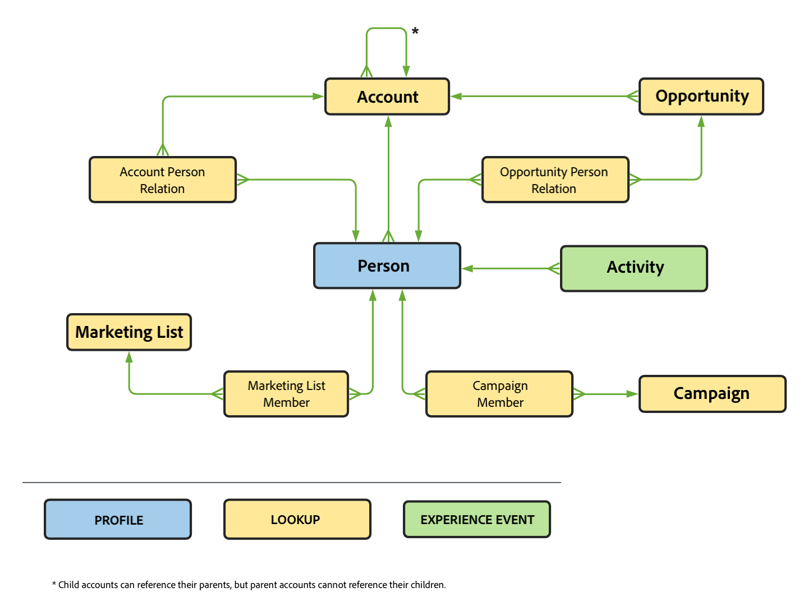
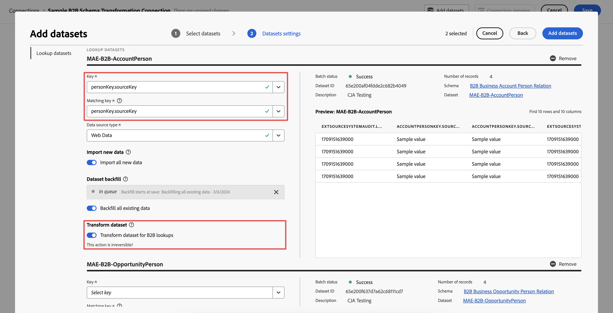
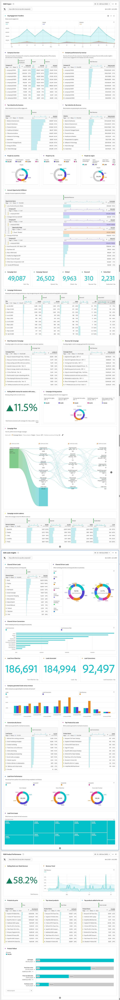

# Ejemplo de proyecto B2B

Este artículo explica, a través de ejemplos, cómo configurar y crear informes sobre los datos B2B en Customer Journey Analytics.

## Conexión

Defina su conexión para incluir todos los conjuntos de datos B2B relevantes de Experience Platform. Esto incluye los conjuntos de datos de búsqueda importantes necesarios en una configuración B2B típica dentro de Experience Platform. Consulte [Añadir datos de nivel de cuenta como un conjunto de datos de consulta](b2b.md) para obtener más información.

Conjuntos de datos que puede considerar para agregar a su conexión:

| Conjunto de datos | Esquema | Tipo de esquema | Clase base | Descripción |
|---|---|---|---|---|
| Conjunto de datos de actividad B2B | Esquema de actividad B2B | Evento | ExperienceEvent de XDM | Un ExperienceEvent es un registro de hechos de lo que ha ocurrido, incluido el momento y la identidad de la persona involucrada. Los ExperienceEvents pueden ser explícitos (acciones humanas directamente observables) o implícitos (planteados sin una acción humana directa) y se registran sin agregación ni interpretación. Son esenciales para el análisis en el dominio del tiempo, ya que permiten la observación y el análisis de los cambios que se producen en un período de tiempo determinado y la comparación entre varios períodos de tiempo para rastrear las tendencias. |
| Conjunto de datos de persona B2B | Esquema de persona B2B | Perfil | Perfil individual de XDM | Un perfil individual de XDM forma una representación singular de los atributos e intereses de las personas identificadas y parcialmente identificadas. Los perfiles menos identificados pueden contener solo señales de comportamiento anónimas, como las cookies del explorador, mientras que los perfiles altamente identificados pueden contener información personal detallada como el nombre, la fecha de nacimiento, la ubicación y la dirección de correo electrónico. A medida que un perfil crece, se convierte en un repositorio sólido de información personal, información de identificación, detalles de contacto y preferencias de comunicación para un individuo. |
| Conjunto de datos de miembros de campañas B2B | Esquema de miembro de campaña B2B | Búsqueda | Miembros de campaña empresarial de XDM | Los miembros de XDM Business Campaign son una clase de modelo de datos de experiencia (XDM) estándar que describen un contacto o posible cliente asociado a una campaña empresarial. |
| Conjunto de datos de cuenta B2B | Esquema de cuenta B2B | Búsqueda | Cuenta empresarial de XDM | La cuenta empresarial XDM es una clase de modelo de datos de experiencia (XDM) estándar que captura las propiedades mínimas requeridas de una cuenta comercial. |
| Conjunto de datos de relación de persona de la cuenta B2B | Esquema de relación de persona de la cuenta B2B | Búsqueda | Relación de persona de la cuenta XDM | La relación de persona de la cuenta empresarial de XDM es una clase de modelo de datos de experiencia (XDM) estándar que captura las propiedades mínimas requeridas de una persona asociada a una cuenta comercial. |
| Conjunto de datos de oportunidad B2B | Esquema de oportunidad B2B | Búsqueda | Oportunidad empresarial de XDM | La oportunidad empresarial XDM es una clase de modelo de datos de experiencia (XDM) estándar que captura las propiedades mínimas requeridas de una oportunidad comercial. |
| Conjunto de datos de relación de persona de oportunidad B2B | Esquema de relación de persona de oportunidad B2B | Búsqueda | Relación de persona de oportunidad empresarial de XDM | La relación personal de oportunidades comerciales de XDM es una clase de modelo de datos de experiencia (XDM) estándar que captura las propiedades mínimas requeridas de una persona asociada a una oportunidad comercial. |
| Conjunto de datos de campaña B2B | Esquema de campaña B2B | Búsqueda | Campaña empresarial de XDM | XDM Business Campaign es una clase de modelo de datos de experiencia (XDM) estándar que captura las propiedades mínimas requeridas de una campaña empresarial. |
| Conjunto de datos de lista de marketing B2B | Esquema de lista de marketing B2B | Búsqueda | Lista de marketing XDM | La lista de marketing empresarial de XDM es una clase de modelo de datos de experiencia (XDM) estándar que captura las propiedades mínimas requeridas de una lista de marketing. Las listas de marketing le permiten priorizar los clientes potenciales que tienen más probabilidades de comprar su producto. |
| Conjunto de datos de miembros de lista de marketing B2B | Esquema de miembros de lista de marketing B2B | Búsqueda | Miembros de lista de marketing XDM | Los miembros de la lista de marketing empresarial de XDM es una clase de modelo de datos de experiencia (XDM) estándar que describen miembros, personas o contactos asociados a una lista de marketing. |

La relación entre los esquemas de búsqueda, el esquema de perfil y el esquema de evento se define en la configuración B2B dentro de Experience Platform. Consulte Esquemas en [Real-time Customer Data Platform B2B Edition](https://experienceleague.adobe.com/docs/experience-platform/rtcdp/schemas/b2b.html?lang=en) y [Defina una relación varios a uno entre dos esquemas en Real-time Customer Data Platform B2B Edition](https://experienceleague.adobe.com/docs/experience-platform/xdm/tutorials/relationship-b2b.html?lang=en) para obtener más información.

Para cada conjunto de datos de búsqueda que agregue a la conexión, debe definir explícitamente la relación con un conjunto de datos de evento mediante Clave y Clave de coincidencia en el cuadro de diálogo Editar conjunto de datos. Por ejemplo:

La siguiente tabla proporciona un ejemplo de la [!UICONTROL ID de persona], [!UICONTROL Clave], y [!UICONTROL Clave de coincidencia] valores para cada uno de los conjuntos de datos.

| Conjunto de datos | ID de la persona | Clave | Clave de coincidencia (en el conjunto de datos de evento) |
|---|---|---|---|
| Conjunto de datos de actividad B2B | `personKey.sourceKey` | | |
| Conjunto de datos de persona B2B | `b2b.personKey.sourceKey` | | |
| Conjunto de datos de cuenta B2B | | `accountKey.sourceKey` | *_organizationID*`.interactions.accountKey.sourceKey` |
| Conjunto de datos de oportunidad B2B | | `accountKey.sourceKey` | *_organizationID*`.interactions.accountKey.sourceKey` |
| Conjunto de datos de campaña B2B | | `campaignKey.sourceKey` | *_organizationID*`.interactions.campaignKey.sourceKey` |
| Conjunto de datos de lista de marketing B2B | | `listKey.sourceKey` | `listOperations.listKey.sourceKey` |

{style="table-layout:auto"}

En la tabla *_organizationID*`.interaction.*`, hace referencia al grupo de campos personalizados que ha agregado al esquema de actividad B2B para definir la relación con la cuenta B2B y el esquema de oportunidad B2B. El `listOperations.listKey.sourceKey` hace referencia al grupo de campos Añadir a la lista añadido al esquema de actividad B2B para rastrear cuándo se agrega una persona a una lista específica.

Consulte [Adición y configuración de conjuntos de datos](../../connections/create-connection.md) para obtener más información sobre cómo configurar los ajustes de un conjunto de datos.

## Vista de datos

Para tener acceso a dimensiones y métricas B2B relevantes al crear el proyecto de Workspace, debe definir la vista de datos en consecuencia.

En esta sección se ofrecen recomendaciones y sugerencias sobre las dimensiones y métricas que se deben incluir al definir la variable [componentes](../../data-views/create-dataview.md#components) para conjuntos de datos B2B en la vista de datos.

Para cada componente, se proporcionan el nombre, el tipo de esquema, la ruta del esquema y (cuando corresponda) los detalles sobre la configuración.

+++ Conjunto de datos de actividad B2B

### Métricas

| Nombre del componente | Tipo de datos del esquema | Ruta de esquema | Configuración |
|---|---|---|---|
| Añadir a campaña | Cadena | `eventType` | **[!UICONTROL Establecer valores de inclusión y exclusión]** **[!UICONTROL Distinción entre mayúsculas y minúsculas]** Coincidencia:**[!UICONTROL  Si se cumplen todos los criterios]** Criterios: **[!UICONTROL Igual a]** `leadOperation.addToCampaign` |
| Añadir a oportunidad | Cadena | `eventType` | **[!UICONTROL Establecer valores de inclusión y exclusión]** **[!UICONTROL Distinción entre mayúsculas y minúsculas]** Coincidencia:**[!UICONTROL  Si se cumplen todos los criterios]** Criterios: **[!UICONTROL Igual a]** `opportunityEvent.addToOpportunity` |
| Aplicación cerrada | Cadena | `eventType` | **[!UICONTROL Establecer valores de inclusión y exclusión]** **[!UICONTROL Distinción entre mayúsculas y minúsculas]** Coincidencia:**[!UICONTROL  Si se cumplen todos los criterios]** Criterios: **[!UICONTROL Igual a]** `application.close` |
| Inicio de aplicación | Cadena | `eventType` | **[!UICONTROL Establecer valores de inclusión y exclusión]** **[!UICONTROL Distinción entre mayúsculas y minúsculas]** Coincidencia:**[!UICONTROL  Si se cumplen todos los criterios]** Criterios: **[!UICONTROL Igual a]** `application.launch` |
| Flujo de campaña | Cadena | `eventType` | **[!UICONTROL Establecer valores de inclusión y exclusión]** **[!UICONTROL Distinción entre mayúsculas y minúsculas]** Coincidencia:**[!UICONTROL  Si se cumplen todos los criterios]** Criterios: **[!UICONTROL Igual a]** ` leadOperation.changeCampaignStream` |
| cierre de compra | Cadena | `eventType` | **[!UICONTROL Establecer valores de inclusión y exclusión]** **[!UICONTROL Distinción entre mayúsculas y minúsculas]** Coincidencia:**[!UICONTROL  Si se cumplen todos los criterios]** Criterios: **[!UICONTROL Igual a]** `commerce.checkouts` |
| Convertir posible cliente | Cadena | `eventType` | **[!UICONTROL Establecer valores de inclusión y exclusión]** **[!UICONTROL Distinción entre mayúsculas y minúsculas]** Coincidencia:**[!UICONTROL  Si se cumplen todos los criterios]** Criterios: **[!UICONTROL Igual a]** `leadOperation.convertLead` |
| Correo electrónico clicado | Cadena | `eventType` | **[!UICONTROL Establecer valores de inclusión y exclusión]** **[!UICONTROL Distinción entre mayúsculas y minúsculas]** Coincidencia:**[!UICONTROL  Si se cumplen todos los criterios]** Criterios: **[!UICONTROL Igual a]** `directMarketing.emailClicked` |
| Correo electrónico enviado | Cadena | `eventType` | **[!UICONTROL Establecer valores de inclusión y exclusión]** **[!UICONTROL Distinción entre mayúsculas y minúsculas]** Coincidencia:**[!UICONTROL  Si se cumplen todos los criterios]** Criterios: **[!UICONTROL Igual a]** `directMarketing.emailDelivered` |
| Correo electrónico abierto | Cadena | `eventType` | **[!UICONTROL Establecer valores de inclusión y exclusión]** **[!UICONTROL Distinción entre mayúsculas y minúsculas]** Coincidencia:**[!UICONTROL  Si se cumplen todos los criterios]** Criterios: **[!UICONTROL Igual a]** `directMarketing.emailOpened` |
| Correo electrónico enviado | Cadena | eventType | **[!UICONTROL Establecer valores de inclusión y exclusión]** **[!UICONTROL Distinción entre mayúsculas y minúsculas]** Coincidencia:**[!UICONTROL  Si se cumplen todos los criterios]** Criterios: **[!UICONTROL Igual a]** `directMarketing.emailSent` |
| Correo electrónico cancelado | Cadena | `eventType` | **[!UICONTROL Establecer valores de inclusión y exclusión]** **[!UICONTROL Distinción entre mayúsculas y minúsculas]** Coincidencia:**[!UICONTROL  Si se cumplen todos los criterios]** Criterios: **[!UICONTROL Igual a]** `directMarketing.emailUnsubscribed` |
| Formulario rellenado | Cadena | `eventType` | **[!UICONTROL Establecer valores de inclusión y exclusión]** **[!UICONTROL Distinción entre mayúsculas y minúsculas]** Coincidencia:**[!UICONTROL  Si se cumplen todos los criterios]** Criterios: **[!UICONTROL Igual a]** `web.formFilledOut` |
| Formulario iniciado | Cadena | `web.fillOutForm.webFormName` | |
| Posibles clientes | Cadena | eventType | **[!UICONTROL Establecer valores de inclusión y exclusión]** **[!UICONTROL Distinción entre mayúsculas y minúsculas]** Coincidencia:**[!UICONTROL  Si se cumplen todos los criterios]** Criterios: **[!UICONTROL Igual a]** `leadOperation.newLead` |
| Oportunidad actualizada | Cadena | `eventType` | **[!UICONTROL Establecer valores de inclusión y exclusión]** **[!UICONTROL Distinción entre mayúsculas y minúsculas]** Coincidencia:**[!UICONTROL  Si se cumplen todos los criterios]** Criterios: **[!UICONTROL Igual a]** `opportunityEvent.opportunityUpdated` |
| Precio | Doble | *_organizationID*`.interactions.products.price` |  |
| Prioridad | Número entero | `leadOperation.changeScore.priority` |  |
| Lista de productos añadida | Cadena | `eventType` | **[!UICONTROL Establecer valores de inclusión y exclusión]** **[!UICONTROL Distinción entre mayúsculas y minúsculas]** Coincidencia:**[!UICONTROL  Si se cumplen todos los criterios]** Criterios: **[!UICONTROL Igual a]** `commerce.productListAdds.value` |
| Lista de productos abierta | Cadena | `eventType` | **[!UICONTROL Establecer valores de inclusión y exclusión]** **[!UICONTROL Distinción entre mayúsculas y minúsculas]** Coincidencia:**[!UICONTROL  Si se cumplen todos los criterios]** Criterios: **[!UICONTROL Igual a]** `commerce.productListOpens.value` |
| Vista de producto | Cadena | `eventType` | **[!UICONTROL Establecer valores de inclusión y exclusión]** **[!UICONTROL Distinción entre mayúsculas y minúsculas]** Coincidencia:**[!UICONTROL  Si se cumplen todos los criterios]** Criterios: **[!UICONTROL Igual a]** `commerce.productViews.value` |
| Compras | Cadena | `eventType` | **[!UICONTROL Establecer valores de inclusión y exclusión]** **[!UICONTROL Distinción entre mayúsculas y minúsculas]** Coincidencia:**[!UICONTROL  Si se cumplen todos los criterios]** Criterios: **[!UICONTROL Igual a]** `commerce.purchases.value` |
| Quitar de oportunidad | Cadena | `eventType` | **[!UICONTROL Establecer valores de inclusión y exclusión]** **[!UICONTROL Distinción entre mayúsculas y minúsculas]** Coincidencia:**[!UICONTROL  Si se cumplen todos los criterios]** Criterios: **[!UICONTROL Igual a]** `opportunityEvent.removeFromOpportunity` |
| Guardar para más tarde | Cadena | eventType | **[!UICONTROL Establecer valores de inclusión y exclusión]** **[!UICONTROL Distinción entre mayúsculas y minúsculas]** Coincidencia:**[!UICONTROL  Si se cumplen todos los criterios]** Criterios: **[!UICONTROL Igual a]** `commerce.productViews.value` |

{style="table-layout:auto"}

### Dimensiones

| Nombre del componente | Tipo de datos del esquema | Ruta de esquema | Configuración |
|---|---|---|---|
| Clave de cuenta (clave de origen) | Cadena | *_organizationID*`.Interactions.accountKey.sourceKey` | |
| Estado de conversión | Cadena | `leadOperation.convertLead.convertedStatus` | |
| Tipo de evento | Cadena | `eventType` | |
| Nombre del formulario | Cadena | `leadOperation.newLead.formName` | |
| Identificador | Cadena | `_id` | |
| Notificación de Is Sent | Booleano | `leadOperation.convertLead.isSentNotificationEmail` | |
| Palabras clave | Cadena | `search.keywords` | |
| ID de lista | Cadena | `listOperations.listID` | |
| Nombre de lista | Cadena | `leadOperation.newLead.listName` | |
| Nombre de la página | Cadena | `web.webPageDetails.name` | |
| Clave de persona (clave de origen) | Cadena | `personKey.sourceKey` | |
| Producido por | Cadena | productionBy | |
| Nombre del producto | Cadena | *_organizationID*`.Interactions.products.name` | |
| Función | Cadena | `opportunityEvent.role` | |
| Marca de tiempo | Fecha-hora | `timestamp` | Formato de fecha y hora: **[!UICONTROL Día]** |
| URL | Cadena | `web.webPageDetails.URL` | |
| Nombre del formulario web | Cadena | `web.fillOutForm.webFormName` | |
| URL del producto | Cadena | *_organizationID*`.Interactions.products.url` | |

{style="table-layout:auto"}

+++

+++ Conjunto de datos de persona B2B

### Métricas

No se ha definido ningún componente de métrica como parte de este conjunto de datos.

### Dimensiones

| Nombre del componente | Tipo de datos del esquema | Ruta de esquema | Configuración |
|---|---|---|---|
| Fecha de la última actividad | Fecha-hora | `extSourceSystemAudit.lastActivityDate` | Formato de fecha y hora: **[!UICONTROL Día]** |
| ID de la persona | Cadena | `personID` | |

{style="table-layout:auto"}

+++

+++  Conjunto de datos de oportunidad B2B

### Métricas

| Nombre del componente | Tipo de datos del esquema | Ruta de esquema | Configuración |
|---|---|---|---|
| Ingresos esperados | Doble | `expectedRevenue.amount` | Comportamiento: **[!UICONTROL Contar valores]** |
| Importe de oportunidad | Doble | `opportunityAmount.amount` | Comportamiento: **[!UICONTROL Contar valores]** |
| Fase de oportunidad: libro cerrado | Cadena | `opportunityStage` | **[!UICONTROL Establecer valores de inclusión y exclusión]** **[!UICONTROL Distinción entre mayúsculas y minúsculas]** Coincidencia:**[!UICONTROL  Si se cumplen todos los criterios]** Criterios: **[!UICONTROL Igual a]** `Closed - Booked` |
| Fase de oportunidad: cliente potencial | Cadena | `opportunityStage` | **[!UICONTROL Establecer valores de inclusión y exclusión]** **[!UICONTROL Distinción entre mayúsculas y minúsculas]** Coincidencia:**[!UICONTROL  Si se cumplen todos los criterios]** Criterios: **[!UICONTROL Igual a]** `Prospect` |
| Fase de oportunidad: calificación | Cadena | `opportunityStage` | **[!UICONTROL Establecer valores de inclusión y exclusión]** **[!UICONTROL Distinción entre mayúsculas y minúsculas]** Coincidencia:**[!UICONTROL  Si se cumplen todos los criterios]** Criterios: **[!UICONTROL Igual a]** `Opportunity Qualification` |
| Fase de oportunidad: definición de la solución | Cadena | `opportunityStage` | **[!UICONTROL Establecer valores de inclusión y exclusión]** **[!UICONTROL Distinción entre mayúsculas y minúsculas]** Coincidencia:**[!UICONTROL  Si se cumplen todos los criterios]** Criterios: **[!UICONTROL Igual a]** `Solution Definition and Validation` |

{style="table-layout:auto"}

### Dimensiones

| Nombre del componente | Tipo de datos del esquema | Ruta de esquema | Configuración |
|---|---|---|---|
| Indicador cerrado | Booleano | `isClosed` | |
| ID de compañía | Cadena | `opportunityID` | |
| Categoría de pronóstico | Cadena | `forecastCategoryName` | |
| Fecha de la última actividad | Fecha-hora | `lastActivityDate` | Formato de fecha y hora: **[!UICONTROL Día]** |
| Origen del posible cliente | Cadena | `leadSource` | |
| Nombre de oportunidad | Cadena | `opportunityName` | |
| Estado de oportunidad | Cadena | `opportunityStage` | |
| Indicador obtenido | Booleano | `isWon` | |

{style="table-layout:auto"}

+++

+++ Conjunto de datos de B2B Campaign

### Métricas

| Nombre del componente | Tipo de datos del esquema | Ruta de esquema | Configuración |
|---|---|---|---|
| Coste de campaña | Doble | `actualCost.amount` | |

{style="table-layout:auto"}

### Dimensiones

| Nombre del componente | Tipo de datos del esquema | Ruta de esquema | Configuración |
|---|---|---|---|
| ID de campaña | Cadena | `campaignID` | |
| Nombre de la campaña | Cadena | `campaignName` | |
| Fecha de inicio de campaña | Fecha-hora | `campaignStartDate` | Formato de fecha y hora: **[!UICONTROL Día]** |
| Nombre del canal | Cadena | `channelName` | |
| ID de campaña principal | Cadena | `parentCampaignID` | |

{style="table-layout:auto"}

+++

+++ Conjunto de datos de cuenta B2B

### Métricas

| Nombre del componente | Tipo de datos del esquema | Ruta de esquema | Configuración |
|---|---|---|---|
| Ingresos anuales | Doble | `accountOrganization.annualRevenue.amount` | |
| Número de empleados | Número entero | `accountOrganization.numberOfEmployees` | |

{style="table-layout:auto"}

### Dimensiones

| Nombre del componente | Tipo de datos del esquema | Ruta de esquema | Configuración |
|---|---|---|---|
| Identificador de cuenta | Cadena | `accountID` | |
| Tipo de cuenta | Cadena | `accountType` | |
| Ciudad | Cadena | `accountBillingAddress.city` | |
| País | Cadena | `accountBillingAddress.country` | |
| de la industria | Cadena | `accountOrganization.industry` | |
| Región | Cadena | `accountBillingAddress.region` | |
| ID de origen | Cadena | `accountKey.sourceID` | |
| ID de instancia de origen | Cadena | `accountKey.sourceInstanceID` | |
| Clave de origen | Cadena | `accountKey.sourceKey` | |
| Tipo de origen | Cadena | `accountKey.sourceType` | |

{style="table-layout:auto"}

+++

+++ Conjunto de datos de miembros de campañas B2B

### Métricas

| Nombre del componente | Tipo de datos del esquema | Ruta de esquema | Configuración |
|---|---|---|---|
| Devueltos | Largo | *_organizationID*`.campaignBounced` | Comportamiento: **[!UICONTROL Contar valores]** |
| Clics | Largo | *_organizationID*`.campaignClicked` | Comportamiento: **[!UICONTROL Contar valores]** |
| Aperturas | Largo | *_organizationID*`.CampaignOpened` | Comportamiento: **[!UICONTROL Contar valores]** |
| Enviados | Largo | *_organizationID*`.campaignSent` | Comportamiento: **[!UICONTROL Contar valores]** |
| Suscrito | Largo | *_organizationID*`.campaignSubscribed` | Comportamiento: **[!UICONTROL Contar valores]** |
| Registros de seminario web | Largo | *_organizationID*`.Registrations` | Comportamiento: **[!UICONTROL Contar valores]** |

{style="table-layout:auto"}

### Dimensiones

| Nombre del componente | Tipo de datos del esquema | Ruta de esquema | Configuración |
|---|---|---|---|
| ID de campaña | Cadena | `campaignID` | |
| ID de miembro de campaña | Cadena | `campaignMemberID` | |
| Estado de miembro de campaña | Cadena | `memberStatus` | |
| Razón del estado del miembro de campaña | Cadena | `memberStatusReason` | |
| Fecha de creación | Fecha-hora | `extSourceSystemAudit.createdDate` | Formato de fecha y hora: **[!UICONTROL Día]** |
| Fecha de primera respuesta | Cadena | `firstRespondedDate` | Formato de fecha y hora: **[!UICONTROL Día]** |
| Ha alcanzado el éxito | Booleano | `hasReachedSuccess` | |
| Ha respondido | Booleano | `hasResponded` | |
| Último estado | Cadena | `lastStatus` | |
| Fecha de última actualización | Fecha-hora | `extSourceSystemAudit.lastUpdatedDate` | Formato de fecha y hora: **[!UICONTROL Día]** |
| Fecha de abono | Fecha-hora | `membershipDate` | Formato de fecha y hora: **[!UICONTROL Día]** |
| Nutrir la cadencia | Cadena | `nurtureCadence` | |
| Nombre de pista de nutrición | Cadena | `nurtureTrackName` | |
| ID de la persona | Cadena | `personID` | |
| Fecha de éxito alcanzada | Fecha-hora | `reachedSuccessDate` | Formato de fecha y hora: **[!UICONTROL Día]** |
| ID de registro de seminario web | Cadena | `webinarRegistrationID` | |
| URL de registro del seminario web | Cadena | `webinarConfirmationUrl` | |
| isExhausted | Booleano | isExhausted | |

{style="table-layout:auto"}

+++

<!--
### B2B Marketing List Member dataset

The B2B Marketing List Member dataset contains member of marketing lists.

-->

## Workspace

Con los componentes correctamente definidos, ahora puede crear visualizaciones B2B específicas en el proyecto de Workspace.

A continuación se muestra un proyecto de ejemplo que se basa en la conexión y la vista de datos descritas anteriormente. Consulte las descripciones de cada visualización para obtener más información.

+++ Proyecto de ejemplo

+++

