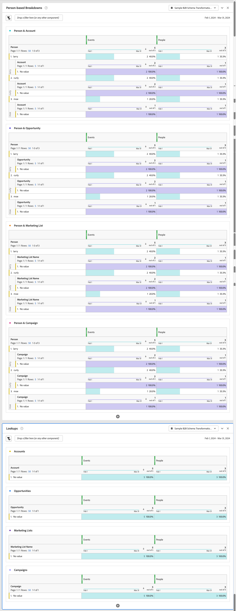

# Ejemplo de proyecto B2B

En este artículo se explica cómo configurar y crear informes sobre los datos B2B basados en el nivel de perfil (persona) en Customer Journey Analytics.

## Conexión

Defina su conexión para incluir todos los conjuntos de datos B2B relevantes de Experience Platform. Asegúrese de incluir y transformar todos los conjuntos de datos de búsqueda relevantes necesarios para un escenario típico de informes basados en personas B2B. Consulte [Transformar conjuntos de datos de búsqueda B2B](/help/connections/transform-datasets-b2b-lookups.md) para obtener más información.

Conjuntos de datos que puede considerar para agregar a su conexión:

| Conjunto de datos | Esquema | Tipo de esquema | Clase base | Descripción |
|---|---|---|---|---|
| Conjunto de datos de actividad B2B | Esquema de actividad B2B | Evento | ExperienceEvent de XDM | Un ExperienceEvent es un registro de hechos de lo que ha ocurrido, incluido el momento y la identidad de la persona involucrada. Los ExperienceEvents pueden ser explícitos (acciones humanas directamente observables) o implícitos (planteados sin una acción humana directa) y se registran sin agregación ni interpretación. Son esenciales para el análisis en el dominio del tiempo, ya que permiten la observación y el análisis de los cambios que se producen en un período de tiempo determinado y la comparación entre varios períodos de tiempo para rastrear las tendencias. |
| Conjunto de datos de persona B2B | Esquema de persona B2B | Perfil | Perfil individual de XDM | Un perfil individual de XDM forma una representación singular de los atributos e intereses de las personas identificadas y parcialmente identificadas. Los perfiles menos identificados pueden contener solo señales de comportamiento anónimas, como las cookies del explorador, mientras que los perfiles altamente identificados pueden contener información personal detallada como el nombre, la fecha de nacimiento, la ubicación y la dirección de correo electrónico. A medida que un perfil crece, se convierte en un repositorio sólido de información personal, información de identificación, detalles de contacto y preferencias de comunicación para un individuo. |
| Conjunto de datos de relación de persona de la cuenta B2B | Esquema de relación de persona de la cuenta B2B | Búsqueda | Relación de persona de cuenta empresarial de XDM | La relación de persona de la cuenta empresarial de XDM es una clase de modelo de datos de experiencia (XDM) estándar que captura las propiedades mínimas requeridas de una persona asociada a una cuenta comercial. |
| Conjunto de datos de relación de persona de oportunidad B2B | Esquema de relación de persona de oportunidad B2B | Búsqueda | Relación de persona de oportunidad empresarial de XDM | La relación personal de oportunidades comerciales de XDM es una clase de modelo de datos de experiencia (XDM) estándar que captura las propiedades mínimas requeridas de una persona asociada a una oportunidad comercial. |
| Conjunto de datos de miembros de lista de marketing B2B | Esquema de miembros de lista de marketing B2B | Búsqueda | Miembros de lista de marketing XDM | Los miembros de la lista de marketing empresarial de XDM es una clase de modelo de datos de experiencia (XDM) estándar que describen miembros, personas o contactos asociados a una lista de marketing. |
| Conjunto de datos de miembros de campañas B2B | Esquema de miembro de campaña B2B | Búsqueda | Miembros de campaña empresarial de XDM | Los miembros de XDM Business Campaign son una clase de modelo de datos de experiencia (XDM) estándar que describen un contacto o posible cliente asociado a una campaña empresarial. |

<!--
| B2B Account Dataset | B2B Account Schema | Lookup | XDM Business Account | XDM Business Account is a standard Experience Data Model (XDM) class that captures the minimum required properties of a business account.  |
| B2B Opportunity Dataset | B2B Opportunity Schema | Lookup | XDM Business Opportunity | XDM Business Opportunity is a standard Experience Data Model (XDM) class that captures the minimum required properties of a business opportunity.  |
| B2B Campaign Dataset | B2B Campaign Schema | Lookup | XDM Business Campaign | XDM Business Campaign is a standard Experience Data Model (XDM) class that captures the minimum required properties of a business campaign.  |
| B2B Marketing List Dataset | B2B Marketing List Schema | Lookup | XDM Marketing List | XDM Business Marketing List is a standard Experience Data Model (XDM) class that captures the minimum required properties of a marketing list. Marketing lists allow you to prioritize on prospect clients who are most likely to buy your product.  |
-->

La relación entre los esquemas de búsqueda, el esquema de perfil y el esquema de evento se define en la configuración B2B dentro de Experience Platform. Consulte Esquemas en [Real-time Customer Data Platform B2B Edition](https://experienceleague.adobe.com/docs/experience-platform/rtcdp/schemas/b2b.html) y [Defina una relación varios a uno entre dos esquemas en Real-time Customer Data Platform B2B Edition](https://experienceleague.adobe.com/docs/experience-platform/xdm/tutorials/relationship-b2b.html) para obtener más información.

Para cada conjunto de datos de búsqueda que agregue a su conexión, debe definir explícitamente la relación con un conjunto de datos de evento mediante **[!UICONTROL Key]** y **[!UICONTROL Matching key]** en el cuadro de diálogo **[!UICONTROL Editar conjunto de datos]**. Por ejemplo:

Se utilizan cuatro esquemas explícitamente para conectar el esquema Person a otros esquemas relevantes: Cuenta, Oportunidad, Campaña y Lista de marketing. Estos esquemas se basan en las siguientes clases de esquema:

* Relación de persona de cuenta empresarial de XDM
* Relación de persona de oportunidad empresarial de XDM
* Miembros de lista de marketing empresarial de XDM
* Miembros de campaña empresarial de XDM

Para cada conjunto de datos de búsqueda, para un esquema basado en una clase de esquema de este tipo, también habilita **[!UICONTROL Transformar conjunto de datos]** para garantizar que los datos se transformen para búsquedas basadas en personas. Consulte [Transformación de conjuntos de datos para búsquedas B2B](/help/connections/transform-datasets-b2b-lookups.md) para obtener más información.

La tabla siguiente proporciona un ejemplo de información general de los valores de [!UICONTROL ID de persona], [!UICONTROL clave] y [!UICONTROL clave coincidente] para cada uno de los conjuntos de datos.

| Conjunto de datos | ID de la persona | Clave | Clave de coincidencia (en el conjunto de datos de evento) |
|---|---|---|---|
| Conjunto de datos de actividad B2B | `personKey.sourceKey` | | |
| Conjunto de datos de persona B2B | `b2b.personKey.sourceKey` | | |
| Conjunto de datos de persona de cuenta B2B | | `personKey.sourceKey` | `personKey.sourceKey` |
| Conjunto de datos de oportunidad B2B | | `personKey.sourceKey` | `personKey.sourceKey` |
| Conjunto de datos de miembros de campañas B2B | | `personKey.sourceKey` | `personKey.sourceKey` |
| Conjunto de datos de lista de marketing B2B | | `personKey.sourceKey` | `personKey.sourceKey` |

{style="table-layout:auto"}

Consulte [Agregar y configurar conjuntos de datos](../../connections/create-connection.md) para obtener más información sobre cómo establecer la configuración de un conjunto de datos.

## Vista de datos

Para tener acceso a dimensiones y métricas B2B relevantes al crear su proyecto de Workspace, debe definir la vista de datos en consecuencia.

Puede añadir los siguientes componentes como dimensiones a la vista de datos para asegurarse de que puede informar a nivel personal sobre los datos B2B. Los nombres de los componentes se modifican para una mayor claridad.

| Nombre del componente | Conjunto de datos | Tipo de datos del esquema | Ruta de esquema |
|---|---|---|---|
| Persona | Actividad B2B | Cadena | `personID` |
| Cuenta | Persona de cuenta B2B | Cadena | `accountKey.sourceID` |
| Campaign | Miembro de campaña B2B | Cadena | `campaignKey.sourceKey` |
| Nombre de lista de marketing | Lista de marketing B2B | Cadena | `marketingListID` |
| Oportunidad | Persona de oportunidad B2B | Cadena | `opportunityKey.sourceID` |

<!--
This section provides recommendations and suggestions on what dimensions and metrics to include when defining the [components](../../data-views/create-dataview.md#components) for B2B datasets in your data view.

For each component, the name, schema type, schema path, and (when applicable) details about the configuration are provided.

+++ B2B Activity dataset

### Metrics

| Component Name | Schema data type | Schema path | Configuration |
|---|---|---|---|
| Add To Campaign | String | `eventType` | **[!UICONTROL Set include/exclude values]** **[!UICONTROL Case sensitive]** Match: **[!UICONTROL If all criteria are met]** Criteria: **[!UICONTROL Equals]** `leadOperation.addToCampaign` |
| Add To Opportunity | String | `eventType` | **[!UICONTROL Set include/exclude values]** **[!UICONTROL Case sensitive]** Match: **[!UICONTROL If all criteria are met]** Criteria: **[!UICONTROL Equals]** `opportunityEvent.addToOpportunity` |
| Application Closed | String | `eventType` | **[!UICONTROL Set include/exclude values]** **[!UICONTROL Case sensitive]** Match: **[!UICONTROL If all criteria are met]** Criteria: **[!UICONTROL Equals]** `application.close` |
| Application Launch | String | `eventType` | **[!UICONTROL Set include/exclude values]** **[!UICONTROL Case sensitive]** Match: **[!UICONTROL If all criteria are met]** Criteria: **[!UICONTROL Equals]** `application.launch` |
| Campaign Stream | String | `eventType` | **[!UICONTROL Set include/exclude values]** **[!UICONTROL Case sensitive]** Match: **[!UICONTROL If all criteria are met]** Criteria: **[!UICONTROL Equals]** ` leadOperation.changeCampaignStream` |
| Checkout | String | `eventType` | **[!UICONTROL Set include/exclude values]** **[!UICONTROL Case sensitive]** Match: **[!UICONTROL If all criteria are met]** Criteria: **[!UICONTROL Equals]** `commerce.checkouts` |
| Convert Lead | String | `eventType` | **[!UICONTROL Set include/exclude values]** **[!UICONTROL Case sensitive]** Match: **[!UICONTROL If all criteria are met]** Criteria: **[!UICONTROL Equals]** `leadOperation.convertLead` |
| Email Clicked | String | `eventType` | **[!UICONTROL Set include/exclude values]** **[!UICONTROL Case sensitive]** Match: **[!UICONTROL If all criteria are met]** Criteria: **[!UICONTROL Equals]** `directMarketing.emailClicked` |
| Email Delivered | String | `eventType` | **[!UICONTROL Set include/exclude values]** **[!UICONTROL Case sensitive]** Match: **[!UICONTROL If all criteria are met]** Criteria: **[!UICONTROL Equals]** `directMarketing.emailDelivered` |
| Email Opened | String | `eventType` | **[!UICONTROL Set include/exclude values]** **[!UICONTROL Case sensitive]** Match: **[!UICONTROL If all criteria are met]** Criteria: **[!UICONTROL Equals]** `directMarketing.emailOpened` |
| Email Sent | String | eventType | **[!UICONTROL Set include/exclude values]** **[!UICONTROL Case sensitive]** Match: **[!UICONTROL If all criteria are met]** Criteria: **[!UICONTROL Equals]** `directMarketing.emailSent` |
| Email Unsubscribed | String | `eventType` | **[!UICONTROL Set include/exclude values]** **[!UICONTROL Case sensitive]** Match: **[!UICONTROL If all criteria are met]** Criteria: **[!UICONTROL Equals]** `directMarketing.emailUnsubscribed` |
| Form Filled Out | String | `eventType` | **[!UICONTROL Set include/exclude values]** **[!UICONTROL Case sensitive]** Match: **[!UICONTROL If all criteria are met]** Criteria: **[!UICONTROL Equals]** `web.formFilledOut` |
| Form Started | String | `web.fillOutForm.webFormName` | |
| Leads | String | eventType | **[!UICONTROL Set include/exclude values]** **[!UICONTROL Case sensitive]** Match: **[!UICONTROL If all criteria are met]** Criteria: **[!UICONTROL Equals]** `leadOperation.newLead` |
| Opportunity Updated | String | `eventType` | **[!UICONTROL Set include/exclude values]** **[!UICONTROL Case sensitive]** Match: **[!UICONTROL If all criteria are met]** Criteria: **[!UICONTROL Equals]** `opportunityEvent.opportunityUpdated` |
| Price | Double | *_organizationID*`.interactions.products.price` |  |
| Priority | Integer | `leadOperation.changeScore.priority` |  |
| Prod List Add | String | `eventType` |  **[!UICONTROL Set include/exclude values]** **[!UICONTROL Case sensitive]** Match: **[!UICONTROL If all criteria are met]** Criteria: **[!UICONTROL Equals]** `commerce.productListAdds.value` |
| Prod List Open | String | `eventType` |  **[!UICONTROL Set include/exclude values]** **[!UICONTROL Case sensitive]** Match: **[!UICONTROL If all criteria are met]** Criteria: **[!UICONTROL Equals]** `commerce.productListOpens.value` |
| Prod View | String | `eventType` |  **[!UICONTROL Set include/exclude values]** **[!UICONTROL Case sensitive]** Match: **[!UICONTROL If all criteria are met]** Criteria: **[!UICONTROL Equals]** `commerce.productViews.value` |
| Purchases | String | `eventType` |  **[!UICONTROL Set include/exclude values]** **[!UICONTROL Case sensitive]** Match: **[!UICONTROL If all criteria are met]** Criteria: **[!UICONTROL Equals]** `commerce.purchases.value` |
| Remove From Opportunity | String | `eventType` |  **[!UICONTROL Set include/exclude values]** **[!UICONTROL Case sensitive]** Match: **[!UICONTROL If all criteria are met]** Criteria: **[!UICONTROL Equals]** `opportunityEvent.removeFromOpportunity` |
| Save for Laters | String | eventType |  **[!UICONTROL Set include/exclude values]** **[!UICONTROL Case sensitive]** Match: **[!UICONTROL If all criteria are met]** Criteria: **[!UICONTROL Equals]** `commerce.productViews.value` |

{style="table-layout:auto"}

### Dimensions

| Component Name | Schema data type | Schema path | Configuration |
|---|---|---|---|
| Account Key (Source Key) | String | *_organizationID*`.Interactions.accountKey.sourceKey` | |
| Converted Status | String | `leadOperation.convertLead.convertedStatus` | |
| Event Type | String | `eventType` | |
| Form Name | String | `leadOperation.newLead.formName` | |
| Identifier | String | `_id` | |
| Is Sent Notification | Boolean | `leadOperation.convertLead.isSentNotificationEmail` | |
| Keywords | String | `search.keywords` | |
| List ID | String | `listOperations.listID` | |
| List Name | String | `leadOperation.newLead.listName` | |
| Page Name | String | `web.webPageDetails.name` | |
| Person Key (Source Key) | String | `personKey.sourceKey` | |
| Produced By | String | producedBy | |
| Product Name | String | *_organizationID*`.Interactions.products.name` | |
| Role | String | `opportunityEvent.role` | | 
| Timestamp | Date-time | `timestamp` | Date-Time format: **[!UICONTROL Day]** |
| URL | String | `web.webPageDetails.URL` | |
| Web Form Name | String | `web.fillOutForm.webFormName` | |
| Product URL | String | *_organizationID*`.Interactions.products.url` | |

{style="table-layout:auto"}

+++

+++ B2B Person dataset

### Metrics

No metric components are defined as part of this dataset.

### Dimensions

| Component Name | Schema data type | Schema path | Configuration |
|---|---|---|---|
| Last Activity Date | Date-time | `extSourceSystemAudit.lastActivityDate` | Date-Time format: **[!UICONTROL Day]** |
| Person ID | String | `personID` | |

{style="table-layout:auto"}

+++

+++ B2B Account Person dataset

### Metrics

| Component Name | Schema data type | Schema path | Configuration |
|---|---|---|---|
| Annual Revenue | Double | `accountOrganization.annualRevenue.amount` | |
| Number of employees | Integer | `accountOrganization.numberOfEmployees` | |

{style="table-layout:auto"}

### Dimensions

| Component Name | Schema data type | Schema path | Configuration |
|---|---|---|---|
| Acount | String | `accountKey.sourceID` | 

{style="table-layout:auto"}

| Account Identifier | String | `accountID` | |
| Account Type | String | `accountType` | |
| City | String | `accountBillingAddress.city` | |
| Country | String | `accountBillingAddress.country` | |
| Industry | String | `accountOrganization.industry` | |
| Region | String | `accountBillingAddress.region` | |
| Source ID | String | `accountKey.sourceID` | |
| Source Instance ID | String | `accountKey.sourceInstanceID` | |
| Source Key | String | `accountKey.sourceKey` | |
| Source Type | String | `accountKey.sourceType` | |

+++

+++  B2B Opportunity Person dataset

### Metrics

| Component Name | Schema data type | Schema path | Configuration |
|---|---|---|---|
| Expected Revenue | Double | `expectedRevenue.amount` | Behavior: **[!UICONTROL Count values]** |
| Opportunity Amount | Double | `opportunityAmount.amount` | Behavior: **[!UICONTROL Count values]** |
| Opportunity Stage - Closed Book | String | `opportunityStage` | **[!UICONTROL Set include/exclude values]** **[!UICONTROL Case sensitive]** Match: **[!UICONTROL If all criteria are met]** Criteria: **[!UICONTROL Equals]** `Closed - Booked` |
| Opportunity Stage - Prospect | String | `opportunityStage` | **[!UICONTROL Set include/exclude values]** **[!UICONTROL Case sensitive]** Match: **[!UICONTROL If all criteria are met]** Criteria: **[!UICONTROL Equals]** `Prospect` |
| Opportunity Stage - Qualification | String | `opportunityStage` | **[!UICONTROL Set include/exclude values]** **[!UICONTROL Case sensitive]** Match: **[!UICONTROL If all criteria are met]** Criteria: **[!UICONTROL Equals]** `Opportunity Qualification` |
| Opportunity Stage - Solution Definition | String | `opportunityStage` | **[!UICONTROL Set include/exclude values]** **[!UICONTROL Case sensitive]** Match: **[!UICONTROL If all criteria are met]** Criteria: **[!UICONTROL Equals]** `Solution Definition and Validation` |

{style="table-layout:auto"}

### Dimensions

| Component Name | Schema data type | Schema path | Configuration |
|---|---|---|---|
| Closed Flag | Boolean | `isClosed` | |
| Company ID | String | `opportunityID` | |
| Forecast Category | String | `forecastCategoryName` | |
| Last Activity Date | Date-time | `lastActivityDate` | Date-time format: **[!UICONTROL Day]** |
| Lead Source | String | `leadSource` | |
| Opportunity Name | String | `opportunityName` | | 
| Opportunity Status | String | `opportunityStage` | |
| Won Flag | Boolean | `isWon` | |

{style="table-layout:auto"}

+++

+++ B2B Campaign Member dataset

### Metrics

| Component Name | Schema data type | Schema path | Configuration |
|---|---|---|---|
| Bounced | Long | *_organizationID*`.campaignBounced` | Behavior: **[!UICONTROL Count values]** |
| Clicked | Long | *_organizationID*`.campaignClicked` | Behavior: **[!UICONTROL Count values]** |
| Opened | Long | *_organizationID*`.CampaignOpened` | Behavior: **[!UICONTROL Count values]** |
| Sent | Long | *_organizationID*`.campaignSent` | Behavior: **[!UICONTROL Count values]** |
| Subscribed | Long | *_organizationID*`.campaignSubscribed` | Behavior: **[!UICONTROL Count values]** |
| Webinar Registrations | Long | *_organizationID*`.Registrations` | Behavior: **[!UICONTROL Count values]** |

{style="table-layout:auto"}

### Dimensions

| Component Name | Schema data type | Schema path | Configuration |
|---|---|---|---|
| Campaign ID | String | `campaignID` | |
| Campaign Member ID | String | `campaignMemberID` | |
| Campaign Member Status | String | `memberStatus` | |
| Campaign Member Status Reason | String | `memberStatusReason` | |
| Created Date | Date-time | `extSourceSystemAudit.createdDate` | Date-time format: **[!UICONTROL Day]** |
| First Responded Date | String | `firstRespondedDate` | Date-time format: **[!UICONTROL Day]** |
| Has Reached Success | Boolean | `hasReachedSuccess` | |
| Has Responded | Boolean | `hasResponded` | |
| Last Status | String | `lastStatus` | |
| Last Updated Date | Date-time | `extSourceSystemAudit.lastUpdatedDate` | Date-time format: **[!UICONTROL Day]** |
| Membership Date | Date-time | `membershipDate` | Date-time format: **[!UICONTROL Day]** |
| Nurture Cadence | String | `nurtureCadence` | |
| Nurture Track Name | String | `nurtureTrackName` | |
| Person ID | String | `personID` | |
| Reached Success Date | Date-time | `reachedSuccessDate` | Date-time format: **[!UICONTROL Day]** |
| Webinar Registration ID | String | `webinarRegistrationID` | |
| Webinar Registration URL | String | `webinarConfirmationUrl` | |
| isExhausted | Boolean | isExhausted | |

{style="table-layout:auto"}

+++

+++ B2B Marketing List Member dataset

### Metrics

### Dimensions

+++

-->

## Workspace

Con los componentes correctamente definidos en la vista de datos, ahora puede crear informes y visualizaciones B2B específicos en su proyecto de Workspace.

A continuación se muestra un proyecto de ejemplo que se basa en la conexión y la vista de datos descritas anteriormente.

<!-- See the descriptions for each visualization for more details.

+++ Example project

+++
-->
