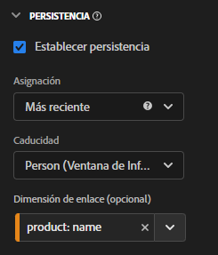
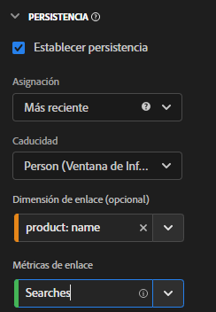

# Uso de dimensiones y métricas de enlace en CJA

Customer Journey Analytics ofrece varias formas de mantener los valores de dimensión más allá de la visita en la que están configurados. Uno de los métodos de persistencia que ofrece el Adobe se conoce como Enlace. En versiones anteriores de Adobe Analytics, este concepto se conocía como comercialización.

Aunque puede utilizar dimensiones de enlace con datos de evento de nivel superior, este concepto es mejor utilizado cuando se trabaja con [Matrices de objetos](object-arrays.md). Puede atribuir una dimensión a una parte de una matriz de objetos sin aplicarla a todos los atributos de un suceso determinado. Por ejemplo, puede atribuir un término de búsqueda a un producto de la matriz de objetos del carro de compras sin enlazar ese término de búsqueda al evento completo.

## Ejemplo 2: Uso de métricas de enlace para enlazar el término de búsqueda con una compra de producto

Uno de los métodos de comercialización más comunes en Adobe Analytics ha sido enlazar un término de búsqueda a un producto para que cada término de búsqueda obtenga crédito por su producto apropiado. Tenga en cuenta el siguiente recorrido del cliente:

1. Un visitante llega a su sitio y busca &quot;guantes de boxeo&quot;.

   ```json
   {
       "PersonID": "1",
       "page_name": "Search results",
       "search": "1",
       "search_term": "boxing gloves",
       "product": [
           {
               "name": "Beginner gloves",
               "color": "Red",
               "price": "25.69"
           },
           {
               "name": "Tier 3 gloves",
               "color": "Black",
               "price": "89.99"
           },
           {
               "name": "Professional gloves",
               "color": "Blue",
               "price": "224.99"
           }
       ]
   }
   ```

1. Encuentran un par de guantes que les gustan y los añaden al carro de compras.

   ```json
   {
       "PersonID": "1",
       "page_name": "Shopping cart",
       "cart_add": "1",
       "product": [
           {
               "name": "Tier 3 gloves",
               "color": "Black",
               "price": "89.99"
           }
       ]
   }
   ```

1. A continuación, el visitante busca &quot;raqueta de tenis&quot;.

   ```json
   {
       "PersonID": "1",
       "page_name": "Search results",
       "search": "1",
       "search_term": "tennis racket",
       "product": [
           {
               "name": "Shock absorb racket",
               "price": "34.99"
           },
           {
               "name": "Women's open racket",
               "price": "49.99"
           },
           {
               "name": "Extreme racket",
               "price": "134.99"
           }
       ]
   }
   ```

1. Encuentran un raqueta que les gusta y lo añaden al carro de compras.

   ```json
   {
       "PersonID": "1",
       "page_name": "Shopping cart",
       "cart_add": "1",
       "product": [
           {
               "name": "Tier 3 gloves",
               "color": "Black",
               "price": "89.99"
           },
           {
               "name": "Shock absorb racket",
               "price": "34.99"
           }
       ]
   }
   ```

1. El visitante busca por tercera vez &quot;zapatos&quot;.

   ```json
   {
       "PersonID": "1",
       "page_name": "Search results",
       "search": "1",
       "search_term": "shoes",
       "product": [
           {
               "name": "Men's walking shoes",
               "color": "Grey",
               "price": "54.95"
           },
           {
               "name": "Tennis shoes",
               "color": "White",
               "price": "42.59"
           },
           {
               "name": "Skate shoes",
               "color": "Black",
               "price": "79.99"
           }
       ]
   }
   ```

1. Encuentran un par de zapatos que les gustan y los añaden al carro de compras.

   ```json
   {
       "PersonID": "1",
       "page_name": "Shopping cart",
       "cart_add": "1",
       "product": [
           {
               "name": "Tier 3 gloves",
               "color": "Black",
               "price": "89.99"
           },
           {
               "name": "Shock absorb racket",
               "price": "34.99"
           },
           {
               "name": "Skate shoes",
               "color": "Black",
               "price": "79.99"
           }
       ]
   }
   ```

1. El visitante pasa por el proceso de cierre de compra y compra estos tres artículos.

   ```json
   {
       "PersonID": "1",
       "page_name": "Thank you for your purchase",
       "purchase": "1",
       "product": [
           {
               "name": "Tier 3 gloves",
               "color": "Black",
               "price": "89.99"
           },
           {
               "name": "Shock absorb racket",
               "price": "34.99"
           },
           {
               "name": "Skate shoes",
               "color": "Black",
               "price": "79.99"
           }
       ]
   }
   ```

Si utiliza un modelo de asignación tradicional con término de búsqueda, los tres productos solo atribuyen los ingresos a un único término de búsqueda. Por ejemplo, si utilizó la primera asignación con la dimensión de término de búsqueda:

| search_term | ingresos |
| --- | --- |
| guantes de boxeo | 204,97 $ |

Si ha utilizado la última asignación con la dimensión de término de búsqueda, los tres productos siguen atribuyendo ingresos a un único término de búsqueda:

| search_term | ingresos |
| --- | --- |
| zapatos | 204,97 $ |

Aunque este ejemplo incluye solo un visitante, muchos visitantes que buscan cosas diferentes pueden atribuir de forma incorrecta términos de búsqueda a productos diferentes, lo que dificulta la determinación de cuáles son realmente los mejores resultados de búsqueda.

Con una dimensión de enlace, el Adobe toma nota del elemento de dimensión al que está enlazado. Cuando ese mismo valor de enlace se ve en un evento subsiguiente, trae el elemento de dimensión para que pueda atribuirle la métrica deseada. En este ejemplo, podemos establecer la dimensión de enlace para search_term en product name:



Cuando establecemos esta dimensión en el Administrador de vista de datos, también se requiere que definamos una métrica de enlace porque la dimensión de enlace está en una matriz de objetos. Una métrica de enlace actúa como déclencheur para una dimensión de enlace, por lo que solo se une a los eventos en los que la métrica de enlace está presente. En esta implementación de ejemplo, la página de resultados de búsqueda siempre incluye una dimensión de término de búsqueda y una métrica de búsquedas. Podemos enlazar términos de búsqueda con nombres de producto siempre que la métrica Búsquedas esté presente.



Al establecer la dimensión de término de búsqueda en este modelo de persistencia, se ejecuta la siguiente lógica:

* Cuando search_term está en un evento, compruebe la presencia del nombre del producto.
* Si el nombre del producto no está allí, no haga nada.
* Si el nombre del producto está allí, compruebe la presencia de la métrica Búsquedas .
* Si la métrica Búsquedas no está allí, no haga nada.
* Si la métrica Búsquedas está allí, vincule el término de búsqueda a todos los nombres de productos. Actúa como si estuviera en el mismo nivel que el nombre del producto para ese evento. En este ejemplo, se trata como product.search_term.
* Si se ve el mismo nombre de producto en un evento posterior, el término de búsqueda enlazado también existe allí.

En Analysis Workspace, el informe resultante tendría un aspecto similar al siguiente:

| search_term | ingresos |
| --- | --- |
| guantes de boxeo | 89,99 $ |
| raqueta de tenis | 34,99 $ |
| zapatos | 79,99 $ |
