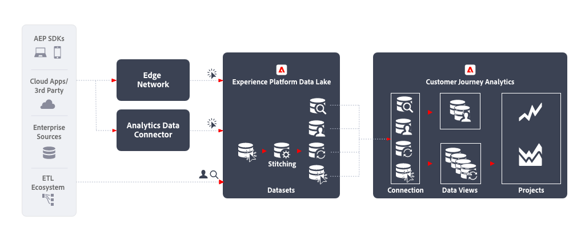

# Análisis en canales múltiples

El análisis en canales múltiples permite una sola vista consolidada del comportamiento de los clientes en varios canales mediante la unificación de datos de varias propiedades web, móviles y sin conexión. Por ejemplo, puede utilizar esta vista consolidada para analizar las interacciones de los clientes en equipos de escritorio y dispositivos móviles, a fin de comprender el comportamiento de los clientes y extraer perspectivas para optimizar las experiencias de los clientes digitales. También puede analizar las interacciones de los clientes entre canales, incluidos los canales digitales y sin conexión, como las interacciones de soporte y las compras en la tienda, para comprender y optimizar mejor el recorrido del cliente.

## Flujo de trabajo

## Pasos de la implementación

1. [Cree esquemas](https://experienceleague.adobe.com/docs/experience-platform/xdm/tutorials/create-schema-ui.html?lang=es) para introducir los datos.
1. [Cree conjuntos de datos](https://experienceleague.adobe.com/docs/platform-learn/tutorials/data-ingestion/create-datasets-and-ingest-data.html?lang=es) para incorporar los datos.
1. [Ingresar datos en Experience Platform](https://experienceleague.adobe.com/docs/platform-learn/tutorials/data-ingestion/understanding-data-ingestion.html?lang=es):
   1. Datos basados en eventos  desde un sitio web o una aplicación móvil a través de la red perimetral o el conector de datos de Analytics.
   2. Datos de perfil  (por ejemplo, desde un sistema CRM, una aplicación de centro de llamadas o una aplicación de fidelidad).
   3. Búsqueda de datos  (por ejemplo, nombre del producto, categoría de un sistema de información de productos).

1. Utilice un ID de área de nombres común en todos los conjuntos de datos. Uso [Vinculación](../../stitching/overview.md) para elevar cualquier conjunto de datos basado en eventos  con respecto a proporcionar el ID común en cada fila. Tenga en cuenta que Customer Journey Analytics no utiliza actualmente los servicios de perfil o intentidad de Experience Platform para la vinculación.
1. Realice cualquier preparación de datos personalizada para asegurarse de que se incorpora una clave común en los conjuntos de datos de series temporales en Customer Journey Analytics.
1. Asigne un ID principal a los datos de búsqueda que pueda unirse a un campo en los datos de evento. Cuenta como filas en licencias.
1. Establezca el mismo ID principal para los datos de perfil que el ID principal de los datos de evento.
1. [Crear una conexión](../../connections/overview.md) para introducir los conjuntos de datos relevantes de Experience Platform a Customer Journey Analytics.
1. [Cree una vista de datos](/help/data-views/create-dataview.md) con la conexión para seleccionar las dimensiones y métricas específicas que se incluirán en la vista. La configuración de atribución y asignación también se configura en la vista de datos. Estas configuraciones se calculan en el momento del informe.
1. [Cree un proyecto para configurar tableros e informes en Analysis Workspace.](/help/analysis-workspace/home.md)

## Consideraciones

Al establecer este flujo de trabajo, asegúrese de tener en cuenta los siguientes puntos.

* El análisis de datos entre canales requiere la misma área de nombres de ID en cada registro.
* El proceso de unión de conjuntos de datos dispares requiere una clave persona/entidad principal común en todos los conjuntos de datos.
* Actualmente no se admiten uniones secundarias basadas en claves.
* El proceso de vinculación permite volver a incrustar identidades en filas en función de registros de ID transitorios posteriores, como un ID de autenticación. Esto permite resolver registros dispares en un único ID para su análisis en el nivel de la persona, en lugar de en el nivel de dispositivo o cookie.
* Los objetos y atributos del mismo campo XDM se combinan en una dimensión en Customer Journey Analytics. Para combinar varios atributos de varios conjuntos de datos en la misma dimensión de Customer Journey Analytics, los conjuntos de datos deben hacer referencia al mismo campo o esquema XDM.

