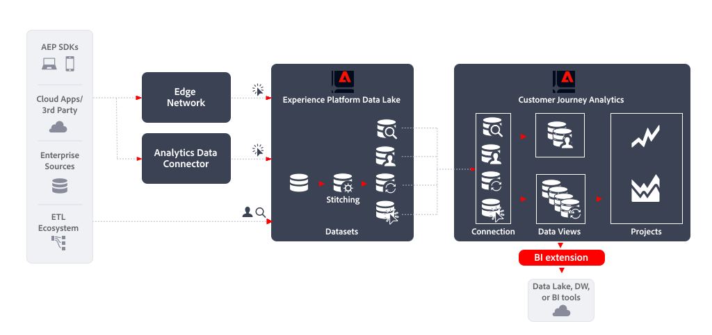

# Extensión de BI

Este artículo describe cómo [!DNL Customer Journey Analytics BI extension] se puede utilizar para implementar lo siguiente [caso de uso de exportación de datos](overview.md):

- Herramientas de lago de datos, Data Warehouse o BI

## Primeros pasos

Exportación de datos mediante [!DNL Customer Journey Analytics BI extension] permite exportar datos desde las vistas de datos de Customer Journey Analytics.

## Más información

[!DNL Customer Journey Analytics BI extension] habilita el acceso SQL a las [vistas de datos](/help/data-views/data-views.md) que ha definido en Customer Journey Analytics. Es posible que sus ingenieros y analistas de datos estén más familiarizados con Power BI, Tableau u otras herramientas de inteligencia empresarial y visualización (también denominadas herramientas de BI). Ahora pueden crear informes y paneles basados en las mismas vistas de datos que utilizan los usuarios de Customer Journey Analytics al crear sus proyectos de Analysis Workspace.

Para obtener más información, consulte la documentación detallada de la [Extensión de BI](../../data-views/bi-extension.md).
