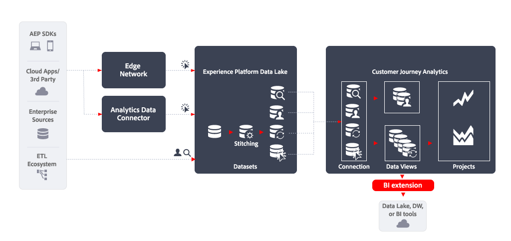

# Extensión de BI

Este artículo describe cómo se puede usar [!DNL Customer Journey Analytics BI extension] para implementar el siguiente [caso de uso de exportación de datos](overview.md):

* Herramientas de Data Lake, Data Warehouse o BI

## Introducción

La exportación de datos mediante [!DNL Customer Journey Analytics BI extension] le permite exportar datos desde las vistas de datos de Customer Journey Analytics.

## Más información

[!DNL Customer Journey Analytics BI extension] habilita el acceso SQL a las [vistas de datos](/help/data-views/data-views.md) que ha definido en Customer Journey Analytics. Sus ingenieros y analistas de datos están más familiarizados con Power BI, Tableau u otras herramientas de inteligencia empresarial y visualización (también denominadas herramientas de BI). Ahora pueden crear informes y paneles de control basados en las mismas vistas de datos que utilizan los usuarios de Customer Journey Analytics al crear sus proyectos de Analysis Workspace.

La extensión de BI devuelve datos agregados, no filas de nivel de evento sin procesar. De forma predeterminada, cada consulta devuelve 50 filas para un intervalo de fechas de 30 días, pero puede anular el límite de filas a un máximo de 50 000 filas y el intervalo de fechas a su propio intervalo personalizado. Vea [Valores predeterminados y limitaciones](../../data-views/bi-extension.md#defaults-and-limitations) para obtener más información.

Para obtener más información, consulte la documentación detallada sobre la [extensión de BI](../../data-views/bi-extension.md).
