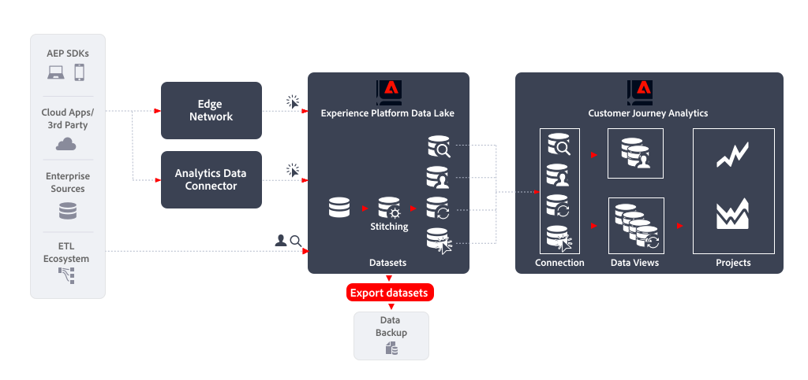

# Exportar conjuntos de datos

Este artículo describe cómo [!DNL Customer Journey Analytics Export datasets] se puede utilizar para implementar lo siguiente [caso de uso de exportación de datos](overview.md):

- Backup de datos

## Primeros pasos

Exportación de datos mediante [!DNL Experience Platform Export datasets] permite exportar datos de las vistas de datos de Customer Journey Analytics a cualquier destino de almacenamiento de nube.

## Más información

Puede exportar conjuntos de datos sin procesar desde el lago de datos en Experience Platform a destinos de almacenamiento en la nube. Esta exportación se realiza en la terminología Destinos de Experience Platform, que se denomina destinos de exportación de conjuntos de datos. Consulte [Exportar conjuntos de datos a destinos de almacenamiento en la nube](https://experienceleague.adobe.com/en/docs/experience-platform/destinations/ui/activate/export-datasets) para obtener una descripción general.

Se admiten los siguientes destinos de almacenamiento en la nube:

- [Azure Data Lake Storage Gen2](https://experienceleague.adobe.com/en/docs/experience-platform/destinations/catalog/cloud-storage/adls-gen2)
- [Zona de aterrizaje de datos](https://experienceleague.adobe.com/en/docs/experience-platform/destinations/catalog/cloud-storage/data-landing-zone)
- [Almacenamiento de Google Cloud](https://experienceleague.adobe.com/en/docs/experience-platform/destinations/catalog/cloud-storage/google-cloud-storage)
- [Amazon S3](https://experienceleague.adobe.com/en/docs/experience-platform/destinations/catalog/cloud-storage/amazon-s3#changelog)
- [Azure Blob](https://experienceleague.adobe.com/en/docs/experience-platform/destinations/catalog/cloud-storage/azure-blob#changelog)
- [SFTP](https://experienceleague.adobe.com/en/docs/experience-platform/destinations/catalog/cloud-storage/sftp#changelog)

### IU de Experience Platform

Puede exportar y programar la exportación de sus conjuntos de datos a través de la interfaz de usuario de Experience Platform. En esta sección se describen los pasos que debe seguir.

#### Seleccionar destino

Cuando haya determinado el destino del almacenamiento en la nube al que desea exportar el conjunto de datos, [seleccionar el destino](https://experienceleague.adobe.com/en/docs/experience-platform/destinations/ui/activate/export-datasets#select-destination). Cuando aún no haya configurado un destino para su almacenamiento en la nube preferido, debe [crear una nueva conexión de destino](https://experienceleague.adobe.com/en/docs/experience-platform/destinations/ui/connect-destination).

Como parte de la configuración de un destino, puede definir:

- el tipo de archivo (JSON o Parquet),
- si el archivo resultante debe comprimirse o no, y
- si se debe incluir o no un archivo de manifiesto.

#### Seleccionar conjunto de datos

Cuando haya seleccionado el destino, en el siguiente **[!UICONTROL Seleccionar conjuntos de datos]** paso tiene que seleccionar el conjunto de datos de la lista de conjuntos de datos. Si ha creado varias consultas programadas y desea que los conjuntos de datos se envíen al mismo destino de almacenamiento en la nube, puede seleccionar los conjuntos de datos correspondientes. Consulte [Seleccione sus conjuntos de datos](https://experienceleague.adobe.com/en/docs/experience-platform/destinations/ui/activate/export-datasets#select-datasets) para obtener más información.

#### Programación de exportación del conjunto de datos

Por último, desea programar la exportación del conjunto de datos como parte del **[!UICONTROL Programación]** paso. En ese paso puede definir la programación y si la exportación del conjunto de datos debe ser incremental o no. Consulte [Programar exportación del conjunto de datos](https://experienceleague.adobe.com/en/docs/experience-platform/destinations/ui/activate/export-datasets#scheduling) para obtener más información.

#### Pasos finales

[Revisar](https://experienceleague.adobe.com/en/docs/experience-platform/destinations/ui/activate/export-datasets#review) Cuando haya realizado la selección y sea correcta, empiece a exportar el conjunto de datos al destino de almacenamiento en la nube.

Primero, debe [verificar](https://experienceleague.adobe.com/en/docs/experience-platform/destinations/ui/activate/export-datasets#verify) exportación de datos correcta. Al exportar conjuntos de datos, Experience Platform crea uno o varios `.json` o `.parquet` archivos en la ubicación de almacenamiento definida en el destino. Se espera que los nuevos archivos se depositen en su ubicación de almacenamiento según la programación de exportación configurada. Experience Platform crea una estructura de carpetas en la ubicación de almacenamiento especificada como parte del destino seleccionado, donde deposita los archivos exportados. Se crea una nueva carpeta para cada tiempo de exportación, siguiendo el patrón: `folder-name-you-provided/datasetID/exportTime=YYYYMMDDHHMM`. El nombre de archivo predeterminado se genera de forma aleatoria y garantiza que los nombres de archivo exportados sean únicos.

### API de Flow Service

También puede exportar y programar la exportación de conjuntos de datos mediante API. Los pasos involucrados se documentan en [Exportación de conjuntos de datos mediante la API de Flow Service](https://experienceleague.adobe.com/en/docs/experience-platform/destinations/api/export-datasets).

#### Introducción

Para exportar conjuntos de datos, asegúrese de que tiene [permisos necesarios](https://experienceleague.adobe.com/en/docs/experience-platform/destinations/api/export-datasets#permissions). Compruebe también que el destino al que desea enviar el conjunto de datos admite la exportación de conjuntos de datos. Entonces, debe [recopilar los valores de los encabezados obligatorios y opcionales](https://experienceleague.adobe.com/en/docs/experience-platform/destinations/api/export-datasets#gather-values-headers) que utiliza en las llamadas de API. También es necesario [identificar las especificaciones de conexión y los ID de especificación de flujo del destino](https://experienceleague.adobe.com/en/docs/experience-platform/destinations/api/export-datasets#gather-connection-spec-flow-spec) tiene intención de exportar conjuntos de datos a.

#### Recuperar conjuntos de datos aptos

Puede [recuperar una lista de conjuntos de datos aptos](https://experienceleague.adobe.com/en/docs/experience-platform/destinations/api/export-datasets#retrieve-list-of-available-datasets) para la exportación y compruebe si su conjunto de datos forma parte de esa lista utilizando [`GET /connectionSpecs/{id}/configs`](https://developer.adobe.com/experience-platform-apis/references/destinations/#tag/Configurations/operation/getDatasets) API.

#### Crear conexión de origen

A continuación, debe [crear una conexión de origen](https://experienceleague.adobe.com/en/docs/experience-platform/destinations/api/export-datasets#create-source-connection) para el conjunto de datos, con su ID único, que desea exportar al destino de almacenamiento en la nube. Utilice el [`POST /sourceConnections`](https://developer.adobe.com/experience-platform-apis/references/destinations/#tag/Source-connections/operation/postSourceConnection) API.

#### Autenticar en el destino (crear conexión base)

Ahora debe [crear una conexión base](https://experienceleague.adobe.com/en/docs/experience-platform/destinations/api/export-datasets#create-base-connection) para autenticar y almacenar de forma segura las credenciales en su destino de almacenamiento en la nube mediante el [`POST /targetConection`](https://developer.adobe.com/experience-platform-apis/references/destinations/#tag/Target-connections/operation/postTargetConnection) API.

#### Proporcionar parámetros de exportación

A continuación, debe [crear una conexión de destino adicional que almacene los parámetros de exportación](https://experienceleague.adobe.com/en/docs/experience-platform/destinations/api/export-datasets#create-target-connection) para su conjunto de datos utilizando, una vez más, la variable [`POST /targetConection`](https://developer.adobe.com/experience-platform-apis/references/destinations/#tag/Target-connections/operation/postTargetConnection) API. Estos parámetros de exportación incluyen ubicación, formato de archivo, compresión, etc.

#### Configurar flujo de datos

Finalmente, usted [configuración del flujo de datos](https://experienceleague.adobe.com/en/docs/experience-platform/destinations/api/export-datasets#create-dataflow) para asegurarse de que el conjunto de datos se exporta al destino de almacenamiento en la nube mediante [`POST /flows`](https://developer.adobe.com/experience-platform-apis/references/destinations/#tag/Dataflows/operation/postFlow) API. En este paso, puede definir la programación de la exportación mediante el `scheduleParams` parámetro.

#### Validar flujo de datos

Hasta [compruebe las ejecuciones correctas del flujo de datos](https://experienceleague.adobe.com/en/docs/experience-platform/destinations/api/export-datasets#get-dataflow-runs), use el [`GET /runs`](https://developer.adobe.com/experience-platform-apis/references/destinations/#tag/Dataflow-runs/operation/getFlowRuns) API, especificando el ID del flujo de datos como parámetro de consulta. Este ID de flujo de datos es un identificador que se devuelve al configurar el flujo de datos.

[Verificar](https://experienceleague.adobe.com/en/docs/experience-platform/destinations/ui/activate/export-datasets#verify) exportación de datos correcta. Al exportar conjuntos de datos, Experience Platform crea uno o varios `.json` o `.parquet` archivos en la ubicación de almacenamiento definida en el destino. Se espera que los nuevos archivos se depositen en su ubicación de almacenamiento según la programación de exportación configurada. Experience Platform crea una estructura de carpetas en la ubicación de almacenamiento especificada como parte del destino seleccionado, donde deposita los archivos exportados. Se crea una nueva carpeta para cada tiempo de exportación, siguiendo el patrón: `folder-name-you-provided/datasetID/exportTime=YYYYMMDDHHMM`. El nombre de archivo predeterminado se genera de forma aleatoria y garantiza que los nombres de archivo exportados sean únicos.
