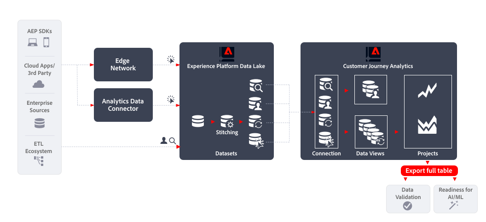

# Exportar tabla completa

Este artículo describe cómo se puede usar [!DNL Customer Journey Analytics BI extension] para implementar el siguiente [caso de uso de exportación de datos](overview.md):

- Validación de datos
- Preparación para AI/ML

## Primeros pasos

Exportar datos mediante [!DNL Customer Journey Analytics Full Table Export] le permite exportar datos de sus tablas improvisadas en Customer Journey Analytics Analysis Workspace.

## Más información

Puede exportar directamente el contenido completo de cualquier tabla de forma libre que cree en Analysis Workspace a destinos de nube designados mediante la funcionalidad Exportar tabla completa.

Para obtener más información, consulte la documentación detallada sobre [Exportar informes de Customer Journey Analytics a la nube](/help/analysis-workspace/export/export-cloud.md).
