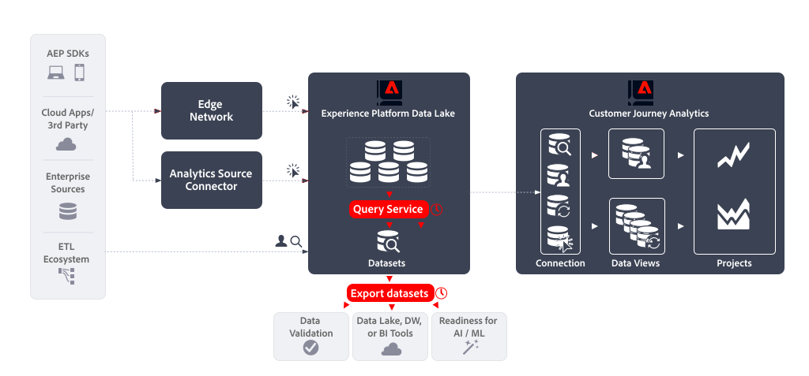

# Servicio de consultas (Data Distiller) y exportación de conjuntos de datos

Este artículo describe cómo se puede utilizar la combinación de Experience Platform Query Service (Data Distiller) y Data Set export para implementar los siguientes [casos prácticos de exportación de datos](overview.md):

- Validación de datos
- Data Lake, Data Warehouse de herramientas de BI
- Preparación para el aprendizaje artificial inteligente y automático.


Adobe Analytics puede implementar estos casos de uso utilizando su funcionalidad [Fuentes de datos](https://experienceleague.adobe.com/es/docs/analytics/export/analytics-data-feed/data-feed-overview). Las fuentes de datos son una forma eficaz de obtener datos sin procesar de Adobe Analytics. En este artículo se describe cómo obtener un tipo similar de datos sin procesar de Experience Platform, para que pueda implementar los casos de uso mencionados anteriormente. Cuando corresponda, las funcionalidades descritas en este artículo se comparan con las Fuentes de datos de Adobe Analytics para aclarar diferencias en los datos y el proceso.

## Primeros pasos

La exportación de datos mediante el servicio de consulta (Data Distiller) y la exportación de conjuntos de datos consiste en:

- definiendo una **consulta programada** que genera los datos para su fuente de datos como un conjunto de datos de salida , mediante **servicio de consulta**.
- definiendo una **exportación programada del conjunto de datos** que exporta el conjunto de datos de salida a un destino de almacenamiento en la nube, con **exportación del conjunto de datos**.




## Requisitos previos

Asegúrese de cumplir todos los requisitos antes de utilizar la funcionalidad descrita en este caso de uso:

- Implementación de trabajo que recopila datos en el lago de datos de Experience Platform.
- Acceso al complemento Data Distiller para asegurarse de que tiene derecho a ejecutar consultas por lotes. Consulte [Empaquetado de servicio de consultas](https://experienceleague.adobe.com/es/docs/experience-platform/query/packaging) para obtener más información.
- Acceso a la funcionalidad Exportar conjuntos de datos, disponible al adquirir el paquete Real-Time CDP Prime o Ultimate, Adobe Journey Optimizer o Customer Journey Analytics. Consulte [Exportar conjuntos de datos a destinos de almacenamiento en la nube](https://experienceleague.adobe.com/es/docs/experience-platform/destinations/ui/activate/export-datasets) para obtener más información.
- Uno o más destinos configurados (por ejemplo: Amazon S3, Google Cloud Storage) a donde puede exportar los datos sin procesar de la fuente de datos.


## Servicio de consultas

El servicio de consultas de Experience Platform le permite consultar y unir cualquier conjunto de datos del lago de datos de Experience Platform como si fuera una tabla de base de datos. A continuación, puede capturar los resultados como un nuevo conjunto de datos para su uso posterior en la creación de informes o para su exportación.

Puede usar la [interfaz de usuario](https://experienceleague.adobe.com/es/docs/experience-platform/query/ui/overview) del servicio de consultas, un [cliente conectado a través del protocolo PostgresQL](https://experienceleague.adobe.com/es/docs/experience-platform/query/clients/overview) o [API RESTful](https://experienceleague.adobe.com/es/docs/experience-platform/query/api/getting-started) para crear y programar consultas que recopilen los datos de su fuente de datos.

### Crear consulta

Puede utilizar todas las funciones de ANSI SQL estándar para instrucciones SELECT y otros comandos limitados para crear y ejecutar consultas que generen los datos para la fuente de datos. Consulte [Sintaxis SQL](https://experienceleague.adobe.com/es/docs/experience-platform/query/sql/syntax) para obtener más información. Más allá de esta sintaxis SQL, Adobe admite:

- precompiló [funciones definidas por el Adobe (ADF)](https://experienceleague.adobe.com/es/docs/experience-platform/query/sql/adobe-defined-functions) que ayudan a realizar tareas comunes relacionadas con el negocio en los datos de evento almacenados en el repositorio de datos del Experience Platform, incluidas las funciones de [Sessionization](https://experienceleague.adobe.com/es/docs/analytics/components/virtual-report-suites/vrs-mobile-visit-processing) y [Attribution](https://experienceleague.adobe.com/es/docs/analytics/analyze/analysis-workspace/attribution/overview),
- varias funciones integradas de [Spark SQL](https://experienceleague.adobe.com/es/docs/experience-platform/query/sql/spark-sql-functions),
- [comandos PostgreSQL de metadatos](https://experienceleague.adobe.com/es/docs/experience-platform/query/sql/metadata),
- [instrucciones preparadas](https://experienceleague.adobe.com/es/docs/experience-platform/query/sql/prepared-statements).

#### Columnas de fuente de datos

Los campos XDM que puede utilizar en la consulta dependen de la definición de esquema en la que se basen los conjuntos de datos. Asegúrese de comprender el esquema subyacente del conjunto de datos. Consulte para obtener más información la [Guía de la interfaz de usuario de conjuntos de datos](https://experienceleague.adobe.com/es/docs/experience-platform/catalog/datasets/user-guide).

Para definir la asignación entre las columnas de fuente de datos y los campos XDM, consulte [Asignación de campos de Analytics](https://experienceleague.adobe.com/es/docs/experience-platform/sources/connectors/adobe-applications/mapping/analytics). Consulte también la [descripción general de la interfaz de usuario de los esquemas](https://experienceleague.adobe.com/es/docs/experience-platform/xdm/ui/overview#defining-xdm-fields) para obtener más información sobre cómo administrar recursos XDM, incluidos esquemas, clases, grupos de campos y tipos de datos.

Por ejemplo, en caso de que quiera usar *nombre de página* como parte de su fuente de datos:

- En la interfaz de usuario de la fuente de datos de Adobe Analytics, debe seleccionar **[!UICONTROL pagename]** como columna para agregarla a la definición de la fuente de datos.
- En el servicio de consultas, incluye `web.webPageDetails.name` del conjunto de datos `sample_event_dataset_for_website_global_v1_1` (según el esquema de evento de muestra **para el sitio web (Global v1.1)** esquema de evento de experiencia) en su consulta. Consulte el [grupo de campos de esquema de detalles web](https://experienceleague.adobe.com/es/docs/experience-platform/xdm/field-groups/event/web-details) para obtener más información.


#### Identidades

En Experience Platform, hay varias identidades disponibles. Al crear las consultas, asegúrese de que está consultando las identidades correctamente.


A menudo, las identidades se encuentran en un grupo de campos independiente. En una implementación, el ECID (`ecid`) se puede definir como parte de un grupo de campos con un objeto `core`, que a su vez forma parte de un objeto `identification` (por ejemplo: `_sampleorg.identification.core.ecid`). Los ECID pueden estar organizados de forma diferente en los esquemas.

También puede usar `identityMap` para consultar identidades. `identityMap` es del tipo `Map` y usa una [estructura de datos anidada](#nested-data-structure).

Consulte [Definir campos de identidad en la interfaz de usuario](https://experienceleague.adobe.com/es/docs/experience-platform/xdm/ui/fields/identity) para obtener más información sobre cómo definir campos de identidad en el Experience Platform.

Consulte [Identificadores principales en los datos de Analytics](https://experienceleague.adobe.com/es/docs/experience-platform/sources/connectors/adobe-applications/analytics#primary-identifiers-in-analytics-data) para obtener información sobre cómo se asignan las identidades de Adobe Analytics a las identidades de Experience Platform al utilizar el conector de origen de Analytics. Esta asignación puede servir de guía para configurar las identidades, incluso cuando no se utiliza el conector de origen de Analytics.


#### Identificación y datos de nivel de visita individual

En función de la implementación, los datos de nivel de visita recopilados tradicionalmente en Adobe Analytics ahora se almacenan como datos de evento con marca de tiempo en Experience Platform. La siguiente tabla se ha extraído de [asignación de campos de Analytics](https://experienceleague.adobe.com/es/docs/experience-platform/sources/connectors/adobe-applications/mapping/analytics#generated-mapping-fields) y muestra ejemplos de cómo asignar columnas de fuentes de datos de Adobe Analytics específicas del nivel de visita con los campos XDM correspondientes en las consultas. La tabla también muestra ejemplos de cómo se identifican las visitas individuales, las visitas y los visitantes mediante campos XDM.

| Columna de fuente de datos | Campo XDM | Tipo | Descripción |
|---|---|---|---|
| `hitid_high` + `hitid_low` | `_id` | string | Un identificador único para identificar una visita. |
| `hitid_low` | `_id` | string | Se usa con `hitid_high` para identificar una visita de forma exclusiva. |
| `hitid_high` | `_id` | string | Se usa con `hitid_high` para identificar una visita de forma exclusiva. |
| `hit_time_gmt` | `receivedTimestamp` | string | La marca de tiempo de la visita basada en la hora de UNIX®. |
| `cust_hit_time_gmt` | `timestamp` | string | Esta marca de tiempo solo se utiliza en conjuntos de datos con marca de tiempo habilitada. Esta marca de tiempo se envía con la visita en función de la hora UNIX®. |
| `visid_high` + `visid_low` | `identityMap` | objeto | Un identificador único de una visita. |
| `visid_high` + `visid_low` | `endUserIDs._experience.aaid.id` | string | Un identificador único de una visita. |
| `visid_high` | `endUserIDs._experience.aaid.primary` | booleano | Se usa con `visid_low` para identificar una visita de forma exclusiva. |
| `visid_high` | `endUserIDs._experience.aaid.namespace.code` | string | Se usa con `visid_low` para identificar una visita de forma exclusiva. |
| `visid_low` | `identityMap` | objeto | Se usa con `visid_high` para identificar una visita de forma exclusiva. |
| `cust_visid` | `identityMap` | objeto | El ID de visitante de cliente. |
| `cust_visid` | `endUserIDs._experience.aacustomid.id` | objeto | El ID de visitante de cliente. |
| `cust_visid` | `endUserIDs._experience.aacustomid.primary` | booleano | El código del área de nombres de ID de visitante de cliente. |
| `cust_visid` | `endUserIDs._experience.aacustomid.namespace.code` | string | Se usa con `visid_low` para identificar el ID de visitante de cliente de forma exclusiva. |
| `geo\_*` | `placeContext.geo.* ` | cadena, número | Datos de geolocalización, como país, región, ciudad y otros |
| `event_list` | `commerce.purchases`, `commerce.productViews`, `commerce.productListOpens`, `commerce.checkouts`, `commerce.productListAdds`, `commerce.productListRemovals`, `commerce.productListViews`, `_experience.analytics.event101to200.*`, ..., `_experience.analytics.event901_1000.*` | string | Eventos comerciales y personalizados estándar activados en la visita. |
| `page_event` | `web.webInteraction.type` | string | El tipo de visita que se envía en la solicitud de imagen (visita estándar, vínculo de descarga, vínculo de salida o vínculo personalizado en el que se hace clic). |
| `page_event` | `web.webInteraction.linkClicks.value` | number | El tipo de visita que se envía en la solicitud de imagen (visita estándar, vínculo de descarga, vínculo de salida o vínculo personalizado en el que se hace clic). |
| `page_event_var_1` | `web.webInteraction.URL` | string | Variable que solo se utiliza en las solicitudes de imagen de seguimiento de vínculos. Esta variable contiene la dirección URL del vínculo de descarga, de salida o personalizado en el que se hizo clic. |
| `page_event_var_2` | `web.webInteraction.name` | string | Variable que solo se utiliza en las solicitudes de imagen de seguimiento de vínculos. Muestra el nombre personalizado del vínculo, si se especifica. |
| `paid_search` | `search.isPaid` | booleano | Un indicador que se establece si la visita coincide con la detección de búsquedas de pago. |
| `ref_type` | `web.webReferrertype` | string | Una ID numérica que representa el tipo de referente de la visita. |

#### Publicar columnas

Las fuentes de datos de Adobe Analytics utilizan el concepto de columnas con un prefijo `post_`, que son columnas que contienen datos después del procesamiento. Consulte [Preguntas frecuentes sobre fuentes de datos](https://experienceleague.adobe.com/es/docs/analytics/export/analytics-data-feed/df-faq#post) para obtener más información.

Los datos recopilados en conjuntos de datos a través del Edge Network del Experience Platform (SDK web, SDK móvil, API de servidor) no tienen concepto de `post_` campos. Como resultado, `post_` columnas de fuentes de datos con prefijo y *non*-`post_` se asignan a los mismos campos XDM. Por ejemplo, las columnas de fuente de datos `page_url` y `post_page_url` se asignan al mismo campo XDM `web.webPageDetails.URL`.

Consulte [Comparar el procesamiento de datos entre Adobe Analytics y Customer Journey Analytics](https://experienceleague.adobe.com/es/docs/analytics-platform/using/compare-aa-cja/cja-aa-comparison/data-processing-comparisons) para obtener una descripción general de la diferencia en el procesamiento de datos.

El tipo de datos de la columna de prefijo `post_`, cuando se recopila en el lago de datos de Experience Platform, sin embargo requiere transformaciones avanzadas para poder utilizarse correctamente en un caso de uso de fuente de datos. La realización de estas transformaciones avanzadas en las consultas implica el uso de [funciones definidas por el Adobe](https://experienceleague.adobe.com/es/docs/experience-platform/query/sql/adobe-defined-functions) para la creación de sesiones, la atribución y la deduplicación. Ver [Ejemplos](#examples) sobre cómo usar estas funciones.

#### Búsquedas

Para buscar datos de otros conjuntos de datos, utilice la funcionalidad SQL estándar (`WHERE`, cláusula `INNER JOIN`, `OUTER JOIN`, etc.).

#### Cálculos

Para realizar cálculos en campos (columnas), use las funciones SQL estándar (por ejemplo, `COUNT(*)`) o la parte [operadores matemáticos y estadísticos y funciones](https://experienceleague.adobe.com/es/docs/experience-platform/query/sql/spark-sql-functions#math) de Spark SQL. Además, las [funciones de ventana](https://experienceleague.adobe.com/es/docs/experience-platform/query/sql/adobe-defined-functions#window-functions) proporcionan compatibilidad para actualizar las agregaciones y devolver elementos únicos para cada fila de un subconjunto ordenado. Ver [Ejemplos](#examples) sobre cómo usar estas funciones.

#### Estructura de datos anidada

Los esquemas en los que se basan los conjuntos de datos suelen contener tipos de datos complejos, incluidas estructuras de datos anidadas. `identityMap` mencionado anteriormente es un ejemplo de una estructura de datos anidada. Vea a continuación un ejemplo de `identityMap` datos.

```json
{
   "identityMap":{
      "FPID":[
         {
            "id":"55613368189701342632255821452918751312",
            "authenticatedState":"ambiguous"
         }
      ],
      "CRM":[
         {
            "id":"2394509340-30453470347",
            "authenticatedState":"authenticated"
         }
      ]
   }
}
```

Puede usar [`explode()` u otras funciones de matrices ](https://experienceleague.adobe.com/es/docs/experience-platform/query/sql/spark-sql-functions#arrays) de Spark SQL para obtener los datos dentro de una estructura de datos anidada, por ejemplo:

```sql
select explode(identityMap) from demosys_cja_ee_v1_website_global_v1_1 limit 15;
```

Como alternativa, puede hacer referencia a elementos individuales utilizando la notación de puntos. Por ejemplo:

```sql
select identityMap.ecid from demosys_cja_ee_v1_website_global_v1_1 limit 15;
```

Consulte [Trabajar con estructuras de datos anidadas en el servicio de consultas](https://experienceleague.adobe.com/es/docs/experience-platform/query/key-concepts/nested-data-structures) para obtener más información.


#### Ejemplos

Para consultas:

- que utilizan datos de conjuntos de datos de en el lago de datos de Experience Platform,
- está aprovechando las capacidades adicionales de Funciones definidas por Adobe o Spark SQL, y
- que daría resultados similares a una fuente de datos de Adobe Analytics equivalente,

consulte:

- [examinar abandonado](https://experienceleague.adobe.com/es/docs/experience-platform/query/use-cases/abandoned-browse)
- [análisis de atribución](https://experienceleague.adobe.com/es/docs/experience-platform/query/use-cases/attribution-analysis)
- [filtrado de bots](https://experienceleague.adobe.com/es/docs/experience-platform/query/use-cases/bot-filtering)
- y otros [casos de uso admitidos en la guía del servicio de consultas](https://experienceleague.adobe.com/es/docs/experience-platform/query/use-cases/overview).

A continuación se muestra un ejemplo para aplicar correctamente la atribución entre sesiones y que ilustra cómo

- utilizar los últimos 90 días como retrospectiva,
- aplicar funciones de ventana como sesionización y/o atribución, y
- restringir la salida en función de `ingest_time`.

+++
Detalles

  Para hacer esto, tienes que...

   - Utilice una tabla de estado de procesamiento, `checkpoint_log`, para realizar un seguimiento de la hora de ingesta actual frente a la hora de la última ingesta. Consulte [esta guía](https://experienceleague.adobe.com/es/docs/experience-platform/query/key-concepts/incremental-load) para obtener más información.
   - deshabilite la eliminación de columnas del sistema para que pueda usar `_acp_system_metadata.ingestTime`.
   - Use un máximo interno de `SELECT` para obtener los campos que desee usar y restringir los eventos al período retroactivo para los cálculos de creación de sesiones o de atribución. Por ejemplo, 90 días.
   - Use un siguiente nivel `SELECT` para aplicar las funciones de creación de sesiones y/o de ventana de atribución y otros cálculos.
   - Use `INSERT INTO` en la tabla de resultados para restringir la retrospectiva únicamente a los eventos que han llegado desde la última hora de procesamiento. Para ello, filtre `_acp_system_metadata.ingestTime ` respecto al tiempo almacenado por última vez en la tabla de estado de procesamiento.

  **Ejemplo de funciones de la ventana de sesiones**

  ```sql
  $$ BEGIN
     -- Disable dropping system columns
     set drop_system_columns=false; 
  
     -- Initialize variables
     SET @last_updated_timestamp = SELECT CURRENT_TIMESTAMP;
  
     -- Get the last processed batch ingestion time
     SET @from_batch_ingestion_time = SELECT coalesce(last_batch_ingestion_time, 'HEAD') 
        FROM checkpoint_log a 
        JOIN (
              SELECT MAX(process_timestamp) AS process_timestamp 
              FROM checkpoint_log
              WHERE process_name = 'data_feed' 
              AND process_status = 'SUCCESSFUL'
        ) b
        ON a.process_timestamp = b.process_timestamp;
  
     -- Get the last batch ingestion time
     SET @to_batch_ingestion_time = SELECT MAX(_acp_system_metadata.ingestTime) 
        FROM events_dataset;
  
     -- Sessionize the data and insert into data_feed.
     INSERT INTO data_feed
     SELECT *
     FROM (
        SELECT
              userIdentity,
              timestamp,
              SESS_TIMEOUT(timestamp, 60 * 30) OVER (
                 PARTITION BY userIdentity
                 ORDER BY timestamp
                 ROWS BETWEEN UNBOUNDED PRECEDING AND CURRENT ROW
              ) AS session_data,
              page_name,
              ingest_time
        FROM (
              SELECT
                 userIdentity,
                 timestamp,
                 web.webPageDetails.name AS page_name,
                 _acp_system_metadata.ingestTime AS ingest_time
              FROM events_dataset
              WHERE timestamp >= current_date - 90
        ) AS a
        ORDER BY userIdentity, timestamp ASC
     ) AS b
     WHERE b.ingest_time >= @from_batch_ingestion_time;
  
     -- Update the checkpoint_log table
     INSERT INTO checkpoint_log
     SELECT
        'data_feed' process_name,
        'SUCCESSFUL' process_status,
        cast(@to_batch_ingestion_time AS string) last_batch_ingestion_time,
        cast(@last_updated_timestamp AS TIMESTAMP) process_timestamp
  END
  $$;
  ```

  **Ejemplo de funciones de ventana de atribución**

  ```sql
  $$ BEGIN
   SET drop_system_columns=false;
  
  -- Initialize variables
   SET @last_updated_timestamp = SELECT CURRENT_TIMESTAMP;
  
  -- Get the last processed batch ingestion time 1718755872325
   SET @from_batch_ingestion_time =
       SELECT coalesce(last_snapshot_id, 'HEAD')
       FROM checkpoint_log a
       JOIN (
           SELECT MAX(process_timestamp) AS process_timestamp
           FROM checkpoint_log
           WHERE process_name = 'data_feed'
           AND process_status = 'SUCCESSFUL'
       ) b
       ON a.process_timestamp = b.process_timestamp;
  
   -- Get the last batch ingestion time 1718758687865
   SET @to_batch_ingestion_time =
       SELECT MAX(_acp_system_metadata.ingestTime)
       FROM demo_data_trey_mcintyre_midvalues;
  
   -- Sessionize the data and insert into new_sessionized_data
   INSERT INTO new_sessionized_data
   SELECT *
   FROM (
       SELECT
           _id,
           timestamp,
           struct(User_Identity,
           cast(SESS_TIMEOUT(timestamp, 60 * 30) OVER (
               PARTITION BY User_Identity
               ORDER BY timestamp
               ROWS BETWEEN UNBOUNDED PRECEDING AND CURRENT ROW
           ) as string) AS SessionData,
           to_timestamp(from_unixtime(ingest_time/1000, 'yyyy-MM-dd HH:mm:ss')) AS IngestTime,      
           PageName,
           first_url,
           first_channel_type
             ) as _demosystem5
       FROM (
           SELECT
               _id,
               ENDUSERIDS._EXPERIENCE.MCID.ID as User_Identity,
               timestamp,
               web.webPageDetails.name AS PageName,
              attribution_first_touch(timestamp, '', web.webReferrer.url) OVER (PARTITION BY ENDUSERIDS._EXPERIENCE.MCID.ID ORDER BY timestamp ASC ROWS BETWEEN UNBOUNDED PRECEDING AND UNBOUNDED FOLLOWING).value AS first_url,
              attribution_first_touch(timestamp, '',channel.typeAtSource) OVER (PARTITION BY ENDUSERIDS._EXPERIENCE.MCID.ID ORDER BY timestamp ASC ROWS BETWEEN UNBOUNDED PRECEDING AND UNBOUNDED FOLLOWING).value AS first_channel_type,
               _acp_system_metadata.ingestTime AS ingest_time
           FROM demo_data_trey_mcintyre_midvalues
           WHERE timestamp >= current_date - 90
       )
       ORDER BY User_Identity, timestamp ASC    
   )
   WHERE _demosystem5.IngestTime >= to_timestamp(from_unixtime(@from_batch_ingestion_time/1000, 'yyyy-MM-dd HH:mm:ss'));
  
  -- Update the checkpoint_log table
  INSERT INTO checkpoint_log
  SELECT
     'data_feed' as process_name,
     'SUCCESSFUL' as process_status,
     cast(@to_batch_ingestion_time AS string) as last_snapshot_id,
     cast(@last_updated_timestamp AS timestamp) as process_timestamp;
  
  END
  $$;
  ```

+++


### Programar consulta

Programe la consulta para asegurarse de que se ejecuta y de que los resultados se generan a su intervalo preferido.

#### Uso del Editor de consultas

Puede programar una consulta mediante el Editor de consultas. Al programar la consulta, se define un conjunto de datos de salida. Consulte [Programaciones de consultas](https://experienceleague.adobe.com/es/docs/experience-platform/query/ui/query-schedules) para obtener más información.


#### Uso de la API del servicio de consultas

También puede utilizar las API de RESTful para definir una consulta y una programación para la consulta. Consulte la [guía de API del servicio de consultas](https://experienceleague.adobe.com/es/docs/experience-platform/query/api/getting-started) para obtener más información.
Asegúrese de definir el conjunto de datos de salida como parte de la propiedad `ctasParameters` opcional al crear la consulta ([Crear una consulta](https://developer.adobe.com/experience-platform-apis/references/query-service/#tag/Queries/operation/createQuery)) o al crear la programación para una consulta ([Crear una consulta programada](https://developer.adobe.com/experience-platform-apis/references/query-service/#tag/Schedules/operation/createSchedule)).


## Exportar conjuntos de datos

Una vez creada y programada la consulta, y verificados los resultados, puede exportar los conjuntos de datos sin procesar a destinos de almacenamiento en la nube. Esta exportación se realiza en la terminología Destinos de Experience Platform, que se denomina destinos de exportación de conjuntos de datos. Consulte [Exportar conjuntos de datos a destinos de almacenamiento en la nube](https://experienceleague.adobe.com/es/docs/experience-platform/destinations/ui/activate/export-datasets) para obtener una descripción general.

Se admiten los siguientes destinos de almacenamiento en la nube:

- [Azure Data Lake Storage Gen2](https://experienceleague.adobe.com/es/docs/experience-platform/destinations/catalog/cloud-storage/adls-gen2)
- [Zona de aterrizaje de datos](https://experienceleague.adobe.com/es/docs/experience-platform/destinations/catalog/cloud-storage/data-landing-zone)
- [Almacenamiento en la nube de Google](https://experienceleague.adobe.com/es/docs/experience-platform/destinations/catalog/cloud-storage/google-cloud-storage)
- [Amazon S3](https://experienceleague.adobe.com/es/docs/experience-platform/destinations/catalog/cloud-storage/amazon-s3)
- [blob de Azure](https://experienceleague.adobe.com/es/docs/experience-platform/destinations/catalog/cloud-storage/azure-blob)
- [SFTP](https://experienceleague.adobe.com/es/docs/experience-platform/destinations/catalog/cloud-storage/sftp)


### IU de Experience Platform

Puede exportar y programar la exportación de los conjuntos de datos de salida a través de la interfaz de usuario de Experience Platform. En esta sección se describen los pasos que debe seguir.

#### Seleccionar destino

Cuando haya determinado a qué destino de almacenamiento en la nube desea exportar el conjunto de datos de salida, [seleccione el destino](https://experienceleague.adobe.com/es/docs/experience-platform/destinations/ui/activate/export-datasets#select-destination). Cuando aún no haya configurado un destino para su almacenamiento en la nube preferido, debe [crear una nueva conexión de destino](https://experienceleague.adobe.com/es/docs/experience-platform/destinations/ui/connect-destination).

Como parte de la configuración de un destino, puede

- definir el tipo de archivo (JSON o Parquet),
- si el archivo resultante debe comprimirse o no, y
- si se debe incluir o no un archivo de manifiesto.


#### Seleccionar conjunto de datos

Cuando haya seleccionado el destino, en el siguiente paso **[!UICONTROL Seleccionar conjuntos de datos]** debe seleccionar el conjunto de datos de salida de la lista de conjuntos de datos. Si ha creado varias consultas programadas y desea que los conjuntos de datos de salida se envíen al mismo destino de almacenamiento en la nube, puede seleccionar los conjuntos de datos de salida correspondientes. Consulte [Seleccionar sus conjuntos de datos](https://experienceleague.adobe.com/es/docs/experience-platform/destinations/ui/activate/export-datasets#select-datasets) para obtener más información.

#### Programación de exportación del conjunto de datos

Por último, desea programar la exportación del conjunto de datos como parte del paso **[!UICONTROL Programando]**. En ese paso puede definir la programación y si la exportación del conjunto de datos de salida debe ser incremental o no. Consulte [Programar exportación del conjunto de datos](https://experienceleague.adobe.com/es/docs/experience-platform/destinations/ui/activate/export-datasets#scheduling) para obtener más información.


#### Pasos finales

[Revise](https://experienceleague.adobe.com/es/docs/experience-platform/destinations/ui/activate/export-datasets#review) su selección y, cuando sea correcta, comience a exportar el conjunto de datos de salida al destino de almacenamiento en la nube.

Debe [comprobar](https://experienceleague.adobe.com/es/docs/experience-platform/destinations/ui/activate/export-datasets#verify) que la exportación de datos se haya realizado correctamente. Al exportar conjuntos de datos, el Experience Platform crea uno o varios archivos de `.json` o `.parquet` en la ubicación de almacenamiento definida en el destino. Se espera que los nuevos archivos se depositen en su ubicación de almacenamiento según la programación de exportación configurada. Experience Platform crea una estructura de carpetas en la ubicación de almacenamiento especificada como parte del destino seleccionado, donde deposita los archivos exportados. Se crea una carpeta nueva para cada tiempo de exportación, siguiendo el patrón: `folder-name-you-provided/datasetID/exportTime=YYYYMMDDHHMM`. El nombre de archivo predeterminado se genera de forma aleatoria y garantiza que los nombres de archivo exportados sean únicos.

### API de Flow Service

También puede exportar y programar la exportación de conjuntos de datos de salida mediante API. Los pasos involucrados están documentados en [Exportar conjuntos de datos mediante la API de Flow Service](https://experienceleague.adobe.com/es/docs/experience-platform/destinations/api/export-datasets).

#### Introducción

Para exportar conjuntos de datos, asegúrese de que cuenta con los [permisos necesarios](https://experienceleague.adobe.com/es/docs/experience-platform/destinations/api/export-datasets#permissions). Compruebe también que el destino al que desea enviar el conjunto de datos de salida admite la exportación de conjuntos de datos. A continuación, debe [recopilar los valores de los encabezados obligatorios y opcionales](https://experienceleague.adobe.com/es/docs/experience-platform/destinations/api/export-datasets#gather-values-headers) que utiliza en las llamadas a la API. También necesita [identificar las especificaciones de conexión y los ID de especificación de flujo del destino](https://experienceleague.adobe.com/es/docs/experience-platform/destinations/api/export-datasets#gather-connection-spec-flow-spec) al que desea exportar los conjuntos de datos.

#### Recuperar conjuntos de datos aptos

Puede [recuperar una lista de conjuntos de datos aptos](https://experienceleague.adobe.com/es/docs/experience-platform/destinations/api/export-datasets#retrieve-list-of-available-datasets) para la exportación y comprobar si el conjunto de datos de salida forma parte de esa lista mediante la API [`GET /connectionSpecs/{id}/configs`](https://developer.adobe.com/experience-platform-apis/references/destinations/#tag/Configurations/operation/getDatasets).


#### Crear conexión de origen

A continuación, debe [crear una conexión de origen](https://experienceleague.adobe.com/es/docs/experience-platform/destinations/api/export-datasets#create-source-connection) para el conjunto de datos de salida, usando su ID único, que desea exportar al destino de almacenamiento en la nube. Utiliza la API [`POST /sourceConnections`](https://developer.adobe.com/experience-platform-apis/references/destinations/#tag/Source-connections/operation/postSourceConnection).

#### Autenticar en el destino (crear conexión base)

Ahora debe [crear una conexión base](https://experienceleague.adobe.com/es/docs/experience-platform/destinations/api/export-datasets#create-base-connection) para autenticar y almacenar de forma segura las credenciales en su destino de almacenamiento en la nube mediante la API [`POST /targetConection`](https://developer.adobe.com/experience-platform-apis/references/destinations/#tag/Target-connections/operation/postTargetConnection).


#### Proporcionar parámetros de exportación

A continuación, debe [crear una conexión de destino adicional que almacene los parámetros de exportación](https://experienceleague.adobe.com/es/docs/experience-platform/destinations/api/export-datasets#create-target-connection) para el conjunto de datos de salida mediante, una vez más, la API [`POST /targetConection`](https://developer.adobe.com/experience-platform-apis/references/destinations/#tag/Target-connections/operation/postTargetConnection). Estos parámetros de exportación incluyen ubicación, formato de archivo, compresión, etc.

#### Configurar flujo de datos

Finalmente, ha [configurado el flujo de datos](https://experienceleague.adobe.com/es/docs/experience-platform/destinations/api/export-datasets#create-dataflow) para asegurarse de que el conjunto de datos de salida se exporte a su destino de almacenamiento en la nube mediante la API [`POST /flows`](https://developer.adobe.com/experience-platform-apis/references/destinations/#tag/Dataflows/operation/postFlow). En este paso, puede definir la programación de la exportación mediante el parámetro `scheduleParams`.

#### Validar flujo de datos

Para [comprobar las ejecuciones correctas del flujo de datos](https://experienceleague.adobe.com/es/docs/experience-platform/destinations/api/export-datasets#get-dataflow-runs), utilice la API [`GET /runs`](https://developer.adobe.com/experience-platform-apis/references/destinations/#tag/Dataflow-runs/operation/getFlowRuns) y especifique el ID del flujo de datos como parámetro de consulta. Este ID de flujo de datos es un identificador que se devuelve al configurar el flujo de datos.

[Verificar](https://experienceleague.adobe.com/es/docs/experience-platform/destinations/ui/activate/export-datasets#verify) que la exportación de datos se haya realizado correctamente. Al exportar conjuntos de datos, el Experience Platform crea uno o varios archivos de `.json` o `.parquet` en la ubicación de almacenamiento definida en el destino. Se espera que los nuevos archivos se depositen en su ubicación de almacenamiento según la programación de exportación configurada. Experience Platform crea una estructura de carpetas en la ubicación de almacenamiento especificada como parte del destino seleccionado, donde deposita los archivos exportados. Se crea una carpeta nueva para cada tiempo de exportación, siguiendo el patrón: `folder-name-you-provided/datasetID/exportTime=YYYYMMDDHHMM`. El nombre de archivo predeterminado se genera de forma aleatoria y garantiza que los nombres de archivo exportados sean únicos.

## Conclusión

En resumen, emular la funcionalidad de la fuente de datos de Adobe Analytics implica configurar consultas programadas mediante el servicio de consulta y utilizar los resultados de estas consultas en exportaciones de conjuntos de datos programados.

>[!IMPORTANT]
>
>En este caso de uso están involucrados dos programadores. Para garantizar el correcto funcionamiento de la funcionalidad de fuente de datos emulada, asegúrese de que las programaciones configuradas en el servicio de consulta y las exportaciones de datos no interfieran.
