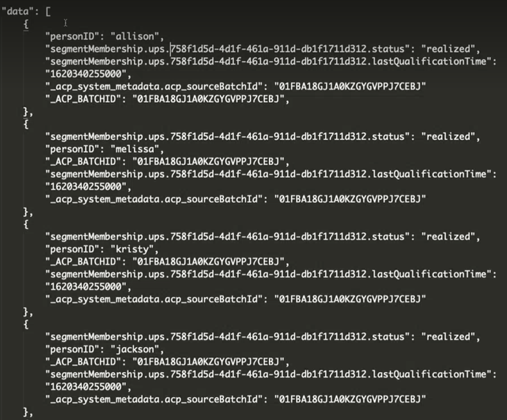
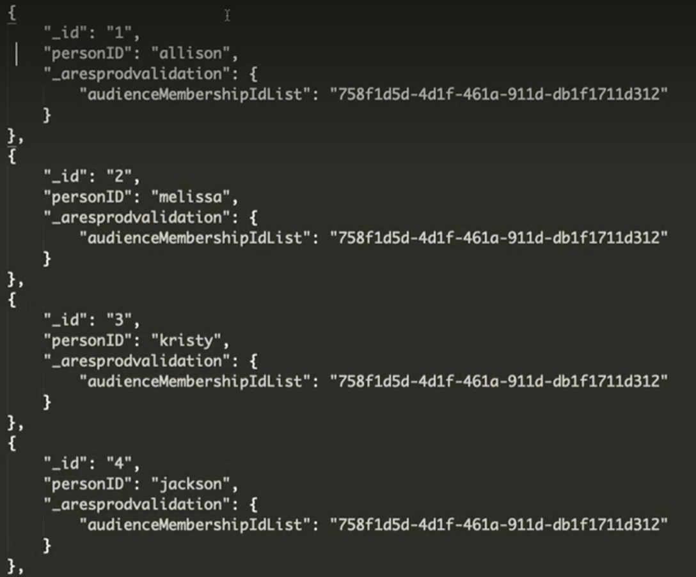
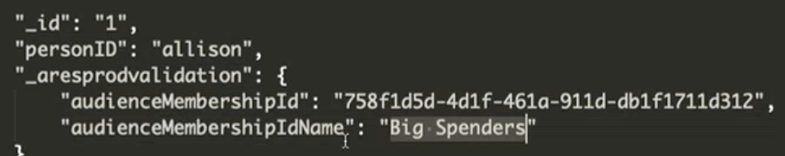

# Ingesta de audiencias de AEP en Customer Journey Analytics (CJA)

Este caso de uso explora una forma provisional y manual de incorporar audiencias de Adobe Experience Platform (AEP) a CJA. Es posible que estas audiencias se hayan creado en el Generador de segmentos de AEP, Adobe Audience Manager u otras herramientas, y se almacenen en el Perfil del cliente en tiempo real (RTCP). Las audiencias constan de un conjunto de ID de perfil, junto con cualquier atributo, evento, etc. aplicables y queremos incluirlos en CJA Workspace para su análisis.

## Requisitos previos

* Acceso a Adobe Experience Platform (AEP), específicamente Perfil del cliente en tiempo real.
* Acceso para crear/administrar esquemas y conjuntos de datos de AEP.
* Acceso a AEP Query Service (y la capacidad de escribir SQL) o una herramienta diferente para realizar algunas transformaciones ligeras.
* Acceso a Customer Journey Analytics. Debe ser administrador de producto de CJA para crear/modificar conexiones de CJA y vistas de datos.
* Capacidad para utilizar las API de Adobe (segmentación, opcionalmente otras)

## Paso 1: Elija la audiencia en el perfil del cliente en tiempo real {#audience}

El [Perfil del cliente en tiempo real](https://experienceleague.adobe.com/docs/experience-platform/profile/home.html?lang=es) (RTCP) de Adobe Experience Platform le permite ver una vista holística de cada cliente individual combinando datos de varios canales, incluidos en línea, sin conexión, CRM y de terceros.

Es probable que ya tenga audiencias en RTCP que puedan provenir de varias fuentes. Elija una o más audiencias para ingerirlas en CJA.

## Paso 2: Creación de un conjunto de datos de unión de perfiles para la exportación

Para exportar la audiencia a un conjunto de datos que finalmente se pueda agregar a una conexión en CJA, debe crear un conjunto de datos cuyo esquema sea un perfil [Esquema de unión](https://experienceleague.adobe.com/docs/experience-platform/profile/union-schemas/union-schema.html?lang=es#understanding-union-schemas).

Los esquemas de unión están compuestos por varios esquemas que comparten la misma clase y que se han habilitado para Perfil. El esquema de unión permite ver una amalgamación de todos los campos contenidos en esquemas que comparten la misma clase. El perfil del cliente en tiempo real utiliza el esquema de unión para crear una vista holística de cada cliente individual.

## Paso 3: Exportación de una audiencia al conjunto de datos de unión de perfiles mediante una llamada de API {#export}

Para poder introducir una audiencia en CJA, debe exportarla a un conjunto de datos de AEP. Esto solo se puede hacer con la API de segmentación y, específicamente, con [Exportar extremo de API de trabajos](https://experienceleague.adobe.com/docs/experience-platform/segmentation/api/export-jobs.html?lang=es).

Puede crear un trabajo de exportación utilizando el ID de audiencia que elija y poner los resultados en el conjunto de datos de AEP de unión de perfiles que creó en el paso 2. Aunque puede exportar varios atributos o eventos para la audiencia, solo necesita exportar el campo ID de perfil específico que coincida con el campo ID de persona utilizado en la conexión de CJA que va a aprovechar (consulte a continuación en el paso 5).

## Paso 4: Editar la salida de exportación

Los resultados del trabajo de exportación deben transformarse en un conjunto de datos de perfil independiente para poder ingerirse en CJA.  Esta transformación se puede realizar con [AEP Query Service](https://experienceleague.adobe.com/docs/experience-platform/query/home.html?lang=es), u otra herramienta de transformación de su elección. Solo necesitamos el ID de perfil (que coincidirá con el ID de persona en CJA) y uno o más ID de audiencia para realizar los informes en CJA.

Sin embargo, el trabajo de exportación estándar contiene más datos y, por lo tanto, es necesario editar este resultado para eliminar datos superfluos, así como mover algunas cosas.  Además, primero debe crear un esquema/conjunto de datos antes de agregarle los datos transformados.

A continuación, se muestra un ejemplo de la salida de exportación en el conjunto de datos de unión de perfiles, **antes** de cualquier cambio:

Recuerde lo siguiente:

* El ID de audiencia se encuentra en `segmentmembership.ups.xxxxxxxx-xxxx-xxxx-xxxx-xxxxxxxxxxxx.status`.
* El estado debe ser “realizado” o “introducido”, pero no “saliente”.

Este es el formato del conjunto de datos de perfil que puede enviar a CJA.

Estos son los elementos de datos que deben estar presentes:

* Campo de cadena `_aresprodvalidation`: Hace referencia a su ID de organización. El suyo será diferente.
* Campo de cadena `personID`: Este es el campo de esquema XDM estándar en conjuntos de datos de perfil para identificar a la persona. Utilice el ID de perfil de la exportación.
* Campo de cadena `audienceMembershipId`: ID de audiencia de la exportación.  NOTA: Se puede especificar cualquier nombre para este campo (desde su propio esquema).
* Añada un nombre descriptivo para la audiencia (`audienceMembershipIdName`), como

   

* Añada otros metadatos de audiencia si lo desea.

## Paso 5: Agregar este conjunto de datos de perfil a una conexión existente en CJA

Podría [crear una nueva conexión](/help/connections/create-connection.md), pero la mayoría de los clientes querrán agregar el conjunto de datos de perfil a una conexión existente. Los ID de audiencia “enriquecen” los datos existentes en CJA.

## Paso 6: Modificar la vista de datos de CJA existente (o crear nueva)

Agregar `audienceMembershipId`, `audienceMembershipIdName` y `personID` a la vista de datos.

## Paso 7: Informes en Workspace

Ahora puede informar sobre `audienceMembershipId`, `audienceMembershipIdName` y `personID` en Workspace.

## Notas adicionales

* Debe realizar este proceso en una cadencia normal, de modo que los datos de audiencia se actualicen constantemente dentro de CJA.
* Puede importar varias audiencias dentro de una sola conexión CJA. Esto añade complejidad adicional al proceso, pero es posible. Para que esto funcione, debe realizar algunas modificaciones en el proceso anterior:
   1. Realice este proceso para cada audiencia deseada en la colección de audiencias dentro de RTCP.
   1. Al realizar las transformaciones de la salida del trabajo de exportación, debe crear una lista de `audienceMembershipId(s)`, ya que un solo ID de persona de CJA podría pertenecer a varias audiencias. En algún momento futuro, CJA admitirá matrices/matrices de objetos en conjuntos de datos de perfil. Una vez admitidos, utilice una matriz de objetos para `audienceMembershipId` o `audienceMembershipIdName` será la mejor opción. Mientras tanto, extraiga todos los ID de audiencia actuales para cada ID de perfil en la salida del trabajo de exportación (con el estado “realizado” o “introducido”) y colóquelos en una cadena de valores separados por comas (por ejemplo, `<id1>,<id2>,...`).  Si hay un ID de audiencia con el estado “saliente”, asegúrese de que NO esté en la lista.  Si desea mantener la asociación de nombres descriptivos con el ID, puede adjuntarla al final de cada ID en la lista (junto con cualquier otro metadato).
   1. En la vista de datos, cree una nueva dimensión con la transformación de la subcadena en el campo `audienceMembershipId` para convertir la cadena de valores separados por comas en una matriz. NOTA: Actualmente hay un límite de 10 valores en la matriz.
   1. Ahora puede generar informes sobre esta nueva dimensión `audienceMembershipIds` dentro de CJA Workspace.
