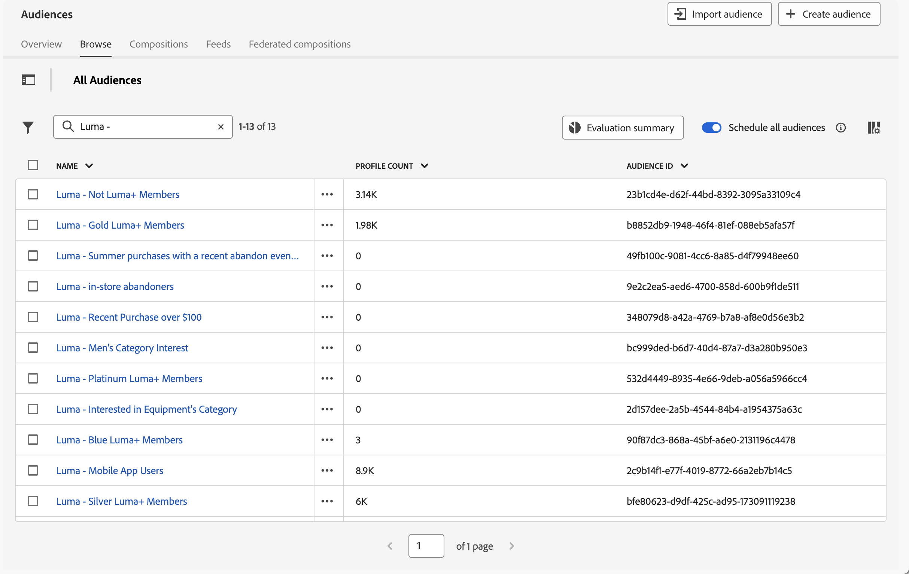
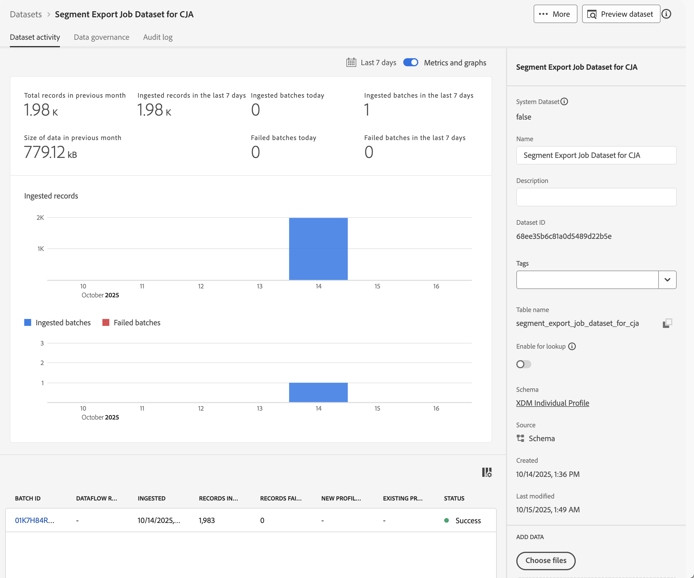
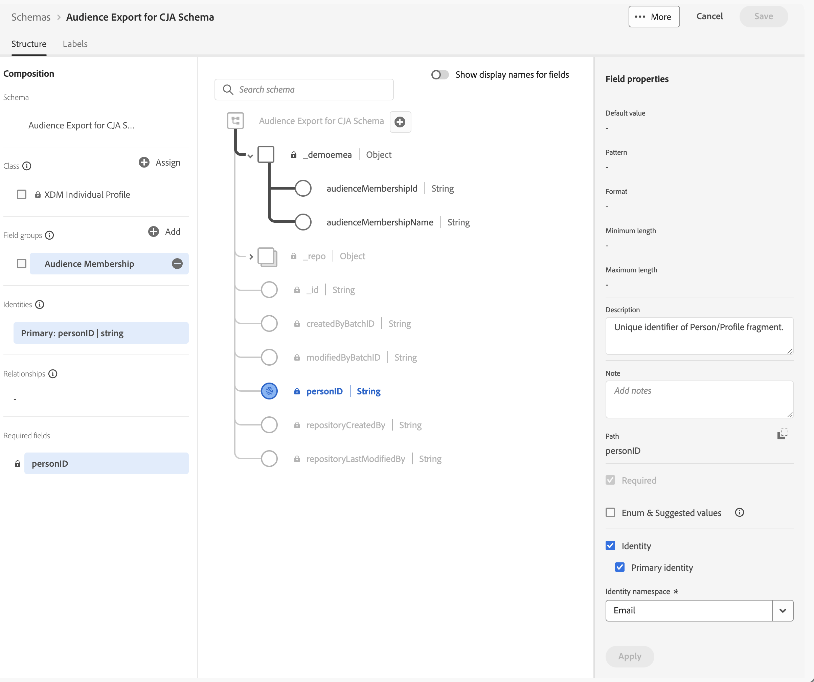
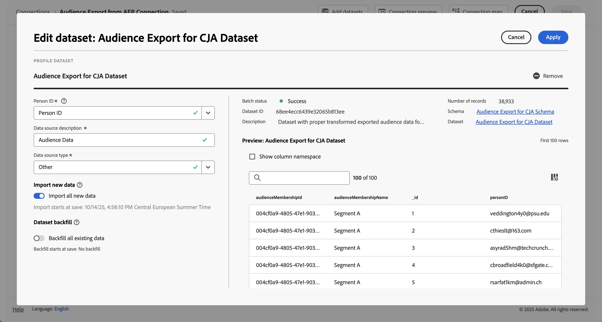
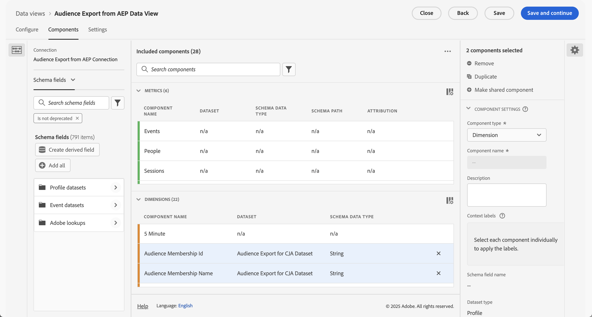

# Ingesta y uso de públicos de Experience Platform

Este caso de uso explora una solución provisional para introducir audiencias de Experience Platform en Customer Journey Analytics. Es posible que estas audiencias se hayan creado en el Generador de segmentos de Experience Platform, Adobe Audience Manager u otras herramientas, y se almacenen en el Perfil del cliente en tiempo real. Las audiencias constan de un conjunto de ID de perfil, junto con cualquier atributo, evento, etc. aplicables. Desea introducir esos datos de audiencia en Customer Journey Analytics para un análisis más detallado.

## Requisitos previos

* Acceso a [Experience Platform](https://experienceleague.adobe.com/es/docs/experience-platform/access-control/home), específicamente Perfil del cliente en tiempo real.
* Acceso para crear y administrar [esquemas](https://experienceleague.adobe.com/es/docs/experience-platform/xdm/home) y [conjuntos de datos](https://experienceleague.adobe.com/es/docs/experience-platform/catalog/datasets/overview) de Experience Platform.
* Acceso a [Experience Platform Query Service](https://experienceleague.adobe.com/es/docs/experience-platform/query/home) (y la capacidad de escribir SQL).
* Acceso a una herramienta que puede realizar algunas transformaciones de datos.
* Acceso a Customer Journey Analytics. Debe ser [administrador de producto de Customer Journey Analytics](/help/technotes/access-control.md) para crear y modificar conexiones de Customer Journey Analytics y vistas de datos.
* [Autenticar y acceder a las API de Experience Platform (API de servicio de catálogo y API de servicio de segmentación)](https://experienceleague.adobe.com/es/docs/experience-platform/landing/platform-apis/api-authentication). Debe crear un proyecto en la consola de desarrollador de la organización y la zona protegida, y asegurarse de que dispone de la información necesaria para enviar correctamente llamadas de API.

## Pasos

La solución provisional consta de los siguientes pasos:

1. [Seleccionar audiencias (IU de Experience Platform)](#select-audiences).
1. [Crear un conjunto de datos con perfil habilitado (API de Experience Platform)](#create-a-profile-enabled-dataset).
1. [Exportar audiencias (API de Experience Platform)](#export-audiences).
1. [Transforme el resultado (IU de Experience Platform y más)](#transform-the-output).
1. [Crear un esquema y un conjunto de datos (IU de Experience Platform)](#create-a-schema-and-dataset).
1. [Agregar o editar una conexión (IU de Customer Journey Analytics)](#add-or-edit-a-connection).
1. [Configurar una vista de datos (IU de Customer Journey Analytics)](#configure-a-data-view).
1. [Informar y analizar (IU de Customer Journey Analytics)](#report-and-analyze).


### Seleccionar audiencias

La solución comienza con la identificación de las audiencias que desea introducir en Customer Journey Analytics.

+++ Identificar audiencias

En la interfaz de usuario de Experience Platform, haga lo siguiente:

1. Seleccione **[!UICONTROL Cliente]** >  **[!UICONTROL Audiencias]**.
1. Seleccione **[!UICONTROL Examinar]** y busque las audiencias que desee introducir y utilizar en Customer Journey Analytics. Tenga en cuenta **[!UICONTROL ID de audiencia]** para cada una de las audiencias que se usarán más adelante.

   

+++

### Crear un conjunto de datos habilitado para perfiles

Debe crear un conjunto de datos basado en el esquema **[!UICONTROL XDM Individual Profile]** basado en el núcleo. No puede seleccionar ese perfil individual de XDM basado en el núcleo como esquema al crear un conjunto de datos en la interfaz de usuario de Experience Platform. En su lugar, use la API del servicio de catálogo [para crear un conjunto de datos](https://experienceleague.adobe.com/es/docs/experience-platform/catalog/datasets/create#create-a-dataset) basado en el esquema `_xdm.context.profile__union`.

+++ Crear solicitud de conjunto de datos

#### Solicitud

```shell
curl -X POST \
  'https://platform.adobe.io/data/foundation/catalog/dataSets?requestDataSource=true' \
  -H 'Authorization: Bearer {ACCESS_TOKEN}' \
  -H 'Content-Type: application/json' \
  -H 'x-api-key: {API_KEY}' \
  -H 'x-gw-ims-org-id: {ORG_ID}' \
  -H 'x-sandbox-name: {SANDBOX_NAME}' \
  -d '{
   "name": "{DATASET_NAME}",
   "schemaRef": {
      "id": "_xdm.context.profile__union",
      "contentType": "application/vnd.adobe.xed+json;version=1"
   },
   "fileDescription": {
      "persistet": true,
      "containerFormat": "parquet",
      "format": "parquet"
   }
}'
```

Donde:

* `DATASET_NAME` es el nombre descriptivo del conjunto de datos. Por ejemplo, `Segment Export Job Dataset for CJA`.

#### Respuesta

```json
["@/dataSets/{DATASET_ID}"]
```

Donde:

* `DATASET_ID` es el identificador del conjunto de datos creado.

+++

### Exportar audiencias

Exporte las audiencias seleccionadas al conjunto de datos que acaba de crear. Utilice la API del servicio de segmentación [para crear un trabajo de exportación](https://experienceleague.adobe.com/es/docs/experience-platform/segmentation/api/export-jobs#create) que envíe las audiencias al conjunto de datos.

+++ Exportar solicitud de trabajo

```shell
curl -X POST https://platform.adobe.io/data/core/ups/export/jobs \
 -H 'Authorization: Bearer {ACCESS_TOKEN}' \
 -H 'Content-Type: application/json' \
 -H 'x-gw-ims-org-id: {ORG_ID}' \
 -H 'x-api-key: {API_KEY}' \
 -H 'x-sandbox-name: {SANDBOX_NAME}' \
 -d '{
    "fields": "{COMMA_SEPARATED_LIST_OF_FULLY_QUALIFIED_FIELD_NAMES}",
    "filter": {
        "segments": [
            {
                "segmentId": "{AUDIENCE_ID_1}",
                "segmentNs": "ups",
                "status": [
                    "realized"
                ],
                "segmentId": "{AUDIENCE_ID_2}",
                "segmentNs": "ups",
                "status": [
                    "realized"
                ],
                "segmentId": "{AUDIENCE_ID_3}",
                "segmentNs": "ups",
                "status": [
                    "realized"
                ]             
             }
        ]
    },
    "destination":{
        "datasetId": "{DATASET_ID}",
        "segmentPerBatch": false
    },
    "schema":{
        "name": "_xdm.context.profile"
    }
}'
```

Donde

* `COMMA_SEPARATED_LIST_OF_FULLY_QUALIFIED_FIELD_NAMES` podría ser algo así como `_demoemea.identification.core.ecid, _demoemea.identification.core.email, _demoemea.identification.core.phoneNumber, person.gender, person.name.firstName, person.name.lastName`. Asegúrese de incluir al menos los campos relevantes (como personID (correo electrónico)) que desee utilizar en el análisis de Recorrido del cliente.
* `AUDIENCE_ID_x` son los identificadores de audiencia de las audiencias que desea exportar.
* `DATASET_ID` es el conjunto de datos que creó.


### Respuesta

```json
{
  "..."
  "id": "{EXPORT_JOB_ID}",
  "..."
}
```

Donde

* `EXPORT_JOB_ID` es el identificador del trabajo de exportación.


+++

Use la API del servicio de segmentación [para comprobar el estado del trabajo de exportación](https://experienceleague.adobe.com/es/docs/experience-platform/segmentation/api/export-jobs#get).

+++ Recuperación de una solicitud de trabajo de exportación específica

#### Solicitud

```shell
curl -X GET https://platform.adobe.io/data/core/ups/export/jobs/{EXPORT_JOB_ID} \
 -H 'Authorization: Bearer {ACCESS_TOKEN}' \
 -H 'x-gw-ims-org-id: {ORG_ID}' \
 -H 'x-api-key: {API_KEY}' \
 -H 'x-sandbox-name: {SANDBOX_NAME}'
```

#### Respuesta

```json
{
  "..."
  "id": "{EXPORT_JOB_ID}",
  "..."
  "status": "SUCCEEDED",
  "..."
}
```

+++

Una vez realizado correctamente el trabajo de exportación, compruebe si el conjunto de datos contiene lotes ingeridos correctamente.

+++ Comprobar estado de ingesta

En la interfaz de usuario de Experience Platform, haga lo siguiente:

1. Seleccione **[!UICONTROL Administración de datos]** >  **[!UICONTROL Conjuntos de datos]**.
1. Seleccione el conjunto de datos que creó, por ejemplo: **[!UICONTROL Conjunto de datos del trabajo de exportación de segmentos para CJA]**.

   

1. Compruebe los lotes ingeridos. Si el conjunto de datos contiene lotes con errores, use **[!UICONTROL Administración de datos]** >  **[!UICONTROL Supervisión]** para ver cuál es el motivo. Por ejemplo, se ha utilizado un nombre de campo que no existe en el esquema.
1. Copie el **[!UICONTROL nombre de tabla]** del conjunto de datos. Por ejemplo: **[!UICONTROL segment_export_job_dataset_for_cja]**.  Ese nombre se utiliza en el paso siguiente.

+++


### Transformar la salida

Los datos del conjunto de datos no tienen el formato correcto para Customer Journey Analytics. Para transformar los datos, utilice el servicio de consulta de Experience Platform para recuperarlos.

+++ SQL para recuperar los datos de audiencia exportados

Utilice un cliente SQL que se conecte a Experience Platform Query Service.

En la interfaz de usuario de Experience Platform, haga lo siguiente:

1. Seleccione **[!UICONTROL Administración de datos]** >  **[!UICONTROL Consultas]**.
1. Seleccione  **[!UICONTROL Credenciales]**.

Utilice las credenciales para configurar el cliente PSQL para conectarse al servicio de consultas de Customer Journey Analytics.

#### Consulta

```sql
SELECT ROW_NUMBER() OVER (ORDER BY key)::text as _id, personID, key as audienceMembershipId
FROM (
   SELECT {IDENTITY_TO_USE_AS_PERSON_ID} AS personID, explode(segmentMembership.ups)
   FROM {DATASET_TABLE_NAME}
)
WHERE value.status = 'realized' AND (key = '{AUDIENCE_ID_1}' OR key = 'AUDIENCE_ID_2' OR key = 'AUDIENCE_ID_3')
```

Donde:

* `IDENTITY_TO_USE_AS_PERSON_ID` es uno de los campos que definió como parte del trabajo de exportación. Por ejemplo: `_demoemea.identification.core.email`.
* `DATASET_TABLE_NAME` es el nombre de tabla del conjunto de datos.
* `AUDIENCE_ID_x` son las audiencias que definió como parte del trabajo de exportación. Debe especificar estas audiencias una vez más, ya que la especificación en el trabajo de exportación es un filtro de nivel de fila. Ese filtro de nivel de fila devuelve perfiles para los segmentos especificados con todas las suscripciones a segmentos para cada uno de los perfiles.


#### Resultados

El resultado de la consulta, en formato JSON, debería tener un aspecto similar al siguiente:

```json
[
   {
      "_id": "1",
      "personID": "{PERSON_ID_x}",
      "audienceMembershipId": "{AUDIENCE_ID_x}"
   },
   {
      "_id": "2",
      "personID": "PERSON_ID_y",
      "audienceMembershipId": "{AUDIENCE_ID_x}"
   }

]
```

Donde:

* `PERSON_ID_x` son los valores del identificador que desea usar como ID de persona. Por ejemplo, `john.doe@gmail.com` cuando utiliza el correo electrónico.
* `AUDIENCE_ID_x` son los identificadores de audiencia.

+++

Debe transformar estos datos JSON para agregar el nombre de inquilino del entorno y proporcionar un nombre más fácil de usar para la audiencia.

+++ Transformar JSON

El JSON final debería tener un aspecto similar al siguiente:

```json
[
   {
      "_id": "1",
      "personID": "{PERSON_ID_x}",
      "{TENANT_NAME}": {
         "audienceMembershipId": "{AUDIENCE_ID_x}",
         "audienceMembershipName": "{AUDIENCE_FRIENDLY_NAME_x}"
      }
  },
  {
      "_id": "2",
      "personID": "{PERSON_ID_y}",
      "{TENANT_NAME}": {
         "audienceMembershipId": "{AUDIENCE_ID_y}",
         "audienceMembershipName": "{AUDIENCE_FRIENDLY_NAME_y}"
      }
    }
  }

]
```

Donde:

* `TENANT_NAME` es el nombre del usuario. Por ejemplo: `_demoemea`.
* `PERSON_ID_x` son los valores de identificador del identificador que desea usar como ID de persona. Por ejemplo, `john.doe@gmail.com` cuando utiliza el correo electrónico.
* `AUDIENCE_ID_x` son los identificadores de audiencia.
* `AUDIENCE_FRIENDLY_NAME_x` son nombres descriptivos de la audiencia para los id de audiencia. Por ejemplo: `Luma - Blue+ Members`.

Utilice su herramienta favorita para transformar el JSON original a este formato.

+++


### Creación de un esquema y un conjunto de datos

Para utilizar el JSON transformado como datos de audiencia exportados en Customer Journey Analytics, debe crear un esquema dedicado.

+++ Crear esquema

Para crear el esquema:

En la interfaz de usuario de Experience Platform, haga lo siguiente:

1. Seleccione **[!UICONTROL Administración de datos]** >  **[!UICONTROL Esquemas]**.
1. Seleccione  **[!UICONTROL Crear esquema]**. Seleccione **[!UICONTROL Estándar]** en el menú desplegable.
1. Seleccione **[!UICONTROL Manual]** en el cuadro de diálogo **[!UICONTROL Crear un esquema]** y use **[!UICONTROL Seleccionar]** para continuar.
1. En el asistente **[!UICONTROL Crear esquema]**, en el paso **[!UICONTROL Seleccionar una clase]**:
   1. Seleccione **[!UICONTROL Perfil individual]**.
   1. Seleccione **[!UICONTROL Siguiente]**.
1. En el asistente **[!UICONTROL Crear esquema]**, en el paso **[!UICONTROL Nombre y revisión]**:
   1. Escriba un **[!UICONTROL nombre para mostrar del esquema]**. Por ejemplo: `Audience Export for CJA Schema`.
   1. (opcional) Escriba **[!UICONTROL Descripción]**.
   1. Seleccione **[!UICONTROL Finalizar]**.
1. Configure el esquema para que contenga un grupo de campos personalizados (por ejemplo, **[!UICONTROL Pertenencia a la audiencia]**) que contenga dos campos llamados **[!UICONTROL audienceMembershipId]** y **[!UICONTROL audienceMembershipName]**.
1. Asegúrese de que el campo **[!UICONTROL personID]** sea una **[!UICONTROL identidad]**, **[!UICONTROL identidad principal]** y que tenga **[!UICONTROL Correo electrónico]** como el área de nombres de ID&#x200B;**[!UICONTROL identidad]**.

   

1. **[!UICONTROL Aplicar]** todos los cambios. Seleccione **[!UICONTROL Guardar]** para guardar el esquema.

+++

Cree un conjunto de datos y utilícelo para introducir los datos JSON transformados.

+++ Crear conjunto de datos e introducir datos

En la interfaz de usuario de Experience Platform, haga lo siguiente:

1. Seleccione **[!UICONTROL Administración de datos]** >  **[!UICONTROL Conjuntos de datos]**.
1. Seleccione  **[!UICONTROL Crear conjunto de datos]**.
1. Seleccione **[!UICONTROL Crear conjunto de datos a partir de esquema]**.
1. En el asistente **[!UICONTROL Crear conjunto de datos a partir del esquema]**, en el paso **[!UICONTROL Seleccionar esquema]**:
   1. Seleccione el esquema recién creado. Por ejemplo: **[!UICONTROL Exportación de audiencias para el esquema de CJA]**.
   1. Seleccione **[!UICONTROL Siguiente]**.
1. En el asistente **[!UICONTROL Crear conjunto de datos a partir de esquema]**, en el paso **[!UICONTROL Configurar conjunto de datos]**:
   1. Escriba un **[!UICONTROL Nombre]** para el conjunto de datos.
   1. (opcional) Escriba una **[!UICONTROL Descripción]** para el conjunto de datos.
   1. Seleccione **[!UICONTROL Finalizar]**.
1. En **[!UICONTROL Conjuntos de datos]** > **[!UICONTROL _nombre del conjunto de datos_]**, arrastre el archivo de datos JSON transformado y suelte el archivo en **[!UICONTROL Arrastrar y soltar archivos]**. Esta acción inicia la ingesta de los datos JSON exportados en el conjunto de datos.
1. Compruebe los lotes ingeridos. Si el conjunto de datos contiene lotes con errores, use **[!UICONTROL Administración de datos]** >  **[!UICONTROL Supervisión]** para ver cuál es el motivo. Por ejemplo, ha definido un nombre de campo en el JSON que no existe en el esquema.


+++

### Agregar o editar una conexión

Una vez que los datos JSON transformados que contienen los datos de audiencia de Experience Platform se han introducido correctamente, puede añadir el conjunto de datos a una conexión nueva o existente en Customer Journey Analytics.

+++ Agregar conjunto de datos a la conexión

En la IU de Customer Journey Analytics:

1. Seleccione **[!UICONTROL Administración de datos]** > **[!UICONTROL Conexiones]**.
1. Crear una nueva conexión/ Definir **[!UICONTROL configuración de conexión]** y **[!UICONTROL configuración de datos]**. O bien, seleccione una conexión existente y use  **[!UICONTROL Editar conexión]** para editar la conexión.
1. Seleccione  **[!UICONTROL Agregar conjuntos de datos]**.
1. Seleccione el conjunto de datos que ha creado y en el que ha introducido los datos JSON transformados.
1. Configure el conjunto de datos. Por ejemplo:

   

1. **[!UICONTROL Guarde]** la conexión.

+++

### Configuración de una fuente de datos

Configure una vista de datos para la conexión que acaba de crear o editar.

+++ Definición de componentes de audiencia

1. Seleccione **[!UICONTROL Administración de datos]** > **[!UICONTROL Vistas de datos]**.
1. Edite una vista de datos existente o cree una nueva vista de datos.
1. En la ficha **[!UICONTROL Componentes]** de la vista de datos, asegúrese de que **[!UICONTROL Id. de pertenencia a audiencia]** y **[!UICONTROL Nombre de pertenencia a audiencia]** se agregan como componentes de dimensión.

   

1. Seleccione **[!UICONTROL Guardar y continuar]** para guardar la vista de datos.

+++

### Informes y análisis

Por último, utilice Analysis Workspace para informar sobre los datos de audiencia de Experience Platform en uno o más paneles que utilizan la vista de datos con componentes de pertenencia a audiencias como `audienceMembershipId`, `audienceMembershipIdName` y `personID`.


<!--

## Step 1: Select audiences in Real-time Customer Profile {#audience}

Experience Platform [Real-time Customer Profile](https://experienceleague.adobe.com/docs/experience-platform/profile/home.html?lang=es) lets you see a holistic view of each individual customer by combining data from multiple channels, including online, offline, CRM, and third party. 

You likely already have audiences in RTCP that may have come from various sources. Select one or more audiences to ingest into Customer Journey Analytics. For example, WKND Fly Platinum and Gold Fly Club Members.


## Step 2: Create a Profile Union dataset for the export

In order to export the audience to a dataset that you can ingest in Customer Journey Analytics as profiles, create a dataset whose schema is a Profile [Union schema](https://experienceleague.adobe.com/docs/experience-platform/profile/union-schemas/union-schema.html?lang=es#understanding-union-schemas).

Union schemas are composed of multiple schemas that share the same class and have been enabled for Profile. The union schema enables you to see an amalgamation of all of the fields contained within schemas sharing the same class. Real-time Customer Profile uses the union schema to create a holistic view of each individual customer.

## Step 3: Export an audience to the Profile Union dataset via API call {#export}

Before you can bring an audience into Customer Journey Analytics, you need to export it to an Adobe Experience Platform dataset. This can only be done using the Segmentation API, and specifically the [Export Jobs API Endpoint](https://experienceleague.adobe.com/docs/experience-platform/segmentation/api/export-jobs.html?lang=es). 

You can create an export job using the audience ID of your choice, and put the results in the Profile Union Adobe Experience Platform dataset you created in Step 2. Although you can export various attributes/events for the audience, you only need to export the specific profile ID field that matches the person ID field used in the Customer Journey Analytics connection you will be leveraging (see below in Step 5).

## Step 4: Edit the export output 

The results of the export job need to be transformed into a separate Profile dataset in order to be ingested into Customer Journey Analytics.  This transformation can be done with [Adobe Experience Platform Query Service](https://experienceleague.adobe.com/docs/experience-platform/query/home.html?lang=es), or another transformation tool of your choice. We only need the Profile ID (that will match the Person ID in Customer Journey Analytics) and one or more audience ID(s) to do the reporting in Customer Journey Analytics.

The standard export job, however, contains more data and so we need to edit this output to remove extraneous data, as well as move some things around.  Also, you need to create a schema/dataset first before you add the transformed data to it.

Here is an example of the export output in the Profile union dataset, **before** any editing:


Note the following:

* The audience ID is contained under `segmentmembership.ups.xxxxxxxx-xxxx-xxxx-xxxx-xxxxxxxxxxxx.status`.
* The status has to be "realized", or "entered", but not "exited".

This is the format of the Profile dataset that you can send into Customer Journey Analytics.


Here are the data elements that need to be present:

* `_aresprodvalidation` string field: Refers to your Organization ID. Yours will be different.
* `personID` string field: This is the standard XDM schema field on Profile datasets to identity the person. Use the Profile ID from the export.
* `audienceMembershipId` string field: The audience ID from the export.  NOTE: This field can be named whatever you want (from your own schema).
* Add a friendly name for the audience (`audienceMembershipIdName`), such as

   
   
* Add other audience metadata if you desire.

## Step 5: Add this Profile dataset to an existing connection in Customer Journey Analytics

You could [create a new connection](/help/connections/create-connection.md), but most customers will want to add the Profile dataset to an existing connection. The audience IDs "enrich" the existing data in Customer Journey Analytics.

## Step 6: Modify existing (or create new) Customer Journey Analytics data view

Add `audienceMembershipId`, `audienceMembershipIdName` and `personID` to the data view.

## Step 7: Report in Workspace

You can now report on `audienceMembershipId`, `audienceMembershipIdName` and `personID` in Workspace.

-->


## Notas adicionales

* Este proceso debe realizarse en una cadencia normal, de modo que los datos de audiencia se actualicen constantemente en Customer Journey Analytics.
* Puede importar varias audiencias dentro de una sola conexión de Customer Journey Analytics. Esto añade complejidad adicional al proceso, pero es posible. Para que esto funcione, debe realizar algunas modificaciones en el proceso anterior:
   1. Realice este proceso para cada público deseado en la colección de públicos dentro de RTCP.
   1. Customer Journey Analytics admite matrices/matrices de objetos en conjuntos de datos de perfil. Usar una [matriz de objetos](https://experienceleague.adobe.com/docs/analytics-platform/using/cja-usecases/complex-data/object-arrays.html?lang=es) para `audienceMembershipId` o `audienceMembershipIdName` es la mejor opción.
   1. En la vista de datos, cree una nueva dimensión con la transformación de la subcadena en el campo `audienceMembershipId` para convertir la cadena de valores separados por comas en una matriz. NOTA: Actualmente hay un límite de 10 valores en la matriz.
   1. Ahora puede generar informes sobre esta nueva dimensión `audienceMembershipIds` en Customer Journey Analytics Workspace.
