# Casos de uso de extensión de BI

Este artículo proporciona una serie de casos de uso que ilustran cómo utilizar la funcionalidad de la extensión de BI en diferentes herramientas de BI.

Los siguientes casos de uso están documentados:

1. [Conectar y enumerar vistas de datos](#connect-and-list-data-views).
1. [Tendencia diaria](#daily-trend).
1. [Tendencia horaria](#hourly-trend).
1. [Tendencia mensual](#monthly-trend).
1. [Una sola dimensión clasificada](#single-dimension-ranked).
1. [Varias dimensiones clasificadas](#multiple-dimension-ranked).
1. [Contar valores de dimensión distintos](#count-distinct-dimension-values).
1. [Use nombres de intervalo de fechas para filtrar](#use-date-range-names-to-filter).
1. [Use nombres de filtro para filtrar](#use-filter-names-to-filter).
1. [Use valores de dimensión para filtrar](#use-dimension-values-to-filter).
1. [Ordenar](#sort).
1. [Límites](#limits).
1. [ACOPLAR o no](#to-flatten-or-not).
1. [Transformaciones de Dimension y métricas](#dimension-and-metric-transformations).
1. [Visualizaciones e interacciones](#visualizations-and-interactions).

Para cada caso de uso, hay instrucciones disponibles para las siguientes herramientas de BI en la sección **Detalles**:

* Power BI Desktop (versión 2.136.1478.0 de 64 bits (septiembre de 2024))
* Tableau Desktop (versión 2024.1.5 (20241.24.0705.0334) de 64 bits)

Las instrucciones hacen referencia a una vista de datos de ejemplo llamada **[!UICONTROL public.cc_data_view]**, dos dimensiones de ejemplo (**[!UICONTROL Product Name]** y **[!UICONTROL Product Category]**) y dos métricas de ejemplo (**[!UICONTROL Purchases]** e **[!UICONTROL Purchase Revenue]**). Cuando siga las instrucciones, modifique estos objetos de ejemplo para su entorno específico cuando corresponda.

## Conexión y lista de vistas de datos

Este caso de uso configura la conexión de la herramienta BI al Customer Journey Analytics y enumera las vistas de datos disponibles para probar la conexión correctamente.

+++ Detalles

>[!BEGINTABS]

>[!TAB Escritorio de Power BI]

1. Acceda a las credenciales y los parámetros necesarios desde la interfaz de usuario del servicio de consultas de Experience Platform.

   1. Vaya a la zona protegida del Experience Platform.
   1. Seleccione  **[!UICONTROL Consultas]** del carril izquierdo.
   1. Seleccione la ficha **[!UICONTROL Credenciales]** en la interfaz de **[!UICONTROL Consultas]**.
   1. Seleccione `prod:cja` del menú desplegable **[!UICONTROL Base de datos]**.

      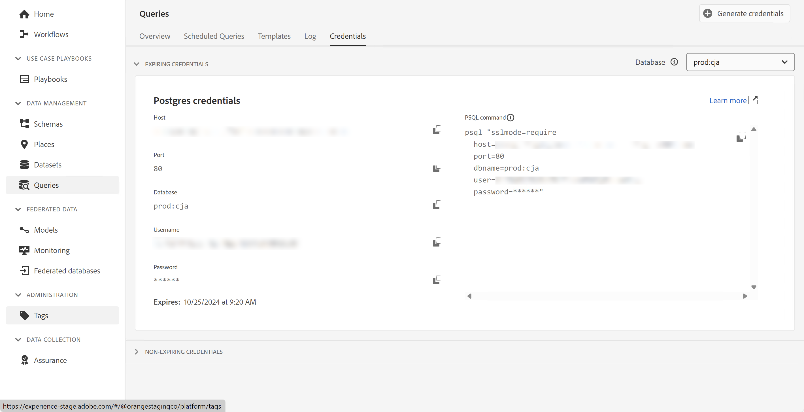

1. Abra el escritorio de Power BI.
1. En la interfaz principal, seleccione **[!UICONTROL Obtener datos de otras fuentes]**.
1. En el diálogo **[!UICONTROL Obtener datos]**:
   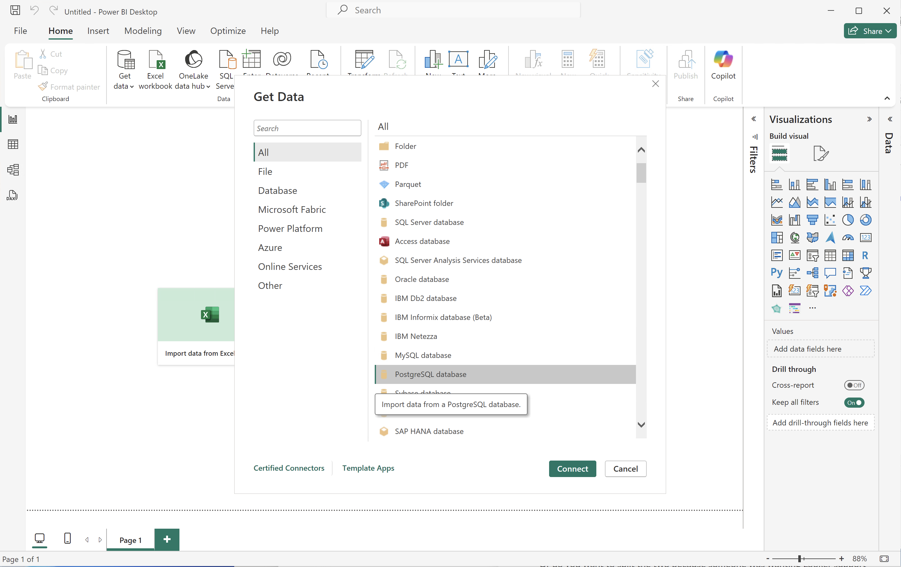
   1. Busque y seleccione **[!UICONTROL base de datos PostgreSQL]**.
   1. Seleccione **[!UICONTROL Conectar]**.
1. En el diálogo **[!UICONTROL Base de datos PostgreSQL]**:
   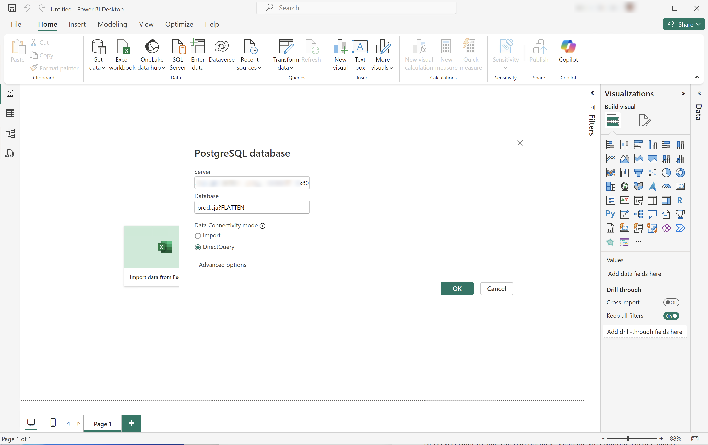
   1. Use  para copiar y pegar los valores de **[!UICONTROL Host]** y **[!UICONTROL Puerto]** del Experience Platform **[!UICONTROL Consulta]** **[!UICONTROL Credenciales que caducan]**, separados por `:` como valor de **[!UICONTROL Servidor]**. Por ejemplo: `examplecompany.platform-query.adobe.io:80`.
   1. Use  para copiar y pegar el valor **[!UICONTROL Base de datos]** del Experience Platform **[!UICONTROL Consulta]** **[!UICONTROL Credenciales que caducan]**. Agregue `?FLATTEN` al valor que pegue. Por ejemplo, `prod:cja?FLATTEN`.
   1. Seleccione **[!UICONTROL DirectQuery]** como [!UICONTROL modo de conectividad de datos].
   1. Seleccione **[!UICONTROL Aceptar]**.
1. En el cuadro de diálogo **[!UICONTROL Base de datos PostgreSQL]** - **[!UICONTROL Base de datos]**:
   
   1. Use  para copiar los valores de **[!UICONTROL Nombre de usuario]** y **[!UICONTROL Contraseña]** del panel **[!UICONTROL Consulta]** **[!UICONTROL Credenciales que caducan]** del Experience Platform en los campos **[!UICONTROL Nombre de usuario]** y **[!UICONTROL Contraseña]**. Si usa una [credencial que no caduca](https://experienceleague.adobe.com/en/docs/experience-platform/query/ui/credentials?lang=en#use-credential-to-connect), use la contraseña de la credencial que no caduca.
   1. Asegúrese de que el menú desplegable de **[!UICONTROL Seleccione el nivel en el que aplicar esta configuración a]** esté establecido en el **[!UICONTROL Servidor]** que ha definido anteriormente.
   1. Seleccione **[!UICONTROL Conectar]**.
1. En el cuadro de diálogo **[!UICONTROL Navegador]**, se recuperan las vistas de datos. Esta recuperación puede tardar un poco. Una vez recuperado:
   Power BI 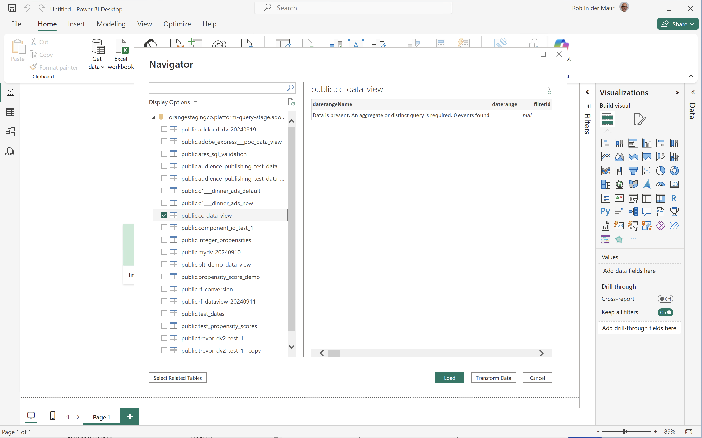
   1. Seleccione **[!UICONTROL public.cc_data_view]** de la lista del panel izquierdo.
   1. Seleccione **[!UICONTROL Cargar]**.
1. Después de un tiempo, las métricas y dimensiones disponibles se mostrarán en el panel **[!UICONTROL Datos]**.
   Power BI 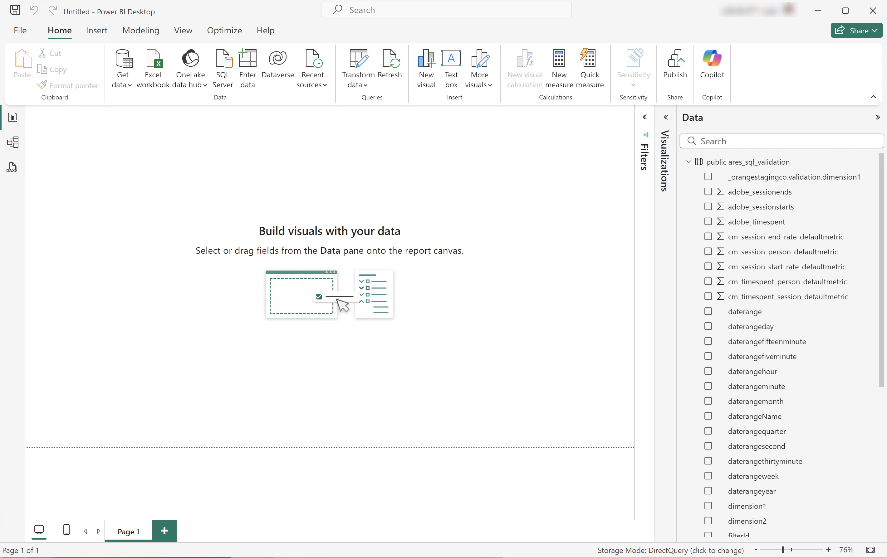

>[!TAB Escritorio Tableau]

1. Acceda a las credenciales y los parámetros necesarios desde la interfaz de usuario del servicio de consultas de Experience Platform.

   1. Vaya a la zona protegida del Experience Platform.
   1. Seleccione  **[!UICONTROL Consultas]** del carril izquierdo.
   1. Seleccione la ficha **[!UICONTROL Credenciales]** en la interfaz de **[!UICONTROL Consultas]**.
   1. Seleccione `prod:cja` del menú desplegable **[!UICONTROL Base de datos]**.

      

1. Abra Tableau.
1. Seleccione **[!UICONTROL PostgreSQL]** del carril izquierdo debajo de **[!UICONTROL A un servidor]**. Si no está disponible, seleccione **[!UICONTROL Más...]** y seleccione **[!UICONTROL PostgreSQL]** de los **[!UICONTROL Conectores instalados]**.
   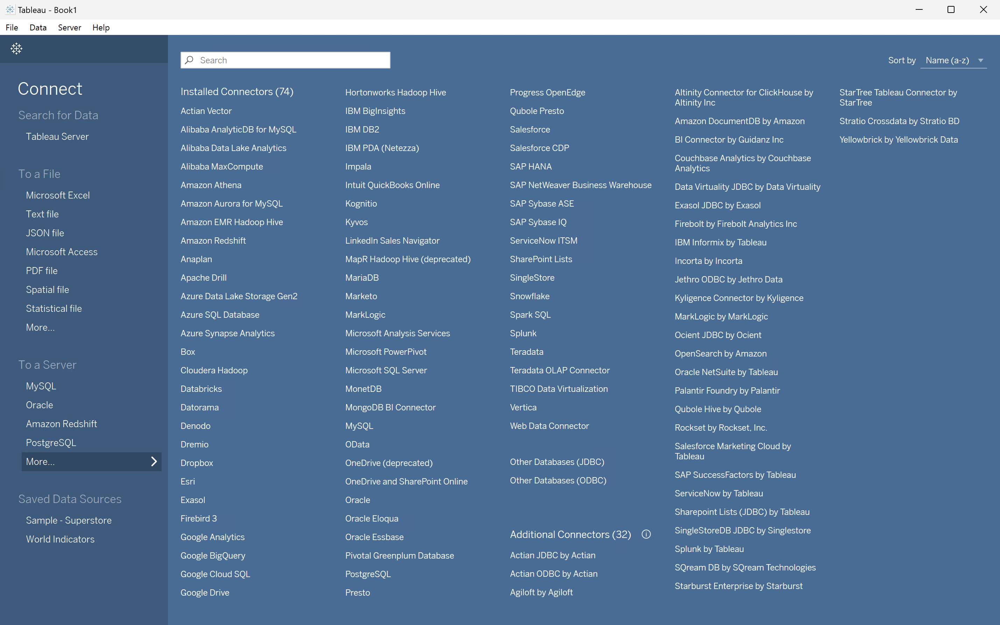
1. En el cuadro de diálogo **[!UICONTROL PostgreSQL]**, en la ficha **[!UICONTROL General]**:
   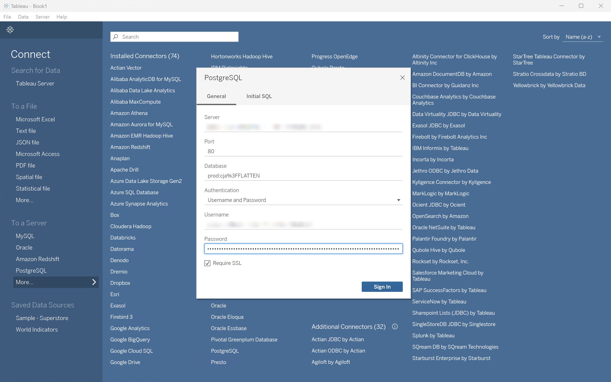
   1. Use  para copiar y pegar el **[!UICONTROL host]** de la **[!UICONTROL consulta]** **[!UICONTROL Credenciales que caducan]** del Experience Platform en el **[!UICONTROL servidor]**.
   1. Use  para copiar y pegar el **[!UICONTROL puerto]** de la **[!UICONTROL consulta]** **[!UICONTROL Credenciales que caducan]** del Experience Platform en el **[!UICONTROL puerto]**.
   1. Use  para copiar y pegar la **[!UICONTROL base de datos]** del Experience Platform **[!UICONTROL Query]** **[!UICONTROL Credenciales que caducan]** en la **[!UICONTROL base de datos]**. Agregue `%3FFLATTEN` al valor que pegue. Por ejemplo: `prod:cja%3FFLATTEN`.
   1. Seleccione **[!UICONTROL Nombre de usuario y Contraseña]** del menú desplegable **[!UICONTROL Autenticación]**.
   1. Use  para copiar y pegar el **[!UICONTROL nombre de usuario]** de la **[!UICONTROL Consulta]** **[!UICONTROL Credenciales de caducidad]** del Experience Platform en el **[!UICONTROL nombre de usuario]**.
   1. Use  para copiar y pegar la **[!UICONTROL Contraseña]** del Experience Platform **[!UICONTROL Consultar]** **[!UICONTROL Credenciales que caducan]** en la **[!UICONTROL Contraseña]**. Si usa una [credencial que no caduca](https://experienceleague.adobe.com/en/docs/experience-platform/query/ui/credentials?lang=en#use-credential-to-connect), use la contraseña de la credencial que no caduca.
   1. Asegúrese de comprobar **[!UICONTROL Requerir SSL]**.
   1. Seleccione **[!UICONTROL Iniciar sesión]**.

   Verá un cuadro de diálogo **[!UICONTROL Solicitud en curso]** mientras Tableau Desktop valida la conexión.
1. En la ventana principal, verá lo siguiente en la vista de Data Source, en el panel izquierdo:
   * Nombre de la conexión, debajo de **[!UICONTROL Connections]**.
   * Nombre de la base de datos, debajo de **[!UICONTROL Database]**.
   * Una lista de tablas, debajo de **[!UICONTROL Tabla]**.
     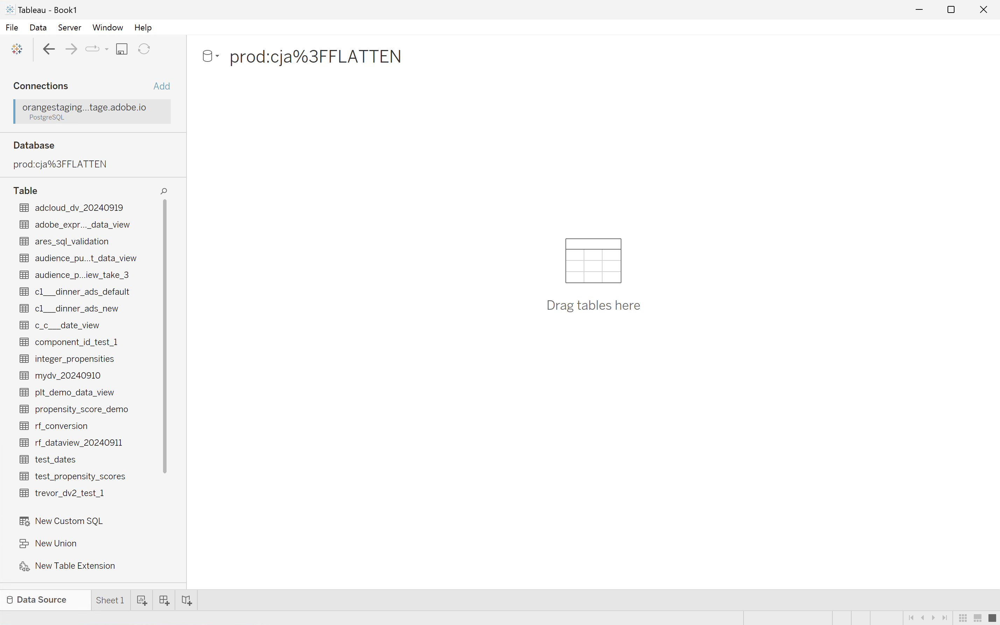
   1. Arrastre la entrada **[!UICONTROL cc_data_view]** y suéltela en la vista principal que dice **[!UICONTROL Arrastrar tablas]** aquí.
1. La ventana principal ahora muestra detalles de la vista de datos **[!UICONTROL cc_data_view]**.
   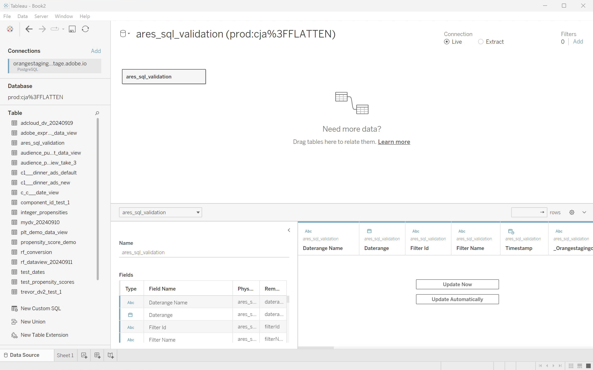

>[!ENDTABS]

+++

## Tendencia diaria

En este caso de uso, desea mostrar una tabla y una visualización de línea simple que muestre una tendencia diaria de ocurrencias desde el 1 de enero de 2023 hasta el 31 de enero de 2023.

+++ Detalles

>[!PREREQUISITES]
>
>Asegúrese de que ha validado una conexión correcta [y de que puede enumerar las vistas de datos](#connect-and-list-data-views) de la herramienta de BI para la que desea probar este caso de uso.
>

>[!BEGINTABS]

>[!TAB Escritorio de Power BI]

1. En el panel **[!UICONTROL Datos]**:
   1. Seleccione la dimensión **[!UICONTROL daterangeday]**.
   1. Seleccione la métrica **[!UICONTROL ocurrencias]**.

   Verá una tabla que muestra las ocurrencias del mes actual. Para obtener una mejor visibilidad, amplíe la visualización de tabla.

1. En el panel **[!UICONTROL Filtros]**:

   1. Seleccione **[!UICONTROL daterangedday is (All)]** de **[!UICONTROL Filtros en esta imagen]**.
   1. Seleccione **[!UICONTROL Filtro avanzado]** como **[!UICONTROL Tipo de filtro]**.
   1. Defina el filtro para **[!UICONTROL Mostrar elementos cuando el valor]** **[!UICONTROL esté en]** `1/1/2023` **[!UICONTROL y]** **[!UICONTROL esté antes de]** `1/2/2023.`. Puede usar el icono del calendario para elegir y seleccionar fechas.
   1. Seleccione **[!UICONTROL Aplicar filtro]**.

   Verá la tabla actualizada con el filtro **[!UICONTROL daterangeday]** aplicado.

1. En el panel **[!UICONTROL Visualizaciones]**:

   1. Seleccione la visualización **[!UICONTROL Gráfico de líneas]**.

   Una visualización de gráfico de líneas reemplaza la tabla mientras utiliza los mismos datos que la tabla.

   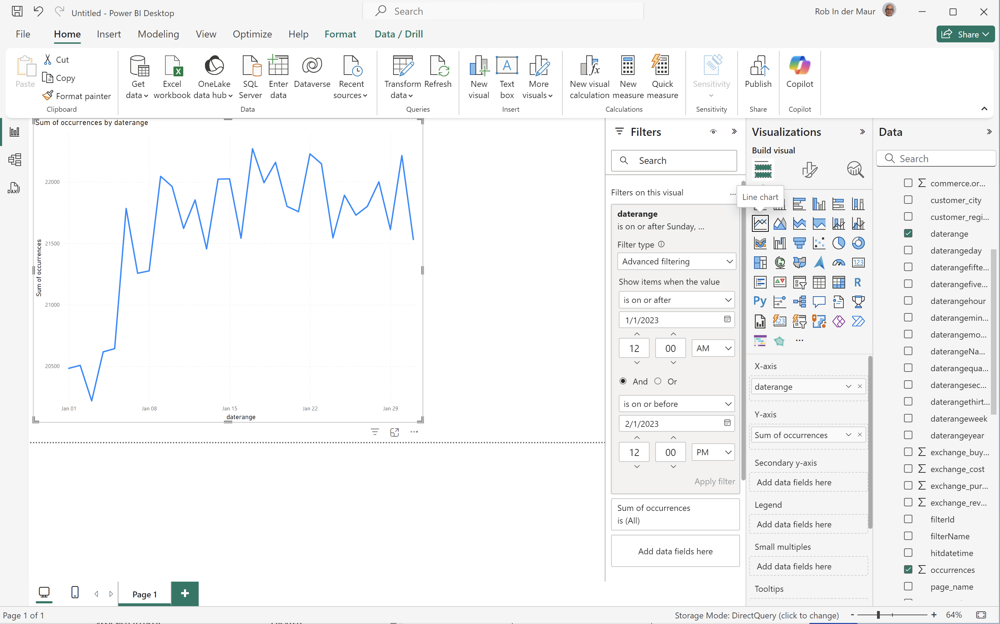

1. En la visualización del gráfico de líneas:

   1. Seleccione .
   1. En el menú contextual, seleccione **[!UICONTROL Mostrar como tabla]**.

   La vista principal se actualiza para mostrar una visualización de líneas y una tabla.

   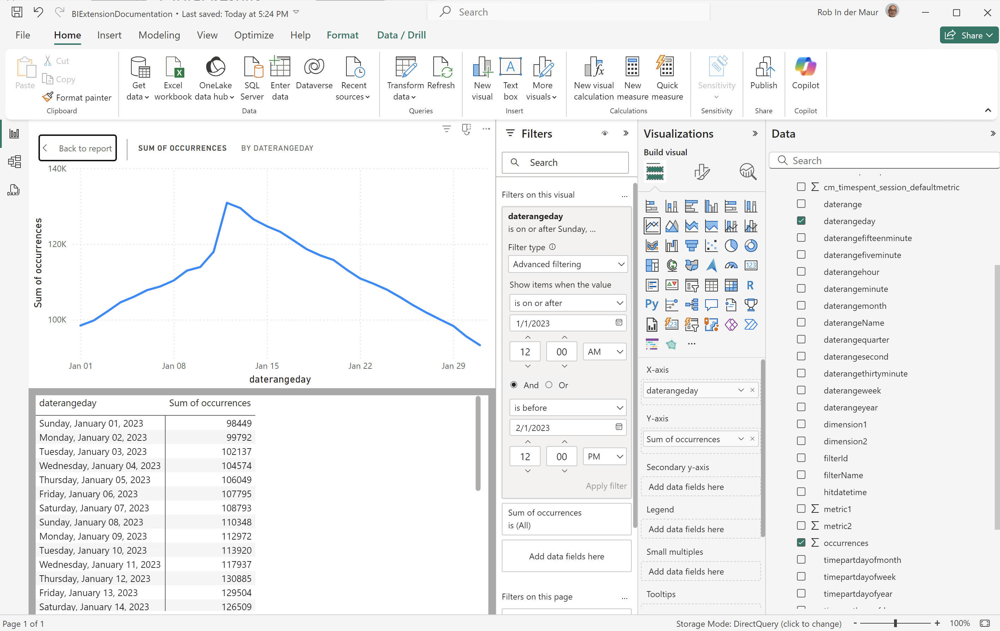

>[!TAB Escritorio Tableau]

1. Seleccione la ficha **[!UICONTROL Hoja 1]** en la parte inferior para cambiar de **[!UICONTROL Fuente de datos]**. En la vista **[!UICONTROL Hoja 1]**:
   1. Arrastre la entrada **[!UICONTROL Daterange]** de la lista **[!UICONTROL Tablas]** en el panel **[!UICONTROL Datos]** y suéltela en el estante **[!UICONTROL Filtros]**.
   1. En el cuadro de diálogo **[!UICONTROL Filtros de campo \[Intervalo de fechas\]]**, seleccione **[!UICONTROL Intervalo de fechas]** y seleccione **[!UICONTROL Siguiente >]**.
   1. En el cuadro de diálogo **[!UICONTROL Filtrar \[Daterange]]**, seleccione **[!UICONTROL Intervalo de fechas]** y especifique un período de `01/01/2023` - `01/02/2023`.

      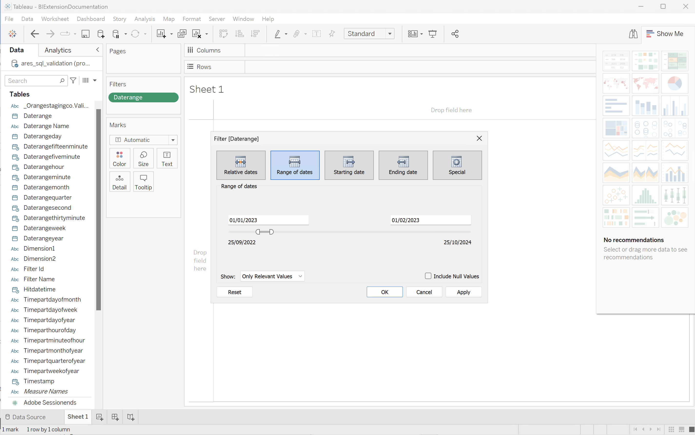

   1. Arrastre y suelte **[!UICONTROL Daterangeday]** de la lista **[!UICONTROL Tablas]** en el panel **[!UICONTROL Datos]** y suelte la entrada en el campo junto a **[!UICONTROL Columnas]**.
      * Seleccione **[!UICONTROL Día]** del menú desplegable **[!UICONTROL Daterangeday]**, para que el valor se actualice a **[!UICONTROL DAY(Daterangeday)]**.
   1. Arrastre y suelte **[!UICONTROL Ocurrencias]** de la lista **[!UICONTROL Tablas (*Nombres de medida*)]** en el panel **[!UICONTROL Datos]** y suelte la entrada en el campo junto a **[!UICONTROL Filas]**.
      * Los valores se convierten automáticamente a **[!UICONTROL SUM(Occurrences)]**.
   1. Modifique **[!UICONTROL Estándar]** a **[!UICONTROL Vista completa]** desde el menú desplegable de la barra de herramientas.

      La vista Hoja 1 debería ser similar a la siguiente.

      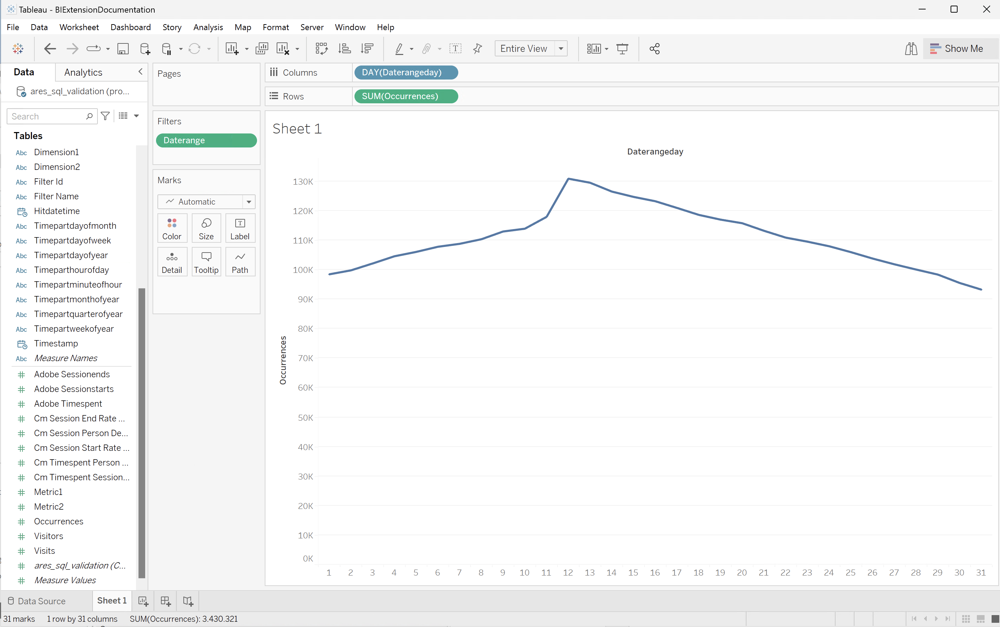

1. Seleccione **[!UICONTROL Duplicate]** del menú contextual de la ficha **[!UICONTROL Hoja 1]** para crear una segunda hoja.
1. Seleccione **[!UICONTROL Rename]** del menú contextual de la ficha **[!UICONTROL Hoja 1]** para cambiar el nombre de la hoja a `Graph`.
1. Seleccione **[!UICONTROL Rename]** del menú contextual de la ficha **[!UICONTROL Hoja 1 (2)]** para cambiar el nombre de la hoja a `Data`.
1. Asegúrese de que la hoja **[!UICONTROL Data]** esté seleccionada. En la vista Datos:
   1. Seleccione **[!UICONTROL Mostrarme]** en la parte superior derecha y seleccione **[!UICONTROL Tabla de texto]** (visualización superior izquierda superior) para modificar el contenido de la vista de datos a una tabla.
   1. Arrastre **[!UICONTROL DAY(Daterangeday)]** de **[!UICONTROL Columnas]** a **[!UICONTROL Filas]**.
   1. Modifique **[!UICONTROL Estándar]** a **[!UICONTROL Vista completa]** desde el menú desplegable de la barra de herramientas.

      La vista de **[!UICONTROL Datos]** debe ser similar a la siguiente.

      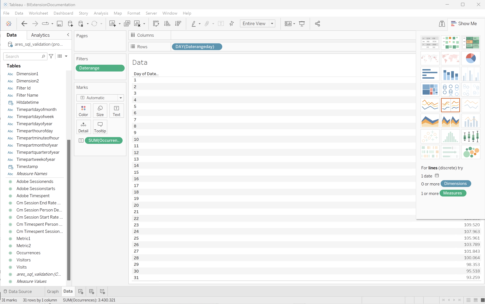

1. Seleccione el botón de pestaña **[!UICONTROL Nuevo panel]** (en la parte inferior) para crear una nueva vista de **[!UICONTROL panel 1]**. En la vista **[!UICONTROL Panel 1]**:
   1. Arrastre y suelte la hoja **[!UICONTROL Graph]** del estante **[!UICONTROL Sheets]** en la vista **[!UICONTROL Dashboard 1]** que dice *Colocar hojas aquí*.
   1. Arrastre y suelte la hoja **[!UICONTROL Data]** del estante **[!UICONTROL Sheets]** debajo de la hoja **[!UICONTROL Graph]** en la vista **[!UICONTROL Dashboard 1]**.
   1. Seleccione la hoja **[!UICONTROL Data]** en la vista y modifique **[!UICONTROL Toda la vista]** a **[!UICONTROL Anchura de la corrección]**.

      La vista del **[!UICONTROL panel 1]** debería ser similar a la siguiente.

      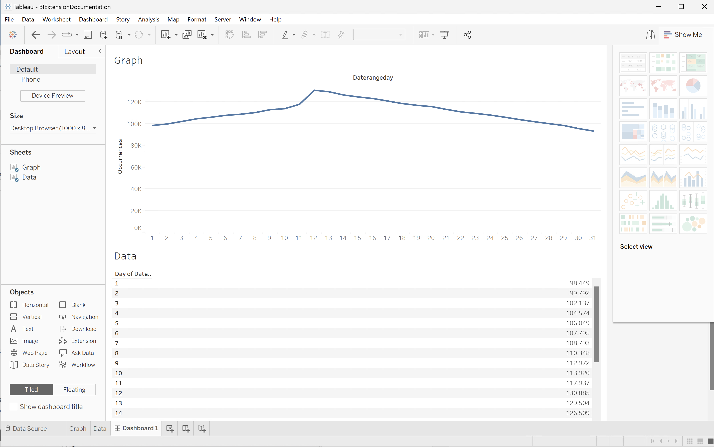

>[!ENDTABS]

+++

## Tendencia horaria

En este caso de uso, desea mostrar una tabla y una visualización de línea simple que muestre una tendencia horaria de ocurrencias para el 1 de enero de 2023.

+++ Detalles

>[!PREREQUISITES]
>
>Asegúrese de que ha validado una conexión correcta [y de que puede enumerar las vistas de datos](#connect-and-list-data-views) de la herramienta de BI para la que desea probar este caso de uso.
>

>[!BEGINTABS]

>[!TAB Escritorio de Power BI]

El Power BI  no entiende **cómo manejar las columnas de fecha y hora, por lo que no se admiten dimensiones como**[!UICONTROL  daterangehour ]**y**[!UICONTROL  daterangeminute ]**.**

>[!TAB Escritorio Tableau]

1. Seleccione la ficha **[!UICONTROL Hoja 1]** en la parte inferior para cambiar de **[!UICONTROL Fuente de datos]**. En la vista **[!UICONTROL Hoja 1]**:
   1. Arrastre la entrada **[!UICONTROL Daterange]** de la lista **[!UICONTROL Tablas]** en el panel **[!UICONTROL Datos]** y suéltela en el estante **[!UICONTROL Filtros]**.
   1. En el cuadro de diálogo **[!UICONTROL Filtros de campo \[Intervalo de fechas\]]**, seleccione **[!UICONTROL Intervalo de fechas]** y seleccione **[!UICONTROL Siguiente >]**.
   1. En el cuadro de diálogo **[!UICONTROL Filtrar \[Daterange]]**, seleccione **[!UICONTROL Intervalo de fechas]** y especifique un período de `01/01/2023` - `02/01/2023`.

      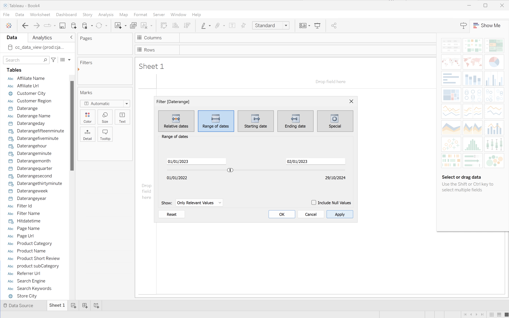

   1. Arrastre y suelte **[!UICONTROL Daterangehour]** de la lista **[!UICONTROL Tablas]** en el panel **[!UICONTROL Datos]** y suelte la entrada en el campo junto a **[!UICONTROL Columnas]**.
      * Seleccione **[!UICONTROL Más]** > **[!UICONTROL Horas]** del menú desplegable **[!UICONTROL Daterangeday]**, para que el valor se actualice a **[!UICONTROL HOUR(Daterangeday)]**.
   1. Arrastre y suelte **[!UICONTROL Ocurrencias]** de la lista **[!UICONTROL Tablas (*Nombres de medida*)]** en el panel **[!UICONTROL Datos]** y suelte la entrada en el campo junto a **[!UICONTROL Filas]**.
      * Los valores se convierten automáticamente a **[!UICONTROL SUM(Occurrences)]**.
   1. Modifique **[!UICONTROL Estándar]** a **[!UICONTROL Vista completa]** desde el menú desplegable de la barra de herramientas.

      La vista Hoja 1 debería ser similar a la siguiente.

      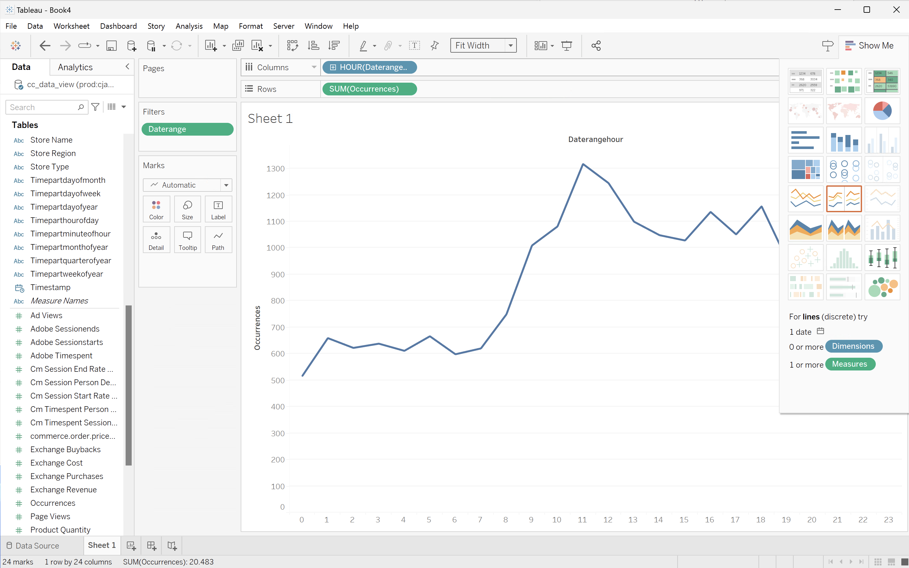

1. Seleccione **[!UICONTROL Duplicate]** del menú contextual de la ficha **[!UICONTROL Hoja 1]** para crear una segunda hoja.
1. Seleccione **[!UICONTROL Rename]** del menú contextual de la ficha **[!UICONTROL Hoja 1]** para cambiar el nombre de la hoja a `Graph`.
1. Seleccione **[!UICONTROL Rename]** del menú contextual de la ficha **[!UICONTROL Hoja 1 (2)]** para cambiar el nombre de la hoja a `Data`.
1. Asegúrese de que la hoja **[!UICONTROL Data]** esté seleccionada. En la vista Datos:
   1. Seleccione **[!UICONTROL Mostrarme]** en la parte superior derecha y seleccione **[!UICONTROL Tabla de texto]** (visualización superior izquierda superior) para modificar el contenido de la vista de datos a una tabla.
   1. Arrastre **[!UICONTROL HOUR(Daterangeday)]** de **[!UICONTROL Columnas]** a **[!UICONTROL Filas]**.
   1. Modifique **[!UICONTROL Estándar]** a **[!UICONTROL Vista completa]** desde el menú desplegable de la barra de herramientas.

      La vista de **[!UICONTROL Datos]** debe ser similar a la siguiente.

      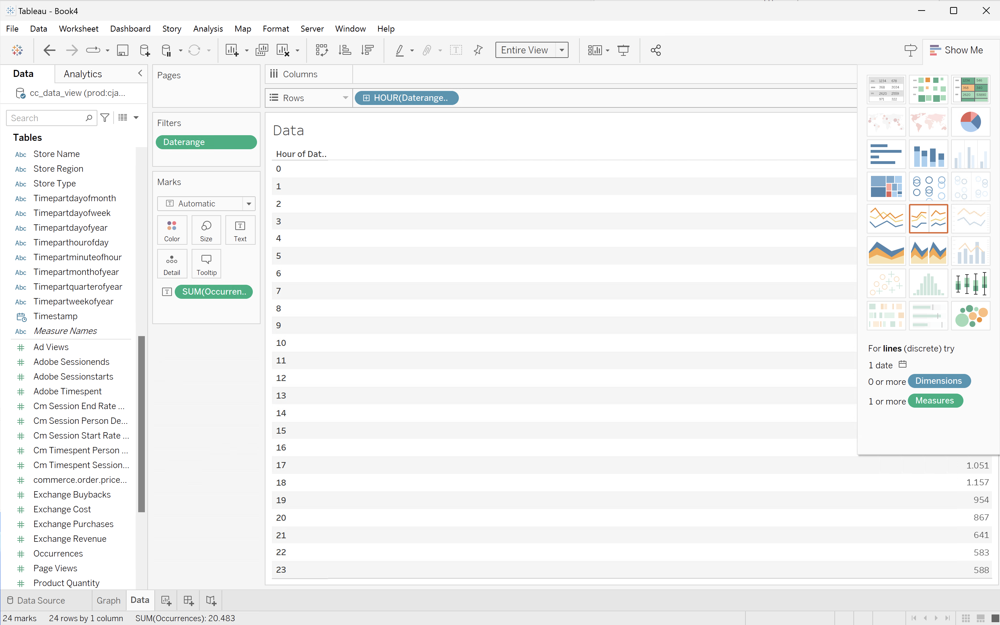

1. Seleccione el botón de pestaña **[!UICONTROL Nuevo panel]** (en la parte inferior) para crear una nueva vista de **[!UICONTROL panel 1]**. En la vista **[!UICONTROL Panel 1]**:
   1. Arrastre y suelte la hoja **[!UICONTROL Graph]** del estante **[!UICONTROL Sheets]** en la vista **[!UICONTROL Dashboard 1]** que dice *Colocar hojas aquí*.
   1. Arrastre y suelte la hoja **[!UICONTROL Data]** del estante **[!UICONTROL Sheets]** debajo de la hoja **[!UICONTROL Graph]** en la vista **[!UICONTROL Dashboard 1]**.
   1. Seleccione la hoja **[!UICONTROL Data]** en la vista y modifique **[!UICONTROL Toda la vista]** a **[!UICONTROL Anchura de la corrección]**.

      La vista del **[!UICONTROL panel 1]** debería ser similar a la siguiente.

      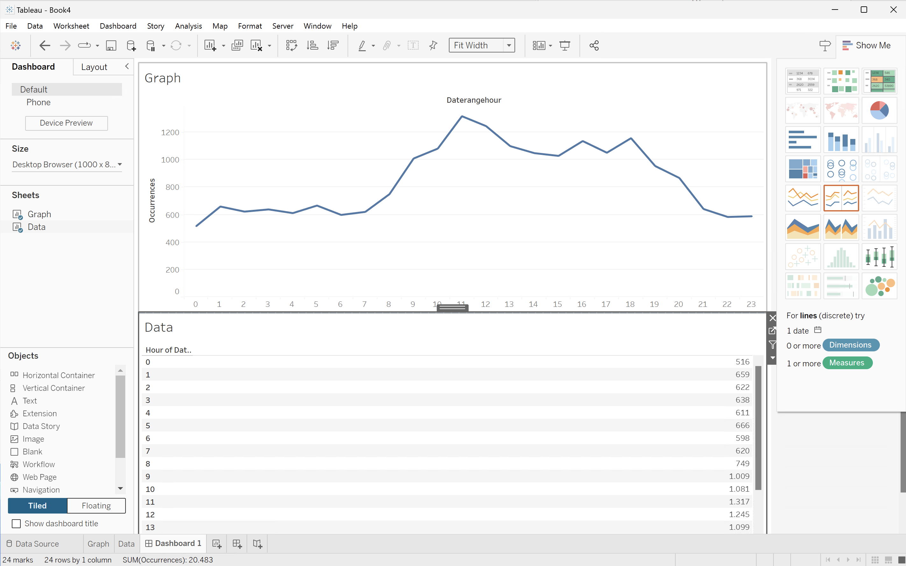

>[!ENDTABS]

+++

## Tendencia mensual

En este caso de uso, desea mostrar una tabla y una visualización de línea simple que muestre una tendencia mensual de ocurrencias entre el 1 de enero de 2023 y el 1 de enero de 2024.

+++ Detalles

>[!PREREQUISITES]
>
>Asegúrese de que ha validado una conexión correcta [y de que puede enumerar las vistas de datos](#connect-and-list-data-views) de la herramienta de BI para la que desea probar este caso de uso.
>

>[!BEGINTABS]

>[!TAB Escritorio de Power BI]

1. En el panel **[!UICONTROL Datos]**:
   1. Seleccione la dimensión **[!UICONTROL daterangemonth]**.
   1. Seleccione la métrica **[!UICONTROL ocurrencias]**.

   Verá una tabla que muestra las ocurrencias del mes actual. Para obtener una mejor visibilidad, amplíe la visualización de tabla.

1. En el panel **[!UICONTROL Filtros]**:

   1. Seleccione **[!UICONTROL daterangemonth is (All)]** de **[!UICONTROL Filtros en este elemento visual]**.
   1. Seleccione **[!UICONTROL Filtro avanzado]** como **[!UICONTROL Tipo de filtro]**.
   1. Defina el filtro para **[!UICONTROL Mostrar elementos cuando el valor]** **[!UICONTROL esté en]** `1/1/2023` **[!UICONTROL y]** **[!UICONTROL esté antes de]** `1/1/2024.`. Puede usar el icono del calendario para elegir y seleccionar fechas.
   1. Seleccione **[!UICONTROL Aplicar filtro]**.

   Verá la tabla actualizada con el filtro **[!UICONTROL daterangeday]** aplicado.

1. En el panel **[!UICONTROL Visualizaciones]**:

   1. Seleccione la visualización **[!UICONTROL Gráfico de líneas]**.

   Una visualización de gráfico de líneas reemplaza la tabla mientras utiliza los mismos datos que la tabla.

   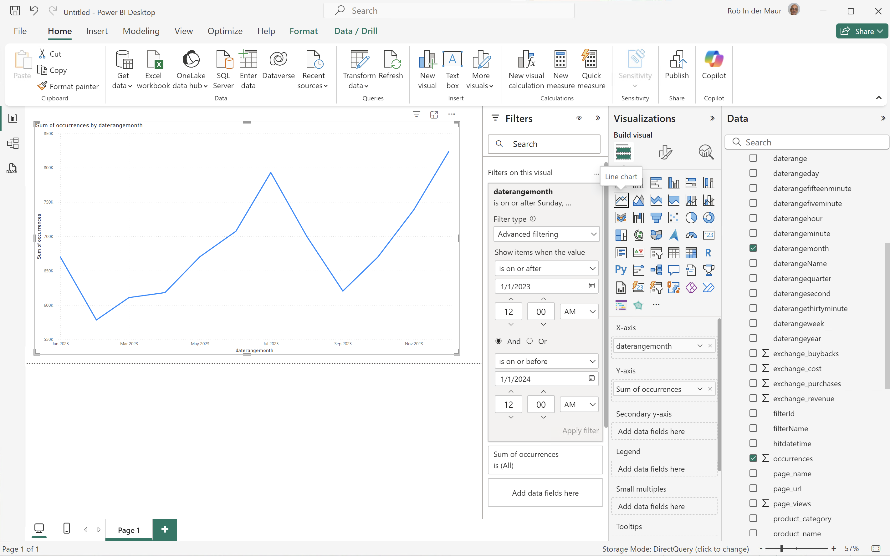

1. En la visualización del gráfico de líneas:

   1. Seleccione .
   1. En el menú contextual, seleccione **[!UICONTROL Mostrar como tabla]**.

   La vista principal se actualiza para mostrar una visualización de líneas y una tabla.

   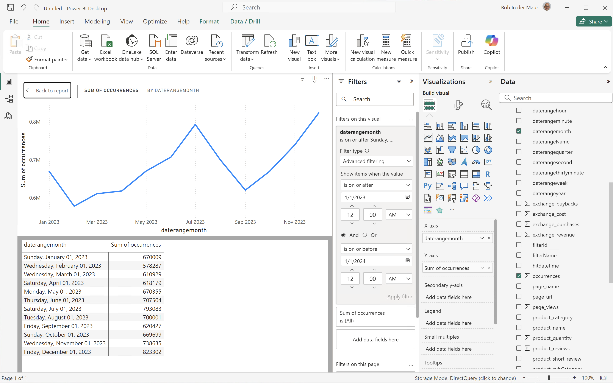

>[!TAB Escritorio Tableau]

1. Seleccione la ficha **[!UICONTROL Hoja 1]** en la parte inferior para cambiar de **[!UICONTROL Fuente de datos]**. En la vista **[!UICONTROL Hoja 1]**:
   1. Arrastre la entrada **[!UICONTROL Daterange]** de la lista **[!UICONTROL Tablas]** en el panel **[!UICONTROL Datos]** y suéltela en el estante **[!UICONTROL Filtros]**.
   1. En el cuadro de diálogo **[!UICONTROL Filtros de campo \[Intervalo de fechas\]]**, seleccione **[!UICONTROL Intervalo de fechas]** y seleccione **[!UICONTROL Siguiente >]**.
   1. En el cuadro de diálogo **[!UICONTROL Filtrar \[Daterange]]**, seleccione **[!UICONTROL Intervalo de fechas]** y especifique un período de `01/01/2023` - `01/01/2024`.

      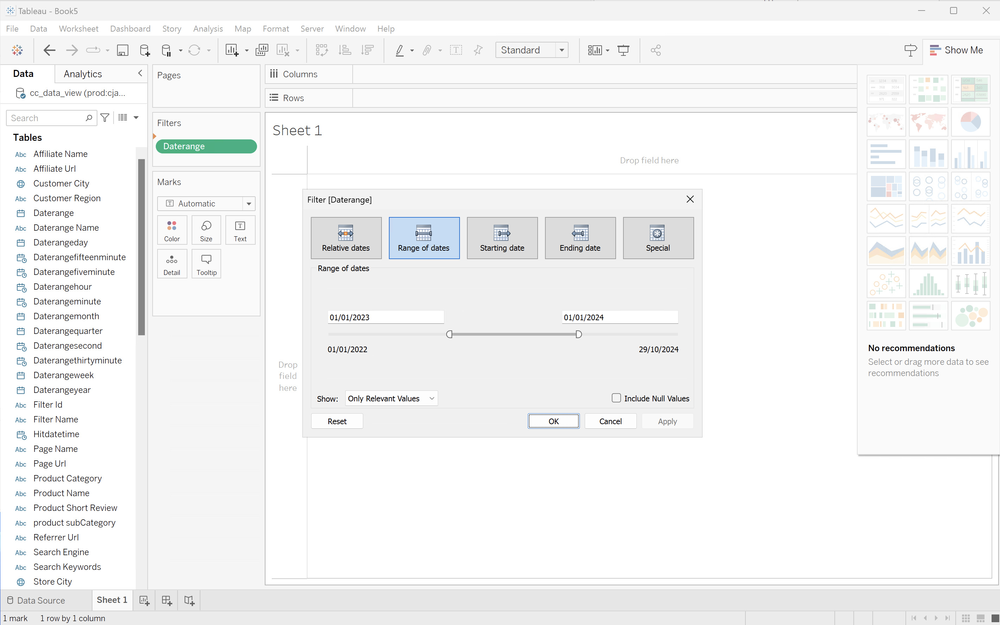

   1. Arrastre y suelte **[!UICONTROL Daterangeday]** de la lista **[!UICONTROL Tablas]** en el panel **[!UICONTROL Datos]** y suelte la entrada en el campo junto a **[!UICONTROL Columnas]**.
      * Seleccione **[!UICONTROL MONTH]** en el menú desplegable **[!UICONTROL Daterangeday]**, para que el valor se actualice a **[!UICONTROL MONTH(Daterangeday)]**.
   1. Arrastre y suelte **[!UICONTROL Ocurrencias]** de la lista **[!UICONTROL Tablas (*Nombres de medida*)]** en el panel **[!UICONTROL Datos]** y suelte la entrada en el campo junto a **[!UICONTROL Filas]**.
      * Los valores se convierten automáticamente a **[!UICONTROL SUM(Occurrences)]**.
   1. Modifique **[!UICONTROL Estándar]** a **[!UICONTROL Vista completa]** desde el menú desplegable de la barra de herramientas.

      La vista Hoja 1 debería ser similar a la siguiente.

      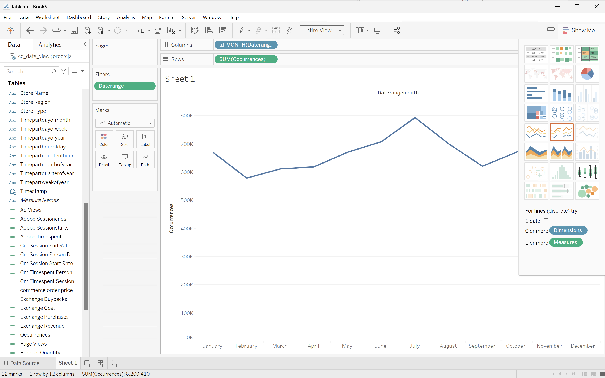

1. Seleccione **[!UICONTROL Duplicate]** del menú contextual de la ficha **[!UICONTROL Hoja 1]** para crear una segunda hoja.
1. Seleccione **[!UICONTROL Rename]** del menú contextual de la ficha **[!UICONTROL Hoja 1]** para cambiar el nombre de la hoja a `Graph`.
1. Seleccione **[!UICONTROL Rename]** del menú contextual de la ficha **[!UICONTROL Hoja 1 (2)]** para cambiar el nombre de la hoja a `Data`.
1. Asegúrese de que la hoja **[!UICONTROL Data]** esté seleccionada. En la vista Datos:
   1. Seleccione **[!UICONTROL Mostrarme]** en la parte superior derecha y seleccione **[!UICONTROL Tabla de texto]** (visualización superior izquierda superior) para modificar el contenido de la vista de datos a una tabla.
   1. Arrastre **[!UICONTROL MONTH(Daterangeday)]** de **[!UICONTROL Columnas]** a **[!UICONTROL Filas]**.
   1. Modifique **[!UICONTROL Estándar]** a **[!UICONTROL Vista completa]** desde el menú desplegable de la barra de herramientas.

      La vista de **[!UICONTROL Datos]** debe ser similar a la siguiente.

      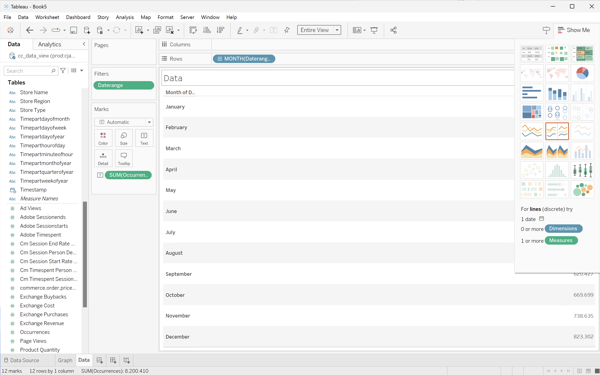

1. Seleccione el botón de pestaña **[!UICONTROL Nuevo panel]** (en la parte inferior) para crear una nueva vista de **[!UICONTROL panel 1]**. En la vista **[!UICONTROL Panel 1]**:
   1. Arrastre y suelte la hoja **[!UICONTROL Graph]** del estante **[!UICONTROL Sheets]** en la vista **[!UICONTROL Dashboard 1]** que dice *Colocar hojas aquí*.
   1. Arrastre y suelte la hoja **[!UICONTROL Data]** del estante **[!UICONTROL Sheets]** debajo de la hoja **[!UICONTROL Graph]** en la vista **[!UICONTROL Dashboard 1]**.
   1. Seleccione la hoja **[!UICONTROL Data]** en la vista y modifique **[!UICONTROL Toda la vista]** a **[!UICONTROL Anchura de la corrección]**.

      La vista del **[!UICONTROL panel 1]** debería ser similar a la siguiente.

      

>[!ENDTABS]

+++

## Dimensión única clasificada

Resumen del caso de uso

+++ Detalles

>[!PREREQUISITES]
>
>Asegúrese de que ha validado una conexión correcta [y de que puede enumerar las vistas de datos](#connect-and-list-data-views) de la herramienta de BI para la que desea probar este caso de uso.
>

>[!BEGINTABS]

>[!TAB Escritorio de Power BI]

Pasos

>[!TAB Escritorio Tableau]

Pasos

>[!ENDTABS]

+++

## Clasificación de varias dimensiones

Resumen del caso de uso

+++ Detalles

>[!BEGINTABS]

>[!TAB Escritorio de Power BI]

Pasos

>[!TAB Escritorio Tableau]

Pasos

>[!ENDTABS]

+++

## Contar valores de dimensión distintos

Resumen del caso de uso

+++ Detalles

>[!BEGINTABS]

>[!TAB Escritorio de Power BI]

Pasos

>[!TAB Escritorio Tableau]

Pasos

>[!ENDTABS]

+++

## Usar nombres de intervalo de fechas para filtrar

Resumen del caso de uso

+++ Detalles

>[!BEGINTABS]

>[!TAB Escritorio de Power BI]

Pasos

>[!TAB Escritorio Tableau]

Pasos

>[!ENDTABS]

+++

## Usar nombres de filtro para filtrar

Resumen del caso de uso

+++ Detalles

>[!BEGINTABS]

>[!TAB Escritorio de Power BI]

Pasos

>[!TAB Escritorio Tableau]

Pasos

>[!ENDTABS]

+++

## Uso de valores de dimensión para filtrar

Resumen del caso de uso

+++ Detalles

>[!BEGINTABS]

>[!TAB Escritorio de Power BI]

Pasos

>[!TAB Escritorio Tableau]

Pasos

>[!ENDTABS]

+++

## Ordenar

Resumen del caso de uso

+++ Detalles

>[!BEGINTABS]

>[!TAB Escritorio de Power BI]

Pasos

>[!TAB Escritorio Tableau]

Pasos

>[!ENDTABS]

+++

## Límites

Resumen del caso de uso

+++ Detalles

>[!BEGINTABS]

>[!TAB Escritorio de Power BI]

Pasos

>[!TAB Escritorio Tableau]

Pasos

>[!ENDTABS]

+++

## Para ACOPLAR o no

Resumen del caso de uso

+++ Detalles

>[!BEGINTABS]

>[!TAB Escritorio de Power BI]

Pasos

>[!TAB Escritorio Tableau]

Pasos

>[!ENDTABS]

+++

## Transformaciones de Dimension y métricas

Resumen del caso de uso

+++ Detalles

>[!BEGINTABS]

>[!TAB Escritorio de Power BI]

Pasos

>[!TAB Escritorio Tableau]

Pasos

>[!ENDTABS]

+++

## Visualizaciones e interacciones

Resumen del caso de uso

+++ Detalles

>[!BEGINTABS]

>[!TAB Escritorio de Power BI]

Pasos

>[!TAB Escritorio Tableau]

Pasos

>[!ENDTABS]

+++

