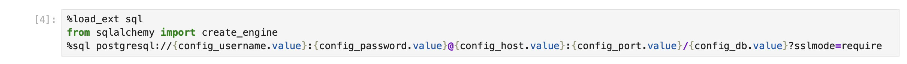
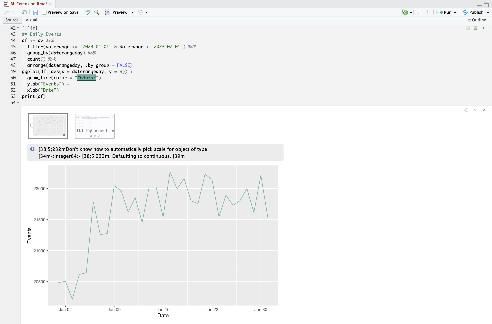

# Casos de uso de extensión de BI

Este artículo describe cómo realizar una serie de casos de uso con la extensión de Customer Journey Analytics BI. En cada caso de uso se explica la funcionalidad de Customer Journey Analytics, seguida de detalles para cada una de las herramientas de BI admitidas:

* **Escritorio de Power BI**. La versión utilizada es 2.137.1102.0 de 64 bits (octubre de 2024).
* **Escritorio Tableau**. La versión utilizada es 2024.1.5 (20241.24.0705.0334) de 64 bits.
* **Buscador**. Versión en línea 25.0.23, disponible a través de [looker.com](https://looker.com){target="_blank"}
* **Jupyter Notebook**. La versión utilizada es la 7.3.2.
* **EstudioRS**. La versión utilizada es 2024.12.0, compilación 467.

Los siguientes casos de uso están documentados:

* **Conectar**
   * [Conexión y lista de vistas de datos](#connect-and-validate)

* **Informar y analizar**
   * [Tendencia diaria](#daily-trend)
   * [Tendencia horaria](#hourly-trend)
   * [Tendencia mensual](#monthly-trend)
   * [Dimensión única clasificada](#single-dimension-ranked)
   * [Clasificación de varias dimensiones](#multiple-dimension-ranked)
   * [Contar valores de dimensión distintos](#count-distinct-dimension-values)
   * [Usar nombres de intervalo de fechas para filtrar](#use-date-range-names-to-filter)
   * [Usar nombres de segmento para segmentar](#use-segment-names-to-segment)
   * [Uso de valores de dimensión para segmentar](#use-dimension-values-to-segment)
   * [Ordenar](#sort)
   * [Límites](#limits)

* **Comprender**

   * [Transformaciones](#transformations)
   * [Visualizaciones](#visualizations)
   * [Advertencias](#caveats)

El caso de uso **connect** se centra en cómo conectar herramientas de BI mediante la extensión de BI de Customer Journey Analytics.

Los casos de uso de **report and analysis** indican cómo realizar visualizaciones de Customer Journey Analytics similares en las herramientas de BI que se admiten actualmente.

Los casos de uso **entiendo** proporcionan más detalles sobre:

* Transformaciones que se producen cuando se utilizan las herramientas de un BI para informar y analizar.
* Similitudes y diferencias de visualización entre las herramientas de Customer Journey Analytics y BI.
* Advertencias de cada una de las herramientas de BI que debe tener en cuenta.


## Conexión y validación

Este caso de uso configura la conexión de la herramienta BI a Customer Journey Analytics, enumera las vistas de datos disponibles y selecciona una vista de datos para usar.

+++ Customer Journey Analytics

Las instrucciones hacen referencia a un entorno de ejemplo con los siguientes objetos:

* Vista de datos: **[!UICONTROL C&amp;C - Vista de datos]** ??.
* Dimensiones: **[!UICONTROL Nombre de producto]** ?? y **[!UICONTROL ?? de categoría de producto]**.
* Métricas: **[!UICONTROL Ingresos de compras]** ?? y **[!UICONTROL Compras]** ??.
* Filtro: **[!UICONTROL Productos de pesca]** ??.

{zoomable="yes"}

Cuando revise los casos de uso, reemplace estos objetos de ejemplo por objetos adecuados para su entorno específico.

+++

+++ Herramientas de BI

>[!BEGINTABS]

>[!TAB Escritorio de Power BI]

1. Acceda a las credenciales y los parámetros necesarios desde la interfaz de usuario del servicio de consultas de Experience Platform.

   1. Vaya a la zona protegida de Experience Platform.
   1. Seleccione  **[!UICONTROL Consultas]** del carril izquierdo.
   1. Seleccione la ficha **[!UICONTROL Credenciales]** en la interfaz de **[!UICONTROL Consultas]**.
   1. Seleccione `prod:cja` del menú desplegable **[!UICONTROL Base de datos]**.

      {zoomable="yes"}

1. Inicie Power BI Desktop.
   1. En la interfaz principal, seleccione **[!UICONTROL Obtener datos de otras fuentes]**.
   1. En el diálogo **[!UICONTROL Obtener datos]**:

      {zoomable="yes"}
      1. Busque y seleccione **[!UICONTROL base de datos PostgreSQL]**.
      1. Seleccione **[!UICONTROL Conectar]**.
   1. En el diálogo **[!UICONTROL Base de datos PostgreSQL]**:

      {zoomable="yes"}
      1. Use  para copiar y pegar los valores de **[!UICONTROL Host]** y **[!UICONTROL Puerto]** del panel **[!UICONTROL Consulta]** **[!UICONTROL Credenciales que caducan]** de Experience Platform, separados por `:` como valor de **[!UICONTROL Servidor]**. Por ejemplo: `examplecompany.platform-query.adobe.io:80`.
      1. Use  para copiar y pegar el valor **[!UICONTROL Base de datos]** del panel **[!UICONTROL Consulta]** **[!UICONTROL Credenciales que caducan]** de Experience Platform. Agregue `?FLATTEN` al valor que pegue. Por ejemplo, `prod:cja?FLATTEN`.
      1. Seleccione **[!UICONTROL DirectQuery]** como **[!UICONTROL modo de conectividad de datos]**.
      1. Seleccione **[!UICONTROL Aceptar]**.
   1. En el cuadro de diálogo **[!UICONTROL Base de datos PostgreSQL]** - **[!UICONTROL Base de datos]**:

      {zoomable="yes"}
      1. Use  para copiar los valores de **[!UICONTROL Nombre de usuario]** y **[!UICONTROL Contraseña]** del panel **[!UICONTROL Consulta]** **[!UICONTROL Credenciales que caducan]** de Experience Platform en los campos **[!UICONTROL Nombre de usuario]** y **[!UICONTROL Contraseña]**. Si usa una [credencial que no caduca](https://experienceleague.adobe.com/en/docs/experience-platform/query/ui/credentials?lang=en#use-credential-to-connect), use la contraseña de la credencial que no caduca.
      1. Asegúrese de que el menú desplegable de **[!UICONTROL Seleccione el nivel en el que aplicar esta configuración a]** está establecido en el **[!UICONTROL Servidor]** que ha definido anteriormente.
      1. Seleccione **[!UICONTROL Conectar]**.
   1. En el cuadro de diálogo **[!UICONTROL Navegador]**, se recuperan las vistas de datos. Esta recuperación puede tardar un poco. Una vez recuperado, verá lo siguiente en Power BI Desktop.

      {zoomable="yes"}
      1. Seleccione **[!UICONTROL public.cc_data_view]** de la lista del panel izquierdo.
      1. Existen dos opciones:
         1. Seleccione **[!UICONTROL Cargar]** para continuar y finalizar la instalación.
         1. Seleccione **[!UICONTROL Transformar datos]**. Verá un cuadro de diálogo en el que, opcionalmente, puede aplicar transformaciones como parte de la configuración.

            {zoomable="yes"}
            * Seleccione **[!UICONTROL Cerrar y aplicar]**.
   1. Después de un tiempo, **[!UICONTROL public.cc_data_view]** se mostrará en el panel **[!UICONTROL Datos]**. Seleccione  para mostrar dimensiones y métricas.

      {zoomable="yes"}


### Para ACOPLAR o no

Power BI Desktop admite los siguientes escenarios para el parámetro `FLATTEN`. Consulte [Acoplar datos anidados](https://experienceleague.adobe.com/es/docs/experience-platform/query/key-concepts/flatten-nested-data) para obtener más información.

| Parámetro FLATTEN | Ejemplo | Admitido | Observaciones |
|---|---|:---:|---|
| Ninguno | `prod:cja` |  | |
| `?FLATTEN` | `prod:cja?FLATTEN` |  | **Opción recomendada para usar!** |
| `%3FFLATTEN` | `prod:cja%3FFLATTEN` |  | Power BI Desktop muestra un error: **[!UICONTROL No se pudo autenticar con las credenciales proporcionadas. Inténtelo de nuevo.]** |

### Más información

* [Requisitos previos](/help/data-views/bi-extension.md#prerequisites)
* [Guía de credenciales](https://experienceleague.adobe.com/es/docs/experience-platform/query/ui/credentials)
* [Conectar Power BI al servicio de consultas](https://experienceleague.adobe.com/es/docs/experience-platform/query/clients/power-bi).


>[!TAB Escritorio Tableau]

1. Acceda a las credenciales y los parámetros necesarios desde la interfaz de usuario del servicio de consultas de Experience Platform.

   1. Vaya a la zona protegida de Experience Platform.
   1. Seleccione  **[!UICONTROL Consultas]** del carril izquierdo.
   1. Seleccione la ficha **[!UICONTROL Credenciales]** en la interfaz de **[!UICONTROL Consultas]**.
   1. Seleccione `prod:cja` del menú desplegable **[!UICONTROL Base de datos]**.

      {zoomable="yes"}

1. Inicie Tableau.
   1. Seleccione **[!UICONTROL PostgreSQL]** del carril izquierdo debajo de **[!UICONTROL A un servidor]**. Si no está disponible, seleccione **[!UICONTROL Más...]** y seleccione **[!UICONTROL PostgreSQL]** de los **[!UICONTROL Conectores instalados]**.

      {zoomable="yes"}
   1. En el cuadro de diálogo **[!UICONTROL PostgreSQL]**, en la ficha **[!UICONTROL General]**:

      {zoomable="yes"}
      1. Use  para copiar y pegar el **[!UICONTROL host]** del panel **[!UICONTROL Consulta]** **[!UICONTROL Credenciales que caducan]** de Experience Platform en el **[!UICONTROL Servidor]**.
      1. Use  para copiar y pegar el **[!UICONTROL puerto]** del panel **[!UICONTROL Consulta]** **[!UICONTROL Credenciales que caducan]** de Experience Platform en el **[!UICONTROL puerto]**.
      1. Use  para copiar y pegar la **[!UICONTROL base de datos]** del panel **[!UICONTROL Consulta]** **[!UICONTROL Credenciales que caducan]** de Experience Platform en la **[!UICONTROL base de datos]**. Agregue `%3FFLATTEN` al valor que pegue. Por ejemplo: `prod:cja%3FFLATTEN`.
      1. Seleccione **[!UICONTROL Nombre de usuario y Contraseña]** del menú desplegable **[!UICONTROL Autenticación]**.
      1. Use  para copiar y pegar el **[!UICONTROL nombre de usuario]** del panel **[!UICONTROL Consulta]** **[!UICONTROL Credenciales de caducidad]** de Experience Platform en el **[!UICONTROL nombre de usuario]**.
      1. Use  para copiar y pegar la **[!UICONTROL contraseña]** del panel **[!UICONTROL Consulta]** **[!UICONTROL Credenciales que caducan]** de Experience Platform en **[!UICONTROL Contraseña]**. Si usa una [credencial que no caduca](https://experienceleague.adobe.com/en/docs/experience-platform/query/ui/credentials?lang=en#use-credential-to-connect), use la contraseña de la credencial que no caduca.
      1. Asegúrese de comprobar **[!UICONTROL Requerir SSL]**.
      1. Seleccione **[!UICONTROL Iniciar sesión]**.

      Verá un cuadro de diálogo **[!UICONTROL Solicitud en curso]** mientras Tableau Desktop valida la conexión.
   1. En la ventana principal, verá en la página **[!UICONTROL Source de datos]**, en el panel izquierdo:
      * Nombre de la conexión, debajo de **[!UICONTROL Connections]**.
      * Nombre de la base de datos, debajo de **[!UICONTROL Database]**.
      * Una lista de tablas, debajo de **[!UICONTROL Tabla]**.

        {zoomable="yes"}
      1. Arrastre la entrada **[!UICONTROL cc_data_view]** y suéltela en la vista principal que dice **[!UICONTROL Arrastrar tablas]** aquí.
   1. La ventana principal muestra detalles de la vista de datos **[!UICONTROL cc_data_view]**.

      {zoomable="yes"}

### Para ACOPLAR o no

Tableau Desktop admite los siguientes escenarios para el parámetro `FLATTEN`. Consulte [Acoplar datos anidados](https://experienceleague.adobe.com/es/docs/experience-platform/query/key-concepts/flatten-nested-data) para obtener más información.

| Parámetro FLATTEN | Ejemplo | Admitido | Observaciones |
|---|---|:---:|---|
| Ninguno | `prod:cja` |  | |
| `?FLATTEN` | `prod:cja?FLATTEN` |  | |
| `%3FFLATTEN` | `prod:cja%3FFLATTEN` |  | **Opción recomendada para usar**. Tenga en cuenta que `%3FFLATTEN` es una versión de `?FLATTEN` con codificación de dirección URL. |

### Más información

* [Requisitos previos](/help/data-views/bi-extension.md#prerequisites)
* [Guía de credenciales](https://experienceleague.adobe.com/es/docs/experience-platform/query/ui/credentials)
* [Conectar Tableau Desktop al servicio de consultas](https://experienceleague.adobe.com/es/docs/experience-platform/query/clients/tableau).


>[!TAB Buscador]

1. Acceda a las credenciales y los parámetros necesarios desde la interfaz de usuario del servicio de consultas de Experience Platform.

   1. Vaya a la zona protegida de Experience Platform.
   1. Seleccione  **[!UICONTROL Consultas]** del carril izquierdo.
   1. Seleccione la ficha **[!UICONTROL Credenciales]** en la interfaz de **[!UICONTROL Consultas]**.
   1. Seleccione `prod:cja` del menú desplegable **[!UICONTROL Base de datos]**.

      {zoomable="yes"}

1. Iniciar sesión en Looker

   1. Seleccione **[!UICONTROL Admin]** en el carril izquierdo.
   1. Seleccione **[!UICONTROL Conexiones]**.
   1. Seleccione **[!UICONTROL Añadir conexión]**.
   1. En **[!UICONTROL Conecte la base de datos a la pantalla de búsqueda]**.

      {zoomable="yes"}

      1. Escriba un **[!UICONTROL Nombre]** para la conexión, por ejemplo `Example Looker Connection`.
      1. Asegúrese de que **[!UICONTROL Todos los proyectos]** esté seleccionado como el **[!UICONTROL Ámbito de conexión]**.
      1. Seleccione **[!UICONTROL PostgreSQL 9.5+]** como dialecto.
      1. Use  para copiar y pegar el valor **[!UICONTROL Host]** del panel **[!UICONTROL Consulta]** **[!UICONTROL Credenciales que caducan]** de Experience Platform como valor de **[!UICONTROL Host]**. Por ejemplo: `examplecompany.platform-query.adobe.io`.
      1. Use  para copiar y pegar el valor **[!UICONTROL Puerto]** del panel **[!UICONTROL Consulta]** **[!UICONTROL Credenciales que caducan]** de Experience Platform como valor de **[!UICONTROL Puerto]**. Por ejemplo: `80`.
      1. Use  para copiar y pegar el valor **[!UICONTROL Base de datos]** del panel **[!UICONTROL Consulta]** **[!UICONTROL Credenciales que caducan]** de Experience Platform como valor de **[!UICONTROL Base de datos]**. Agregue `%3FFLATTEN` al valor que pegue. Por ejemplo, `prod:cja%3FFLATTEN`.
      1. Use  para copiar y pegar el valor **[!UICONTROL Nombre de usuario]** del panel **[!UICONTROL Consulta]** **[!UICONTROL Credenciales que caducan]** de Experience Platform como valor de **[!UICONTROL Nombre de usuario]**.
      1. Use  para copiar y pegar el valor **[!UICONTROL Contraseña]** del panel **[!UICONTROL Consulta]** **[!UICONTROL Credenciales que caducan]** de Experience Platform como valor de **[!UICONTROL Contraseña]**.
      1. Seleccione **[!UICONTROL Expandir todo]** en **[!UICONTROL Configuración opcional]**.
      1. Establezca **[!UICONTROL Conexiones máximas]** por nodo en `5`.
      1. Asegúrese de que **[!UICONTROL SSL]** esté habilitado.
      1. Seleccione **[!UICONTROL Probar]** para probar la conexión. Debería ver un banner en la parte superior de la pantalla con un mensaje como **[!UICONTROL Success, can connect JDBC ....]**.
      1. Seleccione **[!UICONTROL Conectar]** para establecer y guardar la conexión.
   1. Verá la nueva conexión en la interfaz **[!UICONTROL Connections]**.
   1. Seleccione **←** de **[!UICONTROL Admin]** para ir a la navegación principal en el carril izquierdo.
   1. Seleccione **[!UICONTROL Desarrollar]**.
   1. Seleccionar **[!UICONTROL proyectos]**.
   1. Seleccione **[!UICONTROL Nuevo modelo]** en Proyectos LookML.
   1. Para asegurarse de que no afecta a otros usuarios. seleccione Introducir modo de desarrollo cuando se le solicite.
   1. En la experiencia **[!UICONTROL Crear modelo]**:
      1. En **[!UICONTROL ➊ Seleccionar Conexión A Base De Datos]**:
         1. Seleccione la conexión de base de datos en **[!UICONTROL Seleccionar conexión de base de datos]**. Por ejemplo: **[!UICONTROL example_looker_connection]**.
         1. Asigne un nombre al proyecto en **[!UICONTROL Crear un nuevo proyecto LookML para este modelo]**. Para `example: example_looker_project`.
         1. Seleccione **[!UICONTROL Siguiente]**.
      1. En **[!UICONTROL ➋ Seleccionar Tablas]**:
         1. Seleccione **[!UICONTROL público]** y asegúrese de que la vista de datos de Customer Journey Analytics esté seleccionada. Por ejemplo:  **[!UICONTROL cc_data_view]**.
         1. Seleccione **[!UICONTROL Siguiente]**.
      1. En **[!UICONTROL ➌ Seleccione Claves Principales]**:
         1. Seleccione **[!UICONTROL Siguiente]**.
      1. En **[!UICONTROL ➍ seleccione Exploraciones para crear]**:
         1. Asegúrese de seleccionar la vista. Por ejemplo: **[!UICONTROL cc_data_view.view]**.
         1. Seleccione **[!UICONTROL Siguiente]**.
      1. En **[!UICONTROL ➎, escriba el nombre de modelo]**:
         1. Asigne un nombre al modelo. Por ejemplo: `example_looker_model`.
      1. Seleccione **[!UICONTROL Completar y explorar datos]**.

   Se le redirigirá a la interfaz **[!UICONTROL Explorar]** de Looker, lista para explorar los datos.


### Para ACOPLAR o no

Looker admite los siguientes escenarios para el parámetro `FLATTEN`. Consulte [Acoplar datos anidados](https://experienceleague.adobe.com/es/docs/experience-platform/query/key-concepts/flatten-nested-data) para obtener más información.

| Parámetro FLATTEN | Ejemplo | Admitido | Observaciones |
|---|---|:---:|---|
| Ninguno | `prod:cja` |  | |
| `?FLATTEN` | `prod:cja?FLATTEN` |  | |
| `%3FFLATTEN` | `prod:cja%3FFLATTEN` |  | **Opción recomendada para usar**. Tenga en cuenta que `%3FFLATTEN` es una versión de `?FLATTEN` con codificación de dirección URL. |

### Más información

* [Requisitos previos](/help/data-views/bi-extension.md#prerequisites)
* [Guía de credenciales](https://experienceleague.adobe.com/es/docs/experience-platform/query/ui/credentials)


>[!TAB Jupyter Notebook]

1. Acceda a las credenciales y los parámetros necesarios desde la interfaz de usuario del servicio de consultas de Experience Platform.

   1. Vaya a la zona protegida de Experience Platform.
   1. Seleccione  **[!UICONTROL Consultas]** del carril izquierdo.
   1. Seleccione la ficha **[!UICONTROL Credenciales]** en la interfaz de **[!UICONTROL Consultas]**.
   1. Seleccione `prod:cja` del menú desplegable **[!UICONTROL Base de datos]**.

      {zoomable="yes"}

1. Asegúrese de haber configurado un entorno virtual de Python dedicado para ejecutar el entorno de Jupyter Notebook.
1. Asegúrese de que ha instalado las bibliotecas necesarias en su entorno virtual:
   * ipython-sql: `pip install ipython-sql`.
   * psycopg2-binario: `pip install psycopg-binary`.
   * alquimia SQL: pip `install sqlalchemy`.

1. Inicie Jupyter Notebook desde su entorno virtual: `jupyter notebook`.
1. Cree un nuevo bloc de notas o descargue [este bloc de notas de ejemplo](assets/BI-Extension.ipynb.zip).
1. En la primera celda, introduzca y ejecute:

   ```
   %config SqlMagic.style = '_DEPRECATED_DEFAULT'
   ```

1. En una celda nueva, introduzca los parámetros de configuración para la conexión. Use  para copiar y pegar los valores del panel **[!UICONTROL Consulta]** **[!UICONTROL Credenciales que caducan]** de Experience Platform en los valores necesarios para los parámetros de configuración. Por ejemplo:

   ```
   import ipywidgets as widgets
   from IPython.display import display
   
   config_host = widgets.Text(description='Host:', value='example.platform-query-stage.adobe.io',
                           layout=widgets.Layout(width="600px"))
   display(config_host)
   config_port = widgets.IntText(description='Port:', value=80,
                              layout=widgets.Layout(width="200px"))
   display(config_port)
   config_db = widgets.Text(description='Database:', value='prod:cja',
                         layout=widgets.Layout(width="300px"))
   display(config_db)
   config_username = widgets.Text(description='Username:', value='EC582F955C8A79F70A49420E@AdobeOrg',
                               layout=widgets.Layout(width="600px"))
   display(config_username)
   config_password = widgets.Password(description='Password:', value='***',
                                   layout=widgets.Layout(width="600px"))
   display(config_password)
   ```

1. Ejecute la celda.
1. Use  para copiar y pegar la contraseña del panel **[!UICONTROL Consulta]** **[!UICONTROL Credenciales que caducan]** de Experience Platform en el campo **[!UICONTROL Contraseña]** de Jupyter Notebook.

   {zoomable="yes"}

1. En una celda nueva, introduzca las instrucciones para cargar la extensión SQL, la biblioteca necesaria y conectarse con Customer Journey Analytics.

   ```python
   %load_ext sql
   from sqlalchemy import create_engine
   %sql postgresql://{config_username.value}:{config_password.value}@{config_host.value}:{config_port.value}/{config_db.value}?sslmode=require
   ```

   Ejecute el shell. No debería ver ningún resultado, pero la celda debería ejecutarse sin ninguna advertencia.

   {zoomable="yes"}

1. En una nueva llamada, introduzca las instrucciones para obtener una lista de las vistas de datos disponibles en función de la conexión.

   ```python
   %%sql
   SELECT n.nspname as "Schema",
      c.relname as "Name",
      CASE c.relkind WHEN 'r' THEN 'table' WHEN 'v' THEN 'view' WHEN 'm' THEN 'materialized view' WHEN 'i' THEN 'index' WHEN 'S' THEN 'sequence' WHEN 's' THEN 'special' WHEN 't' THEN 'TOAST table' WHEN 'f' THEN 'foreign table' WHEN 'p' THEN 'partitioned table' WHEN 'I' THEN 'partitioned index' END as "Type",
      pg_catalog.pg_get_userbyid(c.relowner) as "Owner"
   FROM pg_catalog.pg_class c
   LEFT JOIN pg_catalog.pg_namespace n ON n.oid = c.relnamespace
   WHERE c.relkind IN ('v','')
      AND n.nspname <> 'pg_catalog'
      AND n.nspname !~ '^pg_toast'
      AND n.nspname <> 'information_schema'
      AND pg_catalog.pg_table_is_visible(c.oid)
      AND c.relname NOT LIKE '%test%'
      AND c.relname NOT LIKE '%ajo%'
   ORDER BY 1,2;
   ```

   Ejecute el shell. Debería ver un resultado similar al de la captura de pantalla siguiente.

   {zoomable="yes"}

   Debería ver **[!UICONTROL cc_data_view]** en la lista de vistas de datos.

### Para ACOPLAR o no

Jupyter Notebook admite los siguientes escenarios para el parámetro `FLATTEN`. Consulte [Acoplar datos anidados](https://experienceleague.adobe.com/es/docs/experience-platform/query/key-concepts/flatten-nested-data) para obtener más información.

| Parámetro FLATTEN | Ejemplo | Admitido | Observaciones |
|---|---|:---:|---|
| Ninguno | `prod:cja` |  | |
| `?FLATTEN` | `prod:cja?FLATTEN` |  | |
| `%3FFLATTEN` | `prod:cja%3FFLATTEN` |  | **Opción recomendada para usar**. Tenga en cuenta que `%3FFLATTEN` es una versión de `?FLATTEN` con codificación de dirección URL. |

### Más información

* [Requisitos previos](/help/data-views/bi-extension.md#prerequisites)
* [Guía de credenciales](https://experienceleague.adobe.com/es/docs/experience-platform/query/ui/credentials)

>[!TAB EstudioRS]

1. Acceda a las credenciales y los parámetros necesarios desde la interfaz de usuario del servicio de consultas de Experience Platform.

   1. Vaya a la zona protegida de Experience Platform.
   1. Seleccione  **[!UICONTROL Consultas]** del carril izquierdo.
   1. Seleccione la ficha **[!UICONTROL Credenciales]** en la interfaz de **[!UICONTROL Consultas]**.
   1. Seleccione `prod:cja` del menú desplegable **[!UICONTROL Base de datos]**.

      {zoomable="yes"}

1. Inicie RStudio.
1. Cree un nuevo archivo R Markdown o descargue [este archivo R markdown de ejemplo](assets/BI-Extension.Rmd.zip).
1. En su primer fragmento, escriba las siguientes instrucciones entre ` ` ``{r} ` y ` `` ` `. Use  para copiar y pegar valores del panel **[!UICONTROL Consulta]** **[!UICONTROL Credenciales que caducan]** de Experience Platform en los valores necesarios para los distintos parámetros, como `host`, `dbname` y `user`. Por ejemplo:

   ```R
   library(rstudioapi)
   library(DBI)
   library(dplyr)
   library(tidyr)
   library(RPostgres)
   library(ggplot2)
   
   host <- rstudioapi::showPrompt(title = "Host", message = "Host", default = "orangestagingco.platform-query-stage.adobe.io")
   dbname <- rstudioapi::showPrompt(title = "Database", message = "Database", default = "prod:cja?FLATTEN")
   user <- rstudioapi::showPrompt(title = "Username", message = "Username", default = "EC582F955C8A79F70A49420E@AdobeOrg")
   password <- rstudioapi::askForPassword(prompt = "Password")
   ```

1. Ejecuta el fragmento. Se le pedirá **[!UICONTROL Host]**, **[!UICONTROL Base de datos]** y **[!UICONTROL Usuario]**. Simplemente acepte los valores proporcionados como parte del paso anterior.
1. Use  para copiar y pegar la contraseña del panel **[!UICONTROL Consulta]** **[!UICONTROL Credenciales que caducan]** de Experience Platform en el símbolo del sistema de **[!UICONTROL Contraseña]** en RStudio.

   {zoomable="yes"}

1. Cree un nuevo fragmento e introduzca las siguientes instrucciones entre ` ` `` {r} ` y ` `` ` `.

   ```R
   con <- dbConnect(
      RPostgres::Postgres(),
      host = host,
      port = 80,
      dbname = dbname,
      user = user,
      password = password,
      sslmode = 'require'
   )
   ```

1. Ejecuta el fragmento. No debería ver ninguna salida si la conexión se ha realizado correctamente.


1. Cree un nuevo fragmento e introduzca las siguientes instrucciones entre ` ` `` {r} ` y ` `` ` `.

   ```R
   views <- dbListTables(con)
   print(views)
   ```

1. Ejecuta el fragmento. Debería ver `character(0)` como el único resultado.


1. Cree un nuevo fragmento e introduzca las siguientes instrucciones entre ` ` `` {r} ` y ` `` ` `.

   ```R
   glimpse(dv)
   ```

1. Ejecuta el fragmento. Debería ver un resultado similar al de la captura de pantalla siguiente.

   {zoomable="yes"}

### Para ACOPLAR o no

RSstudio admite los siguientes escenarios para el parámetro `FLATTEN`. Consulte [Acoplar datos anidados](https://experienceleague.adobe.com/es/docs/experience-platform/query/key-concepts/flatten-nested-data) para obtener más información.

| Parámetro FLATTEN | Ejemplo | Admitido | Observaciones |
|---|---|:---:|---|
| Ninguno | `prod:cja` |  | |
| `?FLATTEN` | `prod:cja?FLATTEN` |  | **Opción recomendada para usar**. |
| `%3FFLATTEN` | `prod:cja%3FFLATTEN` |  | |

### Más información

* [Requisitos previos](/help/data-views/bi-extension.md#prerequisites)
* [Guía de credenciales](https://experienceleague.adobe.com/es/docs/experience-platform/query/ui/credentials)

>[!ENDTABS]

+++


## Tendencia diaria

En este caso de uso, desea mostrar una tabla y una visualización de línea simple que muestre una tendencia diaria de ocurrencias (eventos) desde el 1 de enero de 2023 hasta el 31 de enero de 2023.

+++ Customer Journey Analytics

Un ejemplo del panel **[!UICONTROL Tendencia diaria]** para el caso de uso:

{zoomable="yes"}

+++

+++ Herramientas de BI

>[!PREREQUISITES]
>
>Asegúrese de que ha validado una conexión correcta de [y de que puede enumerar y usar vistas de datos](#connect-and-validate) para la herramienta de BI para la que desea probar este caso de uso.
>

>[!BEGINTABS]

>[!TAB Escritorio de Power BI]

1. En el panel **[!UICONTROL Datos]**:
   1. Seleccione **[!UICONTROL daterangeday]**.
   1. Seleccionar **[!UICONTROL ∑ repeticiones]**.

   Verá una tabla que muestra las ocurrencias del mes actual. Para obtener una mejor visibilidad, amplíe la visualización.

1. En el panel **[!UICONTROL Filtros]**:

   1. Seleccione **[!UICONTROL daterangedday is (All)]** de **[!UICONTROL Filtros en esta imagen]**.
   1. Seleccione **[!UICONTROL Filtro avanzado]** como **[!UICONTROL Tipo de filtro]**.
   1. Defina el filtro para **[!UICONTROL Mostrar elementos cuando el valor]** **[!UICONTROL esté en]** `1/1/2023` **[!UICONTROL y]** **[!UICONTROL esté antes de]** `2/1/2023.`. Puede usar el icono del calendario para elegir y seleccionar fechas.
   1. Seleccione **[!UICONTROL Aplicar filtro]**.

   Verá la tabla actualizada con el filtro **[!UICONTROL daterangeday]** aplicado.

1. En el panel **[!UICONTROL Visualizaciones]**, seleccione la visualización **[!UICONTROL Gráfico de líneas]**.

   Una visualización de gráfico de líneas reemplaza la tabla mientras utiliza los mismos datos que la tabla. El escritorio de Power BI debe tener el aspecto siguiente.

   {zoomable="yes"}

1. En la visualización del gráfico de líneas:

   1. Seleccione .
   1. En el menú contextual, seleccione **[!UICONTROL Mostrar como tabla]**.

   La vista principal se actualiza para mostrar una visualización de líneas y una tabla. El escritorio de Power BI debe tener el aspecto siguiente.

   {zoomable="yes"}

>[!TAB Escritorio Tableau]

1. Seleccione la ficha **[!UICONTROL Hoja 1]** en la parte inferior para cambiar de la vista **[!UICONTROL Fuente de datos]**. En la vista **[!UICONTROL Hoja 1]**:
   1. Arrastre la entrada **[!UICONTROL Daterange]** de la lista **[!UICONTROL Tablas]** en el panel **[!UICONTROL Datos]** y suéltela en el estante **[!UICONTROL Filtros]**.
   1. En el cuadro de diálogo **[!UICONTROL Filtros de campo \[Intervalo de fechas\]]**, seleccione **[!UICONTROL Intervalo de fechas]** y seleccione **[!UICONTROL Siguiente >]**.
   1. En el cuadro de diálogo **[!UICONTROL Filtrar \[Daterange]]**, seleccione **[!UICONTROL Intervalo de fechas]** y especifique un período de `01/01/2023` - `01/02/2023`.

      {zoomable="yes"}

   1. Arrastre y suelte **[!UICONTROL Daterangeday]** de la lista **[!UICONTROL Tablas]** en el panel **[!UICONTROL Datos]** y suelte la entrada en el campo junto a **[!UICONTROL Columnas]**.
      * Seleccione **[!UICONTROL Día]** del menú desplegable **[!UICONTROL Daterangeday]**, para que el valor se actualice a **[!UICONTROL DAY(Daterangeday)]**.
   1. Arrastre y suelte **[!UICONTROL Ocurrencias]** de la lista **[!UICONTROL Tablas (*Nombres de medida*)]** en el panel **[!UICONTROL Datos]** y suelte la entrada en el campo junto a **[!UICONTROL Filas]**. El valor se convierte automáticamente a **[!UICONTROL SUM(Occurrences)]**.
   1. Modifique **[!UICONTROL Estándar]** a **[!UICONTROL Vista completa]** desde el menú desplegable **[!UICONTROL Ajustar]** de la barra de herramientas.

      El escritorio Tableau debe tener el aspecto siguiente.

      {zoomable="yes"}

1. Seleccione **[!UICONTROL Duplicate]** del menú contextual de la ficha **[!UICONTROL Hoja 1]** para crear una segunda hoja.
1. Seleccione **[!UICONTROL Rename]** del menú contextual de la ficha **[!UICONTROL Hoja 1]** para cambiar el nombre de la hoja a `Graph`.
1. Seleccione **[!UICONTROL Rename]** del menú contextual de la ficha **[!UICONTROL Hoja 1 (2)]** para cambiar el nombre de la hoja a `Data`.
1. Asegúrese de que la hoja **[!UICONTROL Data]** esté seleccionada. En la vista **[!UICONTROL Datos]**:
   1. Seleccione **[!UICONTROL Mostrarme]** en la parte superior derecha y seleccione **[!UICONTROL Tabla de texto]** (visualización superior izquierda superior) para modificar el contenido de la vista de datos a una tabla.
   1. Seleccione **[!UICONTROL Intercambiar filas y columnas]** en la barra de herramientas.
   1. Modifique **[!UICONTROL Estándar]** a **[!UICONTROL Vista completa]** desde el menú desplegable **[!UICONTROL Ajustar]** de la barra de herramientas.

      El escritorio Tableau debe tener el aspecto siguiente.

      {zoomable="yes"}

1. Seleccione el botón de pestaña **[!UICONTROL Nuevo panel]** (en la parte inferior) para crear una nueva vista de **[!UICONTROL panel 1]**. En la vista **[!UICONTROL Panel 1]**:
   1. Arrastre y suelte la hoja **[!UICONTROL Graph]** del estante **[!UICONTROL Sheets]** en la vista **[!UICONTROL Dashboard 1]** que dice *Colocar hojas aquí*.
   1. Arrastre y suelte la hoja **[!UICONTROL Data]** del estante **[!UICONTROL Sheets]** debajo de la hoja **[!UICONTROL Graph]** en la vista **[!UICONTROL Dashboard 1]**.
   1. Seleccione la hoja **[!UICONTROL Data]** en la vista y modifique **[!UICONTROL Toda la vista]** a **[!UICONTROL Anchura de la corrección]**.

      El escritorio Tableau debe tener el aspecto siguiente.

      {zoomable="yes"}


>[!TAB Buscador]

1. En la interfaz **[!UICONTROL Explorar]** de Looker, asegúrate de tener una configuración limpia. Si no, seleccione  **[!UICONTROL Quitar campos y filtros]**.
1. Seleccione **[!UICONTROL + Filtro]** debajo de **[!UICONTROL Filtros]**.
1. En el diálogo **[!UICONTROL Agregar filtro]**:
   1. Seleccionar **[!UICONTROL ‣ Vista De Datos Cc]**
   1. En la lista de campos, seleccione **[!UICONTROL ‣ Daterange Date]** y después **[!UICONTROL Daterange Date]**.

      {zoomable="yes"}
1. Especifique el filtro **[!UICONTROL Cc Data View Daterange Date]** ya que **[!UICONTROL está en el intervalo]** **[!UICONTROL 2023/01/01]** **[!UICONTROL hasta (antes)]** **[!UICONTROL 2023/02/01]**.
1. Desde la sección **[!UICONTROL Vista de datos CC]** en el carril izquierdo,
   1. Seleccione **[!UICONTROL ‣ Fecha de intervalo de fechas]** y después **[!UICONTROL Fecha]** de la lista de **[!UICONTROL DIMENSIONES]**.
   1. Seleccione **[!UICONTROL Count]** debajo de **[!UICONTROL MEASURES]** en el carril izquierdo (en la parte inferior).
1. Seleccione **[!UICONTROL Ejecutar]**.
1. Seleccione **[!UICONTROL ‣ Visualización]** para mostrar la visualización de líneas.

Debería ver una visualización y una tabla similares a las que se muestran a continuación.

{zoomable="yes"}


>[!TAB Jupyter Notebook]

1. Introduzca las siguientes instrucciones en una nueva celda.

   ```python
   import seaborn as sns
   import matplotlib.pyplot as plt
   data = %sql SELECT daterangeday AS Date, COUNT(*) AS Events \
             FROM cc_data_view \
             WHERE daterange BETWEEN '2023-01-01' AND '2023-02-01' \
             GROUP BY 1 \
             ORDER BY Date ASC
   df = data.DataFrame()
   df = df.groupby('Date', as_index=False).sum()
   plt.figure(figsize=(15, 3))
   sns.lineplot(x='Date', y='Events', data=df)
   plt.show()
   display(data)
   ```

1. Ejecute la celda. Debería ver una salida similar a la captura de pantalla siguiente.

   {zoomable="yes"}


>[!TAB EstudioRS]

1. Escriba las siguientes instrucciones entre ` ` ``{r} ` y ` `` ` ` en un nuevo fragmento.

   ```R
   ## Daily Events
   df <- dv %>%
      filter(daterange >= "2023-01-01" & daterange < "2023-02-01") %>%
      group_by(daterangeday) %>%
      count() %>%
      arrange(daterangeday, .by_group = FALSE)
   ggplot(df, aes(x = daterangeday, y = n)) +
      geom_line(color = "#69b3a2") +
      ylab("Events") +
      xlab("Date")
   print(df)
   ```

1. Ejecuta el fragmento. Debería ver una salida similar a la captura de pantalla siguiente.

   {zoomable="yes"}

>[!ENDTABS]

+++


## Tendencia horaria

En este caso de uso, desea mostrar una tabla y una visualización de línea simple que muestre una tendencia horaria de ocurrencias (eventos) para el 1 de enero de 2023.

+++ Customer Journey Analytics

Un ejemplo del panel **[!UICONTROL Tendencia horaria]** para el caso de uso:

{zoomable="yes"}

+++

+++ Herramientas de BI

>[!PREREQUISITES]
>
>Asegúrese de que ha validado [una conexión correcta, que puede enumerar vistas de datos y que utiliza una vista de datos](#connect-and-validate) para la herramienta de BI para la que desea probar este caso de uso.
>

>[!BEGINTABS]

>[!TAB Escritorio de Power BI]

 Power BI **no** comprende cómo manejar los campos de fecha y hora, por lo que no se admiten dimensiones como **[!UICONTROL daterangehour]** y **[!UICONTROL daterangeminute]**.

>[!TAB Escritorio Tableau]

1. Seleccione la ficha **[!UICONTROL Hoja 1]** en la parte inferior para cambiar de **[!UICONTROL Fuente de datos]**. En la vista **[!UICONTROL Hoja 1]**:
   1. Arrastre la entrada **[!UICONTROL Daterange]** de la lista **[!UICONTROL Tablas]** en el panel **[!UICONTROL Datos]** y suéltela en el estante **[!UICONTROL Filtros]**.
   1. En el cuadro de diálogo **[!UICONTROL Filtros de campo \[Intervalo de fechas\]]**, seleccione **[!UICONTROL Intervalo de fechas]** y seleccione **[!UICONTROL Siguiente >]**.
   1. En el cuadro de diálogo **[!UICONTROL Filtrar \[Daterange]]**, seleccione **[!UICONTROL Intervalo de fechas]** y especifique un período de `01/01/2023` - `02/01/2023`.

      {zoomable="yes"}

   1. Arrastre y suelte **[!UICONTROL Daterangehour]** de la lista **[!UICONTROL Tablas]** en el panel **[!UICONTROL Datos]** y suelte la entrada en el campo junto a **[!UICONTROL Columnas]**.
      * Seleccione **[!UICONTROL Más]** > **[!UICONTROL Horas]** en el menú desplegable de **[!UICONTROL Daterangeday]**, para que el valor se actualice a **[!UICONTROL HOUR(Daterangeday)]**.
   1. Arrastre y suelte **[!UICONTROL Ocurrencias]** de la lista **[!UICONTROL Tablas (*Nombres de medida*)]** en el panel **[!UICONTROL Datos]** y suelte la entrada en el campo junto a **[!UICONTROL Filas]**. El valor se convierte automáticamente a **[!UICONTROL SUM(Occurrences)]**.
   1. Modifique **[!UICONTROL Estándar]** a **[!UICONTROL Vista completa]** desde el menú desplegable **[!UICONTROL Ajustar]** de la barra de herramientas.

      El escritorio Tableau debe tener el aspecto siguiente.

      {zoomable="yes"}

1. Seleccione **[!UICONTROL Duplicate]** del menú contextual de la ficha **[!UICONTROL Hoja 1]** para crear una segunda hoja.
1. Seleccione **[!UICONTROL Rename]** del menú contextual de la ficha **[!UICONTROL Hoja 1]** para cambiar el nombre de la hoja a `Graph`.
1. Seleccione **[!UICONTROL Rename]** del menú contextual de la ficha **[!UICONTROL Hoja 1 (2)]** para cambiar el nombre de la hoja a `Data`.
1. Asegúrese de que la hoja **[!UICONTROL Data]** esté seleccionada. En la vista **[!UICONTROL Datos]**:
   1. Seleccione **[!UICONTROL Mostrarme]** en la parte superior derecha y seleccione **[!UICONTROL Tabla de texto]** (visualización superior izquierda superior) para modificar el contenido de la vista de datos a una tabla.
   1. Arrastre **[!UICONTROL HOUR(Daterangeday)]** de **[!UICONTROL Columnas]** a **[!UICONTROL Filas]**.
   1. Modifique **[!UICONTROL Estándar]** a **[!UICONTROL Vista completa]** desde el menú desplegable **[!UICONTROL Ajustar]** de la barra de herramientas.

      El escritorio Tableau debe tener el aspecto siguiente.

      {zoomable="yes"}

1. Seleccione el botón de pestaña **[!UICONTROL Nuevo panel]** (en la parte inferior) para crear una nueva vista de **[!UICONTROL panel 1]**. En la vista **[!UICONTROL Panel 1]**:
   1. Arrastre y suelte la hoja **[!UICONTROL Graph]** del estante **[!UICONTROL Sheets]** en la vista **[!UICONTROL Dashboard 1]** que dice *Colocar hojas aquí*.
   1. Arrastre y suelte la hoja **[!UICONTROL Data]** del estante **[!UICONTROL Sheets]** debajo de la hoja **[!UICONTROL Graph]** en la vista **[!UICONTROL Dashboard 1]**.
   1. Seleccione la hoja **[!UICONTROL Data]** en la vista y modifique **[!UICONTROL Toda la vista]** a **[!UICONTROL Anchura de la corrección]**.

      La vista del **[!UICONTROL panel 1]** debería ser similar a la siguiente.

      {zoomable="yes"}


>[!TAB Buscador]


1. En la interfaz **[!UICONTROL Explorar]** de Looker, asegúrate de tener una configuración limpia. Si no, seleccione  **[!UICONTROL Quitar campos y filtros]**.
1. Seleccione **[!UICONTROL + Filtro]** debajo de **[!UICONTROL Filtros]**.
1. En el diálogo **[!UICONTROL Agregar filtro]**:
   1. Seleccionar **[!UICONTROL ‣ Vista De Datos Cc]**
   1. En la lista de campos, seleccione **[!UICONTROL ‣ Daterange Date]** y después **[!UICONTROL Daterange Date]**.

      {zoomable="yes"}
1. Especifique el filtro **[!UICONTROL Cc Data View Daterange Date]** ya que **[!UICONTROL está en el intervalo]** **[!UICONTROL 2023/01/01]** **[!UICONTROL hasta (antes)]** **[!UICONTROL 2023/01/02]**.
1. Desde la sección **[!UICONTROL Vista de datos CC]** en el carril izquierdo,
   1. Seleccione **[!UICONTROL ‣ Daterangehour Date]** y luego **[!UICONTROL Time]** de la lista de **[!UICONTROL DIMENSIONES]**.
   1. Seleccione **[!UICONTROL Count]** debajo de **[!UICONTROL MEASURES]** en el carril izquierdo (en la parte inferior).
1. Seleccione **[!UICONTROL Ejecutar]**.
1. Seleccione **[!UICONTROL ‣ Visualización]** para mostrar la visualización de líneas.

Debería ver una visualización y una tabla similares a las que se muestran a continuación.

{zoomable="yes"}


>[!TAB Jupyter Notebook]

1. Introduzca las siguientes instrucciones en una nueva celda.

   ```python
   import seaborn as sns
   import matplotlib.pyplot as plt
   data = %sql SELECT daterangehour AS Hour, COUNT(*) AS Events \
               FROM cc_data_view \
               WHERE daterange BETWEEN '2023-01-01' AND '2023-01-02' \
               GROUP BY 1 \
                ORDER BY Hour ASC
   df = data.DataFrame()
   df = df.groupby('Hour', as_index=False).sum()
   plt.figure(figsize=(15, 3))
   sns.lineplot(x='Hour', y='Events', data=df)
   plt.show()
   display(data)
   ```

1. Ejecute la celda. Debería ver una salida similar a la captura de pantalla siguiente.

   {zoomable="yes"}


>[!TAB EstudioRS]

1. Escriba las siguientes instrucciones entre ` ` ``{r} ` y ` `` ` ` en un nuevo fragmento.

   ```R
   ## Hourly Events
   df <- dv %>%
      filter(daterange >= "2023-01-01" & daterange < "2023-01-02") %>%
      group_by(daterangehour) %>%
      count() %>%
      arrange(daterangehour, .by_group = FALSE)
   ggplot(df, aes(x = daterangehour, y = n)) +
      geom_line(color = "#69b3a2") +
      ylab("Events") +
      xlab("Hour")
   print(df)
   ```

1. Ejecuta el fragmento. Debería ver una salida similar a la captura de pantalla siguiente.

   {zoomable="yes"}

>[!ENDTABS]

+++


## Tendencia mensual

En este caso de uso, desea mostrar una tabla y una visualización de línea simple que muestre una tendencia mensual de la incidencia (eventos) para 2023.

+++ Customer Journey Analytics

Un ejemplo del panel **[!UICONTROL Tendencia mensual]** para el caso de uso:

{zoomable="yes"}

+++

+++ Herramientas de BI

>[!PREREQUISITES]
>
>Asegúrese de que ha validado [una conexión correcta, que puede enumerar vistas de datos y que utiliza una vista de datos](#connect-and-validate) para la herramienta de BI para la que desea probar este caso de uso.
>

>[!BEGINTABS]

>[!TAB Escritorio de Power BI]

1. En el panel **[!UICONTROL Datos]**:
   1. Seleccione **[!UICONTROL daterangemonth]**.
   1. Seleccionar **[!UICONTROL ∑ repeticiones]**.

   Verá una tabla que muestra las ocurrencias del mes actual. Para obtener una mejor visibilidad, amplíe la visualización.

1. En el panel **[!UICONTROL Filtros]**:

   1. Seleccione **[!UICONTROL daterangemonth is (All)]** de **[!UICONTROL Filtros en este elemento visual]**.
   1. Seleccione **[!UICONTROL Filtro avanzado]** como **[!UICONTROL Tipo de filtro]**.
   1. Defina el filtro para **[!UICONTROL Mostrar elementos cuando el valor]** **[!UICONTROL esté en]** `1/1/2023` **[!UICONTROL y]** **[!UICONTROL esté antes de]** `1/1/2024.`. Puede usar el icono del calendario para elegir y seleccionar fechas.
   1. Seleccione **[!UICONTROL Aplicar filtro]**.

   Verá la tabla actualizada con el filtro **[!UICONTROL daterangemonth]** aplicado.

1. En el panel **[!UICONTROL Visualizaciones]**:

   1. Seleccione la visualización **[!UICONTROL Gráfico de líneas]**.

   Una visualización de gráfico de líneas reemplaza la tabla mientras utiliza los mismos datos que la tabla. El escritorio de Power BI debe tener el aspecto siguiente.

   {zoomable="yes"}

1. En la visualización del gráfico de líneas:

   1. Seleccione .
   1. En el menú contextual, seleccione **[!UICONTROL Mostrar como tabla]**.

   La vista principal se actualiza para mostrar una visualización de líneas y una tabla. El escritorio de Power BI debe tener el aspecto siguiente.

   {zoomable="yes"}

>[!TAB Escritorio Tableau]

1. Seleccione la ficha **[!UICONTROL Hoja 1]** en la parte inferior para cambiar de **[!UICONTROL Fuente de datos]**. En la vista **[!UICONTROL Hoja 1]**:
   1. Arrastre la entrada **[!UICONTROL Daterange]** de la lista **[!UICONTROL Tablas]** en el panel **[!UICONTROL Datos]** y suéltela en el estante **[!UICONTROL Filtros]**.
   1. En el cuadro de diálogo **[!UICONTROL Filtros de campo \[Intervalo de fechas\]]**, seleccione **[!UICONTROL Intervalo de fechas]** y seleccione **[!UICONTROL Siguiente >]**.
   1. En el cuadro de diálogo **[!UICONTROL Filtrar \[Daterange]]**, seleccione **[!UICONTROL Intervalo de fechas]** y especifique un período de `01/01/2023` - `01/01/2024`.

      {zoomable="yes"}

   1. Arrastre y suelte **[!UICONTROL Daterangeday]** de la lista **[!UICONTROL Tablas]** en el panel **[!UICONTROL Datos]** y suelte la entrada en el campo junto a **[!UICONTROL Columnas]**.
      * Seleccione **[!UICONTROL MONTH]** del menú desplegable **[!UICONTROL Daterangeday]**, para que el valor se actualice a **[!UICONTROL MONTH(Daterangeday)]**.
   1. Arrastre y suelte **[!UICONTROL Ocurrencias]** de la lista **[!UICONTROL Tablas (*Nombres de medida*)]** en el panel **[!UICONTROL Datos]** y suelte la entrada en el campo junto a **[!UICONTROL Filas]**. El valor se convierte automáticamente a **[!UICONTROL SUM(Occurrences)]**.
   1. Modifique **[!UICONTROL Estándar]** a **[!UICONTROL Vista completa]** desde el menú desplegable **[!UICONTROL Ajustar]** de la barra de herramientas.

      El escritorio Tableau debe tener el aspecto siguiente.

      {zoomable="yes"}

1. Seleccione **[!UICONTROL Duplicate]** del menú contextual de la ficha **[!UICONTROL Hoja 1]** para crear una segunda hoja.
1. Seleccione **[!UICONTROL Rename]** del menú contextual de la ficha **[!UICONTROL Hoja 1]** para cambiar el nombre de la hoja a `Graph`.
1. Seleccione **[!UICONTROL Rename]** del menú contextual de la ficha **[!UICONTROL Hoja 1 (2)]** para cambiar el nombre de la hoja a `Data`.
1. Asegúrese de que la hoja **[!UICONTROL Data]** esté seleccionada. En la vista Datos:
   1. Seleccione **[!UICONTROL Mostrarme]** en la parte superior derecha y seleccione **[!UICONTROL Tabla de texto]** (visualización superior izquierda superior) para modificar el contenido de la vista de datos a una tabla.
   1. Arrastre **[!UICONTROL MONTH(Daterangeday)]** de **[!UICONTROL Columnas]** a **[!UICONTROL Filas]**.
   1. Modifique **[!UICONTROL Estándar]** a **[!UICONTROL Vista completa]** desde el menú desplegable **[!UICONTROL Ajustar]** de la barra de herramientas.

      El escritorio Tableau debe tener el aspecto siguiente.

      {zoomable="yes"}

1. Seleccione el botón de pestaña **[!UICONTROL Nuevo panel]** (en la parte inferior) para crear una nueva vista de **[!UICONTROL panel 1]**. En la vista **[!UICONTROL Panel 1]**:
   1. Arrastre y suelte la hoja **[!UICONTROL Graph]** del estante **[!UICONTROL Sheets]** en la vista **[!UICONTROL Dashboard 1]** que dice *Colocar hojas aquí*.
   1. Arrastre y suelte la hoja **[!UICONTROL Data]** del estante **[!UICONTROL Sheets]** debajo de la hoja **[!UICONTROL Graph]** en la vista **[!UICONTROL Dashboard 1]**.
   1. Seleccione la hoja **[!UICONTROL Data]** en la vista y modifique **[!UICONTROL Toda la vista]** a **[!UICONTROL Anchura de la corrección]**.

      El escritorio Tableau debe tener el aspecto siguiente.

      {zoomable="yes"}


>[!TAB Buscador]

1. En la interfaz **[!UICONTROL Explorar]** de Looker, asegúrate de tener una configuración limpia. Si no, seleccione  **[!UICONTROL Quitar campos y filtros]**.
1. Seleccione **[!UICONTROL + Filtro]** debajo de **[!UICONTROL Filtros]**.
1. En el diálogo **[!UICONTROL Agregar filtro]**:
   1. Seleccionar **[!UICONTROL ‣ Vista De Datos Cc]**
   1. En la lista de campos, seleccione **[!UICONTROL ‣ Daterange Date]** y después **[!UICONTROL Daterange Date]**.

      {zoomable="yes"}
1. Especifique el filtro **[!UICONTROL Cc Data View Daterange Date]** ya que **[!UICONTROL está en el intervalo]** **[!UICONTROL 2023/01/01]** **[!UICONTROL hasta (antes)]** **[!UICONTROL 2024/01/01]**.
1. Desde el carril izquierdo de **[!UICONTROL Cc Data View]**,
   1. Seleccione **[!UICONTROL ‣ Daterangemonth Date]** y luego **[!UICONTROL Month]** de la lista de **[!UICONTROL DIMENSIONES]**.
   1. Seleccione **[!UICONTROL Count]** debajo de **[!UICONTROL MEASURES]** en el carril izquierdo (en la parte inferior).
1. Seleccione **[!UICONTROL Ejecutar]**.
1. Seleccione **[!UICONTROL ‣ Visualización]** para mostrar la visualización de líneas.

Debería ver una visualización y una tabla similares a las que se muestran a continuación.

{zoomable="yes"}


>[!TAB Jupyter Notebook]

1. Introduzca las siguientes instrucciones en una nueva celda.

   ```python
   import seaborn as sns
   import matplotlib.pyplot as plt
   data = %sql SELECT daterangemonth AS Month, COUNT(*) AS Events \
               FROM cc_data_view \
               WHERE daterange BETWEEN '2023-01-01' AND '2024-01-01' \
               GROUP BY 1 \
               ORDER BY Month ASC
   df = data.DataFrame()
   df = df.groupby('Month', as_index=False).sum()
   plt.figure(figsize=(15, 3))
   sns.lineplot(x='Month', y='Events', data=df)
   plt.show()
   display(data)
   ```

1. Ejecute la celda. Debería ver una salida similar a la captura de pantalla siguiente.

   {zoomable="yes"}


>[!TAB EstudioRS]

1. Escriba las siguientes instrucciones entre ` ` ``{r} ` y ` `` ` ` en un nuevo fragmento.

   ```R
   ## Hourly Events
   df <- dv %>%
      filter(daterange >= "2023-01-01" & daterange < "2023-01-02") %>%
      group_by(daterangehour) %>%
      count() %>%
      arrange(daterangehour, .by_group = FALSE)
   ggplot(df, aes(x = daterangehour, y = n)) +
      geom_line(color = "#69b3a2") +
      ylab("Events") +
      xlab("Hour")
   print(df)
   ```

1. Ejecuta el fragmento. Debería ver una salida similar a la captura de pantalla siguiente.

   {zoomable="yes"}

>[!ENDTABS]

+++


## Dimensión única clasificada

En este caso de uso, desea mostrar una tabla y una visualización de barra simple que muestre los ingresos de compras y compras para nombres de productos a lo largo de 2023.

+++ Customer Journey Analytics

Un ejemplo de **[!UICONTROL panel Dimension Ranked]** único para el caso de uso:

{zoomable="yes"}
+++

+++ Herramientas de BI

>[!PREREQUISITES]
>
>Asegúrese de que ha validado [una conexión correcta, que puede enumerar vistas de datos y que utiliza una vista de datos](#connect-and-validate) para la herramienta de BI para la que desea probar este caso de uso.
>

>[!BEGINTABS]

>[!TAB Escritorio de Power BI]

1. En el panel **[!UICONTROL Datos]**:
   1. Seleccione **[!UICONTROL daterange]**.
   1. Seleccione **[!UICONTROL product_name]**.
   1. Seleccione **[!UICONTROL ∑ purchase_revenue]**.
   1. Seleccione **[!UICONTROL ∑ compras]**.

   Verá una tabla vacía que muestra únicamente los encabezados de columna del elemento seleccionado. Para obtener una mejor visibilidad, amplíe la visualización.

1. En el panel **[!UICONTROL Filtros]**:

   1. Seleccione el **[!UICONTROL intervalo de fechas es (todos)]** de **[!UICONTROL Filtros en este elemento visual]**.
   1. Seleccione **[!UICONTROL Fecha relativa]** como **[!UICONTROL Tipo de filtro]**.
   1. Defina el filtro para **[!UICONTROL Mostrar elementos cuando el valor]** **[!UICONTROL esté en los últimos]** `1` **[!UICONTROL años del calendario]**.
   1. Seleccione **[!UICONTROL Aplicar filtro]**.

   Verá la tabla actualizada con el filtro **[!UICONTROL daterange]** aplicado.

1. En el panel **[!UICONTROL Visualización]**:

   1. Use  para quitar **[!UICONTROL daterange]** de **[!UICONTROL Columnas]**.
   1. Arrastre y suelte **[!UICONTROL Sum of purchases_revenue]** debajo de **[!UICONTROL Sum of purchases]** en **[!UICONTROL Columnas]**.

1. En la visualización Tabla:

   1. Seleccione **[!UICONTROL Sum of purchase_revenue]** para ordenar los nombres de los productos en orden descendente de ingresos de compra. El escritorio de Power BI debe tener el aspecto siguiente.

   {zoomable="yes"}

1. En el panel **[!UICONTROL Filtros]**:

   1. Seleccione **[!UICONTROL product_name is (All)]**.
   1. Establezca **[!UICONTROL Filter type]** en **[!UICONTROL Top N]**.
   1. Definir el filtro para **[!UICONTROL Mostrar elementos]** **[!UICONTROL Principales]** `10` **[!UICONTROL Por valor]**.
   1. Arrastre y suelte **[!UICONTROL purchase_revenue]** en **[!UICONTROL Por valor]** **[!UICONTROL Agregue campos de datos aquí]**.
   1. Seleccione **[!UICONTROL Aplicar filtro]**.

   Verá la tabla actualizada con valores para los ingresos de compra sincronizados con la visualización de tabla de forma libre en Analysis Workspace.

1. En el panel **[!UICONTROL Visualizaciones]**:

   1. Seleccione la visualización **[!UICONTROL Gráfico de líneas y columnas apiladas]**.

   Una visualización de gráficos de líneas y columnas apiladas reemplaza la tabla al utilizar los mismos datos que la tabla.

1. Arrastre y suelte **[!UICONTROL compras]** en **[!UICONTROL Línea eje Y]** en el panel **[!UICONTROL Visualizaciones]**.

   Se actualiza el gráfico de líneas y columnas apiladas. El escritorio de Power BI debe tener el aspecto siguiente.

   {zoomable="yes"}

1. Visualización del gráfico de columnas apiladas y líneas:

   1. Seleccione .
   1. En el menú contextual, seleccione **[!UICONTROL Mostrar como tabla]**.

   La vista principal se actualiza para mostrar una visualización de líneas y una tabla.

   {zoomable="yes"}

>[!TAB Escritorio Tableau]

1. Seleccione la ficha **[!UICONTROL Hoja 1]** en la parte inferior para cambiar de **[!UICONTROL Fuente de datos]**. En la vista **[!UICONTROL Hoja 1]**:
   1. Arrastre la entrada **[!UICONTROL Daterange]** de la lista **[!UICONTROL Tablas]** en el panel **[!UICONTROL Datos]** y suéltela en el estante **[!UICONTROL Filtros]**.
   1. En el cuadro de diálogo **[!UICONTROL Filtros de campo \[Intervalo de fechas\]]**, seleccione **[!UICONTROL Intervalo de fechas]** y seleccione **[!UICONTROL Siguiente >]**.
   1. En el cuadro de diálogo **[!UICONTROL Filtrar \[Daterange]]**, seleccione **[!UICONTROL Intervalo de fechas]** y especifique un período de `01/01/2023` - `31/12/2023`. Seleccione **[!UICONTROL Aplicar]** y **[!UICONTROL Aceptar]**.

      {zoomable="yes"}

   1. Arrastre y suelte **[!UICONTROL Product Name]** de la lista **[!UICONTROL Tablas]** en el panel **[!UICONTROL Datos]** y suelte la entrada en el campo junto a **[!UICONTROL Filas]**.
   1. Arrastre y suelte **[!UICONTROL Purchases]** de la lista **[!UICONTROL Tables (*Measure Names*)]** en el panel **[!UICONTROL Datos]** y suelte la entrada en el campo junto a **[!UICONTROL Rows]**. El valor se convierte automáticamente a **[!UICONTROL SUM(Purchases)]**.
   1. Arrastre y suelte **[!UICONTROL Ingresos de compra]** de la lista **[!UICONTROL Tablas (*Nombres de medida*)]** en el panel **[!UICONTROL Datos]** y suelte la entrada en el campo junto a **[!UICONTROL Columnas]** y a la izquierda de **[!UICONTROL SUM(Compras)]**. El valor se convierte automáticamente a **[!UICONTROL SUM(Purchase Revenue)]**.
   1. Para ordenar ambos gráficos en orden descendente de ingresos de compra, pase el ratón sobre el título **[!UICONTROL Ingresos de compra]** y seleccione el icono de ordenación.
   1. Para limitar el número de entradas en los gráficos, seleccione **[!UICONTROL SUM(Purchase Revenue)]** en **[!UICONTROL Filas]** y en el menú desplegable seleccione **[!UICONTROL Filtro]**.
   1. En el cuadro de diálogo **[!UICONTROL Filtrar \[Ingresos de compra\]]**, seleccione **[!UICONTROL Rango de valores]** e introduzca los valores apropiados. Por ejemplo: `1,000,000` - `2,000,000`. Seleccione **[!UICONTROL Aplicar]** y **[!UICONTROL Aceptar]**.
   1. Para convertir los dos gráficos de barras en un gráfico combinado dual, seleccione **[!UICONTROL SUM(Purchases)]** en **[!UICONTROL Rows]** y en el menú desplegable, seleccione **[!UICONTROL Dual Axis]**. Los gráficos de barras se transforman en un diagrama de puntos.
   1. Para modificar el diagrama de puntos en un gráfico de barras:
      1. Seleccione **[!UICONTROL SUM(Purchases)]** en el área de **[!UICONTROL Marks]** y seleccione **[!UICONTROL Line]** del menú desplegable.
      1. Seleccione **[!UICONTROL SUM(Purchase Revenue)]** en el área de **[!UICONTROL Marcas]** y seleccione **[!UICONTROL Barra]** del menú desplegable.

   El escritorio Tableau debe tener el aspecto siguiente.

   {zoomable="yes"}

1. Seleccione **[!UICONTROL Duplicate]** del menú contextual de la ficha **[!UICONTROL Hoja 1]** para crear una segunda hoja.
1. Seleccione **[!UICONTROL Rename]** del menú contextual de la ficha **[!UICONTROL Hoja 1]** para cambiar el nombre de la hoja a `Data`.
1. Seleccione **[!UICONTROL Rename]** del menú contextual de la ficha **[!UICONTROL Hoja 1 (2)]** para cambiar el nombre de la hoja a `Graph`.
1. Asegúrese de que la hoja **[!UICONTROL Data]** esté seleccionada.
   1. Seleccione **[!UICONTROL Mostrarme]** en la parte superior derecha y seleccione **[!UICONTROL Tabla de texto]** (visualización superior izquierda superior) para modificar el contenido de los dos gráficos a una tabla.
   1. Para ordenar los ingresos de compra en orden descendente, pase el ratón sobre **[!UICONTROL Ingresos de compra]** en la tabla y seleccione .
   1. Seleccione **[!UICONTROL Vista completa]** del menú desplegable **[!UICONTROL Ajustar]**.

   El escritorio Tableau debe tener el aspecto siguiente.

   {zoomable="yes"}

1. Seleccione el botón de pestaña **[!UICONTROL Nuevo panel]** (en la parte inferior) para crear una nueva vista de **[!UICONTROL panel 1]**. En la vista **[!UICONTROL Panel 1]**:
   1. Arrastre y suelte la hoja **[!UICONTROL Graph]** del estante **[!UICONTROL Sheets]** en la vista **[!UICONTROL Dashboard 1]** que dice *Colocar hojas aquí*.
   1. Arrastre y suelte la hoja **[!UICONTROL Data]** del estante **[!UICONTROL Sheets]** debajo de la hoja **[!UICONTROL Graph]** en la vista **[!UICONTROL Dashboard 1]**.
   1. Seleccione la hoja **[!UICONTROL Data]** en la vista y modifique **[!UICONTROL Toda la vista]** a **[!UICONTROL Anchura de la corrección]**.

   La vista del **[!UICONTROL panel 1]** debería ser similar a la siguiente.

   {zoomable="yes"}


>[!TAB Buscador]

1. En la interfaz **[!UICONTROL Explorar]** de Looker, asegúrate de tener una configuración limpia. Si no, seleccione  **[!UICONTROL Quitar campos y filtros]**.
1. Seleccione **[!UICONTROL + Filtro]** debajo de **[!UICONTROL Filtros]**.
1. En el diálogo **[!UICONTROL Agregar filtro]**:
   1. Seleccionar **[!UICONTROL ‣ Vista De Datos Cc]**
   1. En la lista de campos, seleccione **[!UICONTROL ‣ Daterange Date]** y después **[!UICONTROL Daterange Date]**.

      {zoomable="yes"}
1. Especifique el filtro **[!UICONTROL Cc Data View Daterange Date]** ya que **[!UICONTROL está en el intervalo]** **[!UICONTROL 2023/01/01]** **[!UICONTROL hasta (antes)]** **[!UICONTROL 2024/01/01]**.
1. En la sección **[!UICONTROL ‣ Vista de datos CC]** del carril izquierdo, seleccione **[!UICONTROL Nombre de producto]**.
1. Desde la sección **[!UICONTROL ‣ Campos personalizados]** en el carril izquierdo:
   1. Seleccione **[!UICONTROL Medida personalizada]** del menú desplegable **[!UICONTROL + Agregar]**.
   1. En el diálogo **[!UICONTROL Crear medida personalizada]**:
      1. Seleccione **[!UICONTROL Ingresos de compra]** del menú desplegable **[!UICONTROL Campo para medir]**.
      1. Seleccione **[!UICONTROL Sum]** del menú desplegable **[!UICONTROL Tipo de medida]**.
      1. Escriba un nombre de campo personalizado para **[!UICONTROL Name]**. Por ejemplo: `Purchase Revenue`.
      1. Seleccione la ficha **[!UICONTROL Detalles del campo]**.
      1. Seleccione **[!UICONTROL Decimals]** del menú desplegable **[!UICONTROL Formato]** y asegúrese de que `0` se ha introducido en **[!UICONTROL Decimals]**.

         {zoomable="yes"}
      1. Seleccione **[!UICONTROL Guardar]**.
   1. Seleccione **[!UICONTROL Medida personalizada]** una vez más en el menú desplegable **[!UICONTROL + Agregar]**. En el cuadro de diálogo de medida **[!UICONTROL Crear personalizado]**:
      1. Seleccione **[!UICONTROL Compras]** del menú desplegable **[!UICONTROL Campo para medir]**.
      1. Seleccione **[!UICONTROL Sum]** del menú desplegable **[!UICONTROL Tipo de medida]**.
      1. Escriba un nombre de campo personalizado para **[!UICONTROL Name]**. Por ejemplo: `Sum of Purchases`.
      1. Seleccione la ficha **[!UICONTROL Detalles del campo]**.
      1. Seleccione **[!UICONTROL Decimals]** del menú desplegable **[!UICONTROL Formato]** y asegúrese de que `0` se ha introducido en **[!UICONTROL Decimals]**.
      1. Seleccione **[!UICONTROL Guardar]**.
   1. Ambos campos se añaden automáticamente a la vista de datos.
1. Seleccione **[!UICONTROL + Filtro]** para agregar otros **[!UICONTROL Filtros]** y para limitar los datos.
1. En el cuadro de diálogo **[!UICONTROL Agregar filtro]**, seleccione **[!UICONTROL ‣ Campos personalizados]** y después **[!UICONTROL Ingresos de compra]**.
1. Realice las selecciones adecuadas e introduzca los valores propuestos, de modo que el filtro indique **[!UICONTROL está entre inclusivo]** `1000000` **[!UICONTROL Y]** `2000000`.
1. Seleccione **[!UICONTROL Ejecutar]**.
1. Seleccione **[!UICONTROL ‣ Visualización]** para mostrar la visualización de líneas.
1. Seleccione **[!UICONTROL Editar]** en **[!UICONTROL Visualización]** para actualizar la visualización. En el cuadro de diálogo emergente:
   1. Seleccione la ficha **[!UICONTROL Serie]**.
   1. Desplácese hacia abajo para ver **[!UICONTROL Compras]** y cambie **[!UICONTROL Tipo]** a **[!UICONTROL Línea]**.
   1. Seleccione la ficha **[!UICONTROL Y]**.
   1. Arrastre **[!UICONTROL Compras]** desde el contenedor **[!UICONTROL Izquierda 1]** hasta donde se lee **[!UICONTROL *Arrastre la serie aquí para crear un nuevo eje izquierdo *]**. Esta acción crea un contenedor&#x200B;**[!UICONTROL &#x200B; Left 2 &#x200B;]**.

      {zoomable="yes"}
   1. Seleccione  junto a **[!UICONTROL Editar]** para ocultar el cuadro de diálogo emergente

Debería ver una visualización y una tabla similares a las que se muestran a continuación.

{zoomable="yes"}


>[!TAB Jupyter Notebook]

1. Introduzca las siguientes instrucciones en una nueva celda.

   ```python
   import seaborn as sns
   import matplotlib.pyplot as plt
   data = %sql SELECT product_name AS `Product Name`, SUM(purchase_revenue) AS `Purchase Revenue`, SUM(purchases) AS `Purchases` \
               FROM cc_data_view \
               WHERE daterange BETWEEN '2023-01-01' AND '2024-01-01' \
               GROUP BY 1 \
               LIMIT 10;
   df = data.DataFrame()
   df = df.groupby('Product Name', as_index=False).sum()
   plt.figure(figsize=(15, 3))
   sns.barplot(x='Purchase Revenue', y='Product Name', data=df)
   plt.show()
   display(data)
   ```

1. Ejecute la celda. Debería ver una salida similar a la captura de pantalla siguiente.

   {zoomable="yes"}


>[!TAB EstudioRS]

1. Escriba las siguientes instrucciones entre ` ` ``{r} ` y ` `` ` ` en un nuevo fragmento.

   ```R
   library(tidyr)
   
   ## Single dimension ranked
   df <- dv %>%
      filter(daterange >= "2023-01-01" & daterange < "2024-01-01") %>%
      group_by(product_name) %>%
      summarise(purchase_revenue = sum(purchase_revenue), purchases = sum(purchases)) %>%
      arrange(product_name, .by_group = FALSE)
   dfV <- df %>%
      head(5)
   ggplot(dfV, aes(x = purchase_revenue, y = product_name)) +
      geom_col(position = "dodge") +
      geom_text(aes(label = purchase_revenue), vjust = -0.5)
   print(df)
   ```

1. Ejecuta el fragmento. Debería ver una salida similar a la captura de pantalla siguiente.

   {zoomable="yes"}

>[!ENDTABS]

+++


## Clasificación de varias dimensiones

En este caso de uso, desea mostrar una tabla que desglose los ingresos de compra y las compras para nombres de productos dentro de las categorías de productos en 2023. Además, desea utilizar algunas visualizaciones para ilustrar la distribución de categorías de productos y las contribuciones de nombres de productos dentro de cada categoría de producto.

+++ Customer Journey Analytics

Un ejemplo del panel **[!UICONTROL Múltiples clasificaciones de Dimension]** para el caso de uso:

{zoomable="yes"}

+++

+++ Herramientas de BI

>[!PREREQUISITES]
>
>Asegúrese de que ha validado [una conexión correcta, que puede enumerar vistas de datos y que utiliza una vista de datos](#connect-and-validate) para la herramienta de BI para la que desea probar este caso de uso.
>

>[!BEGINTABS]

>[!TAB Escritorio de Power BI]

1. Para asegurarse de que el intervalo de fechas se aplique a todas las visualizaciones, arrastre y suelte **[!UICONTROL daterangeday]** desde el panel **[!UICONTROL Datos]** a **[!UICONTROL Filtros en esta página]**.
   1. Seleccione **[!UICONTROL daterangeday es (todo)]** de **[!UICONTROL Filtros de esta página]**.
   1. Seleccione **[!UICONTROL Fecha relativa]** como **[!UICONTROL Tipo de filtro]**.
   1. Defina el filtro para **[!UICONTROL Mostrar elementos cuando el valor]** **[!UICONTROL esté en los últimos]** `1` **[!UICONTROL años del calendario]**.
   1. Seleccione **[!UICONTROL Aplicar filtro]**.

1. En el panel **[!UICONTROL Datos]**:
   1. Seleccione **[!UICONTROL datarangeday]**.
   1. Seleccione **[!UICONTROL product_category]**.
   1. Seleccione **[!UICONTROL product_name]**.
   1. Seleccionar **[!UICONTROL ∑ purchase_revenue]**
   1. Seleccionar **[!UICONTROL ∑ compras]**

1. Para modificar el gráfico de barras verticales en una tabla, asegúrese de que ha seleccionado la tabla y seleccione **[!UICONTROL Matriz]** en el panel **[!UICONTROL Visualizaciones]**.
   * Arrastre **[!UICONTROL product_name]** de **[!UICONTROL Columns]** y suelte el campo debajo de **[!UICONTROL product_category]**&#x200B;y en **[!UICONTROL Rows]** en el panel **[!UICONTROL Visualización]**.

1. Para limitar el número de productos mostrados en la tabla, seleccione **[!UICONTROL product_name is (All)]** en el panel **[!UICONTROL Filtros]**.

   1. Seleccione **[!UICONTROL Filtro avanzado]**.
   1. Seleccionar **[!UICONTROL Tipo de filtro]** **[!UICONTROL N superior]** **[!UICONTROL Mostrar elementos]** **[!UICONTROL Superior]** `15` **[!UICONTROL Por valor]**.
   1. Arrastre **[!UICONTROL compras]** desde el panel **[!UICONTROL Datos]** al **[!UICONTROL Agregar campos de datos aquí]**.
   1. Seleccione **[!UICONTROL Aplicar filtro]**.

1. Para mejorar la legibilidad, seleccione **[!UICONTROL Ver]** en el menú superior, seleccione **[!UICONTROL Vista de página]** > **[!UICONTROL Tamaño real]** y cambie el tamaño de la visualización de la tabla.

1. Para desglosar cada categoría en la tabla, seleccione **[!UICONTROL +]** en el nivel de categoría de producto. El escritorio de Power BI debe tener el aspecto siguiente.

   {zoomable="yes"}

1. Seleccione **[!UICONTROL Página principal]** en el menú superior y seleccione **[!UICONTROL Nuevo elemento visual]**. Se agrega una nueva imagen al informe.

1. En el panel **[!UICONTROL Datos]**:
   1. Seleccione **[!UICONTROL product_category]**.
   1. Seleccione **[!UICONTROL product_name]**.
   1. Seleccione **[!UICONTROL purchase_revenue]**.

1. Para modificar la imagen, seleccione el gráfico de barras y seleccione **[!UICONTROL Gráfico de rectángulos]** en el panel **[!UICONTROL Visualizaciones]**.
1. Asegúrese de que **[!UICONTROL product_category]** aparece debajo de **[!UICONTROL Category]** y que **[!UICONTROL product_name]** aparece debajo de **[!UICONTROL Detalles]** en el panel **[!UICONTROL Visualizaciones]**.

   El escritorio de Power BI debe tener el aspecto siguiente.

   {zoomable="yes"}

1. Seleccione **[!UICONTROL Página principal]** en el menú superior y seleccione **[!UICONTROL Nuevo elemento visual]**. Se agrega una nueva imagen al informe.

1. En el panel **[!UICONTROL Datos]**:
   1. Seleccione **[!UICONTROL product_category]**.
   1. Seleccione **[!UICONTROL purchase_revenue]**.
   1. Seleccione **[!UICONTROL compra]**.

1. En el panel **[!UICONTROL Visualizaciones]**:
   1. Para modificar la visualización, seleccione **[!UICONTROL Gráfico de líneas y columnas apiladas]**.
   1. Arrastre **[!UICONTROL sum_of_purchases]** desde **[!UICONTROL eje Y de columna]** hasta **[!UICONTROL eje Y de línea]**.

1. En el informe, reorganice las visualizaciones individuales.

   El escritorio de Power BI debe tener el aspecto siguiente.

   {zoomable="yes"}


>[!TAB Escritorio Tableau]

1. Seleccione la ficha **[!UICONTROL Hoja 1]** en la parte inferior para cambiar de **[!UICONTROL Fuente de datos]**. En la vista **[!UICONTROL Hoja 1]**:
   1. Arrastre la entrada **[!UICONTROL Daterange]** de la lista **[!UICONTROL Tablas]** en el panel **[!UICONTROL Datos]** y suéltela en el estante **[!UICONTROL Filtros]**.
   1. En el cuadro de diálogo **[!UICONTROL Filtros de campo \[Intervalo de fechas\]]**, seleccione **[!UICONTROL Intervalo de fechas]** y seleccione **[!UICONTROL Siguiente >]**.
   1. En el cuadro de diálogo **[!UICONTROL Filtrar \[Daterange]]**, seleccione **[!UICONTROL Fechas relativas]**, seleccione **[!UICONTROL Años]** y especifique **[!UICONTROL Año anterior]**. Seleccione **[!UICONTROL Aplicar]** y **[!UICONTROL Aceptar]**.

      El escritorio Tableau debe tener el aspecto siguiente.

      {zoomable="yes"}

   1. Arrastre **[!UICONTROL Product Category]** y suéltelo junto a **[!UICONTROL Columns]**.
   1. Arrastre **[!UICONTROL Ingresos de compra]** y suéltelo junto a **[!UICONTROL Filas]**. El valor cambia a **[!UICONTROL SUM(Purchase Revenue)]**.
   1. Arrastre Purchases y suéltelas junto a **[!UICONTROL Rows]**. El valor cambia a **[!UICONTROL SUM(Purchases)]**.
   1. Seleccione **[!UICONTROL SUM(Purchases)]** y en el menú desplegable seleccione **[!UICONTROL Dual Axis]**.
   1. Seleccione **[!UICONTROL SUM(Purchases)]** en **[!UICONTROL Marcas]** y seleccione **[!UICONTROL Línea]** en el menú desplegable.
   1. Seleccione **[!UICONTROL SUM(Purchase Revenue)]** en **[!UICONTROL Marcas]** y seleccione **[!UICONTROL Barra]** en el menú desplegable.
   1. Seleccione **[!UICONTROL Vista completa]** del menú **[!UICONTROL Ajustar]**.
   1. Seleccione el título **[!UICONTROL Ingresos de compra]** en el gráfico y asegúrese de que los ingresos de compra estén en orden ascendente.

      El escritorio Tableau debe tener el aspecto siguiente.

      {zoomable="yes"}

1. Cambie el nombre de la hoja **[!UICONTROL Hoja 1]** actual a `Category`.
1. Seleccione **[!UICONTROL Nueva hoja de cálculo]** para crear una hoja nueva y renómbrala a `Data`.

   1. Arrastre la entrada **[!UICONTROL Daterange]** de la lista **[!UICONTROL Tablas]** en el panel **[!UICONTROL Datos]** y suéltela en el estante **[!UICONTROL Filtros]**.
   1. En el cuadro de diálogo **[!UICONTROL Filtros de campo \[Intervalo de fechas\]]**, seleccione **[!UICONTROL Intervalo de fechas]** y seleccione **[!UICONTROL Siguiente >]**.
   1. En el cuadro de diálogo **[!UICONTROL Filtrar \[Daterange]]**, seleccione **[!UICONTROL Fechas relativas]**, seleccione **[!UICONTROL Años]** y especifique **[!UICONTROL Año anterior]**. Seleccione **[!UICONTROL Aplicar]** y **[!UICONTROL Aceptar]**.
   1. Arrastre **[!UICONTROL Ingresos de compra]** desde el panel **[!UICONTROL Datos]** hasta **[!UICONTROL Columnas]**. El valor cambia a **[!UICONTROL SUM(Purchase Revenue)]**.
   1. Arrastre **[!UICONTROL Compra]** desde el panel **[!UICONTROL Datos]** hasta **[!UICONTROL Columnas]**, junto a **[!UICONTROL Ingresos de compra]**. El valor cambia a **[!UICONTROL SUM(Purchases)]**.
   1. Arrastre **[!UICONTROL Categoría de producto]** del panel **[!UICONTROL Datos]** a **[!UICONTROL Filas]**.
   1. Arrastre **[!UICONTROL Nombre de producto]** del panel **[!UICONTROL Datos]** a **[!UICONTROL Filas]**, junto a **[!UICONTROL Categoría de producto]**.
   1. Para cambiar las dos barras horizontales a una tabla, seleccione **[!UICONTROL Tabla de texto]** de **[!UICONTROL Mostrarme]**.
   1. Para limitar el número de productos, seleccione **[!UICONTROL Compras]** en **[!UICONTROL Valores de medida]**. En el menú desplegable, seleccione **[!UICONTROL Filtro]**.
   1. En el cuadro de diálogo **[!UICONTROL Filtrar \[Compras\]]**, seleccione **[!UICONTROL Al menos]** e introduzca `7000`. Seleccione **[!UICONTROL Aplicar]** y **[!UICONTROL Aceptar]**.
   1. Seleccione **[!UICONTROL Ajustar ancho]** en **[!UICONTROL el menú desplegable]** Ajustar ancho.

      El escritorio Tableau debe tener el aspecto siguiente.

      {zoomable="yes"}

1. Seleccione **[!UICONTROL Nueva hoja de cálculo]** para crear una nueva hoja y cambiarle el nombre a **[!UICONTROL Diagrama de árbol]**.
   1. Arrastre la entrada **[!UICONTROL Daterange]** de la lista **[!UICONTROL Tablas]** en el panel **[!UICONTROL Datos]** y suéltela en el estante **[!UICONTROL Filtros]**.
   1. En el cuadro de diálogo **[!UICONTROL Filtros de campo \[Intervalo de fechas\]]**, seleccione **[!UICONTROL Intervalo de fechas]** y seleccione **[!UICONTROL Siguiente >]**.
   1. En el cuadro de diálogo **[!UICONTROL Filtrar \[Daterange]]**, seleccione **[!UICONTROL Fechas relativas]**, seleccione **[!UICONTROL Años]** y especifique **[!UICONTROL Año anterior]**. Seleccione **[!UICONTROL Aplicar]** y **[!UICONTROL Aceptar]**.
   1. Arrastre **[!UICONTROL Ingresos de compra]** del panel **[!UICONTROL Datos]** a **[!UICONTROL Filas]**. Los valores cambian a **[!UICONTROL SUM(Ingresos de compra)]**.
   1. Arrastre **[!UICONTROL Compra]** desde el panel **[!UICONTROL Datos]** a **[!UICONTROL Filas]**, junto a **[!UICONTROL Ingresos de compra]**. El valor cambia a **[!UICONTROL SUM(Purchases)]**.
   1. Arrastre **[!UICONTROL Categoría de producto]** del panel **[!UICONTROL Datos]** a **[!UICONTROL Columnas]**.
   1. Arrastre **[!UICONTROL Product Name]** del panel **[!UICONTROL Datos]** a **[!UICONTROL Columnas]**.
   1. Para cambiar los dos gráficos de barras verticales por un diagrama, seleccione **[!UICONTROL Diagrama de árbol]** de **[!UICONTROL Mostrarme]**.
   1. Para limitar el número de productos, seleccione **[!UICONTROL Compras]** en **[!UICONTROL Valores de medida]**. En el menú desplegable, seleccione **[!UICONTROL Filtro]**.
   1. En el cuadro de diálogo **[!UICONTROL Filtrar \[Compras\]]**, seleccione **[!UICONTROL Al menos]** e introduzca `7000`. Seleccione **[!UICONTROL Aplicar]** y **[!UICONTROL Aceptar]**.
   1. Seleccione **[!UICONTROL Ajustar ancho]** del menú desplegable **[!UICONTROL Ajustar]**.

      El escritorio Tableau debe tener el aspecto siguiente.

      {zoomable="yes"}

1. Seleccione el botón de pestaña **[!UICONTROL Nuevo panel]** (en la parte inferior) para crear una nueva vista de **[!UICONTROL panel 1]**. En la vista **[!UICONTROL Panel 1]**:
   1. Arrastre y suelte la hoja **[!UICONTROL Category]** del estante **[!UICONTROL Sheets]** en la vista **[!UICONTROL Dashboard 1]** que dice *Drop sheets here*.
   1. Arrastre y suelte la hoja **[!UICONTROL Treemap]** del estante **[!UICONTROL Sheets]** debajo de la hoja **[!UICONTROL Category]** en la vista **[!UICONTROL Dashboard 1]**.
   1. Arrastre y suelte la hoja **[!UICONTROL Data]** del estante **[!UICONTROL Sheets]** debajo de la hoja **[!UICONTROL Treemap]** en la vista **[!UICONTROL Dashboard 1]**.
   1. Cambie el tamaño de cada una de las hojas de la vista.

   La vista del **[!UICONTROL panel 1]** debería ser similar a la siguiente.

   {zoomable="yes"}


>[!TAB Buscador]

1. En la interfaz **[!UICONTROL Explorar]** de Looker, asegúrate de tener una configuración limpia. Si no, seleccione  **[!UICONTROL Quitar campos y filtros]**.
1. Seleccione **[!UICONTROL + Filtro]** debajo de **[!UICONTROL Filtros]**.
1. En el diálogo **[!UICONTROL Agregar filtro]**:
   1. Seleccionar **[!UICONTROL ‣ Vista De Datos Cc]**
   1. En la lista de campos, seleccione **[!UICONTROL ‣ Daterange Date]** y después **[!UICONTROL Daterange Date]**.

      {zoomable="yes"}
1. Especifique el filtro **[!UICONTROL Cc Data View Daterange Date]** ya que **[!UICONTROL está en el intervalo]** **[!UICONTROL 2023/01/01]** **[!UICONTROL hasta (antes)]** **[!UICONTROL 2024/01/01]**.
1. Desde la sección **[!UICONTROL ‣ Vista de datos CC]** en el carril izquierdo:
   1. Seleccione **[!UICONTROL Categoría de producto]**.
   1. Seleccione **[!UICONTROL Nombre de producto]**.
1. Desde la sección **[!UICONTROL ‣ Campos personalizados]** en el carril izquierdo:
   1. Seleccione **[!UICONTROL Medida personalizada]** del menú desplegable **[!UICONTROL + Agregar]**.
   1. En el diálogo **[!UICONTROL Crear medida personalizada]**:
      1. Seleccione **[!UICONTROL Ingresos de compra]** del menú desplegable **[!UICONTROL Campo para medir]**.
      1. Seleccione **[!UICONTROL Sum]** del menú desplegable **[!UICONTROL Tipo de medida]**.
      1. Escriba un nombre de campo personalizado para **[!UICONTROL Name]**. Por ejemplo: `Sum of Purchase Revenue`.
      1. Seleccione la ficha **[!UICONTROL Detalles del campo]**.
      1. Seleccione **[!UICONTROL Decimals]** del menú desplegable **[!UICONTROL Formato]** y asegúrese de que `0` se ha introducido en **[!UICONTROL Decimals]**.

         {zoomable="yes"}
      1. Seleccione **[!UICONTROL Guardar]**.
   1. Seleccione **[!UICONTROL Medida personalizada]** una vez más en el menú desplegable **[!UICONTROL + Agregar]**. En el cuadro de diálogo de medida **[!UICONTROL Crear personalizado]**:
      1. Seleccione **[!UICONTROL Compras]** del menú desplegable **[!UICONTROL Campo para medir]**.
      1. Seleccione **[!UICONTROL Sum]** del menú desplegable **[!UICONTROL Tipo de medida]**.
      1. Escriba un nombre de campo personalizado para **[!UICONTROL Name]**. Por ejemplo: `Sum of Purchases`.
      1. Seleccione la ficha **[!UICONTROL Detalles del campo]**.
      1. Seleccione **[!UICONTROL Decimals]** del menú desplegable **[!UICONTROL Formato]** y asegúrese de que `0` se ha introducido en **[!UICONTROL Decimals]**.
      1. Seleccione **[!UICONTROL Guardar]**.
   1. Ambos campos se añaden automáticamente a la vista de datos.
1. En la sección **[!UICONTROL Filtros]**, seleccione **[!UICONTROL + Filtro]**. En el diálogo **[!UICONTROL Agregar filtro]**. Seleccione **[!UICONTROL ‣ campos personalizados]** y luego **[!UICONTROL Ingresos de compra]**.
1. Seleccione **[!UICONTROL es >]** e introduzca `800000` para limitar los resultados.
1. Seleccione **[!UICONTROL Ejecutar]**.
1. Seleccione **[!UICONTROL ‣ Visualización]** para mostrar la visualización de líneas.
1. Seleccione **[!UICONTROL Editar]** en **[!UICONTROL Visualización]** para actualizar la visualización. En el cuadro de diálogo emergente:
   1. Seleccione la ficha **[!UICONTROL Diagrama]**.
   1. Desplácese hacia abajo y seleccione **[!UICONTROL Editar configuración de gráfico]**.
   1. Modifique el JSON en **[!UICONTROL Configuración del gráfico (anular)]** como en la captura de pantalla siguiente y, a continuación, seleccione **[!UICONTROL Vista previa]**.

      {zoomable="yes"}

   1. Seleccione **[!UICONTROL Aplicar]**.
   1. Seleccione  junto a **[!UICONTROL Editar]** para ocultar el cuadro de diálogo emergente

Debería ver una visualización y una tabla similares a las que se muestran a continuación.

{zoomable="yes"}


>[!TAB Jupyter Notebook]

1. Introduzca las siguientes instrucciones en una nueva celda.

   ```python
   import seaborn as sns
   import matplotlib.pyplot as plt
   data = %sql SELECT product_category AS `Product Category`, product_name AS `Product Name`, SUM(purchase_revenue) AS `Purchase Revenue`, SUM(purchases) AS `Purchases` \
               FROM cc_data_view \
               WHERE daterange BETWEEN '2023-01-01' AND '2024-01-01' \
               GROUP BY 1, 2 \
               ORDER BY `Purchase Revenue` DESC \
               LIMIT 10;
   df = data.DataFrame()
   df = df.groupby(['Product Category', 'Product Name'], as_index=False).sum()
   plt.figure(figsize=(8, 8))
   sns.scatterplot(x='Product Category', y='Product Name', size='Purchase Revenue', sizes=(10, 200), hue='Purchases', palette='husl', data=df)
   plt.show()
   display(data)
   ```

1. Ejecute la celda. Debería ver una salida similar a la captura de pantalla siguiente.

   {zoomable="yes"}


>[!TAB EstudioRS]

1. Escriba las siguientes instrucciones entre ` ` ``{r} ` y ` `` ` ` en un nuevo fragmento.

   ```R
   ## Multiple dimensions ranked
   df <- dv %>%
      filter(daterange >= "2023-01-01" & daterange < "2024-01-01") %>%
      group_by(product_category, product_name) %>%
      summarise(purchase_revenue = sum(purchase_revenue), purchases = sum(purchases), .groups = "keep") %>%
      arrange(desc(purchase_revenue), .by_group = FALSE)
   print(df)
   ```

1. Ejecuta el fragmento. Debería ver una salida similar a la captura de pantalla siguiente.

   {zoomable="yes"}


>[!ENDTABS]

+++


## Contar valores de dimensión distintos

En este caso de uso, desea obtener el número distinto de nombres de productos de los que se ha informado durante enero de 2023.

+++ Customer Journey Analytics

Para informar sobre un recuento distinto de nombres de productos, configuró una métrica calculada en Customer Journey Analytics, con **[!UICONTROL Título]** `Product Name (Count Distinct)` e **[!UICONTROL Id. externo]** `product_name_count_distinct`.

{zoomable="yes"}

A continuación, puede usar esa métrica en un ejemplo del panel **[!UICONTROL Contar valores distintos de Dimension]** para el caso de uso:

{zoomable="yes"}

+++

+++ Herramientas de BI

>[!PREREQUISITES]
>
>Asegúrese de que ha validado [una conexión correcta, que puede enumerar vistas de datos y que utiliza una vista de datos](#connect-and-validate) para la herramienta de BI para la que desea probar este caso de uso.
>

>[!BEGINTABS]

>[!TAB Escritorio de Power BI]

1. Para asegurarse de que el intervalo de fechas se aplique a todas las visualizaciones, arrastre y suelte **[!UICONTROL daterangeday]** desde el panel **[!UICONTROL Datos]** a **[!UICONTROL Filtros]** en esta página.
   1. Seleccione **[!UICONTROL daterangeday es (todo)]** de **[!UICONTROL Filtros de esta página]**.
   1. Seleccione **[!UICONTROL Filtro avanzado]** como **[!UICONTROL Tipo de filtro]**.
   1. Defina el filtro para **[!UICONTROL Mostrar elementos cuando el valor]** **[!UICONTROL esté en]** `1/1/2023` **[!UICONTROL y]** **[!UICONTROL esté antes de]** `2/1/2023` o después.
   1. Seleccione **[!UICONTROL Aplicar filtro]**.

1. En el panel **[!UICONTROL Datos]**:
   1. Seleccione **[!UICONTROL datarangeday]**.
   1. Seleccione **[!UICONTROL ∑ cm_product_name_count_distinct]**, que es la métrica calculada definida en Customer Journey Analytics.

1. Para modificar el gráfico de barras verticales en una tabla, asegúrese de que ha seleccionado el gráfico y seleccione **[!UICONTROL Tabla]** en el panel **[!UICONTROL Visualizaciones]**.

   El escritorio de Power BI debe tener el aspecto siguiente.

   {zoomable="yes"}

1. Seleccione la visualización de tabla. En el menú contextual, seleccione **[!UICONTROL Copiar]** > **[!UICONTROL Copiar elemento visual]**.
1. Pegue la visualización mediante **[!UICONTROL ctrl-v]**. La copia exacta de la visualización se superpone con la original. Muévalo a la derecha en el área del informe.
1. Para modificar la visualización copiada de una tabla a una tarjeta, seleccione **[!UICONTROL Tarjeta]** de **[!UICONTROL Visualizaciones]**.

   El escritorio de Power BI debe tener el aspecto siguiente.

   {zoomable="yes"}

Como alternativa, puede utilizar la funcionalidad de recuento distinto de Power BI.

1. Seleccione la dimensión **[!UICONTROL product_name]**.
1. Aplique la función **[!UICONTROL Count (Distinct)]** en la dimensión **[!UICONTROL product_name]** en **[!UICONTROL Columns]**.

   {zoomable="yes"}


>[!TAB Escritorio Tableau]

1. Seleccione la ficha **[!UICONTROL Hoja 1]** en la parte inferior para cambiar de **[!UICONTROL Fuente de datos]**. En la vista **[!UICONTROL Hoja 1]**:
   1. Arrastre la entrada **[!UICONTROL Daterange]** de la lista **[!UICONTROL Tablas]** en el panel **[!UICONTROL Datos]** y suéltela en el estante **[!UICONTROL Filtros]**.
   1. En el cuadro de diálogo **[!UICONTROL Campo de filtro \[Intervalo de fechas\]]**, seleccione **[!UICONTROL Intervalo de fechas]** y seleccione **[!UICONTROL Siguiente >]**.
   1. En el cuadro de diálogo **[!UICONTROL Filtrar \[Daterange]]**, seleccione **[!UICONTROL Intervalo de fechas]** y seleccione `01/01/2023` - `31/1/2023`. Seleccione **[!UICONTROL Aplicar]** y **[!UICONTROL Aceptar]**.
   1. Arrastre **[!UICONTROL Cm Product Name Count Distinct]** A **[!UICONTROL Filas]**. El valor cambia a **[!UICONTROL SUM(Cm Product Name Count Distinct)]**. Este campo es la métrica calculada que ha definido en Customer Journey Analytics.
   1. Arrastre **[!UICONTROL Daterangeday]** y suéltelo junto a **[!UICONTROL Columns]**. Seleccione **[!UICONTROL Daterangeday]** y en el menú desplegable seleccione **[!UICONTROL Día]**.
   1. Para modificar la visualización de líneas en una tabla, seleccione **[!UICONTROL Tabla de texto]** de **[!UICONTROL Mostrar]**.
   1. Seleccione **[!UICONTROL Intercambiar filas y columnas]** en la barra de herramientas.
   1. Seleccione **[!UICONTROL Ajustar ancho]** del menú desplegable **[!UICONTROL Ajustar]**.

      El escritorio Tableau debe tener el aspecto siguiente.

      {zoomable="yes"}

1. Seleccione **[!UICONTROL Duplicate]** del menú contextual de la ficha **[!UICONTROL Hoja 1]** para crear una segunda hoja.
1. Seleccione **[!UICONTROL Rename]** del menú contextual de la ficha **[!UICONTROL Hoja 1]** para cambiar el nombre de la hoja a `Data`.
1. Seleccione **[!UICONTROL Rename]** del menú contextual de la ficha **[!UICONTROL Hoja 1 (2)]** para cambiar el nombre de la hoja a `Card`.

1. Asegúrese de haber seleccionado la vista **[!UICONTROL Tarjeta]**.
1. Seleccione **[!UICONTROL DAY(Daterangeday)]** y en el menú desplegable seleccione **[!UICONTROL Mes]**. El valor cambia a **[!UICONTROL MONTH(Daterangeday)]**.
1. Seleccione **[!UICONTROL SUM(Cm Product Name Count Distinct)]** en **[!UICONTROL Marcas]** y, en el menú desplegable, seleccione **[!UICONTROL Formato]**.
1. Para cambiar el tamaño de la fuente, en el panel **[!UICONTROL Formato SUM(CM Product Name Count Distinct)]**, seleccione **[!UICONTROL Fuente]** en **[!UICONTROL Predeterminada]** y seleccione **[!UICONTROL 72]** para el tamaño de fuente.
1. Para alinear el número, selecciona **[!UICONTROL Automático]** junto a **[!UICONTROL Alineación]** y establece **[!UICONTROL Horizontal]** como centrado.
1. Para usar números enteros, selecciona **[!UICONTROL 123.456]** junto a **[!UICONTROL Números]** y selecciona **[!UICONTROL Número (personalizado)]**. Establezca **[!UICONTROL Lugares decimales]** en `0`.

   El escritorio Tableau debe tener el aspecto siguiente.

   {zoomable="yes"}

1. Seleccione el botón de pestaña **[!UICONTROL Nuevo panel]** (en la parte inferior) para crear una nueva vista de **[!UICONTROL panel 1]**. En la vista **[!UICONTROL Panel 1]**:
   1. Arrastre y suelte la hoja **[!UICONTROL Tarjeta]** del estante **[!UICONTROL Hojas]** en la vista **[!UICONTROL Panel 1]** que dice *Colocar hojas aquí*.
   1. Arrastre y suelte la hoja **[!UICONTROL Data]** del estante **[!UICONTROL Sheets]** debajo de la hoja **[!UICONTROL Card]** en la vista **[!UICONTROL Dashboard 1]**.

   La vista del **[!UICONTROL panel 1]** debería ser similar a la siguiente.

   {zoomable="yes"}


También puede utilizar la funcionalidad de recuento distinto de Tableau Desktop.

1. Use **[!UICONTROL Nombre De Producto]** en lugar de **[!UICONTROL Nombre De Producto Cm Recuento Distinto]**.
1. Aplicar **[!UICONTROL Medida]** > **[!UICONTROL Recuento (distinto)]** en **[!UICONTROL Nombre de producto]** en **[!UICONTROL Marcas]**.

   {zoomable="yes"}


>[!TAB Buscador]

1. En la interfaz **[!UICONTROL Explorar]** de Looker, asegúrate de tener una configuración limpia. Si no, seleccione  **[!UICONTROL Quitar campos y filtros]**.
1. Seleccione **[!UICONTROL + Filtro]** debajo de **[!UICONTROL Filtros]**.
1. En el diálogo **[!UICONTROL Agregar filtro]**:
   1. Seleccionar **[!UICONTROL ‣ Vista De Datos Cc]**
   1. En la lista de campos, seleccione **[!UICONTROL ‣ Daterange Date]** y después **[!UICONTROL Daterange Date]**.

      {zoomable="yes"}
1. Especifique el filtro **[!UICONTROL Cc Data View Daterange Date]** ya que **[!UICONTROL está en el intervalo]** **[!UICONTROL 2023/01/01]** **[!UICONTROL hasta (antes)]** **[!UICONTROL 2023/02/01]**.
1. Desde la sección **[!UICONTROL ‣ Vista de datos CC]** en el carril izquierdo:
   1. Seleccione **[!UICONTROL Fecha de intervalo de fechas]** y después **[!UICONTROL Fecha]**.
   1. Seleccione **[!UICONTROL Agregado Xtender Count Distinct]** del menú contextual **⋮ More** en **[!UICONTROL Nombre del producto]**.

      {zoomable="yes"}
1. Seleccione **[!UICONTROL Ejecutar]**.
1. Seleccione **[!UICONTROL ‣ Visualización]** y seleccione 6︎⃣ en la barra de herramientas para mostrar una visualización de Valor único.

Debería ver una visualización y una tabla similares a las que se muestran a continuación.

{zoomable="yes"}


>[!TAB Jupyter Notebook]

1. Introduzca las siguientes instrucciones en una nueva celda.

   ```python
   data = %sql SELECT COUNT(DISTINCT(product_name)) AS `Product Name` \
      FROM cc_data_view \
      WHERE daterange BETWEEN '2023-01-01' AND '2023-02-01';
   display(data)
   ```

1. Ejecute la celda. Debería ver una salida similar a la captura de pantalla siguiente.

   {zoomable="yes"}


>[!TAB EstudioRS]

1. Escriba las siguientes instrucciones entre ` ` ``{r} ` y ` `` ` ` en un nuevo fragmento.

   ```R
   ## Count Distinct
   df <- dv %>%
      filter(daterange >= "2023-01-01" & daterange < "2023-02-01") %>%
      summarise(product_name_count_distinct = n_distinct(product_name))
   print(df)
   ```

1. Ejecuta el fragmento. Debería ver una salida similar a la captura de pantalla siguiente.

   {zoomable="yes"}


>[!ENDTABS]

+++


## Usar nombres de intervalo de fechas para filtrar

En este caso de uso, desea utilizar un intervalo de fechas que ha definido en Customer Journey Analytics para filtrar e informar sobre ocurrencias (eventos) durante el último año.

+++ Customer Journey Analytics

Para informar usando un intervalo de fechas, configuró un intervalo de fechas en Customer Journey Analytics, con **[!UICONTROL Título]** `Last Year 2023`.

{zoomable="yes"}

A continuación, puede usar ese intervalo de fechas en un ejemplo **[!UICONTROL Uso del panel Nombres de intervalo de fechas para filtrar]** para el caso de uso:

{zoomable="yes"}

Observe cómo el intervalo de fechas definido en la visualización de tabla de forma libre anula el intervalo de fechas aplicado al panel.

+++

+++ Herramientas de BI

>[!PREREQUISITES]
>
>Asegúrese de que ha validado [una conexión correcta, que puede enumerar vistas de datos y que utiliza una vista de datos](#connect-and-validate) para la herramienta de BI para la que desea probar este caso de uso.
>

>[!BEGINTABS]

>[!TAB Escritorio de Power BI]

1. En el panel **[!UICONTROL Datos]**:
   1. Seleccione **[!UICONTROL daterangemonth]**.
   1. Seleccione **[!UICONTROL daterangeName]**.
   1. Seleccionar **[!UICONTROL ∑ repeticiones]**.

   Verá una visualización que muestra **[!UICONTROL Error al obtener los datos de este elemento visual]**.

1. En el panel **[!UICONTROL Filtros]**:

   1. Seleccione **[!UICONTROL daterangeName is (All)]** de **[!UICONTROL Filtros en este elemento visual]**.
   1. Seleccione **[!UICONTROL Filtro básico]** como **[!UICONTROL Tipo de filtro]**.
   1. Debajo del campo **[!UICONTROL Buscar]**, seleccione **[!UICONTROL Último año 2023]**, que es el nombre del intervalo de fechas definido en Customer Journey Analytics.
   1. Seleccione  para quitar **[!UICONTROL daterangeName]** de **[!UICONTROL Columnas]**.

   Verá la tabla actualizada con el filtro **[!UICONTROL daterangeName]** aplicado. El escritorio de Power BI debe tener el aspecto siguiente.

   {zoomable="yes"}

>[!TAB Escritorio Tableau]

1. Seleccione la ficha **[!UICONTROL Hoja 1]** en la parte inferior para cambiar de **[!UICONTROL Fuente de datos]**. En la vista **[!UICONTROL Hoja 1]**:
   1. Arrastre la entrada **[!UICONTROL Daterange Name]** de la lista **[!UICONTROL Tablas]** en el estante **[!UICONTROL Filtros]**.
   1. En el cuadro de diálogo **[!UICONTROL Filtrar \[Nombre de intervalo de fechas\]]**, asegúrese de que **[!UICONTROL Seleccionar de la lista]** está seleccionado y seleccione **[!UICONTROL Último año 2023]** de la lista. Seleccione **[!UICONTROL Aplicar]** y **[!UICONTROL Aceptar]**.
   1. Arrastre la entrada **[!UICONTROL Daterangemonth]** de la lista **[!UICONTROL Tablas]** y suéltela en el campo junto a **[!UICONTROL Filas]**. Seleccione **[!UICONTROL Daterangemonth]** y seleccione **[!UICONTROL Month]**. El valor cambia a **[!UICONTROL MONTH(Daterangemonth)]**.
   1. Arrastre la entrada **[!UICONTROL Ocurrencias]** de la lista **[!UICONTROL Tablas]** y suelte la entrada en el campo junto a **[!UICONTROL Columnas]**. El valor cambia a **[!UICONTROL SUM(Occurrences)]**.
   1. Seleccione **[!UICONTROL Tabla de texto]** de **[!UICONTROL Mostrarme]**.
   1. Seleccione **[!UICONTROL Intercambiar filas y columnas]** en la barra de herramientas.
   1. Seleccione **[!UICONTROL Ajustar ancho]** del menú desplegable **[!UICONTROL Ajustar]**.

      El escritorio Tableau debe tener el aspecto siguiente.

      {zoomable="yes"}

>[!TAB Buscador]

1. En la interfaz **[!UICONTROL Explorar]** de Looker, asegúrate de tener una configuración limpia. Si no, seleccione  **[!UICONTROL Quitar campos y filtros]**.
1. Seleccione **[!UICONTROL + Filtro]** debajo de **[!UICONTROL Filtros]**.
1. En el diálogo **[!UICONTROL Agregar filtro]**:
   1. Seleccionar **[!UICONTROL ‣ Vista De Datos Cc]**
   1. En la lista de campos, seleccione **[!UICONTROL ‣ Nombre del intervalo de fechas]**.
1. Especifique el filtro **[!UICONTROL Cc Data View Daterange Name]** como **[!UICONTROL is]** y seleccione **[!UICONTROL Last Year 2023]** de la lista de valores.
1. Desde la sección **[!UICONTROL ‣ Vista de datos CC]** en el carril izquierdo:
   1. Seleccione **[!UICONTROL Mes de intervalo de fechas]** y después **[!UICONTROL Mes]**.
   1. Seleccione **[!UICONTROL Count]** debajo de **[!UICONTROL MEASURES]** en el carril izquierdo (en la parte inferior).
1. Seleccione **[!UICONTROL Ejecutar]**.
1. Seleccione **[!UICONTROL ‣ visualización]**.

Debería ver una visualización y una tabla similares a las que se muestran a continuación.

{zoomable="yes"}


>[!TAB Jupyter Notebook]

1. Introduzca las siguientes instrucciones en una nueva celda.

   ```python
   data = %sql SELECT daterangeName FROM cc_data_view;
   style = {'description_width': 'initial'}
   daterange_name = widgets.Dropdown(
      options=[d for d, in data],
      description='Date Range Name:',
      style=style
   )
   display(daterange_name)
   ```

1. Ejecute la celda. Debería ver una salida similar a la captura de pantalla siguiente.

   {zoomable="yes"}

1. Seleccione **[!UICONTROL Productos de pesca]** en el menú desplegable.

1. Introduzca las siguientes instrucciones en una nueva celda.

   ```python
   import seaborn as sns
   import matplotlib.pyplot as plt
   data = %sql SELECT daterangemonth AS Month, COUNT(*) AS Events \
               FROM cc_data_view \
               WHERE daterangeName = '{daterange_name.value}' \
               GROUP BY 1 \
               ORDER BY Month ASC
   df = data.DataFrame()
   df = df.groupby('Month', as_index=False).sum()
   plt.figure(figsize=(15, 3))
   sns.lineplot(x='Month', y='Events', data=df)
   plt.show()
   display(data)
   ```

1. Ejecute la celda. Debería ver una salida similar a la captura de pantalla siguiente.

   {zoomable="yes"}


>[!TAB EstudioRS]

1. Escriba las siguientes instrucciones entre ` ` ``{r} ` y ` `` ` ` en un nuevo fragmento. Asegúrese de utilizar el nombre de intervalo de fechas adecuado. Por ejemplo, `Last Year 2023`.

   ```R
   ## Monthly Events for Last Year
   df <- dv %>%
      filter(daterangeName == "Last Year 2023") %>%
      group_by(daterangemonth) %>%
      count() %>%
      arrange(daterangemonth, .by_group = FALSE)
   ggplot(df, aes(x = daterangemonth, y = n)) +
      geom_line(color = "#69b3a2") +
      ylab("Events") +
      xlab("Hour")
   print(df)
   ```

1. Ejecuta el fragmento. Debería ver una salida similar a la captura de pantalla siguiente.

   {zoomable="yes"}

>[!ENDTABS]

+++


## Usar nombres de segmento para segmentar

En este caso de uso, desea utilizar un segmento existente para la categoría de producto Pesca que haya definido en Customer Journey Analytics. Para segmentar e informar sobre nombres de productos y ocurrencias (eventos) durante enero de 2023.

+++ Customer Journey Analytics

Inspeccione el segmento que desee utilizar en Customer Journey Analytics.

{zoomable="yes"}

A continuación, puede utilizar ese segmento en un ejemplo **[!UICONTROL Uso de nombres de segmento en el panel Segmento]** para el caso de uso:

{zoomable="yes"}

+++

+++ Herramientas de BI

>[!PREREQUISITES]
>
>Asegúrese de que ha validado [una conexión correcta, que puede enumerar vistas de datos y que utiliza una vista de datos](#connect-and-validate) para la herramienta de BI para la que desea probar este caso de uso.
>

>[!BEGINTABS]

>[!TAB Escritorio de Power BI]

1. En el panel **[!UICONTROL Datos]**:
   1. Seleccione **[!UICONTROL daterange]**.
   1. Seleccione **[!UICONTROL filterName]**.
   1. Seleccione **[!UICONTROL product_name]**.
   1. Seleccionar **[!UICONTROL ∑ repeticiones]**.

Verá una visualización que muestra **[!UICONTROL Error al obtener los datos de este elemento visual]**.

1. En el panel **[!UICONTROL Filtros]**:

   1. Seleccione **[!UICONTROL filterName is (All)]** de **[!UICONTROL Filtros en este elemento visual]**.
   1. Seleccione **[!UICONTROL Filtro básico]** como **[!UICONTROL Tipo de filtro]**.
   1. Debajo del campo **[!UICONTROL Buscar]**, seleccione **[!UICONTROL Productos de pesca]**, que es el nombre del filtro existente definido en Customer Journey Analytics.
   1. Seleccione **[!UICONTROL intervalo de fechas es (todo)]** de **[!UICONTROL Filtros en este elemento visual]**.
   1. Seleccione **[!UICONTROL Filtro avanzado]** como **[!UICONTROL Tipo de filtro]**.
   1. Defina el filtro para **[!UICONTROL Mostrar elementos cuando el valor]** **[!UICONTROL esté en]** `1/1/2023` **[!UICONTROL y]** **[!UICONTROL esté antes de]** `2/1/2023` o después.
   1. Seleccione  para quitar **[!UICONTROL filterName]** de **[!UICONTROL Columnas]**.
   1. Seleccione  para quitar **[!UICONTROL daterange]** de **[!UICONTROL Columnas]**.

   Verá la tabla actualizada con el filtro **[!UICONTROL filterName]** aplicado. El escritorio de Power BI debe tener el aspecto siguiente.

   {zoomable="yes"}


>[!TAB Escritorio Tableau]

1. Seleccione la ficha **[!UICONTROL Hoja 1]** en la parte inferior para cambiar de **[!UICONTROL Fuente de datos]**. En la vista **[!UICONTROL Hoja 1]**:
   1. Arrastre la entrada **[!UICONTROL Filter Name]** de la lista **[!UICONTROL Tables]** en el estante **[!UICONTROL Filters]**.
   1. En el diálogo **[!UICONTROL Filtrar \[Nombre del filtro\]]**, asegúrese de que **[!UICONTROL Seleccionar de la lista]** está seleccionado y seleccione **[!UICONTROL Productos de pesca]** de la lista. Seleccione **[!UICONTROL Aplicar]** y **[!UICONTROL Aceptar]**.
   1. Arrastre la entrada **[!UICONTROL Daterange]** de la lista **[!UICONTROL Tablas]** en el estante **[!UICONTROL Filtros]**.
   1. En el cuadro de diálogo **[!UICONTROL Campo de filtro \[Intervalo de fechas\]]**, seleccione **[!UICONTROL Intervalo de fechas]** y seleccione **[!UICONTROL Siguiente >]**.
   1. En el cuadro de diálogo **[!UICONTROL Filtrar \[Daterange]]**, seleccione **[!UICONTROL Intervalo de fechas]** y seleccione `01/01/2023` - `01/02/2023`. Seleccione **[!UICONTROL Aplicar]** y **[!UICONTROL Aceptar]**.
   1. Arrastre **[!UICONTROL Product Name]** de la lista **[!UICONTROL Tablas]** a **[!UICONTROL Filas]**.
   1. Arrastre la entrada **[!UICONTROL Ocurrencias]** de la lista **[!UICONTROL Tablas]** y suelte la entrada en el campo junto a **[!UICONTROL Columnas]**. El valor cambia a **[!UICONTROL SUM(Occurrences)]**.
   1. Seleccione **[!UICONTROL Tabla de texto]** de **[!UICONTROL Mostrarme]**.
   1. Seleccione **[!UICONTROL Ajustar ancho]** del menú desplegable **[!UICONTROL Ajustar]**.

      El escritorio Tableau debe tener el aspecto siguiente.

      {zoomable="yes"}

>[!TAB Buscador]

1. En la interfaz **[!UICONTROL Explorar]** de Looker, asegúrate de tener una configuración limpia. Si no, seleccione  **[!UICONTROL Quitar campos y filtros]**.
1. Seleccione **[!UICONTROL + Filtro]** debajo de **[!UICONTROL Filtros]**.
1. En el diálogo **[!UICONTROL Agregar filtro]**:
   1. Seleccionar **[!UICONTROL ‣ Vista De Datos Cc]**
   1. En la lista de campos, seleccione **[!UICONTROL ‣ Daterange Date]** y después **[!UICONTROL Daterange Date]**.

      {zoomable="yes"}
1. Especifique el filtro **[!UICONTROL Cc Data View Daterange Date]** ya que **[!UICONTROL está en el intervalo]** **[!UICONTROL 2023/01/01]** **[!UICONTROL hasta (antes)]** **[!UICONTROL 2023/02/01]**.
1. Seleccione **[!UICONTROL + Filtro]** debajo de **[!UICONTROL Filtros]** para agregar otro filtro.
1. En el diálogo **[!UICONTROL Agregar filtro]**:
   1. Seleccionar **[!UICONTROL ‣ Vista De Datos Cc]**
   1. En la lista de campos, seleccione **[!UICONTROL ‣ Nombre del filtro]**.
1. Asegúrese de que **[!UICONTROL es]** la selección para el filtro.
1. Seleccione **[!UICONTROL Productos de pesca]** de la lista de valores posibles.
1. Desde la sección **[!UICONTROL ‣ Vista de datos CC]** en el carril izquierdo:
   1. Seleccione **[!UICONTROL Nombre de producto]**.
   1. Seleccione **[!UICONTROL Count]** debajo de **[!UICONTROL MEASURES]** en el carril izquierdo (en la parte inferior).
1. Seleccione **[!UICONTROL Ejecutar]**.
1. Seleccione **[!UICONTROL ‣ visualización]**.

Debería ver una visualización y una tabla similares a las que se muestran a continuación.

{zoomable="yes"}


>[!TAB Jupyter Notebook]

1. Introduzca las siguientes instrucciones en una nueva celda.

   ```python
   data = %sql SELECT filterName FROM cc_data_view;
   style = {'description_width': 'initial'}
   filter_name = widgets.Dropdown(
      options=[d for d, in data],
      description='Filter Name:',
      style=style
   )
   display(filter_name)
   ```

1. Ejecute la celda. Debería ver una salida similar a la captura de pantalla siguiente.

   {zoomable="yes"}

1. Seleccione **[!UICONTROL Productos de pesca]** en el menú desplegable.

1. Introduzca las siguientes instrucciones en una nueva celda.

   ```python
   import seaborn as sns
   import matplotlib.pyplot as plt
   data = %sql SELECT product_name AS `Product Name`, COUNT(*) AS Events \
               FROM cc_data_view \
               WHERE daterange BETWEEN '2023-01-01' AND '2023-02-01' \
                  AND filterName = '{filter_name.value}' \
               GROUP BY 1 \
               LIMIT 10;
   df = data.DataFrame()
   df = df.groupby('Product Name', as_index=False).sum()
   plt.figure(figsize=(15, 3))
   sns.barplot(x='Events', y='Product Name', data=df)
   plt.show()
   display(data)
   ```

1. Ejecute la celda. Debería ver una salida similar a la captura de pantalla siguiente.

   {zoomable="yes"}


>[!TAB EstudioRS]

1. Escriba las siguientes instrucciones entre ` ` ``{r} ` y ` `` ` ` en un nuevo fragmento. Asegúrese de utilizar el nombre de filtro adecuado. Por ejemplo, `Fishing Products`.

   ```R
   ## Dimension filtered by name
   df <- dv %>%
      filter(daterange >= "2023-01-01" & daterange < "2023-02-01" & filterName == "Fishing Products") %>%
      group_by(product_name) %>%
      count() %>%
      arrange(desc(n), .by_group = FALSE)
   print(df)
   ```

1. Ejecuta el fragmento. Debería ver una salida similar a la captura de pantalla siguiente.

   {zoomable="yes"}


>[!ENDTABS]

+++


## Uso de valores de dimensión para segmentar

Utiliza el valor **[!UICONTROL Caza]** dinámico de **[!UICONTROL Categoría de producto]** para segmentar productos de la categoría de caza. Alternativamente, para aquellas herramientas de BI que no admiten la recuperación dinámica de valores de categoría de producto, se crea un nuevo segmento en Customer Journey Analytics que segmenta los productos de la categoría de producto de caza.
A continuación, desea utilizar el nuevo segmento para informar sobre nombres de productos y ocurrencias (eventos) para productos de la categoría de caza durante enero de 2023.

+++ Customer Journey Analytics

Cree un nuevo segmento con **[!UICONTROL Title]** `Hunting Products` en Customer Journey Analytics.

{zoomable="yes"}

A continuación, puede usar ese segmento en un ejemplo **[!UICONTROL Uso del panel Valores de Dimension para filtrar]** para el caso de uso:

{zoomable="yes"}

+++

+++ Herramientas de BI

>[!PREREQUISITES]
>
>Asegúrese de que ha validado [una conexión correcta, que puede enumerar vistas de datos y que utiliza una vista de datos](#connect-and-validate) para la herramienta de BI para la que desea probar este caso de uso.
>

>[!BEGINTABS]

>[!TAB Escritorio de Power BI]

1. Seleccione **[!UICONTROL Inicio]** en el menú y, a continuación, seleccione **[!UICONTROL Actualizar]** en la barra de herramientas. Debe actualizar la conexión para recoger el nuevo filtro que acaba de definir en Customer Journey Analytics.

1. En el panel **[!UICONTROL Datos]**:
   1. Seleccione **[!UICONTROL daterange]**.
   1. Seleccione **[!UICONTROL product_category]**.
   1. Seleccione **[!UICONTROL product_name]**.
   1. Seleccionar **[!UICONTROL ∑ repeticiones]**.

Verá una visualización que muestra **[!UICONTROL Error al obtener los datos de este elemento visual]**.

1. En el panel **[!UICONTROL Filtros]**:
   1. Seleccione **[!UICONTROL filterName is (All)]** de **[!UICONTROL Filtros en este elemento visual]**.
   1. Seleccione **[!UICONTROL Filtro básico]** como **[!UICONTROL Tipo de filtro]**.
   1. Seleccione **[!UICONTROL intervalo de fechas es (todo)]** de **[!UICONTROL Filtros en este elemento visual]**.
   1. Seleccione **[!UICONTROL Filtro avanzado]** como **[!UICONTROL Tipo de filtro]**.
   1. Defina el filtro para **[!UICONTROL Mostrar elementos cuando el valor]** **[!UICONTROL esté en]** `1/1/2023` **[!UICONTROL y]** **[!UICONTROL esté antes de]** `2/1/2023` o después.
   1. Seleccione **[!UICONTROL Filtro básico]** como **[!UICONTROL Tipo de filtro]** para **[!UICONTROL product_category]** y seleccione **[!UICONTROL Caza]** de la lista de valores posibles.
   1. Seleccione  para quitar **[!UICONTROL filterName]** de **[!UICONTROL Columnas]**.
   1. Seleccione  para quitar **[!UICONTROL daterange]** de **[!UICONTROL Columnas]**.

   Verá la tabla actualizada con el filtro **[!UICONTROL product_category]** aplicado. El escritorio de Power BI debe tener el aspecto siguiente.

   {zoomable="yes"}


>[!TAB Escritorio Tableau]

 Tableau Desktop no admite recuperar la lista dinámica de categorías de productos de Customer Journey Analytics. En su lugar, este caso de uso usa el filtro recién creado para **[!UICONTROL Productos de caza]** y usa los criterios del nombre del filtro.

1. En la vista **[!UICONTROL Data Source]**, debajo de **[!UICONTROL Data]**, en el menú contextual de **[!UICONTROL cc_data_view(prod:cja%3FFLATTEN)]**, seleccione **[!UICONTROL Actualizar]**. Debe actualizar la conexión para recoger el nuevo filtro que acaba de definir en Customer Journey Analytics.
1. Seleccione la ficha **[!UICONTROL Hoja 1]** en la parte inferior para cambiar de **[!UICONTROL Fuente de datos]**. En la vista **[!UICONTROL Hoja 1]**:
   1. Arrastre la entrada **[!UICONTROL Filter Name]** de la lista **[!UICONTROL Tables]** en el estante **[!UICONTROL Filters]**.
   1. En el diálogo **[!UICONTROL Filtrar \[Nombre del filtro\]]**, asegúrese de que **[!UICONTROL Seleccionar de la lista]** está seleccionado y seleccione **[!UICONTROL Productos de caza]** de la lista. Seleccione **[!UICONTROL Aplicar]** y **[!UICONTROL Aceptar]**.
   1. Arrastre la entrada **[!UICONTROL Daterange]** de la lista **[!UICONTROL Tablas]** en el estante **[!UICONTROL Filtros]**.
   1. En el cuadro de diálogo **[!UICONTROL Campo de filtro \[Intervalo de fechas\]]**, seleccione **[!UICONTROL Intervalo de fechas]** y seleccione **[!UICONTROL Siguiente >]**.
   1. En el cuadro de diálogo **[!UICONTROL Filtrar \[Daterange]]**, seleccione **[!UICONTROL Intervalo de fechas]** y seleccione `01/01/2023` - `1/2/2023`. Seleccione **[!UICONTROL Aplicar]** y **[!UICONTROL Aceptar]**.
   1. Arrastre **[!UICONTROL Product Name]** de la lista **[!UICONTROL Tablas]** a **[!UICONTROL Filas]**.
   1. Arrastre la entrada **[!UICONTROL Ocurrencias]** de la lista **[!UICONTROL Tablas]** y suelte la entrada en el campo junto a **[!UICONTROL Columnas]**. El valor cambia a **[!UICONTROL SUM(Occurrences)]**.
   1. Seleccione **[!UICONTROL Tabla de texto]** de **[!UICONTROL Mostrarme]**.
   1. Seleccione **[!UICONTROL Ajustar ancho]** del menú desplegable **[!UICONTROL Ajustar]**.

      El escritorio Tableau debe tener el aspecto siguiente.

      {zoomable="yes"}

>[!TAB Buscador]

1. En la 1. En la interfaz **[!UICONTROL Explorar]** de Looker, actualice la conexión. Seleccione  **[!UICONTROL Borrar caché y actualizar]**.
1. En la interfaz **[!UICONTROL Explorar]** de Looker, asegúrate de tener una configuración limpia. Si no, seleccione  **[!UICONTROL Quitar campos y filtros]**.
1. Seleccione **[!UICONTROL + Filtro]** debajo de **[!UICONTROL Filtros]**.
1. En el diálogo **[!UICONTROL Agregar filtro]**:
   1. Seleccionar **[!UICONTROL ‣ Vista De Datos Cc]**
   1. En la lista de campos, seleccione **[!UICONTROL ‣ Daterange Date]** y después **[!UICONTROL Daterange Date]**.

      {zoomable="yes"}
1. Especifique el filtro **[!UICONTROL Cc Data View Daterange Date]** ya que **[!UICONTROL está en el intervalo]** **[!UICONTROL 2023/01/01]** **[!UICONTROL hasta (antes)]** **[!UICONTROL 2023/02/01]**.
1. Seleccione **[!UICONTROL + Filtro]** debajo de **[!UICONTROL Filtros]** para agregar otro filtro.
1. En el diálogo **[!UICONTROL Agregar filtro]**:
   1. Seleccionar **[!UICONTROL ‣ Vista De Datos Cc]**
   1. En la lista de campos, seleccione **[!UICONTROL ‣ Product Category]**.
1. Asegúrese de que **[!UICONTROL is]** es la selección del filtro.

 Lookes no muestra la lista de valores posibles para **[!UICONTROL Product Category]**.

{zoomable="yes"}


>[!TAB Jupyter Notebook]

1. Introduzca las siguientes instrucciones en una nueva celda.

   ```python
   data = %sql SELECT DISTINCT product_category FROM cc_data_view WHERE daterange BETWEEN '2023-01-01' AND '2024-01-01';
   style = {'description_width': 'initial'}
   category_filter = widgets.Dropdown(
      options=[d for d, in data],
      description='Product Category:',
      style=style
   )
   display(category_filter)
   ```

1. Ejecute la celda. Debería ver una salida similar a la captura de pantalla siguiente.

   {zoomable="yes"}

1. Seleccione **[!UICONTROL Caza]** en el menú desplegable.

1. Introduzca las siguientes instrucciones en una nueva celda.

   ```python
   import seaborn as sns
   import matplotlib.pyplot as plt
   data = %sql SELECT product_name AS `Product Name`, COUNT(*) AS Events \
               FROM cc_data_view \
               WHERE daterange BETWEEN '2023-01-01' AND '2023-02-01' \
               AND product_category = '{category_filter.value}' \
               GROUP BY 1 \
               ORDER BY Events DESC \
               LIMIT 10;
   df = data.DataFrame()
   df = df.groupby('Product Name', as_index=False).sum()
   plt.figure(figsize=(15, 3))
   sns.barplot(x='Events', y='Product Name', data=df)
   plt.show()
   display(data)
   ```

1. Ejecute la celda. Debería ver una salida similar a la captura de pantalla siguiente.

   {zoomable="yes"}


>[!TAB EstudioRS]

1. Escriba las siguientes instrucciones entre ` ` ``{r} ` y ` `` ` ` en un nuevo fragmento. Asegúrese de utilizar una categoría adecuada. Por ejemplo, `Hunting`.

   ```R
   ## Dimension 1 Filtered by Dimension 2 value
   df <- dv %>%
      filter(daterange >= "2023-01-01" & daterange < "2023-02-01" & product_category == "Hunting") %>%
      group_by(product_name) %>%
      count() %>%
      arrange(desc(n), .by_group = FALSE)
   print(df)
   ```

1. Ejecuta el fragmento. Debería ver una salida similar a la captura de pantalla siguiente.

   {zoomable="yes"}

>[!ENDTABS]

+++


## Ordenar

En este caso de uso, desea informar sobre los ingresos de compra y las compras para nombres de productos durante enero de 2023, ordenados en orden descendente de ingresos de compra.

+++ Customer Journey Analytics

Un ejemplo del panel **[!UICONTROL Ordenar]** para el caso de uso:

{zoomable="yes"}

+++

+++ Herramientas de BI

>[!PREREQUISITES]
>
>Asegúrese de que ha validado [una conexión correcta, que puede enumerar vistas de datos y que utiliza una vista de datos](#connect-and-validate) para la herramienta de BI para la que desea probar este caso de uso.
>

>[!BEGINTABS]

>[!TAB Escritorio de Power BI]

1. En el panel **[!UICONTROL Datos]**:
   1. Seleccione **[!UICONTROL daterange]**.
   1. Seleccione **[!UICONTROL product_name]**.
   1. Seleccione **[!UICONTROL ∑ purchase_revenue]**.
   1. Seleccione **[!UICONTROL ∑ compras]**.

1. En el panel **[!UICONTROL Filtros]**:
   1. Seleccione **[!UICONTROL intervalo de fechas es (todo)]** de **[!UICONTROL Filtros en este elemento visual]**.
   1. Seleccione **[!UICONTROL Filtro avanzado]** como **[!UICONTROL Tipo de filtro]**.
   1. Defina el filtro para **[!UICONTROL Mostrar elementos cuando el valor]** **[!UICONTROL esté en]** `1/1/2023` **[!UICONTROL y]** **[!UICONTROL esté antes de]** `2/1/2023` o después.

1. En el panel Visualizaciones:
   1. Seleccione  para quitar el intervalo de fechas de las columnas.
   1. Arrastre **[!UICONTROL Suma de purchase_revenue]** al final de **[!UICONTROL los elementos de la columna]**.

1. En el informe, seleccione **[!UICONTROL Sum of purchase_revenue]** para clasificar la tabla en orden descendente según los ingresos de compra.

   El escritorio de Power BI debe tener el aspecto siguiente.

   {zoomable="yes"}

La consulta ejecutada por Power BI Desktop con la extensión BI no incluye una instrucción `sort`. La falta de una instrucción `sort` implica que la ordenación se ejecuta en el lado del cliente.

```sql
select "_"."product_name",
    "_"."a0",
    "_"."a1"
from 
(
    select "rows"."product_name" as "product_name",
        sum("rows"."purchases") as "a0",
        sum("rows"."purchase_revenue") as "a1"
    from 
    (
        select "_"."daterangeName",
            "_"."daterange",
            "_"."filterId",
            "_"."filterName",
            "_"."timestamp",
            "_"."affiliate_name",
            "_"."affiliate_url",
            "_"."commerce.order.priceTotal",
            "_"."customer_city",
            "_"."customer_region",
            "_"."daterangeday",
            "_"."daterangefifteenminute",
            "_"."daterangefiveminute",
            "_"."daterangehour",
            "_"."daterangeminute",
            "_"."daterangemonth",
            "_"."daterangequarter",
            "_"."daterangesecond",
            "_"."daterangethirtyminute",
            "_"."daterangeweek",
            "_"."daterangeyear",
            "_"."hitdatetime",
            "_"."page_name",
            "_"."page_url",
            "_"."product_category",
            "_"."product_name",
            "_"."product_short_review",
            "_"."product_subCategory",
            "_"."referrer_url",
            "_"."search_engine",
            "_"."search_keywords",
            "_"."store_city",
            "_"."store_name",
            "_"."store_region",
            "_"."store_type",
            "_"."timepartdayofmonth",
            "_"."timepartdayofweek",
            "_"."timepartdayofyear",
            "_"."timeparthourofday",
            "_"."timepartminuteofhour",
            "_"."timepartmonthofyear",
            "_"."timepartquarterofyear",
            "_"."timepartweekofyear",
            "_"."cm_session_end_rate_defaultmetric",
            "_"."cm_session_person_defaultmetric",
            "_"."cm_session_start_rate_defaultmetric",
            "_"."cm_timespent_person_defaultmetric",
            "_"."cm_timespent_session_defaultmetric",
            "_"."cm_product_name_count_distinct",
            "_"."ad_views",
            "_"."adobe_sessionends",
            "_"."adobe_sessionstarts",
            "_"."adobe_timespent",
            "_"."exchange_buybacks",
            "_"."exchange_cost",
            "_"."exchange_purchases",
            "_"."exchange_revenue",
            "_"."occurrences",
            "_"."page_views",
            "_"."product_quantity",
            "_"."product_reviews",
            "_"."product_views",
            "_"."purchase_revenue",
            "_"."purchases",
            "_"."visitors",
            "_"."visits"
        from "public"."cc_data_view" "_"
        where "_"."daterange" < date '2023-02-01' and "_"."daterange" >= date '2023-01-01'
    ) "rows"
    group by "product_name"
) "_"
where not "_"."a0" is null or not "_"."a1" is null
limit 1000001
```


>[!TAB Escritorio Tableau]

1. Seleccione la ficha **[!UICONTROL Hoja 1]** en la parte inferior para cambiar de **[!UICONTROL Fuente de datos]**. En la vista **[!UICONTROL Hoja 1]**:
   1. Arrastre la entrada **[!UICONTROL Daterange]** de la lista **[!UICONTROL Tablas]** en el estante **[!UICONTROL Filtros]**.
   1. En el cuadro de diálogo **[!UICONTROL Campo de filtro \[Intervalo de fechas\]]**, seleccione **[!UICONTROL Intervalo de fechas]** y seleccione **[!UICONTROL Siguiente >]**.
   1. En el cuadro de diálogo **[!UICONTROL Filtrar \[Daterange]]**, seleccione **[!UICONTROL Intervalo de fechas]** y seleccione `01/01/2023` - `1/2/2023`. Seleccione **[!UICONTROL Aplicar]** y **[!UICONTROL Aceptar]**.
   1. Arrastre **[!UICONTROL Product Name]** de la lista **[!UICONTROL Tablas]** y suelte la entrada en el campo situado junto a **[!UICONTROL Filas]**.
   1. Arrastre la entrada **[!UICONTROL Purchases]** de la lista **[!UICONTROL Tables]** y suelte la entrada en el campo situado junto a **[!UICONTROL Columns]**. El valor cambia a **[!UICONTROL SUM(Purchases)]**.
   1. Arrastre la entrada **[!UICONTROL Ingresos de compras]** de la lista **[!UICONTROL Tablas]** y suelte la entrada en el campo junto a **[!UICONTROL Columnas]**, junto a **[!UICONTROL SUMA(Compras)]**. El valor cambia a **[!UICONTROL SUM(Purchase Revenue)]**.
   1. Seleccione **[!UICONTROL Tabla de texto]** de **[!UICONTROL Mostrarme]**.
   1. Seleccione **[!UICONTROL Ajustar ancho]** del menú desplegable **[!UICONTROL Ajustar]**.
   1. Seleccione el encabezado de columna **[!UICONTROL Ingresos de compra]** y ordene la tabla en esta columna en orden descendente.

      El escritorio Tableau debe tener el aspecto siguiente.

      {zoomable="yes"}

La consulta ejecutada por Tableau Desktop con la extensión BI no incluye una instrucción `sort`. La falta de esta instrucción `sort` implica que la ordenación se ejecuta en el lado del cliente.

```sql
SELECT CAST("cc_data_view"."product_name" AS TEXT) AS "product_name",
  SUM("cc_data_view"."occurrences") AS "sum:occurrences:ok",
  SUM("cc_data_view"."purchase_revenue") AS "sum:purchase_revenue:ok",
  SUM("cc_data_view"."purchases") AS "sum:purchases:ok"
FROM "public"."cc_data_view" "cc_data_view"
WHERE (("cc_data_view"."daterange" >= (DATE '2023-01-01')) AND ("cc_data_view"."daterange" <= (DATE '2023-02-01')))
GROUP BY 1
```

>[!TAB Buscador]

1. En la interfaz **[!UICONTROL Explorar]** de Looker, actualice la conexión. Seleccione  **[!UICONTROL Borrar caché y actualizar]**.
1. En la interfaz **[!UICONTROL Explorar]** de Looker, asegúrate de tener una configuración limpia. Si no, seleccione  **[!UICONTROL Quitar campos y filtros]**.
1. Seleccione **[!UICONTROL + Filtro]** debajo de **[!UICONTROL Filtros]**.
1. En el diálogo **[!UICONTROL Agregar filtro]**:
   1. Seleccionar **[!UICONTROL ‣ Vista De Datos Cc]**
   1. En la lista de campos, seleccione **[!UICONTROL ‣ Daterange Date]** y después **[!UICONTROL Daterange Date]**.

      {zoomable="yes"}
1. Especifique el filtro **[!UICONTROL Cc Data View Daterange Date]** ya que **[!UICONTROL está en el intervalo]** **[!UICONTROL 2023/01/01]** **[!UICONTROL hasta (antes)]** **[!UICONTROL 2023/02/01]**.
1. En la sección **[!UICONTROL ‣ Vista de datos CC]** del carril izquierdo, seleccione **[!UICONTROL Nombre de producto]**.
1. Desde la sección **[!UICONTROL ‣ Campos personalizados]** en el carril izquierdo:
   1. Seleccione **[!UICONTROL Medida personalizada]** del menú desplegable **[!UICONTROL + Agregar]**.
   1. En el diálogo **[!UICONTROL Crear medida personalizada]**:
      1. Seleccione **[!UICONTROL Ingresos de compra]** del menú desplegable **[!UICONTROL Campo para medir]**.
      1. Seleccione **[!UICONTROL Sum]** del menú desplegable **[!UICONTROL Tipo de medida]**.
      1. Escriba un nombre de campo personalizado para **[!UICONTROL Name]**. Por ejemplo: `Sum of Purchase Revenue`.
      1. Seleccione la ficha **[!UICONTROL Detalles del campo]**.
      1. Seleccione **[!UICONTROL Decimals]** del menú desplegable **[!UICONTROL Formato]** y asegúrese de que `0` se ha introducido en **[!UICONTROL Decimals]**.

         {zoomable="yes"}
      1. Seleccione **[!UICONTROL Guardar]**.
1. Asegúrese de seleccionar **[!UICONTROL ↓]** (**[!UICONTROL Orden descendente: 1]**) en la columna **[!UICONTROL Ingresos de compra]**.
1. Seleccione **[!UICONTROL Ejecutar]**.
1. Seleccione **[!UICONTROL ‣ visualización]**.

Debería ver una visualización y una tabla similares a las que se muestran a continuación.

{zoomable="yes"}


La consulta generada por Looker mediante la extensión de BI incluye `ORDER BY`, lo que implica que la ordenación se ejecuta mediante Looker y la extensión de BI.

```sql
-- Looker Query Context '{"user_id":6,"history_slug":"fc83573987b999306eaf6e1a3f2cde70","instance_slug":"71d4667f0b76c0011463658f45c3f7a3"}' 
SELECT
    cc_data_view."product_name"  AS "cc_data_view.product_name",
    COALESCE(SUM(CAST(( cc_data_view."purchase_revenue"  ) AS DOUBLE PRECISION)), 0) AS "purchase_revenue"
FROM
    "public"."cc_data_view" AS "cc_data_view"
WHERE ((( cc_data_view."daterange"  ) >= (DATE_TRUNC('day', DATE '2024-01-31')) AND ( cc_data_view."daterange"  ) < (DATE_TRUNC('day', DATE '2023-02-01'))))
GROUP BY
    1
ORDER BY
    2 DESC
FETCH NEXT 500 ROWS ONLY
```


>[!TAB Jupyter Notebook]

1. Introduzca las siguientes instrucciones en una nueva celda.

   ```python
   data = %sql SELECT product_name AS `Product Name`, SUM(purchase_revenue) AS `Purchase Revenue`, SUM(purchases) AS `Purchases` \
               FROM cc_data_view \
               WHERE daterange BETWEEN '2023-01-01' AND '2023-02-01' \
               GROUP BY 1 \
               ORDER BY `Purchase Revenue` DESC \
               LIMIT 5;
   display(data)
   ```

1. Ejecute la celda. Debería ver una salida similar a la captura de pantalla siguiente.

   {zoomable="yes"}

La consulta la ejecuta la extensión de BI tal como se define en Jupyter Notebook.


>[!TAB EstudioRS]

1. Escriba las siguientes instrucciones entre ` ` ``{r} ` y ` `` ` ` en un nuevo fragmento.

   ```R
   ## Dimension 1 Sorted
   df <- dv %>%
      filter(daterange >= "2023-01-01" & daterange < "2023-02-01") %>%
      group_by(product_name) %>%
      summarise(purchase_revenue = sum(purchase_revenue), purchases = sum(purchases), .groups = "keep") %>%
      arrange(desc(purchase_revenue), .by_group = FALSE)
   print(df)
   ```

1. Ejecuta el fragmento. Debería ver una salida similar a la captura de pantalla siguiente.

   {zoomable="yes"}

La consulta generada por RStudio mediante la extensión de BI incluye `ORDER BY`, lo que implica que el pedido se aplica a través de RStudio y la extensión de BI.

```sql
SELECT
  "product_name",
  SUM("purchase_revenue") AS "purchase_revenue",
  SUM("purchases") AS "purchases"
FROM (
  SELECT "cc_data_view".*
  FROM "cc_data_view"
  WHERE ("daterange" >= '2023-01-01' AND "daterange" < '2023-02-01')
) AS "q01"
GROUP BY "product_name"
ORDER BY "purchase_revenue" DESC
LIMIT 1000
```

>[!ENDTABS]

+++

## Límites

En este caso de uso, desea informar sobre las 5 ocurrencias principales de nombres de productos durante 2023.

+++ Customer Journey Analytics

Un ejemplo del panel **[!UICONTROL Límite]** para el caso de uso:

{zoomable="yes"}

+++

+++ Herramientas de BI

>[!PREREQUISITES]
>
>Asegúrese de que ha validado [una conexión correcta, que puede enumerar vistas de datos y que utiliza una vista de datos](#connect-and-validate) para la herramienta de BI para la que desea probar este caso de uso.
>

>[!BEGINTABS]

>[!TAB Escritorio de Power BI]

1. En el panel **[!UICONTROL Datos]**:
   1. Seleccione **[!UICONTROL daterange]**.
   1. Seleccione **[!UICONTROL product_name]**.
   1. Seleccionar **[!UICONTROL ∑ repeticiones]**.

1. En el panel **[!UICONTROL Filtros]**:
   1. Seleccione **[!UICONTROL intervalo de fechas es (todo)]** de **[!UICONTROL Filtros en este elemento visual]**.
   1. Seleccione **[!UICONTROL Fecha relativa]** como **[!UICONTROL Tipo de filtro]**.
   1. Defina el filtro para **[!UICONTROL Mostrar elementos cuando el valor]** **[!UICONTROL esté en los últimos]** `1` **[!UICONTROL años del calendario]**.
   1. Seleccione **[!UICONTROL Aplicar filtro]**.
   1. Seleccione **[!UICONTROL product_name is (All)]** de **[!UICONTROL Filtros en este elemento visual]**.
   1. Seleccione **[!UICONTROL N]** principales como **[!UICONTROL tipo de filtro]**.
   1. Seleccionar **[!UICONTROL Mostrar elementos]** **[!UICONTROL Principales]** `5` **[!UICONTROL Por valor]**.
   1. Arrastre y suelte **[!UICONTROL ∑ ocurrencias]** del panel **[!UICONTROL Datos]** y suéltelo en **[!UICONTROL Agregar campos de datos aquí]**.
   1. Seleccione **[!UICONTROL Aplicar filtro]**.

1. En el panel Visualización:
   * Seleccione  para quitar el intervalo de fechas de las columnas.

   El escritorio de Power BI debe tener el aspecto siguiente.

   {zoomable="yes"}

La consulta ejecutada por Power BI Desktop mediante la extensión BI incluye una instrucción `limit`, pero no la esperada. Power BI Desktop aplica el límite de las 5 ocurrencias principales utilizando resultados de nombres de productos explícitos.

```sql
select "_"."product_name",
    "_"."a0"
from 
(
    select "rows"."product_name" as "product_name",
        sum("rows"."occurrences") as "a0"
    from 
    (
        select "_"."daterangeName",
            "_"."daterange",
            "_"."filterId",
            "_"."filterName",
            "_"."timestamp",
            "_"."affiliate_name",
            "_"."affiliate_url",
            "_"."commerce.order.priceTotal",
            "_"."customer_city",
            "_"."customer_region",
            "_"."daterangeday",
            "_"."daterangefifteenminute",
            "_"."daterangefiveminute",
            "_"."daterangehour",
            "_"."daterangeminute",
            "_"."daterangemonth",
            "_"."daterangequarter",
            "_"."daterangesecond",
            "_"."daterangethirtyminute",
            "_"."daterangeweek",
            "_"."daterangeyear",
            "_"."hitdatetime",
            "_"."page_name",
            "_"."page_url",
            "_"."product_category",
            "_"."product_name",
            "_"."product_short_review",
            "_"."product_subCategory",
            "_"."referrer_url",
            "_"."search_engine",
            "_"."search_keywords",
            "_"."store_city",
            "_"."store_name",
            "_"."store_region",
            "_"."store_type",
            "_"."timepartdayofmonth",
            "_"."timepartdayofweek",
            "_"."timepartdayofyear",
            "_"."timeparthourofday",
            "_"."timepartminuteofhour",
            "_"."timepartmonthofyear",
            "_"."timepartquarterofyear",
            "_"."timepartweekofyear",
            "_"."cm_session_end_rate_defaultmetric",
            "_"."cm_session_person_defaultmetric",
            "_"."cm_session_start_rate_defaultmetric",
            "_"."cm_timespent_person_defaultmetric",
            "_"."cm_timespent_session_defaultmetric",
            "_"."cm_product_name_count_distinct",
            "_"."ad_views",
            "_"."adobe_sessionends",
            "_"."adobe_sessionstarts",
            "_"."adobe_timespent",
            "_"."exchange_buybacks",
            "_"."exchange_cost",
            "_"."exchange_purchases",
            "_"."exchange_revenue",
            "_"."occurrences",
            "_"."page_views",
            "_"."product_quantity",
            "_"."product_reviews",
            "_"."product_views",
            "_"."purchase_revenue",
            "_"."purchases",
            "_"."visitors",
            "_"."visits"
        from "public"."cc_data_view" "_"
        where (("_"."product_name" in ('Saltwater Monofilament Line', 'Pop-Up Beach Tent', 'Instant Pop-Up Tent', 'Envelop Sleeping Bag', 'Waterproof Tackle Bag')) and "_"."daterange" < date '2024-01-01') and "_"."daterange" >= date '2023-01-01'
    ) "rows"
    group by "product_name"
) "_"
where not "_"."a0" is null
limit 1000001
```

>[!TAB Escritorio Tableau]

1. Seleccione la ficha **[!UICONTROL Hoja 1]** en la parte inferior para cambiar de **[!UICONTROL Fuente de datos]**. En la vista **[!UICONTROL Hoja 1]**:
   1. Arrastre la entrada **[!UICONTROL Daterange]** de la lista **[!UICONTROL Tablas]** en el estante **[!UICONTROL Filtros]**.
   1. En el cuadro de diálogo **[!UICONTROL Campo de filtro \[Intervalo de fechas\]]**, seleccione **[!UICONTROL Intervalo de fechas]** y seleccione **[!UICONTROL Siguiente >]**.
   1. En el cuadro de diálogo **[!UICONTROL Filtrar \[Daterange]]**, seleccione **[!UICONTROL Fechas relativas]**, **[!UICONTROL Años]** y **[!UICONTROL Años anteriores]**. Seleccione **[!UICONTROL Aplicar]** y **[!UICONTROL Aceptar]**.
   1. Arrastre **[!UICONTROL Product Name]** de la lista **[!UICONTROL Tablas]** a **[!UICONTROL Filas]**.
   1. Arrastre la entrada **[!UICONTROL Ocurrencias]** de la lista **[!UICONTROL Tablas]** y suelte la entrada en el campo junto a **[!UICONTROL Columnas]**. El valor cambia a **[!UICONTROL SUM(Occurrences)]**.
   1. Seleccione **[!UICONTROL Tabla de texto]** de **[!UICONTROL Mostrarme]**.
   1. Seleccione **[!UICONTROL Ajustar ancho]** del menú desplegable **[!UICONTROL Ajustar]**.
   1. Seleccione **[!UICONTROL Nombre de producto]** en **[!UICONTROL Filas]**. Seleccione **[!UICONTROL Filtro]** en el menú desplegable.
      1. En el cuadro de diálogo **[!UICONTROL Filtrar \[Nombre de producto\]]**, seleccione la pestaña **[!UICONTROL Superior]**.
      1. Seleccione **[!UICONTROL Por campo:]** **[!UICONTROL Principales]** `5` **[!UICONTROL por ocurrencias]** **[!UICONTROL Suma]**.
      1. Seleccione **[!UICONTROL Aplicar]** y **[!UICONTROL Aceptar]**.

          Verá que la tabla desaparece. Seleccionar los 5 nombres de productos principales por ocurrencias **no** funciona correctamente usando este filtro.
      1. Seleccione el **[!UICONTROL Nombre del producto]** en el estante **[!UICONTROL Filtro]** y en el menú desplegable seleccione **[!UICONTROL Quitar]**. La tabla vuelve a aparecer.
   1. Seleccione **[!UICONTROL SUM(Occurrences)]** en el estante de **[!UICONTROL Marcas]**. Seleccione **[!UICONTROL Filtro]** en el menú desplegable.
      1. En el diálogo **[!UICONTROL Filtrar \[Ocurrencias\]]**, seleccione **[!UICONTROL Al menos]**.
      1. Escriba `47.799` como valor. Este valor garantiza que solo se muestren los 5 elementos principales en la tabla. Seleccione **[!UICONTROL Aplicar]** y **[!UICONTROL Aceptar]**.

         El escritorio Tableau debe tener el aspecto siguiente.

         {zoomable="yes"}

Como se muestra más arriba, esta consulta ejecutada por Tableau Desktop, al definir un filtro de las 5 ocurrencias principales en los nombres de productos, falla.

```sql
SELECT CAST("cc_data_view"."product_name" AS TEXT) AS "product_name",
  SUM("cc_data_view"."occurrences") AS "sum:occurrences:ok"
FROM "public"."cc_data_view" "cc_data_view"
  INNER JOIN (
  SELECT CAST("cc_data_view"."product_name" AS TEXT) AS "product_name",
    SUM("cc_data_view"."occurrences") AS "$__alias__0"
  FROM "public"."cc_data_view" "cc_data_view"
  GROUP BY 1
  ORDER BY 2 DESC,
    1 ASC
  LIMIT 5
) "t0" ON (CAST("cc_data_view"."product_name" AS TEXT) = "t0"."product_name")
WHERE (("cc_data_view"."daterange" >= (TIMESTAMP '2023-01-01 00:00:00.000')) AND ("cc_data_view"."daterange" < (TIMESTAMP '2024-01-01 00:00:00.000')))
GROUP BY 1
```

A continuación, se muestra la consulta ejecutada por Tableau Desktop al definir un filtro de los 5 principales casos. El límite no es visible en la consulta y en el lado del cliente aplicado.

```sql
SELECT CAST("cc_data_view"."product_name" AS TEXT) AS "product_name",
  SUM("cc_data_view"."occurrences") AS "sum:occurrences:ok"
FROM "public"."cc_data_view" "cc_data_view"
WHERE (("cc_data_view"."daterange" >= (TIMESTAMP '2023-01-01 00:00:00.000')) AND ("cc_data_view"."daterange" < (TIMESTAMP '2024-01-01 00:00:00.000')))
GROUP BY 1
```

>[!TAB Buscador]

1. En la interfaz **[!UICONTROL Explorar]** de Looker, actualice la conexión. Seleccione  **[!UICONTROL Borrar caché y actualizar]**.
1. En la interfaz **[!UICONTROL Explorar]** de Looker, asegúrate de tener una configuración limpia. Si no, seleccione  **[!UICONTROL Quitar campos y filtros]**.
1. Seleccione **[!UICONTROL + Filtro]** debajo de **[!UICONTROL Filtros]**.
1. En el diálogo **[!UICONTROL Agregar filtro]**:
   1. Seleccionar **[!UICONTROL ‣ Vista De Datos Cc]**
   1. En la lista de campos, seleccione **[!UICONTROL ‣ Daterange Date]** y después **[!UICONTROL Daterange Date]**.

      {zoomable="yes"}
1. Especifique el filtro **[!UICONTROL Cc Data View Daterange Date]** ya que **[!UICONTROL está en el intervalo]** **[!UICONTROL 2023/01/01]** **[!UICONTROL hasta (antes)]** **[!UICONTROL 2024/01/01]**.
1. Desde la sección **[!UICONTROL ‣ Vista de datos CC]** en el carril izquierdo:
   1. Seleccione **[!UICONTROL Nombre de producto]**.
   1. Seleccione **[!UICONTROL Count]** debajo de **[!UICONTROL MEASURES]** en el carril izquierdo (en la parte inferior).
1. Asegúrese de seleccionar **[!UICONTROL ↓]** (**[!UICONTROL Orden descendente: 1]**) en la columna **[!UICONTROL Ingresos de compra]**.
1. Asegúrese de seleccionar **[!UICONTROL ↓]** (**[!UICONTROL Orden descendente: 1]**) en la columna **[!UICONTROL Ingresos de compra]**.
1. Seleccione **[!UICONTROL Ejecutar]**.
1. Seleccione **[!UICONTROL ‣ visualización]**.

Debería ver una visualización y una tabla similares a las que se muestran a continuación.

{zoomable="yes"}

La consulta generada por Looker mediante la extensión de BI incluye `FETCH NEXT 5 ROWS ONLY`, lo que implica que el límite se ejecuta mediante Looker y la extensión de BI.

```sql
-- Looker Query Context '{"user_id":6,"history_slug":"a8f3b1ebd5712413ca1ae695090f70db","instance_slug":"71d4667f0b76c0011463658f45c3f7a3"}' 
SELECT
    cc_data_view."product_name"  AS "cc_data_view.product_name",
    COUNT(*) AS "cc_data_view.count"
FROM
    "public"."cc_data_view" AS "cc_data_view"
WHERE ((( cc_data_view."daterange"  ) >= (DATE_TRUNC('day', DATE '2023-01-31')) AND ( cc_data_view."daterange"  ) < (DATE_TRUNC('day', DATE '2024-01-01'))))
GROUP BY
    1
ORDER BY
    2 DESC
FETCH NEXT 5 ROWS ONLY
```


>[!TAB Jupyter Notebook]

1. Introduzca las siguientes instrucciones en una nueva celda.

   ```python
   data = %sql SELECT product_name AS `Product Name`, COUNT(*) AS Events \
               FROM cc_data_view \
               WHERE daterange BETWEEN '2023-01-01' AND '2023-02-01' \
               GROUP BY 1 \
               ORDER BY `Events` DESC \
               LIMIT 5;
   display(data)
   ```

1. Ejecute la celda. Debería ver una salida similar a la captura de pantalla siguiente.

   {zoomable="yes"}

La consulta la ejecuta la extensión de BI tal como se define en Jupyter Notebook.

>[!TAB EstudioRS]

1. Escriba las siguientes instrucciones entre ` ` ``{r} ` y ` `` ` ` en un nuevo fragmento.

   ```R
   ## Dimension 1 Limited
   df <- dv %>%
      filter(daterange >= "2023-01-01" & daterange < "2024-01-01") %>%
      group_by(product_name) %>%
      count() %>%
      arrange(desc(n), .by_group = FALSE) %>%
      head(5)
   print(df)
   ```

1. Ejecuta el fragmento. Debería ver una salida similar a la captura de pantalla siguiente.

   {zoomable="yes"}

La consulta generada por RStudio mediante la extensión de BI incluye `LIMIT 5`, lo que implica que el límite se aplica mediante RStudio y la extensión de BI.

```sql
SELECT "product_name", COUNT(*) AS "n"
FROM (
  SELECT "cc_data_view".*
  FROM "cc_data_view"
  WHERE ("daterange" >= '2023-01-01' AND "daterange" < '2024-01-01')
) AS "q01"
GROUP BY "product_name"
ORDER BY "n" DESC
LIMIT 5
```

>[!ENDTABS]

+++

## Transformaciones

Desea comprender las transformaciones de los objetos de Customer Journey Analytics, como dimensiones, métricas, filtros, métricas calculadas e intervalos de fechas, realizadas por las distintas herramientas de BI.

+++ Customer Journey Analytics

En Customer Journey Analytics, usted define en una [vista de datos](/help/data-views/data-views.md), qué componentes de sus conjuntos de datos y cómo se exponen como [dimensiones](/help/components/dimensions/overview.md) y [métricas](/help/components/apply-create-metrics.md). Esa definición de dimensión y métricas se expone a las herramientas de BI que utilizan la extensión de BI.
Utiliza componentes como [Filtros](/help/components/filters/filters-overview.md), [Métricas calculadas](/help/components/calc-metrics/calc-metr-overview.md) e [intervalos de fechas](/help/components/date-ranges/overview.md) como parte de sus proyectos de Workspace. Estos componentes también se exponen a las herramientas de BI que utilizan la extensión de BI.

+++

+++ Herramientas de BI

>[!PREREQUISITES]
>
>Asegúrese de que ha validado [una conexión correcta, que puede enumerar vistas de datos y que utiliza una vista de datos](#connect-and-validate) para la herramienta de BI para la que desea probar este caso de uso.
>

>[!BEGINTABS]

>[!TAB Escritorio de Power BI]

Los objetos Customer Journey Analytics están disponibles en el panel **[!UICONTROL Datos]** y se recuperan de la tabla seleccionada en Power BI Desktop. Por ejemplo, **[!UICONTROL public.cc_data_view]**. El nombre de la tabla es el mismo que el ID externo definido para la vista de datos en Customer Journey Analytics. Por ejemplo, la vista de datos con **[!UICONTROL Título]** `C&C - Data View` y **[!UICONTROL Id. externo]** `cc_data_view`.

**Dimensiones**
Las dimensiones de Customer Journey Analytics se identifican con el [!UICONTROL ID de componente]. El [!UICONTROL ID de componente] está definido en la vista de datos de Customer Journey Analytics. Por ejemplo, la dimensión **[!UICONTROL Product Name]** de Customer Journey Analytics tiene un [!UICONTROL ID de componente] **[!UICONTROL product_name]**, que es el nombre de la dimensión en Power BI Desktop.
Las dimensiones de intervalo de fechas de Customer Journey Analytics como **[!UICONTROL Day]**, **[!UICONTROL Week]**, **[!UICONTROL Month]** y más están disponibles como **[!UICONTROL daterangeday]**, **[!UICONTROL daterangeweek]**, **[!UICONTROL daterangemonth]** y más.

**Métricas**
Las métricas de Customer Journey Analytics se identifican con el [!UICONTROL ID de componente]. El [!UICONTROL ID de componente] está definido en la vista de datos de Customer Journey Analytics. Por ejemplo, la métrica **[!UICONTROL Ingresos de compra]** en Customer Journey Analytics tiene un [!UICONTROL ID de componente] **[!UICONTROL purchase_revenue]**, que es el nombre de la métrica en Power BI Desktop. Un **[!UICONTROL ∑]** indica las métricas. Cuando se usa una métrica en cualquier visualización, se cambia el nombre de la métrica a **[!UICONTROL Suma de *métrica *]**.

**Filtros**
Los filtros que defina en Customer Journey Analytics están disponibles como parte del campo **[!UICONTROL filterName]**. Cuando usa un campo **[!UICONTROL filterName]** en Power BI Desktop, puede especificar qué filtro utilizar.

**Métricas calculadas**
Las métricas calculadas que define en Customer Journey Analytics se identifican con el [!UICONTROL ID externo] que ha definido para la métrica calculada. Por ejemplo, la métrica calculada **[!UICONTROL Product Name (Count Distinct)]** tiene [!UICONTROL ID externo] **[!UICONTROL product_name_count_distinct]** y se muestra como **[!UICONTROL cm_product_name_count_distinct]**&#x200B;t en Power BI Desktop.

**Intervalos de fechas**
Los intervalos de fechas que defina en Customer Journey Analytics están disponibles como parte del campo **[!UICONTROL intervaloDeFechas]**. Cuando usa un campo **[!UICONTROL daterangeName]**, puede especificar qué intervalo de fecha usar.

**Transformaciones personalizadas**
Power BI Desktop proporciona funcionalidad de transformación personalizada mediante [expresiones de análisis de datos (DAX)](https://learn.microsoft.com/en-us/dax/dax-overview). Por ejemplo, desea ejecutar el caso de uso [Single dimension ranked](#single-dimension-ranked) con nombres de productos en minúsculas.

1. En la vista Informe, seleccione la visualización de barras.
1. Seleccione **[!UICONTROL product_name]** en el panel Datos.
1. Seleccione **[!UICONTROL Nueva columna]** en la barra de herramientas.
1. En el editor de fórmulas, defina una nueva columna denominada `product_name_lower`, como `product_name_lower = LOWER('public.cc_data_view[product_name])`.
   {zoomable="yes"}
1. Asegúrese de seleccionar la nueva columna **[!UICONTROL product_name_lower]** en el panel **[!UICONTROL Datos]** en lugar de la columna **[!UICONTROL product_name]**.
1. Seleccione **[!UICONTROL Informar como tabla]** de  en la visualización de tabla.

   El escritorio de Power BI debe tener el aspecto siguiente.
   {zoomable="yes"}

La transformación personalizada resulta en una actualización de las consultas SQL. Consulte el uso de la función `lower` en el siguiente ejemplo de SQL:

```sql
select "_"."product_name_lower",
    "_"."a0",
    "_"."a1"
from 
(
    select "rows"."product_name_lower" as "product_name_lower",
        sum("rows"."purchases") as "a0",
        sum("rows"."purchase_revenue") as "a1"
    from 
    (
        select "_"."daterange" as "daterange",
            "_"."product_name" as "product_name",
            "_"."purchase_revenue" as "purchase_revenue",
            "_"."purchases" as "purchases",
            lower("_"."product_name") as "product_name_lower"
        from 
        (
            select "_"."daterange",
                "_"."product_name",
                "_"."purchase_revenue",
                "_"."purchases"
            from 
            (
                select "daterange",
                    "product_name",
                    "purchase_revenue",
                    "purchases"
                from "public"."cc_data_view" "$Table"
            ) "_"
            where ("_"."daterange" < date '2024-01-01' and "_"."daterange" >= date '2023-01-01') and ("_"."product_name" in ('4G Cellular Trail Camera', '4K Wildlife Trail Camera', 'Wireless Trail Camera', '8-Person Cabin Tent', '20MP No-Glow Trail Camera', 'HD Wildlife Camera', '4-Season Mountaineering Tent', 'Trail Camera', '16MP Trail Camera with Solar Panel', '10-Person Family Tent'))
        ) "_"
    ) "rows"
    group by "product_name_lower"
) "_"
where not "_"."a0" is null or not "_"."a1" is null
limit 1000001
```

>[!TAB Escritorio Tableau]

Los objetos Customer Journey Analytics están disponibles en la barra lateral **[!UICONTROL Datos]** siempre que trabaje en una hoja. Y se recuperan de la tabla que ha seleccionado como parte de la página **[!UICONTROL Fuente de datos]** en Tableau. Por ejemplo, **[!UICONTROL cc_data_view]**. El nombre de la tabla es el mismo que el ID externo definido para la vista de datos en Customer Journey Analytics. Por ejemplo, la vista de datos con **[!UICONTROL Título]** `C&C - Data View` y **[!UICONTROL Id. externo]** `cc_data_view`.

**Dimensiones**
Las dimensiones de Customer Journey Analytics se identifican con el [!UICONTROL nombre del componente]. El [!UICONTROL nombre del componente] está definido en la vista de datos de Customer Journey Analytics. Por ejemplo, la dimensión **[!UICONTROL Nombre de producto]** en Customer Journey Analytics tiene un [!UICONTROL Nombre de componente] **[!UICONTROL Nombre de producto]**, que es el nombre de la dimensión en Tableau. **[!UICONTROL Abc]** identifica todas las dimensiones.
Las dimensiones de intervalo de fechas de Customer Journey Analytics como **[!UICONTROL Day]**, **[!UICONTROL Week]**, **[!UICONTROL Month]** y más están disponibles como **[!UICONTROL Daterangeday]**, **[!UICONTROL Daterangeweek]**, **[!UICONTROL Daterangemonth]** y más. Cuando se utiliza una dimensión de intervalo de fechas, se debe seleccionar una definición adecuada de fecha u hora para aplicarla a esa dimensión de intervalo de fechas en el menú desplegable. Por ejemplo, **[!UICONTROL Year]**, **[!UICONTROL Quarter]**, **[!UICONTROL Month]**, **[!UICONTROL Day]**.

**Métricas**
Las métricas de Customer Journey Analytics se identifican con el [!UICONTROL Nombre del componente]. El [!UICONTROL Nombre de componente] está definido en la vista de datos de Customer Journey Analytics. Por ejemplo, la métrica **[!UICONTROL Ingresos de compras]** en Customer Journey Analytics tiene un [!UICONTROL Nombre de componente] **[!UICONTROL Ingresos de compras]**, que es el nombre de la métrica en Tableau. **[!UICONTROL #]** identifica todas las métricas. Cuando usa una métrica en cualquier visualización, se cambia el nombre de la métrica a **[!UICONTROL Sum(*metric*)]**.

**Filtros**
Los filtros que defina en Customer Journey Analytics están disponibles como parte del campo **[!UICONTROL Nombre del filtro]**. Cuando usa un campo **[!UICONTROL Nombre del filtro]** en Tableau, puede especificar qué filtro utilizar.

**Métricas calculadas**
Las métricas calculadas que define en Customer Journey Analytics se identifican con el [!UICONTROL Título] que ha definido para la métrica calculada. Por ejemplo, la métrica calculada **[!UICONTROL Product Name (Count Distinct)]** tiene [!UICONTROL Title] **[!UICONTROL Product Name (Count Distinct)]** y se muestra como **[!UICONTROL Cm Product Name Count Distinct]** en Tableau.

**Intervalos de fechas**
Los intervalos de fechas que defina en Customer Journey Analytics están disponibles como parte del campo **[!UICONTROL Nombre del intervalo de fechas]**. Cuando usa un campo **[!UICONTROL Nombre del intervalo de fechas]**, puede especificar qué intervalo de fechas utilizar.

**Transformaciones personalizadas**
Tableau Desktop proporciona funcionalidad de transformación personalizada mediante [Campos calculados](https://help.tableau.com/current/pro/desktop/en-us/calculations_calculatedfields_create.htm). Por ejemplo, desea ejecutar el caso de uso [Single dimension ranked](#single-dimension-ranked) con nombres de productos en minúsculas.

1. Seleccione **[!UICONTROL Análisis]** > **[!UICONTROL Crear campo calculado]** en el menú principal.
   1. Defina **[!UICONTROL Nombre de producto en minúsculas]** con la función `LOWER([Product Name])`.

      {zoomable="yes"}
   1. Seleccione **[!UICONTROL Aceptar]**.
1. Seleccione la hoja **[!UICONTROL Data]**.
   1. Arrastre **[!UICONTROL Nombre de producto en minúsculas]** de **[!UICONTROL Tablas]** y suelte la entrada en el campo junto a **[!UICONTROL Filas]**.
   1. Quitar **[!UICONTROL Nombre de producto]** de **[!UICONTROL Filas]**.
1. Seleccione la vista **[!UICONTROL Panel 1]**.

El escritorio Tableau debe tener el aspecto siguiente.

{zoomable="yes"}

El resultado de la transformación personalizada es una actualización de las consultas SQL. Consulte el uso de la función `LOWER` en el siguiente ejemplo de SQL:

```sql
SELECT LOWER(CAST(CAST("cc_data_view"."product_name" AS TEXT) AS TEXT)) AS "Calculation_1562467608097775616",
  SUM("cc_data_view"."purchase_revenue") AS "sum:purchase_revenue:ok",
  SUM("cc_data_view"."purchases") AS "sum:purchases:ok"
FROM "public"."cc_data_view" "cc_data_view"
WHERE (("cc_data_view"."daterange" >= (DATE '2023-01-01')) AND ("cc_data_view"."daterange" <= (DATE '2023-12-31')))
GROUP BY 1
HAVING ((SUM("cc_data_view"."purchase_revenue") >= 999999.99999998999) AND (SUM("cc_data_view"."purchase_revenue") <= 2000000.00000002))
```

>[!TAB Buscador]

Los objetos Customer Journey Analytics están disponibles en la interfaz **[!UICONTROL Explorar]**. Y se recuperan como parte de la configuración de la conexión, el proyecto y el modelo en Looker. Por ejemplo, **[!UICONTROL cc_data_view]**. El nombre de la vista es el mismo que el ID externo definido para la vista de datos en Customer Journey Analytics. Por ejemplo, la vista de datos con **[!UICONTROL Título]** `C&C - Data View` y **[!UICONTROL Id. externo]** `cc_data_view`.

**Dimensiones**
Las dimensiones de Customer Journey Analytics se muestran como **[!UICONTROL DIMENSION]** en el carril izquierdo de **[!UICONTROL Cc Data View]**. La dimensión se define en la vista de datos de Customer Journey Analytics. Por ejemplo, la dimensión **[!UICONTROL Product Name]** de Customer Journey Analytics tiene un **[!UICONTROL DIMENSION]** **[!UICONTROL Product Name]**, que es el nombre de la dimensión en Looker.
Las dimensiones de intervalo de fechas de Customer Journey Analytics como **[!UICONTROL Day]**, **[!UICONTROL Week]**, **[!UICONTROL Month]** y más están disponibles como **[!UICONTROL Daterangeday Date]**, **[!UICONTROL Daterangeweek Date]**, **[!UICONTROL Daterangemonth Date]** y más.  Cuando se utiliza una dimensión de intervalo de fechas, se debe seleccionar una definición adecuada de fecha u hora. Por ejemplo, **[!UICONTROL Year]**, **[!UICONTROL Quarter]**, **[!UICONTROL Month]**, **[!UICONTROL Date]**.

**Métricas**
Las métricas de Customer Journey Analytics se muestran como **[!UICONTROL DIMENSION]** en en el carril izquierdo de **[!UICONTROL Cc Data View]**. Por ejemplo, la métrica **[!UICONTROL Ingresos de compras]** en Customer Journey Analytics tiene **[!UICONTROL DIMENSION]** **[!UICONTROL Ingresos de compras]**. Para utilizar realmente como métrica, cree un campo de medida personalizado como se muestra en los ejemplos anteriores, o utilice el acceso directo en una dimensión. Por ejemplo, **[!UICONTROL ⋮]**, seleccione **[!UICONTROL Agregado]** y, a continuación, seleccione **[!UICONTROL Suma]**.

**Filtros**
Los filtros que defina en Customer Journey Analytics están disponibles como parte del campo **[!UICONTROL Nombre del filtro]**. Cuando usa un campo **[!UICONTROL Nombre de filtro]** en el Buscador, puede especificar qué filtro utilizar.

**Métricas calculadas**
Las métricas calculadas que define en Customer Journey Analytics se identifican con el [!UICONTROL Título] que ha definido para la métrica calculada. Por ejemplo, la métrica calculada **[!UICONTROL Product Name (Count Distinct)]** tiene [!UICONTROL Title] **[!UICONTROL Product Name (Count Distinct)]** y se muestra como **[!UICONTROL Cm Product Name Count Distinct]** en Looker.

**Intervalos de fechas**
Los intervalos de fechas que defina en Customer Journey Analytics están disponibles como parte del campo **[!UICONTROL Nombre del intervalo de fechas]**. Cuando usa un campo **[!UICONTROL Nombre del intervalo de fechas]**, puede especificar qué intervalo de fechas utilizar.

**Transformaciones personalizadas**
Looker proporciona una funcionalidad de transformación personalizada mediante generadores de campos personalizados, como se muestra arriba. Por ejemplo, desea ejecutar el caso de uso [Single dimension ranked](#single-dimension-ranked) con nombres de productos en minúsculas.

1. Desde la sección **[!UICONTROL ‣ Campos personalizados]** en el carril izquierdo:
   1. Seleccione **[!UICONTROL Dimension personalizado]** del menú desplegable **[!UICONTROL + Agregar]**.
   1. Escriba `lower(${cc_data_view.product_name})` en el área de texto **[!UICONTROL Expresión]**. Se le ayudará con la sintaxis correcta cuando empiece a escribir `Product Name`.

      {zoomable="yes"}
   1. Escriba `product name` como **[!UICONTROL Nombre]**.
   1. Seleccione **[!UICONTROL Guardar]**.

Debería ver una tabla similar como se muestra a continuación.

{zoomable="yes"}


El resultado de la transformación personalizada es una actualización de las consultas SQL. Consulte el uso de la función `LOWER` en el siguiente ejemplo de SQL:

```sql
SELECT
    LOWER((cc_data_view."product_name")) AS "product_name",
    COALESCE(SUM(CAST(( cc_data_view."purchase_revenue"  ) AS DOUBLE PRECISION)), 0) AS "sum_of_purchase_revenue",
    COALESCE(SUM(CAST(( cc_data_view."purchases"  ) AS DOUBLE PRECISION)), 0) AS "sum_of_purchases"
FROM public.cc_data_view  AS cc_data_view
WHERE ((( cc_data_view."daterange"  ) >= (DATE_TRUNC('day', DATE '2023-01-01')) AND ( cc_data_view."daterange"  ) < (DATE_TRUNC('day', DATE '2024-01-01'))))
GROUP BY
    1
ORDER BY
    2 DESC
FETCH NEXT 500 ROWS ONLY
```

>[!TAB Jupyter Notebook]

Los objetos de Customer Journey Analytics (dimensiones, métricas, filtros, métricas calculadas e intervalos de fechas) están disponibles como parte de las consultas SQL incrustadas que cree. Consulte ejemplos anteriores.

**Transformaciones personalizadas**

1. Introduzca las siguientes instrucciones en una nueva celda.

   ```python
   data = %sql SELECT LOWER(product_category) AS `Product Category`, COUNT(*) AS EVENTS \
               FROM cc_data_view \
               WHERE daterange BETWEEN '2023-01-01' AND '2024-01-01' \
               GROUP BY 1 \
               ORDER BY `Events` DESC \
               LIMIT 5;
   display(data)
   ```

1. Ejecute la celda. Debería ver una salida similar a la captura de pantalla siguiente.

   {zoomable="yes"}

La consulta la ejecuta la extensión de BI tal como se define en Jupyter Notebook.

>[!TAB EstudioRS]

Los componentes de Customer Journey Analytics (dimensiones, métricas, filtros, métricas calculadas e intervalos de fechas) están disponibles como objetos con nombres similares en el lenguaje R. Consulte los componentes que utilizan el componente Consulte ejemplos anteriores.

**Transformaciones personalizadas**

1. Escriba las siguientes instrucciones entre ` ` ``{r} ` y ` `` ` ` en un nuevo fragmento.

   ```R
   df <- dv %>%
      filter(daterange >= "2023-01-01" & daterange <= "2024-01-01") %>%
      mutate(d2=lower(product_category)) %>%
      group_by(d2) %>%
      count() %>%
      arrange(d2, .by_group = FALSE)
   print(df)
   ```

1. Ejecuta el fragmento. Debería ver una salida similar a la captura de pantalla siguiente.

   {zoomable="yes"}

La consulta generada por RStudio mediante la extensión de BI incluye `lower`, lo que implica que RStudio y la extensión de BI ejecutan la transformación personalizada.

```sql
SELECT "d2", COUNT(*) AS "n"
FROM (
  SELECT "cc_data_view".*, lower("product_category") AS "d2"
  FROM "cc_data_view"
  WHERE ("daterange" >= '2023-01-01' AND "daterange" <= '2024-01-01')
) AS "q01"
GROUP BY "d2"
ORDER BY "d2"
LIMIT 1000
```

>[!ENDTABS]

+++


## Visualizaciones

Desea comprender cómo se pueden crear de forma similar las visualizaciones, disponibles en Customer Journey Analytics, mediante las visualizaciones disponibles en las herramientas de BI.

+++ Customer Journey Analytics

Customer Journey Analytics tiene varias visualizaciones. Consulte [Visualizaciones](/help/analysis-workspace/visualizations/freeform-analysis-visualizations.md) para obtener una introducción y una descripción general de todas las visualizaciones posibles.

+++

+++ Herramientas de BI

>[!BEGINTABS]

>[!TAB Escritorio de Power BI]

### Comparación

Para la mayoría de las visualizaciones de Customer Journey Analytics, Power BI Desktop ofrece experiencias equivalentes. Consulte la tabla siguiente.

| Icono | Visualización de Customer Journey Analytics | Visualización de escritorio de Power BI |
| :---: | --- | ---| 
|  | [Área](/help/analysis-workspace/visualizations/area.md) | [Gráfico de área, gráfico de área apilada y gráfico de área 100%](https://learn.microsoft.com/en-us/power-bi/visuals/power-bi-visualization-types-for-reports-and-q-and-a#area-charts-basic-layered-and-stacked) |
|  | [Barra](/help/analysis-workspace/visualizations/bar.md) | [Gráfico de columnas agrupadas](https://learn.microsoft.com/en-us/power-bi/visuals/power-bi-visualization-types-for-reports-and-q-and-a#bar-and-column-charts) |
|  | [Barra apilada](/help/analysis-workspace/visualizations/bar.md) | [Gráfico de columnas apiladas y gráfico de columnas apiladas al 100%](https://learn.microsoft.com/en-us/power-bi/visuals/power-bi-visualization-types-for-reports-and-q-and-a#bar-and-column-charts) |
| </p> | [Bullet](/help/analysis-workspace/visualizations/bullet-graph.md) |  |
|  | [Tabla de cohorte](/help/analysis-workspace/visualizations/cohort-table/cohort-analysis.md) |  |
|  | [Combo](/help/analysis-workspace/visualizations/combo-charts.md) | [Gráfico de líneas y columnas apiladas y Gráfico de líneas y columnas agrupadas](https://learn.microsoft.com/en-us/power-bi/visuals/power-bi-visualization-types-for-reports-and-q-and-a#combo-charts) |
|  | [Anillo](/help/analysis-workspace/visualizations/donut.md) | [Gráfico de anillo](https://learn.microsoft.com/en-us/power-bi/visuals/power-bi-visualization-types-for-reports-and-q-and-a#doughnut-charts) |
|  | [Visita en orden previsto](/help/analysis-workspace/visualizations/fallout/fallout-flow.md) | [Canal](https://learn.microsoft.com/en-us/power-bi/visuals/power-bi-visualization-types-for-reports-and-q-and-a#funnel-charts). |
|  | [Flujo](/help/analysis-workspace/visualizations/c-flow/flow.md) | ¿Árbol de descomposición? |
| </p> | [Tabla de forma libre](/help/analysis-workspace/visualizations/freeform-table/freeform-table.md) | [Tabla](https://learn.microsoft.com/en-us/power-bi/visuals/power-bi-visualization-types-for-reports-and-q-and-a#tables) y [Matriz](https://learn.microsoft.com/en-us/power-bi/visuals/power-bi-visualization-types-for-reports-and-q-and-a#matrix) |
|  | [Histograma](/help/analysis-workspace/visualizations/histogram.md) |  |
|  | [Barra horizontal](/help/analysis-workspace/visualizations/horizontal-bar.md) | [Gráfico de barras agrupadas](https://learn.microsoft.com/en-us/power-bi/visuals/power-bi-visualization-types-for-reports-and-q-and-a#bar-and-column-charts) |
|  | [Barra horizontal apilada](/help/analysis-workspace/visualizations/horizontal-bar.md) | [Gráfico de barras apiladas y gráfico de barras apiladas al 100%](https://learn.microsoft.com/en-us/power-bi/visuals/power-bi-visualization-types-for-reports-and-q-and-a#bar-and-column-charts) |
|  | [Lienzo de recorrido](/help/analysis-workspace/visualizations/journey-canvas/journey-canvas.md) | [Árbol de descomposición](https://learn.microsoft.com/en-us/power-bi/visuals/power-bi-visualization-types-for-reports-and-q-and-a#decomposition-tree) |
|  | [Resumen de métricas clave](/help/analysis-workspace/visualizations/key-metric.md) |  |
|  | [Líneas](/help/analysis-workspace/visualizations/line.md) | [Gráfico de líneas](https://learn.microsoft.com/en-us/power-bi/visuals/power-bi-visualization-types-for-reports-and-q-and-a#line-charts) |
|  | [Dispersión](/help/analysis-workspace/visualizations/scatterplot.md) | [Gráfico de dispersión](https://learn.microsoft.com/en-us/power-bi/visuals/power-bi-visualization-types-for-reports-and-q-and-a#scatter) |
|  | [Encabezado de sección](/help/analysis-workspace/visualizations/section-header.md) | [Cuadro de texto](https://learn.microsoft.com/en-us/power-bi/paginated-reports/report-design/textbox/add-move-or-delete-a-text-box-report-builder-and-service) |
|  | [Cambio de resumen](/help/analysis-workspace/visualizations/summary-number-change.md) | [Tarjeta](https://learn.microsoft.com/en-us/power-bi/visuals/power-bi-visualization-types-for-reports-and-q-and-a#cards) |
| </p> | [Número de resumen](/help/analysis-workspace/visualizations/summary-number-change.md) | [Tarjeta](https://learn.microsoft.com/en-us/power-bi/visuals/power-bi-visualization-types-for-reports-and-q-and-a#cards) |
|  | [Texto](/help/analysis-workspace/visualizations/text.md) | [Cuadro de texto](https://learn.microsoft.com/en-us/power-bi/paginated-reports/report-design/textbox/add-move-or-delete-a-text-box-report-builder-and-service) |
|  | [Gráfico de rectángulos](/help/analysis-workspace/visualizations/treemap.md)<p> | [Gráfico de rectángulos](https://learn.microsoft.com/en-us/power-bi/visuals/power-bi-visualization-types-for-reports-and-q-and-a#treemaps) |
|  | [Venn](/help/analysis-workspace/visualizations/venn.md) | |


### Explorar en profundidad

Power BI admite un [modo de obtención de detalles](https://learn.microsoft.com/en-us/power-bi/consumer/end-user-drill) para explorar detalles en profundidad sobre determinadas visualizaciones. En el siguiente ejemplo, se analizan los ingresos por compras para categorías de productos. En el menú contextual de una barra que representa una categoría de producto, puede seleccionar **[!UICONTROL Profundizar]**.

{zoomable="yes"}

Profundizar en actualiza la visualización con los ingresos de compra de los productos dentro de la categoría de productos seleccionada.

{zoomable="yes"}

El desglose genera la siguiente consulta SQL que utiliza una cláusula `WHERE`:

```sql
select "_"."product_category" as "c25",
    "_"."product_name" as "c26",
    "_"."a0" as "a0"
from 
(
    select "_"."product_category",
        "_"."product_name",
        "_"."a0"
    from 
    (
        select "_"."product_category",
            "_"."product_name",
            "_"."a0"
        from 
        (
            select "rows"."product_category" as "product_category",
                "rows"."product_name" as "product_name",
                sum("rows"."purchase_revenue") as "a0"
            from 
            (
                select "_"."product_category",
                    "_"."product_name",
                    "_"."purchase_revenue"
                from "public"."cc_data_view" "_"
                where ("_"."daterange" >= date '2023-01-01' and "_"."product_category" = 'Fishing') and "_"."daterange" < date '2024-01-01'
            ) "rows"
            group by "product_category",
                "product_name"
        ) "_"
        where not "_"."a0" is null
    ) "_"
) "_"
order by "_"."product_category",
        "_"."product_name"
limit 1001
```

>[!TAB Escritorio Tableau]

### Comparación

Para la mayoría de las visualizaciones de Customer Journey Analytics, Tableau Desktop ofrece experiencias equivalentes. Consulte la tabla siguiente.

| Icono | Visualización de Customer Journey Analytics | Visualización de escritorio de Power BI |
| :---: | --- | ---| 
|  | [Área](/help/analysis-workspace/visualizations/area.md) | [Gráfico de áreas](https://help.tableau.com/current/pro/desktop/en-us/qs_area_charts.htm) |
|  | [Barra](/help/analysis-workspace/visualizations/bar.md) | [Gráfico de barras](https://help.tableau.com/current/pro/desktop/en-us/buildexamples_bar.htm) |
|  | [Barra apilada](/help/analysis-workspace/visualizations/bar.md) |  |
| </p> | [Bullet](/help/analysis-workspace/visualizations/bullet-graph.md) | [Gráfico de viñetas](https://help.tableau.com/current/pro/desktop/en-us/qs_bullet_graphs.htm) |
|  | [Tabla de cohorte](/help/analysis-workspace/visualizations/cohort-table/cohort-analysis.md) |  |
|  | [Combo](/help/analysis-workspace/visualizations/combo-charts.md) | [Gráficos combinados](https://help.tableau.com/current/pro/desktop/en-us/qs_combo_charts.htm) |
|  | [Anillo](/help/analysis-workspace/visualizations/donut.md) | |
|  | [Visita en orden previsto](/help/analysis-workspace/visualizations/fallout/fallout-flow.md) | |
|  | [Flujo](/help/analysis-workspace/visualizations/c-flow/flow.md) |  |
| </p> | [Tabla de forma libre](/help/analysis-workspace/visualizations/freeform-table/freeform-table.md) | [Tabla de texto](https://help.tableau.com/current/pro/desktop/en-us/buildexamples_text.htm) |
|  | [Histograma](/help/analysis-workspace/visualizations/histogram.md) | [Histograma](https://help.tableau.com/current/pro/desktop/en-us/buildexamples_histogram.htm) |
|  | [Barra horizontal](/help/analysis-workspace/visualizations/horizontal-bar.md) | [Gráfico de barras](https://help.tableau.com/current/pro/desktop/en-us/buildexamples_bar.htm) |
|  | [Barra horizontal apilada](/help/analysis-workspace/visualizations/horizontal-bar.md) | [Gráfico de barras](https://help.tableau.com/current/pro/desktop/en-us/buildexamples_bar.htm) |
|  | [Lienzo de recorrido](/help/analysis-workspace/visualizations/journey-canvas/journey-canvas.md) | |
|  | [Resumen de métricas clave](/help/analysis-workspace/visualizations/key-metric.md) |  |
|  | [Líneas](/help/analysis-workspace/visualizations/line.md) | [Gráfico de líneas](https://help.tableau.com/current/pro/desktop/en-us/buildexamples_line.htm) |
|  | [Dispersión](/help/analysis-workspace/visualizations/scatterplot.md) | [Diagrama de puntos](https://help.tableau.com/current/pro/desktop/en-us/buildexamples_scatter.htm) |
|  | [Encabezado de sección](/help/analysis-workspace/visualizations/section-header.md) |  |
|  | [Cambio de resumen](/help/analysis-workspace/visualizations/summary-number-change.md) | |
| </p> | [Número de resumen](/help/analysis-workspace/visualizations/summary-number-change.md) | |
|  | [Texto](/help/analysis-workspace/visualizations/text.md) | |
|  | [Gráfico de rectángulos](/help/analysis-workspace/visualizations/treemap.md)<p> | [Gráfico de rectángulos](https://help.tableau.com/current/pro/desktop/en-us/buildexamples_treemap.htm) |
|  | [Venn](/help/analysis-workspace/visualizations/venn.md) | |


### Explorar en profundidad

Tableau admite [modo de obtención de detalles](https://learn.microsoft.com/en-us/power-bi/consumer/end-user-drill) a través de [jerarquías](https://help.tableau.com/current/pro/desktop/en-us/qs_hierarchies.htm). En el ejemplo siguiente, crea una jerarquía al seleccionar el campo **[!UICONTROL Nombre del producto]** en **[!UICONTROL Tablas]** y arrastrarlo sobre **[!UICONTROL Categoría del producto]**. A continuación, en el menú contextual de una barra que representa una categoría de producto, puede seleccionar **[!UICONTROL + Explorar en profundidad]**.

{zoomable="yes"}

Profundizar en actualiza la visualización con los ingresos de compra de los productos dentro de la categoría de productos seleccionada.

{zoomable="yes"}

El desglose genera la siguiente consulta SQL que utiliza una cláusula GROUP BY:

```sql
SELECT CAST("cc_data_view"."product_category" AS TEXT) AS "product_category",
  CAST("cc_data_view"."product_name" AS TEXT) AS "product_name",
  SUM("cc_data_view"."purchase_revenue") AS "sum:purchase_revenue:ok"
FROM "public"."cc_data_view" "cc_data_view"
WHERE (("cc_data_view"."daterange" >= (TIMESTAMP '2023-01-01 00:00:00.000')) AND ("cc_data_view"."daterange" < (TIMESTAMP '2024-01-01 00:00:00.000')))
GROUP BY 1,
  2
```

La consulta **no** limita los resultados a la categoría de producto seleccionada; solo la visualización muestra la categoría de producto seleccionada.

{zoomable="yes"}

También puede crear un tablero de aumento de detalle en el que un elemento visual sea el resultado de la selección en otro elemento visual. En el ejemplo siguiente, la visualización **[!UICONTROL Categorías de productos]** se usa como filtro para actualizar la tabla **[!UICONTROL Nombres de productos]**. Este filtro de visualización es solo de cliente y no genera una consulta SQL adicional.

{zoomable="yes"}


>[!TAB Buscador]

### Comparación

Para la mayoría de las visualizaciones de Customer Journey Analytics, Looker ofrece experiencias equivalentes. Consulte la tabla siguiente.

| Icono | Visualización de Customer Journey Analytics | Visualización de escritorio de Power BI |
| :---: | --- | ---| 
|  | [Área](/help/analysis-workspace/visualizations/area.md) | [Gráfico de áreas](https://cloud.google.com/looker/docs/area-options) |
|  | [Barra](/help/analysis-workspace/visualizations/bar.md) | [Gráfico de barras](https://cloud.google.com/looker/docs/bar-options) |
|  | [Barra apilada](/help/analysis-workspace/visualizations/bar.md) | [Gráfico de barras](https://cloud.google.com/looker/docs/bar-options) |
| </p> | [Bullet](/help/analysis-workspace/visualizations/bullet-graph.md) | [Gráfico de viñetas](https://cloud.google.com/looker/docs/bullet-chart) |
|  | [Tabla de cohorte](/help/analysis-workspace/visualizations/cohort-table/cohort-analysis.md) |  |
|  | [Combo](/help/analysis-workspace/visualizations/combo-charts.md) | [Personalización de visualizaciones](https://cloud.google.com/looker/docs/creating-visualizations#customizing_visualizations_with_chart_settings) |
|  | [Anillo](/help/analysis-workspace/visualizations/donut.md) | [Anillo](https://cloud.google.com/looker/docs/donut-multiples-options) |
|  | [Visita en orden previsto](/help/analysis-workspace/visualizations/fallout/fallout-flow.md) | [Canal](https://cloud.google.com/looker/docs/funnel-options) |
|  | [Flujo](/help/analysis-workspace/visualizations/c-flow/flow.md) | [Sankey](https://cloud.google.com/looker/docs/sankey) |
| </p> | [Tabla de forma libre](/help/analysis-workspace/visualizations/freeform-table/freeform-table.md) | [Tabla](https://cloud.google.com/looker/docs/table-options) |
|  | [Histograma](/help/analysis-workspace/visualizations/histogram.md) | |
|  | [Barra horizontal](/help/analysis-workspace/visualizations/horizontal-bar.md) | [Gráfico de barras](https://cloud.google.com/looker/docs/bar-options) |
|  | [Barra horizontal apilada](/help/analysis-workspace/visualizations/horizontal-bar.md) | [Gráfico de barras](https://cloud.google.com/looker/docs/bar-options) |
|  | [Lienzo de recorrido](/help/analysis-workspace/visualizations/journey-canvas/journey-canvas.md) |  |
|  | [Resumen de métricas clave](/help/analysis-workspace/visualizations/key-metric.md) |  |
|  | [Líneas](/help/analysis-workspace/visualizations/line.md) | [Gráfico de líneas](https://cloud.google.com/looker/docs/line-options) |
|  | [Dispersión](/help/analysis-workspace/visualizations/scatterplot.md) | [Diagrama de dispersión](https://cloud.google.com/looker/docs/scatter-options) |
|  | [Encabezado de sección](/help/analysis-workspace/visualizations/section-header.md) |  |
|  | [Cambio de resumen](/help/analysis-workspace/visualizations/summary-number-change.md) | [Valor único](https://cloud.google.com/looker/docs/single-value-options) |
| </p> | [Número de resumen](/help/analysis-workspace/visualizations/summary-number-change.md) | [Valor único](https://cloud.google.com/looker/docs/single-value-options) |
|  | [Texto](/help/analysis-workspace/visualizations/text.md) | [Valor único](https://cloud.google.com/looker/docs/single-value-options) |
|  | [Gráfico de rectángulos](/help/analysis-workspace/visualizations/treemap.md) | [Gráfico de rectángulos](https://cloud.google.com/looker/docs/treemap) |
|  | [Diagrama de Venn](/help/analysis-workspace/visualizations/venn.md) | [Diagrama de Venn](https://cloud.google.com/looker/docs/venn) |

>[!TAB Jupyter Notebook]

La comparación de las capacidades de visualización de **matplotlib.pylot**, la interfaz basada en estado con matplotlib, va más allá del propósito de este artículo. Vea los ejemplos anteriores para obtener inspiración y la documentación de [matplotlib.pylot](https://matplotlib.org/3.5.3/api/_as_gen/matplotlib.pyplot.html).


>[!TAB EstudioRS]

La comparación de las capacidades de visualización de **gglot2**, el paquete de visualización de datos en R, va más allá del propósito de este artículo. Vea los ejemplos anteriores para obtener inspiración y la documentación de [ggplot2](https://ggplot2.tidyverse.org/articles/ggplot2.html).

>[!ENDTABS]


+++


## Advertencias

Cada una de las herramientas de BI admitidas tiene algunas advertencias a la hora de trabajar con la extensión de BI de Customer Journey Analytics.

+++ Herramientas de BI

>[!BEGINTABS]

>[!TAB Escritorio de Power BI]

* El filtrado avanzado de intervalos de fechas de Power BI Desktop es exclusivo.  Para la fecha de finalización, debe seleccionar una fecha posterior al día en el que desee crear el informe. Por ejemplo, **[!UICONTROL es el]** `1/1/2023` **[!UICONTROL y antes del]** `1/2/2023` o después de este.
* Power BI Desktop usa el valor predeterminado **[!UICONTROL Importar]** al crear una conexión. Asegúrese de usar **[!UICONTROL Direct Query]**.
* Power BI Desktop expone las transformaciones de datos a través de Power Query.  Power Query funciona principalmente con conexiones de tipo Import, por lo que muchas transformaciones que se aplican, como funciones de fecha o cadena, generan un error que indica que debe cambiar a una conexión de tipo Import.  Si necesita transformar los datos en el momento de la consulta, debe utilizar dimensiones y métricas derivadas para que Power BI no necesite realizar las transformaciones en sí.
* Power BI Desktop no entiende cómo gestionar columnas de tipo fecha-hora, por lo que las dimensiones **[!UICONTROL daterange *X *]**&#x200B;como&#x200B;**[!UICONTROL daterangehour &#x200B;]**&#x200B;y&#x200B;**[!UICONTROL daterangeminute &#x200B;]**&#x200B;no son compatibles.
* Power BI Desktop de forma predeterminada intenta realizar varias conexiones con un máximo de sesiones de Query Service.  Vaya a la configuración de Power BI para el proyecto y deshabilite las consultas paralelas.
* Power BI Desktop realiza toda la ordenación y limitación del lado del cliente. Power BI Desktop también tiene una semántica diferente para el filtrado superior *X* que incluye valores vinculados. Por lo tanto, no se puede crear la misma ordenación y limitación que en Analysis Workspace.
* Las versiones anteriores del lanzamiento de Power BI Desktop de octubre de 2024 rompen las fuentes de datos PostgreSQL. Asegúrese de utilizar la versión mencionada en este artículo.

>[!TAB Escritorio Tableau]

* El filtrado Tableau Desktop Range of Dates es exclusivo. Para la fecha de finalización, debe seleccionar una fecha posterior al día en el que desee crear el informe.
* De manera predeterminada, cuando se agrega una dimensión de fecha y hora como **[!UICONTROL Daterangemonth]** a las filas de una hoja, Tableau Desktop ajusta el campo en una función **[!UICONTROL YEAR()]**.  Para obtener lo que desea, debe seleccionar esa dimensión y en el menú desplegable, seleccionar la función de fecha que desee utilizar.  Por ejemplo, cambie **[!UICONTROL Year]** a **[!UICONTROL Month]** cuando intente usar **[!UICONTROL Daterangemonth]**.
* Limitar los resultados a los *X* principales no es obvio en Tableau Desktop. Puede limitar los resultados explícitamente o mediante un campo calculado y la función **[!UICONTROL INDEX()]**.  Agregar un filtro *X* superior a una dimensión genera SQL complejo mediante una combinación interna no compatible.

>[!TAB Buscador]

* El buscador tiene un número máximo de conexiones por configuración de nodo que debe estar entre 5 y 100.  No puede establecer este valor en 1.  Esta configuración implica que una conexión de Buscador siempre utiliza al menos 5 de las sesiones de servicio de consultas disponibles.
* Looker permite crear un proyecto con una vista basada en una vista de datos de Customer Journey Analytics. A continuación, Looker crea un modelo basado en las dimensiones y métricas disponibles en la vista Datos mediante LookerML.  Esta vista de proyecto no se actualiza automáticamente para que coincida con el origen.  Si realiza cambios o adiciones a las dimensiones, métricas, métricas calculadas o segmentos de la vista de datos de CJA, estos cambios no se muestran automáticamente en Looker.  Debe actualizar manualmente la vista de proyecto o crear un nuevo proyecto.
* La experiencia del usuario del buscador en campos de fecha y hora como **[!UICONTROL Daterange Date]** o **[!UICONTROL Daterangeday Date]** es confusa.
* El intervalo de fechas del buscador es exclusivo en lugar de inclusivo.  **[!UICONTROL hasta (antes)]** está en gris, por lo que puede pasar por alto ese aspecto.  Para el día de finalización, debe seleccionar uno después del día en el que desee crear el informe.
* Looker no trata automáticamente sus métricas como métricas.  Al seleccionar una métrica, Looker intenta de forma predeterminada tratar la métrica como una dimensión en la consulta.  Para tratar una métrica como una métrica, debe crear un campo personalizado como se ilustra arriba. Como método abreviado, puede seleccionar **[!UICONTROL ⋮]**, seleccionar **[!UICONTROL Agregar]** y, a continuación, seleccionar **[!UICONTROL Suma]**.

>[!TAB Jupyter Notebook]

* La principal advertencia para Jupyter Notebook es que la herramienta no tiene una interfaz de usuario de arrastrar y soltar como otras herramientas de BI. Puede crear buenos elementos visuales, pero debe escribir código para lograrlo.

>[!TAB EstudioRS]

* R dplyr funciona con un esquema plano, por lo que se requiere la opción **[!UICONTROL FLATTEN]**.
* La advertencia principal para RStudio es que la herramienta no utiliza una interfaz de usuario de arrastrar y soltar como otras herramientas de BI. Puede crear buenos elementos visuales, pero debe escribir código para lograrlo.

>[!ENDTABS]

+++
