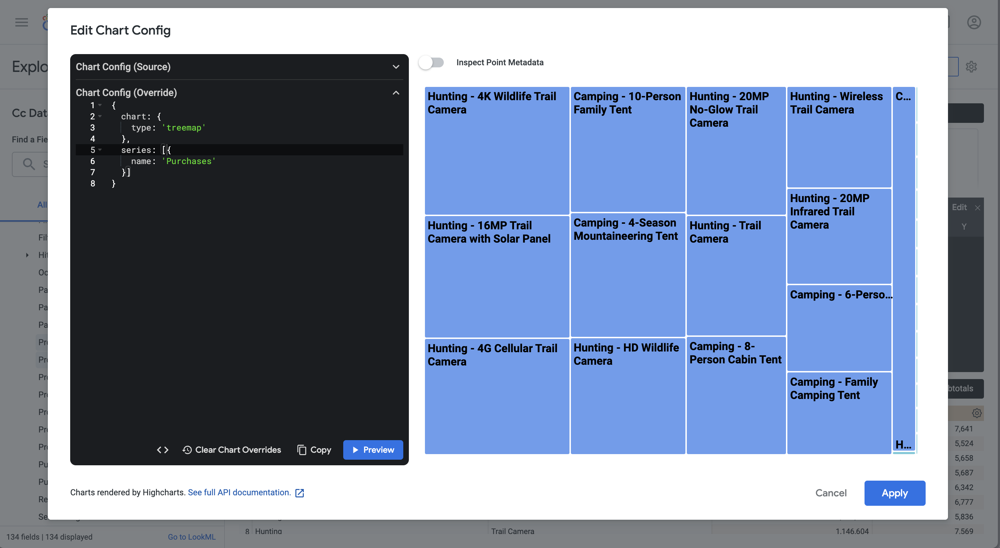

# Casos de uso de extensión de BI

Este artículo describe cómo realizar una serie de casos de uso (15) mediante la extensión de Customer Journey Analytics BI. En cada caso de uso se explica la funcionalidad de Customer Journey Analytics, seguida de detalles para cada una de las herramientas de BI admitidas:

* **Escritorio de Power BI**. La versión utilizada es 2.137.1102.0 de 64 bits (octubre de 2024).
* **Escritorio Tableau**. La versión utilizada es 2024.1.5 (20241.24.0705.0334) de 64 bits.
* **Buscador**. Versión en línea 25.0.23, disponible a través de [looker.com](https://looker.com)
* **Jupyter Notebook**. La versión utilizada es la 7.3.2.
* **EstudioRS**. La versión utilizada es 2024.12.0, compilación 467.

Los siguientes casos de uso están documentados:

* **Conectar**
   * [Conexión y lista de vistas de datos](bi-extension/connect-and-validate.md)

* **Informar y analizar**
   * [Tendencia diaria](bi-extension/daily-trend.md)
   * [Tendencia horaria](bi-extension/hourly-trend.md)
   * [Tendencia mensual](bi-extension/monthly-trend.md)
   * [Dimensión única clasificada](bi-extension/single-dimension-ranked.md)
   * [Clasificación de varias dimensiones](bi-extension/multiple-dimension-ranked.md)
   * [Contar valores de dimensión distintos](bi-extension/count-distinct-dimension-values.md)
   * [Usar nombres de intervalo de fechas para filtrar](bi-extension/use-date-range-names-to-filter.md)
   * [Usar nombres de segmento para segmentar](bi-extension/use-segment-names-to-segment.md)
   * [Uso de valores de dimensión para segmentar](bi-extension/use-dimension-values-to-segment.md)
   * [Ordenar](bi-extension/sort.md)
   * [Límites](bi-extension/limits.md)

* **Comprender**

   * [Transformaciones](bi-extension/transformations.md)
   * [Visualizaciones](bi-extension/visualizations.md)
   * [Advertencias](bi-extension/caveats.md)

El caso de uso **connect** se centra en cómo conectar herramientas de BI mediante la extensión de BI de Customer Journey Analytics.

Los casos de uso de **report and analysis** indican cómo realizar visualizaciones de Customer Journey Analytics similares en las herramientas de BI que se admiten actualmente.

Los casos de uso **entiendo** proporcionan más detalles sobre:

* Transformaciones que se producen cuando se utilizan las herramientas de un BI para informar y analizar.
* Similitudes y diferencias de visualización entre las herramientas de Customer Journey Analytics y BI.
* Advertencias de cada una de las herramientas de BI que debe tener en cuenta.

<!-- Now documented in separate articles

## Connect and validate

This use case sets up the connection from the BI tool to Customer Journey Analytics, lists the available data views, and selects a data view to use. 

+++ Customer Journey Analytics

The instructions refer to an example environment with the following objects:

* Data view: **[!UICONTROL C&C - Data View]** 🅐.
* Dimensions: **[!UICONTROL Product Name]** 🅑 and **[!UICONTROL Product Category]** 🅒.
* Metrics: **[!UICONTROL Purchase Revenue]** 🅓 and **[!UICONTROL Purchases]** 🅔.
* Filter: **[!UICONTROL Fishing Products]** 🅕.


When you go through the use cases, replace these example objects with objects that are appropriate for your specific environment.

+++

+++ BI tools

>[!BEGINTABS]

>[!TAB Power BI Desktop] 

1. Access the required credentials and parameters from the Experience Platform Query Service UI.

   1. Navigate to your Experience Platform sandbox.
   1. Select  **[!UICONTROL Queries]** from the left rail.
   1. Select **[!UICONTROL Credentials]** tab in the **[!UICONTROL Queries]** interface.
   1. Select `prod:cja` from the **[!UICONTROL Database]** drop-down menu.

      

1. Start Power BI Desktop.
   1. From the main interface, select **[!UICONTROL Get data from other sources]**.
   1. In the **[!UICONTROL Get Data]** dialog:
      
      1. Search for and select **[!UICONTROL PostgreSQL database]**.
      1. Select **[!UICONTROL Connect]**.
   1. In the **[!UICONTROL PostgreSQL database]** dialog:
      
      1. Use  to copy and paste the **[!UICONTROL Host]** and **[!UICONTROL Port]** values from the Experience Platform **[!UICONTROL Query]** **[!UICONTROL Expiring Credentials]** panel, separated by `:` as the value for **[!UICONTROL Server]**. For example: `examplecompany.platform-query.adobe.io:80`.
      1. Use  to copy and paste the **[!UICONTROL Database]** value from the Experience Platform **[!UICONTROL Query]** **[!UICONTROL Expiring Credentials]** panel. Add `?FLATTEN` to the value that you paste. For example, `prod:cja?FLATTEN`.
      1. Select **[!UICONTROL DirectQuery]** as the **[!UICONTROL Data connectivity mode]**.
      1. Select **[!UICONTROL OK]**.
   1. In the **[!UICONTROL PostgreSQL database]** - **[!UICONTROL Database]** dialog:
      
      1. Use  to copy the **[!UICONTROL Username]** and **[!UICONTROL Password]** values from the Experience Platform **[!UICONTROL Query]** **[!UICONTROL Expiring Credentials]** panel in the **[!UICONTROL User name]** and **[!UICONTROL Password]** fields. If you are using a [non-expiring credential](https://experienceleague.adobe.com/es/docs/experience-platform/query/ui/credentials?lang=en#use-credential-to-connect), use the password of your non-expiring credential.
      1. Ensure that the drop-down menu for **[!UICONTROL Select which level to apply these settings to]** is set to the **[!UICONTROL Server]** that you have defined earlier.
      1. Select **[!UICONTROL Connect]**.
   1. In the **[!UICONTROL Navigator]** dialog, the data views are retrieved. This retrieval can take some time. Once retrieved, you see the following in Power BI Desktop.
      
      1. Select **[!UICONTROL public.cc_data_view]** from the list in the left panel.
      1. You have two options:
         1. Select **[!UICONTROL Load]** to continue and finish the setup.
         1. Select **[!UICONTROL Transform Data]**. You see a dialog where you can optionally apply transformations as part of the configuration.
         
            * Select **[!UICONTROL Close & Apply]**.
   1. After a while, **[!UICONTROL public.cc_data_view]** is displayed in the **[!UICONTROL Data]** pane. Select  to show dimensions and metrics.
      


### To FLATTEN or not

Power BI Desktop supports the following scenarios for the `FLATTEN` parameter. See [Flatten nested data](https://experienceleague.adobe.com/es/docs/experience-platform/query/key-concepts/flatten-nested-data) for more information.

| FLATTEN parameter | Example | Supported | Remarks |
|---|---|:---:|---|
| None | `prod:cja` |  | |
| `?FLATTEN` | `prod:cja?FLATTEN` |  | **Recommended option to use!** |
| `%3FFLATTEN` | `prod:cja%3FFLATTEN` |  | Power BI Desktop displays error: **[!UICONTROL We couldn't authenticate with the credentials provided. Please try again.]** |

### More information

* [Prerequisites](/help/data-views/bi-extension.md#prerequisites)
* [Credentials guide](https://experienceleague.adobe.com/es/docs/experience-platform/query/ui/credentials)
* [Connect Power BI to Query Service](https://experienceleague.adobe.com/es/docs/experience-platform/query/clients/power-bi).


   

>[!TAB Tableau Desktop] 

1. Access the required credentials and parameters from the Experience Platform Query Service UI.

   1. Navigate to your Experience Platform sandbox.
   1. Select  **[!UICONTROL Queries]** from the left rail.
   1. Select **[!UICONTROL Credentials]** tab in the **[!UICONTROL Queries]** interface.
   1. Select `prod:cja` from the **[!UICONTROL Database]** drop-down menu.

      

1. Start Tableau.
   1. Select **[!UICONTROL PostgreSQL]** from the left rail underneath **[!UICONTROL To a Server]**. If not available, select **[!UICONTROL More...]** and select **[!UICONTROL PostgreSQL]** from the **[!UICONTROL Installed Connectors]**.
      
   1. In the **[!UICONTROL PostgreSQL]** dialog, in the **[!UICONTROL General]** tab:
      
      1. Use  to copy and paste the **[!UICONTROL Host]** from the Experience Platform **[!UICONTROL Query]** **[!UICONTROL Expiring Credentials]** panel to the **[!UICONTROL Server]**.
      1. Use  to copy and paste the **[!UICONTROL Port]** from the Experience Platform **[!UICONTROL Query]** **[!UICONTROL Expiring Credentials]** panel to the **[!UICONTROL Port]**.
      1. Use  to copy and paste the **[!UICONTROL Database]** from the Experience Platform **[!UICONTROL Query]** **[!UICONTROL Expiring Credentials]** panel to the **[!UICONTROL Database]**. Add `%3FFLATTEN` to the value that you paste. For example: `prod:cja%3FFLATTEN`.  
      1. Select **[!UICONTROL Username and Password]** from the **[!UICONTROL Authentication]** drop-down menu.
      1. Use  to copy and paste the **[!UICONTROL Username]** from the Experience Platform **[!UICONTROL Query]** **[!UICONTROL Expiring Credentials]** panel to the **[!UICONTROL Username]**.
      1. Use  to copy and paste the **[!UICONTROL Password]** from the Experience Platform **[!UICONTROL Query]** **[!UICONTROL Expiring Credentials]** panel to the **[!UICONTROL Password]**. If you are using a [non-expiring credential](https://experienceleague.adobe.com/es/docs/experience-platform/query/ui/credentials?lang=en#use-credential-to-connect), use the password of your non-expiring credential.
      1. Ensure that **[!UICONTROL Require SSL]** is checked.
      1. Select **[!UICONTROL Sign In]**.
      
      You see a **[!UICONTROL Progressing Request]** dialog while Tableau Desktop validates the connection.
   1. In the main window, you see in the **[!UICONTROL Data Source]** page, in the left pane:
      * The name of the connection, underneath **[!UICONTROL Connections]**.
      * The name of the database, underneath **[!UICONTROL Database]**.
      * A list of tables, underneath **[!UICONTROL Table]**.
      
      1. Drag the **[!UICONTROL cc_data_view]** entry and drop the entry on the main view that reads **[!UICONTROL Drag tables]** here.
   1. The main window displays details of the **[!UICONTROL cc_data_view]** data view.
      

### To FLATTEN or not

Tableau Desktop supports the following scenarios for the `FLATTEN` parameter. See [Flatten nested data](https://experienceleague.adobe.com/es/docs/experience-platform/query/key-concepts/flatten-nested-data) for more information.

| FLATTEN parameter | Example | Supported | Remarks |
|---|---|:---:|---|
| None | `prod:cja` |  | |
| `?FLATTEN` | `prod:cja?FLATTEN` |  | |
| `%3FFLATTEN` | `prod:cja%3FFLATTEN` |  | **Recommended option to use**. Note, `%3FFLATTEN` is URL-encoded version of `?FLATTEN`. |

### More information

* [Prerequisites](/help/data-views/bi-extension.md#prerequisites)
* [Credentials guide](https://experienceleague.adobe.com/es/docs/experience-platform/query/ui/credentials)
* [Connect Tableau Desktop to Query Service](https://experienceleague.adobe.com/es/docs/experience-platform/query/clients/tableau).


>[!TAB Looker] 

1. Access the required credentials and parameters from the Experience Platform Query Service UI.

   1. Navigate to your Experience Platform sandbox.
   1. Select  **[!UICONTROL Queries]** from the left rail.
   1. Select **[!UICONTROL Credentials]** tab in the **[!UICONTROL Queries]** interface.
   1. Select `prod:cja` from the **[!UICONTROL Database]** drop-down menu.

      

1. Log in to Looker

   1. Select **[!UICONTROL Admin]** from the left rail.
   1. Select **[!UICONTROL Connections]**.
   1. Select **[!UICONTROL Add Connection]**.
   1. In the **[!UICONTROL Connect your database to Looker screen]**.

      

      1. Enter a **[!UICONTROL Name]** for your connection, for example `Example Looker Connection`.
      1. Ensure **[!UICONTROL All Projects]** is selected as the **[!UICONTROL Connection Scope]**.
      1. Select **[!UICONTROL PostgreSQL 9.5+]** as the Dialect.
      1. Use  to copy and paste the **[!UICONTROL Host]** value from the Experience Platform **[!UICONTROL Query]** **[!UICONTROL Expiring Credentials]** panel, as the value for **[!UICONTROL Host]**. For example: `examplecompany.platform-query.adobe.io`.
      1. Use  to copy and paste the **[!UICONTROL Port]** value from the Experience Platform **[!UICONTROL Query]** **[!UICONTROL Expiring Credentials]** panel, as the value for **[!UICONTROL Port]**. For example: `80`.
      1. Use  to copy and paste the **[!UICONTROL Database]** value from the Experience Platform **[!UICONTROL Query]** **[!UICONTROL Expiring Credentials]** panel as the value for **[!UICONTROL Database]**. Add `%3FFLATTEN` to the value that you paste. For example, `prod:cja%3FFLATTEN`.
      1. Use  to copy and paste the **[!UICONTROL Username]** value from the Experience Platform **[!UICONTROL Query]** **[!UICONTROL Expiring Credentials]** panel as the value for **[!UICONTROL Username]**.
      1. Use  to copy and paste the **[!UICONTROL Password]** value from the Experience Platform **[!UICONTROL Query]** **[!UICONTROL Expiring Credentials]** panel as the value for **[!UICONTROL Password]**.
      1. Select **[!UICONTROL Expand all]** at **[!UICONTROL Optional Settings]**.
      1. Set **[!UICONTROL Max connections]** per node to `5`.
      1. Ensure **[!UICONTROL SSL]** is enabled.
      1. Select **[!UICONTROL Test]** to test the connection. You should see a banner appear at the top of the screen with a message like **[!UICONTROL Success, can connect JDBC ....]**.
      1. Select **[!UICONTROL Connect]** to establish and save the connection.
   1. You see the new connection in the **[!UICONTROL Connections]** interface.
   1. Select **←** from **[!UICONTROL Admin]** to go to main navigation in the left rail.
   1. Select **[!UICONTROL Develop]**.
   1. Select **[!UICONTROL Projects]**.
   1. Select **[!UICONTROL New Model]** in LookML Projects.
   1. To ensure you do not affect other users. select Enter Development Mode, when prompted.
   1. In the **[!UICONTROL Create Model]** experience:
      1. In **[!UICONTROL ➊ Select Database Connection]**:
         1. Select your database connection in **[!UICONTROL Select database connection]**. For example: **[!UICONTROL example_looker_connection]**.
         1. Name your project in **[!UICONTROL Create a new LookML Project for this model]**. For `example: example_looker_project`.
         1. Select **[!UICONTROL Next]**.
      1. In **[!UICONTROL ➋ Select Tables]**:
         1. Select **[!UICONTROL public]** and then ensure your Customer Journey Analytics data view is selected. For example:  **[!UICONTROL cc_data_view]**.
         1. Select **[!UICONTROL Next]**.
      1. In **[!UICONTROL ➌ Select Primary Keys]**:
         1. Select **[!UICONTROL Next]**.
      1. In **[!UICONTROL ➍ Select Explores to Create]**:
         1. Ensure you select your view. For example: **[!UICONTROL cc_data_view.view]**. 
         1. Select **[!UICONTROL Next]**.
      1. In **[!UICONTROL ➎ Enter Model Name]**:
         1. Name your model. For example: `example_looker_model`.
      1. Select **[!UICONTROL Complete and Explore Data]**.
   
   You are redirected to the **[!UICONTROL Explore]** interface of Looker, ready to explore the data.
   
      

### To FLATTEN or not

Looker supports the following scenarios for the `FLATTEN` parameter. See [Flatten nested data](https://experienceleague.adobe.com/es/docs/experience-platform/query/key-concepts/flatten-nested-data) for more information.

| FLATTEN parameter | Example | Supported | Remarks |
|---|---|:---:|---|
| None | `prod:cja` |  | |
| `?FLATTEN` | `prod:cja?FLATTEN` |  | |
| `%3FFLATTEN` | `prod:cja%3FFLATTEN` |  | **Recommended option to use**. Note, `%3FFLATTEN` is URL-encoded version of `?FLATTEN`. |

### More information

* [Prerequisites](/help/data-views/bi-extension.md#prerequisites)
* [Credentials guide](https://experienceleague.adobe.com/es/docs/experience-platform/query/ui/credentials)


>[!TAB Jupyter Notebook]

1. Access the required credentials and parameters from the Experience Platform Query Service UI.

   1. Navigate to your Experience Platform sandbox.
   1. Select  **[!UICONTROL Queries]** from the left rail.
   1. Select **[!UICONTROL Credentials]** tab in the **[!UICONTROL Queries]** interface.
   1. Select `prod:cja` from the **[!UICONTROL Database]** drop-down menu.

      

1. Ensure you have set up a dedicated Python virtual environment for running your Jupyter Notebook environment.
1. Ensure you have installed the required libraries in your virtual environment:
   * ipython-sql: `pip install ipython-sql`.
   * psycopg2-binary: `pip install psycopg-binary`.
   * sqlalchemy: pip `install sqlalchemy`.

1. Start Jupyter Notebook from your virtual environment: `jupyter notebook`.
1. Create a new notebook, or download [this sample notebook](assets/BI-Extension.ipynb.zip).
1. In your first cell, enter and execute:
   
   ```
   %config SqlMagic.style = '_DEPRECATED_DEFAULT'
   ```

1. In a new cell, enter the config parameters for your connection. Use  to copy and paste values from the Experience Platform **[!UICONTROL Query]** **[!UICONTROL Expiring Credentials]** panel to the values required for the config parameters. For example:

   ```
   import ipywidgets as widgets
   from IPython.display import display

   config_host = widgets.Text(description='Host:', value='example.platform-query-stage.adobe.io',
                           layout=widgets.Layout(width="600px"))
   display(config_host)
   config_port = widgets.IntText(description='Port:', value=80,
                              layout=widgets.Layout(width="200px"))
   display(config_port)
   config_db = widgets.Text(description='Database:', value='prod:cja',
                         layout=widgets.Layout(width="300px"))
   display(config_db)
   config_username = widgets.Text(description='Username:', value='EC582F955C8A79F70A49420E@AdobeOrg',
                               layout=widgets.Layout(width="600px"))
   display(config_username)
   config_password = widgets.Password(description='Password:', value='***',
                                   layout=widgets.Layout(width="600px"))
   display(config_password)
   ```

1. Execute the cell.
1. Use  to copy and paste the password from the Experience Platform **[!UICONTROL Query]** **[!UICONTROL Expiring Credentials]** panel to the **[!UICONTROL Password]** field in Jupyter Notebook.

   

1. In a new cell, enter the statements to load the SQL extension, the required library and connect with Customer Journey Analytics.

   ```python
   %load_ext sql
   from sqlalchemy import create_engine
   %sql postgresql://{config_username.value}:{config_password.value}@{config_host.value}:{config_port.value}/{config_db.value}?sslmode=require
   ```

   Execute the shell. You should see no output but the cell should execute without any warning.

   

1. In a new call, enter the statements to get a list of available data views based on the connection.

   ```python
   %%sql
   SELECT n.nspname as "Schema",
      c.relname as "Name",
      CASE c.relkind WHEN 'r' THEN 'table' WHEN 'v' THEN 'view' WHEN 'm' THEN 'materialized view' WHEN 'i' THEN 'index' WHEN 'S' THEN 'sequence' WHEN 's' THEN 'special' WHEN 't' THEN 'TOAST table' WHEN 'f' THEN 'foreign table' WHEN 'p' THEN 'partitioned table' WHEN 'I' THEN 'partitioned index' END as "Type",
      pg_catalog.pg_get_userbyid(c.relowner) as "Owner"
   FROM pg_catalog.pg_class c
   LEFT JOIN pg_catalog.pg_namespace n ON n.oid = c.relnamespace
   WHERE c.relkind IN ('v','')
      AND n.nspname <> 'pg_catalog'
      AND n.nspname !~ '^pg_toast'
      AND n.nspname <> 'information_schema'
      AND pg_catalog.pg_table_is_visible(c.oid)
      AND c.relname NOT LIKE '%test%'
      AND c.relname NOT LIKE '%ajo%'
   ORDER BY 1,2;
   ```

   Execute the shell. You should see output simular to the screenshot below.

   

   You should see the **[!UICONTROL cc_data_view]** in the list of data views.

### To FLATTEN or not

Jupyter Notebook supports the following scenarios for the `FLATTEN` parameter. See [Flatten nested data](https://experienceleague.adobe.com/es/docs/experience-platform/query/key-concepts/flatten-nested-data) for more information.

| FLATTEN parameter | Example | Supported | Remarks |
|---|---|:---:|---|
| None | `prod:cja` |  | |
| `?FLATTEN` | `prod:cja?FLATTEN` |  | |
| `%3FFLATTEN` | `prod:cja%3FFLATTEN` |  | **Recommended option to use**. Note, `%3FFLATTEN` is URL-encoded version of `?FLATTEN`. |

### More information

* [Prerequisites](/help/data-views/bi-extension.md#prerequisites)
* [Credentials guide](https://experienceleague.adobe.com/es/docs/experience-platform/query/ui/credentials)

>[!TAB RStudio]

1. Access the required credentials and parameters from the Experience Platform Query Service UI.

   1. Navigate to your Experience Platform sandbox.
   1. Select  **[!UICONTROL Queries]** from the left rail.
   1. Select **[!UICONTROL Credentials]** tab in the **[!UICONTROL Queries]** interface.
   1. Select `prod:cja` from the **[!UICONTROL Database]** drop-down menu.

      

1. Start RStudio.
1. Create a new R Markdown file, or download [this example R markdown file](assets/BI-Extension.Rmd.zip).
1. In your first chunk, enter the following statements between ` ```{r} ` and ` ``` `. Use  to copy and paste values from the Experience Platform **[!UICONTROL Query]** **[!UICONTROL Expiring Credentials]** panel to the values required for the various parameters, like `host`, `dbname`, and `user`. For example:
   
   ```R
   library(rstudioapi)
   library(DBI)
   library(dplyr)
   library(tidyr)
   library(RPostgres)
   library(ggplot2)

   host <- rstudioapi::showPrompt(title = "Host", message = "Host", default = "orangestagingco.platform-query-stage.adobe.io")
   dbname <- rstudioapi::showPrompt(title = "Database", message = "Database", default = "prod:cja?FLATTEN")
   user <- rstudioapi::showPrompt(title = "Username", message = "Username", default = "EC582F955C8A79F70A49420E@AdobeOrg")
   password <- rstudioapi::askForPassword(prompt = "Password")
   ```

1. Run the chunk. You are prompted for **[!UICONTROL Host]**, **[!UICONTROL Database]**, and **[!UICONTROL User]**. Simply accept the values you have provided as part of the previous step. 
1. Use  to copy and paste the password from the Experience Platform **[!UICONTROL Query]** **[!UICONTROL Expiring Credentials]** panel to the **[!UICONTROL Password]** dialog prompt in RStudio.

   

1. Create a new chunk and enter the following statements between ` ``` {r} ` and ` ``` `.

   ```R
   con <- dbConnect(
      RPostgres::Postgres(),
      host = host,
      port = 80,
      dbname = dbname,
      user = user,
      password = password,
      sslmode = 'require'
   )
   ```

1. Run the chunk. You should see no output if the connection is successful.


1. Create a new chunk and enter the following statements between ` ``` {r} ` and ` ``` `.

   ```R
   views <- dbListTables(con)
   print(views)
   ```

1. Run the chunk. You should see `character(0)` as the only output.


1. Create a new chunk and enter the following statements between ` ``` {r} ` and ` ``` `.

   ```R
   glimpse(dv)
   ```

1. Run the chunk. You should see output simular to the screenshot below.

   

### To FLATTEN or not

RStudio supports the following scenarios for the `FLATTEN` parameter. See [Flatten nested data](https://experienceleague.adobe.com/es/docs/experience-platform/query/key-concepts/flatten-nested-data) for more information.

| FLATTEN parameter | Example | Supported | Remarks |
|---|---|:---:|---|
| None | `prod:cja` |  | |
| `?FLATTEN` | `prod:cja?FLATTEN` |  |  **Recommended option to use**. |
| `%3FFLATTEN` | `prod:cja%3FFLATTEN` |  | |

### More information

* [Prerequisites](/help/data-views/bi-extension.md#prerequisites)
* [Credentials guide](https://experienceleague.adobe.com/es/docs/experience-platform/query/ui/credentials)

>[!ENDTABS]

+++


## Daily trend

In this use case, you want to display a table and simple line visualization that shows a daily trend of occurrences (events) from January 1, 2023 up until January 31, 2023.

+++ Customer Journey Analytics

An example **[!UICONTROL Daily Trend]** panel for the use case:


+++

+++ BI tools

>[!PREREQUISITES]
>
>Ensure you have validated a [successful connection and can list and use data views](#connect-and-validate) for the BI tool for which you want to try out this use case. 
>

>[!BEGINTABS]

>[!TAB Power BI Desktop] 

1. In the **[!UICONTROL Data]** pane:
   1. Select **[!UICONTROL daterangeday]**.
   1. Select **[!UICONTROL sum occurrences]**.
   
   You see a table displaying the occurrences for the current month. For better visibility, enlarge the visualization.

1. In the **[!UICONTROL Filters]** pane:

   1. Select the **[!UICONTROL daterangeday is (All)]** from **[!UICONTROL Filters on this visual]**.
   1. Select **[!UICONTROL Advanced filtering]** as the **[!UICONTROL Filter type]**.
   1. Define the filter to **[!UICONTROL Show items when the value]** **[!UICONTROL is on or after]** `1/1/2023` **[!UICONTROL And]** **[!UICONTROL is before]** `2/1/2023.` You can use the calendar icon to pick and select dates.
   1. Select **[!UICONTROL Apply filter]**.
   
   You see the table updated with the applied **[!UICONTROL daterangeday]** filter.

1. In the **[!UICONTROL Visualizations]** pane, select the **[!UICONTROL Line chart]** visualization.

   A line chart visualization replaces the table while using the same data as the table. Your Power BI Desktop should look like below.

   

1. On the Line chart visualization:

   1. Select .
   1. From the context menu, select **[!UICONTROL Show as a table]**.

   The main view is updated to show both a line visualization and a table. Your Power BI Desktop should look like below.

   

>[!TAB Tableau Desktop] 

1. Select the **[!UICONTROL Sheet 1]** tab at the bottom to switch from the **[!UICONTROL Data source]** view. In the **[!UICONTROL Sheet 1]** view:
   1. Drag the **[!UICONTROL Daterange]** entry from the **[!UICONTROL Tables]** list in the **[!UICONTROL Data]** pane and drop the entry onto the **[!UICONTROL Filters]** shelf.
   1. In the **[!UICONTROL Filters Field \[Daterange\]]** dialog, select **[!UICONTROL Range of Dates]** and select **[!UICONTROL Next >]**.
   1. In the **[!UICONTROL Filter \[Daterange\]]** dialog, select **[!UICONTROL Range of dates]** and specify a period of `01/01/2023` - `01/02/2023`.

      

   1. Drag and drop **[!UICONTROL Daterangeday]** from the **[!UICONTROL Tables]** list in the **[!UICONTROL Data]** pane and drop the entry in the field next to **[!UICONTROL Columns]**.
      * Select **[!UICONTROL Day]** from the **[!UICONTROL Daterangeday]** drop-down menu, so that the value is updated to **[!UICONTROL DAY(Daterangeday)]**.
   1. Drag and drop **[!UICONTROL Occurrences]** from the **[!UICONTROL Tables (*Measure Names*)]** list in the **[!UICONTROL Data]** pane and drop the entry in the field next to **[!UICONTROL Rows]**. The value is automatically converted to **[!UICONTROL SUM(Occurrences)]**.
   1. Modify **[!UICONTROL Standard]** to **[!UICONTROL Entire View]** from the **[!UICONTROL Fit]** drop-down menu in the toolbar.

      Your Tableau Desktop should look like below.

      

1. Select **[!UICONTROL Duplicate]** from the **[!UICONTROL Sheet 1]** tab context menu to create a second sheet.
1. Select **[!UICONTROL Rename]** from the **[!UICONTROL Sheet 1]** tab context menu to rename the sheet to `Graph`.
1. Select **[!UICONTROL Rename]** from the **[!UICONTROL Sheet 1 (2)]** tab context menu to rename the sheet to `Data`.
1. Ensure that the **[!UICONTROL Data]** sheet is selected. In the **[!UICONTROL Data]** view:
   1. Select **[!UICONTROL Show me]** at the top right and select **[!UICONTROL Text table]** (upper left top visualization) to modify the content of the Data view to a table.
   1. Select **[!UICONTROL Swap Rows and Columns]** from the toolbar.
   1. Modify **[!UICONTROL Standard]** to **[!UICONTROL Entire View]** from the **[!UICONTROL Fit]** drop-down menu in the toolbar.

      Your Tableau Desktop should look like below.

      

1. Select the **[!UICONTROL New Dashboard]** tab button (at the bottom) to create a new **[!UICONTROL Dashboard 1]** view. In the **[!UICONTROL Dashboard 1]** view:
   1. Drag and drop the **[!UICONTROL Graph]** sheet from the **[!UICONTROL Sheets]** shelf onto the **[!UICONTROL Dashboard 1]** view that reads *Drop sheets here*.
   1. Drag and drop the **[!UICONTROL Data]** sheet from the **[!UICONTROL Sheets]** shelf below the **[!UICONTROL Graph]** sheet onto the **[!UICONTROL Dashboard 1]** view.
   1. Select the **[!UICONTROL Data]** sheet in the view and modify **[!UICONTROL Entire View]** to **[!UICONTROL Fix Width]**.

      Your Tableau Desktop should look like below.

      


>[!TAB Looker]

1. In the **[!UICONTROL Explore]** interface of Looker, ensure you do have a clean setup. If not, select  **[!UICONTROL Remove fields and filters]**.
1. Select **[!UICONTROL + Filter]** underneath **[!UICONTROL Filters]**.
1. In the **[!UICONTROL Add Filter]** dialog:
   1. Select **[!UICONTROL ‣ Cc Data View]**
   1. From the list of fields, select **[!UICONTROL ‣ Daterange Date]** then **[!UICONTROL Daterange Date]**.
      
1. Specify the **[!UICONTROL Cc Data View Daterange Date]** filter as **[!UICONTROL is in range]** **[!UICONTROL 2023/01/01]** **[!UICONTROL until (before)]** **[!UICONTROL 2023/02/01]**.
1. From the **[!UICONTROL Cc Data View]** section in the left rail, 
   1. Select **[!UICONTROL ‣ Daterange Date]**, then **[!UICONTROL Date]** from the list of **[!UICONTROL DIMENSIONS]**.
   1. Select **[!UICONTROL Count]** underneath **[!UICONTROL MEASURES]** in the left rail (at the bottom).
1. Select **[!UICONTROL Run]**.
1. Select **[!UICONTROL ‣ Visualization]** to display the line visualization.

You should see a visualization and table similar as shown below.


>[!TAB Jupyter Notebook]

1. Enter the following statements in a new cell.

   ```python
   import seaborn as sns
   import matplotlib.pyplot as plt
   data = %sql SELECT daterangeday AS Date, COUNT(*) AS Events \
             FROM cc_data_view \
             WHERE daterange BETWEEN '2023-01-01' AND '2023-02-01' \
             GROUP BY 1 \
             ORDER BY Date ASC
   df = data.DataFrame()
   df = df.groupby('Date', as_index=False).sum()
   plt.figure(figsize=(15, 3))
   sns.lineplot(x='Date', y='Events', data=df)
   plt.show()
   display(data)
   ```

1. Execute the cell. You should see output similar to the screenshot below.

   


>[!TAB RStudio]

1. Enter the following statements between ` ```{r} ` and ` ``` ` in a new chunk.

   ```R
   ## Daily Events
   df <- dv %>%
      filter(daterange >= "2023-01-01" & daterange < "2023-02-01") %>%
      group_by(daterangeday) %>%
      count() %>%
      arrange(daterangeday, .by_group = FALSE)
   ggplot(df, aes(x = daterangeday, y = n)) +
      geom_line(color = "#69b3a2") +
      ylab("Events") +
      xlab("Date")
   print(df)
   ```

1. Run the chunk. You should see output similar to the screenshot below.

   

>[!ENDTABS]

+++


## Hourly trend

In this use case, you want to display a table and simple line visualization that shows an hourly trend of occurrences(events) for January 1, 2023.

+++ Customer Journey Analytics

An example **[!UICONTROL Hourly Trend]** panel for the use case:


+++

+++ BI tools

>[!PREREQUISITES]
>
>Ensure you have validated [a successful connection, can list data views, and use a data view](#connect-and-validate) for the BI tool for which you want to try out this use case. 
>

>[!BEGINTABS]

>[!TAB Power BI Desktop] 

 Power BI does **not** understand how to handle date-time fields, so dimensions like **[!UICONTROL daterangehour]** and **[!UICONTROL daterangeminute]** are not supported.

>[!TAB Tableau Desktop] 

1. Select the **[!UICONTROL Sheet 1]** tab at the bottom to switch from **[!UICONTROL Data source]**. In the **[!UICONTROL Sheet 1]** view:
   1. Drag the **[!UICONTROL Daterange]** entry from the **[!UICONTROL Tables]** list in the **[!UICONTROL Data]** pane and drop the entry onto the **[!UICONTROL Filters]** shelf.
   1. In the **[!UICONTROL Filters Field \[Daterange\]]** dialog, select **[!UICONTROL Range of Dates]** and select **[!UICONTROL Next >]**.
   1. In the **[!UICONTROL Filter \[Daterange\]]** dialog, select **[!UICONTROL Range of dates]** and specify a period of `01/01/2023` - `02/01/2023`.

      

   1. Drag and drop **[!UICONTROL Daterangehour]** from the **[!UICONTROL Tables]** list in the **[!UICONTROL Data]** pane and drop the entry in the field next to **[!UICONTROL Columns]**.
      * Select **[!UICONTROL More]** > **[!UICONTROL Hours]** from the **[!UICONTROL Daterangeday]** drop-down menu, so that the value is updated to **[!UICONTROL HOUR(Daterangeday)]**.
   1. Drag and drop **[!UICONTROL Occurrences]** from the **[!UICONTROL Tables (*Measure Names*)]** list in the **[!UICONTROL Data]** pane and drop the entry in the field next to **[!UICONTROL Rows]**. The value is automatically converted to **[!UICONTROL SUM(Occurrences)]**.
   1. Modify **[!UICONTROL Standard]** to **[!UICONTROL Entire View]** from the **[!UICONTROL Fit]** drop-down menu in the toolbar.

      Your Tableau Desktop should look like below.

      

1. Select **[!UICONTROL Duplicate]** from the **[!UICONTROL Sheet 1]** tab context menu to create a second sheet.
1. Select **[!UICONTROL Rename]** from the **[!UICONTROL Sheet 1]** tab context menu to rename the sheet to `Graph`.
1. Select **[!UICONTROL Rename]** from the **[!UICONTROL Sheet 1 (2)]** tab context menu to rename the sheet to `Data`.
1. Ensure that the **[!UICONTROL Data]** sheet is selected. In the **[!UICONTROL Data]** view:
   1. Select **[!UICONTROL Show me]** at the top right and select **[!UICONTROL Text table]** (upper left top visualization) to modify the content of the Data view to a table.
   1. Drag **[!UICONTROL HOUR(Daterangeday)]** from **[!UICONTROL Columns]** to **[!UICONTROL Rows]**.
   1. Modify **[!UICONTROL Standard]** to **[!UICONTROL Entire View]** from the **[!UICONTROL Fit]** drop-down menu in the toolbar.

      Your Tableau Desktop should look like below.

      

1. Select **[!UICONTROL New Dashboard]** tab button (at the bottom) to create a new **[!UICONTROL Dashboard 1]** view. In the **[!UICONTROL Dashboard 1]** view:
   1. Drag and drop the **[!UICONTROL Graph]** sheet from the **[!UICONTROL Sheets]** shelf onto the **[!UICONTROL Dashboard 1]** view that reads *Drop sheets here*.
   1. Drag and drop the **[!UICONTROL Data]** sheet from the **[!UICONTROL Sheets]** shelf below the **[!UICONTROL Graph]** sheet onto the **[!UICONTROL Dashboard 1]** view.
   1. Select the **[!UICONTROL Data]** sheet in the view and modify **[!UICONTROL Entire View]** to **[!UICONTROL Fix Width]**.

      Your **[!UICONTROL Dashboard 1]** view should look like below.

      


>[!TAB Looker]


1. In the **[!UICONTROL Explore]** interface of Looker, ensure you do have a clean setup. If not, select  **[!UICONTROL Remove fields and filters]**.
1. Select **[!UICONTROL + Filter]** underneath **[!UICONTROL Filters]**.
1. In the **[!UICONTROL Add Filter]** dialog:
   1. Select **[!UICONTROL ‣ Cc Data View]**
   1. From the list of fields, select **[!UICONTROL ‣ Daterange Date]** then **[!UICONTROL Daterange Date]**.
      
1. Specify the **[!UICONTROL Cc Data View Daterange Date]** filter as **[!UICONTROL is in range]** **[!UICONTROL 2023/01/01]** **[!UICONTROL until (before)]** **[!UICONTROL 2023/01/02]**.
1. From the **[!UICONTROL Cc Data View]** section in the left rail, 
   1. Select **[!UICONTROL ‣ Daterangehour Date]**, then **[!UICONTROL Time]** from the list of **[!UICONTROL DIMENSIONS]**.
   1. Select **[!UICONTROL Count]** underneath **[!UICONTROL MEASURES]** in the left rail (at the bottom).
1. Select **[!UICONTROL Run]**.
1. Select **[!UICONTROL ‣ Visualization]** to display the line visualization.

You should see a visualization and table similar as shown below.


>[!TAB Jupyter Notebook]

1. Enter the following statements in a new cell.

   ```python
   import seaborn as sns
   import matplotlib.pyplot as plt
   data = %sql SELECT daterangehour AS Hour, COUNT(*) AS Events \
               FROM cc_data_view \
               WHERE daterange BETWEEN '2023-01-01' AND '2023-01-02' \
               GROUP BY 1 \
                ORDER BY Hour ASC
   df = data.DataFrame()
   df = df.groupby('Hour', as_index=False).sum()
   plt.figure(figsize=(15, 3))
   sns.lineplot(x='Hour', y='Events', data=df)
   plt.show()
   display(data)
   ```

1. Execute the cell. You should see output similar to the screenshot below.

   


>[!TAB RStudio]

1. Enter the following statements between ` ```{r} ` and ` ``` ` in a new chunk.

   ```R
   ## Hourly Events
   df <- dv %>%
      filter(daterange >= "2023-01-01" & daterange < "2023-01-02") %>%
      group_by(daterangehour) %>%
      count() %>%
      arrange(daterangehour, .by_group = FALSE)
   ggplot(df, aes(x = daterangehour, y = n)) +
      geom_line(color = "#69b3a2") +
      ylab("Events") +
      xlab("Hour")
   print(df)
   ```

1. Run the chunk. You should see output similar to the screenshot below.

   

>[!ENDTABS]

+++


## Monthly trend

In this use case, you want to display a table and simple line visualization that shows a monthly trend of occurrence (events) for 2023.

+++ Customer Journey Analytics

An example **[!UICONTROL Monthly Trend]** panel for the use case:


+++

+++ BI tools

>[!PREREQUISITES]
>
>Ensure you have validated [a successful connection, can list data views, and use a data view](#connect-and-validate) for the BI tool for which you want to try out this use case. 
>

>[!BEGINTABS]

>[!TAB Power BI Desktop] 

1. In the **[!UICONTROL Data]** pane:
   1. Select **[!UICONTROL daterangemonth]**.
   1. Select **[!UICONTROL sum occurrences]**.
   
   You see a table displaying the occurrences for the current month. For better visibility, enlarge the visualization.

1. In the **[!UICONTROL Filters]** pane:

   1. Select the **[!UICONTROL daterangemonth is (All)]** from **[!UICONTROL Filters on this visual]**.
   1. Select **[!UICONTROL Advanced filtering]** as the **[!UICONTROL Filter type]**.
   1. Define the filter to **[!UICONTROL Show items when the value]** **[!UICONTROL is on or after]** `1/1/2023` **[!UICONTROL And]** **[!UICONTROL is before]** `1/1/2024.` You can use the calendar icon to pick and select dates.
   1. Select **[!UICONTROL Apply filter]**.
   
   You see the table updated with the applied **[!UICONTROL daterangemonth]** filter.

1. In the **[!UICONTROL Visualizations]** pane:

   1. Select the **[!UICONTROL Line chart]** visualization.

   A line chart visualization replaces the table while using the same data as the table. Your Power BI Desktop should look like below.

   

1. On the Line chart visualization:

   1. Select .
   1. From the context menu, select **[!UICONTROL Show as a table]**.

   The main view is updated to show both a line visualization and a table. Your Power BI Desktop should look like below.

   

>[!TAB Tableau Desktop] 

1. Select the **[!UICONTROL Sheet 1]** tab at the bottom to switch from **[!UICONTROL Data source]**. In the **[!UICONTROL Sheet 1]** view:
   1. Drag the **[!UICONTROL Daterange]** entry from the **[!UICONTROL Tables]** list in the **[!UICONTROL Data]** pane and drop the entry onto the **[!UICONTROL Filters]** shelf.
   1. In the **[!UICONTROL Filters Field \[Daterange\]]** dialog, select **[!UICONTROL Range of Dates]** and select **[!UICONTROL Next >]**.
   1. In the **[!UICONTROL Filter \[Daterange\]]** dialog, select **[!UICONTROL Range of dates]** and specify a period of `01/01/2023` - `01/01/2024`.

      

   1. Drag and drop **[!UICONTROL Daterangeday]** from the **[!UICONTROL Tables]** list in the **[!UICONTROL Data]** pane and drop the entry in the field next to **[!UICONTROL Columns]**.
      * Select **[!UICONTROL MONTH]** from the **[!UICONTROL Daterangeday]** drop-down menu, so that the value is updated to **[!UICONTROL MONTH(Daterangeday)]**.
   1. Drag and drop **[!UICONTROL Occurrences]** from the **[!UICONTROL Tables (*Measure Names*)]** list in the **[!UICONTROL Data]** pane and drop the entry in the field next to **[!UICONTROL Rows]**. The value is automatically converted to **[!UICONTROL SUM(Occurrences)]**.
   1. Modify **[!UICONTROL Standard]** to **[!UICONTROL Entire View]** from the **[!UICONTROL Fit]** drop-down menu in the toolbar.

      Your Tableau Desktop should look like below.

      

1. Select **[!UICONTROL Duplicate]** from the **[!UICONTROL Sheet 1]** tab context menu to create a second sheet.
1. Select **[!UICONTROL Rename]** from the **[!UICONTROL Sheet 1]** tab context menu to rename the sheet to `Graph`.
1. Select **[!UICONTROL Rename]** from the **[!UICONTROL Sheet 1 (2)]** tab context menu to rename the sheet to `Data`.
1. Ensure that the **[!UICONTROL Data]** sheet is selected. In the Data view:
   1. Select **[!UICONTROL Show me]** at the top right and select **[!UICONTROL Text table]** (upper left top visualization) to modify the content of the Data view to a table.
   1. Drag **[!UICONTROL MONTH(Daterangeday)]** from **[!UICONTROL Columns]** to **[!UICONTROL Rows]**.
   1. Modify **[!UICONTROL Standard]** to **[!UICONTROL Entire View]** from the **[!UICONTROL Fit]** drop-down menu in the toolbar.

      Your Tableau Desktop should look like below.

      

1. Select **[!UICONTROL New Dashboard]** tab button (at the bottom) to create a new **[!UICONTROL Dashboard 1]** view. In the **[!UICONTROL Dashboard 1]** view:
   1. Drag and drop the **[!UICONTROL Graph]** sheet from the **[!UICONTROL Sheets]** shelf onto the **[!UICONTROL Dashboard 1]** view that reads *Drop sheets here*.
   1. Drag and drop the **[!UICONTROL Data]** sheet from the **[!UICONTROL Sheets]** shelf below the **[!UICONTROL Graph]** sheet onto the **[!UICONTROL Dashboard 1]** view.
   1. Select the **[!UICONTROL Data]** sheet in the view and modify **[!UICONTROL Entire View]** to **[!UICONTROL Fix Width]**.

      Your Tableau Desktop should look like below.

      


>[!TAB Looker]

1. In the **[!UICONTROL Explore]** interface of Looker, ensure you do have a clean setup. If not, select  **[!UICONTROL Remove fields and filters]**.
1. Select **[!UICONTROL + Filter]** underneath **[!UICONTROL Filters]**.
1. In the **[!UICONTROL Add Filter]** dialog:
   1. Select **[!UICONTROL ‣ Cc Data View]**
   1. From the list of fields, select **[!UICONTROL ‣ Daterange Date]** then **[!UICONTROL Daterange Date]**.
      
1. Specify the **[!UICONTROL Cc Data View Daterange Date]** filter as **[!UICONTROL is in range]** **[!UICONTROL 2023/01/01]** **[!UICONTROL until (before)]** **[!UICONTROL 2024/01/01]**.
1. From the left **[!UICONTROL Cc Data View]** rail, 
   1. Select **[!UICONTROL ‣ Daterangemonth Date]**, then **[!UICONTROL Month]** from the list of **[!UICONTROL DIMENSIONS]**.
   1. Select **[!UICONTROL Count]** underneath **[!UICONTROL MEASURES]** in the left rail (at the bottom).
1. Select **[!UICONTROL Run]**.
1. Select **[!UICONTROL ‣ Visualization]** to display the line visualization.

You should see a visualization and table similar as shown below.


>[!TAB Jupyter Notebook]

1. Enter the following statements in a new cell.

   ```python
   import seaborn as sns
   import matplotlib.pyplot as plt
   data = %sql SELECT daterangemonth AS Month, COUNT(*) AS Events \
               FROM cc_data_view \
               WHERE daterange BETWEEN '2023-01-01' AND '2024-01-01' \
               GROUP BY 1 \
               ORDER BY Month ASC
   df = data.DataFrame()
   df = df.groupby('Month', as_index=False).sum()
   plt.figure(figsize=(15, 3))
   sns.lineplot(x='Month', y='Events', data=df)
   plt.show()
   display(data)
   ```

1. Execute the cell. You should see output similar to the screenshot below.

   


>[!TAB RStudio]

1. Enter the following statements between ` ```{r} ` and ` ``` ` in a new chunk.

   ```R
   ## Hourly Events
   df <- dv %>%
      filter(daterange >= "2023-01-01" & daterange < "2023-01-02") %>%
      group_by(daterangehour) %>%
      count() %>%
      arrange(daterangehour, .by_group = FALSE)
   ggplot(df, aes(x = daterangehour, y = n)) +
      geom_line(color = "#69b3a2") +
      ylab("Events") +
      xlab("Hour")
   print(df)
   ```

1. Run the chunk. You should see output similar to the screenshot below.

   

>[!ENDTABS]

+++


## Single dimension ranked

In this use case, you want to display a table and simple bar visualization that shows the purchases and purchases revenue for product names over 2023.

+++ Customer Journey Analytics

An example **[!UICONTROL Single Dimension Ranked]** panel for the use case:


+++

+++ BI tools

>[!PREREQUISITES]
>
>Ensure you have validated [a successful connection, can list data views, and use a data view](#connect-and-validate) for the BI tool for which you want to try out this use case. 
>

>[!BEGINTABS]

>[!TAB Power BI Desktop] 

1. In the **[!UICONTROL Data]** pane:
   1. Select **[!UICONTROL daterange]**.
   1. Select **[!UICONTROL product_name]**.
   1. Select **[!UICONTROL sum purchase_revenue]**.
   1. Select **[!UICONTROL sum purchases]**.
   
   You see an empty table displaying only the column headers for the selected element. For better visibility, enlarge the visualization.

1. In the **[!UICONTROL Filters]** pane:

   1. Select the **[!UICONTROL daterange is (All)]** from **[!UICONTROL Filters on this visual]**.
   1. Select **[!UICONTROL Relative date]** as the **[!UICONTROL Filter type]**.
   1. Define the filter to **[!UICONTROL Show items when the value]** **[!UICONTROL is in the last]** `1` **[!UICONTROL calendar years]**.
   1. Select **[!UICONTROL Apply filter]**.
   
   You see the table updated with the applied **[!UICONTROL daterange]** filter.

1. In the **[!UICONTROL Visualization]** pane:

   1. Use  to remove **[!UICONTROL daterange]** from **[!UICONTROL Columns]**.
   1. Drag and drop **[!UICONTROL Sum of purchases_revenue]** underneath **[!UICONTROL Sum of purchases]** in **[!UICONTROL Columns]**.

1. On the Table visualization:
   
   1. Select **[!UICONTROL Sum of purchase_revenue]** to sort the product names in descending purchase revenue order. Your Power BI Desktop should look like below.
   
   

1. In the **[!UICONTROL Filters]** pane:

   1. Select **[!UICONTROL product_name is (All)]**.
   1. Set **[!UICONTROL Filter type]** to **[!UICONTROL Top N]**.
   1. Define the filter to **[!UICONTROL Show items]** **[!UICONTROL Top]** `10` **[!UICONTROL By value]**.
   1. Drag and drop **[!UICONTROL purchase_revenue]** into **[!UICONTROL By value]** **[!UICONTROL Add data fields here]**.
   1. Select **[!UICONTROL Apply filter]**.

   You see the table updated with values for purchase revenue in sync with the Freeform table visualization in Analysis Workspace.

1. In the **[!UICONTROL Visualizations]** pane:

   1. Select the **[!UICONTROL Line and stacked column chart]** visualization. 

   A line and stacked column chart visualization replaces the table while using the same data as the table.

1. Drag and drop **[!UICONTROL purchases]** onto **[!UICONTROL Line y-axis]** in the **[!UICONTROL Visualizations]** pane.

   The line and stacked column chart is updated. Your Power BI Desktop should look like below.

   

1. On the Line and stacked column chart visualization:

   1. Select .
   1. From the context menu, select **[!UICONTROL Show as a table]**.

   The main view is updated to show both a line visualization and a table.

   

>[!TAB Tableau Desktop]

1. Select the **[!UICONTROL Sheet 1]** tab at the bottom to switch from **[!UICONTROL Data source]**. In the **[!UICONTROL Sheet 1]** view:
   1. Drag the **[!UICONTROL Daterange]** entry from the **[!UICONTROL Tables]** list in the **[!UICONTROL Data]** pane and drop the entry onto the **[!UICONTROL Filters]** shelf.
   1. In the **[!UICONTROL Filters Field \[Daterange\]]** dialog, select **[!UICONTROL Range of Dates]** and select **[!UICONTROL Next >]**.
   1. In the **[!UICONTROL Filter \[Daterange\]]** dialog, select **[!UICONTROL Range of dates]** and specify a period of `01/01/2023` - `31/12/2023`. Select **[!UICONTROL Apply]** and **[!UICONTROL OK]**.

      

   1. Drag and drop **[!UICONTROL Product Name]** from the **[!UICONTROL Tables]** list in the **[!UICONTROL Data]** pane and drop the entry in the field next to **[!UICONTROL Rows]**.
   1. Drag and drop **[!UICONTROL Purchases]** from the **[!UICONTROL Tables (*Measure Names*)]** list in the **[!UICONTROL Data]** pane and drop the entry in the field next to **[!UICONTROL Rows]**. The value is automatically converted to **[!UICONTROL SUM(Purchases)]**.
   1. Drag and drop **[!UICONTROL Purchase Revenue]** from the **[!UICONTROL Tables (*Measure Names*)]** list in the **[!UICONTROL Data]** pane and drop the entry in the field next to **[!UICONTROL Columns]** and left from **[!UICONTROL SUM(Purchases)]**. The value is automatically converted to **[!UICONTROL SUM(Purchase Revenue)]**.
   1. To order both charts in descending purchase revenue order, hover over the **[!UICONTROL Purchase Revenue]** title and select the sort icon.
   1. To limit the number of entries in the charts, select **[!UICONTROL SUM(Purchase Revenue)]** in **[!UICONTROL Rows]** and from the drop-down menu select **[!UICONTROL Filter]**.
   1. In the **[!UICONTROL Filter \[Purchase Revenue\]]** dialog select **[!UICONTROL Range of values]** and enter appropriate values. For example: `1,000,000` - `2,000,000`. Select **[!UICONTROL Apply]** and **[!UICONTROL OK]**.
   1. To convert the two bar charts to a dual combination chart, select **[!UICONTROL SUM(Purchases)]** in **[!UICONTROL Rows]** and from the drop-down menu, select **[!UICONTROL Dual Axis]**. The bar charts transform into a scatter plot.
   1. To modify the scatter plot to a bar chart:
      1. Select **[!UICONTROL SUM(Purchases)]** in the **[!UICONTROL Marks]** area and select **[!UICONTROL Line]** from the drop-down menu.
      1. Select **[!UICONTROL SUM(Purchase Revenue)]** in the **[!UICONTROL Marks]** area and select **[!UICONTROL Bar]** from the drop-down menu.

   Your Tableau Desktop should look like below.

   

1. Select **[!UICONTROL Duplicate]** from the **[!UICONTROL Sheet 1]** tab context menu to create a second sheet.
1. Select **[!UICONTROL Rename]** from the **[!UICONTROL Sheet 1]** tab context menu to rename the sheet to `Data`.
1. Select **[!UICONTROL Rename]** from the **[!UICONTROL Sheet 1 (2)]** tab context menu to rename the sheet to `Graph`.
1. Ensure that the **[!UICONTROL Data]** sheet is selected.
   1. Select **[!UICONTROL Show me]** at the top right and select **[!UICONTROL Text table]** (upper left top visualization) to modify the content of the two charts to a table.
   1. To order purchase revenue in descending order, hover over **[!UICONTROL Purchase Revenue]** in the table and select .
   1. Select **[!UICONTROL Entire View]** from the **[!UICONTROL Fit]** drop-down menu.

   Your Tableau Desktop should look like below.

   

1. Select **[!UICONTROL New Dashboard]** tab button (at the bottom) to create a new **[!UICONTROL Dashboard 1]** view. In the **[!UICONTROL Dashboard 1]** view:
   1. Drag and drop the **[!UICONTROL Graph]** sheet from the **[!UICONTROL Sheets]** shelf onto the **[!UICONTROL Dashboard 1]** view that reads *Drop sheets here*.
   1. Drag and drop the **[!UICONTROL Data]** sheet from the **[!UICONTROL Sheets]** shelf below the **[!UICONTROL Graph]** sheet onto the **[!UICONTROL Dashboard 1]** view.
   1. Select the **[!UICONTROL Data]** sheet in the view and modify **[!UICONTROL Entire View]** to **[!UICONTROL Fix Width]**.

   Your **[!UICONTROL Dashboard 1]** view should look like below.

   


>[!TAB Looker]

1. In the **[!UICONTROL Explore]** interface of Looker, ensure you do have a clean setup. If not, select  **[!UICONTROL Remove fields and filters]**.
1. Select **[!UICONTROL + Filter]** underneath **[!UICONTROL Filters]**.
1. In the **[!UICONTROL Add Filter]** dialog:
   1. Select **[!UICONTROL ‣ Cc Data View]**
   1. From the list of fields, select **[!UICONTROL ‣ Daterange Date]** then **[!UICONTROL Daterange Date]**.
      
1. Specify the **[!UICONTROL Cc Data View Daterange Date]** filter as **[!UICONTROL is in range]** **[!UICONTROL 2023/01/01]** **[!UICONTROL until (before)]** **[!UICONTROL 2024/01/01]**.
1. From the **[!UICONTROL ‣ Cc Data View]** section in the left rail, select **[!UICONTROL Product Name]**.
1. From the **[!UICONTROL ‣ Custom Fields]** section in the left rail:
   1. Select **[!UICONTROL Custom Measure]** from the **[!UICONTROL + Add]** drop-down menu. 
   1. In the **[!UICONTROL Create custom measure]** dialog:
      1. Select **[!UICONTROL Purchase Revenue]** from the **[!UICONTROL Field to measure]** drop-down menu.
      1. Select **[!UICONTROL Sum]** from the **[!UICONTROL Measure type]** drop-down menu.
      1. Enter a custom field name for **[!UICONTROL Name]**. For example: `Purchase Revenue`.
      1. Select the **[!UICONTROL Field details]** tab.
      1. Select **[!UICONTROL Decimals]** from the **[!UICONTROL Format]** drop-down menu and ensure `0` is entered in **[!UICONTROL Decimals]**.
         
      1. Select **[!UICONTROL Save]**.
   1. Select **[!UICONTROL Custom Measure]** once more from the **[!UICONTROL + Add]** drop-down menu. In the **[!UICONTROL Create custom]** measure dialog:
      1. Select **[!UICONTROL Purchases]** from the **[!UICONTROL Field to measure]** drop-down menu.
      1. Select **[!UICONTROL Sum]** from the **[!UICONTROL Measure type]** drop-down menu.
      1. Enter a custom field name for **[!UICONTROL Name]**. For example: `Sum of Purchases`.
      1. Select the **[!UICONTROL Field details]** tab.
      1. Select **[!UICONTROL Decimals]** from the **[!UICONTROL Format]** drop-down menu and ensure `0` is entered in **[!UICONTROL Decimals]**.
      1. Select **[!UICONTROL Save]**.
   1. Both fields are automatically added to the Data view. 
1. Select **[!UICONTROL + Filter]** to add another **[!UICONTROL Filters]** and to limit the data.
1. In the **[!UICONTROL Add Filter]** dialog, select **[!UICONTROL ‣ Custom Fields]**, then **[!UICONTROL Purchase Revenue]**.
1. Make the appropriate selections and enter the proposed values, so the filter reads **[!UICONTROL is between inclusive]** `1000000` **[!UICONTROL AND]** `2000000`.
1. Select **[!UICONTROL Run]**.
1. Select **[!UICONTROL ‣ Visualization]** to display the line visualization.
1. Select **[!UICONTROL Edit]** in **[!UICONTROL Visualization]** to update the visualization. In the popup dialog:
   1. Select the **[!UICONTROL Series]** tab.
   1. Scroll down to see **[!UICONTROL Purchases]** and change the **[!UICONTROL Type]** to **[!UICONTROL Line]**.
   1. Select the **[!UICONTROL Y]** tab.
   1. Drag **[!UICONTROL Purchases]** from the **[!UICONTROL Left 1 ]** container to where it reads **[!UICONTROL *Drag series here to create a new left axis*]**. This action creates a **[!UICONTROL Left 2]** container.
      
   1. Select  next to **[!UICONTROL Edit]** to hide the popup dialog

You should see a visualization and table similar as shown below.


>[!TAB Jupyter Notebook]

1. Enter the following statements in a new cell.

   ```
   import seaborn as sns
   import matplotlib.pyplot as plt
   data = %sql SELECT product_name AS `Product Name`, SUM(purchase_revenue) AS `Purchase Revenue`, SUM(purchases) AS `Purchases` \
               FROM cc_data_view \
               WHERE daterange BETWEEN '2023-01-01' AND '2024-01-01' \
               GROUP BY 1 \
               LIMIT 10;
   df = data.DataFrame()
   df = df.groupby('Product Name', as_index=False).sum()
   plt.figure(figsize=(15, 3))
   sns.barplot(x='Purchase Revenue', y='Product Name', data=df)
   plt.show()
   display(data)
   ```

1. Execute the cell. You should see output similar to the screenshot below.

   


>[!TAB RStudio]

1. Enter the following statements between ` ```{r} ` and ` ``` ` in a new chunk.

   ```R
   library(tidyr)

   ## Single dimension ranked
   df <- dv %>%
      filter(daterange >= "2023-01-01" & daterange < "2024-01-01") %>%
      group_by(product_name) %>%
      summarise(purchase_revenue = sum(purchase_revenue), purchases = sum(purchases)) %>%
      arrange(product_name, .by_group = FALSE)
   dfV <- df %>%
      head(5)
   ggplot(dfV, aes(x = purchase_revenue, y = product_name)) +
      geom_col(position = "dodge") +
      geom_text(aes(label = purchase_revenue), vjust = -0.5)
   print(df)
   ```

1. Run the chunk. You should see output similar to the screenshot below.

   

>[!ENDTABS]

+++


## Multiple dimension ranked

In this use case, you want to display a table that breaks down the purchase revenue and purchases for product names within product categories over 2023. On top of that you want to use some visualizations to illustrate both the product category distribution and product name contributions within each product category.

+++ Customer Journey Analytics

An example **[!UICONTROL Multiple Dimension Ranked]** panel for the use case:


+++

+++ BI tools

>[!PREREQUISITES]
>
>Ensure you have validated [a successful connection, can list data views, and use a data view](#connect-and-validate) for the BI tool for which you want to try out this use case. 
>

>[!BEGINTABS]

>[!TAB Power BI Desktop] 

1. To ensure the date range apply to all visualizations, drag and drop **[!UICONTROL daterangeday]** from the **[!UICONTROL Data]** pane on to **[!UICONTROL Filters on this page]**.
   1. Select the **[!UICONTROL daterangeday is (All)]** from **[!UICONTROL Filters on this page]**.
   1. Select **[!UICONTROL Relative date]** as the **[!UICONTROL Filter type]**.
   1. Define the filter to **[!UICONTROL Show items when the value]** **[!UICONTROL is in the last]** `1` **[!UICONTROL calendar years]**.
   1. Select **[!UICONTROL Apply filter]**.
   
1. In the **[!UICONTROL Data]** pane:
   1. Select **[!UICONTROL datarangeday]**.
   1. Select **[!UICONTROL product_category]**.
   1. Select **[!UICONTROL product_name]**.
   1. Select **[!UICONTROL sum purchase_revenue]**
   1. Select **[!UICONTROL sum purchases]**

1. To modify the vertical bar chart to a Table, ensure you have the table selected and select **[!UICONTROL Matrix]** from the **[!UICONTROL Visualizations]** pane.
   * Drag **[!UICONTROL product_name]** from **[!UICONTROL Columns]** and drop the field underneath **[!UICONTROL product_categor]**y in **[!UICONTROL Rows]** in the **[!UICONTROL Visualization]** pane.
   
1. To limit the number of displayed products within the table, select **[!UICONTROL product_name is (All)]** in the **[!UICONTROL Filters]** pane.

   1. Select **[!UICONTROL Advanced filtering]**.
   1. Select **[!UICONTROL Filter type]** **[!UICONTROL Top N]** **[!UICONTROL Show items]** **[!UICONTROL Top]** `15` **[!UICONTROL By Value]**.
   1. Drag **[!UICONTROL purchases]** from the **[!UICONTROL Data]** pane onto the **[!UICONTROL Add data fields here]**.
   1. Select **[!UICONTROL Apply filter]**.

1. To improve readability, select **[!UICONTROL View]** from the top menu, and select **[!UICONTROL Page View]** > **[!UICONTROL Actual size]** and resize the table visualization.

1. To break down each category in the table, select **[!UICONTROL +]** at the product category level. Your Power BI Desktop should look like below.

   

1. Select **[!UICONTROL Home]** from the top menu, and select **[!UICONTROL New visual]**. A new visual is added to your report.

1. In the **[!UICONTROL Data]** pane:
   1. Select **[!UICONTROL product_category]**.
   1. Select **[!UICONTROL product_name]**.
   1. Select **[!UICONTROL purchase_revenue]**.

1. To modify the visual, select the bar chart and select **[!UICONTROL Treemap]** from the **[!UICONTROL Visualizations]** pane.
1. Ensure that **[!UICONTROL product_category]** is listed underneath **[!UICONTROL Category]**, and **[!UICONTROL product_name]** is listed underneath **[!UICONTROL Details]** in the **[!UICONTROL Visualizations]** pane.

   Your Power BI Desktop should look like below.

   

1. Select **[!UICONTROL Home]** from the top menu, and select **[!UICONTROL New visual]**. A new visual is added to your report.

1. In the **[!UICONTROL Data]** pane:
   1. Select **[!UICONTROL product_category]**.
   1. Select **[!UICONTROL purchase_revenue]**.
   1. Select **[!UICONTROL purchase]**.

1. In the **[!UICONTROL Visualizations]** pane:
   1. To modify the visualization, select **[!UICONTROL Line and stacked column chart]**. 
   1. Drag **[!UICONTROL sum_of_purchases]** from **[!UICONTROL Column y-axis]** to **[!UICONTROL Line y-axis]**.

1. In the report, reshuffle the individual visualizations. 

    Your Power BI Desktop should look like below.

    


>[!TAB Tableau Desktop] 

1. Select the **[!UICONTROL Sheet 1]** tab at the bottom to switch from **[!UICONTROL Data source]**. In the **[!UICONTROL Sheet 1]** view:
   1. Drag the **[!UICONTROL Daterange]** entry from the **[!UICONTROL Tables]** list in the **[!UICONTROL Data]** pane and drop the entry onto the **[!UICONTROL Filters]** shelf.
   1. In the **[!UICONTROL Filters Field \[Daterange\]]** dialog, select **[!UICONTROL Range of Dates]** and select **[!UICONTROL Next >]**.
   1. In the **[!UICONTROL Filter \[Daterange\]]** dialog, select **[!UICONTROL Relative dates]**, select **[!UICONTROL Years]**, and specify **[!UICONTROL Previous year]**. Select **[!UICONTROL Apply]** and **[!UICONTROL OK]**.

      Your Tableau Desktop should look like below.

      

   1. Drag **[!UICONTROL Product Category]** and drop next to **[!UICONTROL Columns]**.
   1. Drag **[!UICONTROL Purchase Revenue]** and drop next to **[!UICONTROL Rows]**. The value changes to **[!UICONTROL SUM(Purchase Revenue)]**.
   1. Drag Purchases and drop next to **[!UICONTROL Rows]**. The value changes to **[!UICONTROL SUM(Purchases)]**.
   1. Select **[!UICONTROL SUM(Purchases)]** and from the drop-down menu select **[!UICONTROL Dual Axis]**.
   1. Select **[!UICONTROL SUM(Purchases)]** in **[!UICONTROL Marks]** and select **[!UICONTROL Line]** from the drop-down menu.
   1. Select **[!UICONTROL SUM(Purchase Revenue)]** in **[!UICONTROL Marks]** and select **[!UICONTROL Bar]** from the drop-down menu.
   1. Select **[!UICONTROL Entire View]** from the **[!UICONTROL Fit]** menu.
   1. Select the **[!UICONTROL Purchase Revenue]** title in the chart and ensure that the purchase revenue is in ascending order.

      Your Tableau Desktop should look like below.

      

1. Rename the current **[!UICONTROL Sheet 1]** sheet to `Category`.
1. Select **[!UICONTROL New Worksheet]** to create a new sheet, and rename it to `Data`.

   1. Drag the **[!UICONTROL Daterange]** entry from the **[!UICONTROL Tables]** list in the **[!UICONTROL Data]** pane and drop the entry onto the **[!UICONTROL Filters]** shelf.
   1. In the **[!UICONTROL Filters Field \[Daterange\]]** dialog, select **[!UICONTROL Range of Dates]** and select **[!UICONTROL Next >]**.
   1. In the **[!UICONTROL Filter \[Daterange\]]** dialog, select **[!UICONTROL Relative dates]**, select **[!UICONTROL Years]**, and specify **[!UICONTROL Previous year]**. Select **[!UICONTROL Apply]** and **[!UICONTROL OK]**.
   1. Drag **[!UICONTROL Purchase Revenue]** from **[!UICONTROL Data]** pane to **[!UICONTROL Columns]**. The value changes to **[!UICONTROL SUM(Purchase Revenue)]**.
   1. Drag **[!UICONTROL Purchase]** from **[!UICONTROL Data]** pane to **[!UICONTROL Columns]**, next to **[!UICONTROL Purchase Revenue]**. The value changes to **[!UICONTROL SUM(Purchases)]**.
   1. Drag **[!UICONTROL Product Category]** from the **[!UICONTROL Data]** pane to **[!UICONTROL Rows]**.
   1. Drag **[!UICONTROL Product Name]** from the **[!UICONTROL Data]** pane to **[!UICONTROL Rows]**, next to **[!UICONTROL Product Category]**.
   1. To change the two horizontal bars to a table, select **[!UICONTROL Text Table]** from **[!UICONTROL Show Me]**.
   1. To limit the number of products, select **[!UICONTROL Purchases]** in **[!UICONTROL Measure Values]**. From the drop-down menu, select **[!UICONTROL Filter]**.
   1. In the **[!UICONTROL Filter \[Purchases\]]** dialog, select **[!UICONTROL At least]** and enter `7000`. Select **[!UICONTROL Apply]** and **[!UICONTROL OK]**.
   1. Select **[!UICONTROL Fit Width]** from **[!UICONTROL the]** Fit drop-down menu.

      Your Tableau Desktop should look like below.

      

1. Select **[!UICONTROL New worksheet]** to create a new sheet and rename it to **[!UICONTROL Treemap]**.
   1. Drag the **[!UICONTROL Daterange]** entry from the **[!UICONTROL Tables]** list in the **[!UICONTROL Data]** pane and drop the entry onto the **[!UICONTROL Filters]** shelf.
   1. In the **[!UICONTROL Filters Field \[Daterange\]]** dialog, select **[!UICONTROL Range of Dates]** and select **[!UICONTROL Next >]**.
   1. In the **[!UICONTROL Filter \[Daterange\]]** dialog, select **[!UICONTROL Relative dates]**, select **[!UICONTROL Years]**, and specify **[!UICONTROL Previous year]**. Select **[!UICONTROL Apply]** and **[!UICONTROL OK]**.
   1. Drag **[!UICONTROL Purchase Revenue]** from the **[!UICONTROL Data]** pane to **[!UICONTROL Rows]**. The values changes to **[!UICONTROL SUM(Purchase Revenue)]**.
   1. Drag **[!UICONTROL Purchase]** from the **[!UICONTROL Data]** pane to **[!UICONTROL Rows]**, next to **[!UICONTROL Purchase Revenue]**. The value changes to **[!UICONTROL SUM(Purchases)]**.
   1. Drag **[!UICONTROL Product Category]** from the **[!UICONTROL Data]** pane to **[!UICONTROL Columns]**.
   1. Drag **[!UICONTROL Product Name]** from the **[!UICONTROL Data]** pane to **[!UICONTROL Columns]**.
   1. To change the two vertical bar charts to a treemap, select **[!UICONTROL Treemap]** from **[!UICONTROL Show Me]**.
   1. To limit the number of products, select **[!UICONTROL Purchases]** in **[!UICONTROL Measure Values]**. From the drop-down menu, select **[!UICONTROL Filter]**.
   1. In the **[!UICONTROL Filter \[Purchases\]]** dialog, select **[!UICONTROL At least]** and enter `7000`. Select **[!UICONTROL Apply]** and **[!UICONTROL OK]**.
   1. Select **[!UICONTROL Fit Width]** from the **[!UICONTROL Fit]** drop-down menu.

      Your Tableau Desktop should look like below.

      

1. Select **[!UICONTROL New Dashboard]** tab button (at the bottom) to create a new **[!UICONTROL Dashboard 1]** view. In the **[!UICONTROL Dashboard 1]** view:
   1. Drag and drop the **[!UICONTROL Category]** sheet from the **[!UICONTROL Sheets]** shelf onto the **[!UICONTROL Dashboard 1]** view that reads *Drop sheets here*.
   1. Drag and drop the **[!UICONTROL Treemap]** sheet from the **[!UICONTROL Sheets]** shelf underneath the **[!UICONTROL Category]** sheet on the **[!UICONTROL Dashboard 1]** view.
   1. Drag and drop the **[!UICONTROL Data]** sheet from the **[!UICONTROL Sheets]** shelf underneath the **[!UICONTROL Treemap]** sheet on the **[!UICONTROL Dashboard 1]** view.
   1. Resize each of the sheets in the view.

   Your **[!UICONTROL Dashboard 1]** view should look like below.

   


>[!TAB Looker]

1. In the **[!UICONTROL Explore]** interface of Looker, ensure you do have a clean setup. If not, select  **[!UICONTROL Remove fields and filters]**.
1. Select **[!UICONTROL + Filter]** underneath **[!UICONTROL Filters]**.
1. In the **[!UICONTROL Add Filter]** dialog:
   1. Select **[!UICONTROL ‣ Cc Data View]**
   1. From the list of fields, select **[!UICONTROL ‣ Daterange Date]** then **[!UICONTROL Daterange Date]**.
      
1. Specify the **[!UICONTROL Cc Data View Daterange Date]** filter as **[!UICONTROL is in range]** **[!UICONTROL 2023/01/01]** **[!UICONTROL until (before)]** **[!UICONTROL 2024/01/01]**.
1. From the **[!UICONTROL ‣ Cc Data View]** section in the left rail: 
   1. Select **[!UICONTROL Product Category]**.
   1. Select **[!UICONTROL Product Name]**.
1. From the **[!UICONTROL ‣ Custom Fields]** section in the left rail:
   1. Select **[!UICONTROL Custom Measure]** from the **[!UICONTROL + Add]** drop-down menu. 
   1. In the **[!UICONTROL Create custom measure]** dialog:
      1. Select **[!UICONTROL Purchase Revenue]** from the **[!UICONTROL Field to measure]** drop-down menu.
      1. Select **[!UICONTROL Sum]** from the **[!UICONTROL Measure type]** drop-down menu.
      1. Enter a custom field name for **[!UICONTROL Name]**. For example: `Sum of Purchase Revenue`.
      1. Select the **[!UICONTROL Field details]** tab.
      1. Select **[!UICONTROL Decimals]** from the **[!UICONTROL Format]** drop-down menu and ensure `0` is entered in **[!UICONTROL Decimals]**.
         
      1. Select **[!UICONTROL Save]**.
   1. Select **[!UICONTROL Custom Measure]** once more from the **[!UICONTROL + Add]** drop-down menu. In the **[!UICONTROL Create custom]** measure dialog:
      1. Select **[!UICONTROL Purchases]** from the **[!UICONTROL Field to measure]** drop-down menu.
      1. Select **[!UICONTROL Sum]** from the **[!UICONTROL Measure type]** drop-down menu.
      1. Enter a custom field name for **[!UICONTROL Name]**. For example: `Sum of Purchases`.
      1. Select the **[!UICONTROL Field details]** tab.
      1. Select **[!UICONTROL Decimals]** from the **[!UICONTROL Format]** drop-down menu and ensure `0` is entered in **[!UICONTROL Decimals]**.
      1. Select **[!UICONTROL Save]**.
   1. Both fields are automatically added to the Data view.
1. In the **[!UICONTROL Filters]** section, select **[!UICONTROL + Filter]**. In the **[!UICONTROL Add Filter]** dialog. Select **[!UICONTROL ‣ Custom Fields]**, then **[!UICONTROL Purchase Revenue]**.
1. Select **[!UICONTROL is >]** and enter `800000` to limit the results.
1. Select **[!UICONTROL Run]**.
1. Select **[!UICONTROL ‣ Visualization]** to display the line visualization.
1. Select **[!UICONTROL Edit]** in **[!UICONTROL Visualization]** to update the visualization. In the popup dialog:
   1. Select the **[!UICONTROL Plot]** tab.
   1. Scroll down and select **[!UICONTROL Edit Chart Config]**.
   1. Modify the JSON in **[!UICONTROL Chart Config (Override)]** like in the screenshot below, and then select **[!UICONTROL Preview]**.
      
      

   1. Select **[!UICONTROL Apply]**.
   1. Select  next to **[!UICONTROL Edit]** to hide the popup dialog

You should see a visualization and table similar as shown below.


>[!TAB Jupyter Notebook]

1. Enter the following statements in a new cell.

   ```
   import seaborn as sns
   import matplotlib.pyplot as plt
   data = %sql SELECT product_category AS `Product Category`, product_name AS `Product Name`, SUM(purchase_revenue) AS `Purchase Revenue`, SUM(purchases) AS `Purchases` \
               FROM cc_data_view \
               WHERE daterange BETWEEN '2023-01-01' AND '2024-01-01' \
               GROUP BY 1, 2 \
               ORDER BY `Purchase Revenue` DESC \
               LIMIT 10;
   df = data.DataFrame()
   df = df.groupby(['Product Category', 'Product Name'], as_index=False).sum()
   plt.figure(figsize=(8, 8))
   sns.scatterplot(x='Product Category', y='Product Name', size='Purchase Revenue', sizes=(10, 200), hue='Purchases', palette='husl', data=df)
   plt.show()
   display(data)
   ```

1. Execute the cell. You should see output similar to the screenshot below.

   


>[!TAB RStudio]

1. Enter the following statements between ` ```{r} ` and ` ``` ` in a new chunk.

   ```R
   ## Multiple dimensions ranked
   df <- dv %>%
      filter(daterange >= "2023-01-01" & daterange < "2024-01-01") %>%
      group_by(product_category, product_name) %>%
      summarise(purchase_revenue = sum(purchase_revenue), purchases = sum(purchases), .groups = "keep") %>%
      arrange(desc(purchase_revenue), .by_group = FALSE)
   print(df)
   ```

1. Run the chunk. You should see output similar to the screenshot below.

   


>[!ENDTABS]

+++


## Count distinct dimension values

In this use case, you want to get the distinct number of product names that have been reported on during January 2023.

+++ Customer Journey Analytics

To report on a distinct count of product names, you set up a calculated metric in Customer Journey Analytics, with **[!UICONTROL Title]** `Product Name (Count Distinct)` and **[!UICONTROL External Id]** `product_name_count_distinct`.


You then can use that metric in an example **[!UICONTROL Count Distinct Dimension Values]** panel for the use case:


+++

+++ BI tools

>[!PREREQUISITES]
>
>Ensure you have validated [a successful connection, can list data views, and use a data view](#connect-and-validate) for the BI tool for which you want to try out this use case. 
>

>[!BEGINTABS]

>[!TAB Power BI Desktop] 

1. To ensure the date range apply to all visualizations, drag and drop **[!UICONTROL daterangeday]** from the **[!UICONTROL Data]** pane on to **[!UICONTROL Filters]** on this page.
   1. Select the **[!UICONTROL daterangeday is (All)]** from **[!UICONTROL Filters on this page]**.
   1. Select **[!UICONTROL Advanced filtering]** as the **[!UICONTROL Filter type]**.
   1. Define the filter to **[!UICONTROL Show items when the value]** **[!UICONTROL is on or after]** `1/1/2023` **[!UICONTROL And]** **[!UICONTROL is before]** `2/1/2023`.
   1. Select **[!UICONTROL Apply filter]**.
   
1. In the **[!UICONTROL Data]** pane:
   1. Select **[!UICONTROL datarangeday]**.
   1. Select **[!UICONTROL sum cm_product_name_count_distinct]**, which is the calculated metric defined in Customer Journey Analytics.

1. To modify the vertical bar chart to a Table, ensure you have the chart selected and select **[!UICONTROL Table]** from the **[!UICONTROL Visualizations]** pane.
    
   Your Power BI Desktop should look like below.

   

1. Select the table visualization. From the context menu, select **[!UICONTROL Copy]** > **[!UICONTROL Copy visual]**.
1. Paste the visualization using **[!UICONTROL ctrl-v]**. The exact copy of the visualization overlaps the original one. Move it to the right in the report area.
1. To modify the copied visualization from a table to a card, select **[!UICONTROL Card]** from **[!UICONTROL Visualizations]**.

   Your Power BI Desktop should look like below.

   

Alternatively, you can use the count distinct functionality from Power BI. 

1. Select the **[!UICONTROL product_name]** dimension.
1. Apply the **[!UICONTROL Count (Distinct)]** function on the **[!UICONTROL product_name]** dimension in **[!UICONTROL Columns]**.

   


>[!TAB Tableau Desktop] 

1. Select the **[!UICONTROL Sheet 1]** tab at the bottom to switch from **[!UICONTROL Data source]**. In the **[!UICONTROL Sheet 1]** view:
   1. Drag the **[!UICONTROL Daterange]** entry from the **[!UICONTROL Tables]** list in the **[!UICONTROL Data]** pane and drop the entry onto the **[!UICONTROL Filters]** shelf.
   1. In the **[!UICONTROL Filter Field \[Daterange\]]** dialog, select **[!UICONTROL Range of Dates]** and select **[!UICONTROL Next >]**.
   1. In the **[!UICONTROL Filter \[Daterange\]]** dialog, select **[!UICONTROL Range of dates]**, and select `01/01/2023` - `31/1/2023`. Select **[!UICONTROL Apply]** and **[!UICONTROL OK]**.
   1. Drag **[!UICONTROL Cm Product Name Count Distinct]** to **[!UICONTROL Rows]**. The value changes to **[!UICONTROL SUM(Cm Product Name Count Distinct)]**. This field is the calculated metric that you have defined in Customer Journey Analytics.
   1. Drag **[!UICONTROL Daterangeday]** and drop next to **[!UICONTROL Columns]**. Select **[!UICONTROL Daterangeday]** and from the drop-down menu select **[!UICONTROL Day]**.
   1. To modify the lines visualization to a table, select **[!UICONTROL Text Table]** from **[!UICONTROL Show Me]**.
   1. Select **[!UICONTROL Swap Rows and Columns]** from the toolbar.
   1. Select **[!UICONTROL Fit Width]** from the **[!UICONTROL Fit]** drop-down menu.

      Your Tableau Desktop should look like below.

      

1. Select **[!UICONTROL Duplicate]** from the **[!UICONTROL Sheet 1]** tab context menu to create a second sheet.
1. Select **[!UICONTROL Rename]** from the **[!UICONTROL Sheet 1]** tab context menu to rename the sheet to `Data`.
1. Select **[!UICONTROL Rename]** from the **[!UICONTROL Sheet 1 (2)]** tab context menu to rename the sheet to `Card`.

1. Ensure you have selected the **[!UICONTROL Card]** view.
1. Select **[!UICONTROL DAY(Daterangeday)]** and from the drop-down menu select **[!UICONTROL Month]**. The value changes to **[!UICONTROL MONTH(Daterangeday)]**.
1. Select **[!UICONTROL SUM(Cm Product Name Count Distinct)]** in **[!UICONTROL Marks]** and from the drop-down menu select **[!UICONTROL Format]**.
1. To change the font size, in the **[!UICONTROL Format SUM(CM Product Name Count Distinct)]** pane, select **[!UICONTROL Font]** within **[!UICONTROL Default]** and select **[!UICONTROL 72]** for the font size.
1. To align the number, select **[!UICONTROL Automatic]** next to **[!UICONTROL Alignment]** and set **[!UICONTROL Horizontal]** to centered.
1. To use whole numbers, select **[!UICONTROL 123.456]** next to **[!UICONTROL Numbers]** and select **[!UICONTROL Number (Custom)]**. Set **[!UICONTROL Decimal places]** to `0`.

   Your Tableau Desktop should look like below.

   

1. Select **[!UICONTROL New Dashboard]** tab button (at the bottom) to create a new **[!UICONTROL Dashboard 1]** view. In the **[!UICONTROL Dashboard 1]** view:
   1. Drag and drop the **[!UICONTROL Card]** sheet from the **[!UICONTROL Sheets]** shelf onto the **[!UICONTROL Dashboard 1]** view that reads *Drop sheets here*.
   1. Drag and drop the **[!UICONTROL Data]** sheet from the **[!UICONTROL Sheets]** shelf underneath the **[!UICONTROL Card]** sheet on the **[!UICONTROL Dashboard 1]** view.

   Your **[!UICONTROL Dashboard 1]** view should look like below.

   


Alternatively, you can use the count distinct functionality from Tableau Desktop. 

1. Use  **[!UICONTROL Product Name]** instead of **[!UICONTROL Cm Product Name Count Distinct]**.
1. Apply **[!UICONTROL Measure]** > **[!UICONTROL Count (Distinct)]** on **[!UICONTROL Product Name]** in **[!UICONTROL Marks]**.

   


>[!TAB Looker]

1. In the **[!UICONTROL Explore]** interface of Looker, ensure you do have a clean setup. If not, select  **[!UICONTROL Remove fields and filters]**.
1. Select **[!UICONTROL + Filter]** underneath **[!UICONTROL Filters]**.
1. In the **[!UICONTROL Add Filter]** dialog:
   1. Select **[!UICONTROL ‣ Cc Data View]**
   1. From the list of fields, select **[!UICONTROL ‣ Daterange Date]** then **[!UICONTROL Daterange Date]**.
      
1. Specify the **[!UICONTROL Cc Data View Daterange Date]** filter as **[!UICONTROL is in range]** **[!UICONTROL 2023/01/01]** **[!UICONTROL until (before)]** **[!UICONTROL 2023/02/01]**.
1. From the **[!UICONTROL ‣ Cc Data View]** section in the left rail: 
   1. Select **[!UICONTROL Daterange Date]**, then **[!UICONTROL Date]**.
   1. Select **[!UICONTROL Aggregate ‣ Count Distinct]** from the **⋮ More** context menu on **[!UICONTROL Product Name]**.
      
1. Select **[!UICONTROL Run]**.
1. Select **[!UICONTROL ‣ Visualization]** and select 6︎⃣ from the toolbar to display a Single value visualization.

You should see a visualization and table similar as shown below.


>[!TAB Jupyter Notebook]

1. Enter the following statements in a new cell.

   ```
   data = %sql SELECT COUNT(DISTINCT(product_name)) AS `Product Name` \
      FROM cc_data_view \
      WHERE daterange BETWEEN '2023-01-01' AND '2023-02-01';
   display(data)
   ```

1. Execute the cell. You should see output similar to the screenshot below.

   


>[!TAB RStudio]

1. Enter the following statements between ` ```{r} ` and ` ``` ` in a new chunk.

   ```R
   ## Count Distinct
   df <- dv %>%
      filter(daterange >= "2023-01-01" & daterange < "2023-02-01") %>%
      summarise(product_name_count_distinct = n_distinct(product_name))
   print(df)
   ```

1. Run the chunk. You should see output similar to the screenshot below.

   


>[!ENDTABS]

+++


## Use date range names to filter

In this use case you want to use a date range that you have defined in Customer Journey Analytics to filter and report on occurrences (events) during the last year.

+++ Customer Journey Analytics

To report using a date range, you set up a date range in Customer Journey Analytics, with **[!UICONTROL Title]** `Last Year 2023`.


You then can use that date range in an example **[!UICONTROL Using Date Range Names To Filter]** panel for the use case:


Note how the date range defined in the Freeform table visualization overrules the date range applied to the panel.

+++

+++ BI tools

>[!PREREQUISITES]
>
>Ensure you have validated [a successful connection, can list data views, and use a data view](#connect-and-validate) for the BI tool for which you want to try out this use case. 
>

>[!BEGINTABS]

>[!TAB Power BI Desktop] 

1. In the **[!UICONTROL Data]** pane:
   1. Select **[!UICONTROL daterangemonth]**.
   1. Select **[!UICONTROL daterangeName]**.
   1. Select **[!UICONTROL sum occurrences]**.
   
   You see a visualization displaying **[!UICONTROL Error fetching data for this visual]**.

1. In the **[!UICONTROL Filters]** pane:

   1. Select the **[!UICONTROL daterangeName is (All)]** from **[!UICONTROL Filters on this visual]**.
   1. Select **[!UICONTROL Basic filtering]** as the **[!UICONTROL Filter type]**.
   1. Underneath the **[!UICONTROL Search]** field, select **[!UICONTROL Last Year 2023]**, which is the name of your date range defined in Customer Journey Analytics.
   1. Select  to remove **[!UICONTROL daterangeName]** from **[!UICONTROL Columns]**.
   
   You see the table updated with the applied **[!UICONTROL daterangeName]** filter. Your Power BI Desktop should look like below.

   

>[!TAB Tableau Desktop] 

1. Select the **[!UICONTROL Sheet 1]** tab at the bottom to switch from **[!UICONTROL Data source]**. In the **[!UICONTROL Sheet 1]** view:
   1. Drag the **[!UICONTROL Daterange Name]** entry from the **[!UICONTROL Tables]** list in the **[!UICONTROL Filters]** shelf.
   1. In the **[!UICONTROL Filter \[Daterange Name\]]** dialog ensure **[!UICONTROL Select from list]** is selected, and select **[!UICONTROL Last Year 2023]** from the list. Select **[!UICONTROL Apply]** and **[!UICONTROL OK]**.
   1. Drag **[!UICONTROL Daterangemonth]** entry from the **[!UICONTROL Tables]** list and drop the entry in the field next to **[!UICONTROL Rows]**. Select **[!UICONTROL Daterangemonth]** and select **[!UICONTROL Month]**. The value changes to **[!UICONTROL MONTH(Daterangemonth)]**.
   1. Drag **[!UICONTROL Occurrences]** entry from the **[!UICONTROL Tables]** list and drop the entry in the field next to **[!UICONTROL Columns]**. The value changes to **[!UICONTROL SUM(Occurrences)]**.
   1. Select **[!UICONTROL Text Table]** from **[!UICONTROL Show Me]**.
   1. Select **[!UICONTROL Swap Rows and Columns]** from the toolbar.
   1. Select **[!UICONTROL Fit Width]** from the **[!UICONTROL Fit]** drop-down menu.

      Your Tableau Desktop should look like below.

      

>[!TAB Looker]

1. In the **[!UICONTROL Explore]** interface of Looker, ensure you do have a clean setup. If not, select  **[!UICONTROL Remove fields and filters]**.
1. Select **[!UICONTROL + Filter]** underneath **[!UICONTROL Filters]**.
1. In the **[!UICONTROL Add Filter]** dialog:
   1. Select **[!UICONTROL ‣ Cc Data View]**
   1. From the list of fields, select **[!UICONTROL ‣ Daterange Name]**.
1. Specify the **[!UICONTROL Cc Data View Daterange Name]** filter as **[!UICONTROL is]** and select **[!UICONTROL Last Year 2023]** from the list of values.
1. From the **[!UICONTROL ‣ Cc Data View]** section in the left rail: 
   1. Select **[!UICONTROL Daterange Month]**, then **[!UICONTROL Month]**.
   1. Select **[!UICONTROL Count]** underneath **[!UICONTROL MEASURES]** in the left rail (at the bottom).
1. Select **[!UICONTROL Run]**.
1. Select **[!UICONTROL ‣ Visualization]**.

You should see a visualization and table similar as shown below.


>[!TAB Jupyter Notebook]

1. Enter the following statements in a new cell.

   ```python
   data = %sql SELECT daterangeName FROM cc_data_view;
   style = {'description_width': 'initial'}
   daterange_name = widgets.Dropdown(
      options=[d for d, in data],
      description='Date Range Name:',
      style=style
   )
   display(daterange_name)
   ```

1. Execute the cell. You should see output similar to the screenshot below.

   

1. Select **[!UICONTROL Fishing Products]** from the drop-down menu.

1. Enter the following statements in a new cell.

   ```python
   import seaborn as sns
   import matplotlib.pyplot as plt
   data = %sql SELECT daterangemonth AS Month, COUNT(*) AS Events \
               FROM cc_data_view \
               WHERE daterangeName = '{daterange_name.value}' \
               GROUP BY 1 \
               ORDER BY Month ASC
   df = data.DataFrame()
   df = df.groupby('Month', as_index=False).sum()
   plt.figure(figsize=(15, 3))
   sns.lineplot(x='Month', y='Events', data=df)
   plt.show()
   display(data)
   ```

1. Execute the cell. You should see output similar to the screenshot below.

   


>[!TAB RStudio]

1. Enter the following statements between ` ```{r} ` and ` ``` ` in a new chunk. Ensure you use the appropriate date range name. For example, `Last Year 2023`.

   ```R
   ## Monthly Events for Last Year
   df <- dv %>%
      filter(daterangeName == "Last Year 2023") %>%
      group_by(daterangemonth) %>%
      count() %>%
      arrange(daterangemonth, .by_group = FALSE)
   ggplot(df, aes(x = daterangemonth, y = n)) +
      geom_line(color = "#69b3a2") +
      ylab("Events") +
      xlab("Hour")
   print(df)
   ```

1. Run the chunk. You should see output similar to the screenshot below.

   

>[!ENDTABS]

+++


## Use segment names to segment

In this use case, you want to use an existing segment for the Fishing product category, that you have defined in Customer Journey Analytics. To segment and report on product names and occurrences (events) during January 2023.

+++ Customer Journey Analytics

Inspect the segment that you want to use in Customer Journey Analytics.


You then can use that segment in an example **[!UICONTROL Using Segment Names To Segment]** panel for the use case:


+++

+++ BI tools

>[!PREREQUISITES]
>
>Ensure you have validated [a successful connection, can list data views, and use a data view](#connect-and-validate) for the BI tool for which you want to try out this use case. 
>

>[!BEGINTABS]

>[!TAB Power BI Desktop] 

1. In the **[!UICONTROL Data]** pane:
   1. Select **[!UICONTROL daterange]**.
   1. Select **[!UICONTROL filterName]**.
   1. Select **[!UICONTROL product_name]**.
   1. Select **[!UICONTROL sum occurrences]**.

  You see a visualization displaying **[!UICONTROL Error fetching data for this visual]**.

1. In the **[!UICONTROL Filters]** pane:

   1. Select **[!UICONTROL filterName is (All)]** from **[!UICONTROL Filters on this visual]**.
   1. Select **[!UICONTROL Basic filtering]** as the **[!UICONTROL Filter type]**.
   1. Underneath the **[!UICONTROL Search]** field, select **[!UICONTROL Fishing Products]**, which is the name of the existing filter defined in Customer Journey Analytics.
   1. Select **[!UICONTROL daterange is (All)]** from **[!UICONTROL Filters on this visual]**.
   1. Select **[!UICONTROL Advanced filtering]** as the **[!UICONTROL Filter type]**.
   1. Define the filter to **[!UICONTROL Show items when the value]** **[!UICONTROL is on or after]** `1/1/2023` **[!UICONTROL And]** **[!UICONTROL is before]** `2/1/2023`.
   1. Select  to remove **[!UICONTROL filterName]** from **[!UICONTROL Columns]**.
   1. Select  to remove **[!UICONTROL daterange]** from **[!UICONTROL Columns]**.
   
   You see the table updated with the applied **[!UICONTROL filterName]** filter. Your Power BI Desktop should look like below.

   


>[!TAB Tableau Desktop] 

1. Select the **[!UICONTROL Sheet 1]** tab at the bottom to switch from **[!UICONTROL Data source]**. In the **[!UICONTROL Sheet 1]** view:
   1. Drag the **[!UICONTROL Filter Name]** entry from the **[!UICONTROL Tables]** list in the **[!UICONTROL Filters]** shelf.
   1. In the **[!UICONTROL Filter \[Filter Name\]]** dialog ensure **[!UICONTROL Select from list]** is selected, and select **[!UICONTROL Fishing Products]** from the list. Select **[!UICONTROL Apply]** and **[!UICONTROL OK]**.
   1. Drag **[!UICONTROL Daterange]** entry from the **[!UICONTROL Tables]** list in the **[!UICONTROL Filters]** shelf.
   1. In the **[!UICONTROL Filter Field \[Daterange\]]** dialog, select **[!UICONTROL Range of Dates]** and select **[!UICONTROL Next >]**.
   1. In the **[!UICONTROL Filter \[Daterang\]]** dialog, select **[!UICONTROL Range of dates]**, and select `01/01/2023` - `01/02/2023`. Select **[!UICONTROL Apply]** and **[!UICONTROL OK]**.
   1. Drag **[!UICONTROL Product Name]** from the **[!UICONTROL Tables]** list to **[!UICONTROL Rows]**.
   1. Drag **[!UICONTROL Occurrences]** entry from the **[!UICONTROL Tables]** list and drop the entry in the field next to **[!UICONTROL Columns]**. The value changes to **[!UICONTROL SUM(Occurrences)]**.
   1. Select **[!UICONTROL Text Table]** from **[!UICONTROL Show Me]**.
   1. Select **[!UICONTROL Fit Width]** from the **[!UICONTROL Fit]** drop-down menu.

      Your Tableau Desktop should look like below.

         

>[!TAB Looker]

1. In the **[!UICONTROL Explore]** interface of Looker, ensure you do have a clean setup. If not, select  **[!UICONTROL Remove fields and filters]**.
1. Select **[!UICONTROL + Filter]** underneath **[!UICONTROL Filters]**.
1. In the **[!UICONTROL Add Filter]** dialog:
   1. Select **[!UICONTROL ‣ Cc Data View]**
   1. From the list of fields, select **[!UICONTROL ‣ Daterange Date]** then **[!UICONTROL Daterange Date]**.
      
1. Specify the **[!UICONTROL Cc Data View Daterange Date]** filter as **[!UICONTROL is in range]** **[!UICONTROL 2023/01/01]** **[!UICONTROL until (before)]** **[!UICONTROL 2023/02/01]**.
1. Select **[!UICONTROL + Filter]** underneath **[!UICONTROL Filters]** to add another filter.
1. In the **[!UICONTROL Add Filter]** dialog:
   1. Select **[!UICONTROL ‣ Cc Data View]**
   1. From the list of fields, select **[!UICONTROL ‣ Filter name]**.
1. Ensure **[!UICONTROL is]** the selection for the filter.
1. Select **[!UICONTROL Fishing Products]** from the list of possible values.
1. From the **[!UICONTROL ‣ Cc Data View]** section in the left rail: 
   1. Select **[!UICONTROL Product Name]**.
   1. Select **[!UICONTROL Count]** underneath **[!UICONTROL MEASURES]** in the left rail (at the bottom).
1. Select **[!UICONTROL Run]**.
1. Select **[!UICONTROL ‣ Visualization]**.

You should see a visualization and table similar as shown below.


>[!TAB Jupyter Notebook]

1. Enter the following statements in a new cell.

   ```python
   data = %sql SELECT filterName FROM cc_data_view;
   style = {'description_width': 'initial'}
   filter_name = widgets.Dropdown(
      options=[d for d, in data],
      description='Filter Name:',
      style=style
   )
   display(filter_name)
   ```

1. Execute the cell. You should see output similar to the screenshot below.

   

1. Select **[!UICONTROL Fishing Products]** from the drop-down menu.

1. Enter the following statements in a new cell.

   ```python
   import seaborn as sns
   import matplotlib.pyplot as plt
   data = %sql SELECT product_name AS `Product Name`, COUNT(*) AS Events \
               FROM cc_data_view \
               WHERE daterange BETWEEN '2023-01-01' AND '2023-02-01' \
                  AND filterName = '{filter_name.value}' \
               GROUP BY 1 \
               LIMIT 10;
   df = data.DataFrame()
   df = df.groupby('Product Name', as_index=False).sum()
   plt.figure(figsize=(15, 3))
   sns.barplot(x='Events', y='Product Name', data=df)
   plt.show()
   display(data)
   ```

1. Execute the cell. You should see output similar to the screenshot below.

   


>[!TAB RStudio]

1. Enter the following statements between ` ```{r} ` and ` ``` ` in a new chunk. Ensure you use the appropriate filter name. For example, `Fishing Products`.

   ```R
   ## Dimension filtered by name
   df <- dv %>%
      filter(daterange >= "2023-01-01" & daterange < "2023-02-01" & filterName == "Fishing Products") %>%
      group_by(product_name) %>%
      count() %>%
      arrange(desc(n), .by_group = FALSE)
   print(df)
   ```

1. Run the chunk. You should see output similar to the screenshot below.

   


>[!ENDTABS]

+++


## Use dimension values to segment

You use the dynamic **[!UICONTROL Hunting]** value for **[!UICONTROL Product Category]** to segment products from the hunting category. Alternatively, for those BI tools that do not support the dynamic retrieval of product category values, you create a new segment in Customer Journey Analytics that segments on products from the hunting product category. 
Then you want to use the new segment to report on product names and occurrences (events) for products from the hunting category during January 2023.

+++ Customer Journey Analytics

Create a new segment with **[!UICONTROL Title]** `Hunting Products` in Customer Journey Analytics.


You then can use that segment in an example **[!UICONTROL Using Dimension Values To Filter]** panel for the use case:


+++

+++ BI tools

>[!PREREQUISITES]
>
>Ensure you have validated [a successful connection, can list data views, and use a data view](#connect-and-validate) for the BI tool for which you want to try out this use case. 
>

>[!BEGINTABS]

>[!TAB Power BI Desktop] 

1. Select **[!UICONTROL Home]** from the menu, then select **[!UICONTROL Refresh]** from the toolbar. You need to refresh the connection to pick up the new filter you just defined in Customer Journey Analytics.
   
1. In the **[!UICONTROL Data]** pane:
   1. Select **[!UICONTROL daterange]**.
   1. Select **[!UICONTROL product_category]**.
   1. Select **[!UICONTROL product_name]**.
   1. Select **[!UICONTROL sum occurrences]**.

  You see a visualization displaying **[!UICONTROL Error fetching data for this visual]**.

1. In the **[!UICONTROL Filters]** pane:
   1. Select **[!UICONTROL filterName is (All)]** from **[!UICONTROL Filters on this visual]**.
   1. Select **[!UICONTROL Basic filtering]** as the **[!UICONTROL Filter type]**.
   1. Select **[!UICONTROL daterange is (All)]** from **[!UICONTROL Filters on this visual]**.
   1. Select **[!UICONTROL Advanced filtering]** as the **[!UICONTROL Filter type]**.
   1. Define the filter to **[!UICONTROL Show items when the value]** **[!UICONTROL is on or after]** `1/1/2023` **[!UICONTROL And]** **[!UICONTROL is before]** `2/1/2023`.
   1. Select **[!UICONTROL Basic filter]** as the **[!UICONTROL Filter type]** for **[!UICONTROL product_category]**, and select **[!UICONTROL Hunting]** from the list of possible values. 
   1. Select  to remove **[!UICONTROL filterName]** from **[!UICONTROL Columns]**.
   1. Select  to remove **[!UICONTROL daterange]** from **[!UICONTROL Columns]**.
   
   You see the table updated with the applied **[!UICONTROL product_category]** filter. Your Power BI Desktop should look like below.

   


>[!TAB Tableau Desktop] 

 Tableau Desktop does not support fetching the dynamic list of product categories from Customer Journey Analytics. Instead, this use case uses the newly created filter for **[!UICONTROL Hunting Products]** and use the filter name critetia.

1. In the **[!UICONTROL Data Source]** view, underneath **[!UICONTROL Data]**, from the context menu on **[!UICONTROL cc_data_view(prod:cja%3FFLATTEN)]**, select **[!UICONTROL Refresh]**. You need to refresh the connection to pick up the new filter you just defined in Customer Journey Analytics.
1. Select the **[!UICONTROL Sheet 1]** tab at the bottom to switch from **[!UICONTROL Data source]**. In the **[!UICONTROL Sheet 1]** view:
   1. Drag the **[!UICONTROL Filter Name]** entry from the **[!UICONTROL Tables]** list in the **[!UICONTROL Filters]** shelf.
   1. In the **[!UICONTROL Filter \[Filter Name\]]** dialog ensure **[!UICONTROL Select from list]** is selected, and select **[!UICONTROL Hunting Products]** from the list. Select **[!UICONTROL Apply]** and **[!UICONTROL OK]**.
   1. Drag **[!UICONTROL Daterange]** entry from the **[!UICONTROL Tables]** list in the **[!UICONTROL Filters]** shelf.
   1. In the **[!UICONTROL Filter Field \[Daterange\]]** dialog, select **[!UICONTROL Range of Dates]** and select **[!UICONTROL Next >]**.
   1. In the **[!UICONTROL Filter \[Daterange\]]** dialog, select **[!UICONTROL Range of dates]**, and select `01/01/2023` - `1/2/2023`. Select **[!UICONTROL Apply]** and **[!UICONTROL OK]**.
   1. Drag **[!UICONTROL Product Name]** from the **[!UICONTROL Tables]** list to **[!UICONTROL Rows]**.
   1. Drag **[!UICONTROL Occurrences]** entry from the **[!UICONTROL Tables]** list and drop the entry in the field next to **[!UICONTROL Columns]**. The value changes to **[!UICONTROL SUM(Occurrences)]**.
   1. Select **[!UICONTROL Text Table]** from **[!UICONTROL Show Me]**.
   1. Select **[!UICONTROL Fit Width]** from the **[!UICONTROL Fit]** drop-down menu.

      Your Tableau Desktop should look like below.

         

>[!TAB Looker]

1. In the 1. In the **[!UICONTROL Explore]** interface of Looker, refresh your connection. Select  **[!UICONTROL Clear cache and refresh]**.
1. In the **[!UICONTROL Explore]** interface of Looker, ensure you do have a clean setup. If not, select  **[!UICONTROL Remove fields and filters]**.
1. Select **[!UICONTROL + Filter]** underneath **[!UICONTROL Filters]**.
1. In the **[!UICONTROL Add Filter]** dialog:
   1. Select **[!UICONTROL ‣ Cc Data View]**
   1. From the list of fields, select **[!UICONTROL ‣ Daterange Date]** then **[!UICONTROL Daterange Date]**.
      
1. Specify the **[!UICONTROL Cc Data View Daterange Date]** filter as **[!UICONTROL is in range]** **[!UICONTROL 2023/01/01]** **[!UICONTROL until (before)]** **[!UICONTROL 2023/02/01]**.
1. Select **[!UICONTROL + Filter]** underneath **[!UICONTROL Filters]** to add another filter.
1. In the **[!UICONTROL Add Filter]** dialog:
   1. Select **[!UICONTROL ‣ Cc Data View]**
   1. From the list of fields, select **[!UICONTROL ‣ Product Category]**.
1. Ensure **[!UICONTROL is]** as the selection for the filter.

 Lookes does not show the list of possible values for **[!UICONTROL Product Category]**.


>[!TAB Jupyter Notebook]

1. Enter the following statements in a new cell.

   ```python
   data = %sql SELECT DISTINCT product_category FROM cc_data_view WHERE daterange BETWEEN '2023-01-01' AND '2024-01-01';
   style = {'description_width': 'initial'}
   category_filter = widgets.Dropdown(
      options=[d for d, in data],
      description='Product Category:',
      style=style
   )
   display(category_filter)
   ```

1. Execute the cell. You should see output similar to the screenshot below.

   

1. Select **[!UICONTROL Hunting]** from the drop-down menu.

1. Enter the following statements in a new cell.

   ```python
   import seaborn as sns
   import matplotlib.pyplot as plt
   data = %sql SELECT product_name AS `Product Name`, COUNT(*) AS Events \
               FROM cc_data_view \
               WHERE daterange BETWEEN '2023-01-01' AND '2023-02-01' \
               AND product_category = '{category_filter.value}' \
               GROUP BY 1 \
               ORDER BY Events DESC \
               LIMIT 10;
   df = data.DataFrame()
   df = df.groupby('Product Name', as_index=False).sum()
   plt.figure(figsize=(15, 3))
   sns.barplot(x='Events', y='Product Name', data=df)
   plt.show()
   display(data)
   ```

1. Execute the cell. You should see output similar to the screenshot below.

   


>[!TAB RStudio]

1. Enter the following statements between ` ```{r} ` and ` ``` ` in a new chunk. Ensure you use an appropriate category. For examplee, `Hunting`.

   ```R
   ## Dimension 1 Filtered by Dimension 2 value
   df <- dv %>%
      filter(daterange >= "2023-01-01" & daterange < "2023-02-01" & product_category == "Hunting") %>%
      group_by(product_name) %>%
      count() %>%
      arrange(desc(n), .by_group = FALSE)
   print(df)
   ```

1. Run the chunk. You should see output similar to the screenshot below.

   

>[!ENDTABS]

+++


## Sort

In this use case, you want to report on purchase revenue and purchases for product names during January 2023, sorted in descending purchase revenue order.

+++ Customer Journey Analytics

An example **[!UICONTROL Sort]** panel for the use case:


+++

+++ BI tools

>[!PREREQUISITES]
>
>Ensure you have validated [a successful connection, can list data views, and use a data view](#connect-and-validate) for the BI tool for which you want to try out this use case. 
>

>[!BEGINTABS]

>[!TAB Power BI Desktop] 

1. In the **[!UICONTROL Data]** pane:
   1. Select **[!UICONTROL daterange]**.
   1. Select **[!UICONTROL product_namr]**.
   1. Select **[!UICONTROL sum purchase_revenue]**.
   1. Select **[!UICONTROL sum purchases]**.

1. In the **[!UICONTROL Filters]** pane:
   1. Select **[!UICONTROL daterange is (All)]** from **[!UICONTROL Filters on this visual]**.
   1. Select **[!UICONTROL Advanced filtering]** as the **[!UICONTROL Filter type]**.
   1. Define the filter to **[!UICONTROL Show items when the value]** **[!UICONTROL is on or after]** `1/1/2023` **[!UICONTROL And]** **[!UICONTROL is before]** `2/1/2023`.

1. In the Visualizations pane:
   1. Select  to remove daterange from Columns.
   1. Drag **[!UICONTROL Sum of purchase_revenue]** to the bottom of **[!UICONTROL Column]** items.

1. In the report, select **[!UICONTROL Sum of purchase_revenue]** to sort the table in descending order of purchase revenue.

   Your Power BI Desktop should look like below.

   

The query executed by Power BI Desktop using the BI extension is not including a `sort` statement. The lack of a `sort` statement implies that the sort is executed client side.

```sql
select "_"."product_name",
    "_"."a0",
    "_"."a1"
from 
(
    select "rows"."product_name" as "product_name",
        sum("rows"."purchases") as "a0",
        sum("rows"."purchase_revenue") as "a1"
    from 
    (
        select "_"."daterangeName",
            "_"."daterange",
            "_"."filterId",
            "_"."filterName",
            "_"."timestamp",
            "_"."affiliate_name",
            "_"."affiliate_url",
            "_"."commerce.order.priceTotal",
            "_"."customer_city",
            "_"."customer_region",
            "_"."daterangeday",
            "_"."daterangefifteenminute",
            "_"."daterangefiveminute",
            "_"."daterangehour",
            "_"."daterangeminute",
            "_"."daterangemonth",
            "_"."daterangequarter",
            "_"."daterangesecond",
            "_"."daterangethirtyminute",
            "_"."daterangeweek",
            "_"."daterangeyear",
            "_"."hitdatetime",
            "_"."page_name",
            "_"."page_url",
            "_"."product_category",
            "_"."product_name",
            "_"."product_short_review",
            "_"."product_subCategory",
            "_"."referrer_url",
            "_"."search_engine",
            "_"."search_keywords",
            "_"."store_city",
            "_"."store_name",
            "_"."store_region",
            "_"."store_type",
            "_"."timepartdayofmonth",
            "_"."timepartdayofweek",
            "_"."timepartdayofyear",
            "_"."timeparthourofday",
            "_"."timepartminuteofhour",
            "_"."timepartmonthofyear",
            "_"."timepartquarterofyear",
            "_"."timepartweekofyear",
            "_"."cm_session_end_rate_defaultmetric",
            "_"."cm_session_person_defaultmetric",
            "_"."cm_session_start_rate_defaultmetric",
            "_"."cm_timespent_person_defaultmetric",
            "_"."cm_timespent_session_defaultmetric",
            "_"."cm_product_name_count_distinct",
            "_"."ad_views",
            "_"."adobe_sessionends",
            "_"."adobe_sessionstarts",
            "_"."adobe_timespent",
            "_"."exchange_buybacks",
            "_"."exchange_cost",
            "_"."exchange_purchases",
            "_"."exchange_revenue",
            "_"."occurrences",
            "_"."page_views",
            "_"."product_quantity",
            "_"."product_reviews",
            "_"."product_views",
            "_"."purchase_revenue",
            "_"."purchases",
            "_"."visitors",
            "_"."visits"
        from "public"."cc_data_view" "_"
        where "_"."daterange" < date '2023-02-01' and "_"."daterange" >= date '2023-01-01'
    ) "rows"
    group by "product_name"
) "_"
where not "_"."a0" is null or not "_"."a1" is null
limit 1000001
```


>[!TAB Tableau Desktop] 

1. Select the **[!UICONTROL Sheet 1]** tab at the bottom to switch from **[!UICONTROL Data source]**. In the **[!UICONTROL Sheet 1]** view:
   1. Drag **[!UICONTROL Daterange]** entry from the **[!UICONTROL Tables]** list in the **[!UICONTROL Filters]** shelf.
   1. In the **[!UICONTROL Filter Field \[Daterange\]]** dialog, select **[!UICONTROL Range of Dates]** and select **[!UICONTROL Next >]**.
   1. In the **[!UICONTROL Filter \[Daterange\]]** dialog, select **[!UICONTROL Range of dates]**, and select `01/01/2023` - `1/2/2023`. Select **[!UICONTROL Apply]** and **[!UICONTROL OK]**.
   1. Drag **[!UICONTROL Product Name]** from the **[!UICONTROL Tables]** list and drop the entry in the field next to **[!UICONTROL Rows]**.
   1. Drag **[!UICONTROL Purchases]** entry from the **[!UICONTROL Tables]** list and drop the entry in the field next to **[!UICONTROL Columns]**. The value changes to **[!UICONTROL SUM(Purchases)]**.
   1. Drag **[!UICONTROL Purchase Revenue]** entry from the **[!UICONTROL Tables]** list and drop the entry in the field next to **[!UICONTROL Columns]**, next to **[!UICONTROL SUM(Purchases)]**. The value changes to **[!UICONTROL SUM(Purchase Revenue)]**.
   1. Select **[!UICONTROL Text Table]** from **[!UICONTROL Show Me]**.
   1. Select **[!UICONTROL Fit Width]** from the **[!UICONTROL Fit]** drop-down menu.
   1. Select the **[!UICONTROL Purchase Revenue]** column header and sort the table on this column in descending order.

      Your Tableau Desktop should look like below.

         

The query executed by Tableau Desktop using the BI extension is not including a `sort` statement. The lack of this `sort` statement implies that the sort is executed client side.

```sql
SELECT CAST("cc_data_view"."product_name" AS TEXT) AS "product_name",
  SUM("cc_data_view"."occurrences") AS "sum:occurrences:ok",
  SUM("cc_data_view"."purchase_revenue") AS "sum:purchase_revenue:ok",
  SUM("cc_data_view"."purchases") AS "sum:purchases:ok"
FROM "public"."cc_data_view" "cc_data_view"
WHERE (("cc_data_view"."daterange" >= (DATE '2023-01-01')) AND ("cc_data_view"."daterange" <= (DATE '2023-02-01')))
GROUP BY 1
```

>[!TAB Looker]

1. In the **[!UICONTROL Explore]** interface of Looker, refresh your connection. Select  **[!UICONTROL Clear cache and refresh]**.
1. In the **[!UICONTROL Explore]** interface of Looker, ensure you do have a clean setup. If not, select  **[!UICONTROL Remove fields and filters]**.
1. Select **[!UICONTROL + Filter]** underneath **[!UICONTROL Filters]**.
1. In the **[!UICONTROL Add Filter]** dialog:
   1. Select **[!UICONTROL ‣ Cc Data View]**
   1. From the list of fields, select **[!UICONTROL ‣ Daterange Date]** then **[!UICONTROL Daterange Date]**.
      
1. Specify the **[!UICONTROL Cc Data View Daterange Date]** filter as **[!UICONTROL is in range]** **[!UICONTROL 2023/01/01]** **[!UICONTROL until (before)]** **[!UICONTROL 2023/02/01]**.
1. From the **[!UICONTROL ‣ Cc Data View]** section in the left rail, select **[!UICONTROL Product Name]**.
1. From the **[!UICONTROL ‣ Custom Fields]** section in the left rail:
   1. Select **[!UICONTROL Custom Measure]** from the **[!UICONTROL + Add]** drop-down menu. 
   1. In the **[!UICONTROL Create custom measure]** dialog:
      1. Select **[!UICONTROL Purchase Revenue]** from the **[!UICONTROL Field to measure]** drop-down menu.
      1. Select **[!UICONTROL Sum]** from the **[!UICONTROL Measure type]** drop-down menu.
      1. Enter a custom field name for **[!UICONTROL Name]**. For example: `Sum of Purchase Revenue`.
      1. Select the **[!UICONTROL Field details]** tab.
      1. Select **[!UICONTROL Decimals]** from the **[!UICONTROL Format]** drop-down menu and ensure `0` is entered in **[!UICONTROL Decimals]**.
         
      1. Select **[!UICONTROL Save]**.
1. Ensure you select **[!UICONTROL ↓]** (**[!UICONTROL Descending, Sort Order: 1]**) on the **[!UICONTROL Purchase Revenue]** column.
1. Select **[!UICONTROL Run]**.
1. Select **[!UICONTROL ‣ Visualization]**.

You should see a visualization and table similar as shown below.


The query generated by Looker using the BI extension is including `ORDER BY`, which implies that the sort is executed through Looker and the BI extension.

```sql
-- Looker Query Context '{"user_id":6,"history_slug":"fc83573987b999306eaf6e1a3f2cde70","instance_slug":"71d4667f0b76c0011463658f45c3f7a3"}' 
SELECT
    cc_data_view."product_name"  AS "cc_data_view.product_name",
    COALESCE(SUM(CAST(( cc_data_view."purchase_revenue"  ) AS DOUBLE PRECISION)), 0) AS "purchase_revenue"
FROM
    "public"."cc_data_view" AS "cc_data_view"
WHERE ((( cc_data_view."daterange"  ) >= (DATE_TRUNC('day', DATE '2024-01-31')) AND ( cc_data_view."daterange"  ) < (DATE_TRUNC('day', DATE '2023-02-01'))))
GROUP BY
    1
ORDER BY
    2 DESC
FETCH NEXT 500 ROWS ONLY

```


>[!TAB Jupyter Notebook]

1. Enter the following statements in a new cell.

   ```python
   data = %sql SELECT product_name AS `Product Name`, SUM(purchase_revenue) AS `Purchase Revenue`, SUM(purchases) AS `Purchases` \
               FROM cc_data_view \
               WHERE daterange BETWEEN '2023-01-01' AND '2023-02-01' \
               GROUP BY 1 \
               ORDER BY `Purchase Revenue` DESC \
               LIMIT 5;
   display(data)
   ```

1. Execute the cell. You should see output similar to the screenshot below.

   

The query is excuted by the BI extension as defined in Jupyter Notebook.


>[!TAB RStudio]

1. Enter the following statements between ` ```{r} ` and ` ``` ` in a new chunk.

   ```R
   ## Dimension 1 Sorted
   df <- dv %>%
      filter(daterange >= "2023-01-01" & daterange < "2023-02-01") %>%
      group_by(product_name) %>%
      summarise(purchase_revenue = sum(purchase_revenue), purchases = sum(purchases), .groups = "keep") %>%
      arrange(desc(purchase_revenue), .by_group = FALSE)
   print(df)
   ```

1. Run the chunk. You should see output similar to the screenshot below.

   

The query generated by RStudio using the BI extension is including `ORDER BY`, which implies that the order is applied through RStudio and the BI extension.

```sql
SELECT
  "product_name",
  SUM("purchase_revenue") AS "purchase_revenue",
  SUM("purchases") AS "purchases"
FROM (
  SELECT "cc_data_view".*
  FROM "cc_data_view"
  WHERE ("daterange" >= '2023-01-01' AND "daterange" < '2023-02-01')
) AS "q01"
GROUP BY "product_name"
ORDER BY "purchase_revenue" DESC
LIMIT 1000
```

>[!ENDTABS]

+++

## Limits

In this use case, you want to report on the top 5 occurrences of product names during 2023.

+++ Customer Journey Analytics

An example **[!UICONTROL Limit]** panel for the use case:


+++

+++ BI tools

>[!PREREQUISITES]
>
>Ensure you have validated [a successful connection, can list data views, and use a data view](#connect-and-validate) for the BI tool for which you want to try out this use case. 
>

>[!BEGINTABS]

>[!TAB Power BI Desktop] 

1. In the **[!UICONTROL Data]** pane:
   1. Select **[!UICONTROL daterange]**.
   1. Select **[!UICONTROL product_name]**.
   1. Select **[!UICONTROL sum occurrences]**.

1. In the **[!UICONTROL Filters]** pane:
   1. Select **[!UICONTROL daterange is (All)]** from **[!UICONTROL Filters on this visual]**.
   1. Select **[!UICONTROL Relative date]** as the **[!UICONTROL Filter type]**.
   1. Define the filter to **[!UICONTROL Show items when the value]** **[!UICONTROL is in the last]** `1` **[!UICONTROL calendar years]**.
   1. Select **[!UICONTROL Apply filter]**.
   1. Select **[!UICONTROL product_name is (All)]** from **[!UICONTROL Filters on this visual]**.
   1. Select **[!UICONTROL Top N]** as the **[!UICONTROL Filter type]**.
   1. Select **[!UICONTROL Show Items]** **[!UICONTROL Top]** `5` **[!UICONTROL By value]**.
   1. Drag and drop **[!UICONTROL sum occurrences]** from the **[!UICONTROL Data]** pane and drop it on **[!UICONTROL Add data fields here]**.
   1. Select **[!UICONTROL Apply filter]**.

1. In the Visualization pane:
   * Select  to remove daterange from Columns.

   Your Power BI Desktop should look like below.

   

The query executed by Power BI Desktop using the BI extension is including a `limit` statement but not the one expected. The limit to the top 5 occurrences is enforced by Power BI Desktop using explicit product name results.

```sql
select "_"."product_name",
    "_"."a0"
from 
(
    select "rows"."product_name" as "product_name",
        sum("rows"."occurrences") as "a0"
    from 
    (
        select "_"."daterangeName",
            "_"."daterange",
            "_"."filterId",
            "_"."filterName",
            "_"."timestamp",
            "_"."affiliate_name",
            "_"."affiliate_url",
            "_"."commerce.order.priceTotal",
            "_"."customer_city",
            "_"."customer_region",
            "_"."daterangeday",
            "_"."daterangefifteenminute",
            "_"."daterangefiveminute",
            "_"."daterangehour",
            "_"."daterangeminute",
            "_"."daterangemonth",
            "_"."daterangequarter",
            "_"."daterangesecond",
            "_"."daterangethirtyminute",
            "_"."daterangeweek",
            "_"."daterangeyear",
            "_"."hitdatetime",
            "_"."page_name",
            "_"."page_url",
            "_"."product_category",
            "_"."product_name",
            "_"."product_short_review",
            "_"."product_subCategory",
            "_"."referrer_url",
            "_"."search_engine",
            "_"."search_keywords",
            "_"."store_city",
            "_"."store_name",
            "_"."store_region",
            "_"."store_type",
            "_"."timepartdayofmonth",
            "_"."timepartdayofweek",
            "_"."timepartdayofyear",
            "_"."timeparthourofday",
            "_"."timepartminuteofhour",
            "_"."timepartmonthofyear",
            "_"."timepartquarterofyear",
            "_"."timepartweekofyear",
            "_"."cm_session_end_rate_defaultmetric",
            "_"."cm_session_person_defaultmetric",
            "_"."cm_session_start_rate_defaultmetric",
            "_"."cm_timespent_person_defaultmetric",
            "_"."cm_timespent_session_defaultmetric",
            "_"."cm_product_name_count_distinct",
            "_"."ad_views",
            "_"."adobe_sessionends",
            "_"."adobe_sessionstarts",
            "_"."adobe_timespent",
            "_"."exchange_buybacks",
            "_"."exchange_cost",
            "_"."exchange_purchases",
            "_"."exchange_revenue",
            "_"."occurrences",
            "_"."page_views",
            "_"."product_quantity",
            "_"."product_reviews",
            "_"."product_views",
            "_"."purchase_revenue",
            "_"."purchases",
            "_"."visitors",
            "_"."visits"
        from "public"."cc_data_view" "_"
        where (("_"."product_name" in ('Saltwater Monofilament Line', 'Pop-Up Beach Tent', 'Instant Pop-Up Tent', 'Envelop Sleeping Bag', 'Waterproof Tackle Bag')) and "_"."daterange" < date '2024-01-01') and "_"."daterange" >= date '2023-01-01'
    ) "rows"
    group by "product_name"
) "_"
where not "_"."a0" is null
limit 1000001
```

>[!TAB Tableau Desktop] 

1. Select the **[!UICONTROL Sheet 1]** tab at the bottom to switch from **[!UICONTROL Data source]**. In the **[!UICONTROL Sheet 1]** view:
   1. Drag **[!UICONTROL Daterange]** entry from the **[!UICONTROL Tables]** list in the **[!UICONTROL Filters]** shelf.
   1. In the **[!UICONTROL Filter Field \[Daterange\]]** dialog, select **[!UICONTROL Range of Dates]** and select **[!UICONTROL Next >]**.
   1. In the **[!UICONTROL Filter \[Daterange\]]** dialog, select **[!UICONTROL Relative dates]**, select **[!UICONTROL Years]**, and select **[!UICONTROL Previous years]**. Select **[!UICONTROL Apply]** and **[!UICONTROL OK]**.
   1. Drag **[!UICONTROL Product Name]** from the **[!UICONTROL Tables]** list to **[!UICONTROL Rows]**.
   1. Drag **[!UICONTROL Occurrences]** entry from the **[!UICONTROL Tables]** list and drop the entry in the field next to **[!UICONTROL Columns]**. The value changes to **[!UICONTROL SUM(Occurrences)]**.
   1. Select **[!UICONTROL Text Table]** from **[!UICONTROL Show Me]**.
   1. Select **[!UICONTROL Fit Width]** from the **[!UICONTROL Fit]** drop-down menu.
   1. Select **[!UICONTROL Product Name]** in **[!UICONTROL Rows]**. Select **[!UICONTROL Filter]** from the drop-down menu.
      1. In the **[!UICONTROL Filter \[Product Name\]]** dialog, select the **[!UICONTROL Top]** tab.
      1. Select **[!UICONTROL By field:]** **[!UICONTROL Top]** `5` **[!UICONTROL by Occurrences]** **[!UICONTROL Sum]**.
      1. Select **[!UICONTROL Apply]** and **[!UICONTROL OK]**.
      
          You notice that the table disappears. Selecting the top 5 product names by occurrences does **not** work properly using this filter.
      1. Select the **[!UICONTROL Product Name]** in the **[!UICONTROL Filter]** shelf and from the drop-down menu select **[!UICONTROL Remove]**. The table reappears.
   1. Select **[!UICONTROL SUM(Occurrences)]** in the **[!UICONTROL Marks]** shelf. Select **[!UICONTROL Filter]** from the drop-down menu.
      1. In the **[!UICONTROL Filter \[Occurrences\]]** dialog, select **[!UICONTROL At least]**.
      1. Enter `47.799` as the value. This value ensures that only the top 5 items are shown in the table. Select **[!UICONTROL Apply]** and **[!UICONTROL OK]**.

         Your Tableau Desktop should look like below.

            

As shown above, this query executed by Tableau Desktop, when defining a Top 5 occurrences filter on product names, fails.

```sql
SELECT CAST("cc_data_view"."product_name" AS TEXT) AS "product_name",
  SUM("cc_data_view"."occurrences") AS "sum:occurrences:ok"
FROM "public"."cc_data_view" "cc_data_view"
  INNER JOIN (
  SELECT CAST("cc_data_view"."product_name" AS TEXT) AS "product_name",
    SUM("cc_data_view"."occurrences") AS "$__alias__0"
  FROM "public"."cc_data_view" "cc_data_view"
  GROUP BY 1
  ORDER BY 2 DESC,
    1 ASC
  LIMIT 5
) "t0" ON (CAST("cc_data_view"."product_name" AS TEXT) = "t0"."product_name")
WHERE (("cc_data_view"."daterange" >= (TIMESTAMP '2023-01-01 00:00:00.000')) AND ("cc_data_view"."daterange" < (TIMESTAMP '2024-01-01 00:00:00.000')))
GROUP BY 1
```

The query executed by Tableau Desktop, when defining a Top 5 filter on occurrences, is shown below. The limit is not visible in the query and applied client side.

```sql
SELECT CAST("cc_data_view"."product_name" AS TEXT) AS "product_name",
  SUM("cc_data_view"."occurrences") AS "sum:occurrences:ok"
FROM "public"."cc_data_view" "cc_data_view"
WHERE (("cc_data_view"."daterange" >= (TIMESTAMP '2023-01-01 00:00:00.000')) AND ("cc_data_view"."daterange" < (TIMESTAMP '2024-01-01 00:00:00.000')))
GROUP BY 1
```

>[!TAB Looker]

1. In the **[!UICONTROL Explore]** interface of Looker, refresh your connection. Select  **[!UICONTROL Clear cache and refresh]**.
1. In the **[!UICONTROL Explore]** interface of Looker, ensure you do have a clean setup. If not, select  **[!UICONTROL Remove fields and filters]**.
1. Select **[!UICONTROL + Filter]** underneath **[!UICONTROL Filters]**.
1. In the **[!UICONTROL Add Filter]** dialog:
   1. Select **[!UICONTROL ‣ Cc Data View]**
   1. From the list of fields, select **[!UICONTROL ‣ Daterange Date]** then **[!UICONTROL Daterange Date]**.
      
1. Specify the **[!UICONTROL Cc Data View Daterange Date]** filter as **[!UICONTROL is in range]** **[!UICONTROL 2023/01/01]** **[!UICONTROL until (before)]** **[!UICONTROL 2024/01/01]**.
1. From the **[!UICONTROL ‣ Cc Data View]** section in the left rail: 
   1. Select **[!UICONTROL Product Name]**.
   1. Select **[!UICONTROL Count]** underneath **[!UICONTROL MEASURES]** in the left rail (at the bottom).
1. Ensure you select **[!UICONTROL ↓]** (**[!UICONTROL Descending, Sort Order: 1]**) on the **[!UICONTROL Purchase Revenue]** column.
1. Ensure you select **[!UICONTROL ↓]** (**[!UICONTROL Descending, Sort Order: 1]**) on the **[!UICONTROL Purchase Revenue]** column.
1. Select **[!UICONTROL Run]**.
1. Select **[!UICONTROL ‣ Visualization]**.

You should see a visualization and table similar as shown below.


The query generated by Looker using the BI extension is including `FETCH NEXT 5 ROWS ONLY`, which implies that the limit is executed through Looker and the BI extension.

```sql
-- Looker Query Context '{"user_id":6,"history_slug":"a8f3b1ebd5712413ca1ae695090f70db","instance_slug":"71d4667f0b76c0011463658f45c3f7a3"}' 
SELECT
    cc_data_view."product_name"  AS "cc_data_view.product_name",
    COUNT(*) AS "cc_data_view.count"
FROM
    "public"."cc_data_view" AS "cc_data_view"
WHERE ((( cc_data_view."daterange"  ) >= (DATE_TRUNC('day', DATE '2023-01-31')) AND ( cc_data_view."daterange"  ) < (DATE_TRUNC('day', DATE '2024-01-01'))))
GROUP BY
    1
ORDER BY
    2 DESC
FETCH NEXT 5 ROWS ONLY
```


>[!TAB Jupyter Notebook]

1. Enter the following statements in a new cell.

   ```python
   data = %sql SELECT product_name AS `Product Name`, COUNT(*) AS Events \
               FROM cc_data_view \
               WHERE daterange BETWEEN '2023-01-01' AND '2023-02-01' \
               GROUP BY 1 \
               ORDER BY `Events` DESC \
               LIMIT 5;
   display(data)
   ```

1. Execute the cell. You should see output similar to the screenshot below.

   

The query is excuted by the BI extension as defined in Jupyter Notebook.

>[!TAB RStudio]

1. Enter the following statements between ` ```{r} ` and ` ``` ` in a new chunk.

   ```R
   ## Dimension 1 Limited
   df <- dv %>%
      filter(daterange >= "2023-01-01" & daterange < "2024-01-01") %>%
      group_by(product_name) %>%
      count() %>%
      arrange(desc(n), .by_group = FALSE) %>%
      head(5)
   print(df)
   ```

1. Run the chunk. You should see output similar to the screenshot below.

   

The query generated by RStudio using the BI extension is including `LIMIT 5`, which implies that the limit is applied through RStudio and the BI extension.

```sql
SELECT "product_name", COUNT(*) AS "n"
FROM (
  SELECT "cc_data_view".*
  FROM "cc_data_view"
  WHERE ("daterange" >= '2023-01-01' AND "daterange" < '2024-01-01')
) AS "q01"
GROUP BY "product_name"
ORDER BY "n" DESC
LIMIT 5
```

>[!ENDTABS]

+++

## Transformations

You want to understand the transformations of Customer Journey Analytics objects like dimensions, metrics, filters, calculated metrics, and date ranges by the various BI tools.

+++ Customer Journey Analytics

In Customer Journey Analytics, you define in a [data view](/help/data-views/data-views.md), which and how components of your datasets are exposed as [dimensions](/help/components/dimensions/overview.md) and [metrics](/help/components/apply-create-metrics.md). That definition of dimension and metrics is exposed to the BI tools using the BI extension. 
You use components like [Filters](/help/components/segments/seg-overview.md), [Calculated metrics](/help/components/calc-metrics/calc-metr-overview.md), and [Date ranges](/help/components/date-ranges/overview.md) as part of your Workspace projects. These components are also exposed to the BI tools using the BI extension.

+++

+++ BI tools

>[!PREREQUISITES]
>
>Ensure you have validated [a successful connection, can list data views, and use a data view](#connect-and-validate) for the BI tool for which you want to try out this use case. 
>

>[!BEGINTABS]

>[!TAB Power BI Desktop] 

The Customer Journey Analytics objects are available in the **[!UICONTROL Data]** pane and are retrieved from the table you have selected in Power BI Desktop. For example, **[!UICONTROL public.cc_data_view]**. The name of the table is the same as the External ID that you have defined for your data view in Customer Journey Analytics. For example, data view with **[!UICONTROL Title]** `C&C - Data View` and **[!UICONTROL External ID]** `cc_data_view`.

**Dimensions**
Dimensions from Customer Journey Analytics are identified by the [!UICONTROL Component ID]. The [!UICONTROL Component ID] is defined in your Customer Journey Analytics data view. For example, dimension **[!UICONTROL Product Name]** in Customer Journey Analytics has a [!UICONTROL Component ID] **[!UICONTROL product_name]**, which is the name for the dimension in Power BI Desktop.
Date range dimensions from Customer Journey Analytics, like **[!UICONTROL Day]**, **[!UICONTROL Week]**, **[!UICONTROL Month]**, and more are available as **[!UICONTROL daterangeday]**, **[!UICONTROL daterangeweek]**, **[!UICONTROL daterangemonth]**, and more.

**Metrics**
Metrics from Customer Journey Analytics are identified by the [!UICONTROL Component ID]. The [!UICONTROL Component ID] is defined in your Customer Journey Analytics data view. For example, metric **[!UICONTROL Purchase Revenue]** in Customer Journey Analytics has a [!UICONTROL Component ID] **[!UICONTROL purchase_revenue]**, which is the name for the metric in Power BI Desktop. A **[!UICONTROL ∑]** indicates metrics. When you use a metric in any visualization, the metric is renamed to **[!UICONTROL Sum of *metric*]**.

**Filters**
Filters that you define in Customer Journey Analytics are available as part of the **[!UICONTROL filterName]** field. When you use a **[!UICONTROL filterName]** field in Power BI Desktop, you can specify which filter to use.

**Calculated metrics**
Calculated metrics that you define in Customer Journey Analytics are identified by the [!UICONTROL External ID] you have defined for the calculated metric. For example, calculated metric **[!UICONTROL Product Name (Count Distinct)]** has [!UICONTROL External ID] **[!UICONTROL product_name_count_distinct]** and is shown as **[!UICONTROL cm_product_name_count_distinc]**t in Power BI Desktop.

**Date ranges**
Date ranges that you define in Customer Journey Analytics are available as part of the **[!UICONTROL daterangeName]** field. When you use a **[!UICONTROL daterangeName]** field, you can specify which date range to use.

**Custom transformations**
Power BI Desktop provides custom transformation functionality using [Data Analysis Expressions (DAX)](https://learn.microsoft.com/en-us/dax/dax-overview). As an example, you want to execute the [Single dimension ranked](#single-dimension-ranked) use case with product names in lower case.

1. In the report view, select the bar visualization.
1. Select **[!UICONTROL product_name]** in the Data pane.
1. Select **[!UICONTROL New column]** in the toolbar.
1. In the formula editor, define a new column named `product_name_lower`, like `product_name_lower = LOWER('public.cc_data_view[product_name])`.
   
1. Ensure you select the new **[!UICONTROL product_name_lower]** column in the **[!UICONTROL Data]** pane instead of the **[!UICONTROL product_name]** column.
1. Select **[!UICONTROL Report as Table]** from  in the table visualization.

   Your Power BI Desktop should look like below. 
   

The custom transformation result in an update to SQL queries. See the use of the `lower` function in the SQL example below:

```sql
select "_"."product_name_lower",
    "_"."a0",
    "_"."a1"
from 
(
    select "rows"."product_name_lower" as "product_name_lower",
        sum("rows"."purchases") as "a0",
        sum("rows"."purchase_revenue") as "a1"
    from 
    (
        select "_"."daterange" as "daterange",
            "_"."product_name" as "product_name",
            "_"."purchase_revenue" as "purchase_revenue",
            "_"."purchases" as "purchases",
            lower("_"."product_name") as "product_name_lower"
        from 
        (
            select "_"."daterange",
                "_"."product_name",
                "_"."purchase_revenue",
                "_"."purchases"
            from 
            (
                select "daterange",
                    "product_name",
                    "purchase_revenue",
                    "purchases"
                from "public"."cc_data_view" "$Table"
            ) "_"
            where ("_"."daterange" < date '2024-01-01' and "_"."daterange" >= date '2023-01-01') and ("_"."product_name" in ('4G Cellular Trail Camera', '4K Wildlife Trail Camera', 'Wireless Trail Camera', '8-Person Cabin Tent', '20MP No-Glow Trail Camera', 'HD Wildlife Camera', '4-Season Mountaineering Tent', 'Trail Camera', '16MP Trail Camera with Solar Panel', '10-Person Family Tent'))
        ) "_"
    ) "rows"
    group by "product_name_lower"
) "_"
where not "_"."a0" is null or not "_"."a1" is null
limit 1000001

```

>[!TAB Tableau Desktop] 

The Customer Journey Analytics objects are available in the **[!UICONTROL Data]** side bar whenever you work in a sheet. And are retrieved from the table that you have selected as part of the **[!UICONTROL Data source]** page in Tableau. For example, **[!UICONTROL cc_data_view]**. The name of the table is the same as the External ID that you have defined for your data view in Customer Journey Analytics. For example, data view with **[!UICONTROL Title]** `C&C - Data View` and **[!UICONTROL External ID]** `cc_data_view`.

**Dimensions**
Dimensions from Customer Journey Analytics are identified by the [!UICONTROL Component name]. The [!UICONTROL Component name] is defined in your Customer Journey Analytics data view. For example, dimension **[!UICONTROL Product Name]** in Customer Journey Analytics has a [!UICONTROL Component name] **[!UICONTROL Product Name]**, which is the name for the dimension in Tableau. All dimensions are identified by **[!UICONTROL Abc]**.
Date range dimensions from Customer Journey Analytics, like **[!UICONTROL Day]**, **[!UICONTROL Week]**, **[!UICONTROL Month]**, and more are available as **[!UICONTROL Daterangeday]**, **[!UICONTROL Daterangeweek]**, **[!UICONTROL Daterangemonth]**, and more. When you use a date range dimension, you have to select an appropriate definition of date or time to apply to that date range dimension from the drop-down menu. For example, **[!UICONTROL Year]**, **[!UICONTROL Quarter]**, **[!UICONTROL Month]**, **[!UICONTROL Day]**.

**Metrics**
Metrics from Customer Journey Analytics are identified by the [!UICONTROL Component Name]. The [!UICONTROL Component Name] is defined in your Customer Journey Analytics data view. For example, metric **[!UICONTROL Purchase Revenue]** in Customer Journey Analytics has a [!UICONTROL Component Name] **[!UICONTROL Purchase Revenue]**, which is the name for the metric in Tableau. All metrics are identified by **[!UICONTROL #]**. When you use a metric in any visualization, the metric is renamed to **[!UICONTROL Sum(*metric*)]**.

**Filters**
Filters that you define in Customer Journey Analytics are available as part of the **[!UICONTROL Filter Name]** field. When you use a **[!UICONTROL Filter Name]** field in Tableau, you can specify which filter to use.

**Calculated metrics**
Calculated metrics that you define in Customer Journey Analytics are identified by the [!UICONTROL Title] you have defined for the calculated metric. For example, calculated metric **[!UICONTROL Product Name (Count Distinct)]** has [!UICONTROL Title] **[!UICONTROL Product Name (Count Distinct)]** and is shown as **[!UICONTROL Cm Product Name Count Distinct]** in Tableau.

**Date ranges**
Date ranges that you define in Customer Journey Analytics are available as part of the **[!UICONTROL Daterange Name]** field. When you use a **[!UICONTROL Daterange Name]** field, you can specify which date range to use.

**Custom transformations**
Tableau Desktop provides custom transformation functionality using [Calculated Fields](https://help.tableau.com/current/pro/desktop/en-us/calculations_calculatedfields_create.htm). As an example, you want to execute the [Single dimension ranked](#single-dimension-ranked) use case with product names in lower case.

1. Select **[!UICONTROL Analysis]** > **[!UICONTROL Create Calculated Field]** from the main menu.
   1. Define **[!UICONTROL Lowercase Product Name]** using the function `LOWER([Product Name])`.
      
   1. Select **[!UICONTROL OK]**.
1. Select the **[!UICONTROL Data]** sheet.
   1. Drag **[!UICONTROL Lowercase Product Name]** from **[!UICONTROL Tables]** and drop the entry in the field next to **[!UICONTROL Rows]**.
   1. Remove **[!UICONTROL Product Name]** from **[!UICONTROL Rows]**.
1. Select **[!UICONTROL Dashboard 1]** view.

Your Tableau Desktop should look like below.


The custom transformation result in an updates to SQL queries. See the use of the `LOWER` function in the SQL example below:

```sql
SELECT LOWER(CAST(CAST("cc_data_view"."product_name" AS TEXT) AS TEXT)) AS "Calculation_1562467608097775616",
  SUM("cc_data_view"."purchase_revenue") AS "sum:purchase_revenue:ok",
  SUM("cc_data_view"."purchases") AS "sum:purchases:ok"
FROM "public"."cc_data_view" "cc_data_view"
WHERE (("cc_data_view"."daterange" >= (DATE '2023-01-01')) AND ("cc_data_view"."daterange" <= (DATE '2023-12-31')))
GROUP BY 1
HAVING ((SUM("cc_data_view"."purchase_revenue") >= 999999.99999998999) AND (SUM("cc_data_view"."purchase_revenue") <= 2000000.00000002))
```

>[!TAB Looker]

The Customer Journey Analytics objects are available in the **[!UICONTROL Explore]** interface. And are retrieved as part of setting up your connection, project, and model in Looker. For example, **[!UICONTROL cc_data_view]**. The name of the view is the same as the External ID that you have defined for your data view in Customer Journey Analytics. For example, data view with **[!UICONTROL Title]** `C&C - Data View` and **[!UICONTROL External ID]** `cc_data_view`.

**Dimensions**
Dimensions from Customer Journey Analytics are listed as **[!UICONTROL DIMENSION]** in the **[!UICONTROL Cc Data View]** left rail. The dimension is defined in your Customer Journey Analytics data view. For example, dimension **[!UICONTROL Product Name]** in Customer Journey Analytics has a **[!UICONTROL DIMENSION]** **[!UICONTROL Product Name]**, which is the name for the dimension in Looker. 
Date range dimensions from Customer Journey Analytics, like **[!UICONTROL Day]**, **[!UICONTROL Week]**, **[!UICONTROL Month]**, and more are available as **[!UICONTROL Daterangeday Date]**, **[!UICONTROL Daterangeweek Date]**, **[!UICONTROL Daterangemonth Date]**, and more.  When you use a date range dimension, you have to select an appropriate definition of date or time. For example, **[!UICONTROL Year]**, **[!UICONTROL Quarter]**, **[!UICONTROL Month]**, **[!UICONTROL Date]**.

**Metrics**
Metrics from Customer Journey Analytics are listed as **[!UICONTROL DIMENSION]** in in the **[!UICONTROL Cc Data View]** left rail. For example, metric **[!UICONTROL Purchase Revenue]** in Customer Journey Analytics has a **[!UICONTROL DIMENSION]** **[!UICONTROL Purchase Revenue]**. To actually use as a metric, create a custom measure field as shown in the examples above, or use the shortcut on a dimension. For example, **[!UICONTROL ⋮]**, select **[!UICONTROL Aggregate]**, and then select **[!UICONTROL Sum]**..

**Filters**
Filters that you define in Customer Journey Analytics are available as part of the **[!UICONTROL Filter Name]** field. When you use a **[!UICONTROL Filter Name]** field in Looker, you can specify which filter to use.

**Calculated metrics**
Calculated metrics that you define in Customer Journey Analytics are identified by the [!UICONTROL Title] you have defined for the calculated metric. For example, calculated metric **[!UICONTROL Product Name (Count Distinct)]** has [!UICONTROL Title] **[!UICONTROL Product Name (Count Distinct)]** and is shown as **[!UICONTROL Cm Product Name Count Distinct]** in Looker.

**Date ranges**
Date ranges that you define in Customer Journey Analytics are available as part of the **[!UICONTROL Daterange Name]** field. When you use a **[!UICONTROL Daterange Name]** field, you can specify which date range to use.

**Custom transformations**
Looker provides custom transformation functionality using custom field builders, as shown above. As an example, you want to execute the [Single dimension ranked](#single-dimension-ranked) use case with product names in lower case.

1. From the **[!UICONTROL ‣ Custom Fields]** section in the left rail:
   1. Select **[!UICONTROL Custom Dimension]** from the **[!UICONTROL + Add]** drop-down menu. 
   1. Enter `lower(${cc_data_view.product_name})` in the **[!UICONTROL Expression]** text area. You are assisted with the correct syntax when you start to type `Product Name`.
      
   1. Enter `product name` as the **[!UICONTROL Name]**.
   1. Select **[!UICONTROL Save]**.

You should see a similar table as shown below.


The custom transformation result in an updates to SQL queries. See the use of the `LOWER` function in the SQL example below:

```sql
SELECT
    LOWER((cc_data_view."product_name")) AS "product_name",
    COALESCE(SUM(CAST(( cc_data_view."purchase_revenue"  ) AS DOUBLE PRECISION)), 0) AS "sum_of_purchase_revenue",
    COALESCE(SUM(CAST(( cc_data_view."purchases"  ) AS DOUBLE PRECISION)), 0) AS "sum_of_purchases"
FROM public.cc_data_view  AS cc_data_view
WHERE ((( cc_data_view."daterange"  ) >= (DATE_TRUNC('day', DATE '2023-01-01')) AND ( cc_data_view."daterange"  ) < (DATE_TRUNC('day', DATE '2024-01-01'))))
GROUP BY
    1
ORDER BY
    2 DESC
FETCH NEXT 500 ROWS ONLY
```

>[!TAB Jupyter Notebook]

The Customer Journey Analytics objects (dimensions, metrics, filters, calculated metrics, and date ranges) are available as part of the embedded SQL queries you construct. See earlier examples.

**Custom transformations**

1. Enter the following statements in a new cell.

   ```python
   data = %sql SELECT LOWER(product_category) AS `Product Category`, COUNT(*) AS EVENTS \
               FROM cc_data_view \
               WHERE daterange BETWEEN '2023-01-01' AND '2024-01-01' \
               GROUP BY 1 \
               ORDER BY `Events` DESC \
               LIMIT 5;
   display(data)
   ```

1. Execute the cell. You should see output similar to the screenshot below.

   

The query is excuted by the BI extension as defined in Jupyter Notebook.

>[!TAB RStudio]

The Customer Journey Analytics components (dimensions, metrics, filters, calculated metrics, and date ranges) are available as similar named objects in the R language. Refer to the components using the component  See earlier examples.

**Custom transformations**

1. Enter the following statements between ` ```{r} ` and ` ``` ` in a new chunk.

   ```R
   df <- dv %>%
      filter(daterange >= "2023-01-01" & daterange <= "2024-01-01") %>%
      mutate(d2=lower(product_category)) %>%
      group_by(d2) %>%
      count() %>%
      arrange(d2, .by_group = FALSE)
   print(df)
   ```

1. Run the chunk. You should see output similar to the screenshot below.

   

The query generated by RStudio using the BI extension is including `lower`, which implies that the custom transformation is executed by RStudio and the BI extension.

```sql
SELECT "d2", COUNT(*) AS "n"
FROM (
  SELECT "cc_data_view".*, lower("product_category") AS "d2"
  FROM "cc_data_view"
  WHERE ("daterange" >= '2023-01-01' AND "daterange" <= '2024-01-01')
) AS "q01"
GROUP BY "d2"
ORDER BY "d2"
LIMIT 1000
```

>[!ENDTABS]

+++


## Visualizations

You want to understand how the visualizations, available in Customer Journey Analytics, can be similarly created using the available visualizations in the BI tools.

+++ Customer Journey Analytics

Customer Journey Analytics has a number of visualizations. See [Visualizations](/help/analysis-workspace/visualizations/freeform-analysis-visualizations.md) for an introduction and an overview of all possible visualizations.

+++

+++ BI tools

>[!BEGINTABS]

>[!TAB Power BI Desktop] 

### Comparison

For most Customer Journey Analytics visualizations, Power BI Desktop offers equivalent experiences. See the table below.

| Icon |Customer Journey Analytics visualization | Power BI Desktop visualization |
| :---: | --- | ---|
| | [Area](/help/analysis-workspace/visualizations/area.md)  | [Area chart, stacked area chart and 100% area chart](https://learn.microsoft.com/en-us/power-bi/visuals/power-bi-visualization-types-for-reports-and-q-and-a#area-charts-basic-layered-and-stacked) |
| | [Bar](/help/analysis-workspace/visualizations/bar.md)  | [Clustered column chart](https://learn.microsoft.com/en-us/power-bi/visuals/power-bi-visualization-types-for-reports-and-q-and-a#bar-and-column-charts) |
| | [Bar stacked](/help/analysis-workspace/visualizations/bar.md)  | [Stacked column chart and 100% stacked column chart](https://learn.microsoft.com/en-us/power-bi/visuals/power-bi-visualization-types-for-reports-and-q-and-a#bar-and-column-charts) |
| </p>| [Bullet](/help/analysis-workspace/visualizations/bullet-graph.md)  |  |
| | [Cohort table](/help/analysis-workspace/visualizations/cohort-table/cohort-analysis.md) |  |
|  | [Combo](/help/analysis-workspace/visualizations/combo-charts.md) | [Line and stacked column chart and Line and clustered column chart](https://learn.microsoft.com/en-us/power-bi/visuals/power-bi-visualization-types-for-reports-and-q-and-a#combo-charts) |
|  | [Donut](/help/analysis-workspace/visualizations/donut.md)  | [Donut chart](https://learn.microsoft.com/en-us/power-bi/visuals/power-bi-visualization-types-for-reports-and-q-and-a#doughnut-charts) |
|  |  [Fallout](/help/analysis-workspace/visualizations/fallout/fallout-flow.md) | [Funnel](https://learn.microsoft.com/en-us/power-bi/visuals/power-bi-visualization-types-for-reports-and-q-and-a#funnel-charts). |
|  | [Flow](/help/analysis-workspace/visualizations/c-flow/flow.md) | Decomposition tree? |
| </p> | [Freeform table](/help/analysis-workspace/visualizations/freeform-table/freeform-table.md) | [Table](https://learn.microsoft.com/en-us/power-bi/visuals/power-bi-visualization-types-for-reports-and-q-and-a#tables) and [Matrix](https://learn.microsoft.com/en-us/power-bi/visuals/power-bi-visualization-types-for-reports-and-q-and-a#matrix) |
|  | [Histogram](/help/analysis-workspace/visualizations/histogram.md) |  |
|  | [Horizontal bar](/help/analysis-workspace/visualizations/horizontal-bar.md)| [Clustered bar chart](https://learn.microsoft.com/en-us/power-bi/visuals/power-bi-visualization-types-for-reports-and-q-and-a#bar-and-column-charts) |
|  | [Horizontal bar stacked](/help/analysis-workspace/visualizations/horizontal-bar.md)| [Stacked bar chart and 100% stacked bar chart](https://learn.microsoft.com/en-us/power-bi/visuals/power-bi-visualization-types-for-reports-and-q-and-a#bar-and-column-charts) |
|  | [Journey canvas](/help/analysis-workspace/visualizations/journey-canvas/journey-canvas.md) | [Decomposition tree](https://learn.microsoft.com/en-us/power-bi/visuals/power-bi-visualization-types-for-reports-and-q-and-a#decomposition-tree) |
|  | [Key metric summary](/help/analysis-workspace/visualizations/key-metric.md) |  |
|  | [Line](/help/analysis-workspace/visualizations/line.md)| [Line chart](https://learn.microsoft.com/en-us/power-bi/visuals/power-bi-visualization-types-for-reports-and-q-and-a#line-charts)|
|  | [Scatter](/help/analysis-workspace/visualizations/scatterplot.md)  | [Scatter chart](https://learn.microsoft.com/en-us/power-bi/visuals/power-bi-visualization-types-for-reports-and-q-and-a#scatter) |
|   | [Section header](/help/analysis-workspace/visualizations/section-header.md) | [Text box](https://learn.microsoft.com/en-us/power-bi/paginated-reports/report-design/textbox/add-move-or-delete-a-text-box-report-builder-and-service) |
|   | [Summary change](/help/analysis-workspace/visualizations/summary-number-change.md)| [Card](https://learn.microsoft.com/en-us/power-bi/visuals/power-bi-visualization-types-for-reports-and-q-and-a#cards)|
| </p> |[Summary number](/help/analysis-workspace/visualizations/summary-number-change.md) | [Card](https://learn.microsoft.com/en-us/power-bi/visuals/power-bi-visualization-types-for-reports-and-q-and-a#cards) |
|  | [Text](/help/analysis-workspace/visualizations/text.md) | [Text box](https://learn.microsoft.com/en-us/power-bi/paginated-reports/report-design/textbox/add-move-or-delete-a-text-box-report-builder-and-service) |
|  | [Treemap](/help/analysis-workspace/visualizations/treemap.md)<p> | [Treemap](https://learn.microsoft.com/en-us/power-bi/visuals/power-bi-visualization-types-for-reports-and-q-and-a#treemaps) |
|  | [Venn](/help/analysis-workspace/visualizations/venn.md) | |


### Drill down

Power BI supports a [drill mode](https://learn.microsoft.com/en-us/power-bi/consumer/end-user-drill) to explore in-depth details on certain visualizations. In the example below, you analyze purchase revenue for product categories. From the context menu of a bar representing a product category, you can select **[!UICONTROL Drill down]**.


Drill down updates the visualization with purchase revenue for products within the selected product category.


The drill down results in the following SQL query that uses a `WHERE` clause:

```sql
select "_"."product_category" as "c25",
    "_"."product_name" as "c26",
    "_"."a0" as "a0"
from 
(
    select "_"."product_category",
        "_"."product_name",
        "_"."a0"
    from 
    (
        select "_"."product_category",
            "_"."product_name",
            "_"."a0"
        from 
        (
            select "rows"."product_category" as "product_category",
                "rows"."product_name" as "product_name",
                sum("rows"."purchase_revenue") as "a0"
            from 
            (
                select "_"."product_category",
                    "_"."product_name",
                    "_"."purchase_revenue"
                from "public"."cc_data_view" "_"
                where ("_"."daterange" >= date '2023-01-01' and "_"."product_category" = 'Fishing') and "_"."daterange" < date '2024-01-01'
            ) "rows"
            group by "product_category",
                "product_name"
        ) "_"
        where not "_"."a0" is null
    ) "_"
) "_"
order by "_"."product_category",
        "_"."product_name"
limit 1001
```

>[!TAB Tableau Desktop] 

### Comparison

For most Customer Journey Analytics visualizations, Tableau Desktop offers equivalent experiences. See the table below.

| Icon |Customer Journey Analytics visualization | Power BI Desktop visualization |
| :---: | --- | ---|
| | [Area](/help/analysis-workspace/visualizations/area.md)  | [Area Chart](https://help.tableau.com/current/pro/desktop/en-us/qs_area_charts.htm) |
| | [Bar](/help/analysis-workspace/visualizations/bar.md)  | [Bar Chart](https://help.tableau.com/current/pro/desktop/en-us/buildexamples_bar.htm) |
| | [Bar stacked](/help/analysis-workspace/visualizations/bar.md)  |  |
| </p>| [Bullet](/help/analysis-workspace/visualizations/bullet-graph.md)  | [Bullet Graph](https://help.tableau.com/current/pro/desktop/en-us/qs_bullet_graphs.htm) |
| | [Cohort table](/help/analysis-workspace/visualizations/cohort-table/cohort-analysis.md) |  |
|  | [Combo](/help/analysis-workspace/visualizations/combo-charts.md) | [Combination Charts](https://help.tableau.com/current/pro/desktop/en-us/qs_combo_charts.htm)|
|  | [Donut](/help/analysis-workspace/visualizations/donut.md)  | |
|  |  [Fallout](/help/analysis-workspace/visualizations/fallout/fallout-flow.md) | |
|  | [Flow](/help/analysis-workspace/visualizations/c-flow/flow.md) |  |
| </p> | [Freeform table](/help/analysis-workspace/visualizations/freeform-table/freeform-table.md) | [Text Table](https://help.tableau.com/current/pro/desktop/en-us/buildexamples_text.htm) |
|  | [Histogram](/help/analysis-workspace/visualizations/histogram.md) | [Histogram](https://help.tableau.com/current/pro/desktop/en-us/buildexamples_histogram.htm) |
|  | [Horizontal bar](/help/analysis-workspace/visualizations/horizontal-bar.md)| [Bar Chart](https://help.tableau.com/current/pro/desktop/en-us/buildexamples_bar.htm) |
|  | [Horizontal bar stacked](/help/analysis-workspace/visualizations/horizontal-bar.md)| [Bar Chart](https://help.tableau.com/current/pro/desktop/en-us/buildexamples_bar.htm)  |
|  | [Journey canvas](/help/analysis-workspace/visualizations/journey-canvas/journey-canvas.md) | |
|  | [Key metric summary](/help/analysis-workspace/visualizations/key-metric.md) |  |
|  | [Line](/help/analysis-workspace/visualizations/line.md)| [Line Chart](https://help.tableau.com/current/pro/desktop/en-us/buildexamples_line.htm) |
|  | [Scatter](/help/analysis-workspace/visualizations/scatterplot.md)  | [Scatter Plot](https://help.tableau.com/current/pro/desktop/en-us/buildexamples_scatter.htm) |
|   | [Section header](/help/analysis-workspace/visualizations/section-header.md) |  |
|   | [Summary change](/help/analysis-workspace/visualizations/summary-number-change.md)| |
| </p> |[Summary number](/help/analysis-workspace/visualizations/summary-number-change.md) | |
|  | [Text](/help/analysis-workspace/visualizations/text.md) | |
|  | [Treemap](/help/analysis-workspace/visualizations/treemap.md)<p> | [Treemap](https://help.tableau.com/current/pro/desktop/en-us/buildexamples_treemap.htm) |
|  | [Venn](/help/analysis-workspace/visualizations/venn.md) | |


### Drill down

Tableau supports [drill mode](https://learn.microsoft.com/en-us/power-bi/consumer/end-user-drill) through [hierarchies](https://help.tableau.com/current/pro/desktop/en-us/qs_hierarchies.htm). In the example below, you create a hierarchy when you select the **[!UICONTROL Product Name]** field within **[!UICONTROL Tables]** and drag it on top of **[!UICONTROL Product Category]**. Then, from the context menu of a bar representing a product category, you can select **[!UICONTROL + Drill down]**.


Drill down updates the visualization with purchase revenue for products within the selected product category.


The drill down results in the following SQL query that is using a GROUP BY clause:

```sql
SELECT CAST("cc_data_view"."product_category" AS TEXT) AS "product_category",
  CAST("cc_data_view"."product_name" AS TEXT) AS "product_name",
  SUM("cc_data_view"."purchase_revenue") AS "sum:purchase_revenue:ok"
FROM "public"."cc_data_view" "cc_data_view"
WHERE (("cc_data_view"."daterange" >= (TIMESTAMP '2023-01-01 00:00:00.000')) AND ("cc_data_view"."daterange" < (TIMESTAMP '2024-01-01 00:00:00.000')))
GROUP BY 1,
  2
```

The query does **not** limit the results to the selected product category; only the visualization shows the selected product category. 


Alternatively, you can create a drill down dashboard where one visual is the result of the selection in another visual. In the example below, the **[!UICONTROL Product Categories]** visualization is used as a filter to update the **[!UICONTROL Product Names]** table. This visualization filter is client-only and does not result in an additional SQL query.


>[!TAB Looker]

### Comparison

For most Customer Journey Analytics visualizations, Looker offers equivalent experiences. See the table below.

| Icon |Customer Journey Analytics visualization | Power BI Desktop visualization |
| :---: | --- | ---|
| | [Area](/help/analysis-workspace/visualizations/area.md)  | [Area Chart](https://cloud.google.com/looker/docs/area-options) |
| | [Bar](/help/analysis-workspace/visualizations/bar.md)  | [Bar Chart](https://cloud.google.com/looker/docs/bar-options) |
| | [Bar stacked](/help/analysis-workspace/visualizations/bar.md)  | [Bar Chart](https://cloud.google.com/looker/docs/bar-options) |
| </p>| [Bullet](/help/analysis-workspace/visualizations/bullet-graph.md)  | [Bullet Graph](https://cloud.google.com/looker/docs/bullet-chart) |
| | [Cohort table](/help/analysis-workspace/visualizations/cohort-table/cohort-analysis.md) |  |
|  | [Combo](/help/analysis-workspace/visualizations/combo-charts.md) | [Customizing visualizations](https://cloud.google.com/looker/docs/creating-visualizations#customizing_visualizations_with_chart_settings)|
|  | [Donut](/help/analysis-workspace/visualizations/donut.md)  | [Donut](https://cloud.google.com/looker/docs/donut-multiples-options)|
|  |  [Fallout](/help/analysis-workspace/visualizations/fallout/fallout-flow.md) | [Funnel](https://cloud.google.com/looker/docs/funnel-options) |
|  | [Flow](/help/analysis-workspace/visualizations/c-flow/flow.md) | [Sankey](https://cloud.google.com/looker/docs/sankey) |
| </p> | [Freeform table](/help/analysis-workspace/visualizations/freeform-table/freeform-table.md) | [Table](https://cloud.google.com/looker/docs/table-options) |
|  | [Histogram](/help/analysis-workspace/visualizations/histogram.md) | |
|  | [Horizontal bar](/help/analysis-workspace/visualizations/horizontal-bar.md)| [Bar Chart](https://cloud.google.com/looker/docs/bar-options) |
|  | [Horizontal bar stacked](/help/analysis-workspace/visualizations/horizontal-bar.md)| [Bar Chart](https://cloud.google.com/looker/docs/bar-options)  |
|  | [Journey canvas](/help/analysis-workspace/visualizations/journey-canvas/journey-canvas.md) |  |
|  | [Key metric summary](/help/analysis-workspace/visualizations/key-metric.md) |  |
|  | [Line](/help/analysis-workspace/visualizations/line.md)| [Line Chart](https://cloud.google.com/looker/docs/line-options) |
|  | [Scatter](/help/analysis-workspace/visualizations/scatterplot.md)  | [Scatterplot](https://cloud.google.com/looker/docs/scatter-options) |
|   | [Section header](/help/analysis-workspace/visualizations/section-header.md) |  |
|   | [Summary change](/help/analysis-workspace/visualizations/summary-number-change.md)| [Single Value](https://cloud.google.com/looker/docs/single-value-options)|
| </p> |[Summary number](/help/analysis-workspace/visualizations/summary-number-change.md) | [Single Value](https://cloud.google.com/looker/docs/single-value-options)|
|  | [Text](/help/analysis-workspace/visualizations/text.md) | [Single Value](https://cloud.google.com/looker/docs/single-value-options)|
|  | [Treemap](/help/analysis-workspace/visualizations/treemap.md) | [Treemap](https://cloud.google.com/looker/docs/treemap) |
|  | [Venn Diagram](/help/analysis-workspace/visualizations/venn.md)| [Venn Diagram](https://cloud.google.com/looker/docs/venn) |

>[!TAB Jupyter Notebook]

Comparing the visualization capabilities of **matplotlib.pyplot**, the state-based interface to matplotlib, is beyond the purpose of this article. See examples above for inspiration and the [matplotlib.pyplot](https://matplotlib.org/3.5.3/api/_as_gen/matplotlib.pyplot.html) documentation.


>[!TAB RStudio]

Comparing the visualization capabilities of **ggplot2**, the data visualization package in R, is beyond the purpose of this article. See examples above for inspiration and the [ggplot2](https://ggplot2.tidyverse.org/articles/ggplot2.html) documentation.

>[!ENDTABS]


+++


## Caveats

Each of the supported BI tools has some caveats in working with the Customer Journey Analytics BI extension.

+++ BI tools

>[!BEGINTABS]

>[!TAB Power BI Desktop] 

* Power BI Desktop Advanced date range filtering is exclusive.  For your end date, you need to select one past the day you want to report on. For example, **[!UICONTROL is on or after]** `1/1/2023` **[!UICONTROL and before]** `1/2/2023`.
* Power BI Desktop defaults to **[!UICONTROL Import]** when you create a connection. Please ensure you use **[!UICONTROL Direct Query]**.
* Power BI Desktop exposes data transformations through Power Query.  Power Query primarily works with Import type connections so a many transformations that you apply like date or string functions throw an error saying you need to switch to an Import type connection.  If you need to transform data at query time, you should use derived dimensions and metrics so Power BI doesn't need to do the transforms itself.
* Power BI Desktop does not understand how to handle date-time type columns so the **[!UICONTROL daterange*X*]** dimensions like **[!UICONTROL daterangehour]** and **[!UICONTROL daterangeminute]** are not supported.
* Power BI Desktop by default tries to make multiple connections using up more Query Service sessions.  Go in to the Power BI settings for your project and disable parallel queries.
* Power BI Desktop does all the sorting and limiting client-side. Power BI Desktop also has different semantics for top *X* filtering that includes tied values. So, you cannot create the same sorting and limiting as you can do in Analysis Workspace.
* Earlier versions of the Power BI Desktop October 2024 release break PostgreSQL data sources. Ensure you use the version mentioned in this article.

>[!TAB Tableau Desktop]

* Tableau Desktop Range of Dates filtering is exclusive. For your end date, you need to select one past the day you want to report on.
* By default, when you add a date or date-time dimension like **[!UICONTROL Daterangemonth]** to the rows of a sheet, Tableau Desktop wraps the field in a **[!UICONTROL YEAR()]** function.  To get what you want, you need to select that dimension and from the drop-down menu select the date function you want to use.  For example, change **[!UICONTROL Year]** to **[!UICONTROL Month]** when you are trying to use **[!UICONTROL Daterangemonth]**.
* Limiting results to the Top *X* is not obvious in Tableau Desktop. You can limit the results explicitly or using a calculated-field and the **[!UICONTROL INDEX()]** function.  Adding a Top *X* filter to a dimension generates complex SQL using an inner-join that is not supported.

>[!TAB Looker]

* Looker has a maximum number of connections per node setting that is required to be between 5-100.  You cannot set this value to 1.  This setting implies that a Looker connection always uses at a minimum 5 of the available Query Service sessions.
* Looker lets you create a project with a view based on a Customer Journey Analytics Data view. Looker then creates a model based on the dimensions and metrics, available in the Data view, using LookerML.  This Project View does not automatically update to match the source.  If you make changes or additions to the CJA Data View dimensions, metrics, calculated-metrics, or segments, then these changes do not automatically show up in Looker.  You have to manually update the Project View or create a new Project.
* Looker's user-experience on date or date-time fields like **[!UICONTROL Daterange Date]** or **[!UICONTROL Daterangeday Date]** is confusing. 
* Looker's date range is exclusive instead of inclusive.  The **[!UICONTROL until (before)]** is in gray so you may miss that aspect.  For your end day, you need to select one past the day you want to report on.
* Looker doesn't automatically treat your metrics as metrics.  When you select a metric, by default Looker tries to treat the metric as a dimension in the query.  To treat a metrics as a metric, you need to create a custom field as illustrated above. As a shortcut you can select **[!UICONTROL ⋮]**, select **[!UICONTROL Aggregate]**, and then select **[!UICONTROL Sum]**. 

>[!TAB Jupyter Notebook]

* The main caveat for Jupyter Notebook is that the tool does not a drag-and-drop user interface like other BI tools. You can create good visuals, but you have to write code to accomplish this.  

>[!TAB RStudio]

* R dplyr works with a flat schema so the **[!UICONTROL FLATTEN]** option is required.
* The main caveat for RStudio is that the tool does not a drag-and-drop user interface like other BI tools. You can create good visuals, but you have to write code to accomplish this.  

>[!ENDTABS]

+++

-->