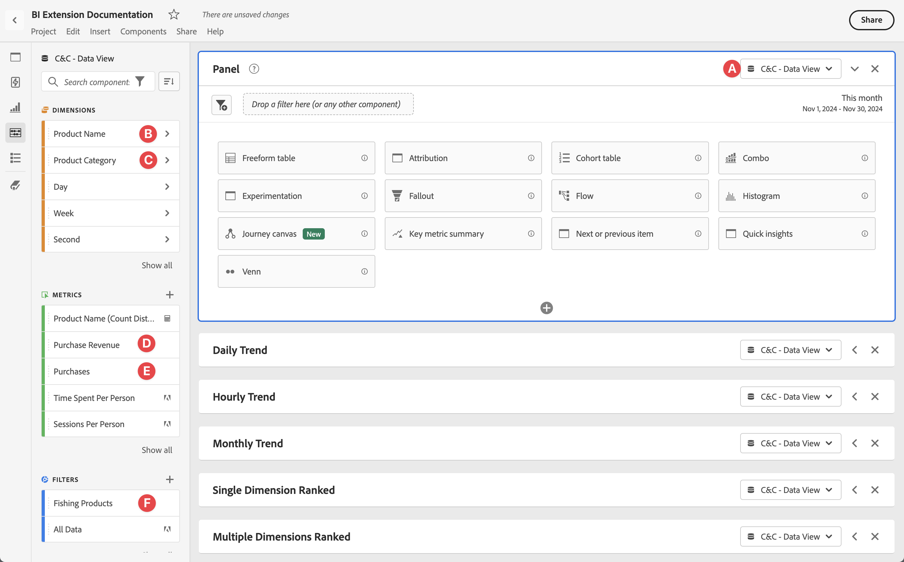
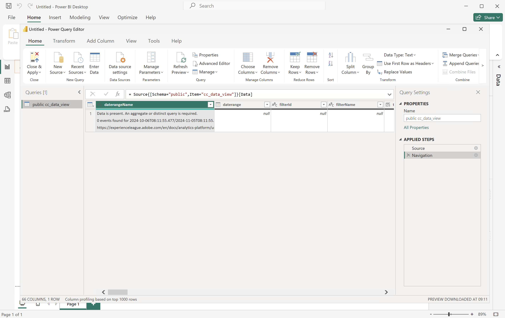
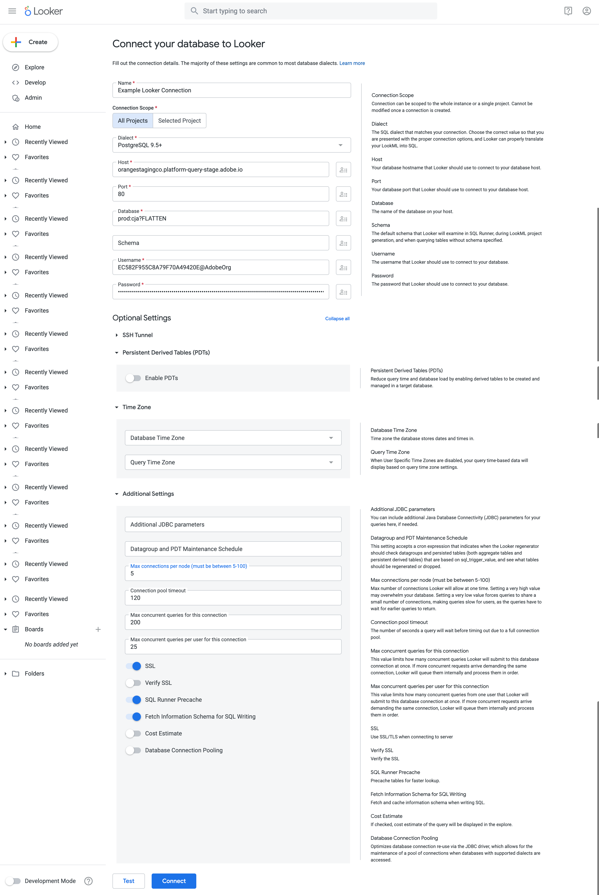
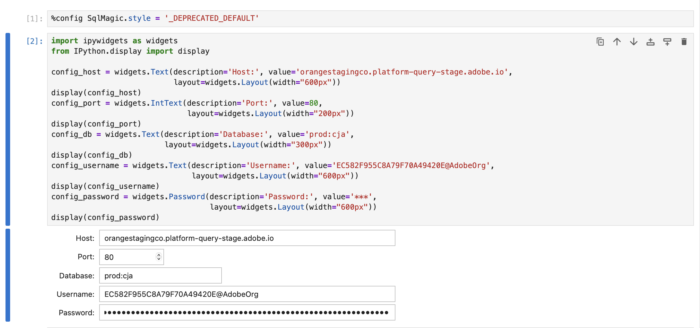
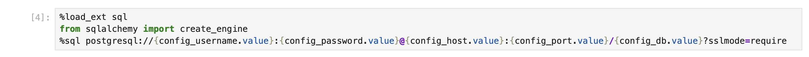
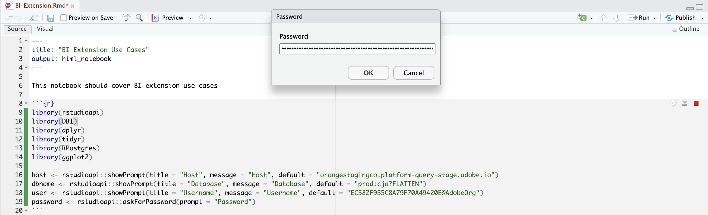
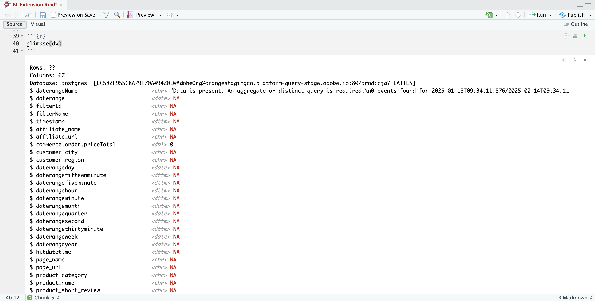

# Conexión y validación


Este caso de uso configura la conexión de la herramienta BI a Customer Journey Analytics, enumera las vistas de datos disponibles y selecciona una vista de datos para usar.

+++ Customer Journey Analytics

Las instrucciones hacen referencia a un entorno de ejemplo con los siguientes objetos:

* Vista de datos: **[!UICONTROL C&amp;C - Vista de datos]** 🅐.
* Dimensiones: **[!UICONTROL Nombre de producto]** 🅑 y **[!UICONTROL Categoría de producto]** 🅒.
* Métricas: **[!UICONTROL Ingresos de compras]** 🅓 y **[!UICONTROL Compras]** 🅔.
* Filtro: **[!UICONTROL Productos de pesca]** 🅕.



Cuando revise los casos de uso, reemplace estos objetos de ejemplo por objetos adecuados para su entorno específico.

+++

+++ Herramientas de BI

>[!BEGINTABS]

>[!TAB Escritorio de Power BI]

1. Acceda a las credenciales y los parámetros necesarios desde la interfaz de usuario del servicio de consultas de Experience Platform.

   1. Vaya a la zona protegida de Experience Platform.
   1. Seleccione  **[!UICONTROL Consultas]** del carril izquierdo.
   1. Seleccione la ficha **[!UICONTROL Credenciales]** en la interfaz de **[!UICONTROL Consultas]**.
   1. Seleccione `prod:cja` del menú desplegable **[!UICONTROL Base de datos]**.

      

1. Inicie Power BI Desktop.
   1. En la interfaz principal, seleccione **[!UICONTROL Obtener datos de otras fuentes]**.
   1. En el diálogo **[!UICONTROL Obtener datos]**:
      
      1. Busque y seleccione **[!UICONTROL base de datos PostgreSQL]**.
      1. Seleccione **[!UICONTROL Conectar]**.
   1. En el diálogo **[!UICONTROL Base de datos PostgreSQL]**:
      
      1. Use  para copiar y pegar los valores de **[!UICONTROL Host]** y **[!UICONTROL Puerto]** del panel **[!UICONTROL Consulta]** **[!UICONTROL Credenciales que caducan]** de Experience Platform, separados por `:` como valor de **[!UICONTROL Servidor]**. Por ejemplo: `examplecompany.platform-query.adobe.io:80`.
      1. Use  para copiar y pegar el valor **[!UICONTROL Base de datos]** del panel **[!UICONTROL Consulta]** **[!UICONTROL Credenciales que caducan]** de Experience Platform. Agregue `?FLATTEN` al valor que pegue. Por ejemplo, `prod:cja?FLATTEN`.
      1. Seleccione **[!UICONTROL DirectQuery]** como **[!UICONTROL modo de conectividad de datos]**.
      1. Seleccione **[!UICONTROL Aceptar]**.
   1. En el cuadro de diálogo **[!UICONTROL Base de datos PostgreSQL]** - **[!UICONTROL Base de datos]**:
      
      1. Use  para copiar los valores de **[!UICONTROL Nombre de usuario]** y **[!UICONTROL Contraseña]** del panel **[!UICONTROL Consulta]** **[!UICONTROL Credenciales que caducan]** de Experience Platform en los campos **[!UICONTROL Nombre de usuario]** y **[!UICONTROL Contraseña]**. Si usa una [credencial que no caduca](https://experienceleague.adobe.com/en/docs/experience-platform/query/ui/credentials?lang=en#use-credential-to-connect), use la contraseña de la credencial que no caduca.
      1. Asegúrese de que el menú desplegable de **[!UICONTROL Seleccione el nivel en el que aplicar esta configuración a]** está establecido en el **[!UICONTROL Servidor]** que ha definido anteriormente.
      1. Seleccione **[!UICONTROL Conectar]**.
   1. En el cuadro de diálogo **[!UICONTROL Navegador]**, se recuperan las vistas de datos. Esta recuperación puede tardar un poco. Una vez recuperado, verá lo siguiente en Power BI Desktop.
      
      1. Seleccione **[!UICONTROL public.cc_data_view]** de la lista del panel izquierdo.
      1. Tiene dos opciones:
         1. Seleccione **[!UICONTROL Cargar]** para continuar y finalizar la instalación.
         1. Seleccione **[!UICONTROL Transformar datos]**. Verá un cuadro de diálogo en el que, opcionalmente, puede aplicar transformaciones como parte de la configuración.
            
            * Seleccione **[!UICONTROL Cerrar y aplicar]**.
   1. Después de un tiempo, **[!UICONTROL public.cc_data_view]** se mostrará en el panel **[!UICONTROL Datos]**. Seleccione  para mostrar dimensiones y métricas.
      


## Para ACOPLAR o no

Power BI Desktop admite los siguientes escenarios para el parámetro `FLATTEN`. Consulte [Acoplar datos anidados](https://experienceleague.adobe.com/es/docs/experience-platform/query/key-concepts/flatten-nested-data) para obtener más información.

| Parámetro FLATTEN | Ejemplo | Admitido | Observaciones |
|---|---|:---:|---|
| Ninguno | `prod:cja` |  | |
| `?FLATTEN` | `prod:cja?FLATTEN` |  | **Opción recomendada para usar!** |
| `%3FFLATTEN` | `prod:cja%3FFLATTEN` |  | Power BI Desktop muestra un error: **[!UICONTROL No se pudo autenticar con las credenciales proporcionadas. Inténtelo de nuevo.]** |

### Más información

* [Requisitos previos](/help/data-views/bi-extension.md#prerequisites)
* [Guía de credenciales](https://experienceleague.adobe.com/es/docs/experience-platform/query/ui/credentials)
* [Conectar Power BI al servicio de consultas](https://experienceleague.adobe.com/es/docs/experience-platform/query/clients/power-bi).


>[!TAB Escritorio Tableau]

1. Acceda a las credenciales y los parámetros necesarios desde la interfaz de usuario del servicio de consultas de Experience Platform.

   1. Vaya a la zona protegida de Experience Platform.
   1. Seleccione  **[!UICONTROL Consultas]** del carril izquierdo.
   1. Seleccione la ficha **[!UICONTROL Credenciales]** en la interfaz de **[!UICONTROL Consultas]**.
   1. Seleccione `prod:cja` del menú desplegable **[!UICONTROL Base de datos]**.

      

1. Inicie Tableau.
   1. Seleccione **[!UICONTROL PostgreSQL]** del carril izquierdo debajo de **[!UICONTROL A un servidor]**. Si no está disponible, seleccione **[!UICONTROL Más...]** y seleccione **[!UICONTROL PostgreSQL]** de los **[!UICONTROL Conectores instalados]**.
      
   1. En el cuadro de diálogo **[!UICONTROL PostgreSQL]**, en la ficha **[!UICONTROL General]**:
      
      1. Use  para copiar y pegar el **[!UICONTROL host]** del panel **[!UICONTROL Consulta]** **[!UICONTROL Credenciales que caducan]** de Experience Platform en el **[!UICONTROL Servidor]**.
      1. Use  para copiar y pegar el **[!UICONTROL puerto]** del panel **[!UICONTROL Consulta]** **[!UICONTROL Credenciales que caducan]** de Experience Platform en el **[!UICONTROL puerto]**.
      1. Use  para copiar y pegar la **[!UICONTROL base de datos]** del panel **[!UICONTROL Consulta]** **[!UICONTROL Credenciales que caducan]** de Experience Platform en la **[!UICONTROL base de datos]**. Agregue `%3FFLATTEN` al valor que pegue. Por ejemplo: `prod:cja%3FFLATTEN`.
      1. Seleccione **[!UICONTROL Nombre de usuario y Contraseña]** del menú desplegable **[!UICONTROL Autenticación]**.
      1. Use  para copiar y pegar el **[!UICONTROL nombre de usuario]** del panel **[!UICONTROL Consulta]** **[!UICONTROL Credenciales de caducidad]** de Experience Platform en el **[!UICONTROL nombre de usuario]**.
      1. Use  para copiar y pegar la **[!UICONTROL contraseña]** del panel **[!UICONTROL Consulta]** **[!UICONTROL Credenciales que caducan]** de Experience Platform en **[!UICONTROL Contraseña]**. Si usa una [credencial que no caduca](https://experienceleague.adobe.com/en/docs/experience-platform/query/ui/credentials?lang=en#use-credential-to-connect), use la contraseña de la credencial que no caduca.
      1. Asegúrese de comprobar **[!UICONTROL Requerir SSL]**.
      1. Seleccione **[!UICONTROL Iniciar sesión]**.

      Verá un cuadro de diálogo **[!UICONTROL Solicitud en curso]** mientras Tableau Desktop valida la conexión.
   1. En la ventana principal, verá en la página **[!UICONTROL Source de datos]**, en el panel izquierdo:
      * Nombre de la conexión, debajo de **[!UICONTROL Connections]**.
      * Nombre de la base de datos, debajo de **[!UICONTROL Database]**.
      * Una lista de tablas, debajo de **[!UICONTROL Tabla]**.
        
      1. Arrastre la entrada **[!UICONTROL cc_data_view]** y suéltela en la vista principal que dice **[!UICONTROL Arrastrar tablas]** aquí.
   1. La ventana principal muestra detalles de la vista de datos **[!UICONTROL cc_data_view]**.
      

## Para ACOPLAR o no

Tableau Desktop admite los siguientes escenarios para el parámetro `FLATTEN`. Consulte [Acoplar datos anidados](https://experienceleague.adobe.com/es/docs/experience-platform/query/key-concepts/flatten-nested-data) para obtener más información.

| Parámetro FLATTEN | Ejemplo | Admitido | Observaciones |
|---|---|:---:|---|
| Ninguno | `prod:cja` |  | |
| `?FLATTEN` | `prod:cja?FLATTEN` |  | |
| `%3FFLATTEN` | `prod:cja%3FFLATTEN` |  | **Opción recomendada para usar**. Tenga en cuenta que `%3FFLATTEN` es una versión de `?FLATTEN` con codificación de dirección URL. |

## Más información

* [Requisitos previos](/help/data-views/bi-extension.md#prerequisites)
* [Guía de credenciales](https://experienceleague.adobe.com/es/docs/experience-platform/query/ui/credentials)
* [Conectar Tableau Desktop al servicio de consultas](https://experienceleague.adobe.com/es/docs/experience-platform/query/clients/tableau).


>[!TAB Buscador]

1. Acceda a las credenciales y los parámetros necesarios desde la interfaz de usuario del servicio de consultas de Experience Platform.

   1. Vaya a la zona protegida de Experience Platform.
   1. Seleccione  **[!UICONTROL Consultas]** del carril izquierdo.
   1. Seleccione la ficha **[!UICONTROL Credenciales]** en la interfaz de **[!UICONTROL Consultas]**.
   1. Seleccione `prod:cja` del menú desplegable **[!UICONTROL Base de datos]**.

      

1. Iniciar sesión en Looker

   1. Seleccione **[!UICONTROL Admin]** en el carril izquierdo.
   1. Seleccione **[!UICONTROL Conexiones]**.
   1. Seleccione **[!UICONTROL Añadir conexión]**.
   1. En **[!UICONTROL Conecte la base de datos a la pantalla de búsqueda]**.

      

      1. Escriba un **[!UICONTROL Nombre]** para la conexión, por ejemplo `Example Looker Connection`.
      1. Asegúrese de que **[!UICONTROL Todos los proyectos]** esté seleccionado como el **[!UICONTROL Ámbito de conexión]**.
      1. Seleccione **[!UICONTROL PostgreSQL 9.5+]** como dialecto.
      1. Use  para copiar y pegar el valor **[!UICONTROL Host]** del panel **[!UICONTROL Consulta]** **[!UICONTROL Credenciales que caducan]** de Experience Platform como valor de **[!UICONTROL Host]**. Por ejemplo: `examplecompany.platform-query.adobe.io`.
      1. Use  para copiar y pegar el valor **[!UICONTROL Puerto]** del panel **[!UICONTROL Consulta]** **[!UICONTROL Credenciales que caducan]** de Experience Platform como valor de **[!UICONTROL Puerto]**. Por ejemplo: `80`.
      1. Use  para copiar y pegar el valor **[!UICONTROL Base de datos]** del panel **[!UICONTROL Consulta]** **[!UICONTROL Credenciales que caducan]** de Experience Platform como valor de **[!UICONTROL Base de datos]**. Agregue `%3FFLATTEN` al valor que pegue. Por ejemplo, `prod:cja%3FFLATTEN`.
      1. Use  para copiar y pegar el valor **[!UICONTROL Nombre de usuario]** del panel **[!UICONTROL Consulta]** **[!UICONTROL Credenciales que caducan]** de Experience Platform como valor de **[!UICONTROL Nombre de usuario]**.
      1. Use  para copiar y pegar el valor **[!UICONTROL Contraseña]** del panel **[!UICONTROL Consulta]** **[!UICONTROL Credenciales que caducan]** de Experience Platform como valor de **[!UICONTROL Contraseña]**.
      1. Seleccione **[!UICONTROL Expandir todo]** en **[!UICONTROL Configuración opcional]**.
      1. Establezca **[!UICONTROL Conexiones máximas]** por nodo en `5`.
      1. Asegúrese de que **[!UICONTROL SSL]** esté habilitado.
      1. Seleccione **[!UICONTROL Probar]** para probar la conexión. Debería ver un banner en la parte superior de la pantalla con un mensaje como **[!UICONTROL Success, can connect JDBC ....]**.
      1. Seleccione **[!UICONTROL Conectar]** para establecer y guardar la conexión.
   1. Verá la nueva conexión en la interfaz **[!UICONTROL Connections]**.
   1. Seleccione **←** de **[!UICONTROL Admin]** para ir a la navegación principal en el carril izquierdo.
   1. Seleccione **[!UICONTROL Desarrollar]**.
   1. Seleccionar **[!UICONTROL proyectos]**.
   1. Seleccione **[!UICONTROL Nuevo modelo]** en Proyectos LookML.
   1. Para asegurarse de que no afecta a otros usuarios. seleccione Introducir modo de desarrollo cuando se le solicite.
   1. En la experiencia **[!UICONTROL Crear modelo]**:
      1. En **[!UICONTROL ➊, seleccione Conexión A Base De Datos]**:
         1. Seleccione la conexión de base de datos en **[!UICONTROL Seleccionar conexión de base de datos]**. Por ejemplo: **[!UICONTROL example_looker_connection]**.
         1. Asigne un nombre al proyecto en **[!UICONTROL Crear un nuevo proyecto LookML para este modelo]**. Para `example: example_looker_project`.
         1. Seleccione **[!UICONTROL Siguiente]**.
      1. En **[!UICONTROL ➋, seleccione Tablas]**:
         1. Seleccione **[!UICONTROL público]** y asegúrese de que la vista de datos de Customer Journey Analytics esté seleccionada. Por ejemplo:  **[!UICONTROL cc_data_view]**.
         1. Seleccione **[!UICONTROL Siguiente]**.
      1. En **[!UICONTROL ➌, Seleccione Claves Principales]**:
         1. Seleccione **[!UICONTROL Siguiente]**.
      1. En **[!UICONTROL ➍, seleccione Exploraciones para crear]**:
         1. Asegúrese de seleccionar la vista. Por ejemplo: **[!UICONTROL cc_data_view.view]**.
         1. Seleccione **[!UICONTROL Siguiente]**.
      1. En **[!UICONTROL ➎, escriba el nombre de modelo]**:
         1. Asigne un nombre al modelo. Por ejemplo: `example_looker_model`.
      1. Seleccione **[!UICONTROL Completar y explorar datos]**.

   Se le redirigirá a la interfaz **[!UICONTROL Explorar]** de Looker, lista para explorar los datos.


## Para ACOPLAR o no

Looker admite los siguientes escenarios para el parámetro `FLATTEN`. Consulte [Acoplar datos anidados](https://experienceleague.adobe.com/es/docs/experience-platform/query/key-concepts/flatten-nested-data) para obtener más información.

| Parámetro FLATTEN | Ejemplo | Admitido | Observaciones |
|---|---|:---:|---|
| Ninguno | `prod:cja` |  | |
| `?FLATTEN` | `prod:cja?FLATTEN` |  | |
| `%3FFLATTEN` | `prod:cja%3FFLATTEN` |  | **Opción recomendada para usar**. Tenga en cuenta que `%3FFLATTEN` es una versión de `?FLATTEN` con codificación de dirección URL. |

## Más información

* [Requisitos previos](/help/data-views/bi-extension.md#prerequisites)
* [Guía de credenciales](https://experienceleague.adobe.com/es/docs/experience-platform/query/ui/credentials)


>[!TAB Jupyter Notebook]

1. Acceda a las credenciales y los parámetros necesarios desde la interfaz de usuario del servicio de consultas de Experience Platform.

   1. Vaya a la zona protegida de Experience Platform.
   1. Seleccione  **[!UICONTROL Consultas]** del carril izquierdo.
   1. Seleccione la ficha **[!UICONTROL Credenciales]** en la interfaz de **[!UICONTROL Consultas]**.
   1. Seleccione `prod:cja` del menú desplegable **[!UICONTROL Base de datos]**.

      

1. Asegúrese de haber configurado un entorno virtual de Python dedicado para ejecutar el entorno de Jupyter Notebook.
1. Asegúrese de que ha instalado las bibliotecas necesarias en su entorno virtual:
   * ipython-sql: `pip install ipython-sql`.
   * psycopg2-binario: `pip install psycopg-binary`.
   * alquimia SQL: pip `install sqlalchemy`.

1. Inicie Jupyter Notebook desde su entorno virtual: `jupyter notebook`.
1. Cree un nuevo bloc de notas o descargue [este bloc de notas de ejemplo](../assets/BI-Extension.ipynb.zip).
1. En la primera celda, introduzca y ejecute:

   ```
   %config SqlMagic.style = '_DEPRECATED_DEFAULT'
   ```

1. En una celda nueva, introduzca los parámetros de configuración para la conexión. Use  para copiar y pegar los valores del panel **[!UICONTROL Consulta]** **[!UICONTROL Credenciales que caducan]** de Experience Platform en los valores necesarios para los parámetros de configuración. Por ejemplo:

   ```
   import ipywidgets as widgets
   from IPython.display import display
   
   config_host = widgets.Text(description='Host:', value='example.platform-query-stage.adobe.io',
                           layout=widgets.Layout(width="600px"))
   display(config_host)
   config_port = widgets.IntText(description='Port:', value=80,
                              layout=widgets.Layout(width="200px"))
   display(config_port)
   config_db = widgets.Text(description='Database:', value='prod:cja',
                         layout=widgets.Layout(width="300px"))
   display(config_db)
   config_username = widgets.Text(description='Username:', value='EC582F955C8A79F70A49420E@AdobeOrg',
                               layout=widgets.Layout(width="600px"))
   display(config_username)
   config_password = widgets.Password(description='Password:', value='***',
                                   layout=widgets.Layout(width="600px"))
   display(config_password)
   ```

1. Ejecute la celda.
1. Use  para copiar y pegar la contraseña del panel **[!UICONTROL Consulta]** **[!UICONTROL Credenciales que caducan]** de Experience Platform en el campo **[!UICONTROL Contraseña]** de Jupyter Notebook.

   

1. En una celda nueva, introduzca las instrucciones para cargar la extensión SQL, la biblioteca necesaria y conectarse con Customer Journey Analytics.

   ```python
   %load_ext sql
   from sqlalchemy import create_engine
   %sql postgresql://{config_username.value}:{config_password.value}@{config_host.value}:{config_port.value}/{config_db.value}?sslmode=require
   ```

   Ejecute el shell. No debería ver ningún resultado, pero la celda debería ejecutarse sin ninguna advertencia.

   

1. En una nueva llamada, introduzca las instrucciones para obtener una lista de las vistas de datos disponibles en función de la conexión.

   ```python
   %%sql
   SELECT n.nspname as "Schema",
      c.relname as "Name",
      CASE c.relkind WHEN 'r' THEN 'table' WHEN 'v' THEN 'view' WHEN 'm' THEN 'materialized view' WHEN 'i' THEN 'index' WHEN 'S' THEN 'sequence' WHEN 's' THEN 'special' WHEN 't' THEN 'TOAST table' WHEN 'f' THEN 'foreign table' WHEN 'p' THEN 'partitioned table' WHEN 'I' THEN 'partitioned index' END as "Type",
      pg_catalog.pg_get_userbyid(c.relowner) as "Owner"
   FROM pg_catalog.pg_class c
   LEFT JOIN pg_catalog.pg_namespace n ON n.oid = c.relnamespace
   WHERE c.relkind IN ('v','')
      AND n.nspname <> 'pg_catalog'
      AND n.nspname !~ '^pg_toast'
      AND n.nspname <> 'information_schema'
      AND pg_catalog.pg_table_is_visible(c.oid)
      AND c.relname NOT LIKE '%test%'
      AND c.relname NOT LIKE '%ajo%'
   ORDER BY 1,2;
   ```

   Ejecute el shell. Debería ver un resultado similar al de la captura de pantalla siguiente.

   

   Debería ver **[!UICONTROL cc_data_view]** en la lista de vistas de datos.

## Para ACOPLAR o no

Jupyter Notebook admite los siguientes escenarios para el parámetro `FLATTEN`. Consulte [Acoplar datos anidados](https://experienceleague.adobe.com/es/docs/experience-platform/query/key-concepts/flatten-nested-data) para obtener más información.

| Parámetro FLATTEN | Ejemplo | Admitido | Observaciones |
|---|---|:---:|---|
| Ninguno | `prod:cja` |  | |
| `?FLATTEN` | `prod:cja?FLATTEN` |  | |
| `%3FFLATTEN` | `prod:cja%3FFLATTEN` |  | **Opción recomendada para usar**. Tenga en cuenta que `%3FFLATTEN` es una versión de `?FLATTEN` con codificación de dirección URL. |

## Más información

* [Requisitos previos](/help/data-views/bi-extension.md#prerequisites)
* [Guía de credenciales](https://experienceleague.adobe.com/es/docs/experience-platform/query/ui/credentials)

>[!TAB EstudioRS]

1. Acceda a las credenciales y los parámetros necesarios desde la interfaz de usuario del servicio de consultas de Experience Platform.

   1. Vaya a la zona protegida de Experience Platform.
   1. Seleccione  **[!UICONTROL Consultas]** del carril izquierdo.
   1. Seleccione la ficha **[!UICONTROL Credenciales]** en la interfaz de **[!UICONTROL Consultas]**.
   1. Seleccione `prod:cja` del menú desplegable **[!UICONTROL Base de datos]**.

      

1. Inicie RStudio.
1. Cree un nuevo archivo R Markdown o descargue [este archivo R markdown de ejemplo](../assets/BI-Extension.Rmd.zip).
1. En su primer fragmento, escriba las siguientes instrucciones entre ` ` ``{r} ` y ` `` ` `. Use  para copiar y pegar valores del panel **[!UICONTROL Consulta]** **[!UICONTROL Credenciales que caducan]** de Experience Platform en los valores necesarios para los distintos parámetros, como `host`, `dbname` y `user`. Por ejemplo:

   ```R
   library(rstudioapi)
   library(DBI)
   library(dplyr)
   library(tidyr)
   library(RPostgres)
   library(ggplot2)
   
   host <- rstudioapi::showPrompt(title = "Host", message = "Host", default = "orangestagingco.platform-query-stage.adobe.io")
   dbname <- rstudioapi::showPrompt(title = "Database", message = "Database", default = "prod:cja?FLATTEN")
   user <- rstudioapi::showPrompt(title = "Username", message = "Username", default = "EC582F955C8A79F70A49420E@AdobeOrg")
   password <- rstudioapi::askForPassword(prompt = "Password")
   ```

1. Ejecuta el fragmento. Se le pedirá **[!UICONTROL Host]**, **[!UICONTROL Base de datos]** y **[!UICONTROL Usuario]**. Simplemente acepte los valores proporcionados como parte del paso anterior.
1. Use  para copiar y pegar la contraseña del panel **[!UICONTROL Consulta]** **[!UICONTROL Credenciales que caducan]** de Experience Platform en el símbolo del sistema de **[!UICONTROL Contraseña]** en RStudio.

   

1. Cree un nuevo fragmento e introduzca las siguientes instrucciones entre ` ` `` {r} ` y ` `` ` `.

   ```R
   con <- dbConnect(
      RPostgres::Postgres(),
      host = host,
      port = 80,
      dbname = dbname,
      user = user,
      password = password,
      sslmode = 'require'
   )
   ```

1. Ejecuta el fragmento. No debería ver ninguna salida si la conexión se ha realizado correctamente.


1. Cree un nuevo fragmento e introduzca las siguientes instrucciones entre ` ` `` {r} ` y ` `` ` `.

   ```R
   views <- dbListTables(con)
   print(views)
   ```

1. Ejecuta el fragmento. Debería ver `character(0)` como el único resultado.


1. Cree un nuevo fragmento e introduzca las siguientes instrucciones entre ` ` `` {r} ` y ` `` ` `.

   ```R
   glimpse(dv)
   ```

1. Ejecuta el fragmento. Debería ver un resultado similar al de la captura de pantalla siguiente.

   

## Para ACOPLAR o no

RSstudio admite los siguientes escenarios para el parámetro `FLATTEN`. Consulte [Acoplar datos anidados](https://experienceleague.adobe.com/es/docs/experience-platform/query/key-concepts/flatten-nested-data) para obtener más información.

| Parámetro FLATTEN | Ejemplo | Admitido | Observaciones |
|---|---|:---:|---|
| Ninguno | `prod:cja` |  | |
| `?FLATTEN` | `prod:cja?FLATTEN` |  | **Opción recomendada para usar**. |
| `%3FFLATTEN` | `prod:cja%3FFLATTEN` |  | |

## Más información

* [Requisitos previos](/help/data-views/bi-extension.md#prerequisites)
* [Guía de credenciales](https://experienceleague.adobe.com/es/docs/experience-platform/query/ui/credentials)

>[!ENDTABS]

+++
