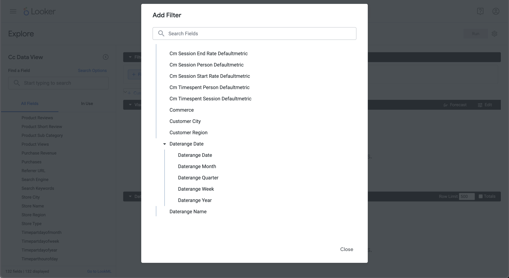
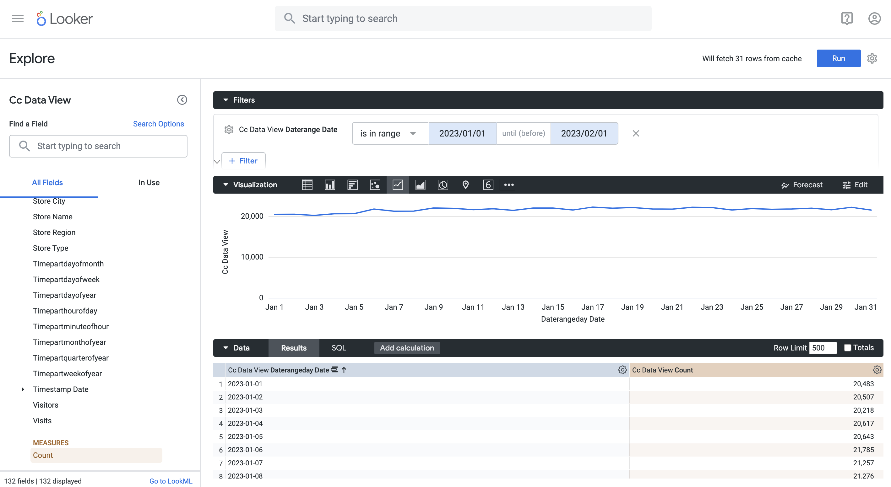
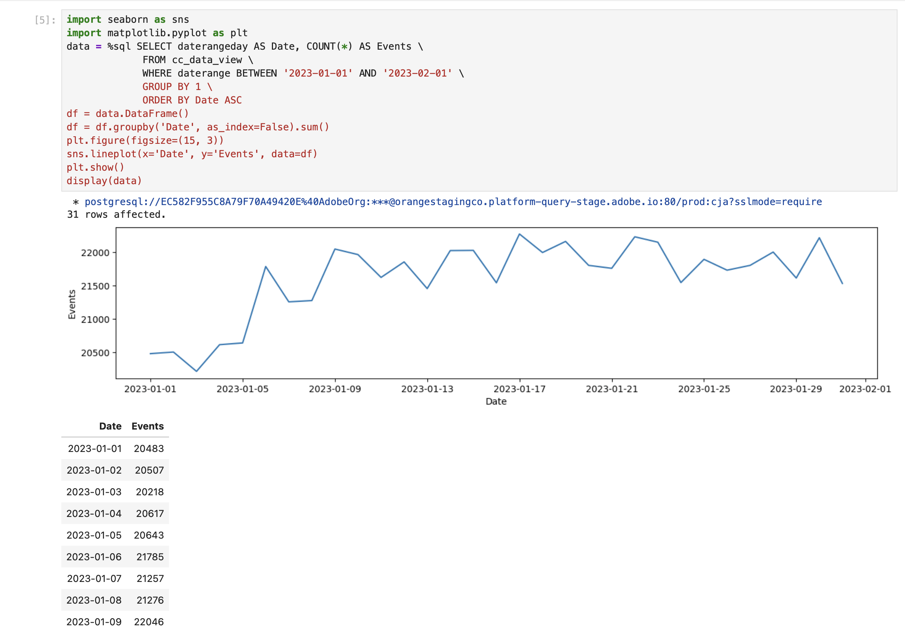
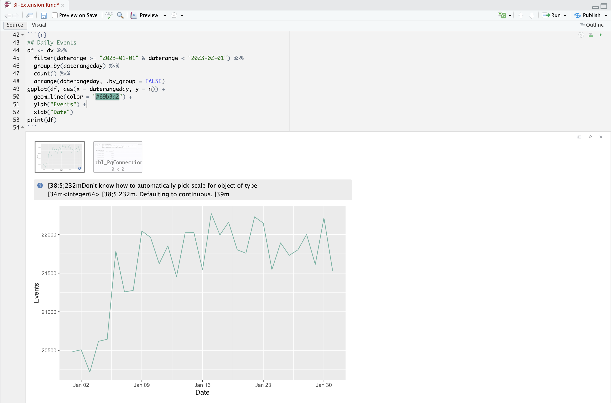

# Tendencia diaria


En este caso de uso, desea mostrar una tabla y una visualización de línea simple que muestre una tendencia diaria de ocurrencias (eventos) desde el 1 de enero de 2023 hasta el 31 de enero de 2023.

+++ Customer Journey Analytics

Un ejemplo del panel **[!UICONTROL Tendencia diaria]** para el caso de uso:


+++

+++ Herramientas de BI

>[!PREREQUISITES]
>
>Asegúrese de que ha validado una conexión correcta de [y de que puede enumerar y usar vistas de datos](connect-and-validate.md) para la herramienta de BI para la que desea probar este caso de uso.
>

>[!BEGINTABS]

>[!TAB Escritorio de Power BI]

1. En el panel **[!UICONTROL Datos]**:
   1. Seleccione **[!UICONTROL daterangeday]**.
   1. Seleccione **[!UICONTROL sumar repeticiones]**.

   Verá una tabla que muestra las ocurrencias del mes actual. Para obtener una mejor visibilidad, amplíe la visualización.

1. En el panel **[!UICONTROL Filtros]**:

   1. Seleccione **[!UICONTROL daterangedday is (All)]** de **[!UICONTROL Filtros en esta imagen]**.
   1. Seleccione **[!UICONTROL Filtro avanzado]** como **[!UICONTROL Tipo de filtro]**.
   1. Defina el filtro para **[!UICONTROL Mostrar elementos cuando el valor]** **[!UICONTROL esté en]** `1/1/2023` **[!UICONTROL y]** **[!UICONTROL esté antes de]** `2/1/2023.`. Puede usar el icono del calendario para elegir y seleccionar fechas.
   1. Seleccione **[!UICONTROL Aplicar filtro]**.

   Verá la tabla actualizada con el filtro **[!UICONTROL daterangeday]** aplicado.

1. En el panel **[!UICONTROL Visualizaciones]**, seleccione la visualización **[!UICONTROL Gráfico de líneas]**.

   Una visualización de gráfico de líneas reemplaza la tabla mientras utiliza los mismos datos que la tabla. El escritorio de Power BI debe tener el aspecto siguiente.

   

1. En la visualización del gráfico de líneas:

   1. Seleccione .
   1. En el menú contextual, seleccione **[!UICONTROL Mostrar como tabla]**.

   La vista principal se actualiza para mostrar una visualización de líneas y una tabla. El escritorio de Power BI debe tener el aspecto siguiente.

   

>[!TAB Escritorio Tableau]

1. Seleccione la ficha **[!UICONTROL Hoja 1]** en la parte inferior para cambiar de la vista **[!UICONTROL Fuente de datos]**. En la vista **[!UICONTROL Hoja 1]**:
   1. Arrastre la entrada **[!UICONTROL Daterange]** de la lista **[!UICONTROL Tablas]** en el panel **[!UICONTROL Datos]** y suéltela en el estante **[!UICONTROL Filtros]**.
   1. En el cuadro de diálogo **[!UICONTROL Filtros de campo \[Intervalo de fechas\]]**, seleccione **[!UICONTROL Intervalo de fechas]** y seleccione **[!UICONTROL Siguiente >]**.
   1. En el cuadro de diálogo **[!UICONTROL Filtrar \[Daterange\]]**, seleccione **[!UICONTROL Intervalo de fechas]** y especifique un período de `01/01/2023` - `01/02/2023`.

      

   1. Arrastre y suelte **[!UICONTROL Daterangeday]** de la lista **[!UICONTROL Tablas]** en el panel **[!UICONTROL Datos]** y suelte la entrada en el campo junto a **[!UICONTROL Columnas]**.
      * Seleccione **[!UICONTROL Día]** del menú desplegable **[!UICONTROL Daterangeday]**, para que el valor se actualice a **[!UICONTROL DAY(Daterangeday)]**.
   1. Arrastre y suelte **[!UICONTROL Ocurrencias]** de la lista **[!UICONTROL Tablas (*Nombres de medida*)]** en el panel **[!UICONTROL Datos]** y suelte la entrada en el campo junto a **[!UICONTROL Filas]**. El valor se convierte automáticamente a **[!UICONTROL SUM(Occurrences)]**.
   1. Modifique **[!UICONTROL Estándar]** a **[!UICONTROL Vista completa]** desde el menú desplegable **[!UICONTROL Ajustar]** de la barra de herramientas.

      El escritorio Tableau debe tener el aspecto siguiente.

      

1. Seleccione **[!UICONTROL Duplicate]** del menú contextual de la ficha **[!UICONTROL Hoja 1]** para crear una segunda hoja.
1. Seleccione **[!UICONTROL Rename]** del menú contextual de la ficha **[!UICONTROL Hoja 1]** para cambiar el nombre de la hoja a `Graph`.
1. Seleccione **[!UICONTROL Rename]** del menú contextual de la ficha **[!UICONTROL Hoja 1 (2)]** para cambiar el nombre de la hoja a `Data`.
1. Asegúrese de que la hoja **[!UICONTROL Data]** esté seleccionada. En la vista **[!UICONTROL Datos]**:
   1. Seleccione **[!UICONTROL Mostrarme]** en la parte superior derecha y seleccione **[!UICONTROL Tabla de texto]** (visualización superior izquierda superior) para modificar el contenido de la vista de datos a una tabla.
   1. Seleccione **[!UICONTROL Intercambiar filas y columnas]** en la barra de herramientas.
   1. Modifique **[!UICONTROL Estándar]** a **[!UICONTROL Vista completa]** desde el menú desplegable **[!UICONTROL Ajustar]** de la barra de herramientas.

      El escritorio Tableau debe tener el aspecto siguiente.

      

1. Seleccione el botón de pestaña **[!UICONTROL Nuevo panel]** (en la parte inferior) para crear una nueva vista de **[!UICONTROL panel 1]**. En la vista **[!UICONTROL Panel 1]**:
   1. Arrastre y suelte la hoja **[!UICONTROL Graph]** del estante **[!UICONTROL Sheets]** en la vista **[!UICONTROL Dashboard 1]** que dice *Colocar hojas aquí*.
   1. Arrastre y suelte la hoja **[!UICONTROL Data]** del estante **[!UICONTROL Sheets]** debajo de la hoja **[!UICONTROL Graph]** en la vista **[!UICONTROL Dashboard 1]**.
   1. Seleccione la hoja **[!UICONTROL Data]** en la vista y modifique **[!UICONTROL Toda la vista]** a **[!UICONTROL Anchura de la corrección]**.

      El escritorio Tableau debe tener el aspecto siguiente.

      


>[!TAB Buscador]

1. En la interfaz **[!UICONTROL Explorar]** de Looker, asegúrate de tener una configuración limpia. Si no, seleccione  **[!UICONTROL Quitar campos y filtros]**.
1. Seleccione **[!UICONTROL + Filtro]** debajo de **[!UICONTROL Filtros]**.
1. En el diálogo **[!UICONTROL Agregar filtro]**:
   1. Seleccionar **[!UICONTROL ‣ Vista De Datos Cc]**
   1. En la lista de campos, seleccione **[!UICONTROL ‣ Daterange Date]** y después **[!UICONTROL Daterange Date]**.
      
1. Especifique el filtro **[!UICONTROL Cc Data View Daterange Date]** ya que **[!UICONTROL está en el intervalo]** **[!UICONTROL 2023/01/01]** **[!UICONTROL hasta (antes)]** **[!UICONTROL 2023/02/01]**.
1. Desde la sección **[!UICONTROL Vista de datos CC]** en el carril izquierdo,
   1. Seleccione **[!UICONTROL ‣ Fecha de intervalo de fechas]** y después **[!UICONTROL Fecha]** de la lista de **[!UICONTROL DIMENSIONES]**.
   1. Seleccione **[!UICONTROL Count]** debajo de **[!UICONTROL MEASURES]** en el carril izquierdo (en la parte inferior).
1. Seleccione **[!UICONTROL Ejecutar]**.
1. Seleccione **[!UICONTROL ‣ Visualización]** para mostrar la visualización de líneas.

Debería ver una visualización y una tabla similares a las que se muestran a continuación.




>[!TAB Jupyter Notebook]

1. Introduzca las siguientes instrucciones en una nueva celda.

   ```python
   import seaborn as sns
   import matplotlib.pyplot as plt
   data = %sql SELECT daterangeday AS Date, COUNT(*) AS Events \
             FROM cc_data_view \
             WHERE daterange BETWEEN '2023-01-01' AND '2023-02-01' \
             GROUP BY 1 \
             ORDER BY Date ASC
   df = data.DataFrame()
   df = df.groupby('Date', as_index=False).sum()
   plt.figure(figsize=(15, 3))
   sns.lineplot(x='Date', y='Events', data=df)
   plt.show()
   display(data)
   ```

1. Ejecute la celda. Debería ver una salida similar a la captura de pantalla siguiente.

   


>[!TAB EstudioRS]

1. Escriba las siguientes instrucciones entre ` ` ``{r} ` y ` `` ` ` en un nuevo fragmento.

   ```R
   ## Daily Events
   df <- dv %>%
      filter(daterange >= "2023-01-01" & daterange < "2023-02-01") %>%
      group_by(daterangeday) %>%
      count() %>%
      arrange(daterangeday, .by_group = FALSE)
   ggplot(df, aes(x = daterangeday, y = n)) +
      geom_line(color = "#69b3a2") +
      ylab("Events") +
      xlab("Date")
   print(df)
   ```

1. Ejecuta el fragmento. Debería ver una salida similar a la captura de pantalla siguiente.

   

>[!ENDTABS]

+++
