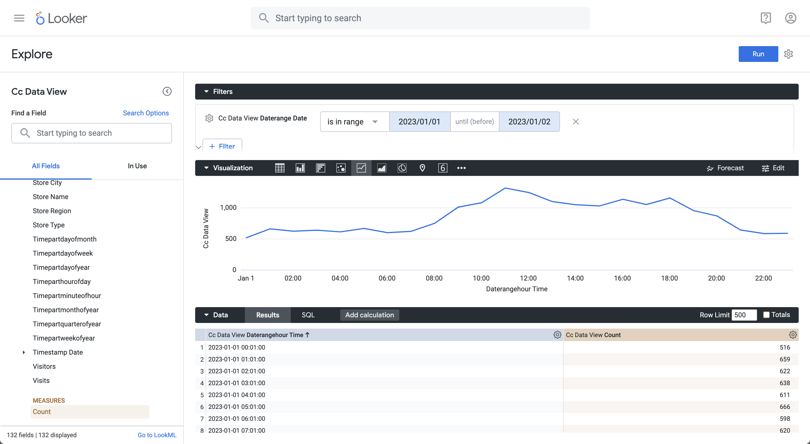

# Tendencia horaria


## Tendencia horaria

En este caso de uso, desea mostrar una tabla y una visualización de línea simple que muestre una tendencia horaria de ocurrencias (eventos) para el 1 de enero de 2023.

+++ Customer Journey Analytics

Un ejemplo del panel **[!UICONTROL Tendencia horaria]** para el caso de uso:


+++

+++ Herramientas de BI

>[!PREREQUISITES]
>
>Asegúrese de que ha validado [una conexión correcta, que puede enumerar vistas de datos y que utiliza una vista de datos](connect-and-validate.md) para la herramienta de BI para la que desea probar este caso de uso.
>

>[!BEGINTABS]

>[!TAB Escritorio de Power BI]

 Power BI **no** comprende cómo manejar los campos de fecha y hora, por lo que no se admiten dimensiones como **[!UICONTROL daterangehour]** y **[!UICONTROL daterangeminute]**.

>[!TAB Escritorio Tableau]

1. Seleccione la ficha **[!UICONTROL Hoja 1]** en la parte inferior para cambiar de **[!UICONTROL Fuente de datos]**. En la vista **[!UICONTROL Hoja 1]**:
   1. Arrastre la entrada **[!UICONTROL Daterange]** de la lista **[!UICONTROL Tablas]** en el panel **[!UICONTROL Datos]** y suéltela en el estante **[!UICONTROL Filtros]**.
   1. En el cuadro de diálogo **[!UICONTROL Filtros de campo \[Intervalo de fechas\]]**, seleccione **[!UICONTROL Intervalo de fechas]** y seleccione **[!UICONTROL Siguiente >]**.
   1. En el cuadro de diálogo **[!UICONTROL Filtrar \[Daterange\]]**, seleccione **[!UICONTROL Intervalo de fechas]** y especifique un período de `01/01/2023` - `02/01/2023`.

      

   1. Arrastre y suelte **[!UICONTROL Daterangehour]** de la lista **[!UICONTROL Tablas]** en el panel **[!UICONTROL Datos]** y suelte la entrada en el campo junto a **[!UICONTROL Columnas]**.
      * Seleccione **[!UICONTROL Más]** > **[!UICONTROL Horas]** en el menú desplegable de **[!UICONTROL Daterangeday]**, para que el valor se actualice a **[!UICONTROL HOUR(Daterangeday)]**.
   1. Arrastre y suelte **[!UICONTROL Ocurrencias]** de la lista **[!UICONTROL Tablas (*Nombres de medida*)]** en el panel **[!UICONTROL Datos]** y suelte la entrada en el campo junto a **[!UICONTROL Filas]**. El valor se convierte automáticamente a **[!UICONTROL SUM(Occurrences)]**.
   1. Modifique **[!UICONTROL Estándar]** a **[!UICONTROL Vista completa]** desde el menú desplegable **[!UICONTROL Ajustar]** de la barra de herramientas.

      El escritorio Tableau debe tener el aspecto siguiente.

      

1. Seleccione **[!UICONTROL Duplicate]** del menú contextual de la ficha **[!UICONTROL Hoja 1]** para crear una segunda hoja.
1. Seleccione **[!UICONTROL Rename]** del menú contextual de la ficha **[!UICONTROL Hoja 1]** para cambiar el nombre de la hoja a `Graph`.
1. Seleccione **[!UICONTROL Rename]** del menú contextual de la ficha **[!UICONTROL Hoja 1 (2)]** para cambiar el nombre de la hoja a `Data`.
1. Asegúrese de que la hoja **[!UICONTROL Data]** esté seleccionada. En la vista **[!UICONTROL Datos]**:
   1. Seleccione **[!UICONTROL Mostrarme]** en la parte superior derecha y seleccione **[!UICONTROL Tabla de texto]** (visualización superior izquierda superior) para modificar el contenido de la vista de datos a una tabla.
   1. Arrastre **[!UICONTROL HOUR(Daterangeday)]** de **[!UICONTROL Columnas]** a **[!UICONTROL Filas]**.
   1. Modifique **[!UICONTROL Estándar]** a **[!UICONTROL Vista completa]** desde el menú desplegable **[!UICONTROL Ajustar]** de la barra de herramientas.

      El escritorio Tableau debe tener el aspecto siguiente.

      

1. Seleccione el botón de pestaña **[!UICONTROL Nuevo panel]** (en la parte inferior) para crear una nueva vista de **[!UICONTROL panel 1]**. En la vista **[!UICONTROL Panel 1]**:
   1. Arrastre y suelte la hoja **[!UICONTROL Graph]** del estante **[!UICONTROL Sheets]** en la vista **[!UICONTROL Dashboard 1]** que dice *Colocar hojas aquí*.
   1. Arrastre y suelte la hoja **[!UICONTROL Data]** del estante **[!UICONTROL Sheets]** debajo de la hoja **[!UICONTROL Graph]** en la vista **[!UICONTROL Dashboard 1]**.
   1. Seleccione la hoja **[!UICONTROL Data]** en la vista y modifique **[!UICONTROL Toda la vista]** a **[!UICONTROL Anchura de la corrección]**.

      La vista del **[!UICONTROL panel 1]** debería ser similar a la siguiente.

      


>[!TAB Buscador]


1. En la interfaz **[!UICONTROL Explorar]** de Looker, asegúrate de tener una configuración limpia. Si no, seleccione  **[!UICONTROL Quitar campos y filtros]**.
1. Seleccione **[!UICONTROL + Filtro]** debajo de **[!UICONTROL Filtros]**.
1. En el diálogo **[!UICONTROL Agregar filtro]**:
   1. Seleccionar **[!UICONTROL ‣ Vista De Datos Cc]**
   1. En la lista de campos, seleccione **[!UICONTROL ‣ Daterange Date]** y después **[!UICONTROL Daterange Date]**.
      
1. Especifique el filtro **[!UICONTROL Cc Data View Daterange Date]** ya que **[!UICONTROL está en el intervalo]** **[!UICONTROL 2023/01/01]** **[!UICONTROL hasta (antes)]** **[!UICONTROL 2023/01/02]**.
1. Desde la sección **[!UICONTROL Vista de datos CC]** en el carril izquierdo,
   1. Seleccione **[!UICONTROL ‣ Daterangehour Date]** y luego **[!UICONTROL Time]** de la lista de **[!UICONTROL DIMENSIONES]**.
   1. Seleccione **[!UICONTROL Count]** debajo de **[!UICONTROL MEASURES]** en el carril izquierdo (en la parte inferior).
1. Seleccione **[!UICONTROL Ejecutar]**.
1. Seleccione **[!UICONTROL ‣ Visualización]** para mostrar la visualización de líneas.

Debería ver una visualización y una tabla similares a las que se muestran a continuación.




>[!TAB Jupyter Notebook]

1. Introduzca las siguientes instrucciones en una nueva celda.

   ```python
   import seaborn as sns
   import matplotlib.pyplot as plt
   data = %sql SELECT daterangehour AS Hour, COUNT(*) AS Events \
               FROM cc_data_view \
               WHERE daterange BETWEEN '2023-01-01' AND '2023-01-02' \
               GROUP BY 1 \
                ORDER BY Hour ASC
   df = data.DataFrame()
   df = df.groupby('Hour', as_index=False).sum()
   plt.figure(figsize=(15, 3))
   sns.lineplot(x='Hour', y='Events', data=df)
   plt.show()
   display(data)
   ```

1. Ejecute la celda. Debería ver una salida similar a la captura de pantalla siguiente.

   


>[!TAB EstudioRS]

1. Escriba las siguientes instrucciones entre ` ` ``{r} ` y ` `` ` ` en un nuevo fragmento.

   ```R
   ## Hourly Events
   df <- dv %>%
      filter(daterange >= "2023-01-01" & daterange < "2023-01-02") %>%
      group_by(daterangehour) %>%
      count() %>%
      arrange(daterangehour, .by_group = FALSE)
   ggplot(df, aes(x = daterangehour, y = n)) +
      geom_line(color = "#69b3a2") +
      ylab("Events") +
      xlab("Hour")
   print(df)
   ```

1. Ejecuta el fragmento. Debería ver una salida similar a la captura de pantalla siguiente.

   

>[!ENDTABS]

+++
