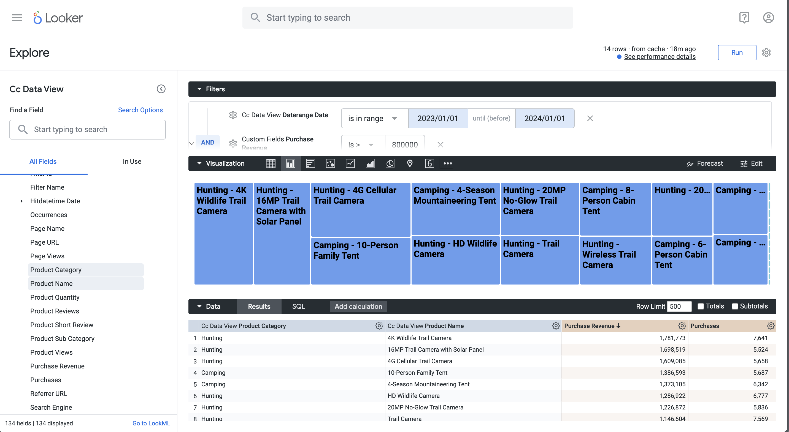

# Clasificación de varias dimensiones


En este caso de uso, desea mostrar una tabla que desglose los ingresos de compra y las compras para nombres de productos dentro de las categorías de productos en 2023. Además, desea utilizar algunas visualizaciones para ilustrar la distribución de categorías de productos y las contribuciones de nombres de productos dentro de cada categoría de producto.

+++ Customer Journey Analytics

Un ejemplo del panel **[!UICONTROL Múltiples clasificaciones de Dimension]** para el caso de uso:


+++

+++ Herramientas de BI

>[!PREREQUISITES]
>
>Asegúrese de que ha validado [una conexión correcta, que puede enumerar vistas de datos y que utiliza una vista de datos](connect-and-validate.md) para la herramienta de BI para la que desea probar este caso de uso.
>

>[!BEGINTABS]

>[!TAB Escritorio de Power BI]

1. Para asegurarse de que el intervalo de fechas se aplique a todas las visualizaciones, arrastre y suelte **[!UICONTROL daterangeday]** desde el panel **[!UICONTROL Datos]** a **[!UICONTROL Filtros en esta página]**.
   1. Seleccione **[!UICONTROL daterangeday es (todo)]** de **[!UICONTROL Filtros de esta página]**.
   1. Seleccione **[!UICONTROL Fecha relativa]** como **[!UICONTROL Tipo de filtro]**.
   1. Defina el filtro para **[!UICONTROL Mostrar elementos cuando el valor]** **[!UICONTROL esté en los últimos]** `1` **[!UICONTROL años del calendario]**.
   1. Seleccione **[!UICONTROL Aplicar filtro]**.

1. En el panel **[!UICONTROL Datos]**:
   1. Seleccione **[!UICONTROL datarangeday]**.
   1. Seleccione **[!UICONTROL product_category]**.
   1. Seleccione **[!UICONTROL product_name]**.
   1. Seleccionar **[!UICONTROL suma purchase_revenue]**
   1. Seleccionar **[!UICONTROL compras de suma]**

1. Para modificar el gráfico de barras verticales en una tabla, asegúrese de que ha seleccionado la tabla y seleccione **[!UICONTROL Matriz]** en el panel **[!UICONTROL Visualizaciones]**.
   * Arrastre **[!UICONTROL product_name]** de **[!UICONTROL Columns]** y suelte el campo debajo de **[!UICONTROL product_category]**&#x200B;y en **[!UICONTROL Rows]** en el panel **[!UICONTROL Visualización]**.

1. Para limitar el número de productos mostrados en la tabla, seleccione **[!UICONTROL product_name is (All)]** en el panel **[!UICONTROL Filtros]**.

   1. Seleccione **[!UICONTROL Filtro avanzado]**.
   1. Seleccionar **[!UICONTROL Tipo de filtro]** **[!UICONTROL N superior]** **[!UICONTROL Mostrar elementos]** **[!UICONTROL Superior]** `15` **[!UICONTROL Por valor]**.
   1. Arrastre **[!UICONTROL compras]** desde el panel **[!UICONTROL Datos]** al **[!UICONTROL Agregar campos de datos aquí]**.
   1. Seleccione **[!UICONTROL Aplicar filtro]**.

1. Para mejorar la legibilidad, seleccione **[!UICONTROL Ver]** en el menú superior, seleccione **[!UICONTROL Vista de página]** > **[!UICONTROL Tamaño real]** y cambie el tamaño de la visualización de la tabla.

1. Para desglosar cada categoría en la tabla, seleccione **[!UICONTROL +]** en el nivel de categoría de producto. El escritorio de Power BI debe tener el aspecto siguiente.

   

1. Seleccione **[!UICONTROL Página principal]** en el menú superior y seleccione **[!UICONTROL Nuevo elemento visual]**. Se agrega una nueva imagen al informe.

1. En el panel **[!UICONTROL Datos]**:
   1. Seleccione **[!UICONTROL product_category]**.
   1. Seleccione **[!UICONTROL product_name]**.
   1. Seleccione **[!UICONTROL purchase_revenue]**.

1. Para modificar la imagen, seleccione el gráfico de barras y seleccione **[!UICONTROL Gráfico de rectángulos]** en el panel **[!UICONTROL Visualizaciones]**.
1. Asegúrese de que **[!UICONTROL product_category]** aparece debajo de **[!UICONTROL Category]** y que **[!UICONTROL product_name]** aparece debajo de **[!UICONTROL Detalles]** en el panel **[!UICONTROL Visualizaciones]**.

   El escritorio de Power BI debe tener el aspecto siguiente.

   

1. Seleccione **[!UICONTROL Página principal]** en el menú superior y seleccione **[!UICONTROL Nuevo elemento visual]**. Se agrega una nueva imagen al informe.

1. En el panel **[!UICONTROL Datos]**:
   1. Seleccione **[!UICONTROL product_category]**.
   1. Seleccione **[!UICONTROL purchase_revenue]**.
   1. Seleccione **[!UICONTROL compra]**.

1. En el panel **[!UICONTROL Visualizaciones]**:
   1. Para modificar la visualización, seleccione **[!UICONTROL Gráfico de líneas y columnas apiladas]**.
   1. Arrastre **[!UICONTROL sum_of_purchases]** desde **[!UICONTROL eje Y de columna]** hasta **[!UICONTROL eje Y de línea]**.

1. En el informe, reorganice las visualizaciones individuales.

   El escritorio de Power BI debe tener el aspecto siguiente.

   


>[!TAB Escritorio Tableau]

1. Seleccione la ficha **[!UICONTROL Hoja 1]** en la parte inferior para cambiar de **[!UICONTROL Fuente de datos]**. En la vista **[!UICONTROL Hoja 1]**:
   1. Arrastre la entrada **[!UICONTROL Daterange]** de la lista **[!UICONTROL Tablas]** en el panel **[!UICONTROL Datos]** y suéltela en el estante **[!UICONTROL Filtros]**.
   1. En el cuadro de diálogo **[!UICONTROL Filtros de campo \[Intervalo de fechas\]]**, seleccione **[!UICONTROL Intervalo de fechas]** y seleccione **[!UICONTROL Siguiente >]**.
   1. En el cuadro de diálogo **[!UICONTROL Filtrar \[Daterange\]]**, seleccione **[!UICONTROL Fechas relativas]**, seleccione **[!UICONTROL Años]** y especifique **[!UICONTROL Año anterior]**. Seleccione **[!UICONTROL Aplicar]** y **[!UICONTROL Aceptar]**.

      El escritorio Tableau debe tener el aspecto siguiente.

      

   1. Arrastre **[!UICONTROL Product Category]** y suéltelo junto a **[!UICONTROL Columns]**.
   1. Arrastre **[!UICONTROL Ingresos de compra]** y suéltelo junto a **[!UICONTROL Filas]**. El valor cambia a **[!UICONTROL SUM(Purchase Revenue)]**.
   1. Arrastre Purchases y suéltelas junto a **[!UICONTROL Rows]**. El valor cambia a **[!UICONTROL SUM(Purchases)]**.
   1. Seleccione **[!UICONTROL SUM(Purchases)]** y en el menú desplegable seleccione **[!UICONTROL Dual Axis]**.
   1. Seleccione **[!UICONTROL SUM(Purchases)]** en **[!UICONTROL Marcas]** y seleccione **[!UICONTROL Línea]** en el menú desplegable.
   1. Seleccione **[!UICONTROL SUM(Purchase Revenue)]** en **[!UICONTROL Marcas]** y seleccione **[!UICONTROL Barra]** en el menú desplegable.
   1. Seleccione **[!UICONTROL Vista completa]** del menú **[!UICONTROL Ajustar]**.
   1. Seleccione el título **[!UICONTROL Ingresos de compra]** en el gráfico y asegúrese de que los ingresos de compra estén en orden ascendente.

      El escritorio Tableau debe tener el aspecto siguiente.

      

1. Cambie el nombre de la hoja **[!UICONTROL Hoja 1]** actual a `Category`.
1. Seleccione **[!UICONTROL Nueva hoja de cálculo]** para crear una hoja nueva y renómbrala a `Data`.

   1. Arrastre la entrada **[!UICONTROL Daterange]** de la lista **[!UICONTROL Tablas]** en el panel **[!UICONTROL Datos]** y suéltela en el estante **[!UICONTROL Filtros]**.
   1. En el cuadro de diálogo **[!UICONTROL Filtros de campo \[Intervalo de fechas\]]**, seleccione **[!UICONTROL Intervalo de fechas]** y seleccione **[!UICONTROL Siguiente >]**.
   1. En el cuadro de diálogo **[!UICONTROL Filtrar \[Daterange\]]**, seleccione **[!UICONTROL Fechas relativas]**, seleccione **[!UICONTROL Años]** y especifique **[!UICONTROL Año anterior]**. Seleccione **[!UICONTROL Aplicar]** y **[!UICONTROL Aceptar]**.
   1. Arrastre **[!UICONTROL Ingresos de compra]** desde el panel **[!UICONTROL Datos]** hasta **[!UICONTROL Columnas]**. El valor cambia a **[!UICONTROL SUM(Purchase Revenue)]**.
   1. Arrastre **[!UICONTROL Compra]** desde el panel **[!UICONTROL Datos]** hasta **[!UICONTROL Columnas]**, junto a **[!UICONTROL Ingresos de compra]**. El valor cambia a **[!UICONTROL SUM(Purchases)]**.
   1. Arrastre **[!UICONTROL Categoría de producto]** del panel **[!UICONTROL Datos]** a **[!UICONTROL Filas]**.
   1. Arrastre **[!UICONTROL Nombre de producto]** del panel **[!UICONTROL Datos]** a **[!UICONTROL Filas]**, junto a **[!UICONTROL Categoría de producto]**.
   1. Para cambiar las dos barras horizontales a una tabla, seleccione **[!UICONTROL Tabla de texto]** de **[!UICONTROL Mostrarme]**.
   1. Para limitar el número de productos, seleccione **[!UICONTROL Compras]** en **[!UICONTROL Valores de medida]**. En el menú desplegable, seleccione **[!UICONTROL Filtro]**.
   1. En el cuadro de diálogo **[!UICONTROL Filtrar \[Compras\]]**, seleccione **[!UICONTROL Al menos]** e introduzca `7000`. Seleccione **[!UICONTROL Aplicar]** y **[!UICONTROL Aceptar]**.
   1. Seleccione **[!UICONTROL Ajustar ancho]** en **[!UICONTROL el menú desplegable]** Ajustar ancho.

      El escritorio Tableau debe tener el aspecto siguiente.

      

1. Seleccione **[!UICONTROL Nueva hoja de cálculo]** para crear una nueva hoja y cambiarle el nombre a **[!UICONTROL Diagrama de árbol]**.
   1. Arrastre la entrada **[!UICONTROL Daterange]** de la lista **[!UICONTROL Tablas]** en el panel **[!UICONTROL Datos]** y suéltela en el estante **[!UICONTROL Filtros]**.
   1. En el cuadro de diálogo **[!UICONTROL Filtros de campo \[Intervalo de fechas\]]**, seleccione **[!UICONTROL Intervalo de fechas]** y seleccione **[!UICONTROL Siguiente >]**.
   1. En el cuadro de diálogo **[!UICONTROL Filtrar \[Daterange\]]**, seleccione **[!UICONTROL Fechas relativas]**, seleccione **[!UICONTROL Años]** y especifique **[!UICONTROL Año anterior]**. Seleccione **[!UICONTROL Aplicar]** y **[!UICONTROL Aceptar]**.
   1. Arrastre **[!UICONTROL Ingresos de compra]** del panel **[!UICONTROL Datos]** a **[!UICONTROL Filas]**. Los valores cambian a **[!UICONTROL SUM(Ingresos de compra)]**.
   1. Arrastre **[!UICONTROL Compra]** desde el panel **[!UICONTROL Datos]** a **[!UICONTROL Filas]**, junto a **[!UICONTROL Ingresos de compra]**. El valor cambia a **[!UICONTROL SUM(Purchases)]**.
   1. Arrastre **[!UICONTROL Categoría de producto]** del panel **[!UICONTROL Datos]** a **[!UICONTROL Columnas]**.
   1. Arrastre **[!UICONTROL Product Name]** del panel **[!UICONTROL Datos]** a **[!UICONTROL Columnas]**.
   1. Para cambiar los dos gráficos de barras verticales por un diagrama, seleccione **[!UICONTROL Diagrama de árbol]** de **[!UICONTROL Mostrarme]**.
   1. Para limitar el número de productos, seleccione **[!UICONTROL Compras]** en **[!UICONTROL Valores de medida]**. En el menú desplegable, seleccione **[!UICONTROL Filtro]**.
   1. En el cuadro de diálogo **[!UICONTROL Filtrar \[Compras\]]**, seleccione **[!UICONTROL Al menos]** e introduzca `7000`. Seleccione **[!UICONTROL Aplicar]** y **[!UICONTROL Aceptar]**.
   1. Seleccione **[!UICONTROL Ajustar ancho]** del menú desplegable **[!UICONTROL Ajustar]**.

      El escritorio Tableau debe tener el aspecto siguiente.

      

1. Seleccione el botón de pestaña **[!UICONTROL Nuevo panel]** (en la parte inferior) para crear una nueva vista de **[!UICONTROL panel 1]**. En la vista **[!UICONTROL Panel 1]**:
   1. Arrastre y suelte la hoja **[!UICONTROL Category]** del estante **[!UICONTROL Sheets]** en la vista **[!UICONTROL Dashboard 1]** que dice *Drop sheets here*.
   1. Arrastre y suelte la hoja **[!UICONTROL Treemap]** del estante **[!UICONTROL Sheets]** debajo de la hoja **[!UICONTROL Category]** en la vista **[!UICONTROL Dashboard 1]**.
   1. Arrastre y suelte la hoja **[!UICONTROL Data]** del estante **[!UICONTROL Sheets]** debajo de la hoja **[!UICONTROL Treemap]** en la vista **[!UICONTROL Dashboard 1]**.
   1. Cambie el tamaño de cada una de las hojas de la vista.

   La vista del **[!UICONTROL panel 1]** debería ser similar a la siguiente.

   


>[!TAB Buscador]

1. En la interfaz **[!UICONTROL Explorar]** de Looker, asegúrate de tener una configuración limpia. Si no, seleccione  **[!UICONTROL Quitar campos y filtros]**.
1. Seleccione **[!UICONTROL + Filtro]** debajo de **[!UICONTROL Filtros]**.
1. En el diálogo **[!UICONTROL Agregar filtro]**:
   1. Seleccionar **[!UICONTROL ‣ Vista De Datos Cc]**
   1. En la lista de campos, seleccione **[!UICONTROL ‣ Daterange Date]** y después **[!UICONTROL Daterange Date]**.
      
1. Especifique el filtro **[!UICONTROL Cc Data View Daterange Date]** ya que **[!UICONTROL está en el intervalo]** **[!UICONTROL 2023/01/01]** **[!UICONTROL hasta (antes)]** **[!UICONTROL 2024/01/01]**.
1. Desde la sección **[!UICONTROL ‣ Vista de datos CC]** en el carril izquierdo:
   1. Seleccione **[!UICONTROL Categoría de producto]**.
   1. Seleccione **[!UICONTROL Nombre de producto]**.
1. Desde la sección **[!UICONTROL ‣ Campos personalizados]** en el carril izquierdo:
   1. Seleccione **[!UICONTROL Medida personalizada]** del menú desplegable **[!UICONTROL + Agregar]**.
   1. En el diálogo **[!UICONTROL Crear medida personalizada]**:
      1. Seleccione **[!UICONTROL Ingresos de compra]** del menú desplegable **[!UICONTROL Campo para medir]**.
      1. Seleccione **[!UICONTROL Sum]** del menú desplegable **[!UICONTROL Tipo de medida]**.
      1. Escriba un nombre de campo personalizado para **[!UICONTROL Name]**. Por ejemplo: `Sum of Purchase Revenue`.
      1. Seleccione la ficha **[!UICONTROL Detalles del campo]**.
      1. Seleccione **[!UICONTROL Decimals]** del menú desplegable **[!UICONTROL Formato]** y asegúrese de que `0` se ha introducido en **[!UICONTROL Decimals]**.
         
      1. Seleccione **[!UICONTROL Guardar]**.
   1. Seleccione **[!UICONTROL Medida personalizada]** una vez más en el menú desplegable **[!UICONTROL + Agregar]**. En el cuadro de diálogo de medida **[!UICONTROL Crear personalizado]**:
      1. Seleccione **[!UICONTROL Compras]** del menú desplegable **[!UICONTROL Campo para medir]**.
      1. Seleccione **[!UICONTROL Sum]** del menú desplegable **[!UICONTROL Tipo de medida]**.
      1. Escriba un nombre de campo personalizado para **[!UICONTROL Name]**. Por ejemplo: `Sum of Purchases`.
      1. Seleccione la ficha **[!UICONTROL Detalles del campo]**.
      1. Seleccione **[!UICONTROL Decimals]** del menú desplegable **[!UICONTROL Formato]** y asegúrese de que `0` se ha introducido en **[!UICONTROL Decimals]**.
      1. Seleccione **[!UICONTROL Guardar]**.
   1. Ambos campos se añaden automáticamente a la vista de datos.
1. En la sección **[!UICONTROL Filtros]**, seleccione **[!UICONTROL + Filtro]**. En el diálogo **[!UICONTROL Agregar filtro]**. Seleccione **[!UICONTROL ‣ campos personalizados]** y luego **[!UICONTROL Ingresos de compra]**.
1. Seleccione **[!UICONTROL es >]** e introduzca `800000` para limitar los resultados.
1. Seleccione **[!UICONTROL Ejecutar]**.
1. Seleccione **[!UICONTROL ‣ Visualización]** para mostrar la visualización de líneas.
1. Seleccione **[!UICONTROL Editar]** en **[!UICONTROL Visualización]** para actualizar la visualización. En el cuadro de diálogo emergente:
   1. Seleccione la ficha **[!UICONTROL Diagrama]**.
   1. Desplácese hacia abajo y seleccione **[!UICONTROL Editar configuración de gráfico]**.
   1. Modifique el JSON en **[!UICONTROL Configuración del gráfico (anular)]** como en la captura de pantalla siguiente y, a continuación, seleccione **[!UICONTROL Vista previa]**.

      

   1. Seleccione **[!UICONTROL Aplicar]**.
   1. Seleccione  junto a **[!UICONTROL Editar]** para ocultar el cuadro de diálogo emergente

Debería ver una visualización y una tabla similares a las que se muestran a continuación.




>[!TAB Jupyter Notebook]

1. Introduzca las siguientes instrucciones en una nueva celda.

   ```
   import seaborn as sns
   import matplotlib.pyplot as plt
   data = %sql SELECT product_category AS `Product Category`, product_name AS `Product Name`, SUM(purchase_revenue) AS `Purchase Revenue`, SUM(purchases) AS `Purchases` \
               FROM cc_data_view \
               WHERE daterange BETWEEN '2023-01-01' AND '2024-01-01' \
               GROUP BY 1, 2 \
               ORDER BY `Purchase Revenue` DESC \
               LIMIT 10;
   df = data.DataFrame()
   df = df.groupby(['Product Category', 'Product Name'], as_index=False).sum()
   plt.figure(figsize=(8, 8))
   sns.scatterplot(x='Product Category', y='Product Name', size='Purchase Revenue', sizes=(10, 200), hue='Purchases', palette='husl', data=df)
   plt.show()
   display(data)
   ```

1. Ejecute la celda. Debería ver una salida similar a la captura de pantalla siguiente.

   


>[!TAB EstudioRS]

1. Escriba las siguientes instrucciones entre ` ` ``{r} ` y ` `` ` ` en un nuevo fragmento.

   ```R
   ## Multiple dimensions ranked
   df <- dv %>%
      filter(daterange >= "2023-01-01" & daterange < "2024-01-01") %>%
      group_by(product_category, product_name) %>%
      summarise(purchase_revenue = sum(purchase_revenue), purchases = sum(purchases), .groups = "keep") %>%
      arrange(desc(purchase_revenue), .by_group = FALSE)
   print(df)
   ```

1. Ejecuta el fragmento. Debería ver una salida similar a la captura de pantalla siguiente.

   


>[!ENDTABS]

+++
