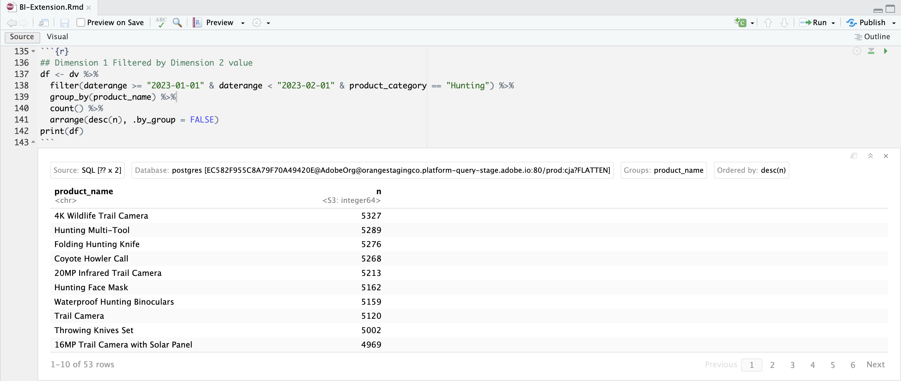

# Uso de valores de dimensión para segmentar

Utiliza el valor **[!UICONTROL Caza]** dinámico de **[!UICONTROL Categoría de producto]** para segmentar productos de la categoría de caza. Alternativamente, para aquellas herramientas de BI que no admiten la recuperación dinámica de valores de categoría de producto, se crea un nuevo segmento en Customer Journey Analytics que segmenta los productos de la categoría de producto de caza.
A continuación, desea utilizar el nuevo segmento para informar sobre nombres de productos y ocurrencias (eventos) para productos de la categoría de caza durante enero de 2023.

+++ Customer Journey Analytics

Cree un nuevo segmento con **[!UICONTROL Title]** `Hunting Products` en Customer Journey Analytics.


A continuación, puede usar ese segmento en un ejemplo **[!UICONTROL Uso del panel Valores de Dimension para filtrar]** para el caso de uso:


+++

+++ Herramientas de BI

>[!PREREQUISITES]
>
>Asegúrese de que ha validado [una conexión correcta, que puede enumerar vistas de datos y que utiliza una vista de datos](connect-and-validate.md) para la herramienta de BI para la que desea probar este caso de uso.
>

>[!BEGINTABS]

>[!TAB Escritorio de Power BI]

1. Seleccione **[!UICONTROL Inicio]** en el menú y, a continuación, seleccione **[!UICONTROL Actualizar]** en la barra de herramientas. Debe actualizar la conexión para recoger el nuevo filtro que acaba de definir en Customer Journey Analytics.

1. En el panel **[!UICONTROL Datos]**:
   1. Seleccione **[!UICONTROL daterange]**.
   1. Seleccione **[!UICONTROL product_category]**.
   1. Seleccione **[!UICONTROL product_name]**.
   1. Seleccione **[!UICONTROL sumar repeticiones]**.

Verá una visualización que muestra **[!UICONTROL Error al obtener los datos de este elemento visual]**.

1. En el panel **[!UICONTROL Filtros]**:
   1. Seleccione **[!UICONTROL filterName is (All)]** de **[!UICONTROL Filtros en este elemento visual]**.
   1. Seleccione **[!UICONTROL Filtro básico]** como **[!UICONTROL Tipo de filtro]**.
   1. Seleccione **[!UICONTROL intervalo de fechas es (todo)]** de **[!UICONTROL Filtros en este elemento visual]**.
   1. Seleccione **[!UICONTROL Filtro avanzado]** como **[!UICONTROL Tipo de filtro]**.
   1. Defina el filtro para **[!UICONTROL Mostrar elementos cuando el valor]** **[!UICONTROL esté en]** `1/1/2023` **[!UICONTROL y]** **[!UICONTROL esté antes de]** `2/1/2023` o después.
   1. Seleccione **[!UICONTROL Filtro básico]** como **[!UICONTROL Tipo de filtro]** para **[!UICONTROL product_category]** y seleccione **[!UICONTROL Caza]** de la lista de valores posibles.
   1. Seleccione  para quitar **[!UICONTROL filterName]** de **[!UICONTROL Columnas]**.
   1. Seleccione  para quitar **[!UICONTROL daterange]** de **[!UICONTROL Columnas]**.

   Verá la tabla actualizada con el filtro **[!UICONTROL product_category]** aplicado. El escritorio de Power BI debe tener el aspecto siguiente.

   


>[!TAB Escritorio Tableau]

 Tableau Desktop no admite recuperar la lista dinámica de categorías de productos de Customer Journey Analytics. En su lugar, este caso de uso usa el filtro recién creado para **[!UICONTROL Productos de caza]** y usa los criterios del nombre del filtro.

1. En la vista **[!UICONTROL Data Source]**, debajo de **[!UICONTROL Data]**, en el menú contextual de **[!UICONTROL cc_data_view(prod:cja%3FFLATTEN)]**, seleccione **[!UICONTROL Actualizar]**. Debe actualizar la conexión para recoger el nuevo filtro que acaba de definir en Customer Journey Analytics.
1. Seleccione la ficha **[!UICONTROL Hoja 1]** en la parte inferior para cambiar de **[!UICONTROL Fuente de datos]**. En la vista **[!UICONTROL Hoja 1]**:
   1. Arrastre la entrada **[!UICONTROL Filter Name]** de la lista **[!UICONTROL Tables]** en el estante **[!UICONTROL Filters]**.
   1. En el diálogo **[!UICONTROL Filtrar \[Nombre del filtro\]]**, asegúrese de que **[!UICONTROL Seleccionar de la lista]** está seleccionado y seleccione **[!UICONTROL Productos de caza]** de la lista. Seleccione **[!UICONTROL Aplicar]** y **[!UICONTROL Aceptar]**.
   1. Arrastre la entrada **[!UICONTROL Daterange]** de la lista **[!UICONTROL Tablas]** en el estante **[!UICONTROL Filtros]**.
   1. En el cuadro de diálogo **[!UICONTROL Campo de filtro \[Intervalo de fechas\]]**, seleccione **[!UICONTROL Intervalo de fechas]** y seleccione **[!UICONTROL Siguiente >]**.
   1. En el cuadro de diálogo **[!UICONTROL Filtrar \[Daterange\]]**, seleccione **[!UICONTROL Intervalo de fechas]** y seleccione `01/01/2023` - `1/2/2023`. Seleccione **[!UICONTROL Aplicar]** y **[!UICONTROL Aceptar]**.
   1. Arrastre **[!UICONTROL Product Name]** de la lista **[!UICONTROL Tablas]** a **[!UICONTROL Filas]**.
   1. Arrastre la entrada **[!UICONTROL Ocurrencias]** de la lista **[!UICONTROL Tablas]** y suelte la entrada en el campo junto a **[!UICONTROL Columnas]**. El valor cambia a **[!UICONTROL SUM(Occurrences)]**.
   1. Seleccione **[!UICONTROL Tabla de texto]** de **[!UICONTROL Mostrarme]**.
   1. Seleccione **[!UICONTROL Ajustar ancho]** del menú desplegable **[!UICONTROL Ajustar]**.

      El escritorio Tableau debe tener el aspecto siguiente.

      

>[!TAB Buscador]

1. En la 1. En la interfaz **[!UICONTROL Explorar]** de Looker, actualice la conexión. Seleccione  **[!UICONTROL Borrar caché y actualizar]**.
1. En la interfaz **[!UICONTROL Explorar]** de Looker, asegúrate de tener una configuración limpia. Si no, seleccione  **[!UICONTROL Quitar campos y filtros]**.
1. Seleccione **[!UICONTROL + Filtro]** debajo de **[!UICONTROL Filtros]**.
1. En el diálogo **[!UICONTROL Agregar filtro]**:
   1. Seleccionar **[!UICONTROL ‣ Vista De Datos Cc]**
   1. En la lista de campos, seleccione **[!UICONTROL ‣ Daterange Date]** y después **[!UICONTROL Daterange Date]**.
      
1. Especifique el filtro **[!UICONTROL Cc Data View Daterange Date]** ya que **[!UICONTROL está en el intervalo]** **[!UICONTROL 2023/01/01]** **[!UICONTROL hasta (antes)]** **[!UICONTROL 2023/02/01]**.
1. Seleccione **[!UICONTROL + Filtro]** debajo de **[!UICONTROL Filtros]** para agregar otro filtro.
1. En el diálogo **[!UICONTROL Agregar filtro]**:
   1. Seleccionar **[!UICONTROL ‣ Vista De Datos Cc]**
   1. En la lista de campos, seleccione **[!UICONTROL ‣ Product Category]**.
1. Asegúrese de que **[!UICONTROL is]** es la selección del filtro.

 Lookes no muestra la lista de valores posibles para **[!UICONTROL Product Category]**.


>[!TAB Jupyter Notebook]

1. Introduzca las siguientes instrucciones en una nueva celda.

   ```python
   data = %sql SELECT DISTINCT product_category FROM cc_data_view WHERE daterange BETWEEN '2023-01-01' AND '2024-01-01';
   style = {'description_width': 'initial'}
   category_filter = widgets.Dropdown(
      options=[d for d, in data],
      description='Product Category:',
      style=style
   )
   display(category_filter)
   ```

1. Ejecute la celda. Debería ver una salida similar a la captura de pantalla siguiente.

   

1. Seleccione **[!UICONTROL Caza]** en el menú desplegable.

1. Introduzca las siguientes instrucciones en una nueva celda.

   ```python
   import seaborn as sns
   import matplotlib.pyplot as plt
   data = %sql SELECT product_name AS `Product Name`, COUNT(*) AS Events \
               FROM cc_data_view \
               WHERE daterange BETWEEN '2023-01-01' AND '2023-02-01' \
               AND product_category = '{category_filter.value}' \
               GROUP BY 1 \
               ORDER BY Events DESC \
               LIMIT 10;
   df = data.DataFrame()
   df = df.groupby('Product Name', as_index=False).sum()
   plt.figure(figsize=(15, 3))
   sns.barplot(x='Events', y='Product Name', data=df)
   plt.show()
   display(data)
   ```

1. Ejecute la celda. Debería ver una salida similar a la captura de pantalla siguiente.

   


>[!TAB EstudioRS]

1. Escriba las siguientes instrucciones entre ` ```{r} ` y ` ``` ` en un nuevo fragmento. Asegúrese de utilizar una categoría adecuada. Por ejemplo, `Hunting`.

   ```R
   ## Dimension 1 Filtered by Dimension 2 value
   df <- dv %>%
      filter(daterange >= "2023-01-01" & daterange < "2023-02-01" & product_category == "Hunting") %>%
      group_by(product_name) %>%
      count() %>%
      arrange(desc(n), .by_group = FALSE)
   print(df)
   ```

1. Ejecuta el fragmento. Debería ver una salida similar a la captura de pantalla siguiente.

   

>[!ENDTABS]

+++

