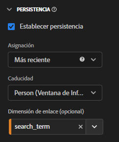

# Uso de dimensiones y métricas de enlace en CJA

Customer Journey Analytics ofrece varias formas de mantener los valores de dimensión más allá de la visita en la que están configurados. Uno de los métodos de persistencia que ofrece Adobe se conoce como Enlace. En versiones anteriores de Adobe Analytics, este concepto se conocía como comercialización.

Aunque puede utilizar dimensiones de enlace con datos de evento de nivel superior, este concepto se utiliza mejor cuando se trabaja con [Matrices de objetos](/help/use-cases/object-arrays.md). Puede atribuir una dimensión a una parte de una matriz de objetos sin aplicarla a todos los atributos de un evento determinado. Por ejemplo, puede atribuir un término de búsqueda a un producto de la matriz de objetos del carro de compras sin enlazar ese término de búsqueda al evento completo.

## Ejemplo 1: Utilice dimensiones de enlace para atribuir atributos de producto adicionales a una compra

Puede enlazar elementos de dimensión dentro de una matriz de objetos a otra dimensión. Cuando aparece el elemento de dimensión enlazado, CJA recuerda la dimensión enlazada y la incluye en el evento por usted. Piense en el siguiente recorrido del cliente:

1. Un visitante ve una página de producto de una lavadora.

   ```json
   {
       "PersonID": "1",
       "product": [
           {
               "name": "Washing Machine 2000",
               "color": "white",
               "type": "front loader",
           },
       ],
       "timestamp": 1534219229
   }
   ```

1. A continuación, el visitante ve una página de producto de un secador.

   ```json
   {
       "PersonID": "1",
       "product": [
           {
               "name": "Dryer 2000",
               "color": "neon orange",
           },
       ],
       "timestamp": 1534219502
   }
   ```

1. Finalmente, hace una compra. El color de cada producto no se incluyó en el evento de compra.

   ```json
   {
       "PersonID": "1",
       "orders": 1,
       "product": [
           {
               "name": "Washing Machine 2000",
               "price": 1600,
           },
           {
               "name": "Dryer 2000",
               "price": 499
           }
       ],
       "timestamp": 1534219768
   }
   ```

Si desea ver los ingresos por color sin una dimensión de enlace, la dimensión `product.color` persiste y atribuye incorrectamente el crédito al color del secador:

| product.color | ingresos |
| --- | --- |
| naranja neón | 2099 |

Puede entrar al Administrador de vista de datos y enlazar el color del producto con su nombre:


Cuando se establece este modelo de persistencia, CJA toma nota del nombre del producto cada vez que se establece su color. Cuando reconoce el mismo nombre de producto en un evento subsiguiente para este visitante, también se aprecia el color del producto. Los mismos datos cuando se vincula el color del producto con su nombre tendrían un aspecto similar al siguiente:

| product.color | ingresos |
| --- | --- |
| blanco | 1600 |
| naranja neón | 499 |

## Ejemplo 2: Utilice métricas de enlace para unir el término de búsqueda con una compra de producto

Uno de los métodos de comercialización más comunes en Adobe Analytics ha sido enlazar un término de búsqueda a un producto para que cada término de búsqueda obtenga crédito por su producto apropiado. Piense en el siguiente recorrido del cliente:

1. Un visitante llega a su sitio y busca “guantes de boxeo”. La métrica de búsquedas aumenta en uno y se muestran los tres resultados de búsqueda principales.

   ```json
   {
       "PersonID": "1",
       "page_name": "Search results",
       "search": "1",
       "search_term": "boxing gloves",
       "product": [
           {
               "name": "Beginner gloves",
           },
           {
               "name": "Tier 3 gloves",
           },
           {
               "name": "Professional gloves",
           }
       ]
   }
   ```

2. Encuentra un par de guantes que le gustan y los añade al carro de compras.

   ```json
   {
       "PersonID": "1",
       "page_name": "Shopping cart",
       "cart_add": "1",
       "product": [
           {
               "name": "Tier 3 gloves",
           }
       ]
   }
   ```

3. A continuación, el visitante busca “raqueta de tenis”. La métrica de búsquedas aumenta en uno y se muestran los tres resultados de búsqueda principales.

   ```json
   {
       "PersonID": "1",
       "page_name": "Search results",
       "search": "1",
       "search_term": "tennis racket",
       "product": [
           {
               "name": "Shock absorb racket",
           },
           {
               "name": "Women's open racket",
           },
           {
               "name": "Extreme racket",
           }
       ]
   }
   ```

4. Encuentra una raqueta que le gusta y la añade al carro de compras.

   ```json
   {
       "PersonID": "1",
       "page_name": "Shopping cart",
       "cart_add": "1",
       "product": [
           {
               "name": "Tier 3 gloves",
           },
           {
               "name": "Shock absorb racket",
           }
       ]
   }
   ```

5. El visitante busca por tercera vez: “zapatos”. La métrica de búsquedas aumenta en uno y se muestran los tres resultados de búsqueda principales.

   ```json
   {
       "PersonID": "1",
       "page_name": "Search results",
       "search": "1",
       "search_term": "shoes",
       "product": [
           {
               "name": "Men's walking shoes",
           },
           {
               "name": "Tennis shoes",
           },
           {
               "name": "Skate shoes",
           }
       ]
   }
   ```

6. Encuentra un par de zapatos que le gusta y los añade al carro de compras.

   ```json
   {
       "PersonID": "1",
       "page_name": "Shopping cart",
       "cart_add": "1",
       "product": [
           {
               "name": "Tier 3 gloves",
           },
           {
               "name": "Shock absorb racket",
           },
           {
               "name": "Skate shoes",
           }
       ]
   }
   ```

7. El visitante pasa por el proceso de cierre de compra y adquiere estos tres artículos.

   ```json
   {
       "PersonID": "1",
       "page_name": "Thank you for your purchase",
       "purchase": "1",
       "product": [
           {
               "name": "Tier 3 gloves",
               "price": "89.99"
           },
           {
               "name": "Shock absorb racket",
               "price": "34.99"
           },
           {
               "name": "Skate shoes",
               "price": "79.99"
           }
       ]
   }
   ```

Si utiliza un modelo de asignación que no incluya una dimensión de enlace con el término de búsqueda, los tres productos atribuirán los ingresos a un único término de búsqueda. Por ejemplo, si utilizó la asignación original con la dimensión de término de búsqueda:

| search_term | ingresos |
| --- | --- |
| guantes de boxeo | 204,97 USD |

Si ha utilizado la asignación más reciente con la dimensión de término de búsqueda, los tres productos siguen atribuyendo ingresos a un único término de búsqueda:

| search_term | ingresos |
| --- | --- |
| zapatos | 204,97 USD |

Aunque este ejemplo incluye solo un visitante, muchos visitantes que buscan cosas diferentes pueden atribuir de forma incorrecta términos de búsqueda a productos diferentes, lo que dificulta poder determinar cuáles son realmente los mejores resultados de búsqueda.

Puede enlazar términos de búsqueda con nombres de producto siempre que la métrica Búsquedas esté presente para atribuir correctamente términos de búsqueda a ingresos.


En Analysis Workspace, el informe resultante tendría un aspecto similar al siguiente:

| search_term | ingresos |
| --- | --- |
| guantes de boxeo | 89,99 USD |
| raqueta de tenis | 34,99 USD |
| zapatos | 79,99 USD |

CJA detecta automáticamente la relación entre la dimensión seleccionada y la dimensión de enlace. Si la dimensión de enlace se encuentra en una matriz de objetos mientras que la dimensión seleccionada se encuentra en un nivel superior, se requiere una métrica de enlace. Una métrica de enlace actúa como activador para una dimensión de enlace, por lo que solo se une a los eventos en los que la métrica de enlace está presente. En este ejemplo, la página de resultados de búsqueda siempre incluye una dimensión de término de búsqueda y una métrica de búsquedas.

Al establecer la dimensión de término de búsqueda en este modelo de persistencia, se ejecuta la siguiente lógica:

* Cuando se establezca la dimensión de término de búsqueda, compruebe la presencia del nombre del producto.
* Si el nombre del producto no está allí, no haga nada.
* Si el nombre del producto está allí, compruebe la presencia de la métrica Búsquedas.
* Si la métrica Búsquedas no está allí, no haga nada.
* Si la métrica Búsquedas está allí, vincule el término de búsqueda a todos los nombres de productos del evento. Se copia hasta el mismo nivel que el nombre del producto para ese evento. En este ejemplo, se trata como product.search_term.
* Si se ve el mismo nombre de producto en un evento posterior, el término de búsqueda enlazado también se transfiere a ese evento.

## Ejemplo 3: Enlace el término de búsqueda de vídeo al perfil del usuario

Puede enlazar un término de búsqueda a un perfil de usuario para que la persistencia entre perfiles permanezca completamente separada. Por ejemplo, su organización ejecuta un servicio de streaming en el que una cuenta general puede tener varios perfiles. El visitante tiene un perfil para niños y un perfil para adultos.

1. La cuenta inicia sesión en el perfil para niños y busca un programa de televisión para niños. Tenga en cuenta que `"ProfileID"` es `2` para representar el perfil para niños.

   ```json
   {
       "PersonID": "7078",
       "ProfileID": "2",
       "Searches": "1",
       "search_term": "kids show"
   }
   ```

1. Encuentra el programa “Orangey” y lo reproduce para que su hijo pueda verlo.

   ```json
   {
       "PersonID": "7078",
       "ProfileID": "2",
       "ShowName": "Orangey",
       "VideoStarts": "1"
   }
   ```

1. Más tarde esa noche, el padre cambia a su perfil y busca contenido no infantil que ver. Tenga en cuenta que `"ProfileID"` es `1` para representar el perfil de adulto. Ambos perfiles pertenecen a la misma cuenta, representada por el mismo `"PersonID"`.

   ```json
   {
       "PersonID": "7078",
       "ProfileID": "1",
       "Searches": "1",
       "search_term": "grownup movie"
   }
   ```

1. Encuentra el programa “Analytics After Hours” y disfruta de su velada viéndolo.

   ```json
   {
       "PersonID": "7078",
       "ProfileID": "1",
       "ShowName": "Analytics After Hours",
       "VideoStarts": "1"
   }
   ```

1. Al día siguiente, continúa el programa “Orangey” para su hijo. No necesita buscar porque ya conoce el programa.

   ```json
   {
       "PersonID": "7078",
       "ProfileID": "2",
       "ShowName": "Orangey",
       "VideoStarts": "1"
   }
   ```

Si utiliza la asignación más reciente con caducidad de persona, el término de búsqueda `"grownup movie"` se atribuye a la última vista del programa del niño.

| Término de búsqueda | Inicios de vídeo |
| --- | --- |
| películas no infantiles | 2 |
| programa para niños | 1 |

Sin embargo, si se enlaza el `search_term` al `ProfileID`, las búsquedas de cada perfil se aislarían a su propio perfil, atribuido a los programas correctos que buscan.



Analysis Workspace atribuiría correctamente el segundo episodio de Orangey al término de búsqueda `"kids show"` sin tener en cuenta las búsquedas de otros perfiles.

| Término de búsqueda | Inicios de vídeo |
| --- | --- |
| programa para niños | 2 |
| películas no infantiles | 1 |

## Ejemplo 4: Evaluar el comportamiento de exploración frente a búsqueda en una configuración de venta minorista

Puede enlazar valores a dimensiones establecidas en eventos anteriores. Cuando se configura una variable con una dimensión de enlace, CJA tiene en cuenta el valor persistente. Si no desea este comportamiento, puede ajustar la configuración de persistencia de la dimensión de enlace. Consideremos el siguiente ejemplo donde `product_finding_method` se configura en un evento y luego se vincula a la métrica Adiciones al carro de compras en el siguiente evento.

1. Un visitante busca `"camera"`. Tenga en cuenta que no hay productos configurados en esta página.

   ```json
   {
       "search_term": "camera",
       "product_finding_method": "search"
   }
   ```

1. Hace clic en una cámara que le gusta y la añade al carro de compras.

   ```json
   {
       "Product": [
           {
               "name": "DSLR Camera"
           }
       ],
       "CartAdd": "1"
   }
   ```

1. A continuación, el visitante navega a la categoría de cinturones de hombre sin realizar una búsqueda. Tenga en cuenta que no hay productos configurados en esta página.

   ```json
   {
       "category": "Men's belts",
       "product_finding_method": "browse"
   }
   ```

1. Hace clic en un cinturón que le gusta y lo añade al carro de compras.

   ```json
   {
       "Product": [
           {
               "name": "Ratchet belt"
           }
       ],
       "CartAdd": "1"
   }
   ```

1. Pasa por el proceso de cierre de compra y adquiere estos dos artículos.

   ```json
   {
       "Product": [
           {
               "name": "DSLR Camera",
               "price": "399.99"
           },
           {
               "name": "Ratchet belt",
               "price": "19.99"
           }
       ],
       "Purchase": "1"
   }
   ```

Si la persistencia se establece usando la asignación más reciente sin una dimensión de enlace, los 419,98 $ completos de ingresos se atribuyen al método de localización `browse`.

| Método de localización de productos | Ingresos |
| --- | --- |
| examinar | 419,98 |

Si la persistencia se establece usando la asignación original sin una dimensión de enlace, los 419,98 $ completos de ingresos se atribuyen al método de localización `search`.

| Método de localización de productos | Ingresos |
| --- | --- |
| búsqueda | 419,98 |

Sin embargo, si se enlaza `product_finding_method` a la métrica Adiciones al carro de compras, el informe resultante atribuye cada producto al método de localización correcto.

| Método de localización de productos | Ingresos |
| --- | --- |
| búsqueda | 399,99 |
| examinar | 19,99 |
