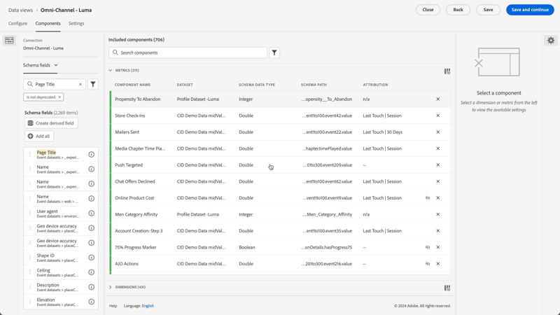
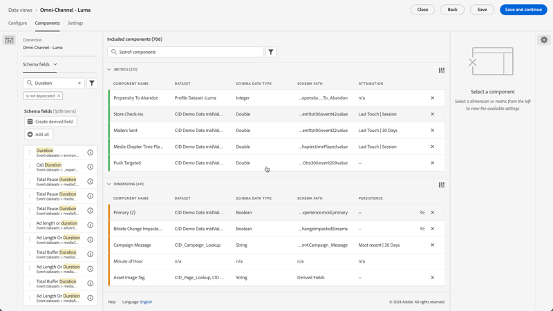
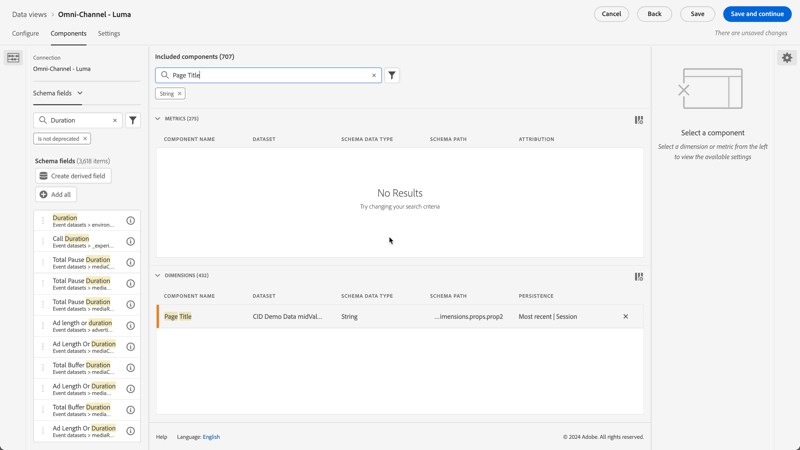
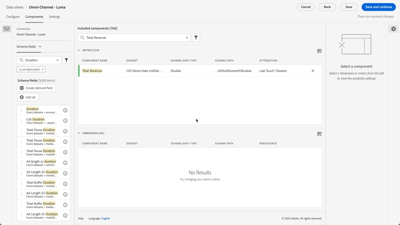

# Casos de uso de vistas de datos

Estos casos de uso ilustran la flexibilidad y la potencia de las vistas de datos de Customer Journey Analytics.

## Usar métricas de dimensiones de enlace

Consulte el caso de uso [Usar métricas de dimensiones de enlace](binding-dimensions-metrics.md) para obtener más información.

## Uso de datos de resumen

Consulte el caso de uso [Usar datos de resumen](summary-data.md) para obtener más información.

## Casos de uso de extensión de BI

Consulte los [casos de uso de extensión de BI](bi-extension-usecases.md) sobre cómo realizar una serie de casos de uso con la extensión de BI de Customer Journey Analytics.

## Creación de una métrica a partir de un campo de esquema de cadena {#string}

Por ejemplo, al crear una vista de datos, podría crear una métrica de [!UICONTROL Pedidos] a partir de un campo de esquema de [!UICONTROL Título de página] que sea una cadena.

1. En la ficha **[!UICONTROL Componentes]**, arrastre el **[!UICONTROL Título de página]** a la sección **[!UICONTROL Métricas]** en [!UICONTROL Componentes incluidos].
1. Resalte la métrica que acaba de arrastrar y cambie su nombre a `Orders` en **[!UICONTROL Configuración de componentes]** en
1. Abra la sección **[!UICONTROL Incluir/Excluir valores]** y especifique lo siguiente:
   1. Habilitar **[!UICONTROL Establecer valores de exclusión]**.
   1. Seleccione **[!UICONTROL Si se cumplen todos los criterios]** de **[!UICONTROL Coincidencia]**.
   1. Especifique `confirmation`. El texto de **[!UICONTROL page_title]** indica que esta página está relacionada con la realización de un pedido. Después de revisar todos los títulos de las páginas donde se cumplen esos criterios, se contará un `1` para cada instancia. El resultado es una nueva métrica (no una métrica calculada). Una métrica que ha incluido o excluido valores puede utilizarse en cualquier otra métrica. Estas métricas funcionan con atribución, segmentos y en cualquier otro lugar donde se pueden utilizar métricas estándar.

   {width=100%}
1. Puede especificar un modelo de atribución para esta métrica, como [!UICONTROL Último toque], con un [!UICONTROL Periodo de retroactividad] de [!UICONTROL Sesión].
También puede crear otra métrica [!UICONTROL Pedidos] desde el mismo campo y especificar un modelo de atribución diferente. Como [!UICONTROL Primer contacto] y una ventana retrospectiva [!UICONTROL diferente], como [!UICONTROL 30 días].

Otro ejemplo sería el uso del ID de persona, una dimensión, como métrica para determinar cuántos ID de persona tiene su compañía.

## Uso de filtros como dimensiones {#integers}

Anteriormente, los enteros se trataban automáticamente como métricas en Customer Journey Analytics. Ahora, los números (incluidos los eventos personalizados de Adobe Analytics) pueden tratarse como dimensiones. Vea el siguiente ejemplo:

1. Arrastre el entero **[!UICONTROL Duration]** a la sección **[!UICONTROL Dimensiones]** en [!UICONTROL Componentes incluidos]:
1. Ahora puede agregar **[!UICONTROL Clasificación de valor]** para presentar esta dimensión en forma de agrupación en los informes. Sin agrupar, cada instancia de esta dimensión aparecería como un elemento de línea en los informes de Workspace.
   {width=100%}

## Uso de dimensiones numéricas como métricas en diagramas de flujo {#numeric}

Puede utilizar una dimensión numérica para obtener métricas en la visualización [!UICONTROL &#x200B; Flujo].

1. En la pestaña [Componentes](https://experienceleague.adobe.com/en/docs/analytics-platform/using/cja-dataviews/create-dataview) de vistas de datos, arrastre el campo de esquema [!UICONTROL Canales de marketing] al área [!UICONTROL Métricas] en [!UICONTROL Componentes incluidos].
2. En los informes de Workspace, este flujo muestra [!UICONTROL Canales de marketing] fluyendo hacia [!UICONTROL Pedidos]:

## Filtre los subeventos {#sub-event}

Esta función se aplica específicamente a los campos basados en matrices. La funcionalidad de inclusión/exclusión permite filtrar en el nivel de subevento, mientras que los segmentos creados en el Generador de segmentos solo le proporcionan segmentación en el nivel de evento. Puede realizar el filtrado de subeventos mediante la inclusión/exclusión en Vistas de datos y luego hacer referencia a esa nueva métrica/dimensión en un segmento a nivel de evento.

Por ejemplo, use la funcionalidad de inclusión/exclusión en las vistas de datos para centrarse únicamente en los productos que generaron ventas de más de 50 $. Por lo tanto, si tiene un pedido que incluye una compra de productos de 50 $ y una compra de productos de 25 $, la funcionalidad de inclusión/exclusión elimina la compra de productos de 25 $, no todo el pedido.

1. En la pestaña [Componentes](https://experienceleague.adobe.com/en/docs/analytics-platform/using/cja-dataviews/create-dataview) de vistas de datos, arrastre el campo de esquema **[!UICONTROL Ingresos]** al área **[!UICONTROL Métricas]** en [!UICONTROL Componentes incluidos].
1. Seleccione la métrica y configure lo siguiente en el lado derecho:
a. En **[!UICONTROL Formato]**, seleccione **[!UICONTROL Moneda]**.
b. En **[!UICONTROL Moneda]**, seleccione **[!UICONTROL USD]**.
c. En **[!UICONTROL Incluir/Excluir valores]**, active la casilla situada junto a **[!UICONTROL Definir valores de inclusión/exclusión]**.
d. En **[!UICONTROL Coincidencia]**, seleccione **[!UICONTROL Si se cumplen todos los criterios]**.
e. En **[!UICONTROL Criterios]**, seleccione **[!UICONTROL es mayor o igual que]**.
f. Especifique `50` como valor.

Esta nueva configuración le permite ver solo los ingresos de alto valor y filtrar cualquiera por debajo de 50 $.

## Usar la configuración [!UICONTROL Sin opciones de valor] {#no-value}

Es posible que su empresa haya dedicado tiempo en formar a sus usuarios para ver No especificado para las dimensiones en los informes. El valor predeterminado para las dimensiones en Vistas de datos es *Sin valor*. Sin embargo, puede especificar por dimensión cómo se debe informar de Ningún valor. Ver las opciones **[!UICONTROL Sin valor]** para un componente de dimensión.

{width=100%}

## Crear varias métricas con diferentes configuraciones de atribución {#attribution}

Con la característica **[!UICONTROL Duplicar]** de la parte superior derecha, crea una serie de métricas de ingresos totales con diferentes configuraciones de atribución como **[!UICONTROL Primer contacto]**, **[!UICONTROL Último contacto]** y **[!UICONTROL Algorítmico]**.

No olvide cambiar el nombre de cada métrica para reflejar las diferencias, como `Total Revenue (Algorithmic)`

{width=100%}

Para obtener más información sobre otras configuraciones de vistas de datos, consulte [Creación de vistas de datos](/help/data-views/create-dataview.md).
Para obtener una descripción general conceptual de las vistas de datos, consulte [Información general sobre las vistas de datos](/help/data-views/data-views.md).

## Creación de informes de sesión nueva y sesión de retorno {#new-repeat}

Puede determinar si una sesión es realmente la primera sesión de un usuario o una sesión de retorno. Se basa en la ventana de creación de informes que definió para esta vista de datos y en una ventana retrospectiva de 13 meses. Esta creación de informes permite determinar, por ejemplo, lo siguiente:

* ¿Qué porcentaje de sus pedidos provienen de sesiones nuevas o de retorno?

* Para un canal de marketing determinado o una campaña específica, ¿está segmentando los usuarios que ingresan por primera vez o a los que regresan? ¿Cómo influye esta opción en las tasas de conversión?

Una dimensión y dos métricas facilitan esta creación de informes:

* [Tipo de sesión](https://experienceleague.adobe.com/en/docs/analytics-platform/using/cja-dataviews/component-reference) - Esta dimensión tiene dos valores: [!UICONTROL Nuevo] y [!UICONTROL Devolviendo]. El elemento de línea [!UICONTROL New] incluye todo el comportamiento (es decir, las métricas respecto a esta dimensión) de una sesión que se ha determinado que es la primera sesión definida por una persona. Todo lo demás está incluido en el elemento de línea [!UICONTROL Devolución] (suponiendo que todo pertenece a una sesión). Cuando las métricas no forman parte de ninguna sesión, caen en el bloque “No aplicable” para esta dimensión.

* [Sesiones por primera vez](https://experienceleague.adobe.com/en/docs/analytics-platform/using/cja-dataviews/component-reference). La métrica Sesiones por primera vez se define como la primera sesión definida por una persona dentro de la ventana de creación de informes.

* [Sesiones de retorno](https://experienceleague.adobe.com/en/docs/analytics-platform/using/cja-dataviews/component-reference) La métrica Sesiones de retorno es el número de sesiones que no fueron la primera sesión de una persona.—>

Para acceder a los componentes:

1. Vaya al editor de vista de datos.
1. Seleccione la ficha **[!UICONTROL Componentes]** y, a continuación, seleccione **[!UICONTROL Componentes estándar]** en el carril izquierdo.
1. Arrastre los componentes **[!UICONTROL Tipo de sesión]**, **[!UICONTROL Sesiones por primera vez]** y **[!UICONTROL Sesiones de retorno]** a la vista de datos.

Las nuevas sesiones se registran con precisión casi siempre. Las únicas excepciones son las siguientes:

* Cuando se produce una primera sesión antes de la ventana retrospectiva de 13 meses.  Se omite esta sesión.
* Cuando una sesión abarca tanto la ventana retrospectiva como la ventana de creación de informes. Por ejemplo, ejecuta un informe del 1 al 15 de junio de 2022. La ventana retrospectiva abarcaría del 1 de mayo de 2021 al 31 de mayo de 2022. Si una sesión se inicia el 30 de mayo de 2022 y finaliza el 1 de junio de 2022, la sesión se incluirá en la ventana retrospectiva. Y todas las sesiones de la ventana de creación de informes se cuentan como sesiones recurrentes.

## Uso de la funcionalidad Fecha y Fecha-hora {#date}

Los esquemas de Adobe Experience Platform contienen campos [!UICONTROL Fecha] y [!UICONTROL Fecha-hora]. Las vistas de datos de Customer Journey Analytics ahora admiten estos campos. Al arrastrar estos campos a una vista de datos como dimensión, puede especificar su [formato](/help/data-views/component-settings/format.md). Esta configuración de formato determina cómo se muestran los campos en la creación de informes. Por ejemplo:

* Para el formato Fecha, si selecciona **[!UICONTROL Día]** con el formato **[!UICONTROL Mes, día, año]**, un ejemplo de salida en la creación de informes puede tener el siguiente aspecto: Agosto 23, 2022.

* Para el formato de fecha y hora, si selecciona **[!UICONTROL Minuto del día]** con el formato **[!UICONTROL Hora:Minute]**, el resultado puede ser similar a: 20:20.

Se admiten las fechas posteriores al 1 de enero de 1900 (con la única excepción del 1 de enero de 1970) y los valores de fecha y hora posteriores al 1 de enero de 2000 a las 00:00:00.

### Casos de uso de fecha y hora

* Fecha: una empresa de viajes recopila la fecha de salida de los viajes como campo en sus datos. A la compañía le gustaría tener un informe que compare el [!UICONTROL día de la semana] para todas las fechas de salida recopiladas a fin de saber cuál es el más popular. Y a la compañía le gustaría hacer lo mismo para el [!UICONTROL Mes del año].

* Fecha-hora: una empresa minorista recopila la hora de cada una de sus compras en el punto de venta (TPV). Para un mes determinado, la compañía desea entender los períodos de compra más concurridos por [!UICONTROL Hora del día].

>[!MORELIKETHIS]
>
>[Fecha y fecha-hora en la configuración del componente Formato](/help/data-views/component-settings/format.md)
>

