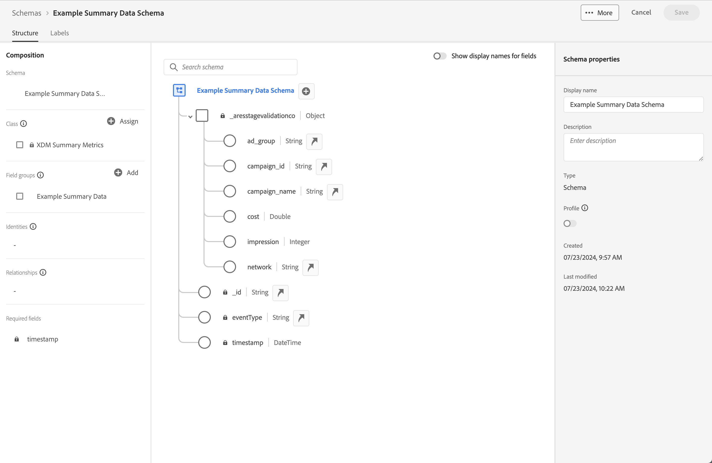
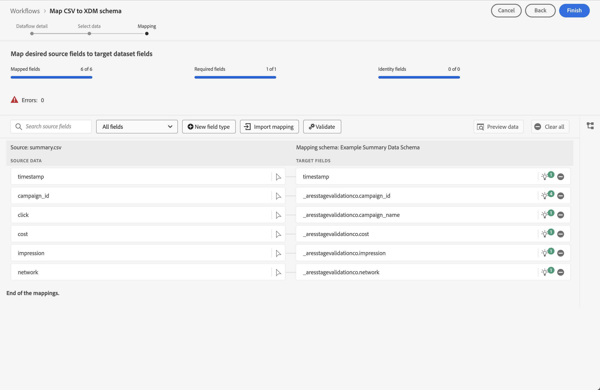
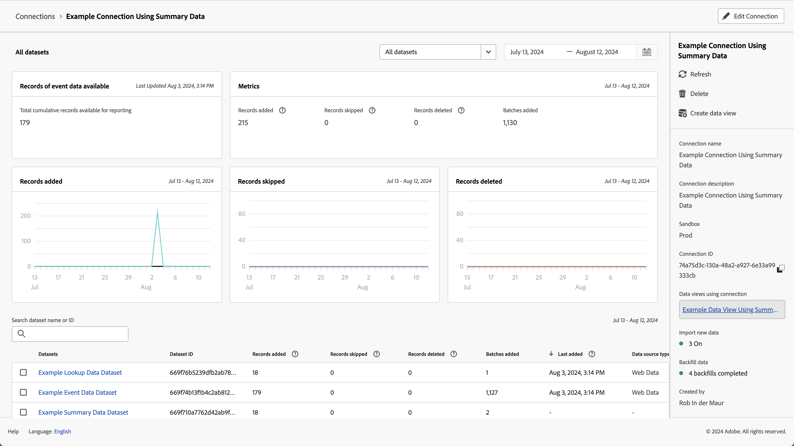
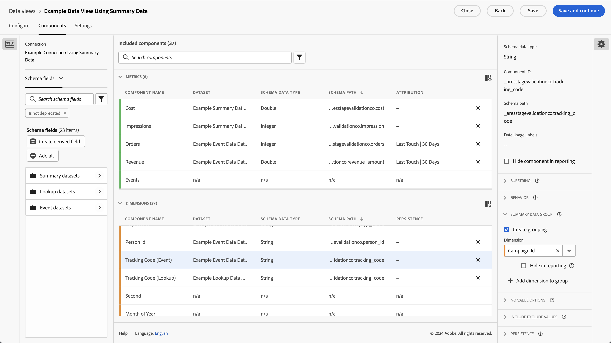
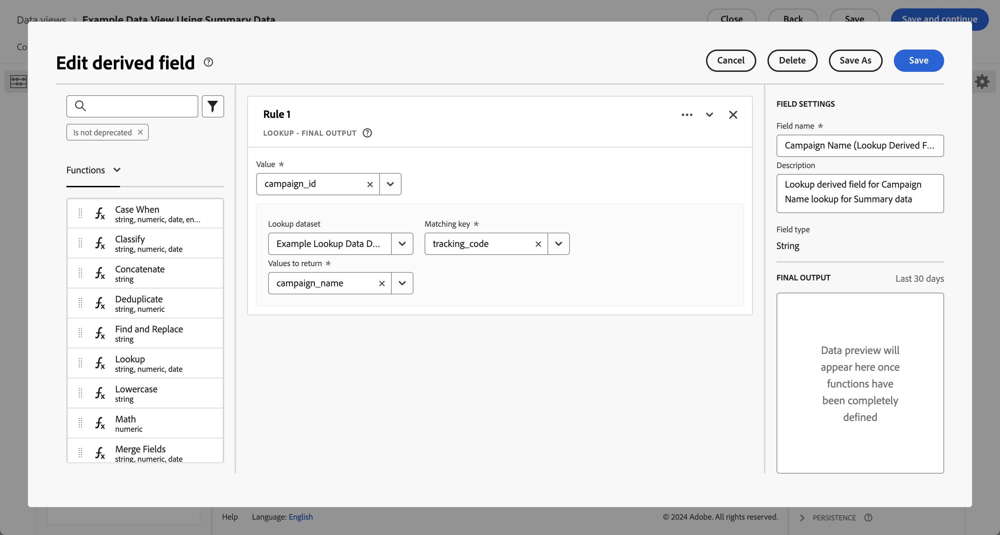
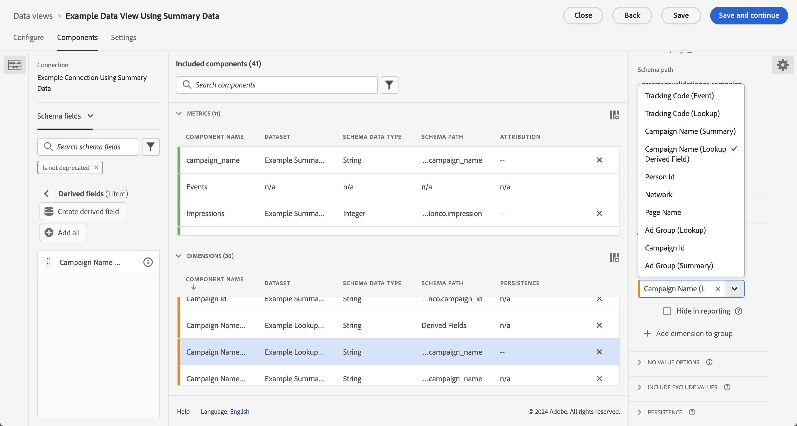
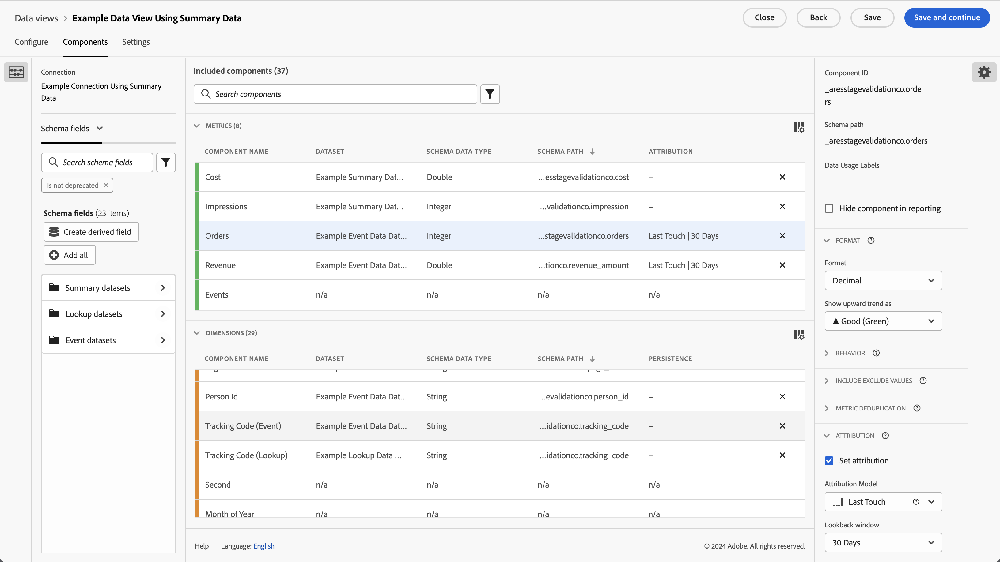
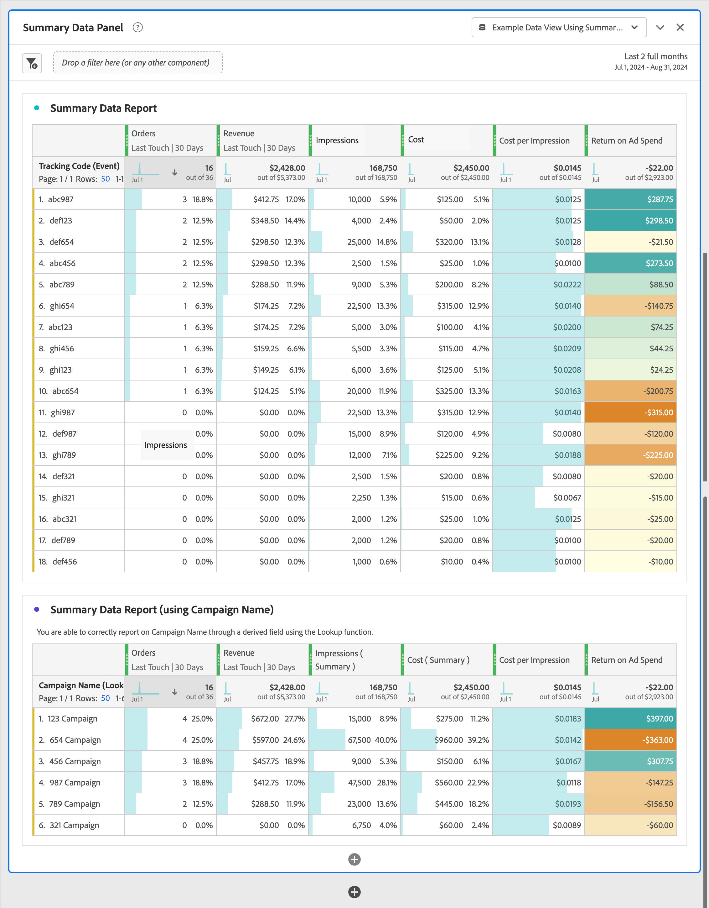

# Uso de datos de resumen

Este caso de uso sirve para ayudarle a comprender cómo utilizar los datos de resumen en los informes y análisis. El caso de uso detalla todos los pasos necesarios para utilizar los datos de resumen en Customer Journey Analytics:

- [Ingesta](#ingest) de datos de resumen y otras fuentes de datos en Experience Platform.
- Configure su [conexión](#connection) para los datos de resumen y otras fuentes de datos.
- Configure su [vista de datos](#data-view) para combinar sus fuentes de datos.
- Informar y analizar en [Workspace](#workspace) sobre los datos combinados.

El caso de uso proporciona datos de ejemplo para datos de resumen, datos de evento y datos de búsqueda. Todos los datos contienen valores aleatorios.

## Ingesta

Utilice los siguientes datos de resumen de ejemplo para este caso de uso, que muestran datos de resumen para ejecutar campañas en Facebook.

+++Datos de resumen

| _id | campaign_name | coste | impresión | campaign_id | Red | ad_group | timestamp |
|---|---|---:|---:|---|---|---|---|
| 1 | Campaña 123 | 100 | 5000 | abc123 | facebook | abc-adgroup | 18T18:20:39.000Z, 07-2024 |
| 2 | Campaña 123 | 50 | 4000 | def123 | facebook | def-adgroup | 18T18:20:39.000Z, 07-2024 |
| 3 | Campaña 123 | 125 | 6000 | ghi123 | facebook | ghi-adgroup | 18T18:20:39.000Z, 07-2024 |
| 4 | Campaña 456 | 25 | 2500 | abc456 | facebook | abc-adgroup | 18T18:20:39.000Z, 07-2024 |
| 5 | Campaña 456 | 10 | 1000 | def456 | facebook | def-adgroup | 18T18:20:39.000Z, 07-2024 |
| 6 | Campaña 456 | 115 | 5500 | ghi456 | facebook | ghi-adgroup | 18T18:20:39.000Z, 07-2024 |
| 7 | Campaña 789 | 200 | 9000 | abc789 | facebook | abc-adgroup | 18T18:20:39.000Z, 07-2024 |
| 8 | Campaña 789 | 20 | 2000 | def789 | facebook | def-adgroup | 18T18:20:39.000Z, 07-2024 |
| 9 | Campaña 789 | 225 | 12000 | ghi789 | facebook | ghi-adgroup | 18T18:20:39.000Z, 07-2024 |
| 10 | Campaña 987 | 125 | 10000 | abc987 | facebook | abc-adgroup | 18T18:20:39.000Z, 07-2024 |
| 11 | Campaña 987 | 120 | 15000 | def987 | facebook | def-adgroup | 18T18:20:39.000Z, 07-2024 |
| 12 | Campaña 987 | 315 | 22500 | ghi987 | facebook | ghi-adgroup | 18T18:20:39.000Z, 07-2024 |
| 13 | Campaña 654 | 325 | 20000 | abc654 | facebook | abc-adgroup | 18T18:20:39.000Z, 07-2024 |
| 14 | Campaña 654 | 320 | 25000 | def654 | facebook | def-adgroup | 18T18:20:39.000Z, 07-2024 |
| 15 | Campaña 654 | 315 | 22500 | ghi654 | facebook | ghi-adgroup | 18T18:20:39.000Z, 07-2024 |
| 16 | Campaña 321 | 25 | 2000 | abc321 | facebook | abc-adgroup | 18T18:20:39.000Z, 07-2024 |
| 17 | Campaña 321 | 20 | 2500 | def321 | facebook | def-adgroup | 18T18:20:39.000Z, 07-2024 |
| 18 | Campaña 321 | 15 | 2250 | ghi321 | facebook | ghi-adgroup | 18T18:20:39.000Z, 07-2024 |

+++

Para utilizar los datos de resumen en Customer Journey Analytics, en un informe o como parte del análisis de datos en Workspace, necesita lo siguiente

- un esquema de resumen en Experience Platform,
- un conjunto de datos de resumen en Experience Platform,
- una conexión en Customer Journey Analytics configurada para utilizar el conjunto de datos de resumen,
- una vista de datos en Customer Journey Analytics, correctamente configurada con métricas y dimensiones para los datos de resumen.

Este resumen de datos se utiliza junto con un conjunto de datos para datos de evento y un conjunto de datos para datos de búsqueda.

+++Datos de evento

Los datos de evento están disponibles en el Ejemplo de conjunto de datos de evento. Los datos de ejemplo tienen este aspecto:

| timestamp | _id | page_name | person_id | tracking_code | pedidos | revenue_amount |
|---|---:|---|---|---|---:|---:|
| 18-07-2024-19:15:39+00:00 | 1 | página de inicio | person-1abc123 | abc123 |  |  |
| 18-07-2024-19:15:39+00:00 | 2 | página de confirmación | person-1abc123 |  | 1 | 174,25 |
| 18-07-2024-19:15:39+00:00 | 3 | página de inicio | person-2def123 | def123 |  |  |
| 18-07-2024-19:15:39+00:00 | 4 | página de inicio | person-3ghi123 | ghi123 |  |  |
| 18-07-2024-19:15:39+00:00 | 5 | página de confirmación | person-3ghi123 |  | 1 | 149,25 |
| 18-07-2024-19:15:39+00:00 | 6 | página de inicio | person-4abc456 | abc456 |  |  |
| 18-07-2024-19:15:39+00:00 | 7 | página de inicio | person-5def456 | def456 |  |  |
| 18-07-2024-19:15:39+00:00 | 8 | página de inicio | person-6ghi456 | ghi456 |  |  |
| 18-07-2024-19:15:39+00:00 | 9 | página de confirmación | person-6ghi456 |  | 1 | 159,25 |
| 18-07-2024-19:15:39+00:00 | 10 | página de inicio | person-7abc789 | abc789 |  |  |
| 18-07-2024-19:15:39+00:00 | 11 | página de inicio | person-8def789 | def789 |  |  |
| 18-07-2024-19:15:39+00:00 | 12 | página de inicio | person-9ghi789 | ghi789 |  |  |
| 18-07-2024-19:15:39+00:00 | 13 | página de confirmación | person-9ghi789 |  | 1 | 124,25 |
| 18-07-2024-19:15:39+00:00 | 14 | página de inicio | person-10abc987 | abc987 |  |  |
| 18-07-2024-19:15:39+00:00 | 15 | página de inicio | person-11def987 | def987 |  |  |
| 18-07-2024-19:15:39+00:00 | 16 | página de inicio | person-12ghi987 | ghi987 |  |  |
| 18-07-2024-19:15:39+00:00 | 17 | página de inicio | person-13abc654 | abc654 |  |  |
| 18-07-2024-19:15:39+00:00 | 18 | página de inicio | person-14def654 | def654 |  |  |
| 18-07-2024-19:15:39+00:00 | 19 | página de inicio | person-15ghi654 | ghi654 |  |  |
| 18-07-2024-19:15:39+00:00 | 20 | página de confirmación | person-15ghi654 |  | 1 | 174,25 |
| 18-07-2024-19:15:39+00:00 | 21 | página de inicio | person-16abc321 | abc321 |  |  |
| 18-07-2024-19:15:39+00:00 | 22 | página de inicio | person-17def321 | def321 |  |  |
| 18-07-2024-19:15:39+00:00 | 23 | página de inicio | person-18ghi321 | ghi321 |  |  |
| 18-07-2024-19:15:39+00:00 | 24 | página de inicio | person-19abc123 | abc123 |  |  |
| 18-07-2024-19:15:39+00:00 | 25 | página de inicio | person-20def123 | def123 |  |  |
| 18-07-2024-19:15:39+00:00 | 26 | página de inicio | person-21ghi123 | ghi123 |  |  |
| 18-07-2024-19:15:39+00:00 | 27 | página de confirmación | person-21ghi123 |  | 1 | 149,25 |
| 18-07-2024-19:15:39+00:00 | 28 | página de inicio | person-22abc456 | abc456 |  |  |
| 18-07-2024-19:15:39+00:00 | 29 | página de inicio | person-23def456 | def456 |  |  |
| 18-07-2024-19:15:39+00:00 | 30 | página de inicio | person-24ghi456 | ghi456 |  |  |
| 18-07-2024-19:15:39+00:00 | 31 | página de inicio | person-25abc789 | abc789 |  |  |
| 18-07-2024-19:15:39+00:00 | 32 | página de confirmación | person-25abc789 |  | 1 | 139,25 |
| 18-07-2024-19:15:39+00:00 | 33 | página de inicio | person-26abc987 | abc987 |  |  |
| 18-07-2024-19:15:39+00:00 | 34 | página de inicio | person-27def987 | def987 |  |  |
| 18-07-2024-19:15:39+00:00 | 35 | página de inicio | person-28ghi987 | ghi987 |  |  |
| 18-07-2024-19:15:39+00:00 | 36 | página de inicio | person-29abc654 | abc654 |  |  |
| 18-07-2024-19:15:39+00:00 | 37 | página de confirmación | person-29abc654 |  | 1 | 124,25 |
| 18-07-2024-19:15:39+00:00 | 38 | página de inicio | person-30def654 | def654 |  |  |
| 18-07-2024-19:15:39+00:00 | 39 | página de inicio | person-31ghi654 | ghi654 |  |  |
| 18-07-2024-19:15:39+00:00 | 40 | página de inicio | person-32abc321 | abc321 |  |  |
| 18-07-2024-19:15:39+00:00 | 41 | página de inicio | person-33ghi456 | ghi456 |  |  |
| 18-07-2024-19:15:39+00:00 | 42 | página de confirmación | person-33ghi456 |  | 1 | 174,25 |
| 18-07-2024-19:15:39+00:00 | 43 | página de inicio | person-34abc789 | abc789 |  |  |
| 18-07-2024-19:15:39+00:00 | 44 | página de inicio | person-35def789 | def789 |  |  |
| 18-07-2024-19:15:39+00:00 | 45 | página de inicio | person-36ghi789 | ghi789 |  |  |
| 18-07-2024-19:15:39+00:00 | 46 | página de confirmación | person-36ghi789 |  | 1 | 149,25 |
| 18-07-2024-19:15:39+00:00 | 47 | página de inicio | person-37abc987 | abc987 |  |  |
| 18-07-2024-19:15:39+00:00 | 48 | página de inicio | person-38def987 | def987 |  |  |
| 18-07-2024-19:15:39+00:00 | 49 | página de inicio | person-39ghi987 | ghi987 |  |  |
| 18-07-2024-19:15:39+00:00 | 50 | página de inicio | person-40abc654 | abc654 |  |  |
| 18-07-2024-19:15:39+00:00 | 51 | página de confirmación | person-40abc654 |  | 1 | 124,25 |
| 18-07-2024-19:15:39+00:00 | 52 | página de inicio | person-41def654 | def654 |  |  |
| 18-07-2024-19:15:39+00:00 | 53 | página de inicio | person-42ghi654 | ghi654 |  |  |
| 18-07-2024-19:15:39+00:00 | 54 | página de inicio | person-43abc321 | abc321 |  |  |
| 18-07-2024-19:15:39+00:00 | 55 | página de inicio | person-44def321 | def321 |  |  |
| 18-07-2024-19:15:39+00:00 | 56 | página de inicio | person-45ghi321 | ghi321 |  |  |
| 18-07-2024-19:15:39+00:00 | 57 | página de inicio | person-46abc123 | abc123 |  |  |
| 18-07-2024-19:15:39+00:00 | 58 | página de confirmación | person-46abc123 |  | 1 | 174,25 |
| 18-07-2024-19:15:39+00:00 | 59 | página de inicio | person-47def123 | def123 |  |  |
| 18-07-2024-19:15:39+00:00 | 60 | página de inicio | persona-48ghi123 | ghi123 |  |  |
| 18-07-2024-19:15:39+00:00 | 61 | página de inicio | person-49abc456 | abc456 |  |  |
| 18-07-2024-19:15:39+00:00 | 62 | página de inicio | person-50def456 | def456 |  |  |
| 18-07-2024-19:15:39+00:00 | 63 | página de inicio | person-51ghi456 | ghi456 |  |  |
| 18-07-2024-19:15:39+00:00 | 64 | página de inicio | person-52abc789 | abc789 |  |  |
| 18-07-2024-19:15:39+00:00 | 65 | página de confirmación | person-52abc789 |  | 1 | 149,25 |
| 18-07-2024-19:15:39+00:00 | 66 | página de inicio | person-53abc987 | abc987 |  |  |
| 18-07-2024-19:15:39+00:00 | 67 | página de inicio | person-54def987 | def987 |  |  |
| 18-07-2024-19:15:39+00:00 | 68 | página de inicio | person-55ghi987 | ghi987 |  |  |
| 18-07-2024-19:15:39+00:00 | 69 | página de confirmación | person-55ghi987 |  | 1 | 124,25 |
| 18-07-2024-19:15:39+00:00 | 70 | página de inicio | person-56abc123 | abc123 |  |  |
| 18-07-2024-19:15:39+00:00 | 71 | página de inicio | person-57def123 | def123 |  |  |
| 18-07-2024-19:15:39+00:00 | 72 | página de confirmación | person-57def123 |  | 1 | 174,25 |
| 18-07-2024-19:15:39+00:00 | 73 | página de inicio | persona-58ghi123 | ghi123 |  |  |
| 18-07-2024-19:15:39+00:00 | 74 | página de inicio | person-59abc456 | abc456 |  |  |
| 18-07-2024-19:15:39+00:00 | 75 | página de confirmación | person-59abc456 |  | 1 | 149,25 |
| 18-07-2024-19:15:39+00:00 | 76 | página de inicio | person-60def456 | def456 |  |  |
| 18-07-2024-19:15:39+00:00 | 77 | página de inicio | person-61ghi456 | ghi456 |  |  |
| 18-07-2024-19:15:39+00:00 | 78 | página de inicio | person-62abc789 | abc789 |  |  |
| 18-07-2024-19:15:39+00:00 | 79 | página de confirmación | person-62abc789 |  | 1 | 159,25 |
| 18-07-2024-19:15:39+00:00 | 80 | página de inicio | person-63def789 | def789 |  |  |
| 18-07-2024-19:15:39+00:00 | 81 | página de inicio | person-64ghi789 | ghi789 |  |  |
| 18-07-2024-19:15:39+00:00 | 82 | página de inicio | person-65abc987 | abc987 |  |  |
| 18-07-2024-19:15:39+00:00 | 83 | página de confirmación | person-65abc987 |  | 1 | 124,25 |
| 18-07-2024-19:15:39+00:00 | 84 | página de inicio | person-66def987 | def987 |  |  |
| 18-07-2024-19:15:39+00:00 | 85 | página de inicio | person-67ghi987 | ghi987 |  |  |
| 18-07-2024-19:15:39+00:00 | 86 | página de inicio | person-68abc654 | abc654 |  |  |
| 18-07-2024-19:15:39+00:00 | 87 | página de inicio | person-69def654 | def654 |  |  |
| 18-07-2024-19:15:39+00:00 | 88 | página de inicio | person-70ghi654 | ghi654 |  |  |
| 18-07-2024-19:15:39+00:00 | 89 | página de inicio | person-71abc321 | abc321 |  |  |
| 18-07-2024-19:15:39+00:00 | 90 | página de confirmación | person-71abc321 |  | 1 | 174,25 |
| 18-07-2024-19:15:39+00:00 | 91 | página de inicio | person-72def321 | def321 |  |  |
| 18-07-2024-19:15:39+00:00 | 92 | página de inicio | person-73ghi321 | ghi321 |  |  |
| 18-07-2024-19:15:39+00:00 | 93 | página de inicio | person-74abc123 | abc123 |  |  |
| 18-07-2024-19:15:39+00:00 | 94 | página de inicio | person-75def123 | def123 |  |  |
| 18-07-2024-19:15:39+00:00 | 95 | página de inicio | persona-76ghi123 | ghi123 |  |  |
| 18-07-2024-19:15:39+00:00 | 96 | página de inicio | person-77abc456 | abc456 |  |  |
| 18-07-2024-19:15:39+00:00 | 97 | página de confirmación | person-77abc456 |  | 1 | 149,25 |
| 18-07-2024-19:15:39+00:00 | 98 | página de inicio | person-78def456 | def456 |  |  |
| 18-07-2024-19:15:39+00:00 | 99 | página de inicio | person-79ghi456 | ghi456 |  |  |
| 18-07-2024-19:15:39+00:00 | 100 | página de inicio | person-80abc789 | abc789 |  |  |
| 18-07-2024-19:15:39+00:00 | 101 | página de inicio | person-81abc987 | abc987 |  |  |
| 18-07-2024-19:15:39+00:00 | 102 | página de confirmación | person-81abc987 |  | 1 | 139,25 |
| 18-07-2024-19:15:39+00:00 | 103 | página de inicio | person-82def987 | def987 |  |  |
| 18-07-2024-19:15:39+00:00 | 104 | página de inicio | person-83ghi987 | ghi987 |  |  |
| 18-07-2024-19:15:39+00:00 | 105 | página de inicio | person-84abc654 | abc654 |  |  |
| 18-07-2024-19:15:39+00:00 | 106 | página de inicio | person-85def654 | def654 |  |  |
| 18-07-2024-19:15:39+00:00 | 107 | página de confirmación | person-85def654 |  | 1 | 124,25 |
| 18-07-2024-19:15:39+00:00 | 108 | página de inicio | person-86ghi654 | ghi654 |  |  |
| 18-07-2024-19:15:39+00:00 | 109 | página de inicio | person-87abc321 | abc321 |  |  |
| 18-07-2024-19:15:39+00:00 | 110 | página de inicio | person-88ghi456 | ghi456 |  |  |
| 18-07-2024-19:15:39+00:00 | 111 | página de inicio | person-89abc789 | abc789 |  |  |
| 18-07-2024-19:15:39+00:00 | 112 | página de confirmación | person-89abc789 |  | 1 | 174,25 |
| 18-07-2024-19:15:39+00:00 | 113 | página de inicio | person-90def789 | def789 |  |  |
| 18-07-2024-19:15:39+00:00 | 114 | página de inicio | person-91ghi789 | ghi789 |  |  |
| 18-07-2024-19:15:39+00:00 | 115 | página de inicio | person-92abc987 | abc987 |  |  |
| 18-07-2024-19:15:39+00:00 | 116 | página de confirmación | person-92abc987 |  | 1 | 149,25 |
| 18-07-2024-19:15:39+00:00 | 117 | página de inicio | person-93def987 | def987 |  |  |
| 18-07-2024-19:15:39+00:00 | 118 | página de inicio | person-94ghi987 | ghi987 |  |  |
| 18-07-2024-19:15:39+00:00 | 119 | página de inicio | person-95abc654 | abc654 |  |  |
| 18-07-2024-19:15:39+00:00 | 120 | página de inicio | person-96def654 | def654 |  |  |
| 18-07-2024-19:15:39+00:00 | 121 | página de confirmación | person-96def654 |  | 1 | 124,25 |
| 18-07-2024-19:15:39+00:00 | 122 | página de inicio | person-97ghi654 | ghi654 |  |  |
| 18-07-2024-19:15:39+00:00 | 123 | página de inicio | person-98abc321 | abc321 |  |  |
| 18-07-2024-19:15:39+00:00 | 124 | página de inicio | person-99def321 | def321 |  |  |
| 18-07-2024-19:15:39+00:00 | 125 | página de inicio | persona-100ghi321 | ghi321 |  |  |
| 18-07-2024-19:15:39+00:00 | 126 | página de inicio | person-101abc123 | abc123 |  |  |
| 18-07-2024-19:15:39+00:00 | 127 | página de inicio | person-102def123 | def123 |  |  |
| 18-07-2024-19:15:39+00:00 | 128 | página de confirmación | person-102def123 |  | 1 | 174,25 |
| 18-07-2024-19:15:39+00:00 | 129 | página de inicio | persona-103ghi123 | ghi123 |  |  |
| 18-07-2024-19:15:39+00:00 | 130 | página de inicio | person-104abc456 | abc456 |  |  |
| 18-07-2024-19:15:39+00:00 | 131 | página de inicio | person-105def456 | def456 |  |  |
| 18-07-2024-19:15:39+00:00 | 132 | página de inicio | persona-106ghi456 | ghi456 |  |  |
| 18-07-2024-19:15:39+00:00 | 133 | página de inicio | person-107abc789 | abc789 |  |  |
| 18-07-2024-19:15:39+00:00 | 134 | página de inicio | person-108abc987 | abc987 |  |  |
| 18-07-2024-19:15:39+00:00 | 135 | página de confirmación | person-108abc987 |  | 1 | 149,25 |
| 18-07-2024-19:15:39+00:00 | 136 | página de inicio | person-109def987 | def987 |  |  |
| 18-07-2024-19:15:39+00:00 | 137 | página de inicio | person-110ghi987 | ghi987 |  |  |
| 18-07-2024-19:15:39+00:00 | 138 | página de confirmación | person-110ghi987 |  |  |  |
| 18-07-2024-19:15:39+00:00 | 139 | página de inicio | person-111def987 | def987 |  |  |
| 18-07-2024-19:15:39+00:00 | 140 | página de inicio | person-112def987 |  | 1 | 124,25 |
| 18-07-2024-19:15:39+00:00 | 141 | página de confirmación | person-112def987 |  | 1 | 149,25 |
| 18-07-2024-19:15:39+00:00 | 142 | página de inicio | person-113ghi987 | ghi987 |  |  |
| 18-07-2024-19:15:39+00:00 | 143 | página de inicio | person-114abc654 | abc654 |  |  |
| 18-07-2024-19:15:39+00:00 | 144 | página de inicio | person-115def654 | def654 |  |  |
| 18-07-2024-19:15:39+00:00 | 145 | página de confirmación | person-115def654 |  | 1 | 159,25 |
| 18-07-2024-19:15:39+00:00 | 146 | página de inicio | person-116ghi654 | ghi654 |  |  |
| 18-07-2024-19:15:39+00:00 | 147 | página de inicio | person-117abc321 | abc321 |  |  |
| 18-07-2024-19:15:39+00:00 | 148 | página de inicio | person-118def321 | def321 |  |  |
| 18-07-2024-19:15:39+00:00 | 149 | página de confirmación | person-118def321 |  | 1 | 124,25 |
| 18-07-2024-19:15:39+00:00 | 150 | página de inicio | person-119ghi321 | ghi321 |  |  |
| 18-07-2024-19:15:39+00:00 | 151 | página de inicio | person-120abc123 | abc123 |  |  |
| 18-07-2024-19:15:39+00:00 | 152 | página de inicio | person-121def123 | def123 |  |  |
| 18-07-2024-19:15:39+00:00 | 153 | página de inicio | person-122ghi123 | ghi123 |  |  |
| 18-07-2024-19:15:39+00:00 | 154 | página de inicio | person-123abc456 | abc456 |  |  |
| 18-07-2024-19:15:39+00:00 | 155 | página de inicio | person-124def456 | def456 |  |  |
| 18-07-2024-19:15:39+00:00 | 156 | página de confirmación | person-124def456 |  | 1 | 174,25 |
| 18-07-2024-19:15:39+00:00 | 157 | página de inicio | person-125ghi456 | ghi456 |  |  |
| 18-07-2024-19:15:39+00:00 | 158 | página de inicio | person-126abc789 | abc789 |  |  |
| 18-07-2024-19:15:39+00:00 | 159 | página de inicio | person-127abc987 | abc987 |  |  |
| 18-07-2024-19:15:39+00:00 | 160 | página de inicio | person-128def987 | def987 |  |  |
| 18-07-2024-19:15:39+00:00 | 161 | página de inicio | person-129ghi987 | ghi987 |  |  |
| 18-07-2024-19:15:39+00:00 | 162 | página de inicio | person-130abc654 | abc654 |  |  |
| 18-07-2024-19:15:39+00:00 | 163 | página de confirmación | person-130abc654 |  | 1 | 149,25 |
| 18-07-2024-19:15:39+00:00 | 164 | página de inicio | person-131def654 | def654 |  |  |
| 18-07-2024-19:15:39+00:00 | 165 | página de inicio | person-132ghi654 | ghi654 |  |  |
| 18-07-2024-19:15:39+00:00 | 166 | página de inicio | person-133abc321 | abc321 |  |  |
| 18-07-2024-19:15:39+00:00 | 167 | página de inicio | person-134ghi456 | ghi456 |  |  |
| 18-07-2024-19:15:39+00:00 | 168 | página de confirmación | person-134ghi456 |  | 1 | 139,25 |
| 18-07-2024-19:15:39+00:00 | 169 | página de inicio | person-135abc789 | abc789 |  |  |
| 18-07-2024-19:15:39+00:00 | 170 | página de inicio | person-136def789 | def789 |  |  |
| 18-07-2024-19:15:39+00:00 | 171 | página de inicio | person-137ghi789 | ghi789 |  |  |
| 18-07-2024-19:15:39+00:00 | 172 | página de inicio | person-138abc987 | abc987 |  |  |
| 18-07-2024-19:15:39+00:00 | 173 | página de confirmación | person-138abc987 |  | 1 | 124,25 |
| 18-07-2024-19:15:39+00:00 | 174 | página de inicio | person-139def987 | def987 |  |  |
| 18-07-2024-19:15:39+00:00 | 175 | página de inicio | person-140ghi987 | ghi987 |  |  |
| 18-07-2024-19:15:39+00:00 | 176 | página de inicio | person-141abc654 | abc654 |  |  |
| 18-07-2024-19:15:39+00:00 | 177 | página de inicio | person-142def654 | def654 |  |  |
| 18-07-2024-19:15:39+00:00 | 178 | página de confirmación | person-142def654 |  | 1 | 174,25 |
| 18-07-2024-19:15:39+00:00 | 179 | página de inicio | person-143ghi654 | ghi654 |  |  |

+++

+++ Datos de búsqueda

Los datos de búsqueda están disponibles en el Ejemplo de conjunto de datos de búsqueda. Los datos de ejemplo tienen este aspecto:

| _id | tracking_code | ad_group | campaign_name |
|---|---|---|---|
| 1 | abc123 | abc-adgroup | Campaña 123 |
| 2 | def123 | def-adgroup | Campaña 123 |
| 3 | ghi123 | ghi-adgroup | Campaña 123 |
| 4 | abc456 | abc-adgroup | Campaña 456 |
| 5 | def456 | def-adgroup | Campaña 456 |
| 6 | ghi456 | ghi-adgroup | Campaña 456 |
| 7 | abc789 | abc-adgroup | Campaña 789 |
| 8 | def789 | def-adgroup | Campaña 789 |
| 9 | ghi789 | ghi-adgroup | Campaña 789 |
| 10 | abc987 | abc-adgroup | Campaña 987 |
| 11 | def987 | def-adgroup | Campaña 987 |
| 12 | ghi987 | ghi-adgroup | Campaña 987 |
| 13 | abc654 | abc-adgroup | Campaña 654 |
| 14 | def654 | def-adgroup | Campaña 654 |
| 15 | ghi654 | ghi-adgroup | Campaña 654 |
| 16 | abc321 | abc-adgroup | Campaña 321 |
| 17 | def321 | def-adgroup | Campaña 321 |
| 18 | ghi321 | ghi-adgroup | Campaña 321 |

+++

>[!INFO]
>
>No se proporcionan más detalles para configurar esquemas y conjuntos de datos para los datos de evento y búsqueda. Se supone que esta configuración es conocida y sigue los mismos pasos que para los datos de búsqueda.
>

### Esquema de resumen

Los datos de resumen necesitan un esquema de resumen en Experience Platform. Un esquema de resumen es un esquema que utiliza las métricas de resumen de XDM como clase base.

Para crear un esquema de resumen en Experience Platform:

1. Seleccione **[!UICONTROL Experience Platform]** del      conmutador de aplicación.
1. Seleccione **[!UICONTROL Esquemas]** en el carril izquierdo.
1. Seleccione  **[!UICONTROL Crear esquema]**.
1. Seleccione **[!UICONTROL Manual]** en el diálogo **[!UICONTROL Crear un esquema]**. A continuación, usa **[!UICONTROL Select]** para continuar.
1. En el paso **[!UICONTROL Seleccionar una clase]** del asistente **[!UICONTROL Esquemas]** > **[!UICONTROL Crear esquema]**, seleccione **[!UICONTROL Otro]** de las opciones **[!UICONTROL Seleccionar una clase base para este esquema]**.
1. En la lista, seleccione **[!UICONTROL Métricas de resumen de XDM]** (o use el campo  para buscar) y seleccione **[!UICONTROL Siguiente]**.
1. En el paso **[!UICONTROL Nombrar y revisar]** del asistente **[!UICONTROL Esquemas]** > **[!UICONTROL Crear esquema]**, escriba un **[!UICONTROL Nombre para mostrar esquema]**, por ejemplo `Example Summary Data Schema` y una descripción opcional. Seleccione **[!UICONTROL Finalizar]** para finalizar este paso.

Se muestra la estructura del esquema de resumen base, lista para ampliarse con los campos de los datos de resumen. Los campos se agregan a un esquema mediante grupos de campos.

Para agregar un grupo de campos que contenga los campos de los datos de ejemplo:

1. Seleccione  **[!UICONTROL Add]** en **[!UICONTROL Grupos de campos]**.
1. En el diálogo **[!UICONTROL Agregar grupos de campos]**, seleccione **[!UICONTROL Crear nuevo grupo de campos]**.
1. Escriba un **[!UICONTROL nombre para mostrar]** para el grupo de campos, por ejemplo `Example Summary Data`. Opcionalmente, proporcione una descripción.
1. Seleccione **[!UICONTROL Agregar grupos de campos]**.
1. Ha vuelto a la interfaz de usuario de la estructura de esquema. Seleccione los nuevos **[!UICONTROL Datos de resumen de ejemplo]** en **[!UICONTROL Grupos de campos]**.
1. Seleccione  junto al nombre de esquema **[!UICONTROL Ejemplo de esquema de datos de resumen]**. Se abre un panel **[!UICONTROL Propiedades del campo]** que le permite agregar detalles para un campo.
   1. Escriba un **[!UICONTROL nombre de campo]**: `campaign_id`
   1. Escriba un **[!UICONTROL nombre para mostrar]**: `campaign_id`
   1. Seleccione un **[!UICONTROL Tipo]** del menú desplegable **[!UICONTROL Seleccionar tipo de datos]**: **[!UICONTROL Cadena]**
   1. Asegúrese de que la opción **[!UICONTROL Asignar a]** **[!UICONTROL Grupo de campos]** esté seleccionada y seleccione **[!UICONTROL Datos de resumen de ejemplo]** del menú desplegable.
   1. Desplácese hacia abajo hasta la parte inferior y seleccione **[!UICONTROL Aplicar]**.
1. Repita el paso anterior para los demás campos de los datos de resumen. Consulte la tabla siguiente para ver los valores correctos.

   | Nombre de campo | Nombre para mostrar | Tipo | Grupo de campo |
   |---|---|---|---|
   | `ad_group` | `ad_group` | Cadena | Ejemplo de datos de resumen |
   | `campaign_name` | `campaign_name` | Cadena | Ejemplo de datos de resumen |
   | `cost` | `cost` | Doble | Ejemplo de datos de resumen |
   | `impression` | `impression` | Número entero | Ejemplo de datos de resumen |
   | `network` | `network` | Cadena | Ejemplo de datos de resumen |

1. Para guardar el grupo de campos **[!UICONTROL Datos de resumen de ejemplo]** como parte del esquema, seleccione **[!UICONTROL Guardar]**. Verá una confirmación cuando su esquema se guarde correctamente.

Ahora ha definido un esquema que detalla el modelo de los datos de resumen. Similar al de abajo.

### Conjunto de datos resumidos

Para almacenar los datos de resumen en Experience Platform, primero debe crear un conjunto de datos y luego cargar los datos de resumen en el conjunto de datos.

Para crear un conjunto de datos:

1. Seleccione **[!UICONTROL Experience Platform]** del      conmutador de aplicación.
1. Seleccione **[!UICONTROL Conjuntos de datos]** en el carril izquierdo.
1. Seleccione  **[!UICONTROL Crear conjunto de datos]**.
1. En la pantalla **[!UICONTROL Conjuntos de datos]** > **[!UICONTROL Crear conjuntos de datos]**, seleccione **[!UICONTROL Crear conjunto de datos a partir del esquema]**.
1. En el paso **[!UICONTROL Seleccionar esquema]** del asistente **[!UICONTROL Flujos de trabajo]** > **[!UICONTROL Crear conjunto de datos a partir del esquema]**,  buscar y seleccionar su **[!UICONTROL Ejemplo de esquema de datos de resumen]**.
1. Seleccione **[!UICONTROL Siguiente]**.
1. En el paso **[!UICONTROL Configurar conjunto de datos]** del asistente **[!UICONTROL Flujos de trabajo]** > **[!UICONTROL Crear conjunto de datos a partir de esquema]**:
   1. Escriba un **[!UICONTROL Nombre]** para el conjunto de datos, por ejemplo: `Example Summary Data Dataset`. Opcionalmente, proporcione una descripción.
   1. Seleccione **[!UICONTROL Finalizar]**.

Aparecerá una pantalla con los detalles del nuevo conjunto de datos.

Para cargar los datos de ejemplo en este conjunto de datos:

1. Seleccione **[!UICONTROL Experience Platform]** del      conmutador de aplicación.
1. Seleccione **[!UICONTROL Flujos de trabajo]** en el carril izquierdo.
   1. Seleccione **[!UICONTROL Asignar CSV a esquema XDM]** de las opciones **[!UICONTROL Ingesta de datos]** en la pantalla **[!UICONTROL Flujos de trabajo]**.
   1. Seleccione **[!UICONTROL Launch]** del panel **[!UICONTROL Asignar CSV al esquema XDM]**.
1. En el paso **[!UICONTROL Detalle del flujo de datos]** del asistente **[!UICONTROL Flujos de trabajo]** > **[!UICONTROL Asignar CSV al esquema XDM]**:
   1. Seleccione **[!UICONTROL Conjunto de datos existente]** para **[!UICONTROL Conjunto de datos de destino]**.
   1. Seleccione **[!UICONTROL Ejemplo de conjunto de datos de resumen]** en el menú desplegable.
   1. Seleccione **[!UICONTROL Siguiente]**.
1. En el paso **[!UICONTROL Seleccionar datos]** del asistente **[!UICONTROL Flujos de trabajo]** > **[!UICONTROL Asignar CSV al esquema XDM]**:
   1. Arrastre y suelte su archivo con datos de resumen en formato CSV en **[!UICONTROL Arrastre y suelte los archivos]**. También puede usar **[!UICONTROL Elegir archivos]** para seleccionar el archivo.
   1. Asegúrese de que **[!UICONTROL Data format]** y **[!UICONTROL Delimiter]** no tengan los valores correctos para los datos de ejemplo. Por ejemplo, **[!UICONTROL Delimitado]** como **[!UICONTROL Formato de datos]**, y **[!UICONTROL ,]** como **[!UICONTROL Delimitador]**.
   1. Se muestra una muestra (10 registros) de los datos de resumen en **[!UICONTROL Datos de muestra]**.
   1. Seleccione **[!UICONTROL Siguiente]**.
1. En el paso **[!UICONTROL Mapping]** del asistente **[!UICONTROL Workflows]** > **[!UICONTROL Asignar CSV a esquema XDM]**:
   
   1. Compruebe si todos los campos de datos de **[!UICONTROL Source Data]** están asignados correctamente a los **[!UICONTROL campos de destino]** correspondientes de su esquema. Para los datos de ejemplo, no se notifican errores porque ha asignado explícitamente un nombre a los campos del esquema similar a los nombres de campo de los datos de ejemplo. De lo contrario, puede utilizar esta pantalla para corregir la asignación.
   1. Si lo desea, puede seleccionar  **[!UICONTROL Validar]** para (una vez más) validar los datos.
   1. Si lo desea, puede seleccionar  **[!UICONTROL Vista previa de datos]** para abrir un cuadro de diálogo con una vista previa de los datos una vez cargados en el conjunto de datos.
   1. Seleccione **[!UICONTROL Finalizar]**.

En **[!UICONTROL Fuentes]** > **[!UICONTROL Flujo de datos - XX/XX/XXXX, XX:XX XX]**, aparece el estado de la carga. Actualice para ver las actualizaciones de la carga. Cuando se realice correctamente, los datos de ejemplo se cargarán en Experience Platform.

## Conexión

Para utilizar los datos de ejemplo en Customer Journey Analytics, cree una conexión que incluya el Conjunto de datos de resumen de ejemplo de Experience Platform.

1. Seleccione **[!UICONTROL Customer Journey Analytics]** del      conmutador de aplicación.
1. Seleccione **[!UICONTROL Conexiones]**, opcionalmente desde **[!UICONTROL Administración de datos]**, en el menú superior.
1. Seleccione **[!UICONTROL Crear nueva conexión]**.
1. En **[!UICONTROL Conexiones]** > **[!UICONTROL Conexión sin título]**:
   1. Escriba un **[!UICONTROL nombre de conexión]**, por ejemplo `Example Connection Using Summary Data`.
   1. Seleccione el simulador para pruebas que contiene el conjunto de datos que ha creado y los demás conjuntos de datos que desea incluir del menú desplegable Simulador para pruebas.
   1. Seleccione **[!UICONTROL menos de 1 millón]** del menú desplegable **[!UICONTROL Cantidad promedio de eventos diarios]**.
   1. Seleccione **[!UICONTROL Agregar conjuntos de datos]**.
   1. En el paso **[!UICONTROL Seleccionar conjuntos de datos]** del asistente **[!UICONTROL Agregar conjuntos de datos]**:
      1. Busque  y seleccione **[!UICONTROL Conjunto de datos de resumen de ejemplo]**, **[!UICONTROL Conjunto de datos de evento de ejemplo]** y **[!UICONTROL Conjunto de datos de búsqueda de ejemplo]**.
      1. Seleccione **[!UICONTROL Siguiente]**.
   1. En el paso **[!UICONTROL Configuración de conjuntos de datos]** del asistente **[!UICONTROL Agregar conjuntos de datos]**:

      1. Para el **[!UICONTROL Conjunto de datos de evento de ejemplo]**:

         1. Confirme que las selecciones de **[!UICONTROL ID de persona]** (`person_id`) y **[!UICONTROL Marca de tiempo]** son correctas.
         1. Seleccione **[!UICONTROL Datos web]** del **[!UICONTROL tipo de origen de datos]**.
         1. Habilitar **[!UICONTROL Importar todos los datos nuevos]**.
         1. Habilitar **[!UICONTROL Rellenar todos los datos existentes]**.

      1. Para el **[!UICONTROL Ejemplo de conjunto de datos de búsqueda]**:

         1. Seleccione **[!UICONTROL tracking_code]** como **[!UICONTROL clave]** y **[!UICONTROL tracking_code (conjuntos de datos de evento)]** como **[!UICONTROL clave que coincide]**.
         1. Seleccione **[!UICONTROL Datos web]** del **[!UICONTROL tipo de origen de datos]**.
         1. Habilitar **[!UICONTROL Importar todos los datos nuevos]**.
         1. Habilitar **[!UICONTROL Rellenar todos los datos existentes]**.

      1. Para el **[!UICONTROL Conjunto de datos de resumen de ejemplo]**:

         1. Confirme que las selecciones de **[!UICONTROL Marca de tiempo]** y **[!UICONTROL Zona horaria]** son correctas.
         1. Habilitar **[!UICONTROL Importar todos los datos nuevos]**.
         1. Habilitar **[!UICONTROL Rellenar todos los datos existentes]**.

      1. Seleccione **[!UICONTROL Agregar conjuntos de datos]**.

1. En la pantalla de conexión **[!UICONTROL Conexiones]** > **[!UICONTROL Ejemplo de conexión que usa datos de resumen]**, seleccione **[!UICONTROL Guardar]** para guardar la conexión.

Los datos de los conjuntos de datos se añaden a Customer Journey Analytics, que puede tardar un par de horas. Así que por favor, ten paciencia antes de continuar.

Después de un tiempo, compruebe que los datos de los conjuntos de datos se cargan correctamente en Customer Journey Analytics.

1. Seleccione **[!UICONTROL Customer Journey Analytics]** del      conmutador de aplicación.
1. Seleccione **[!UICONTROL Conexiones]**, opcionalmente desde **[!UICONTROL Administración de datos]**, en el menú superior.
1. Seleccione su conexión, por ejemplo **[!UICONTROL Ejemplo de conexión con datos de resumen]**.
1. Seleccione un intervalo de fechas adecuado en los detalles de **[!UICONTROL Conexión]** > **[!UICONTROL Ejemplo de conexión con datos de resumen]**.
   1. Seleccione  y, a continuación, **[!UICONTROL Últimos 7 días]**.
   1. Seleccione **[!UICONTROL Aplicar]**.

En la lista de **[!UICONTROL Conjuntos de datos]**, los valores de la columna **[!UICONTROL Registros agregados]** deben confirmar que los datos de sus conjuntos de datos ahora forman parte de Customer Journey Analytics.

## Vista de datos

Para asegurarse de que puede crear informes sobre los datos correctos en Workspace, debe crear una vista de datos que contenga las métricas y dimensiones relevantes.

1. Seleccione **[!UICONTROL Customer Journey Analytics]** del      conmutador de aplicación.
1. Seleccione **[!UICONTROL Vistas de datos]**, opcionalmente desde **[!UICONTROL Administración de datos]**, en el menú superior.
1. Seleccione **[!UICONTROL Crear nueva vista de datos]**.
1. En **[!UICONTROL Vistas de datos]**, pase por las pantallas del asistente para configurar la vista de datos.
   1. En el paso **[!UICONTROL Configurar]** de **[!UICONTROL Vistas de datos]**:
      1. Seleccione su conexión de **[!UICONTROL Configuración]** | **[!UICONTROL Conexión]**. Por ejemplo, **[!UICONTROL Ejemplo de conexión que usa datos de resumen]**.
      1. Escriba un **[!UICONTROL Nombre]** para la vista de datos, por ejemplo `Example Data View Using Summary Data`.
      1. Deje el resto de configuraciones.
      1. Seleccione **[!UICONTROL Guardar y continuar]**.
   1. En el paso **[!UICONTROL Componentes]** de **[!UICONTROL Vistas de datos]** > **[!UICONTROL Ejemplo de vista de datos que usa datos de resumen]**:
      1. Agregue los siguientes componentes a la lista Dimensiones y métricas. Tenga en cuenta que, para mayor claridad, los nombres de los componentes se modifican a partir de su nombre predeterminado, utilizando **[!UICONTROL Nombre del componente]** en **[!UICONTROL Configuración del componente]** en el panel de componentes (a la derecha).

         **Métricas**

         | Nombre del componente | Conjunto de datos | Tipo de datos del esquema | Ruta de esquema |
         |---|---|---|---|
         | Coste | Ejemplo de conjunto de datos de resumen | Doble | *_tenant*.cost |
         | Impresiones | Ejemplo de conjunto de datos de resumen | Número entero | *_tenant*.impression |
         | Pedidos | Ejemplo de conjunto de datos de evento | Número entero | *_tenant*.orders |
         | Ingresos | Ejemplo de conjunto de datos de evento | Doble | *_tenant*.revenue_amount |

         **Dimensiones**

         | Nombre del componente | Conjunto de datos | Tipo de datos del esquema | Ruta de esquema |
         |---|---|---|---|
         | Grupo de publicidad (búsqueda) | Ejemplo de conjunto de datos de búsqueda | Cadena | *_tenant*.ad_group |
         | Grupo de publicidad (resumen) | Ejemplo de conjunto de datos de resumen | Cadena | *_tenant*.ad_group |
         | ID de campaña | Ejemplo de conjunto de datos de resumen | Cadena | *_tenant*.campaign_id |
         | Nombre de campaña (búsqueda) | Ejemplo de conjunto de datos de búsqueda | Cadena | *_tenant*.campaign_name |
         | Nombre de campaña (resumen) | Ejemplo de conjunto de datos de resumen | Cadena | *_tenant*.campaign_name |
         | Red | Ejemplo de conjunto de datos de resumen | Cadena | *_tenant*.network |
         | Nombre de página | Ejemplo de conjunto de datos de evento | Cadena | *_tenant*.page_name |
         | Identificación de la persona | Ejemplo de conjunto de datos de evento | Cadena | *_tenant*.person_id |
         | Código de seguimiento (evento) | Ejemplo de conjunto de datos de evento | Cadena | *_tenant*.tracking_code |
         | Código de seguimiento (búsqueda) | Ejemplo de conjunto de datos de búsqueda | Cadena | *_tenant*.tracking_code |

      1. Seleccione la dimensión **[!UICONTROL Código de seguimiento (evento)]** en la lista **[!UICONTROL Dimensiones]**. En el panel de componentes:

         
         1. Despliegue  **[!UICONTROL Grupo de datos de resumen]**.
         1. Habilite **[!UICONTROL Crear agrupación]**.
         1. Seleccione **[!UICONTROL ID de campaña]** en el menú desplegable **[!UICONTROL Dimension]**. Este paso garantiza que los datos de evento y los datos de resumen se combinen correctamente para la creación de informes.
         1. Si lo desea, puede habilitar **[!UICONTROL Ocultar en creación de informes]**. [!UICONTROL Ocultar en informes] garantiza que la dimensión seleccionada ([!UICONTROL ID de campaña]) esté oculta en Analysis Workspace y otras herramientas de informes de Customer Journey Analytics. Si ha activado esta opción, puede comprobar la opción:
            1. Seleccione la dimensión **[!UICONTROL Campaign Id]** en la lista **[!UICONTROL Dimensiones]**.
            1. Observará que **[!UICONTROL Ocultar componente en los informes]** en **[!UICONTROL Configuración de componentes]** ahora se habilita automáticamente.

      1. Cree un nuevo campo derivado, por ejemplo `Campaign Name (Lookup Derived Field)`, para asegurarse de que puede informar en Workspace utilizando la dimensión Nombre de campaña (búsqueda) del conjunto de datos Ejemplo de búsqueda.

         

         1. Seleccione **[!UICONTROL campaign_id]** para **[!UICONTROL Value]**.
         1. Seleccione **[!UICONTROL Ejemplo de conjunto de datos de búsqueda]** en el menú desplegable **[!UICONTROL Conjunto de datos de búsqueda]**.
         1. Seleccione **[!UICONTROL tracking_code]** en el menú desplegable **[!UICONTROL Clave de coincidencia]**.
         1. Seleccione **[!UICONTROL campaign_name]** del menú desplegable **[!UICONTROL Valores que devolver]**.
         1. Seleccione **[!UICONTROL Guardar]**.

      1. Agregue el campo derivado recién creado **[!UICONTROL Nombre de campaña (campo derivado de búsqueda)]** a la lista de componentes **[!UICONTROL Dimensiones]**.

      1. Seleccione la dimensión **[!UICONTROL Nombre de campaña (búsqueda)]** en la lista **[!UICONTROL Dimensiones]**. En el panel de componentes:

         

         1. Despliegue  **[!UICONTROL Grupo de datos de resumen]**.
         1. Habilite **[!UICONTROL Crear agrupación]**.
         1. Seleccione **[!UICONTROL Nombre de campaña (campo derivado de búsqueda)]** en el menú desplegable **[!UICONTROL Dimension]**. Este paso garantiza que el nombre de la campaña (búsqueda) del conjunto de datos de búsqueda de ejemplo se pueda usar de forma segura en los informes (consulte [Workspace](#workspace)).

      1. Seleccione la métrica **[!UICONTROL Ingresos]** de la lista **[!UICONTROL Métricas]**. En el panel de componentes:

         
         1. Desplegar  **[!UICONTROL Atribución]**.
            1. Seleccione  **[!UICONTROL Último toque]** del menú desplegable **[!UICONTROL Modelo de atribución]**.
            1. Seleccione **[!UICONTROL 30 día]** del menú desplegable de la **[!UICONTROL ventana retrospectiva]**.
         1. Desplegar  **Formato**.
            1. Seleccione **[!UICONTROL Moneda]** del menú desplegable **[!UICONTROL Formato]**.
            1. Seleccione **[!UICONTROL 2]** del menú desplegable **[!UICONTROL Lugares decimales]**.

      1. Seleccione la métrica **[!UICONTROL Pedidos]** de la lista **[!UICONTROL Métricas]**. En el panel de componentes:

         
         1. Desplegar  **[!UICONTROL Atribución]**.
            1. Seleccione  **[!UICONTROL Último toque]** del menú desplegable **[!UICONTROL Modelo de atribución]**.
            1. Seleccione **[!UICONTROL 30 día]** del menú desplegable de la **[!UICONTROL ventana retrospectiva]**.
         1. Desplegar  **[!UICONTROL Formato]**.
            1. Seleccione **[!UICONTROL Decimal]** del menú desplegable **[!UICONTROL Formato]**.
            1. Seleccione **[!UICONTROL ▲Bueno (verde)]** del menú desplegable **[!UICONTROL Mostrar tendencia ascendente como]**.

      1. Seleccione **[!UICONTROL Guardar y continuar]**.

   1. En el paso **[!UICONTROL Configuración]** de **[!UICONTROL Vistas de datos]**:
      1. Mantenga todos los ajustes en sus valores predeterminados.
      1. Seleccione **[!UICONTROL Guardar y finalizar.]**

Ahora ha configurado la vista de datos para la creación de informes adecuada sobre los datos de resumen.

## Workspace

Para informar sobre los datos de resumen, cree un nuevo proyecto en Analysis Workspace.

1. Seleccione **[!UICONTROL Customer Journey Analytics]** del      conmutador de aplicación.
1. Seleccione **[!UICONTROL Workspace]** en el menú superior.
1. Seleccione **[!UICONTROL Crear proyecto]**.
1. Seleccione **[!UICONTROL Proyecto Workspace en blanco]** del cuadro de diálogo con opciones para crear un proyecto Workspace en blanco.
1. Seleccione **[!UICONTROL Crear]**.

Verá un lienzo vacío con un panel [!UICONTROL Forma libre], que consta de una [!UICONTROL tabla de forma libre] vacía.

1. Asegúrese de que la vista de datos seleccionada para el panel haga referencia a la vista de datos que contiene la configuración de los datos de resumen. Por ejemplo, **[!UICONTROL Vista de datos de ejemplo que usa datos de resumen.]**
1. Asegúrese de que el intervalo de fechas sea válido para los datos sobre los que desea informar. Por ejemplo: **[!UICONTROL Últimos 2 meses completos]**.
1. Arrastre **[!UICONTROL Código de seguimiento (evento)]** de **[!UICONTROL Dimensiones]** y suelte la dimensión en la tabla de forma libre vacía.
1. Arrastre **[!UICONTROL Pedidos]** desde **[!UICONTROL Métricas]** y suelte la métrica en la columna **[!UICONTROL Eventos]** para reemplazar esa columna en la tabla de forma libre.
1. Arrastre **[!UICONTROL Ingresos]** de **[!UICONTROL Métricas]** y suelte la métrica para agregarla como una columna adicional a la tabla de forma libre.
1. Arrastre **[!UICONTROL Impresiones (resumen)]** de **[!UICONTROL Métricas]** y suelte la métrica para agregarla como una columna adicional a la tabla de forma libre.
1. Arrastre **[!UICONTROL Costo (resumen)]** de **[!UICONTROL Métricas]** y suelte la métrica para agregarla como una columna adicional a la tabla de forma libre.
1. Para guardar el proyecto, seleccione **[!UICONTROL Proyecto]** > **[!UICONTROL Guardar]** y proporcione un nombre para el proyecto. Por ejemplo, `Example Project Using Summary Data`.

Desea utilizar el poder de los informes en los datos de resumen e informar sobre el coste por impresión y el retorno de la inversión en publicidad (ROAS). Para informar sobre estas métricas, debe crear dos métricas calculadas.

1. Seleccione **[!UICONTROL Componentes]** > **[!UICONTROL Métricas calculadas]**.
1. Seleccione  **[!UICONTROL Agregar]** para agregar una nueva métrica calculada.
   1. Especifique `Cost per Impression` para **[!UICONTROL Name]**.
   1. Seleccione **[!UICONTROL Moneda]** para **[!UICONTROL Formato]**.
   1. Especifique `4` para **[!UICONTROL Lugares decimales]**.
   1. Use  **[!UICONTROL Costo (resumen)]** **[!UICONTROL ÷]** **[!UICONTROL Impresiones (resumen)]** como **[!UICONTROL Definición]**.
   1. Seleccione **[!UICONTROL Guardar]**.
1. Seleccione  **[!UICONTROL Add]** para agregar otra nueva métrica calculada.
   1. Especifique `Return on Ad Spend` para **[!UICONTROL Name]**.
   1. Seleccione **[!UICONTROL Moneda]** para **[!UICONTROL Formato]**.
   1. Seleccione `2` para **[!UICONTROL lugares decimales]**.
   1. Usar  **[!UICONTROL Ingresos (Último toque | 30 días)]** **[!UICONTROL −]**  **[!UICONTROL Costo (resumen)]** como **[!UICONTROL Definición]**.
   1. Seleccione **[!UICONTROL Guardar]**.

Añada las métricas calculadas al informe.

1. Arrastre **[!UICONTROL Costo por impresión]**  de **[!UICONTROL Métricas]** y suelte la métrica para agregarla como una columna adicional a la tabla de forma libre.
   1. Seleccione la configuración de columna .
      1. Deshabilitar **[!UICONTROL Porcentaje]**.
1. Arrastre **[!UICONTROL Retorno de la inversión en publicidad]**  de **[!UICONTROL Métricas]** y suelte la métrica para agregarla como una columna adicional a la tabla de forma libre.
   1. Seleccione la configuración de columna .
      1. Deshabilitar **[!UICONTROL Porcentaje]**.
      1. Habilitar **[!UICONTROL formato condicional]**.
         1. Seleccione **[!UICONTROL Generado automáticamente]**.
         1. Seleccione una **[!UICONTROL paleta de formato condicional]** preferida.
   1. Seleccione **[!UICONTROL Guardar]** para guardar el esquema.

Si desea informar sobre el nombre de la campaña en lugar del código de seguimiento (evento), siga estos pasos:

1. Duplique la visualización de tabla de forma libre **[!UICONTROL Informe de datos de resumen]**.
1. Cambie el nombre de la visualización duplicada a `Summary Data Report (using Campaign Name)`.
1. Reemplace  la dimensión **[!UICONTROL Código de seguimiento (evento)]** con la dimensión **[!UICONTROL Nombre de campaña (búsqueda)]**.

Puede crear informes correctamente sobre el nombre de la campaña (Búsqueda) debido al campo derivado que ha creado y a la configuración del componente de grupo de datos de resumen para el nombre de la campaña (Búsqueda). Ver [Vista de datos](#data-view).

El proyecto final debería ser similar al que se muestra a continuación.

>[!MORELIKETHIS]
>
>[Datos de resumen](/help/data-views/summary-data.md)
>&#x200B;>[Configuración del componente del grupo de datos de resumen &#x200B;](/help/data-views/component-settings/summary-data-group.md)
