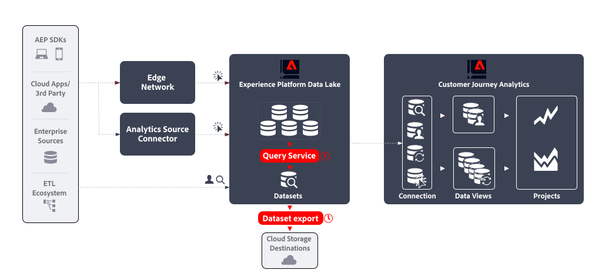

# Funcionalidad de emular fuente de datos

Las fuentes de datos de Adobe Analytics son una forma eficaz de obtener datos sin procesar de Adobe Analytics. En este caso de uso se describe cómo obtener un tipo similar de datos sin procesar de Experience Platform para utilizarlo en otras plataformas fuera del Adobe y según el criterio de su organización.

## Requisitos previos

Asegúrese de cumplir todos los requisitos antes de utilizar la funcionalidad descrita en este caso de uso:

* Implementación de trabajo que envía datos en línea y sin conexión al lago de datos de Experience Platform.
* Acceso al servicio de consultas, que se empaqueta como parte de aplicaciones basadas en plataforma o del complemento de Data Distiller. Consulte [Empaquetado del servicio de consultas](https://experienceleague.adobe.com/docs/experience-platform/query/packaging.html?lang=en) para obtener más información.
* Acceso a la funcionalidad Exportar conjuntos de datos, disponible para los clientes que han adquirido el paquete Real-Time CDP Prime o Ultimate, Adobe Journey Optimizer o Customer Journey Analytics. Consulte [Exportar conjuntos de datos a destinos de almacenamiento en la nube](https://experienceleague.adobe.com/docs/experience-platform/destinations/ui/activate/export-datasets.html?lang=es) para obtener más información.
* Uno o más destinos (por ejemplo: Amazon S3, Google Cloud Storage) configurados para que pueda exportar los datos sin procesar de su fuente de datos.

## Primeros pasos

La emulación de una fuente de datos de Adobe Analytics implica:

* definición de un **consulta programada** que genera los datos para la fuente de datos como un conjunto de datos de salida, utilizando **Servicio de consultas**.
* definición de un **exportación programada del conjunto de datos** que exporta el conjunto de datos de salida a un destino de almacenamiento en la nube mediante **Exportación de conjuntos de datos**.





## Servicio de consultas

El servicio de consultas de Experience Platform le permite consultar y unir cualquier conjunto de datos en el lago de datos de Experience Platform como si fuera una tabla de base de datos. A continuación, puede capturar los resultados como un nuevo conjunto de datos para su uso posterior en la creación de informes o para su exportación.

Utilice el servicio de consultas [interfaz de usuario](https://experienceleague.adobe.com/docs/experience-platform/query/ui/overview.html?lang=en), a [cliente conectado a través del protocolo PostgresSQL](https://experienceleague.adobe.com/docs/experience-platform/tags/publish/overview.html?lang=es), o [API de RESTful](https://experienceleague.adobe.com/docs/experience-platform/query/api/getting-started.html?lang=en) para crear y programar consultas que recopilen los datos de la fuente de datos.

### Crear consulta

Puede utilizar todas las funciones de ANSI SQL estándar para instrucciones SELECT y otros comandos limitados para crear y ejecutar las consultas que generan los datos para la fuente de datos. Consulte [Sintaxis SQL](https://experienceleague.adobe.com/docs/experience-platform/query/sql/syntax.html?lang=en) para obtener más información. Más allá de esta sintaxis SQL, Adobe admite:

* precompilado [Funciones definidas por el Adobe (ADF)](https://experienceleague.adobe.com/docs/experience-platform/query/sql/adobe-defined-functions.html?lang=en) que ayudan a realizar tareas comunes relacionadas con la empresa en los datos de evento almacenados en el lago de datos de Experience Platform, incluidas funciones para [Sessionization](https://experienceleague.adobe.com/docs/analytics/components/virtual-report-suites/vrs-mobile-visit-processing.html?lang=es) y [Atribución](https://experienceleague.adobe.com/docs/analytics/analyze/analysis-workspace/attribution/overview.html?lang=es),
* varios integrados [Funciones SQL de Spark](https://experienceleague.adobe.com/docs/experience-platform/query/sql/spark-sql-functions.html?lang=en),
* [comandos PostgreSQL de metadatos](https://experienceleague.adobe.com/docs/experience-platform/query/sql/metadata.html?lang=en),
* [declaraciones preparadas](https://experienceleague.adobe.com/docs/experience-platform/query/sql/prepared-statements.html?lang=en).


#### Ejemplos

A continuación se enumeran algunos ejemplos de consultas que recopilan datos para sus fuentes de datos. Estos ejemplos utilizan `demo_system_event_dataset_for_website_global_v1_1` como el conjunto de datos de evento de experiencia de ejemplo que contiene datos recopilados de clientes que interactúan con el sitio web.

+++Los cinco productos principales

*¿Cuáles son los cinco productos más vistos en el sitio web?*

```sql
select productListItems.name, count(*)
from   demo_system_event_dataset_for_website_global_v1_1
where  eventType = 'commerce.productViews'
group  by productListItems.name
order  by 2 desc
limit 5;
```

+++

+++Canal de interacción del producto

*¿Cuáles son las distintas interacciones de productos en el sitio web?*

```sql
select eventType, count(*)
from   demo_system_event_dataset_for_website_global_v1_1
where  eventType is not null
and    eventType <> ''
group  by eventType;
```

+++

+++¿Qué hace la gente?

*¿Qué hacen las personas en el sitio antes de llegar a la página &quot;Cancelar servicio&quot; como la tercera página de una sesión?*

Esta consulta utiliza las funciones definidas por el Adobe `SESS_TIMEOUT` y `NEXT`.

* El `SESS_TIMEOUT()` reproduce las agrupaciones de visitas que se encuentran con Adobe Analytics. Realiza una agrupación similar basada en el tiempo, pero con parámetros personalizables.
* `NEXT()` y `PREVIOUS()` le ayudará a comprender cómo navegan los clientes por el sitio.

```sql
SELECT
  webPage,
  webPage_2,
  webPage_3,
  webPage_4,
  count(*) journeys
FROM
  (
      SELECT
        webPage,
        NEXT(webPage, 1, true)
          OVER(PARTITION BY ecid, session.num
                ORDER BY timestamp
                ROWS BETWEEN CURRENT ROW AND UNBOUNDED FOLLOWING).value
          AS webPage_2,
        NEXT(webPage, 2, true)
          OVER(PARTITION BY ecid, session.num
                ORDER BY timestamp
                ROWS BETWEEN CURRENT ROW AND UNBOUNDED FOLLOWING).value
          AS webPage_3,
        NEXT(webPage, 3, true)
           OVER(PARTITION BY ecid, session.num
                ORDER BY timestamp
                ROWS BETWEEN CURRENT ROW AND UNBOUNDED FOLLOWING).value
          AS webPage_4,
        session.depth AS SessionPageDepth
      FROM (
            select a._sampleorg.identification.core.ecid as ecid,
                   a.timestamp,
                   web.webPageDetails.name as webPage,
                    SESS_TIMEOUT(timestamp, 60 * 30)
                       OVER (PARTITION BY a._sampleorg.identification.core.ecid
                             ORDER BY timestamp
                             ROWS BETWEEN UNBOUNDED PRECEDING AND CURRENT ROW)
                  AS session
            from   demo_system_event_dataset_for_website_global_v1_1 a
            where  a._sampleorg.identification.core.ecid in (
                select b._sampleorg.identification.core.ecid
                from   demo_system_event_dataset_for_website_global_v1_1 b
                where  b.web.webPageDetails.name = 'Cancel Service'
            )
        )
)
WHERE SessionPageDepth=1
and   webpage_3 = 'Cancel Service'
GROUP BY webPage, webPage_2, webPage_3, webPage_4
ORDER BY journeys DESC
LIMIT 10;
```

+++

+++Cuánto tiempo

*¿Cuánto tiempo tiene antes de que un visitante llame al centro de llamadas después de visitar la página &quot;Cancelar servicio&quot;?*

Para responder a este tipo de consulta, se utiliza la variable `TIME_BETWEEN_NEXT_MATCH()` Función definida por el Adobe. El tiempo entre las funciones de coincidencia anterior o siguiente proporciona una nueva dimensión, que mide el tiempo transcurrido desde un incidente en particular.

```sql
select * from (
       select _sampleorg.identification.core.ecid as ecid,
              web.webPageDetails.name as webPage,
              TIME_BETWEEN_NEXT_MATCH(timestamp, web.webPageDetails.name='Call Start', 'seconds')
              OVER(PARTITION BY _sampleorg.identification.core.ecid
                  ORDER BY timestamp
                  ROWS BETWEEN CURRENT ROW AND UNBOUNDED FOLLOWING)
              AS contact_callcenter_after_seconds
       from   demo_system_event_dataset_for_website_global_v1_1
       where  web.webPageDetails.name in ('Cancel Service', 'Call Start')
) r
where r.webPage = 'Cancel Service'
limit 15;
```

+++

+++¿Cuál es el resultado?

*¿Cuál es el resultado de que los clientes llamen al centro de llamadas?*

Para esta consulta, la variable `demo_system_event_dataset_for_website_global_v1_1` conjunto de datos se une con un ejemplo `demo_system_event_dataset_for_call_center_global_v1_1` conjunto de datos que contiene interacciones del centro de llamadas.

```sql
select distinct r.*,
       c._sampleorg.interactionDetails.core.callCenterAgent.callFeeling,
       c._sampleorg.interactionDetails.core.callCenterAgent.callTopic,
       c._sampleorg.interactionDetails.core.callCenterAgent.callContractCancelled
from (
       select _sampleorg.identification.core.ecid ecid,
              web.webPageDetails.name as webPage,
              TIME_BETWEEN_NEXT_MATCH(timestamp, web.webPageDetails.name='Call Start', 'seconds')
              OVER(PARTITION BY _sampleorg.identification.core.ecid
                  ORDER BY timestamp
                  ROWS BETWEEN CURRENT ROW AND UNBOUNDED FOLLOWING)
              AS contact_callcenter_after_seconds
       from   demo_system_event_dataset_for_website_global_v1_1
       where  web.webPageDetails.name in ('Cancel Service', 'Call Start')
) r
, demo_system_event_dataset_for_call_center_global_v1_1 c
where r.ecid = c._sampleorg.identification.core.ecid
and r.webPage = 'Cancel Service'
and c._sampleorg.interactionDetails.core.callCenterAgent.callContractCancelled IN (true,false)
and c._sampleorg.interactionDetails.core.callCenterAgent.callTopic IN ('contract', 'invoice','complaint','wifi')
limit 15;
```

+++

+++Participación en el canal de marketing (datos de Adobe Analytics)

*¿Cuál es la participación en los canales de marketing para el tráfico web italiano?*

Este ejemplo utiliza el conjunto de datos creado automáticamente por el conector de origen de Adobe Analytics, por ejemplo `demo_data_sample_org_midvalues`.

```sql
select 
    channel.typeAtSource, count(*) 
from 
    demo_data_sample_org_midvalues 
where 
    (channel.typeAtSource IS NOT NULL
and
    web.webPageDetails.URL LIKE '%/it/it/%')
group by 
    channel.typeAtSource
order by 2 desc;
```

+++

Para ver más consultas de muestra (avanzadas), consulte [exploración abandonada](https://experienceleague.adobe.com/docs/experience-platform/query/use-cases/abandoned-browse.html?lang=en), [análisis de atribución](https://experienceleague.adobe.com/docs/experience-platform/query/use-cases/attribution-analysis.html?lang=en), [filtrado de bots](https://experienceleague.adobe.com/docs/experience-platform/query/use-cases/bot-filtering.html?lang=en)y otros ejemplos de la Guía del servicio de consultas.


#### Identidades

En Experience Platform, hay varias identidades disponibles. Asegúrese de consultar las identidades correctamente. En los ejemplos anteriores, ECID se define como parte de un objeto principal, que a su vez forma parte de un objeto de identificación, ambos agregados al esquema mediante un grupo de campos principal de evento de experiencia (por ejemplo: `_sampleorg.identification.core.ecid`). Los ECID pueden estar organizados de forma diferente en los esquemas.

Como alternativa, puede utilizar `identityMap` para consultar identidades. Este objeto es de tipo `Map` y usa un [estructura de datos anidada](#nested-data-structure).

Puede haber varias identidades disponibles para los datos introducidos mediante el conector de origen de Adobe Analytics. El identificador principal depende de si existe un ECID o AAID. Consulte [Identificadores principales en datos de Adobe Analytics](https://experienceleague.adobe.com/docs/experience-platform/sources/connectors/adobe-applications/analytics.html?lang=en#how-the-analytics-source-treats-identities) y [AAID, ECID, AACUSTOMID y el conector de origen de Analytics](https://experienceleague.adobe.com/docs/analytics-platform/using/compare-aa-cja/cja-aa-comparison/aaid-ecid-adc.html?lang=es) para obtener más información

#### Columnas de fuente de datos

Los campos (columnas) que puede utilizar en la consulta dependen de la definición de esquema en la que se basen los conjuntos de datos. Asegúrese de comprender el esquema subyacente del conjunto de datos.

Por ejemplo, en algunas de las [consultas de ejemplo](#examples) ha consultado por *nombre de página*.

* En la interfaz de usuario de la fuente de datos de Adobe Analytics, debe seleccionar **[!UICONTROL pagename]** como la columna que se agregará a la definición de fuente de datos.
* En el servicio de consultas, incluye lo siguiente `web.webPageDetails.name` desde el `demo_system_event_dataset_for_website_global_v1_1` conjunto de datos (basado en el **Sistema de demostración: Esquema de eventos para el sitio web (Global v1.1)** experience event (esquema) en la consulta. Consulte la [grupo de campos de esquema de detalles web](https://experienceleague.adobe.com/docs/experience-platform/xdm/field-groups/event/web-details.html?lang=en) para obtener más información.

Para comprender la asignación entre columnas de datos de Adobe Analytics anteriores y campos XDM en el conjunto de datos de evento de experiencia y el esquema subyacente, consulte [Asignación de campos de Analytics](https://experienceleague.adobe.com/docs/experience-platform/sources/connectors/adobe-applications/mapping/analytics.html?lang=es) y el [Grupo de campos de esquema de extensión completa de Adobe Analytics ExperienceEvent](https://experienceleague.adobe.com/docs/experience-platform/xdm/field-groups/event/analytics-full-extension.html?lang=en) para obtener más información.

Además, la información recopilada automáticamente por el SDK web de Experience Platform (de forma predeterminada) también puede ser relevante para identificar columnas para la consulta. Consulte [Información recopilada automáticamente](https://experienceleague.adobe.com/docs/experience-platform/edge/data-collection/automatic-information.html?lang=en) para obtener más información.


#### Búsquedas

Para buscar datos de otros conjuntos de datos, se utiliza la funcionalidad estándar de SQL (cláusula WHERE, INNER JOIN, OUTER JOIN, etc.). Consulte la [Cuál es el resultado](#examples) consulta en los ejemplos.

#### Cálculos

Para realizar cálculos en campos (columnas), simplemente utilice las funciones SQL estándar (por ejemplo `COUNT(*)` en el [Canal de interacción de productos](#examples) consulta en los ejemplos) o la variable [operadores y funciones matemáticos y estadísticos](https://experienceleague.adobe.com/docs/experience-platform/query/sql/spark-sql-functions.html?lang=en#math) forma parte de Spark SQL.

#### Estructura de datos anidada

Los esquemas en los que se basan los conjuntos de datos suelen contener tipos de datos complejos, incluidas estructuras de datos anidadas. Mencionado anteriormente `identityMap` es un ejemplo de estructura de datos anidada. Consulte a continuación un ejemplo de `identityMap` datos.

```json
{
   "identityMap":{
      "FPID":[
         {
            "id":"55613368189701342632255821452918751312",
            "authenticatedState":"ambiguous"
         }
      ],
      "CRM":[
         {
            "id":"2394509340-30453470347",
            "authenticatedState":"authenticated"
         }
      ]
   }
}
```

Puede usar el complemento [`explode()` u otras funciones de matrices](https://experienceleague.adobe.com/docs/experience-platform/query/sql/spark-sql-functions.html?lang=en#arrays) desde Spark SQL para llegar a los datos dentro de una estructura de datos anidada.

Por ejemplo:

```sql
select explode(identityMap) from demosys_cja_ee_v1_website_global_v1_1 limit 15;
```

Como alternativa, puede hacer referencia a elementos individuales utilizando la notación de puntos. Por ejemplo:

```sql
select identityMap.ecid from demosys_cja_ee_v1_website_global_v1_1 limit 15;
```

Consulte [Trabajar con estructuras de datos anidadas en el servicio de consultas](https://experienceleague.adobe.com/docs/experience-platform/query/key-concepts/nested-data-structures.html?lang=en) para obtener más información.

### Programar consulta

Programe la consulta para asegurarse de que se ejecuta y de que los resultados se generan a su intervalo preferido. Al programar la consulta, se define un conjunto de datos de salida.

#### Uso del Editor de consultas

Puede programar una consulta mediante el Editor de consultas. Al definir una programación para una consulta, puede definir el conjunto de datos de salida. Consulte [Programaciones de consultas](https://experienceleague.adobe.com/docs/experience-platform/query/ui/query-schedules.html?lang=en) para obtener más información.


#### Uso de la API del servicio de consultas

También puede utilizar las API de RESTful para definir una consulta y una programación para la consulta. Consulte [Guía de API del servicio de consultas](https://experienceleague.adobe.com/docs/experience-platform/query/api/getting-started.html?lang=en_) para obtener más información.
Asegúrese de definir el conjunto de datos de salida como parte del `ctasParameters` al crear la consulta ([Creación de una consulta](https://developer.adobe.com/experience-platform-apis/references/query-service/#tag/Queries/operation/createQuery)) o al crear la programación para una consulta ([Creación de una consulta programada](https://developer.adobe.com/experience-platform-apis/references/query-service/#tag/Schedules/operation/createSchedule)).


## Exportación de conjuntos de datos

Una vez que haya creado y programado la consulta, y verificado que los resultados de los conjuntos de datos de salida están en línea con los requisitos, puede exportar los conjuntos de datos sin procesar a destinos de almacenamiento en la nube. Esta exportación se realiza en la terminología Destinos de Experience Platform, que se denomina destinos de exportación de conjuntos de datos. Consulte [Exportar conjuntos de datos a destinos de almacenamiento en la nube](https://experienceleague.adobe.com/docs/experience-platform/destinations/ui/activate/export-datasets.html?lang=es) para obtener una descripción general.

Se admiten los siguientes destinos de almacenamiento en la nube:

* [Azure Data Lake Storage Gen2](https://experienceleague.adobe.com/docs/experience-platform/destinations/catalog/cloud-storage/adls-gen2.html?lang=en)
* [Zona de aterrizaje de datos](https://experienceleague.adobe.com/docs/experience-platform/destinations/catalog/cloud-storage/data-landing-zone.html?lang=en)
* [Almacenamiento de Google Cloud](https://experienceleague.adobe.com/docs/experience-platform/destinations/catalog/cloud-storage/google-cloud-storage.html?lang=en)
* [Amazon S3](https://experienceleague.adobe.com/docs/experience-platform/destinations/catalog/cloud-storage/amazon-s3.html?lang=en#changelog)
* [Azure Blob](https://experienceleague.adobe.com/docs/experience-platform/destinations/catalog/cloud-storage/azure-blob.html?lang=en#changelog)
* [SFTP](https://experienceleague.adobe.com/docs/experience-platform/destinations/catalog/cloud-storage/sftp.html?lang=en#changelog)


### IU de Experience Platform

Puede exportar y programar la exportación de los conjuntos de datos de salida a través de la interfaz de usuario de Experience Platform. En esta sección se describen los pasos que debe seguir.

#### Seleccionar destino

Cuando haya determinado a qué destino de almacenamiento en la nube desea exportar el conjunto de datos de salida, [seleccionar el destino](https://experienceleague.adobe.com/docs/experience-platform/destinations/ui/activate/export-datasets.html?lang=en#select-destination). Cuando aún no haya configurado un destino para su almacenamiento en la nube preferido, debe [crear una nueva conexión de destino](https://experienceleague.adobe.com/docs/experience-platform/destinations/ui/connect-destination.html?lang=en).

Como parte de la configuración de un destino, puede definir el tipo de archivo (JSON o Parquet), si el archivo resultante debe comprimirse o no y si un archivo de manifiesto debe incluirse o no.


#### Seleccionar conjunto de datos

Cuando haya seleccionado el destino, en el siguiente **[!UICONTROL Seleccionar conjuntos de datos]** paso tiene que seleccionar el conjunto de datos de salida de la lista de conjuntos de datos. Si ha creado varias consultas programadas y desea que los conjuntos de datos de salida se envíen al mismo destino de almacenamiento en la nube, puede seleccionar los conjuntos de datos de salida correspondientes. Consulte [Seleccione sus conjuntos de datos](https://experienceleague.adobe.com/docs/experience-platform/destinations/ui/activate/export-datasets.html?lang=en#select-datasets) para obtener más información.

#### Programación de exportación del conjunto de datos

Por último, desea programar la exportación del conjunto de datos como parte del **[!UICONTROL Programación]** paso. En ese paso puede definir la programación y si la exportación del conjunto de datos de salida debe ser incremental o no. Consulte [Programar exportación del conjunto de datos](https://experienceleague.adobe.com/docs/experience-platform/destinations/ui/activate/export-datasets.html?lang=en#scheduling) para obtener más información.


#### Pasos finales

[Revisar](https://experienceleague.adobe.com/docs/experience-platform/destinations/ui/activate/export-datasets.html?lang=en#review) Haga su selección y cuando empiece a exportar correctamente el conjunto de datos de salida al destino de almacenamiento en la nube.

Usted debe [verificar](https://experienceleague.adobe.com/docs/experience-platform/destinations/ui/activate/export-datasets.html?lang=en#verify) exportación de datos correcta. Al exportar conjuntos de datos, Experience Platform crea uno o varios `.json` o `.parquet` archivos en la ubicación de almacenamiento definida en el destino. Se espera que los nuevos archivos se depositen en su ubicación de almacenamiento según la programación de exportación configurada. Experience Platform crea una estructura de carpetas en la ubicación de almacenamiento especificada como parte del destino seleccionado, donde deposita los archivos exportados. Se crea una nueva carpeta para cada tiempo de exportación, siguiendo el patrón: `folder-name-you-provided/datasetID/exportTime=YYYYMMDDHHMM`. El nombre de archivo predeterminado se genera de forma aleatoria y garantiza que los nombres de archivo exportados sean únicos.

### API de Flow Service

También puede exportar y programar la exportación de conjuntos de datos de salida mediante API. Los pasos involucrados se documentan en [Exportación de conjuntos de datos mediante la API de Flow Service](https://experienceleague.adobe.com/docs/experience-platform/destinations/api/export-datasets.html).

#### Introducción

Asegúrese de que dispone de [permisos necesarios](https://experienceleague.adobe.com/docs/experience-platform/destinations/api/export-datasets.html#permissions) para exportar conjuntos de datos de y que el destino al que desea enviar el conjunto de datos de salida admita la exportación de conjuntos de datos. Entonces, debe [recopilar los valores de los encabezados obligatorios y opcionales](https://experienceleague.adobe.com/docs/experience-platform/destinations/api/export-datasets.html#gather-values-headers) que utiliza en las llamadas API de, así como [identificar las especificaciones de conexión y los ID de especificación de flujo del destino](https://experienceleague.adobe.com/docs/experience-platform/destinations/api/export-datasets.html#gather-connection-spec-flow-spec) tiene intención de exportar conjuntos de datos a.

#### Recuperar conjuntos de datos aptos

Puede [recuperar una lista de conjuntos de datos aptos](https://experienceleague.adobe.com/docs/experience-platform/destinations/api/export-datasets.html#retrieve-list-of-available-datasets) para la exportación y compruebe si el conjunto de datos de salida forma parte de esa lista utilizando [`GET /connectionSpecs/{id}/configs`](https://developer.adobe.com/experience-platform-apis/references/destinations/#tag/Configurations/operation/getDatasets) API.


#### Crear conexión de origen

A continuación, debe [crear una conexión de origen](https://experienceleague.adobe.com/docs/experience-platform/destinations/api/export-datasets.html#create-source-connection) para el conjunto de datos de salida, con su ID único, que desea exportar al destino de almacenamiento en la nube. Utilice el [`POST /sourceConnections`](https://developer.adobe.com/experience-platform-apis/references/destinations/#tag/Source-connections/operation/postSourceConnection) API.

#### Autenticar en el destino (crear conexión base)

Ahora debe [crear una conexión base](https://experienceleague.adobe.com/docs/experience-platform/destinations/api/export-datasets.html#create-base-connection) para autenticar correctamente y almacenar de forma segura las credenciales en su destino de almacenamiento en la nube mediante el [`POST /targetConection`](https://developer.adobe.com/experience-platform-apis/references/destinations/#tag/Target-connections/operation/postTargetConnection) API.


#### Proporcionar parámetros de exportación

A continuación, debe [crear una conexión de destino adicional que almacene los parámetros de exportación](https://experienceleague.adobe.com/docs/experience-platform/destinations/api/export-datasets.html#create-target-connection) para el conjunto de datos de salida utilizando, una vez más, la [`POST /targetConection`](https://developer.adobe.com/experience-platform-apis/references/destinations/#tag/Target-connections/operation/postTargetConnection) API. Estos parámetros de exportación incluyen ubicación, formato de archivo, compresión, etc.

#### Configurar flujo de datos

Finalmente, usted [configuración del flujo de datos](https://experienceleague.adobe.com/docs/experience-platform/destinations/api/export-datasets.html#create-dataflow) para asegurarse de que el conjunto de datos de salida se exporta al destino de almacenamiento en la nube mediante [`POST /flows`](https://developer.adobe.com/experience-platform-apis/references/destinations/#tag/Dataflows/operation/postFlow) API. En este paso, puede definir la programación de la exportación mediante el `scheduleParams` parámetro.

#### Validar flujo de datos

Hasta [compruebe las ejecuciones correctas del flujo de datos](https://experienceleague.adobe.com/docs/experience-platform/destinations/api/export-datasets.html#get-dataflow-runs), use el [`GET /runs`](https://developer.adobe.com/experience-platform-apis/references/destinations/#tag/Dataflow-runs/operation/getFlowRuns) API, especificando el ID del flujo de datos como parámetro de consulta. Este ID de flujo de datos es un identificador que se devuelve al configurar el flujo de datos.

[Verificar](https://experienceleague.adobe.com/docs/experience-platform/destinations/ui/activate/export-datasets.html?lang=en#verify) exportación de datos correcta. Al exportar conjuntos de datos, Experience Platform crea uno o varios `.json` o `.parquet` archivos en la ubicación de almacenamiento definida en el destino. Se espera que los nuevos archivos se depositen en su ubicación de almacenamiento según la programación de exportación configurada. Experience Platform crea una estructura de carpetas en la ubicación de almacenamiento especificada como parte del destino seleccionado, donde deposita los archivos exportados. Se crea una nueva carpeta para cada tiempo de exportación, siguiendo el patrón: `folder-name-you-provided/datasetID/exportTime=YYYYMMDDHHMM`. El nombre de archivo predeterminado se genera de forma aleatoria y garantiza que los nombres de archivo exportados sean únicos.

## Conclusión

En resumen, emular la funcionalidad de la fuente de datos de Adobe Analytics implica configurar consultas programadas mediante el servicio de consulta y utilizar los resultados de estas consultas en exportaciones de conjuntos de datos programados.

>[!IMPORTANT]
>
>En este caso de uso están involucrados dos programadores. Para garantizar el correcto funcionamiento de la funcionalidad de fuente de datos emulada, asegúrese de que las programaciones configuradas en el servicio de consulta y las exportaciones de datos no interfieran.

