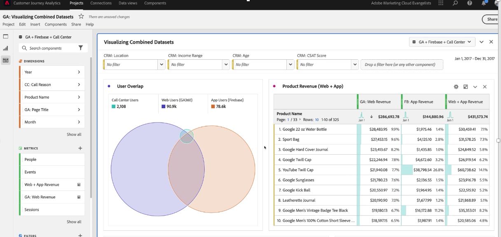
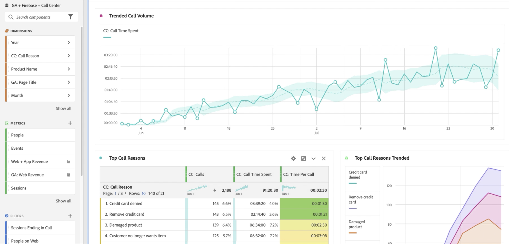
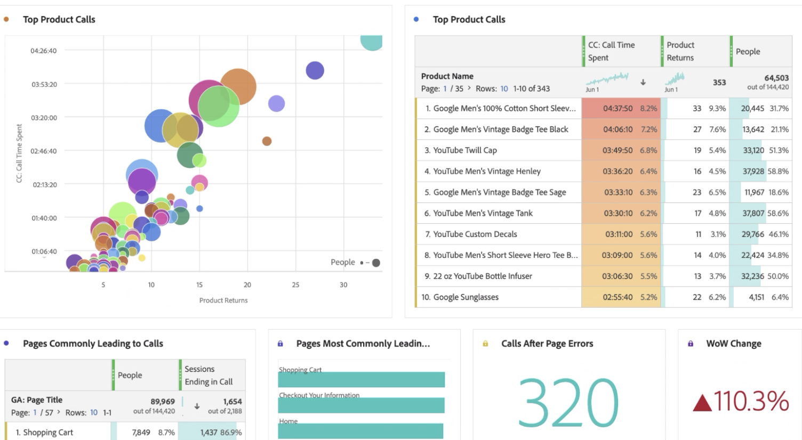
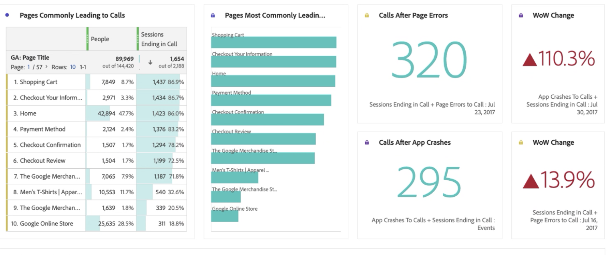
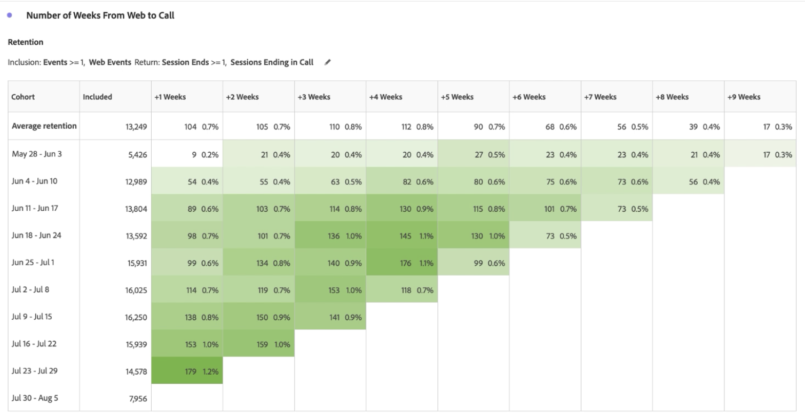
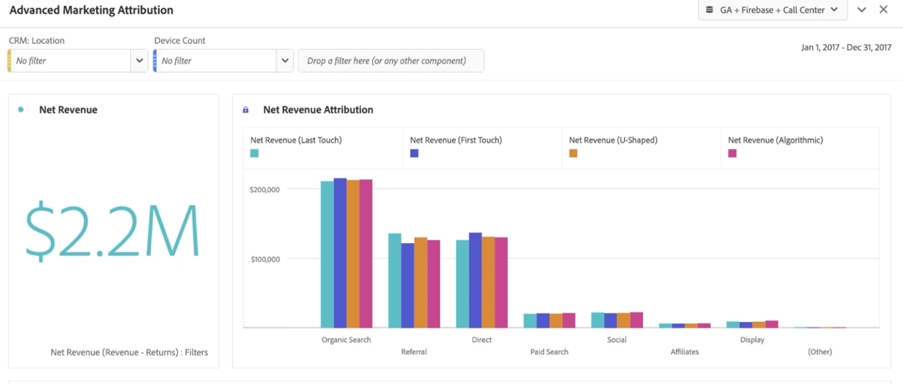
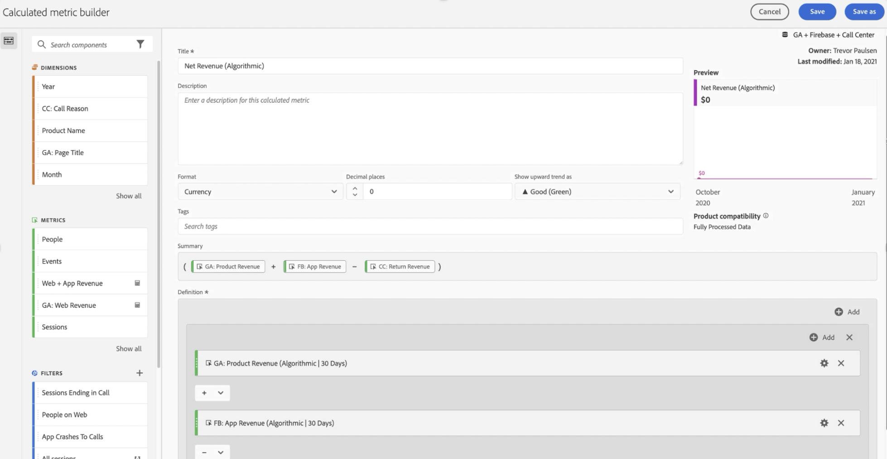
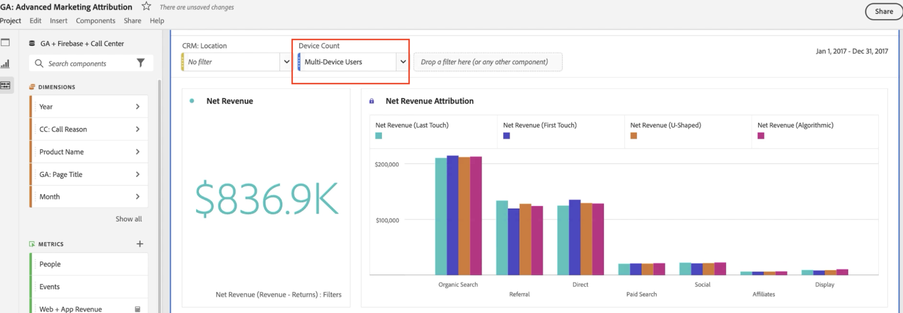
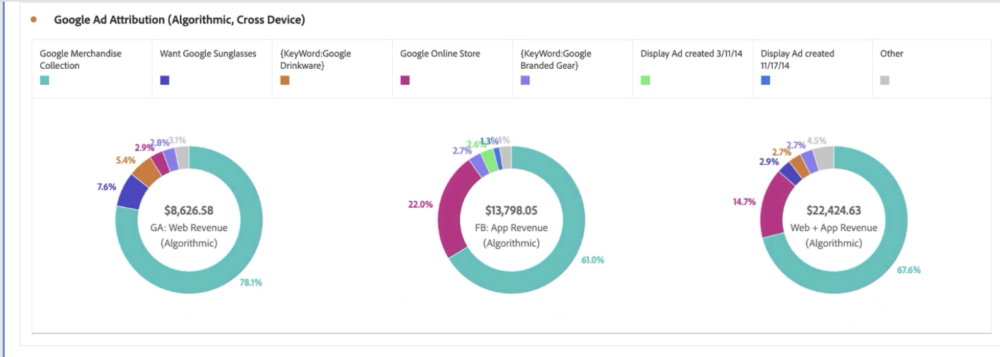
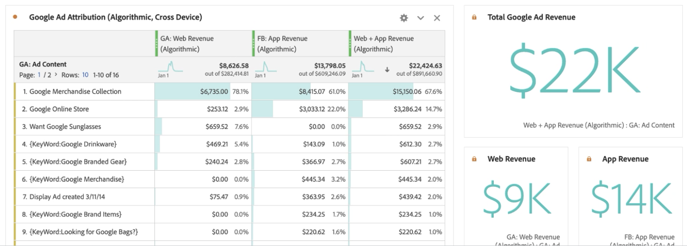

# Informar sobre los datos de Google Analytics en Customer Journey Analytics

Ahora que ha [introducido los datos de Google Analytics en Experience Platform y Customer Journey Analytics (CJA)](/help/use-cases/ga-to-cja.md), le mostraremos algunos escenarios útiles para crear informes sobre esos datos.

## Visualizar datos web y datos de aplicaciones como conjuntos de datos combinados

Este diagrama de Venn muestra la superposición de usuarios en su sitio web (a partir de los datos de Google Analytics), en su aplicación móvil (a partir de los datos de Firebase) y en su centro de llamadas. También puede ver los productos de mayor rendimiento, no solo en la web, sino también en la aplicación móvil. Incluso puede obtener el total de ingresos de ambos, utilizando una métrica calculada. Observe cómo los productos principales cuentan una historia diferente al observar los ingresos combinados. Sin los conjuntos de datos combinados, nunca habría sabido que el &quot;Límite de sarga&quot; era un ejecutante tan fuerte.

## Identificar motivos de llamada y reducir el volumen de llamadas

Para verificar que ha recibido muchas llamadas, puede analizar la tendencia del tiempo que ha invertido nuestro centro de llamadas durante el período de los últimos 2 meses. Es fácil ver la tendencia creciente. Esto es preocupante, ya que cada minuto que sus representantes de los centros de llamadas están en el teléfono cuesta dinero. Esto definitivamente puede afectar a sus resultados finales.

Veamos las principales razones que provocan el aumento de las llamadas al centro de llamadas. Observe que Tarjeta de crédito denegada, Quitar tarjeta de crédito y Producto dañado son las principales razones. Esto ya puede sugerir formas de mejorar la experiencia en línea. También puede analizar la tendencia de esas razones de llamada y ver cuáles han contribuido más al pico general. Es interesante ver que los clientes con &quot;Producto dañado&quot; han pasado más de 3 minutos por llamada.

Vamos a buscar más y ver qué productos están causando la mayoría de las llamadas a su centro de llamadas y cuántos clientes las han hecho. El gráfico de burbujas indica que 20 000 personas llamaron, pasaron más de 4 horas y 30 minutos y devolvieron 33 unidades del producto &quot;Camiseta de manga corta para hombre&quot;.

Podemos desglosar esa información y ver por qué esas personas devolvieron el producto arrastrando la dimensión &quot;Razón de la llamada&quot;. Como puede ver, la razón por la que este producto recibe tantas llamadas se debe a &quot;Producto dañado&quot;. El siguiente paso sería contactar con el departamento de control de calidad y ver por qué los clientes han estado recibiendo camisetas dañadas.

Ahora veamos qué páginas de sitios web condujeron las llamadas entrantes en el centro de llamadas. Esto le permite saber dónde se encuentran las experiencias con bajo rendimiento en el sitio web y ayudar a los responsables del producto a solucionar estos desafíos.

Hacemos esto por

* Uso de una métrica calculada para filtrar los datos hasta que solo haya sesiones que hayan finalizado con una llamada al centro de llamadas.
* Uso del modelo de participación en la [Attribution IQ](https://experienceleague.adobe.com/docs/analytics-platform/using/cja-workspace/attribution/models.html?lang=es#cja-workspace) de CJA.

Puede ver fácilmente qué páginas participan con mayor frecuencia en una sesión que termina en una llamada. Se puede ver que las páginas &quot;Carro de compras&quot; e &quot;Información de cierre de compra&quot; condujeron la mayoría de las llamadas. Como también ha incluido los datos de la aplicación móvil firebase, puede incluso ver errores de página y bloqueos de aplicación que generan las llamadas. Este es un punto de datos muy importante si desea ofrecer buenas experiencias de aplicaciones móviles y web.

Por último, al usar la tabla de cohorte en Analysis Workspace, es fácil ver cuánto tiempo tardan los usuarios en llamar a nuestro centro de llamadas después de haber visitado el sitio web. Aquí puede ver que el tiempo promedio es entre 3 y 4 semanas.

## Uso de atribución de marketing avanzada

CJA le permite utilizar modelos de atribución sofisticados en sus datos de canales cruzados. En el siguiente ejemplo, se puede ver una comparación de la aplicación de Atribución de ingresos de último toque, primer toque, en forma de U y algorítmica a la dimensión Agrupación de canales de Google Analytics.

Con una métrica calculada, puede aplicar esa atribución a los ingresos de la web, los ingresos de las aplicaciones móviles e incluso eliminar las devoluciones de productos. Como resultado, puede ver ingresos netos reales para cada canal de marketing.

Attribution IQ también le permite filtrar fácilmente sus datos. Solo se puede ver la atribución en determinados conjuntos de usuarios, como aquellos que utilizan más de un dispositivo.

Por último, también puede atribuir los ingresos de su aplicación y web al contenido de Google Ad. Verá que ha ganado más ingresos gracias a la aplicación móvil impulsada por nuestros Google Ads en línea que por la web. Al ordenar los anuncios por ingresos de aplicaciones y web, se obtiene una imagen muy diferente de cuál es el mayor rendimiento de los anuncios de Google.

Sin CJA, no podría haber sabido que sus anuncios en línea estaban teniendo algún impacto en los productos comprados en su aplicación móvil. Ahora puede ver que los ingresos de aplicaciones móviles procedentes de Google Ads representan entre 14 000 y 5000 dólares adicionales, en comparación con la web solamente.

