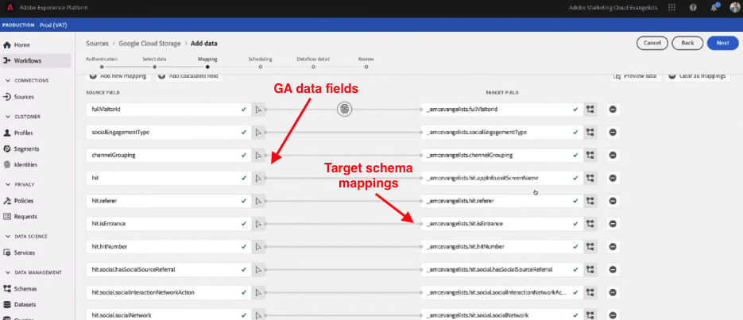
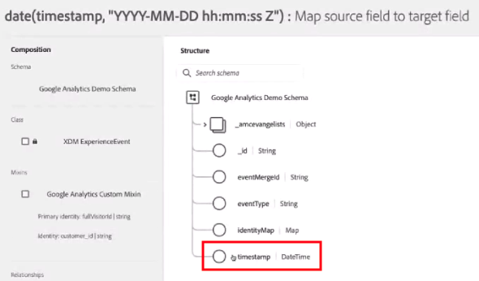
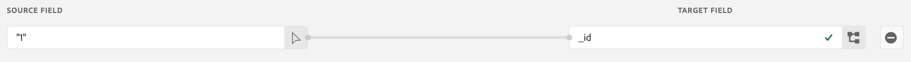

# Ingesta de datos de Google Analytics en Adobe Experience Platform

Este caso de uso se centra en cómo introducir los datos de Google Analytics como un conjunto de datos en Adobe Experience Platform. Explicamos cómo ingerir datos históricos y activos. Una vez finalizado, puede combinar ambos conjuntos de datos en Customer Journey Analytics para obtener una vista entre dispositivos del recorrido del usuario.

Los conjuntos de datos de Experience Platform se componen de dos cosas: un esquema y los registros reales del conjunto de datos. El esquema (al que llamamos Experience Data Model, o XDM para abreviar) es como las columnas del conjunto de datos, y es como el modelo o las reglas que describen los datos en sí. Dentro de la plataforma, Adobe proporciona dos tipos de esquemas:

* Esquemas predeterminados a los que puede asignar los datos de Google Analytics automáticamente (denominado esquema de Experience Event)
* Esquemas personalizados que se pueden crear y asignar fácilmente a los datos de Google Analytics

Uno de los aspectos más sólidos del modelo de datos de Adobe es que le permite estandarizar todos los datos de interacción del cliente en un esquema común, lo que facilita en gran medida la vinculación de los datos en CJA.

## Requisitos previos

Para realizar estas tareas, necesita los siguientes permisos y acceso:

* Acceso a Adobe Experience Platform
* Acceso a Universal Google Analytics (versión 360 de Google Analytics) o Google Analytics 4 (versión gratuita o versión 360 de Google Analytics)
* Acceso a Customer Journey Analytics y sus [permisos de administración](https://experienceleague.adobe.com/docs/analytics-platform/using/cja-overview/cja-overview.html?lang=es#admin-access-permissions).

La forma de introducir los datos de Google Analytics en Adobe Experience Platform depende de la versión de Google Analytics que utilice:

| Si utiliza... | También necesita esta licencia. | Y hacer esto. |
| --- | --- | --- |
| **Universal Analytics** | Google Analytics 360 | Siga los pasos del 1 al 3 de las instrucciones siguientes |
| **Google Analytics 4** | Versión gratuita de GA para Google Analytics 360 | Siga los pasos 1 y 3 de las instrucciones siguientes. No es necesario el paso 2. |

## Ingesta de datos históricos (relleno)

### 1. Conecte los datos de Google Analytics a BigQuery

Para obtener más información, consulte [estas instrucciones](https://support.google.com/analytics/answer/3416092?hl=es). Tenga en cuenta que estas instrucciones se basan en Universal Google Analytics.

### 2. Transforme sesiones de Google Analytics a eventos en BigQuery, y exporte a Google Cloud Storage

>[!IMPORTANT]
>
>Este paso solo se aplica a los clientes de Universal Analytics

Los datos de GA almacenan cada registro en sus datos como una sesión del usuario en lugar de como eventos individuales. Debe crear una consulta SQL para transformar los datos de Universal Analytics en un formato compatible con Experience Platform. La función &quot;unnest&quot; se aplica al campo &quot;hits&quot; del esquema de GA. Este es el ejemplo de SQL que puede utilizar:

`SELECT
*,
timestamp_seconds(`visitStartTime` + hit.time) AS `timestam` 
FROM
(
SELECT
fullVisitorId,
visitNumber,
visitId,
visitStartTime,
trafficSource,
socialEngagementType,
channelGrouping,
device,
geoNetwork,
hit 
FROM
`pyour_bq_table_2021_04_*`,
UNNEST(hits) AS hit 
)`

Una vez finalizada la consulta, guarde todos los resultados en una tabla de BigQuery.

Consulte [estas instrucciones](https://support.google.com/analytics/answer/7029846?hl=es&amp;ref_topic=9359001#zippy=%2Cold-export-schema%2Cuse-this-script-to-migrate-existing-bigquery-datasets-from-the-old-export-schema-to-the-new-one%2Cscript-migration-scriptsql), que incluyen instrucciones sobre la consulta SQL.

En el siguiente vídeo, también se explica el paso siguiente, que es exportar los eventos de Google Analytics a Google Cloud Storage en formato JSON. Haga clic en **Exportar > Exportar a GCS**. Una vez allí, los datos están listos para incorporarse en Adobe Experience Platform.

>[!VIDEO](https://video.tv.adobe.com/v/332634)

### 3. Importe los datos de Google Cloud Storage en Experience Platform y asígnelos al esquema XDM

En Experience Platform, seleccione **[!UICONTROL Orígenes]** y busque la opción **[!UICONTROL Google Cloud Storage]**. A partir de ahí, solo tiene que encontrar el conjunto de datos que ha guardado de BigQuery.

Recuerde:

* Asegúrese de seleccionar el formato JSON.
* Puede seleccionar un conjunto de datos existente o crear un nuevo conjunto de datos (recomendado).
* Asegúrese de seleccionar el mismo esquema para los datos de Google Analytics histórico y los datos de Google Analytics de flujo continuo en directo, incluso si están en conjuntos de datos separados. Posteriormente, puede combinar los conjuntos de datos en una [conexión de CJA](/help/connections/combined-dataset.md).

Para obtener instrucciones, vea este vídeo:

>[!VIDEO](https://video.tv.adobe.com/v/332676)

Puede asignar los datos de evento de GA a un conjunto de datos existente que haya creado anteriormente, o crear un nuevo conjunto de datos, utilizando el esquema XDM que elija. Una vez que haya seleccionado el esquema, Experience Platform aplica el aprendizaje automático para asignar automáticamente previamente cada uno de los campos de los datos de Google Analytics a su [esquema XDM](https://experienceleague.adobe.com/docs/experience-platform/xdm/home.html?lang=es#ui).

Las asignaciones son muy fáciles de cambiar e incluso puede crear campos derivados o calculados a partir de los datos de Google Analytics. Una vez que haya terminado de asignar los campos al esquema XDM, puede programar esta importación de forma recurrente, así como aplicar la validación de errores durante el proceso de ingesta. Esto garantiza que no haya ningún problema con los datos importados.

**Campo calculado Marca de tiempo**

Para el campo de esquema `timestamp` en los datos de Google Analytics, debe crear un campo calculado especial en la IU del esquema de Experience Platform. Haga clic en **[!UICONTROL Añadir campo calculado]** y ajuste la cadena `timestamp` en una función `date` de esta manera:

`date(timestamp, "yyyy-MM-dd HH:mm:ssZ")`

A continuación, debe guardar este campo calculado en la estructura de datos de marca de tiempo del esquema:

**Campo calculado &#39;_id&#39;**

El campo de esquema `_id` tiene que tener un valor en él: a CJA no le importa cuál sea el valor. Solo puede añadir un &quot;1&quot; al campo:

## Ingesta de datos de Google Analytics de flujo en directo

También puede capturar eventos de flujo continuo en directo desde Google Tag Manager directamente a Adobe Experience Platform.

### 1. Agregar variables personalizadas

Después de iniciar sesión en la cuenta de Google Tag Manager, debe agregar algunas variables de constante personalizadas relacionadas con Adobe. Probablemente ya tenga variables en Google Tag Manager que se envíen a Google Analytics, como el correo electrónico del cliente, el nombre del cliente, el idioma y el estado de inicio de sesión del cliente. Debe definir 5 nuevas variables personalizadas:

* ID de organización en Adobe Experience Cloud
* Punto final de transmisión DCS
* ID del conjunto de datos de Experience Platform
* Referencia de esquema
* Marca de tiempo de la página

La obtención de estos valores garantiza que todos los datos de Google Analytics se envíen al conjunto de datos correcto y que tengan el esquema correcto. Si no conoce su organización de Experience Cloud o cualquiera de las otras variables mencionadas, su administrador de cuentas de Adobe puede ayudarle a rastrear.

Una vez que haya definido estas variables personalizadas, se puede configurar un activador para enviar todos los datos que ya se están enviando a Google Analytics y también a Experience Platform.

### 2. Configurar un activador en Google Tag Manager

En este ejemplo, se ha definido el activador Creación de cuenta, donde `pageUrl equals account-creation`. Al agregar información a este activador, puede asegurarse de que cuando el usuario se autentique correctamente y se cargue la página de creación de cuentas, los datos se envíen tanto a Google Analytics como a AEP.

También puede consultar [Ingesta de datos y Google Tag Manager](https://experienceleague.adobe.com/docs/platform-learn/comprehensive-technical-tutorial/module9/data-ingestion-using-google-tag-manager-and-google-analytics.html?lang=es#module9).

Para obtener instrucciones, vea este vídeo:

>[!VIDEO](https://video.tv.adobe.com/v/332668)

## Crear una conexión en CJA con el conjunto de datos de Google Analytics

Una vez que Adobe Experience Platform ha empezado a recibir los datos de Google Analytics activos y ha rellenado los datos de Google Analytics históricos de BigQuery, está listo para saltar a CJA y [crear su primera conexión](/help/connections/create-connection.md). Esta conexión unirá los datos de GA con todos los demás datos de clientes usando un ID de cliente común.

## Pasos siguientes

* Cree una [vista de datos](https://experienceleague.adobe.com/docs/analytics-platform/using/cja-dataviews/create-dataview.html?lang=es#cja-dataviews) basada en la conexión que contiene datos de Google Analytics.

* Haga análisis increíbles [en Workspace](/help/use-cases/ga-to-cja-reporting.md).