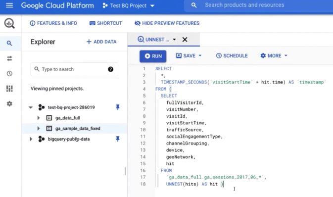

# Configuración de informes de Google Analytics en Customer Journey Analytics

Este caso de uso explica cómo obtener los datos de sus Google Analytics en Adobe Experience Platform y, a continuación,

## Requisitos previos

* Acceso a Adobe Experience Platform
* Acceso a Google Analytics universales (versión 360 de Google Analytics) o Google Analytics 4 (versión gratuita o versión 360 de Google Analytics)
* Acceso al Customer Journey Analytics

## 1. Conecte los datos de los Google Analytics a Adobe Experience Platform

La forma de introducir los datos de los Google Analytics en Adobe Experience Platform depende de la versión de Google Analytics que utilice:

| Si utiliza... | También necesita esta licencia... | Y haz esto... |
| --- | --- | --- |
| **Google Analytics universales** | Google Analytics 360 | Siga los pasos 1 a 5 de las instrucciones siguientes |
| **Google Analytics 4** | Versión gratuita de GA para Google Analytics 360 | Siga los pasos 2 a 5 de las instrucciones siguientes. No es necesario el paso 1. |

Las siguientes instrucciones están basadas en Google Analytics universales.

1. Conecte los datos de sus Google Analytics a BigQuery para poder transformar algunos de los datos.
Consulte [estas instrucciones](https://support.google.com/analytics/answer/3416092?hl=en).

1. (Solo clientes de Universal Analytics) Transforme sesiones de Google Analytics a eventos en BigQuery.
Esto hace que los datos sean compatibles con Adobe Experience Platform. Consulte [estas instrucciones](https://support.google.com/analytics/answer/3437618?hl=en).

   Detalles: En BigQuery, los datos de GA aparecerán como una tabla:

   
Debe crear una consulta SQL para transformar los datos de Universal Analytics en un formato compatible con Experience Platform. Vea este vídeo para obtener instrucciones:

   >[!VIDEO](https://video.tv.adobe.com/v/332634)

1. Exporte eventos de Google Analytics en formato JSON a Google Cloud Storage y guárdelos en un bloque.
Consulte [estas instrucciones](https://support.google.com/analytics/answer/3437719?hl=en&amp;ref_topic=3416089).

1. Incluya los datos de Google Cloud Storage en Experience Platform.
Vea este vídeo para obtener instrucciones:

   >[!VIDEO](https://video.tv.adobe.com/v/332641)

1. Importar eventos GCS a Adobe Experience Platform y asignarlos al esquema XDM

Esquema BigQuery Export (https://support.google.com/analytics/answer/3437719?hl=en&amp;ref_topic=3416089)
