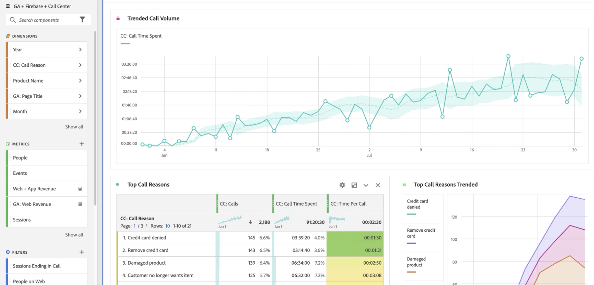
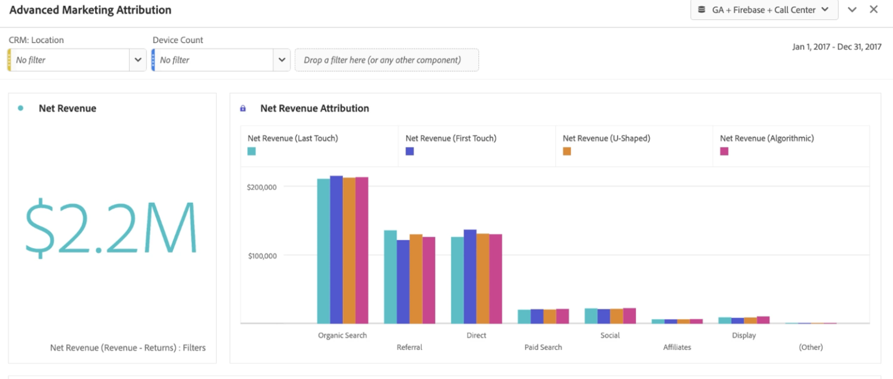

# Informar sobre los datos de Google Analytics en Customer Journey Analytics

Una vez que los datos están disponibles en Customer Journey Analytics, los siguientes ejemplos proporcionan escenarios útiles para la creación de informes sobre ellos.

## Visualizar datos web y datos de aplicaciones como conjuntos de datos combinados

Este diagrama de Venn muestra la superposición de usuarios en su sitio web (a partir de los datos de Google Analytics), en su aplicación móvil (a partir de los datos de Firebase) y en su centro de llamadas. También puede ver los productos de mayor rendimiento, no solo en la web, sino también en la aplicación móvil. Incluso puede obtener el total de ingresos de ambos, utilizando una métrica calculada. Observe cómo los productos principales cuentan una historia diferente al observar los ingresos combinados. Sin los conjuntos de datos combinados, nunca habría sabido que el &quot;Límite de sarga&quot; era un ejecutante tan fuerte.

## Identificar motivos de llamada y reducir el volumen de llamadas

Puede analizar la tendencia del tiempo invertido en el centro de llamadas durante los últimos dos meses para determinar el volumen de llamadas. El siguiente ejemplo muestra las tendencias de estos datos en los últimos dos meses. El siguiente ejemplo muestra una tendencia creciente, que puede afectar a los costes de organización.

El uso de la dimensión “Razón de la llamada” puede sugerir formas de mejorar la experiencia web, y evitar que los visitantes llamen en primer lugar. El ejemplo anterior muestra que “Producto dañado” tiene un tiempo de llamada promedio de casi 3 minutos por llamada, lo que proporciona a su organización una manera precisa de mejorar la experiencia del cliente y reducir los costes del centro de llamadas.

Puede ver qué productos provocan la mayoría de las llamadas a su centro de llamadas y cuántos clientes las hicieron. El gráfico de burbujas muestra que llamaron 20 000 personas, pasaron más de 4 horas y 30 minutos y devolvieron 33 unidades del producto &quot;Camiseta de manga corta para hombre&quot;.

Al aplicar un desglose de la dimensión “Razón de la llamada”, el ejemplo muestra un elemento de dimensión “Producto dañado”. El siguiente paso sería contactar con el departamento de control de calidad y ver por qué los clientes han estado recibiendo camisetas dañadas.

Puede ver qué páginas del sitio web condujeron las llamadas al centro de llamadas. Este informe le permite saber dónde se encuentran las experiencias menos óptimas en el sitio web y ayudar a los responsables de producto a resolver esos retos. El siguiente ejemplo utiliza una métrica calculada con un modelo de atribución de participación para filtrar los datos hasta que solo haya sesiones que hayan finalizado con una llamada al centro de llamadas.

El siguiente ejemplo muestra que las páginas “Carro de compras” e “Información de cierre” de compra dirigen la mayoría de las llamadas.

La tabla de cohorte permite ver cuánto tiempo tardan los usuarios en contactar con el centro de llamadas después de haber visitado el sitio web. El siguiente ejemplo indica que el tiempo promedio para este conjunto de datos de ejemplo es de entre tres y cuatro semanas.

## Uso de atribución de marketing avanzada

CJA le permite utilizar modelos de atribución sofisticados en datos de canales múltiples. En el siguiente ejemplo, se puede ver una comparación de la aplicación de Atribución de ingresos de último toque, primer toque, en forma de U y algorítmica a la dimensión Agrupación de canales de Google Analytics.

Con una métrica calculada, puede aplicar esa atribución a los ingresos de la web, los ingresos de las aplicaciones móviles e incluso eliminar las devoluciones de productos. Como resultado, puede ver ingresos netos reales para cada canal de marketing.

Attribution IQ también le permite filtrar sus datos. Solo se puede ver la atribución en determinados conjuntos de usuarios, como aquellos que utilizan más de un dispositivo.

También puede atribuir los ingresos de su aplicación y web al contenido de Google Ads. El ejemplo de este conjunto de datos obtuvo más ingresos gracias a la aplicación móvil impulsada por Google Ads en línea que por la web. Al ordenar los anuncios por ingresos de aplicaciones y web, se obtiene una imagen diferente de cuáles fueron los anuncios de Google con mayor rendimiento.

La combinación de conjuntos de datos en CJA le permite ver en este ejemplo que los anuncios en línea estaban teniendo algún impacto en los productos comprados en su aplicación móvil. La siguiente visualización muestra que los ingresos de la aplicación móvil procedentes de Google Ads representan un extra de 14 000 a 15 000 $, en comparación con la web solamente.

