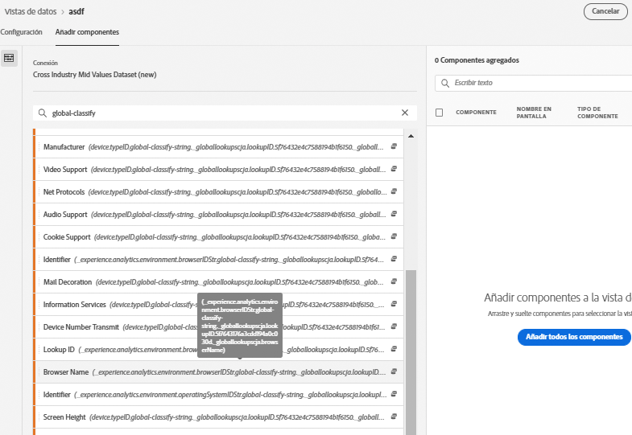
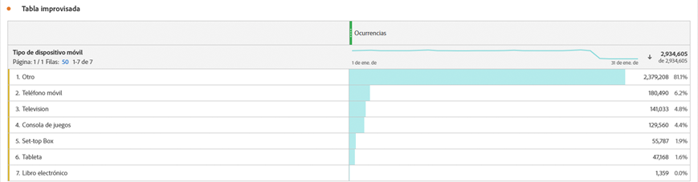

# Adición de búsquedas globales a los conjuntos de datos

Las búsquedas globales mejoran la capacidad de Customer Journey Analytics para informar sobre algunas dimensiones o atributos que no son útiles por sí mismos, pero que sí lo son cuando se unen con otros datos. Algunos ejemplos son los atributos de dispositivos móviles y los atributos de dimensiones del sistema operativo y del explorador, como, por ejemplo, los números de versión del explorador. Una &quot;búsqueda global&quot; es similar a un conjunto de datos de búsqueda. Sin embargo, las búsquedas globales son aplicables en todas las organizaciones con Experience Cloud. Se aplican automáticamente a todos los conjuntos de datos de evento que contienen determinados campos de esquema XDM (consulte la información sobre campos específicos a continuación). Existe un conjunto de datos de búsqueda global para cada ubicación de esquema que Adobe clasifica.

En Adobe Analytics tradicional, estas dimensiones aparecen por sí solas, mientras que en CJA hay que incluir activamente estas dimensiones al crear las vistas de datos. En el flujo de trabajo Conexiones, seleccione un conjunto de datos que esté marcado con una clave para la búsqueda global. La IU de vistas de datos sabe automáticamente que debe incluir todas las dimensiones de búsqueda global que estén disponibles para la creación de informes. Los archivos de búsqueda se mantienen actualizados automáticamente y están disponibles en todas las regiones y todas las cuentas. Se almacenan en organizaciones específicas de la región asociadas con el cliente.

## Uso de búsquedas globales con conjuntos de datos del conector de datos de Adobe

Los conjuntos de datos de búsqueda global se aplican automáticamente en el momento en que se crea el informe. Si está utilizando el Conector de datos de Analytics e introduce una dimensión para la que Adobe proporciona una búsqueda global, dicha búsqueda global se aplicará automáticamente. Si un conjunto de datos de evento contiene campos XDM, es posible aplicarle búsquedas globales.

## Campos de búsqueda globales disponibles

* `browser`
   * `browser`, `group_id`, `id`
* `browser_group`
   * `browser_group`, `id`
* `os`
   * `os`, `group_id`, `id`
* `os_group`
   * `os_group`, `id`
* `mobile_audio_support - multi`
* `mobile_color_depth`
* `mobile_cookie_support`
* `mobile_device_name`
* `mobile_device_number_transmit`
* `mobile_device_type`
* `mobile_drm - multi`
* `mobile_image_support - multi`
* `mobile_information_services`
* `mobile_java_vm - multi`
* `mobile_mail_decoration`
* `mobile_manufacturer`
* `mobile_max_bookmark_url_length`
* `mobile_max_browser_url_length`
* `mobile_max_mail_url_length`
* `mobile_net_protocols - multi`
* `mobile_os`
* `mobile_push_to_talk`
* `mobile_screen_height`
* `mobile_screen_size`
* `mobile_screen_width`
* `mobile_video_support - multi`

## Informe sobre dimensiones de búsqueda global

Para informar sobre las dimensiones de búsqueda global, debe añadirlas al crear una vista de datos en Customer Journey Analytics:

A continuación, podrá ver los datos de búsqueda en Workspace:

