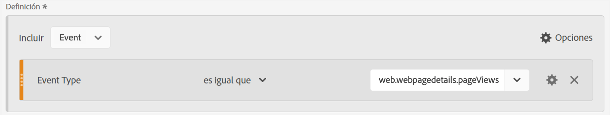

# Ingesta de datos de Marketo Engage en AEP e informa en CJA

Puede aprovechar los conjuntos de datos de Marketo Engage recién disponibles en Adobe Experience Platform (AEP) para ofrecer valiosas soluciones de análisis e informes a los especialistas en marketing B2B. A continuación, informe sobre estos conjuntos de datos en Customer Journey Analytics (CJA)

## Paso 1: Asignación de campos de datos de origen de Marketo a sus destinos XDM

Asigne la variable [Personas](https://experienceleague.adobe.com/docs/experience-platform/sources/connectors/adobe-applications/mapping/marketo.html?lang=en#persons) y [Actividades](https://experienceleague.adobe.com/docs/experience-platform/sources/connectors/adobe-applications/mapping/marketo.html?lang=en#activities) a sus respectivos campos de destino de esquema XDM.

## Paso 2: Ingesta de datos de Marketo en AEP

Utilice la variable [Conector del Marketo Engage](https://experienceleague.adobe.com/docs/experience-platform/sources/connectors/adobe-applications/marketo/marketo.html?lang=en) para llevar los datos de Marketo al Experience Platform y mantenerlos actualizados mediante aplicaciones conectadas a la plataforma.

## Paso 3: Configurar una conexión a este conjunto de datos en CJA

Para informar sobre conjuntos de datos de Experience Platform, primero debe establecer una conexión entre conjuntos de datos en Experience Platform y CJA. Encontrar más información en [Crear una conexión](https://experienceleague.adobe.com/docs/analytics-platform/using/cja-connections/create-connection.html?lang=es).

## Paso 4: Crear una o más vistas de datos

A [vista de datos](/help/data-views/data-views.md) es un contenedor específico de Customer Journey Analytics que permite determinar cómo interpretar los datos de una conexión. Especifica todas las dimensiones y métricas disponibles en Analysis Workspace; en este caso, métricas y dimensiones específicas de Marketo. También especifica de qué columnas obtienen los datos esas dimensiones y métricas. Las vistas de datos se definen a fin de prepararse para la creación de informes en Analysis Workspace.

## Paso 5: Informar en Analysis Workspace

Un caso de uso que puede explorar es: ¿Cuántas visitas de páginas web de posibles clientes tuvimos entre abril y junio de 2020?

1. Apertura [Espacio de trabajo de Analytics](/help/analysis-workspace/home.md) y cree un nuevo proyecto.
Los clientes con B2B/B2P CDP pueden realizar análisis de tipo B2C en CJA. Los objetos B2B aún no están disponibles.

1. Cree un [filter](/help/components/filters/create-filters.md) para vistas de páginas web como se indica a continuación: Tipo de evento = web.webpagedetails.pageViews :

   

1. En la tabla improvisada, arrastre el filtro que ha creado: Vistas de página web y, a continuación, arrastre el intervalo de fechas Mes. Esto le proporciona visitas a la página web por posibles clientes cada mes:

   

1. O tire de las siguientes dimensiones: Clave de persona o Dirección de correo electrónico de trabajo. Esto le proporciona las visitas a la página web de cada posible cliente:

   
