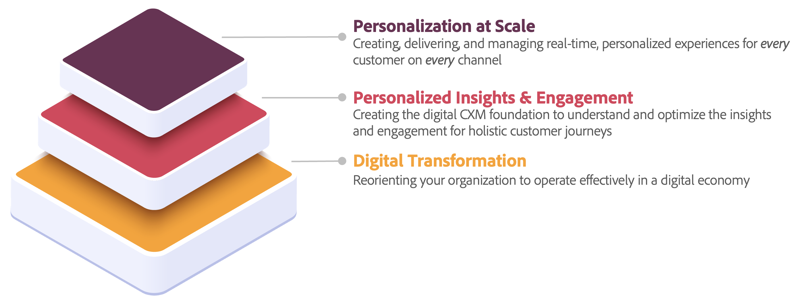

# Casos de uso de Perspectivas personalizadas y participación

Es posible que su empresa ya haya pasado años perfeccionando o creando sus iniciativas de transformación digital. Estas iniciativas son una gran base para la evolución de su empresa con el fin de reorientar toda su organización en una economía digital. Pero cuando miras cómo lograr el pináculo de *personalización a escala* Sin embargo, puede parecer que requiere mucho. Lograr la personalización a escala requiere la capacidad de tener una cadena de suministro de contenido, la capacidad de tener perspectivas y participación personalizadas, la capacidad de tener comercio y muchas otras aplicaciones que impulsen cada punto de contacto.

Perspectivas personalizadas y participación son la capa que se encuentra entre la transformación digital y la personalización a escala. Para lograr la personalización a escala y sacar el máximo partido a sus esfuerzos de transformación digital existentes, debe haber una base. Una base que comprende y optimiza todos los datos enriquecidos que tiene y que los prepara para la participación en todos los recorridos de cliente holísticos. Una vez que tenga el perfil de todo el cliente, puede personalizar a escala.

## Casos de uso

Actualmente, se han identificado una serie de casos de uso de perspectivas y participación personalizadas:

| Caso de uso | Descripción | Aplicaciones |
|---|---|---|
| [Reparticipación inteligente](https://experienceleague.adobe.com/en/docs/experience-platform/rtcdp/use-cases/personalization-insights-engagement/intelligent-re-engagement) | Vuelva a atraer de forma inteligente y responsable a los clientes que han abandonado una conversión antes de completarla. Actuar con inteligencia y empatía para crear experiencias, no recordatorios. | <ul><li>Customer Journey Analytics</li><li>Real-Time Customer Data Platform</li><li>Journey Optimizer</li></ul> |
| Campañas &quot;No pierdas&quot; | Reduzca la pérdida de clientes antes de que sea demasiado tarde. Vuelva a atraer a los clientes caducados para aumentar la conversión e impulsar el crecimiento del valor de vida útil del cliente. | <ul><li>Customer Journey Analytics</li><li>Real-Time Customer Data Platform</li><li>Journey Optimizer</li></ul> |
| [Optimización de conversión de cliente](customer-conversion-optimization.md) | Avanzar un cliente potencial que se encuentra actualmente en la fase de consideración para convertirse en cliente convertido. Tenga en cuenta las necesidades de conversión de cada cliente, en lugar de buscar únicamente la tasa de conversión agregada. | <ul><li>Customer Journey Analytics</li><li>Real-Time Customer Data Platform</li><li>Journey Optimizer</li></ul> |
| Reconocimiento contextual | Personalice para usuarios reconocidos independientemente de su estado de autenticación actual. Tenga en cuenta el contexto actual y ofrezca la mejor experiencia personalizada posible. | <ul><li>Real-Time Customer Data Platform</li><li>Customer Journey Analytics</li></ul> |
| [Cambio del valor único al valor de duración](https://experienceleague.adobe.com/en/docs/experience-platform/rtcdp/use-cases/personalization-insights-engagement/evolve-one-time-value-to-lifetime-value) | Cree campañas personalizadas para ofrecer los mejores productos o servicios complementarios en función de los atributos, el comportamiento y las compras anteriores de un cliente específico. | <ul><li>Real-Time Customer Data Platform</li><li>Journey Optimizer</li></ul> |
| De clientes potenciales a clientes | Haga crecer su negocio al encontrar y adquirir nuevos clientes sin cookies de terceros. Comprenda tanto el rendimiento como la eficacia de estas nuevas perspectivas para optimizar la segmentación y las experiencias. | <ul><li>Real-Time Customer Data Platform</li><li>Customer Journey Analytics</li></ul> |

Cada caso de uso se documenta con la siguiente estructura:

- **Información general**

  En la sección de información general, se proporciona una descripción general del uso. En la subsección Salida con la subsección anterior, se describe el enfoque tradicional para el caso de uso. La sección En con la nueva subsección describe un nuevo enfoque para el caso de uso.

- **Requisitos previos y planificación**

  Esta sección detalla los requisitos previos y la planificación necesaria por adelantado antes de poder implementar el caso de uso.

- **Aplicaciones y capacidades**

  Para implementar el caso de uso correctamente, esta sección describe las aplicaciones y sus funcionalidades.

- **Ejemplo**

  La sección Ejemplo detalla un ejemplo específico del caso de uso con

- **Valor** e

  Esta última sección proporciona una descripción general del valor que puede obtener de la implementación del caso de uso.
