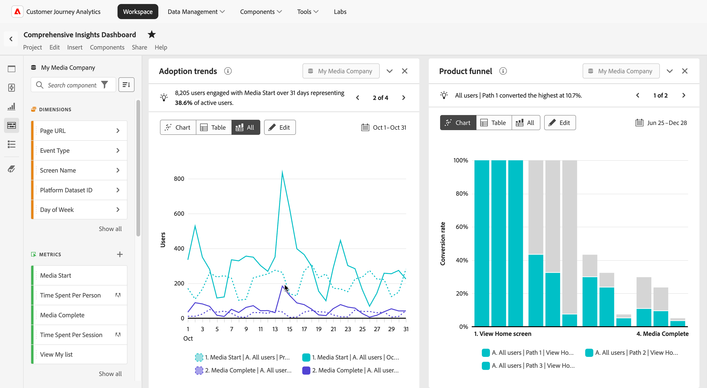

# Análisis de productos en Customer Journey Analytics

El análisis de productos es el proceso de comprender cómo los usuarios interactúan con el producto en cada fase de su recorrido. Implica analizar datos para descubrir perspectivas sobre el comportamiento del usuario, el rendimiento del producto y las oportunidades de crecimiento. Un análisis de producto eficaz ayuda a los equipos a tomar decisiones informadas para mejorar las experiencias de los usuarios, impulsar la participación y lograr los objetivos empresariales.

Customer Journey Analytics ofrece a los equipos las herramientas necesarias para analizar y optimizar las experiencias de los productos con las siguientes capacidades:

* **Administrar datos de productos a escala**: Ingeste, transforme y administre fácilmente datos de productos para satisfacer sus necesidades comerciales, lo que garantiza perspectivas confiables.
* **Adquisición y activación de medidas**: haga un seguimiento de cómo los nuevos usuarios descubren su producto y se relacionan con los primeros eventos que generan valor.
* **Medir la participación y la adopción**: comprenda cómo progresan los usuarios en el funnel del producto, identifique los puntos de fricción y rastree la adopción de características clave.
* **Medir la retención y la pérdida**: Analice la retención de usuarios a lo largo del tiempo, identifique los indicadores de pérdida y desarrolle estrategias para reducir la pérdida y aumentar la lealtad.
* **Perspectivas de productos de acción**: convierta las perspectivas basadas en datos en estrategias procesables para mejorar la experiencia del usuario e impulsar el crecimiento sostenible de los productos.
* **Comparta perspectivas con su organización**: comunique los hallazgos clave entre equipos para alinear esfuerzos, fomentar la colaboración y garantizar que todos trabajen en pos de objetivos empresariales y de productos compartidos.

Al aprovechar estas capacidades, Customer Journey Analytics le permite desbloquear todo el potencial de su producto y crear un enfoque fluido basado en datos para impulsar el éxito del usuario y la empresa.

## Administración de datos de productos a escala

Los datos precisos del producto son la piedra angular de un análisis eficaz del producto. La ingesta de datos se refiere al proceso de instrumentar y recopilar datos de productos, mientras que la administración de datos implica transformar y mantener estos datos para garantizar que cumplan con sus requisitos analíticos.

Las siguientes funciones de Adobe Experience Platform y Customer Journey Analytics le permiten introducir y administrar los datos de sus productos a escala:

* Adobe Experience Platform
   * [Conjuntos de datos&#x200B;](https://experienceleague.adobe.com/en/docs/experience-platform/catalog/datasets/overview)
   * [Preparación de datos&#x200B;](https://experienceleague.adobe.com/es/docs/experience-platform/data-prep/home)
   * [Distiller de datos&#x200B;](https://experienceleague.adobe.com/en/docs/experience-platform/query/data-distiller/overview)
* Customer Journey Analytics
   * [Conexiones&#x200B;](/help/connections/overview.md)
   * [Vistas de datos](/help/data-views/data-views.md), incluidos [campos derivados&#x200B;](/help/data-views/derived-fields/derived-fields.md)
   * [Segmentos&#x200B;](/help/components/segments/seg-overview.md)
   * [Métricas calculadas &#x200B;](/help/components/calc-metrics/calc-metr-overview.md)
   * [Análisis guiado&#x200B;: Cronología&#x200B;](/help/guided-analysis/types/timeline.md)

## Medir adquisición y activación

El crecimiento del producto depende de perspectivas procesables de funnel que atraigan a nuevos usuarios, revelen las rutas de conversión y eliminen la fricción a lo largo del recorrido.

* La adquisición realiza un seguimiento de los nuevos usuarios que llegan a su producto, incluido cómo llegan y qué esfuerzos son los más o menos efectivos.
* Activation supervisa a los nuevos usuarios que se relacionan con su primer evento de valor, definido según sus objetivos específicos.

Las siguientes funciones de Customer Journey Analytics le permiten medir tanto la adquisición como la activación de forma eficaz:

* [Análisis guiado&#x200B;: Crecimiento activo](/help/guided-analysis/types/active-growth.md)
* [Análisis guiado: crecimiento neto](/help/guided-analysis/types/net-growth.md)
* [Análisis guiado: tendencias](/help/guided-analysis//types/trends.md)
* [Panel de Attribution&#x200B;](/help/analysis-workspace/c-panels/attribution.md)
* [Tabla de forma libre](/help/analysis-workspace/c-panels/freeform-panel.md) que incluye la dimensión de canal de marketing (creando mediante un [campo derivado](/help/data-views/derived-fields/derived-fields.md))

## Medir la participación y la adopción

La adquisición de nuevos usuarios amplía la parte superior de su funnel de productos. La participación se centra en guiar a estos usuarios más abajo en funnel y en eliminar los obstáculos a su éxito. Su éxito impulsa directamente el éxito de su negocio.

Las siguientes funciones de Customer Journey Analytics le ayudan a realizar un seguimiento de la participación y adopción de productos:

* [Análisis guiado: participación](/help/guided-analysis/types/engagement.md)
* [Análisis guiado: tendencias](/help/guided-analysis/types/trends.md)
* [Análisis guiado: frecuencia](/help/guided-analysis/types/frequency.md)
* [Análisis guiado: Funnel](/help/guided-analysis/types/funnel.md)
* [Análisis guiado: Tendencias de conversión](/help/guided-analysis/types/conversion-trends.md)
* [Análisis guiado: Impacto de la versión](/help/guided-analysis/types/release-impact.md)
* [Análisis guiado: Impacto del primer uso&#x200B;](/help/guided-analysis/types/first-use-impact.md)
* [Análisis guiado: línea de tiempo](/help/guided-analysis/types/timeline.md)
* [Tablas improvisadas&#x200B;](/help/analysis-workspace/c-panels/freeform-panel.md)
* [Flujo](/help/analysis-workspace/visualizations/c-flow/flow.md)

## Medir la retención y la pérdida

La retención mide cuántos usuarios siguen interactuando con el producto después de su adquisición y activación iniciales. Los productos de alto rendimiento mantienen una base de usuarios estable y leal al maximizar la interacción con las funciones que más se correlacionan con el uso continuo. Un usuario retenido regresa e interactúa con el producto a lo largo del tiempo, mientras que un usuario perdido no lo hace. Los equipos de productos hacen un seguimiento de la retención para identificar las funciones que impulsan la participación continua y diseñar intervenciones que desplazan a los usuarios perdidos hacia un comportamiento del usuario retenido.

Las siguientes funciones de Customer Journey Analytics le ayudan a realizar un seguimiento de la retención y la pérdida de forma eficaz:

* [Análisis guiado: Retención](/help/guided-analysis/types/retention.md)&#x200B;
* [Análisis guiado: crecimiento activo](/help/guided-analysis/types/active-growth.md)
* [Análisis guiado: crecimiento neto](/help/guided-analysis/types/net-growth.md)
* [Tabla de cohortes&#x200B;](/help/analysis-workspace/visualizations/cohort-table/cohort-analysis.md)

## Perspectivas de productos procesables

Las perspectivas solo proporcionan valor cuando impulsan la acción. Convierta los resultados de los análisis en acciones que mejoren la experiencia del usuario y apoyen el crecimiento de productos a largo plazo.

Las siguientes funciones de Experience Cloud le permiten actuar sobre las perspectivas de forma eficaz:

* [Crear y publicar audiencias](/help/components/audiences/publish.md)&#x200B; para la activación desde Customer Journey Analytics
* Activar audiencias a través de productos de Experience Cloud:
   * [Ejecute experimentos](https://experienceleague.adobe.com/es/docs/journey-optimizer/using/content-management/content-experiment/get-started-experiment) en AJO y Adobe Target y mida el impacto de las variaciones en Customer Journey Analytics mediante el [panel Experimentación](/help/analysis-workspace/c-panels/experimentation.md)
   * [Entregue compromisos en la aplicación](https://experienceleague.adobe.com/en/docs/journey-optimizer/using/channels/in-app/get-started-in-app) a los usuarios en AJO
* [Activar audiencias](https://experienceleague.adobe.com/en/docs/experience-platform/destinations/ui/activate/activation-overview) en destinos externos con Adobe Real-time CDP&#x200B;

## Comparta perspectivas con la organización&#x200B;

Comunique los resultados clave entre los equipos para alinear los esfuerzos, fomentar la colaboración y garantizar que todos trabajen en pos de objetivos empresariales y de productos compartidos.

Las siguientes funciones de Customer Journey Analytics le ayudan a compartir perspectivas de forma eficaz:

* [Compartir](/help/analysis-workspace/curate-share/share-projects.md) vistas de análisis guiadas adaptadas a preguntas comerciales específicas, lo que permite a los consumidores responder automáticamente a su siguiente pregunta
* Combine análisis guiados, paneles y visualizaciones en un tablero completo en [Analysis Workspace](/help/analysis-workspace/home.md)
* Cree una [tarjeta de puntuación móvil](/help/mobile-app/home.md) con información clave del producto para ejecutivos y otros consumidores en sus desplazamientos
