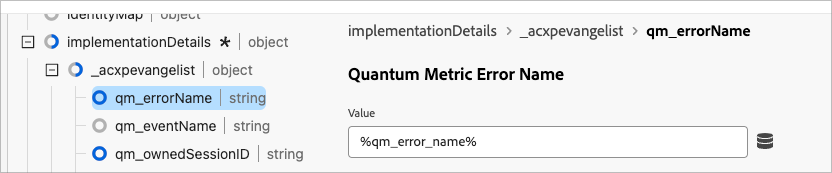
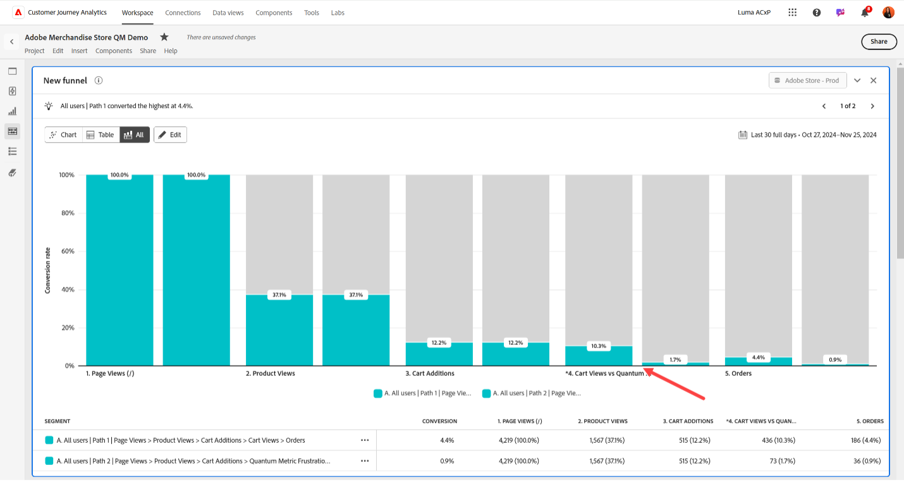

# Añadir eventos de fricción de métricas cuánticas a Customer Journey Analytics

La métrica cuántica recopila eventos de fricción como la lentitud de carga de la página, los errores de carga de página, los clics de ira, etc. Estos eventos se pueden pasar a Customer Journey Analytics como eventos complementarios en el recorrido del usuario. Con esta combinación de datos, puede comprender mejor el impacto de la fricción en las métricas descendentes.

## Requisitos previos:

Este caso de uso tiene dos requisitos:

* Debe tener derecho al paquete **operaciones de desarrollo** de la métrica cuántica.
* Debe utilizar etiquetas en la recopilación de datos de Adobe Experience Platform.

## Paso 1: Crear un campo de esquema para dar cabida a los eventos de fricción de métricas cuánticas

Este caso de uso requiere un campo de esquema dedicado al que enviar datos. Puede crear este campo en cualquier ubicación deseada del esquema y ponerle el nombre que desee. Se proporcionan valores de ejemplo si su organización no tiene preferencias en cuanto a nombre o ubicación.

1. Inicie sesión en [experience.adobe.com](https://experience.adobe.com).
1. Vaya a **[!UICONTROL Recopilación de datos]** > **[!UICONTROL Esquemas]**.
1. Seleccione el esquema que desee en la lista.
1. Seleccione el icono  junto al objeto deseado. Por ejemplo, junto a `Implementation Details`.
1. A la derecha, ingrese el [!UICONTROL Nombre] deseado. Por ejemplo, `qmErrorName`.
1. Escriba el [!UICONTROL nombre para mostrar] deseado. Por ejemplo, `Quantum Metric error name`.
1. Seleccione [!UICONTROL Type] como **[!UICONTROL String]**.
1. Seleccione **[!UICONTROL Guardar]**.

## Paso 2: Capturar eventos de fricción utilizando la extensión de etiqueta de métrica cuántica

Consulte [Extensión de métrica cuántica](https://experienceleague.adobe.com/es/docs/experience-platform/destinations/catalog/analytics/quantum-metric) en la guía Destinos de Adobe Experience Platform para obtener instrucciones sobre cómo configurar las etiquetas para incluir datos de métrica cuántica. El uso de esta extensión pasa más filas a un conjunto de datos existente.

Utilice etiquetas en la recopilación de datos de Adobe Experience Platform para definir manualmente el nombre del evento de fricción de modo que se pueda incluir en el objeto XDM y analizarse. Una forma de hacerlo es mediante el código personalizado de la regla:

```js
_satellite.setVar('qm_error_name','error rage click');
return true;
```

A continuación, añada el elemento de datos definido dinámicamente al objeto XDM:



## Paso 3: Añadir una o más dimensiones y métricas a la vista de datos en Customer Journey Analytics

Edite la vista de datos existente para añadir el ID de sesión como una dimensión disponible en Customer Journey Analytics.

1. Inicie sesión en [experience.adobe.com](https://experience.adobe.com).
1. Vaya a Customer Journey Analytics y seleccione **[!UICONTROL Vistas de datos]**, opcionalmente desde **[!UICONTROL Administración de datos]**, en el menú superior.
1. Seleccione la vista de datos existente que desee.
1. Busque la lista del campo de evento de fricción de métrica cuántica a la izquierda y arrástrela al área de métricas en el centro.
1. En el panel derecho, establezca la configuración [Incluir/Excluir valores](/help/data-views/component-settings/include-exclude-values.md) en los eventos de fricción que desee rastrear. Se pueden añadir varios eventos de fricción a la misma métrica para combinarlos. También puede arrastrar otra copia del campo de eventos de fricción al área de métricas para rastrear otros eventos de fricción como una métrica independiente.
1. Cuando haya creado todas las dimensiones y métricas deseadas, haga clic en **[!UICONTROL Guardar]**.
1. Para obtener una lista completa de los eventos de error, consulte la documentación de la métrica cuántica. Si tiene más preguntas, comuníquese con el representante de atención al cliente de la métrica cuántica o envíe una solicitud a través del [Portal de solicitudes de clientes de métricas cuánticas](https://community.quantummetric.com/s/public-support-page).

## Paso 4: Uso de la dimensión y las métricas con el resto de los datos en Analysis Workspace

Con los datos de eventos de fricción de métricas cuánticas recopilados junto con el resto de los datos de visitantes, puede utilizarlos exactamente como lo haría con cualquier otra dimensión o métrica en Customer Journey Analytics.

1. Inicie sesión en [experience.adobe.com](https://experience.adobe.com).
1. Vaya a Customer Journey Analytics y seleccione **[!UICONTROL Workspace]** en el menú superior.
1. Seleccione un proyecto existente o cree un proyecto.
1. Crear [tabla de forma libre](/help/analysis-workspace/visualizations/freeform-table/freeform-table.md).
1. Arrastre las dimensiones y métricas deseadas al lienzo de Workspace para su análisis.



Las posibles ideas de análisis incluyen:

* Tendencia de datos de eventos de fricción a lo largo del tiempo
* En una visualización de visitas en el orden previsto o de canal, añada eventos de Customer Journey Analytics como algunos pasos y eventos de fricción de métricas cuánticas como otros. Este informe permite ver dónde se producen los problemas más comunes de los visitantes.
* Cree y aplique un segmento para los visitantes que experimenten eventos de fricción para un análisis más profundo
