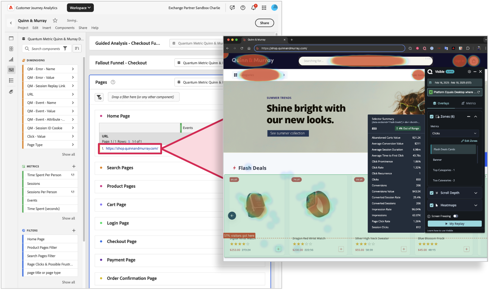

# Uso de mapas de calor de métricas cuánticas con Customer Journey Analytics

La vinculación de la asignación de calor de métricas cuánticas a datos de CJA le permite comprender mejor la participación a nivel de página y optimizar las páginas en función del comportamiento de los consumidores. Workspace se puede utilizar para comprender los flujos de usuarios consumidores y ver qué rutas siguen los consumidores de una página a otra. A continuación, puede hacer clic en las URL de la página con hipervínculos para crear un mapa de calor visual de cómo los usuarios interactúan con el contenido. Al vincular la asignación de calor de métrica cuántica a CJA, ahora puede asociar interacciones a nivel de página con resultados empresariales, llevando el análisis al siguiente nivel.

La tabla muestra todas las sesiones de ese segmento y puede hacer clic en cualquiera de ellas para explorarlas más en QM.  Obtenga más información acerca de la reproducción de la sesión de métricas cuánticas en https://www.quantummetric.com/platform/session-replay

## Requisitos previos

Debe tener derecho al paquete **Operaciones de experiencia de usuario** de Quantum Metric para acceder a las capacidades de mapa de calor de Quantum Metric.

## Paso 1: Configuración de vínculos en Analysis Workspace

1. Inicie sesión en [experience.adobe.com](https://experience.adobe.com).
1. Vaya a Customer Journey Analytics y seleccione **[!UICONTROL Workspace]** en el menú superior.
1. Seleccione un proyecto existente o cree un proyecto.
1. Crear [tabla de forma libre](/help/analysis-workspace/visualizations/freeform-table/freeform-table.md).
1. Arrastre la dimensión URL de la página al lienzo de Workspace.
1. Haga clic con el botón secundario en el encabezado de columna de dimensión y, a continuación, seleccione **[!UICONTROL Crear hipervínculos para todos los elementos de dimensión]**.
1. Seleccione **[!UICONTROL Crear una dirección URL personalizada]**.
1. Pegue la siguiente estructura de URL:

   ```
   $value?qm-visible=true
   ```

1. Haga clic en **[!UICONTROL Crear]**.
1. Pruebe uno de los vínculos para ver si se abre en la dirección URL con la extensión de métrica cuántica visible. Estos vínculos se abren en una nueva pestaña para que el proyecto de Workspace permanezca abierto.



## Paso 2: Ver los mapas de calor haciendo clic en los vínculos de Customer Journey Analytics

Una vez que haya encontrado una página que desea explorar en la asignación de calor, puede aplicarla al panel deseado. La tabla devuelve una URL que permite explorar mapas de calor, profundidad de desplazamiento y zonas clave para la interacción mediante la métrica cuántica. Consulte [Descripción general del producto del mapa de calor de la métrica cuántica](https://www.quantummetric.com/platform/interaction-heatmaps) para obtener más información. También puede ponerse en contacto con el representante de atención al cliente de la métrica cuántica o enviar una solicitud a través del [Portal de solicitudes de clientes de la métrica cuántica](https://community.quantummetric.com/s/public-support-page).
