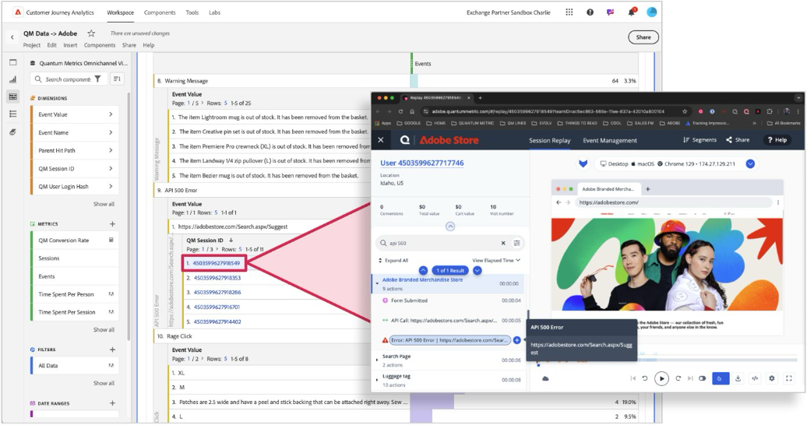

# La sesión de métrica cuántica de tiempo se reproduce en los datos de Customer Journey Analytics

Al vincular las reproducciones de sesiones de métricas cuánticas con los datos de CJA, los clientes pueden comprender mejor &quot;el por qué&quot; detrás de &quot;el qué&quot;.  Workspace se puede utilizar para detectar sesiones con fricción. A continuación, puede hacer clic en los ID de sesión con hipervínculos para explorar la reproducción de la sesión en la métrica cuántica.  Estos datos permiten ver el comportamiento dentro de una sesión y comprender mejor qué es lo que impulsa la fricción del consumidor.  A través de las reproducciones de sesión vinculadas con CJA, puede capturar el contexto crítico en torno al comportamiento de los clientes en su experiencia.

## Requisitos previos

En estos pasos se da por hecho que utiliza etiquetas en la recopilación de datos de Adobe Experience Platform. Puede adaptar estos métodos de recopilación de datos a una implementación manual de Web SDK si su organización no utiliza etiquetas.

Consulte la documentación de la [extensión de etiqueta de métrica cuántica](https://experienceleague.adobe.com/en/docs/experience-platform/destinations/catalog/analytics/quantum-metric) para obtener más información.

## Paso 1: Crear un campo de esquema para dar cabida al ID de sesión de métrica cuántica

Este caso de uso requiere un campo de esquema dedicado al que enviar datos. Puede crear este campo en cualquier ubicación deseada del esquema y ponerle el nombre que desee. Se proporcionan valores de ejemplo si su organización no tiene preferencias en cuanto a nombre o ubicación.

1. Inicie sesión en [experience.adobe.com](https://experience.adobe.com).
1. Vaya a **[!UICONTROL Recopilación de datos]** > **[!UICONTROL Esquemas]**.
1. Seleccione el esquema que desee en la lista.
1. Seleccione el icono  junto al objeto deseado. Por ejemplo, junto a `Implementation Details`.
1. A la derecha, ingrese el [!UICONTROL Nombre] deseado. Por ejemplo, `qmSessionId`.
1. Escriba el [!UICONTROL nombre para mostrar] deseado. Por ejemplo, `Quantum Metric session ID`.
1. Seleccione [!UICONTROL Type] como **[!UICONTROL String]**.
1. Seleccione **[!UICONTROL Guardar]**.

## Paso 2: Recopilar el ID de sesión de métrica cuántica con la extensión de etiqueta de métrica cuántica

Siga estos pasos para anexar el ID de sesión de métrica cuántica a los datos que envía a Adobe Experience Platform.

1. Inicie sesión en [experience.adobe.com](https://experience.adobe.com).
1. Vaya a **[!UICONTROL Recopilación de datos]** > **[!UICONTROL Etiquetas]**.
1. Seleccione la propiedad de etiquetas que desee.
1. Seleccione **[!UICONTROL Elementos de datos]** y luego seleccione **[!UICONTROL Agregar elemento de datos]**.
1. Establezca la siguiente configuración:
   * **[!UICONTROL Nombre]**: `Quantum Metric session ID`
   * **[!UICONTROL Extensión]**: [!UICONTROL Principal]
   * **[!UICONTROL Tipo de elemento de datos]**: [!UICONTROL Código personalizado]
1. Seleccione el botón **[!UICONTROL Abrir editor]** y pegue el siguiente código:

   ```js
   // Check for the presence of the Quantum Metric session ID cookie
   const qmCookie = _satellite.cookie.get("QuantumMetricSessionID");
   if(qmCookie != null) return qmCookie;
   // If a cookie is not set, check local storage
   const qmLocalStorage = JSON.parse(localStorage.getItem("QM_S") || "{}");
   if (qmLocalStorage?.s != null) return qmLocalStorage.s;
   ```

1. Seleccione **[!UICONTROL Guardar]**.

## Paso 3: Asignar el elemento de datos al campo de esquema XDM deseado

Ahora que el elemento de datos tiene lógica para obtener el valor deseado, asigne el elemento de datos al objeto XDM.

1. En la propiedad de etiqueta, seleccione **[!UICONTROL Elementos de datos]** y, a continuación, seleccione el elemento de datos que aloja el objeto XDM.
1. En la columna derecha de este elemento de datos, vaya a la ruta establecida al crear el campo de esquema.
1. Establezca el valor en el nombre del elemento de datos rodeado de símbolos de porcentaje. Por ejemplo, `%Quantum Metric session ID%`.
1. Seleccione **[!UICONTROL Guardar]**.
1. Añada una biblioteca y, a continuación, publique los cambios en la producción.

Si el objeto XDM ya está incluido en una configuración de acción de evento de envío, empezará a ver los datos cuando se publiquen los cambios.

>[!NOTE]
>
>A veces, Web SDK se ejecuta más rápido que el código de métrica cuántica. En estos casos, el ID de sesión se envía en la visita posterior. Si un visitante regresa, el ID de sesión no se recopila en estas instancias.

## Paso 3: Añadir el ID de sesión de métrica cuántica como dimensión disponible

Una vez que la implementación haya publicado los cambios anteriores, edite la vista de datos existente para agregar el ID de sesión como una dimensión disponible en Customer Journey Analytics.

1. Inicie sesión en [experience.adobe.com](https://experience.adobe.com).
1. Vaya a Customer Journey Analytics y seleccione **[!UICONTROL Vistas de datos]** en el menú superior.
1. Seleccione la vista de datos existente que desee.
1. Busque el campo ID de sesión de métrica cuántica a la izquierda y arrástrelo al área de dimensiones en el centro.
1. En el panel derecho, establezca la configuración de [persistencia](/help/data-views/component-settings/persistence.md) en `Session`.
1. Seleccione **[!UICONTROL Guardar]**.

## Paso 4: Configuración de Analysis Workspace para que se ajuste a la dimensión de ID de sesión

Cree una tabla de forma libre en Workspace y configúrela para que los valores de ID de sesión se vinculen directamente a la métrica cuántica.

1. Inicie sesión en [experience.adobe.com](https://experience.adobe.com).
1. Vaya a Customer Journey Analytics y seleccione **[!UICONTROL Workspace]** en el menú superior.
1. Seleccione un proyecto existente o cree un proyecto.
1. Crear [tabla de forma libre](/help/analysis-workspace/visualizations/freeform-table/freeform-table.md).
1. Arrastre la dimensión ID de sesión al lienzo de Workspace.
1. Haga clic con el botón secundario en el encabezado de columna de dimensión y, a continuación, seleccione **[!UICONTROL Crear hipervínculos para todos los elementos de dimensión]**.
1. Seleccione **[!UICONTROL Crear una dirección URL personalizada]**.
1. Pegue la siguiente estructura de URL:

   ```
   https://adobe.quantummetric.com/#/replay/cookie:$value
   ```

1. Haga clic en **[!UICONTROL Crear]**.

Ahora, cada ID de sesión es un vínculo en el que puede hacer clic. Consulte [Crear hipervínculos en una tabla de forma libre](/help/analysis-workspace/visualizations/freeform-table/freeform-table-hyperlinks.md) para obtener más información sobre cómo agregar hipervínculos a elementos de dimensión de Analysis Workspace.



## Paso 5: Ver sesiones desde Customer Journey Analytics

Una vez que haya encontrado un segmento interesante que desee explorar en las repeticiones de sesión, puede aplicarlo al panel que incluye los vínculos del ID de sesión. La tabla devuelve todas las sesiones de ese segmento y puede hacer clic en cualquiera de ellas para explorarlas más en Métrica cuántica.

Consulte [La guía empresarial para la reproducción de sesión](https://www.quantummetric.com/resources/ebook/the-enterprise-guide-to-session-replay) en Métrica cuántica para obtener más información. También puede ponerse en contacto con el representante de atención al cliente de la métrica cuántica o enviar una solicitud a través del [Portal de solicitudes de clientes de la métrica cuántica](https://community.quantummetric.com/s/public-support-page).
